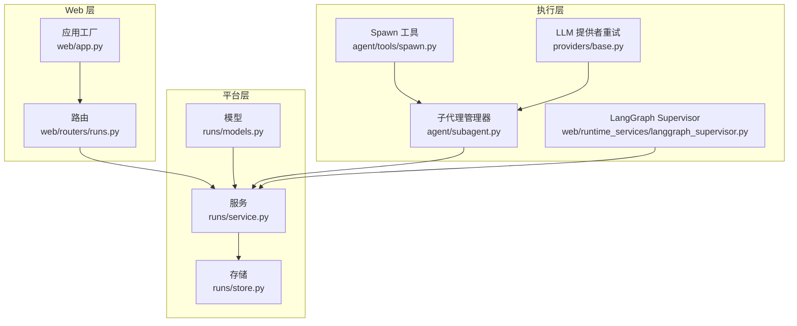
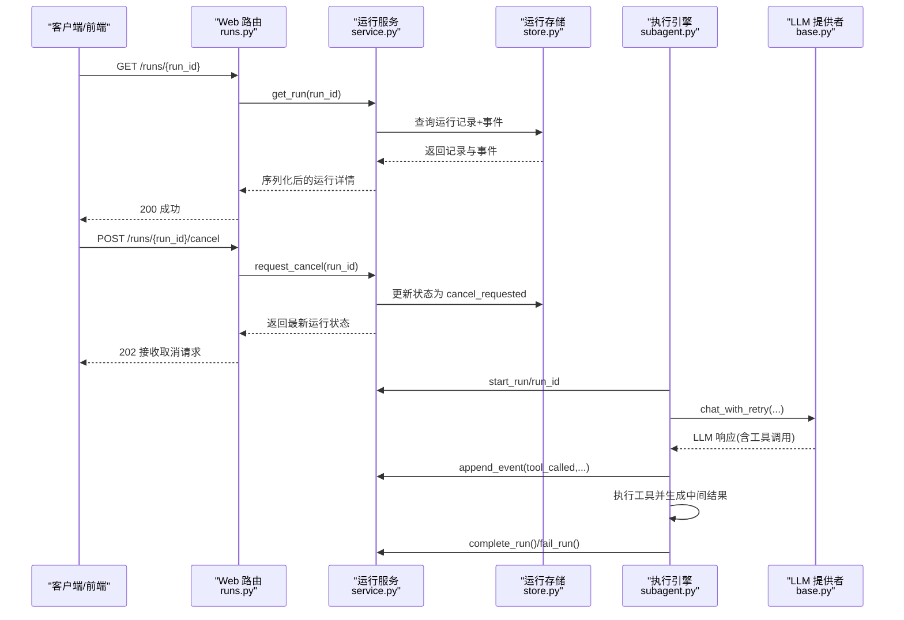
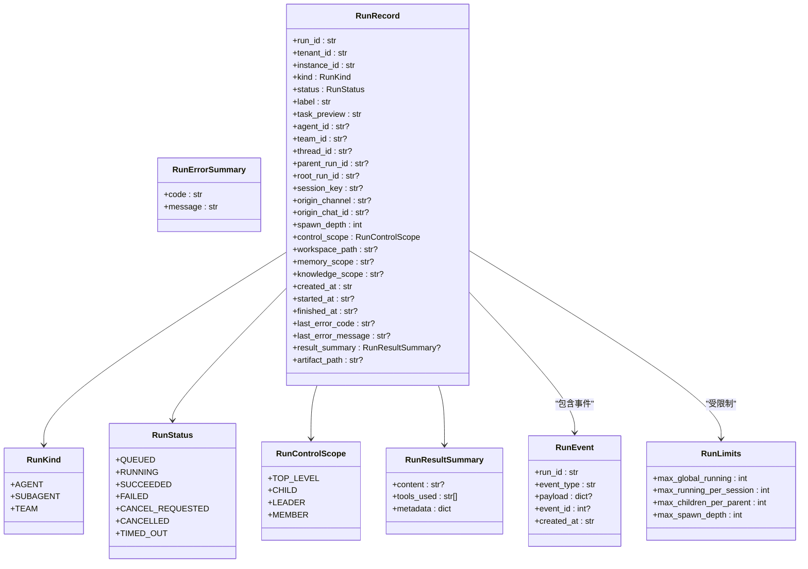
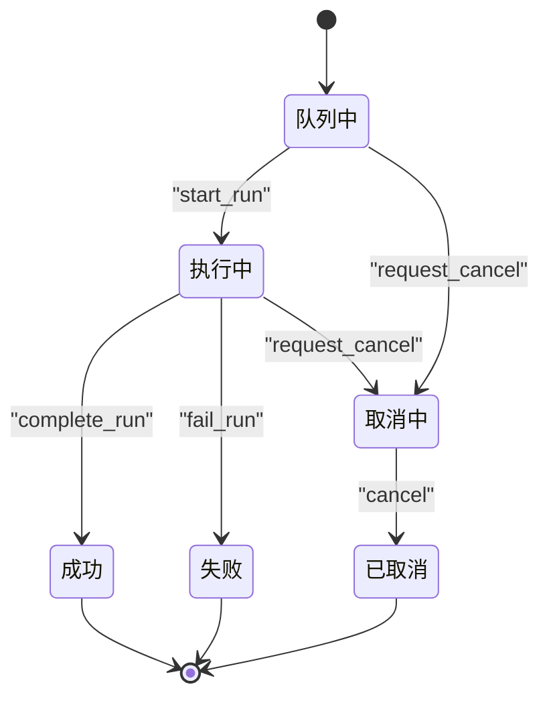
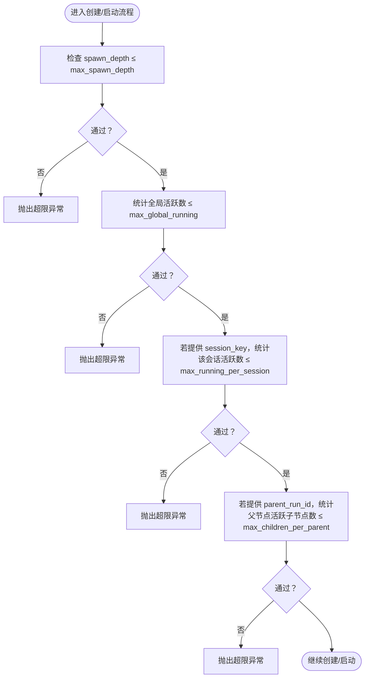
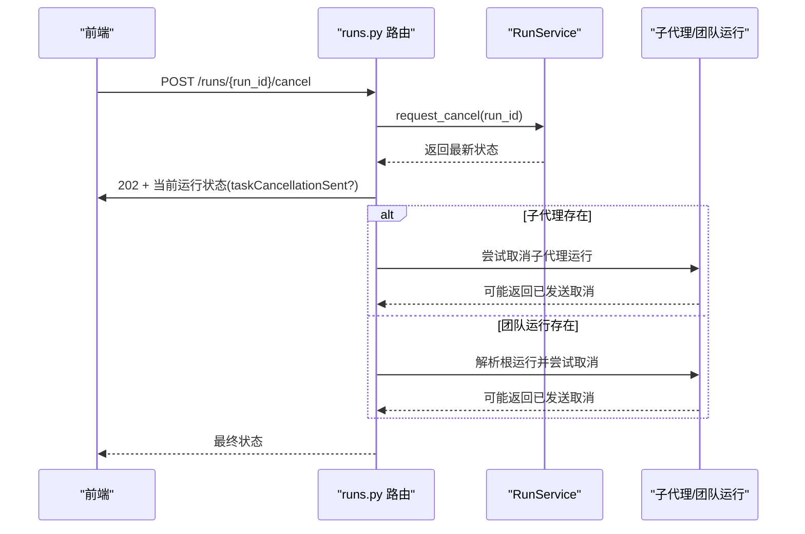
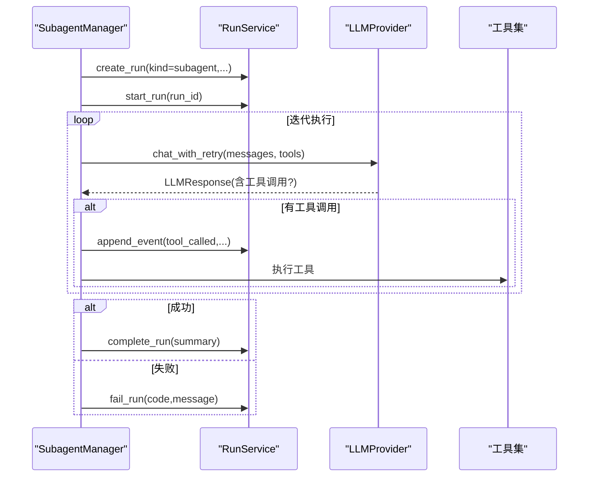
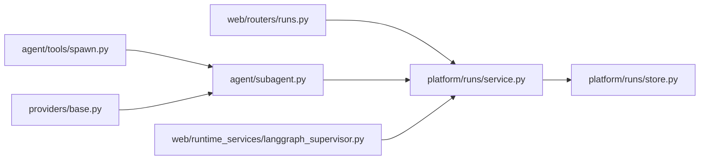

# 运行管理

<cite>
**本文引用的文件**
- [models.py](file://nanobot/platform/runs/models.py)
- [service.py](file://nanobot/platform/runs/service.py)
- [store.py](file://nanobot/platform/runs/store.py)
- [__init__.py](file://nanobot/platform/runs/__init__.py)
- [runs.py](file://nanobot/web/routers/runs.py)
- [subagent.py](file://nanobot/agent/subagent.py)
- [spawn.py](file://nanobot/agent/tools/spawn.py)
- [app.py](file://nanobot/web/app.py)
- [base.py](file://nanobot/providers/base.py)
- [langgraph_supervisor.py](file://nanobot/web/runtime_services/langgraph_supervisor.py)
- [runs.py（测试）](file://tests/test_run_registry.py)
</cite>

## 目录
1. [简介](#简介)
2. [项目结构](#项目结构)
3. [核心组件](#核心组件)
4. [架构总览](#架构总览)
5. [详细组件分析](#详细组件分析)
6. [依赖关系分析](#依赖关系分析)
7. [性能考量](#性能考量)
8. [故障排查指南](#故障排查指南)
9. [结论](#结论)
10. [附录](#附录)

## 简介
本章节概述 Nanobot 运行管理模块的目标与范围：围绕“运行任务”的数据模型、状态管理、调度与并发控制、事件与日志、错误处理与重试策略、API 接口与前端展示、以及与代理执行、渠道消息和外部系统的集成方式进行系统化说明。

## 项目结构
运行管理模块位于平台层的 runs 子域，采用“模型-服务-存储-路由”的分层设计：
- 模型层定义运行任务的数据结构与枚举类型
- 服务层封装运行生命周期、状态转换、限流与事件写入
- 存储层基于 SQLite 实现持久化与查询
- 路由层提供 REST API，供 Web UI 与外部系统调用
- 集成层通过子代理管理器与工具链触发实际任务执行，并回写运行状态

**图表来源**
- [models.py:1-161](file://nanobot/platform/runs/models.py#L1-L161)
- [service.py:1-338](file://nanobot/platform/runs/service.py#L1-L338)
- [store.py:1-371](file://nanobot/platform/runs/store.py#L1-L371)
- [runs.py:1-120](file://nanobot/web/routers/runs.py#L1-L120)
- [app.py:70-200](file://nanobot/web/app.py#L70-L200)
- [subagent.py:1-200](file://nanobot/agent/subagent.py#L1-L200)
- [spawn.py:43-74](file://nanobot/agent/tools/spawn.py#L43-L74)
- [base.py:192-271](file://nanobot/providers/base.py#L192-L271)
- [langgraph_supervisor.py:303-316](file://nanobot/web/runtime_services/langgraph_supervisor.py#L303-L316)

**章节来源**
- [models.py:1-161](file://nanobot/platform/runs/models.py#L1-L161)
- [service.py:1-338](file://nanobot/platform/runs/service.py#L1-L338)
- [store.py:1-371](file://nanobot/platform/runs/store.py#L1-L371)
- [runs.py:1-120](file://nanobot/web/routers/runs.py#L1-L120)
- [app.py:70-200](file://nanobot/web/app.py#L70-L200)

## 核心组件
- 数据模型
  - 运行种类、状态、控制作用域、结果摘要、错误摘要、事件、运行记录、默认运行限制
- 运行服务
  - 生命周期管理：创建、启动、完成、失败、请求取消、取消
  - 事件追加、制品写入与读取、树形查询、列表与计数
  - 并发与深度限制检查
- 运行存储
  - SQLite 表结构、索引、序列化/反序列化、增删改查
- Web 路由
  - 列表、详情、树、子运行、制品、取消
- 执行集成
  - 子代理管理器创建并驱动运行，工具链触发任务，LLM 提供者具备重试策略

**章节来源**
- [models.py:16-161](file://nanobot/platform/runs/models.py#L16-L161)
- [service.py:39-338](file://nanobot/platform/runs/service.py#L39-L338)
- [store.py:19-371](file://nanobot/platform/runs/store.py#L19-L371)
- [runs.py:14-120](file://nanobot/web/routers/runs.py#L14-L120)
- [subagent.py:28-200](file://nanobot/agent/subagent.py#L28-L200)
- [spawn.py:43-74](file://nanobot/agent/tools/spawn.py#L43-L74)
- [base.py:69-271](file://nanobot/providers/base.py#L69-L271)

## 架构总览
运行管理贯穿“Web 请求 → 运行服务 → 存储 → 执行引擎 → 回写状态”的闭环，支持多级并发限制与事件驱动的状态演进。

**图表来源**
- [runs.py:41-120](file://nanobot/web/routers/runs.py#L41-L120)
- [service.py:123-201](file://nanobot/platform/runs/service.py#L123-L201)
- [store.py:158-238](file://nanobot/platform/runs/store.py#L158-L238)
- [subagent.py:120-200](file://nanobot/agent/subagent.py#L120-L200)
- [base.py:192-271](file://nanobot/providers/base.py#L192-L271)

## 详细组件分析

### 数据模型与状态机
- 运行种类：agent、subagent、team
- 运行状态：queued、running、succeeded、failed、cancel_requested、cancelled、timed_out
- 控制作用域：top_level、child、leader、member
- 关键实体：RunRecord、RunResultSummary、RunErrorSummary、RunEvent、RunLimits
- 时间戳统一使用 UTC 的 ISO 字符串格式

**图表来源**
- [models.py:16-161](file://nanobot/platform/runs/models.py#L16-L161)

**章节来源**
- [models.py:16-161](file://nanobot/platform/runs/models.py#L16-L161)

### 运行服务与状态转换
- 创建：生成唯一 run_id，初始状态 queued，写入事件 queued
- 启动：从 queued 转换为 running，写入事件 started
- 完成：从 running 转换为 succeeded，写入事件 completed
- 失败：从 running 或 queued 转换为 failed，写入事件 failed
- 取消：
  - request_cancel：允许从 queued/running 转为 cancel_requested
  - cancel：若未终止则转为 cancelled
- 事件：append_event 写入 run_events
- 制品：write_markdown_artifact 写入文件；get_artifact 读取
- 查询：get_run/list_runs/get_run_tree/list_children/count_running_* 等

**图表来源**
- [service.py:133-197](file://nanobot/platform/runs/service.py#L133-L197)

**章节来源**
- [service.py:75-201](file://nanobot/platform/runs/service.py#L75-L201)

### 存储层与并发限制
- SQLite 表结构与索引覆盖 tenant/instance、status、root_run_id、parent_run_id、session_key、agent_id、team_id、created_at 等常用过滤字段
- 结果摘要序列化为 JSON 存储
- 并发限制检查：
  - 深度限制：spawn_depth ≤ max_spawn_depth
  - 全局并发：全局 running/queued/cancel_requested 计数 ≤ max_global_running
  - 会话并发：同一 session_key 的 running/queued/cancel_requested 计数 ≤ max_running_per_session
  - 父节点分支：父 run 的活跃子节点数量 ≤ max_children_per_parent

**图表来源**
- [service.py:320-337](file://nanobot/platform/runs/service.py#L320-L337)
- [store.py:297-323](file://nanobot/platform/runs/store.py#L297-L323)

**章节来源**
- [store.py:22-82](file://nanobot/platform/runs/store.py#L22-L82)
- [service.py:320-337](file://nanobot/platform/runs/service.py#L320-L337)

### Web API 与前端交互
- GET /api/v1/runs：分页查询运行记录
- GET /api/v1/runs/{run_id}：获取单个运行详情（含事件）
- GET /api/v1/runs/{run_id}/children：获取子运行
- GET /api/v1/runs/{run_id}/tree：获取运行树
- GET /api/v1/runs/{run_id}/artifact：获取运行制品
- POST /api/v1/runs/{run_id}/cancel：请求取消；若未直接处理，尝试向子代理或团队运行发送取消

**图表来源**
- [runs.py:81-120](file://nanobot/web/routers/runs.py#L81-L120)

**章节来源**
- [runs.py:14-120](file://nanobot/web/routers/runs.py#L14-L120)

### 执行集成与工具链
- 子代理管理器在创建运行后，异步执行任务循环，期间：
  - 调用 LLM 提供者的 chat_with_retry 获取响应
  - 若有工具调用，记录 tool_called 事件并执行工具
  - 成功时 complete_run，失败时 fail_run
- Spawn 工具用于在当前运行上下文中派生新的子运行，自动递增 spawn_depth
- LangGraph Supervisor 在成员任务被取消或异常时记录事件

**图表来源**
- [subagent.py:75-200](file://nanobot/agent/subagent.py#L75-L200)
- [spawn.py:60-74](file://nanobot/agent/tools/spawn.py#L60-L74)
- [base.py:192-271](file://nanobot/providers/base.py#L192-L271)
- [langgraph_supervisor.py:303-316](file://nanobot/web/runtime_services/langgraph_supervisor.py#L303-L316)

**章节来源**
- [subagent.py:55-200](file://nanobot/agent/subagent.py#L55-L200)
- [spawn.py:43-74](file://nanobot/agent/tools/spawn.py#L43-L74)
- [base.py:69-271](file://nanobot/providers/base.py#L69-L271)
- [langgraph_supervisor.py:303-316](file://nanobot/web/runtime_services/langgraph_supervisor.py#L303-L316)

### 日志、事件与制品
- 事件类型示例：queued、started、completed、failed、cancel_requested、cancelled、tool_called 等
- 制品：以 Markdown 文件形式保存，包含标题、元数据与分节内容
- 前端事件标签本地化映射，便于用户理解运行状态变化

**章节来源**
- [service.py:199-257](file://nanobot/platform/runs/service.py#L199-L257)
- [runs.py（测试）:19-61](file://tests/test_run_registry.py#L19-L61)

## 依赖关系分析
- 运行服务依赖运行存储进行持久化
- Web 路由依赖运行服务提供数据
- 子代理管理器与 LangGraph Supervisor 通过运行服务回写状态与事件
- LLM 提供者为执行层提供重试能力，降低瞬时错误影响

**图表来源**
- [runs.py:1-120](file://nanobot/web/routers/runs.py#L1-L120)
- [service.py:1-338](file://nanobot/platform/runs/service.py#L1-L338)
- [store.py:1-371](file://nanobot/platform/runs/store.py#L1-L371)
- [subagent.py:1-200](file://nanobot/agent/subagent.py#L1-L200)
- [spawn.py:43-74](file://nanobot/agent/tools/spawn.py#L43-L74)
- [base.py:192-271](file://nanobot/providers/base.py#L192-L271)
- [langgraph_supervisor.py:303-316](file://nanobot/web/runtime_services/langgraph_supervisor.py#L303-L316)

**章节来源**
- [app.py:70-200](file://nanobot/web/app.py#L70-L200)

## 性能考量
- 存储层通过多处索引优化常见过滤条件（tenant、instance、status、root_run_id、parent_run_id、session_key、agent_id、team_id、created_at），建议在高并发场景下保持这些字段的合理使用
- 事件写入采用自增主键，按事件 ID 升序查询，避免全表扫描
- 并发限制在服务层集中检查，减少数据库层面的复杂判断
- LLM 调用具备指数退避重试，降低瞬时错误导致的失败率

[本节为通用指导，无需列出具体文件来源]

## 故障排查指南
- 运行不存在
  - 现象：查询/取消等操作抛出“运行不存在”
  - 排查：确认 run_id 正确性与实例/租户上下文
  - 相关错误类型：RunNotFoundError
- 状态转换无效
  - 现象：从非允许状态发起转换（如从 succeeded 发起取消）
  - 排查：检查当前状态是否在允许集合内
  - 相关错误类型：RunStateError
- 超出并发限制
  - 现象：创建/启动时报错“超出并发限制”
  - 排查：检查全局活跃数、会话活跃数、父节点子节点数与最大限制
  - 相关错误类型：RunLimitExceededError
- 制品缺失
  - 现象：获取制品报错“制品不存在”
  - 排查：确认是否已写入制品、路径是否在配置目录内
  - 相关错误类型：RunArtifactNotFoundError
- LLM 瞬时错误
  - 现象：调用失败但可重试
  - 排查：检查错误内容是否包含瞬时错误标记，确认重试延迟与上限

**章节来源**
- [service.py:23-37](file://nanobot/platform/runs/service.py#L23-L37)
- [store.py:325-370](file://nanobot/platform/runs/store.py#L325-L370)
- [base.py:188-271](file://nanobot/providers/base.py#L188-L271)

## 结论
运行管理模块通过清晰的数据模型、严格的生命周期与状态机、完善的并发限制与事件体系，实现了对子代理与团队运行的可靠编排与可观测性。结合 Web 路由与前端展示，用户可以实时跟踪运行状态、触发取消、查看制品与事件历史。执行层通过 LLM 提供者的重试机制与工具链，确保任务在不稳定外部环境下的稳健执行。

## 附录

### API 规范（概要）
- 列表运行
  - 方法：GET
  - 路径：/api/v1/runs
  - 查询参数：status、kind、agentId、teamId、sessionKey、parentRunId、rootRunId、threadId、limit
- 获取运行
  - 方法：GET
  - 路径：/api/v1/runs/{run_id}
- 获取子运行
  - 方法：GET
  - 路径：/api/v1/runs/{run_id}/children
- 获取运行树
  - 方法：GET
  - 路径：/api/v1/runs/{run_id}/tree
- 获取制品
  - 方法：GET
  - 路径：/api/v1/runs/{run_id}/artifact
- 请求取消
  - 方法：POST
  - 路径：/api/v1/runs/{run_id}/cancel

**章节来源**
- [runs.py:14-120](file://nanobot/web/routers/runs.py#L14-L120)

### 测试要点（验证）
- 生命周期与树形结构：创建父子运行、启动、完成、事件顺序正确
- 并发限制：不同限制组合下的异常抛出行为
- 子代理管理器：运行生命周期记录、事件注入、结果汇总

**章节来源**
- [runs.py（测试）:19-184](file://tests/test_run_registry.py#L19-L184)