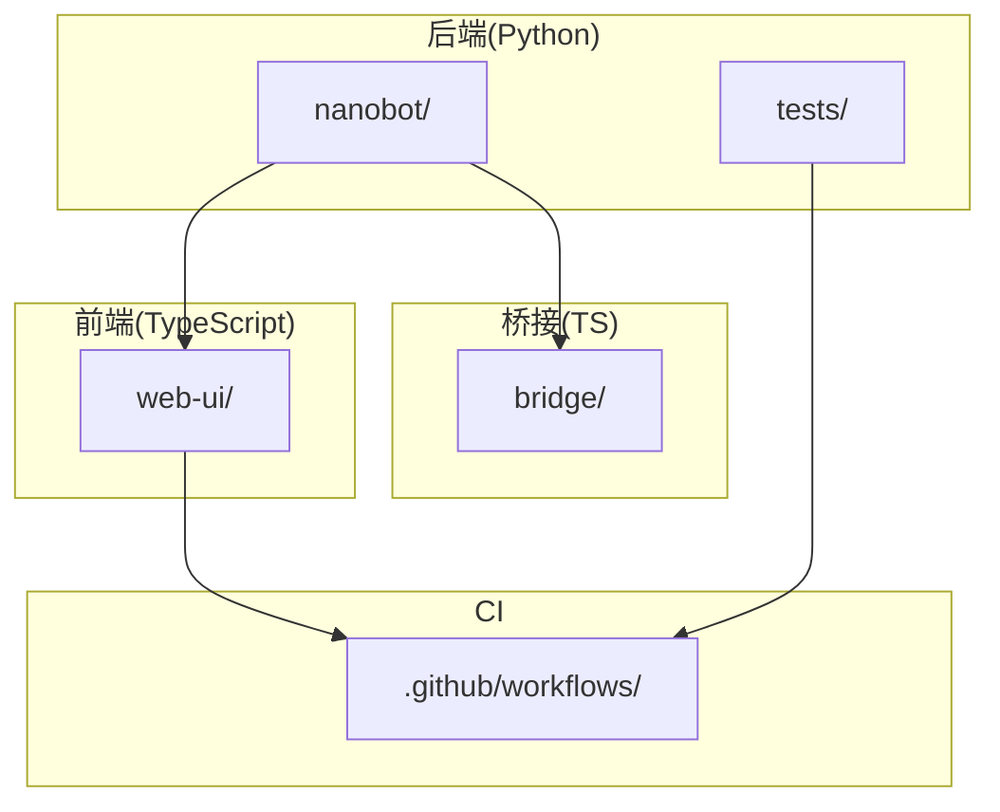
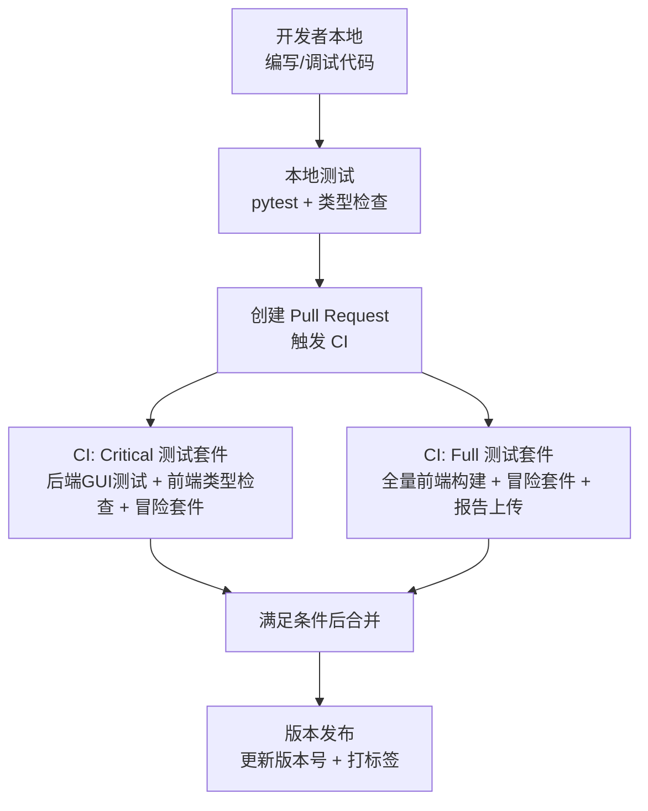
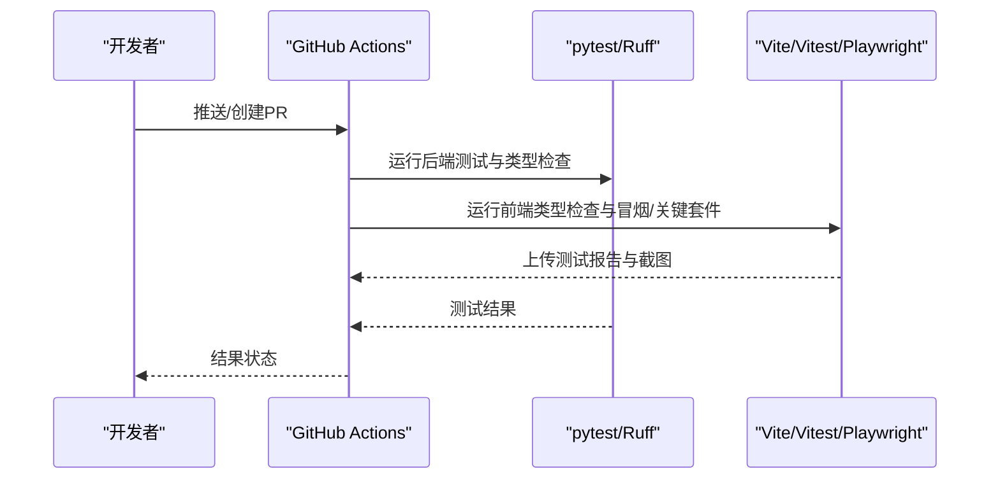
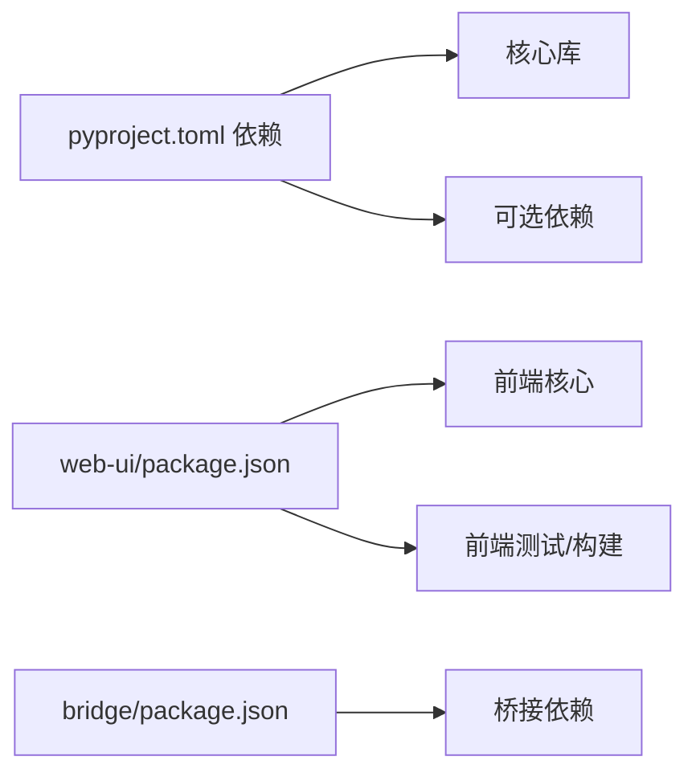

# 代码贡献规范

<cite>
**本文引用的文件**
- [README.md](file://README.md)
- [pyproject.toml](file://pyproject.toml)
- [.github/workflows/webgui-critical.yml](file://.github/workflows/webgui-critical.yml)
- [.github/workflows/webgui-full.yml](file://.github/workflows/webgui-full.yml)
- [nanobot/__init__.py](file://nanobot/__init__.py)
- [nanobot/cli/commands.py](file://nanobot/cli/commands.py)
- [nanobot/config/schema.py](file://nanobot/config/schema.py)
- [nanobot/providers/base.py](file://nanobot/providers/base.py)
- [nanobot/channels/base.py](file://nanobot/channels/base.py)
- [bridge/package.json](file://bridge/package.json)
- [web-ui/package.json](file://web-ui/package.json)
</cite>

## 目录
1. [引言](#引言)
2. [项目结构](#项目结构)
3. [核心组件](#核心组件)
4. [架构总览](#架构总览)
5. [详细组件分析](#详细组件分析)
6. [依赖分析](#依赖分析)
7. [性能考虑](#性能考虑)
8. [故障排查指南](#故障排查指南)
9. [结论](#结论)
10. [附录](#附录)

## 引言
本规范面向 Nanobot 项目的贡献者，系统化定义代码风格与提交规范、分支管理策略、代码审查流程、PR 模板与合并要求、编码标准与命名约定、注释规范、Git 工作流与版本控制策略、发布流程、依赖管理与版本兼容性、以及代码质量检查工具与自动化流程。目标是确保贡献过程高效、可追溯、可维护，并保持跨语言（Python/TypeScript）的一致性。

## 项目结构
Nanobot 采用多模块分层组织：Python 后端（核心框架与服务）、前端 Web UI、桥接层（WhatsApp 桥）、测试与 CI 工作流等。关键目录与职责概览：
- nanobot/: 核心 Python 包，包含代理、通道、提供者、配置、运行时、Web 接口等
- web-ui/: 基于 React/Vite 的前端应用
- bridge/: TypeScript 侧 WhatsApp 桥接
- tests/: 端到端与单元测试
- .github/workflows/: 自动化测试与报告上传

章节来源
- [README.md: 1-1335:1-1335](file://README.md#L1-L1335)
- [pyproject.toml: 1-122:1-122](file://pyproject.toml#L1-L122)

## 核心组件
- 版本与入口
  - 版本号统一在包元数据与入口模块中声明，确保发布一致性
- CLI 命令与交互
  - 提供 onboard、gateway、agent、web-ui 等命令，支持交互式输入与日志级别控制
- 配置模型
  - 使用 Pydantic 定义配置结构，覆盖通道、代理默认参数、提供者、网关、工具等
- 提供者抽象
  - 统一 LLM 调用接口与重试机制，屏蔽不同提供商差异
- 通道抽象
  - 定义通道生命周期与消息收发接口，支持权限校验与媒体转录

章节来源
- [nanobot/__init__.py: 1-7:1-7](file://nanobot/__init__.py#L1-L7)
- [nanobot/cli/commands.py: 1-1148:1-1148](file://nanobot/cli/commands.py#L1-L1148)
- [nanobot/config/schema.py: 1-450:1-450](file://nanobot/config/schema.py#L1-L450)
- [nanobot/providers/base.py: 1-271:1-271](file://nanobot/providers/base.py#L1-L271)
- [nanobot/channels/base.py: 1-135:1-135](file://nanobot/channels/base.py#L1-L135)

## 架构总览
下图展示贡献相关的关键流程：本地开发、测试与构建、CI 执行、产物与发布。

图表来源
- [.github/workflows/webgui-critical.yml: 1-63:1-63](file://.github/workflows/webgui-critical.yml#L1-L63)
- [.github/workflows/webgui-full.yml: 1-75:1-75](file://.github/workflows/webgui-full.yml#L1-L75)

章节来源
- [.github/workflows/webgui-critical.yml: 1-63:1-63](file://.github/workflows/webgui-critical.yml#L1-L63)
- [.github/workflows/webgui-full.yml: 1-75:1-75](file://.github/workflows/webgui-full.yml#L1-L75)

## 详细组件分析

### 代码风格与提交规范
- 编码与字符集
  - Python 严格使用 UTF-8；Windows 控制台在交互模式下强制 UTF-8 输出
- 行长度与格式
  - Ruff 配置行宽 100，启用基础 lint 规则集合，忽略过长行警告
- 命名约定
  - Python 使用 snake_case；字段别名支持 camelCase 与 snake_case 双向映射
  - 类型提示完整，避免裸返回值
- 注释与文档
  - 关键函数与类需提供清晰 docstring；复杂逻辑补充说明
  - 错误处理路径与边界条件需有注释说明
- 提交信息
  - 建议采用“类型(scope): 描述”的格式，如 feat(cli): 支持新命令选项
  - 避免一次性提交过多无关改动，优先拆分为小 PR

章节来源
- [nanobot/cli/commands.py: 1-1148:1-1148](file://nanobot/cli/commands.py#L1-L1148)
- [nanobot/config/schema.py: 1-450:1-450](file://nanobot/config/schema.py#L1-L450)
- [pyproject.toml: 111-122:111-122](file://pyproject.toml#L111-L122)

### 分支管理策略
- 主分支
  - main：稳定发布基线，仅允许通过 PR 合并
- 功能分支
  - feature/*：功能开发，完成后经审查合并至 main
- 修复分支
  - hotfix/*：紧急修复，合并后同步回 main 并打补丁版本
- 发布分支
  - release/*：预发布与回归测试，验证无误后合并 main 并打标签

章节来源
- [.github/workflows/webgui-full.yml: 3-10:3-10](file://.github/workflows/webgui-full.yml#L3-L10)

### 代码审查流程
- 必须项
  - 至少一名维护者批准
  - CI 全部通过（Critical/Full 套件）
  - 无新增或升级未声明的外部依赖
- 审查关注点
  - 代码正确性与健壮性（异常处理、空值、越界）
  - 性能影响（循环、IO、并发）
  - 可维护性（命名、注释、模块拆分）
  - 兼容性（Python 版本、平台差异）

章节来源
- [.github/workflows/webgui-critical.yml: 38-51:38-51](file://.github/workflows/webgui-critical.yml#L38-L51)
- [.github/workflows/webgui-full.yml: 42-63:42-63](file://.github/workflows/webgui-full.yml#L42-L63)

### Pull Request 模板与合并要求
- PR 模板建议字段
  - 摘要、变更内容、影响范围、测试方法、兼容性说明
- 合并前提
  - 通过 CI；批准；无冲突；版本号与变更日志更新（如适用）

章节来源
- [.github/workflows/webgui-critical.yml: 1-63:1-63](file://.github/workflows/webgui-critical.yml#L1-L63)
- [.github/workflows/webgui-full.yml: 1-75:1-75](file://.github/workflows/webgui-full.yml#L1-L75)

### 编码标准与命名约定
- Python
  - 模块与类：PascalCase；变量与函数：snake_case；常量：UPPER_CASE
  - 导入顺序：标准库、第三方、项目内
  - 字段别名：camelCase 与 snake_case 双写时，使用 Pydantic 别名生成器
- TypeScript
  - 文件命名：*.ts / *.tsx；组件使用 PascalCase；样式与资源文件按功能分组
- 配置与路径
  - 配置文件路径与工作区路径通过统一入口管理，避免硬编码

章节来源
- [nanobot/config/schema.py: 1-450:1-450](file://nanobot/config/schema.py#L1-L450)
- [nanobot/cli/commands.py: 1-1148:1-1148](file://nanobot/cli/commands.py#L1-L1148)

### 注释规范
- 函数/方法
  - 参数、返回值、异常、副作用、性能特征
- 类
  - 设计意图、关键属性、生命周期、依赖关系
- 复杂逻辑
  - 步骤分解、边界条件、替代方案与权衡

章节来源
- [nanobot/providers/base.py: 1-271:1-271](file://nanobot/providers/base.py#L1-L271)
- [nanobot/channels/base.py: 1-135:1-135](file://nanobot/channels/base.py#L1-L135)

### Git 工作流最佳实践
- 分支策略
  - 功能开发基于 feature/*；修复基于 hotfix/*
- 提交粒度
  - 小步提交，语义明确；关联问题编号（如 #123）
- 同步与清理
  - 定期 rebase 或 merge main；清理已合并分支
- 标签与发布
  - 语义化版本；变更日志随版本更新

章节来源
- [.github/workflows/webgui-full.yml: 3-10:3-10](file://.github/workflows/webgui-full.yml#L3-L10)

### 版本控制策略与发布流程
- 版本号来源
  - Python 包元数据与入口模块统一声明版本
- 发布步骤
  - 更新版本号 → 运行 CI → 通过审查 → 合并 → 打标签 → 构建发布产物
- 依赖兼容
  - 严格遵循 pyproject.toml 中的版本范围与最低版本要求

章节来源
- [nanobot/__init__.py: 1-7:1-7](file://nanobot/__init__.py#L1-L7)
- [pyproject.toml: 1-122:1-122](file://pyproject.toml#L1-L122)

### 依赖管理与版本兼容性
- Python
  - 依赖通过 pyproject.toml 声明；可选依赖区分渠道与矩阵；CI 固定 Python 版本
- TypeScript
  - web-ui 与 bridge 通过 package.json 管理依赖；CI 固定 Node.js 版本
- 兼容性
  - Python >= 3.11；Node.js >= 20（桥接）；前端工程使用 Vite/Playwright

章节来源
- [pyproject.toml: 1-122:1-122](file://pyproject.toml#L1-L122)
- [bridge/package.json: 1-27:1-27](file://bridge/package.json#L1-L27)
- [web-ui/package.json: 1-43:1-43](file://web-ui/package.json#L1-L43)

### 代码质量检查工具与自动化流程
- 后端
  - Ruff：lint 与格式；pytest：单元/集成测试
- 前端
  - 类型检查（tsc）；Vitest/Playwright：单元与端到端测试
- CI
  - Critical：后端 GUI 测试 + 前端类型检查 + 冒险套件
  - Full：全量前端构建 + 冒险套件 + 报告上传

图表来源
- [.github/workflows/webgui-critical.yml: 1-63:1-63](file://.github/workflows/webgui-critical.yml#L1-L63)
- [.github/workflows/webgui-full.yml: 1-75:1-75](file://.github/workflows/webgui-full.yml#L1-L75)

章节来源
- [.github/workflows/webgui-critical.yml: 1-63:1-63](file://.github/workflows/webgui-critical.yml#L1-L63)
- [.github/workflows/webgui-full.yml: 1-75:1-75](file://.github/workflows/webgui-full.yml#L1-L75)

## 依赖分析
- Python 依赖
  - 核心：FastAPI、Typer、LiteLLM、LangGraph、Pydantic 等
  - 可选：Matrix、WeCom 等通道扩展
- 前端依赖
  - React 生态、Ant Design、Vite、Playwright、Vitest
- 桥接依赖
  - Baileys、ws、qrcode-terminal 等

图表来源
- [pyproject.toml: 19-73:19-73](file://pyproject.toml#L19-L73)
- [web-ui/package.json: 16-41:16-41](file://web-ui/package.json#L16-L41)
- [bridge/package.json: 12-26:12-26](file://bridge/package.json#L12-L26)

章节来源
- [pyproject.toml: 19-73:19-73](file://pyproject.toml#L19-L73)
- [web-ui/package.json: 16-41:16-41](file://web-ui/package.json#L16-L41)
- [bridge/package.json: 12-26:12-26](file://bridge/package.json#L12-L26)

## 性能考虑
- 重试与退避
  - 提供者调用具备指数退避与瞬时错误识别，降低抖动对用户体验的影响
- 会话与上下文
  - 通过上下文窗口令牌限制与工具迭代次数控制，避免长对话导致的资源耗尽
- 并发与异步
  - 通道与任务均采用异步模型，减少阻塞；注意避免过度并发造成上游限流

章节来源
- [nanobot/providers/base.py: 77-271:77-271](file://nanobot/providers/base.py#L77-L271)
- [nanobot/cli/commands.py: 308-679:308-679](file://nanobot/cli/commands.py#L308-L679)

## 故障排查指南
- 常见问题定位
  - 配置不生效：确认配置文件路径与字段别名；检查环境变量前缀
  - 权限被拒：检查通道 allowFrom 列表是否包含发送者标识
  - 提供者错误：查看重试日志与瞬时错误标记
- 日志与诊断
  - CLI 支持开启/关闭运行时日志；通道与消息总线提供事件钩子
- CI 失败
  - 查看上传的 Playwright 报告与测试结果目录；核对前后端类型检查与测试输出

章节来源
- [nanobot/channels/base.py: 79-135:79-135](file://nanobot/channels/base.py#L79-L135)
- [nanobot/providers/base.py: 188-266:188-266](file://nanobot/providers/base.py#L188-L266)
- [.github/workflows/webgui-critical.yml: 53-61:53-61](file://.github/workflows/webgui-critical.yml#L53-L61)
- [.github/workflows/webgui-full.yml: 65-73:65-73](file://.github/workflows/webgui-full.yml#L65-L73)

## 结论
本规范从风格、流程、工具与发布四个维度统一了 Nanobot 的贡献体验，既保证高质量交付，又兼顾跨语言协作效率。建议在每次提交前先自检，PR 创建后及时跟进 CI 状态，确保变更可追踪、可复现、可回滚。

## 附录
- 关键实现参考路径
  - CLI 命令与交互：[nanobot/cli/commands.py:1-1148](file://nanobot/cli/commands.py#L1-L1148)
  - 配置模型与别名：[nanobot/config/schema.py:1-450](file://nanobot/config/schema.py#L1-L450)
  - 提供者抽象与重试：[nanobot/providers/base.py:1-271](file://nanobot/providers/base.py#L1-L271)
  - 通道抽象与权限：[nanobot/channels/base.py:1-135](file://nanobot/channels/base.py#L1-L135)
  - CI 工作流：[webgui-critical.yml:1-63](file://.github/workflows/webgui-critical.yml#L1-L63)、[webgui-full.yml:1-75](file://.github/workflows/webgui-full.yml#L1-L75)
  - 依赖与版本：[pyproject.toml:1-122](file://pyproject.toml#L1-L122)、[web-ui/package.json:1-43](file://web-ui/package.json#L1-L43)、[bridge/package.json:1-27](file://bridge/package.json#L1-L27)