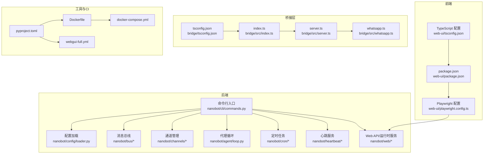
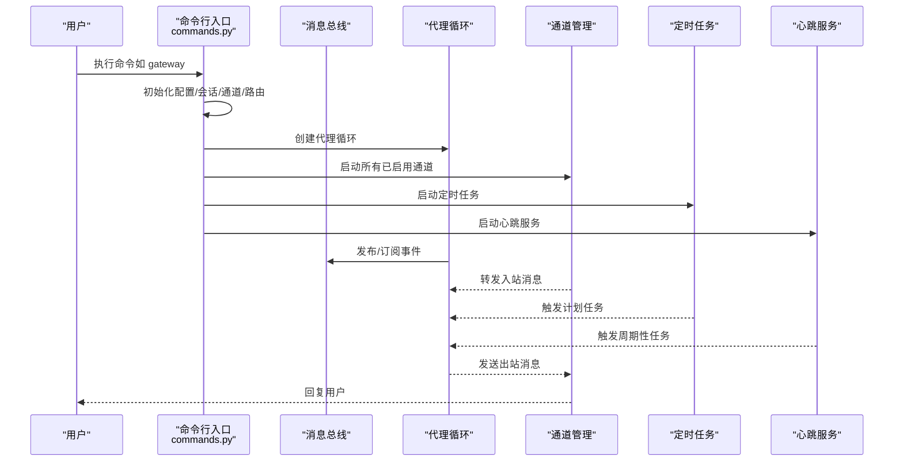
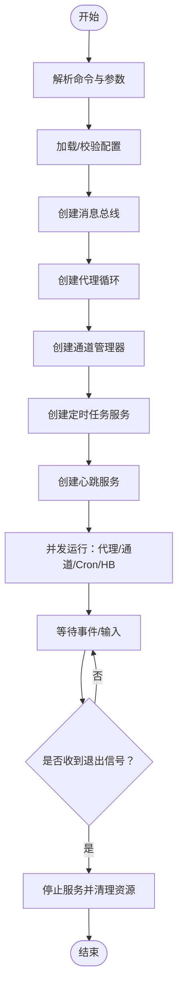
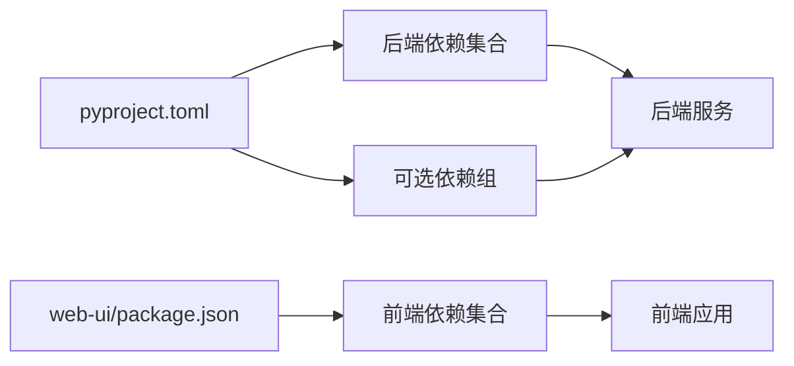
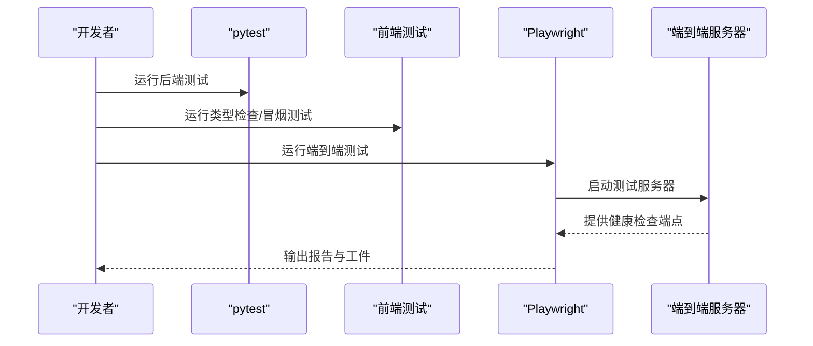

# 开发指南

<cite>
**本文引用的文件**
- [README.md](file://README.md)
- [pyproject.toml](file://pyproject.toml)
- [Dockerfile](file://Dockerfile)
- [docker-compose.yml](file://docker-compose.yml)
- [.github/workflows/webgui-full.yml](file://.github/workflows/webgui-full.yml)
- [web-ui/package.json](file://web-ui/package.json)
- [web-ui/playwright.config.ts](file://web-ui/playwright.config.ts)
- [web-ui/tsconfig.json](file://web-ui/tsconfig.json)
- [nanobot/__main__.py](file://nanobot/__main__.py)
- [nanobot/cli/commands.py](file://nanobot/cli/commands.py)
- [nanobot/config/loader.py](file://nanobot/config/loader.py)
</cite>

## 目录
1. [简介](#简介)
2. [项目结构](#项目结构)
3. [核心组件](#核心组件)
4. [架构总览](#架构总览)
5. [详细组件分析](#详细组件分析)
6. [依赖关系分析](#依赖关系分析)
7. [性能与资源优化](#性能与资源优化)
8. [测试策略与编写方法](#测试策略与编写方法)
9. [代码质量与静态分析](#代码质量与静态分析)
10. [持续集成与发布](#持续集成与发布)
11. [开发环境搭建与调试](#开发环境搭建与调试)
12. [故障排除与日志分析](#故障排除与日志分析)
13. [结论](#结论)
14. [附录](#附录)

## 简介
本指南面向 Nanobot 的开发者，覆盖从环境搭建、代码贡献规范、测试策略、质量标准、性能优化、故障排除到架构与扩展机制的完整开发工作流。内容基于仓库中的实际实现与配置文件整理而成，帮助新贡献者快速上手并保持高质量交付。

## 项目结构
Nanobot 采用“后端 Python + 前端 React/Vite + 桥接层（WhatsApp）”的多模块组织方式：
- 后端核心：nanobot 包含命令行入口、配置加载、通道管理、代理循环、任务调度、心跳服务、平台化数据模型等。
- 前端：web-ui 使用 Vite + React + TypeScript，Playwright 进行端到端测试。
- 桥接层：bridge 目录包含 WhatsApp 桥接的 TypeScript 实现与构建脚本。
- 测试：tests 目录包含后端 API/服务测试与端到端服务器；web-ui/e2e 包含前端端到端测试。
- 工具链：pyproject.toml 定义依赖、可选依赖、脚本入口、Ruff 规则与 pytest 配置；Dockerfile 与 docker-compose.yml 提供容器化部署。

图表来源
- [nanobot/cli/commands.py](file://nanobot/cli/commands.py)
- [nanobot/config/loader.py](file://nanobot/config/loader.py)
- [web-ui/package.json](file://web-ui/package.json)
- [web-ui/playwright.config.ts](file://web-ui/playwright.config.ts)
- [web-ui/tsconfig.json](file://web-ui/tsconfig.json)
- [pyproject.toml](file://pyproject.toml)
- [Dockerfile](file://Dockerfile)
- [docker-compose.yml](file://docker-compose.yml)
- [.github/workflows/webgui-full.yml](file://.github/workflows/webgui-full.yml)

章节来源
- [README.md](file://README.md)
- [pyproject.toml](file://pyproject.toml)
- [Dockerfile](file://Dockerfile)
- [docker-compose.yml](file://docker-compose.yml)
- [web-ui/package.json](file://web-ui/package.json)
- [web-ui/playwright.config.ts](file://web-ui/playwright.config.ts)
- [web-ui/tsconfig.json](file://web-ui/tsconfig.json)

## 核心组件
- 命令行入口与主程序
  - 入口文件通过 Typer 定义子命令，支持 onboard、gateway、agent、web-ui 等命令。
  - 主程序入口直接调用命令应用，便于作为模块运行。
- 配置系统
  - 支持从默认路径或指定路径加载配置，提供迁移逻辑与保存能力。
- 代理循环与消息总线
  - 代理循环负责执行对话、工具调用、会话管理与 MCP 关闭；消息总线用于跨组件解耦通信。
- 通道与路由
  - 通道管理器负责启用/启动/停止各类聊天通道；支持按绑定规则进行消息路由。
- 定时任务与心跳
  - CronService 提供计划任务触发；HeartbeatService 定期执行任务并通过消息总线通知用户。
- Web API 与运行时服务
  - 提供 REST 接口与前端交互，包含代理、频道、知识库、运行时服务等路由。

章节来源
- [nanobot/__main__.py](file://nanobot/__main__.py)
- [nanobot/cli/commands.py](file://nanobot/cli/commands.py)
- [nanobot/config/loader.py](file://nanobot/config/loader.py)

## 架构总览
Nanobot 的运行时由命令行驱动，启动后初始化配置、消息总线、通道、代理循环、定时任务与心跳服务，并并发运行以响应外部输入与内部事件。前端通过 Playwright 在本地启动测试服务器，与后端 API 协作完成端到端验证。

图表来源
- [nanobot/cli/commands.py](file://nanobot/cli/commands.py)

## 详细组件分析

### 命令行与运行时控制流
- onboard：初始化配置与工作区模板同步。
- gateway：并发启动代理循环、通道、定时任务与心跳服务，支持多实例与路由绑定。
- agent：单次或交互式对话，支持日志开关与 Markdown 渲染。
- web-ui：启动 Web 服务，支持自动/静态/开发三种前端模式。

图表来源
- [nanobot/cli/commands.py](file://nanobot/cli/commands.py)

章节来源
- [nanobot/cli/commands.py](file://nanobot/cli/commands.py)

### 配置加载与迁移
- 默认路径：用户主目录下的 .nanobot/config.json。
- 加载失败时回退到默认配置；提供迁移逻辑（如工具配置字段调整、MCP 服务器字段标准化）。
- 支持动态设置配置路径以支持多实例场景。

章节来源
- [nanobot/config/loader.py](file://nanobot/config/loader.py)

### 通道与路由
- 通道管理器根据配置启用相应通道，支持并发启动与优雅关闭。
- 通道消息分发器支持按代理或团队路由，团队模式通过 LangGraph supervisor 组织成员代理。

章节来源
- [nanobot/cli/commands.py](file://nanobot/cli/commands.py)

### 定时任务与心跳
- CronService：注册回调函数，在触发时通过代理循环执行任务，必要时向用户通道发送结果。
- HeartbeatService：周期性触发任务，选择最近活跃的可路由通道进行通知。

章节来源
- [nanobot/cli/commands.py](file://nanobot/cli/commands.py)

## 依赖关系分析
- 语言与框架
  - Python >= 3.11，FastAPI/Uvicorn 提供 Web 服务，Typer 提供 CLI，Loguru 提供日志。
- 可选依赖
  - wecom、matrix 等通道相关依赖通过可选组安装。
- 前端依赖
  - React、Ant Design、Vite、TypeScript、Playwright、Vitest 等。
- 开发工具
  - Ruff 用于代码风格检查，pytest 用于后端测试。

图表来源
- [pyproject.toml](file://pyproject.toml)
- [web-ui/package.json](file://web-ui/package.json)

章节来源
- [pyproject.toml](file://pyproject.toml)
- [web-ui/package.json](file://web-ui/package.json)

## 性能与资源优化
- 资源限制与并发
  - Docker Compose 为网关服务设置了 CPU 与内存上限与预留，避免资源争用。
- 启动与运行
  - 代理循环与通道并发运行，减少阻塞；通道关闭时优先停止通道再关闭代理，确保资源回收。
- 日志与可观测性
  - 使用 Loguru 记录运行时信息；CLI 支持开启/关闭日志输出，便于定位问题。
- 前端性能
  - Playwright 测试配置中保留失败时的截图/视频/Trace，便于定位 UI 性能问题。

章节来源
- [docker-compose.yml](file://docker-compose.yml)
- [nanobot/cli/commands.py](file://nanobot/cli/commands.py)
- [web-ui/playwright.config.ts](file://web-ui/playwright.config.ts)

## 测试策略与编写方法
- 后端测试
  - 使用 pytest，异步模式自动配置；测试覆盖 Web API、服务层、通道、工具等。
- 前端测试
  - 类型检查与冒烟测试通过 npm 脚本执行；端到端测试使用 Playwright，包含关键用例与可访问性测试。
- 端到端服务器
  - Playwright 配置通过本地 Python 服务器提供测试环境，支持构建前端产物与自定义运行时目录。

图表来源
- [.github/workflows/webgui-full.yml](file://.github/workflows/webgui-full.yml)
- [web-ui/package.json](file://web-ui/package.json)
- [web-ui/playwright.config.ts](file://web-ui/playwright.config.ts)

章节来源
- [.github/workflows/webgui-full.yml](file://.github/workflows/webgui-full.yml)
- [web-ui/package.json](file://web-ui/package.json)
- [web-ui/playwright.config.ts](file://web-ui/playwright.config.ts)

## 代码质量与静态分析
- 代码风格
  - Ruff 配置统一行宽与目标版本，启用基础规则集，忽略过长行警告。
- 依赖与打包
  - 使用 Hatchling 构建轮子包，wheel 与 sdist 均包含必要的非 Python 文件。
- 测试配置
  - pytest 异步模式自动，测试目录集中于 tests。

章节来源
- [pyproject.toml](file://pyproject.toml)

## 持续集成与发布
- CI 工作流
  - Ubuntu 环境，安装 Python 3.11 与 Node.js 20；后端安装 dev 可选依赖，前端安装依赖并安装 Playwright 浏览器；运行后端 GUI 测试、前端类型检查、冒烟测试、构建前端、关键用例与可访问性测试；上传 Playwright 报告与测试结果。
- 容器化
  - Dockerfile 使用 uv 安装依赖，预装 Node.js 20 用于 WhatsApp 桥接构建；暴露网关端口；ENTRYPOINT 指向 nanobot 命令。

章节来源
- [.github/workflows/webgui-full.yml](file://.github/workflows/webgui-full.yml)
- [Dockerfile](file://Dockerfile)

## 开发环境搭建与调试
- 环境要求
  - Python >= 3.11；建议使用 uv 或 pip 安装项目与可选依赖。
- 安装与初始化
  - 从源码安装后，使用 onboard 初始化配置与工作区；随后在配置中添加 API 密钥并启动 gateway 或 agent。
- 调试技巧
  - CLI 支持 --logs 选项开启运行时日志；交互模式下使用 prompt_toolkit 输入，支持粘贴与历史。
  - 通道桥接（如 WhatsApp）需要 Node.js 20，升级后需重建桥接缓存目录。
- IDE 与编辑器
  - 建议使用支持 Python/TypeScript 的 IDE 并启用 Ruff 与 TypeScript 检查；前端使用 Vite 热重载开发模式。

章节来源
- [README.md](file://README.md)
- [pyproject.toml](file://pyproject.toml)
- [nanobot/cli/commands.py](file://nanobot/cli/commands.py)

## 故障排除与日志分析
- 常见问题
  - API 密钥缺失：LiteLLMProvider 会在缺少密钥时提示配置位置。
  - 通道未启用：gateway 启动时会打印已启用通道列表；若为空需检查配置。
  - WhatsApp 桥接：升级后需删除桥接缓存并重新登录。
- 日志与诊断
  - CLI 支持开启/关闭日志输出；Playwright 在失败时保留截图/视频/Trace，便于分析 UI 行为。
- 资源与并发
  - 若出现资源紧张，参考 Docker Compose 中的 CPU/内存限制与预留配置进行调整。

章节来源
- [nanobot/cli/commands.py](file://nanobot/cli/commands.py)
- [web-ui/playwright.config.ts](file://web-ui/playwright.config.ts)
- [docker-compose.yml](file://docker-compose.yml)

## 结论
本指南基于仓库现有实现，总结了 Nanobot 的开发规范、测试策略、质量标准、性能优化与故障排除方法。建议在提交前遵循 Ruff 规范、补充测试用例、在 CI 中验证端到端流程，并结合日志与 Playwright 工件进行问题定位与修复。

## 附录
- 快速命令参考
  - 初始化：nanobot onboard
  - 启动网关：nanobot gateway
  - 启动 Web UI：nanobot web-ui
  - 单次对话：nanobot agent -m "..."
  - 查看版本：nanobot --version