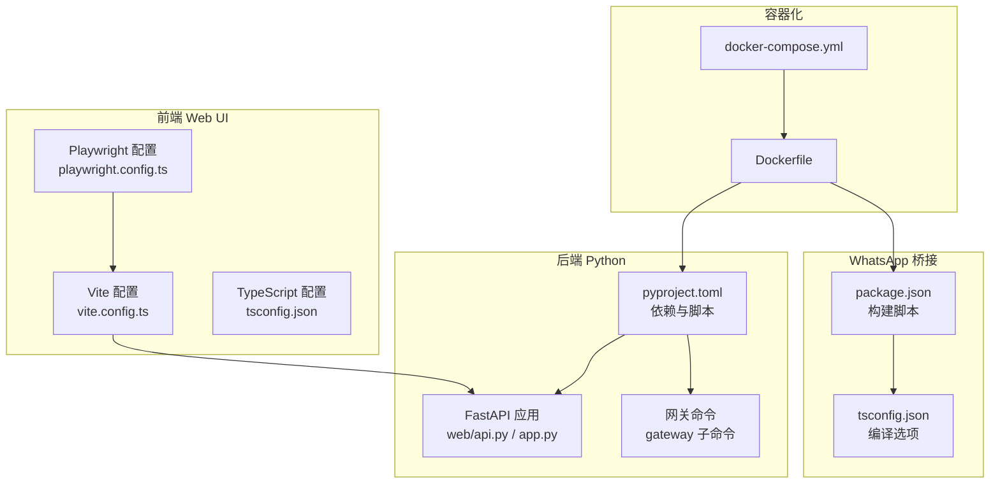
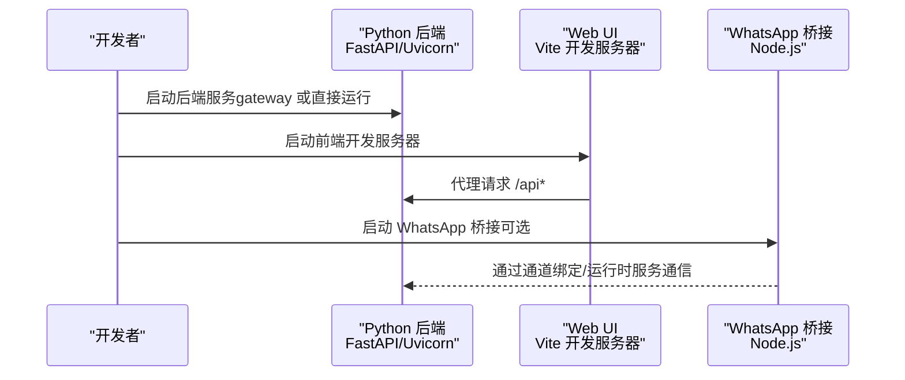
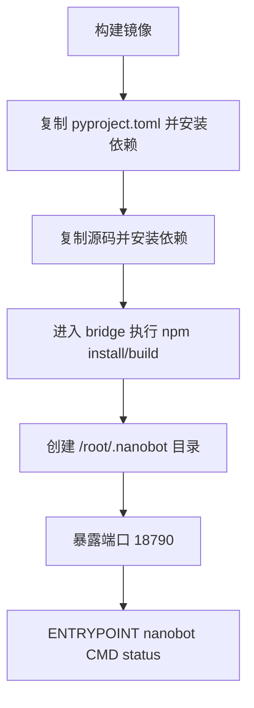
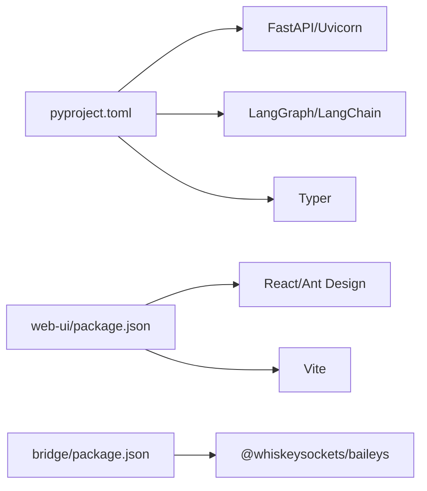

# 开发环境搭建

<cite>
**本文引用的文件**
- [README.md](file://README.md)
- [Dockerfile](file://Dockerfile)
- [docker-compose.yml](file://docker-compose.yml)
- [pyproject.toml](file://pyproject.toml)
- [bridge/package.json](file://bridge/package.json)
- [bridge/tsconfig.json](file://bridge/tsconfig.json)
- [web-ui/package.json](file://web-ui/package.json)
- [web-ui/tsconfig.json](file://web-ui/tsconfig.json)
- [.github/workflows/webgui-critical.yml](file://.github/workflows/webgui-critical.yml)
- [.github/workflows/webgui-full.yml](file://.github/workflows/webgui-full.yml)
- [web-ui/vite.config.ts](file://web-ui/vite.config.ts)
- [web-ui/playwright.config.ts](file://web-ui/playwright.config.ts)
</cite>

## 目录
1. [简介](#简介)
2. [项目结构](#项目结构)
3. [核心组件](#核心组件)
4. [架构总览](#架构总览)
5. [详细组件分析](#详细组件分析)
6. [依赖分析](#依赖分析)
7. [性能考虑](#性能考虑)
8. [故障排查指南](#故障排查指南)
9. [结论](#结论)
10. [附录](#附录)

## 简介
本指南面向希望在本地搭建 Nanobot 开发环境的开发者，覆盖以下内容：
- 本地开发环境配置与依赖安装（Python、Node.js、包管理器）
- 环境变量设置与默认端口约定
- Docker 容器化开发与多服务编排
- 前端开发环境（Vite、TypeScript、Playwright）与代理配置
- 调试工具、热重载与开发服务器启动方法
- 数据库本地化、API 服务模拟与测试环境准备
- IDE 设置建议、插件推荐与开发工作流配置

## 项目结构
Nanobot 采用“后端 Python + 前端 React/Vite + WhatsApp 桥接 Node.js”的多语言组合。关键目录与职责如下：
- 后端 Python：nanobot 包含核心业务逻辑、通道适配器、Web API、运行时服务等
- 前端 Web UI：React + Vite 应用，通过代理访问后端 API
- WhatsApp 桥接：独立的 Node.js 项目，使用 TypeScript 构建并打包
- 测试与 CI：pytest（后端）、Vitest/Playwright（前端）

图表来源
- [pyproject.toml:1-122](file://pyproject.toml#L1-L122)
- [web-ui/vite.config.ts:1-138](file://web-ui/vite.config.ts#L1-L138)
- [web-ui/playwright.config.ts:1-34](file://web-ui/playwright.config.ts#L1-L34)
- [bridge/package.json:1-27](file://bridge/package.json#L1-L27)
- [bridge/tsconfig.json:1-17](file://bridge/tsconfig.json#L1-L17)
- [Dockerfile:1-41](file://Dockerfile#L1-L41)
- [docker-compose.yml:1-32](file://docker-compose.yml#L1-L32)

章节来源
- [README.md:124-214](file://README.md#L124-L214)
- [pyproject.toml:1-122](file://pyproject.toml#L1-L122)
- [web-ui/vite.config.ts:1-138](file://web-ui/vite.config.ts#L1-L138)
- [web-ui/playwright.config.ts:1-34](file://web-ui/playwright.config.ts#L1-L34)
- [bridge/package.json:1-27](file://bridge/package.json#L1-L27)
- [bridge/tsconfig.json:1-17](file://bridge/tsconfig.json#L1-L17)
- [Dockerfile:1-41](file://Dockerfile#L1-L41)
- [docker-compose.yml:1-32](file://docker-compose.yml#L1-L32)

## 核心组件
- Python 后端
  - 依赖与版本：Python ≥3.11；FastAPI、Uvicorn、Typer 等
  - 可选依赖：wecom、matrix、dev（pytest、ruff 等）
  - 入口脚本：nanobot 命令行工具
- 前端 Web UI
  - Vite + React + Ant Design 生态
  - 开发端口默认 5173，可通过环境变量覆盖
  - 代理到后端 API，默认 http://127.0.0.1:6788
- WhatsApp 桥接
  - Node.js ≥20；TypeScript 编译；构建产物 dist/index.js
- 容器化
  - 基于 uv Python 3.12 镜像；预装 Node.js 20；暴露网关端口 18790

章节来源
- [pyproject.toml:1-122](file://pyproject.toml#L1-L122)
- [web-ui/package.json:1-43](file://web-ui/package.json#L1-L43)
- [web-ui/vite.config.ts:83-137](file://web-ui/vite.config.ts#L83-L137)
- [bridge/package.json:1-27](file://bridge/package.json#L1-L27)
- [Dockerfile:1-41](file://Dockerfile#L1-L41)

## 架构总览
下图展示开发环境中的典型交互：IDE/终端启动后端与前端，前端通过 Vite 代理访问后端 API；WhatsApp 功能需要独立的 Node.js 桥接进程。

图表来源
- [web-ui/vite.config.ts:127-135](file://web-ui/vite.config.ts#L127-L135)
- [bridge/package.json:7-11](file://bridge/package.json#L7-L11)
- [pyproject.toml:75-76](file://pyproject.toml#L75-L76)

章节来源
- [web-ui/vite.config.ts:83-137](file://web-ui/vite.config.ts#L83-L137)
- [bridge/package.json:1-27](file://bridge/package.json#L1-27)
- [pyproject.toml:75-76](file://pyproject.toml#L75-L76)

## 详细组件分析

### Python 后端开发环境
- 运行时与依赖
  - Python 版本：≥3.11（推荐 3.11/3.12）
  - 推荐使用 uv 进行安装与升级，便于快速迭代
  - 可选依赖：pip 安装 nanobot-ai[wecom] 或 nanobot-ai[matrix]（按需）
- 命令行入口
  - 使用 nanobot 命令进行初始化、网关启动、提供商登录等
- 网关与服务
  - 网关默认监听端口 18790（容器内），本地开发可结合 docker-compose 启动
- 配置文件
  - 默认路径：~/.nanobot/config.json
  - 初始化：nanobot onboard
  - 示例配置片段请参考项目自述文件中的“Quick Start”与“Configuration”部分

章节来源
- [README.md:124-214](file://README.md#L124-L214)
- [pyproject.toml:19-55](file://pyproject.toml#L19-L55)
- [pyproject.toml:75-76](file://pyproject.toml#L75-L76)
- [Dockerfile:36-41](file://Dockerfile#L36-L41)
- [docker-compose.yml:14-15](file://docker-compose.yml#L14-L15)

### 前端 Web UI 开发环境
- Node.js 与包管理
  - Node.js 版本：≥20（桥接依赖 Node ≥20）
  - 包管理器：npm（仓库中包含 package-lock.json）
- 开发服务器
  - 默认端口：5173（可通过 NANOBOT_WEB_UI_PORT 覆盖）
  - 代理：/api 代理至 http://127.0.0.1:6788（可通过 NANOBOT_API_ORIGIN 覆盖）
- 类型检查与测试
  - 类型检查：npm run typecheck
  - 端到端测试：npm run test:e2e:critical 或 npm run test:e2e:a11y
  - 冒烟测试：npm run test:smoke
- 构建
  - npm run build（TypeScript + Vite）

章节来源
- [web-ui/package.json:6-14](file://web-ui/package.json#L6-L14)
- [web-ui/vite.config.ts:83-137](file://web-ui/vite.config.ts#L83-L137)
- [web-ui/playwright.config.ts:1-34](file://web-ui/playwright.config.ts#L1-L34)

### WhatsApp 桥接开发环境
- Node.js 版本：≥20
- 构建与运行
  - 构建：npm run build（TypeScript → dist）
  - 开发运行：npm run dev（边改边跑）
  - 生产运行：npm run start（执行 dist/index.js）
- 依赖
  - Baileys、ws、qrcode-terminal、pino 等

章节来源
- [bridge/package.json:1-27](file://bridge/package.json#L1-L27)
- [bridge/tsconfig.json:1-17](file://bridge/tsconfig.json#L1-L17)

### 容器化开发与多服务编排
- 镜像与基础
  - 基于 uv 的 Python 3.12 slim 镜像
  - 预装 Node.js 20，用于 WhatsApp 桥接
- 构建步骤
  - 复制 pyproject.toml 并安装依赖（缓存层优化）
  - 复制源码并安装完整依赖
  - 在 bridge 目录执行 npm install && npm run build
- 服务编排
  - nanobot-gateway：映射 18790:18790，运行 gateway 命令
  - nanobot-cli：交互式容器，适合临时调试
  - 卷挂载：~/.nanobot:/root/.nanobot（持久化配置）

图表来源
- [Dockerfile:17-31](file://Dockerfile#L17-L31)
- [Dockerfile:33-41](file://Dockerfile#L33-L41)
- [docker-compose.yml:8-31](file://docker-compose.yml#L8-L31)

章节来源
- [Dockerfile:1-41](file://Dockerfile#L1-L41)
- [docker-compose.yml:1-32](file://docker-compose.yml#L1-L32)

### 测试环境与模拟
- 后端 GUI 测试
  - 使用 pytest 运行 tests/test_web_api.py 与 tests/test_web_services.py
- 前端测试
  - Vitest（单元/冒烟）
  - Playwright（端到端），通过 playwright.config.ts 配置
- E2E 服务器
  - Playwright 工作流通过 tests/web_e2e_server.py 提供本地服务，端口由环境变量控制

章节来源
- [.github/workflows/webgui-critical.yml:38-51](file://.github/workflows/webgui-critical.yml#L38-L51)
- [.github/workflows/webgui-full.yml:42-63](file://.github/workflows/webgui-full.yml#L42-L63)
- [web-ui/playwright.config.ts:20-32](file://web-ui/playwright.config.ts#L20-L32)

## 依赖分析
- Python 依赖
  - 核心：FastAPI、Uvicorn、Typer、Litellm、LangGraph、Pydantic 等
  - 可选：wecom、matrix
- 前端依赖
  - React、Ant Design、Vite、TypeScript、Vitest、Playwright
- 桥接依赖
  - Baileys、ws、qrcode-terminal、pino

图表来源
- [pyproject.toml:19-55](file://pyproject.toml#L19-L55)
- [web-ui/package.json:16-27](file://web-ui/package.json#L16-L27)
- [bridge/package.json:12-17](file://bridge/package.json#L12-L17)

章节来源
- [pyproject.toml:19-55](file://pyproject.toml#L19-L55)
- [web-ui/package.json:16-27](file://web-ui/package.json#L16-L27)
- [bridge/package.json:12-17](file://bridge/package.json#L12-L17)

## 性能考虑
- 依赖安装
  - 使用 uv 可显著提升 Python 依赖安装速度
  - Docker 构建中优先复制 pyproject.toml 以利用缓存层
- 前端打包
  - Vite 默认启用代码分割与手动分包策略，减少首屏体积
- 服务资源
  - docker-compose 为服务设置了 CPU 与内存限制，便于本地资源控制

章节来源
- [Dockerfile:17-21](file://Dockerfile#L17-L21)
- [web-ui/vite.config.ts:98-104](file://web-ui/vite.config.ts#L98-L104)
- [docker-compose.yml:16-23](file://docker-compose.yml#L16-L23)

## 故障排查指南
- 端口冲突
  - 后端网关默认端口 18790；如冲突，请在 docker-compose 中修改映射或在本地直接运行后端时切换端口
- 前端代理
  - 若代理未生效，请检查 NANOBOT_API_ORIGIN 是否正确指向后端地址
- Node.js 版本不匹配
  - WhatsApp 桥接要求 Node.js ≥20；若无法满足，可考虑使用容器内的 Node 环境
- 配置文件缺失
  - 首次运行前请执行 nanobot onboard 初始化配置，并确保 ~/.nanobot/config.json 存在
- 测试失败
  - 确保已安装 dev 依赖与 Playwright 浏览器；参考 CI 工作流中的安装步骤

章节来源
- [docker-compose.yml:14-15](file://docker-compose.yml#L14-L15)
- [web-ui/vite.config.ts:85-86](file://web-ui/vite.config.ts#L85-L86)
- [bridge/package.json:23-25](file://bridge/package.json#L23-L25)
- [README.md:175-180](file://README.md#L175-L180)
- [.github/workflows/webgui-full.yml:34-40](file://.github/workflows/webgui-full.yml#L34-L40)

## 结论
通过本指南，您可以在本地完成 Nanobot 的 Python 后端、前端 Web UI 与 WhatsApp 桥接的全栈开发环境搭建。推荐使用 uv 管理 Python 依赖，使用 npm 管理前端依赖，并借助 docker-compose 快速编排多服务。配合 Vite 代理、Playwright 端到端测试与 pytest 后端测试，可形成高效的本地开发与验证闭环。

## 附录

### 环境变量清单
- 后端
  - 无强制必需环境变量；可通过命令行参数或配置文件调整行为
- 前端
  - NANOBOT_WEB_UI_PORT：前端开发端口（默认 5173）
  - NANOBOT_API_ORIGIN：后端 API 代理目标（默认 http://127.0.0.1:6788）
- E2E
  - NANOBOT_E2E_UI_PORT：E2E 服务器端口（默认 4173）
  - NANOBOT_E2E_API_HOST/NANOBOT_E2E_API_PORT：E2E 本地服务主机与端口
  - NANOBOT_E2E_RUNTIME_DIR：运行时目录
  - NANOBOT_E2E_BUILD_FRONTEND：是否构建前端（1 表示构建）

章节来源
- [web-ui/vite.config.ts:83-86](file://web-ui/vite.config.ts#L83-L86)
- [web-ui/playwright.config.ts:6-31](file://web-ui/playwright.config.ts#L6-L31)

### IDE 设置与插件建议
- Python
  - 使用 PyCharm/VS Code，启用 Pylance/TypeScript Language Server
  - 配置 ruff 作为 linter（仓库已内置 ruff 配置）
- 前端
  - VS Code 推荐插件：ES7+ React/Redux/React Toolkit、TypeScript Importer、Prettier
  - 启用 ESLint/Prettier 格式化
- Node.js
  - VS Code 推荐插件：ES7+ React/Redux/React Toolkit、TypeScript TSServer
- Docker
  - VS Code Docker 插件，便于查看与管理容器

章节来源
- [pyproject.toml:111-121](file://pyproject.toml#L111-L121)
- [.github/workflows/webgui-full.yml:20-29](file://.github/workflows/webgui-full.yml#L20-L29)

### 开发工作流配置
- 后端
  - 使用 uv 安装与升级依赖
  - 使用 pytest 运行测试套件
- 前端
  - npm run dev 启动开发服务器
  - npm run typecheck 进行类型检查
  - npm run test:smoke 与 npm run test:e2e:critical 进行冒烟与关键路径测试
- 容器化
  - docker-compose up 启动网关服务；必要时使用 docker-compose --profile cli 启动交互式 CLI 容器

章节来源
- [pyproject.toml:66-73](file://pyproject.toml#L66-L73)
- [web-ui/package.json:6-14](file://web-ui/package.json#L6-L14)
- [docker-compose.yml:8-31](file://docker-compose.yml#L8-L31)