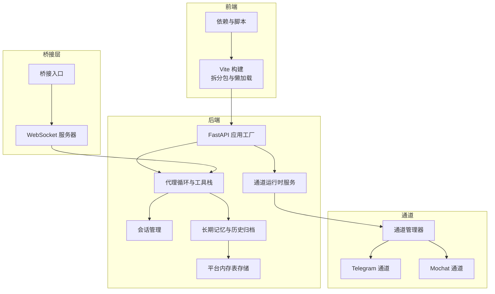
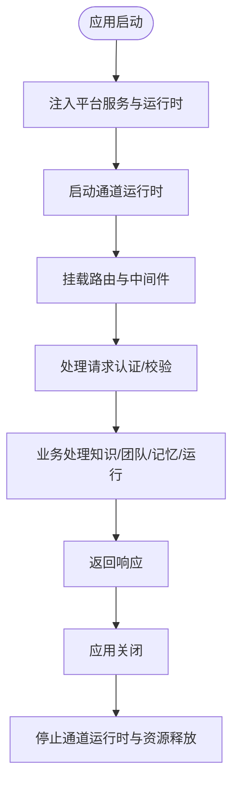
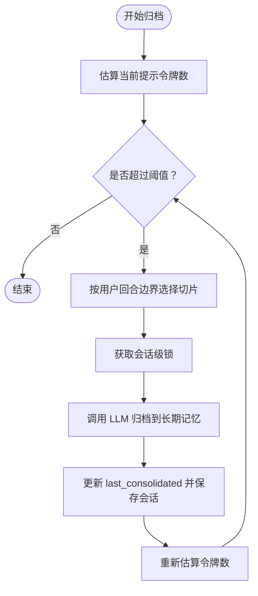
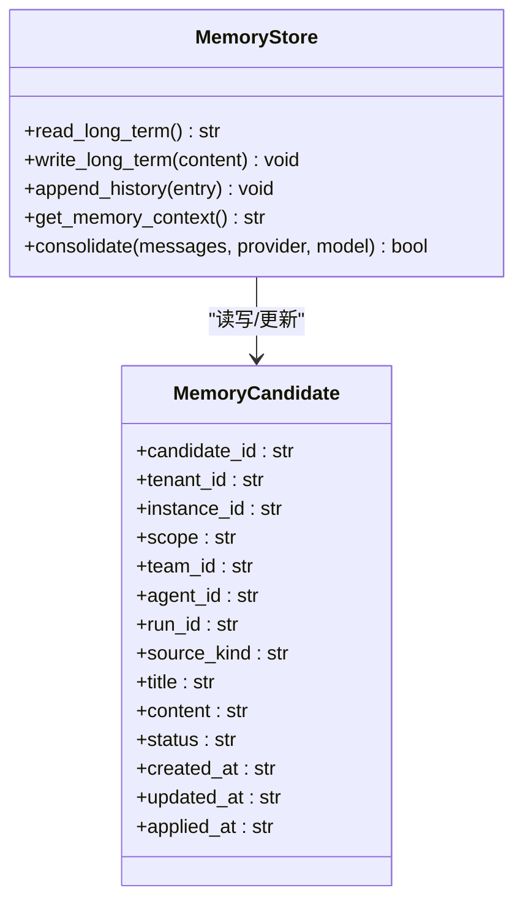
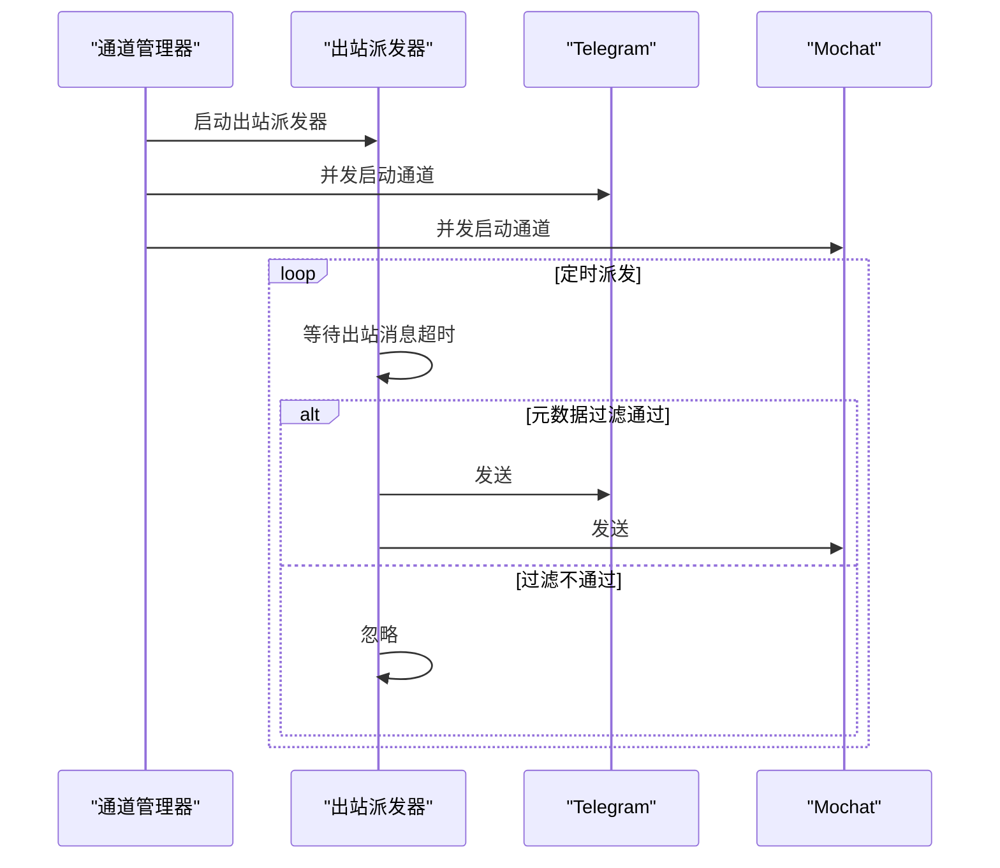
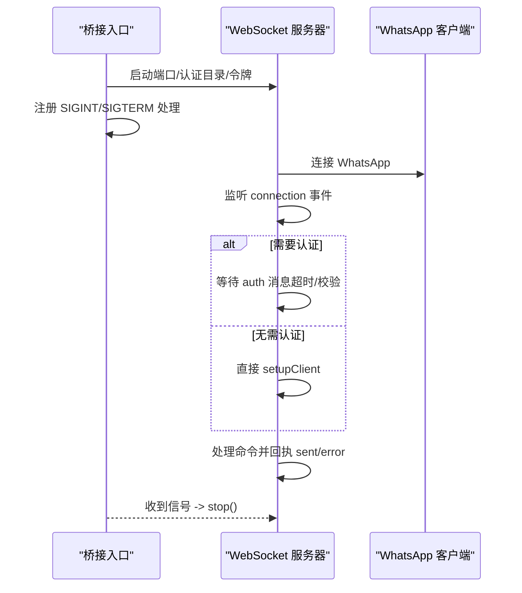
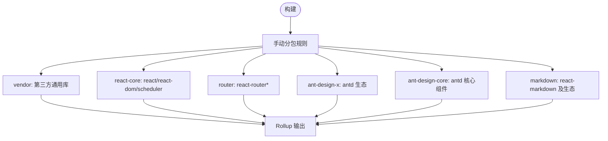
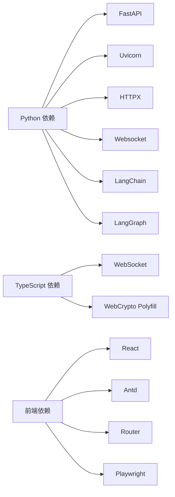

# 性能优化

<cite>
**本文引用的文件**
- [nanobot/web/app.py](file://nanobot/web/app.py)
- [nanobot/web/api.py](file://nanobot/web/api.py)
- [nanobot/web/runtime_services/channel_runtime.py](file://nanobot/web/runtime_services/channel_runtime.py)
- [nanobot/agent/loop.py](file://nanobot/agent/loop.py)
- [nanobot/agent/memory.py](file://nanobot/agent/memory.py)
- [nanobot/session/manager.py](file://nanobot/session/manager.py)
- [nanobot/platform/memory/store.py](file://nanobot/platform/memory/store.py)
- [nanobot/channels/manager.py](file://nanobot/channels/manager.py)
- [nanobot/channels/telegram.py](file://nanobot/channels/telegram.py)
- [nanobot/channels/mochat.py](file://nanobot/channels/mochat.py)
- [bridge/src/index.ts](file://bridge/src/index.ts)
- [bridge/src/server.ts](file://bridge/src/server.ts)
- [web-ui/vite.config.ts](file://web-ui/vite.config.ts)
- [web-ui/package.json](file://web-ui/package.json)
- [pyproject.toml](file://pyproject.toml)
- [tests/test_memory_consolidation_types.py](file://tests/test_memory_consolidation_types.py)
- [tests/test_loop_consolidation_tokens.py](file://tests/test_loop_consolidation_tokens.py)
</cite>

## 目录
1. [简介](#简介)
2. [项目结构](#项目结构)
3. [核心组件](#核心组件)
4. [架构总览](#架构总览)
5. [详细组件分析](#详细组件分析)
6. [依赖分析](#依赖分析)
7. [性能考量](#性能考量)
8. [故障排查指南](#故障排查指南)
9. [结论](#结论)
10. [附录](#附录)

## 简介
本指南面向 Nanobot 项目的性能优化，覆盖后端（Python/FastAPI）、桥接层（TypeScript/WebSocket）、前端（React/Vite）与数据库/通道等子系统。内容包括：
- 代码性能分析方法、瓶颈识别技术与优化策略
- 内存管理最佳实践、缓存策略与资源释放机制
- 异步编程优化、并发处理改进与 I/O 优化
- 数据库查询优化、索引设计与连接池配置建议
- 网络请求优化、API 响应时间与带宽使用优化
- 前端性能优化、渲染优化与用户体验提升技巧

## 项目结构
Nanobot 采用多模块分层组织：Web 前端、Web 后端（FastAPI）、通道适配器（Telegram/Mochat 等）、桥接层（WhatsApp），以及会话与记忆持久化模块。



图示来源
- [nanobot/web/app.py:70-280](file://nanobot/web/app.py#L70-L280)
- [nanobot/web/runtime_services/channel_runtime.py:31-136](file://nanobot/web/runtime_services/channel_runtime.py#L31-L136)
- [nanobot/agent/loop.py:161-306](file://nanobot/agent/loop.py#L161-L306)
- [nanobot/agent/memory.py:60-285](file://nanobot/agent/memory.py#L60-L285)
- [nanobot/platform/memory/store.py:46-201](file://nanobot/platform/memory/store.py#L46-L201)
- [nanobot/channels/manager.py:122-193](file://nanobot/channels/manager.py#L122-L193)
- [bridge/src/index.ts:1-52](file://bridge/src/index.ts#L1-L52)
- [bridge/src/server.ts:41-87](file://bridge/src/server.ts#L41-L87)

章节来源
- [nanobot/web/app.py:70-280](file://nanobot/web/app.py#L70-L280)
- [web-ui/vite.config.ts:1-138](file://web-ui/vite.config.ts#L1-L138)
- [pyproject.toml:1-122](file://pyproject.toml#L1-L122)

## 核心组件
- Web 应用与生命周期：应用工厂负责服务实例注入、中间件注册、路由挂载与生命周期管理；提供静态/开发模式的前后端集成启动能力。
- 通道运行时：在独立线程+事件循环中运行消息路由管线，支持启动/停止/重启与状态查询。
- 代理循环：异步消息消费、MCP 连接、任务调度与响应式停止控制。
- 会话与记忆：会话持久化与缓存、按用户回合边界进行记忆归档、令牌估算与节流。
- 平台内存存储：SQLite 表结构与常用查询封装，支持计数与状态更新。
- 通道适配器：多通道并发启动与出站派发，Telegram 的媒体组合并与打字指示，Mochat 的 WebSocket/轮询回退。
- 桥接层：WhatsApp 桥接的 WebSocket 服务端，认证握手与命令转发。
- 前端构建：Vite 手动分包策略，按依赖拆分 vendor、react-core、router、ant-design 等。

章节来源
- [nanobot/web/app.py:70-280](file://nanobot/web/app.py#L70-L280)
- [nanobot/web/runtime_services/channel_runtime.py:31-136](file://nanobot/web/runtime_services/channel_runtime.py#L31-L136)
- [nanobot/agent/loop.py:161-306](file://nanobot/agent/loop.py#L161-L306)
- [nanobot/session/manager.py:73-252](file://nanobot/session/manager.py#L73-L252)
- [nanobot/agent/memory.py:60-285](file://nanobot/agent/memory.py#L60-L285)
- [nanobot/platform/memory/store.py:46-201](file://nanobot/platform/memory/store.py#L46-L201)
- [nanobot/channels/manager.py:122-193](file://nanobot/channels/manager.py#L122-L193)
- [nanobot/channels/telegram.py:668-694](file://nanobot/channels/telegram.py#L668-L694)
- [nanobot/channels/mochat.py:328-579](file://nanobot/channels/mochat.py#L328-L579)
- [bridge/src/index.ts:1-52](file://bridge/src/index.ts#L1-L52)
- [bridge/src/server.ts:41-87](file://bridge/src/server.ts#L41-L87)
- [web-ui/vite.config.ts:20-81](file://web-ui/vite.config.ts#L20-L81)

## 架构总览
下图展示从浏览器到后端、再到通道与桥接的整体调用链路与异步执行模型。

```mermaid
sequenceDiagram
participant Browser as "浏览器"
participant Vite as "Vite 开发服务器"
participant FastAPI as "FastAPI 应用"
participant Runtime as "通道运行时"
participant Loop as "代理循环"
participant Channels as "通道管理器"
participant Telegram as "Telegram 通道"
participant Mochat as "Mochat 通道"
participant Bridge as "WhatsApp 桥接"
Browser->>Vite : 访问前端页面
Vite->>FastAPI : 代理 /api 请求
FastAPI->>Runtime : 初始化并启动通道运行时
Runtime->>Loop : 在事件循环中运行代理循环
Loop->>Channels : 消费入站消息并派发
Channels->>Telegram : 发送消息
Channels->>Mochat : 轮询/订阅事件
Bridge->>Loop : WebSocket 推送消息
Telegram-->>Loop : 回传消息
Mochat-->>Loop : 回传事件
Loop-->>FastAPI : 返回响应
FastAPI-->>Browser : 返回结果
```

图示来源
- [nanobot/web/app.py:148-184](file://nanobot/web/app.py#L148-L184)
- [nanobot/web/runtime_services/channel_runtime.py:48-98](file://nanobot/web/runtime_services/channel_runtime.py#L48-L98)
- [nanobot/agent/loop.py:289-306](file://nanobot/agent/loop.py#L289-L306)
- [nanobot/channels/manager.py:160-189](file://nanobot/channels/manager.py#L160-L189)
- [bridge/src/server.ts:41-87](file://bridge/src/server.ts#L41-L87)

## 详细组件分析

### Web 应用与生命周期（FastAPI）
- 生命周期管理：通过 lifespan 注入平台服务与运行时，启动通道运行时并在关闭时优雅释放资源。
- 中间件与异常处理：统一认证中间件、CORS/缓存控制、HTTP 异常映射。
- 路由与静态资源：API 路由集中注册，根路径代理到静态前端资源或开发服务器。



图示来源
- [nanobot/web/app.py:148-184](file://nanobot/web/app.py#L148-L184)
- [nanobot/web/app.py:225-246](file://nanobot/web/app.py#L225-L246)
- [nanobot/web/app.py:248-280](file://nanobot/web/app.py#L248-L280)

章节来源
- [nanobot/web/app.py:70-280](file://nanobot/web/app.py#L70-L280)
- [nanobot/web/api.py:24-79](file://nanobot/web/api.py#L24-L79)

### 通道运行时与代理循环
- 通道运行时：在独立线程中创建事件循环，安全地在后台线程调度协程，支持启动/停止/重启与状态查询。
- 代理循环：惰性连接 MCP 服务器，使用超时消费入站消息，创建任务以保持对 /stop 的响应性，并跟踪活跃任务。

```mermaid
sequenceDiagram
participant Runtime as "通道运行时"
participant Loop as "代理循环"
participant Bus as "消息总线"
participant MCP as "MCP 服务器"
Runtime->>Loop : 在事件循环中启动
Loop->>MCP : 惰性连接首次使用
Loop->>Bus : 超时等待入站消息
alt 收到消息
Loop->>Loop : 创建任务派发处理
else 超时
Loop->>Loop : 继续等待
end
note over Loop : 响应 /stop 并清理活跃任务
```

图示来源
- [nanobot/web/runtime_services/channel_runtime.py:48-98](file://nanobot/web/runtime_services/channel_runtime.py#L48-L98)
- [nanobot/agent/loop.py:161-306](file://nanobot/agent/loop.py#L161-L306)

章节来源
- [nanobot/web/runtime_services/channel_runtime.py:31-136](file://nanobot/web/runtime_services/channel_runtime.py#L31-L136)
- [nanobot/agent/loop.py:161-306](file://nanobot/agent/loop.py#L161-L306)

### 会话管理与记忆归档
- 会话管理：JSONL 文件存储，内存缓存，按需加载/保存；历史切片与用户回合对齐，避免孤立工具结果块。
- 记忆归档：基于令牌估算选择安全边界，按回合边界归档旧消息至 MEMORY.md/HISTORY.md，使用弱引用锁避免并发冲突。



图示来源
- [nanobot/agent/memory.py:177-285](file://nanobot/agent/memory.py#L177-L285)
- [nanobot/session/manager.py:46-71](file://nanobot/session/manager.py#L46-L71)

章节来源
- [nanobot/session/manager.py:73-252](file://nanobot/session/manager.py#L73-L252)
- [nanobot/agent/memory.py:60-285](file://nanobot/agent/memory.py#L60-L285)
- [tests/test_loop_consolidation_tokens.py:33-59](file://tests/test_loop_consolidation_tokens.py#L33-L59)

### 平台内存存储（SQLite）
- 表结构初始化、序列化/反序列化、常用查询封装（列表、计数、状态更新）。
- 查询注意点：动态拼接 WHERE 条件与 LIMIT，确保参数绑定防止 SQL 注入。



图示来源
- [nanobot/platform/memory/store.py:46-201](file://nanobot/platform/memory/store.py#L46-L201)

章节来源
- [nanobot/platform/memory/store.py:46-201](file://nanobot/platform/memory/store.py#L46-L201)

### 通道适配器（并发与 I/O）
- 通道管理器：并发启动所有通道与出站派发器，统一停止流程；出站派发器定时等待并根据元数据过滤进度/工具提示。
- Telegram：媒体组缓冲与去抖合并、打字指示的启动/停止任务管理。
- Mochat：WebSocket 优先，失败回退到轮询工作者；支持 msgpack 序列化与重连参数配置。



图示来源
- [nanobot/channels/manager.py:122-193](file://nanobot/channels/manager.py#L122-L193)
- [nanobot/channels/telegram.py:668-694](file://nanobot/channels/telegram.py#L668-L694)
- [nanobot/channels/mochat.py:346-385](file://nanobot/channels/mochat.py#L346-L385)

章节来源
- [nanobot/channels/manager.py:122-193](file://nanobot/channels/manager.py#L122-L193)
- [nanobot/channels/telegram.py:668-694](file://nanobot/channels/telegram.py#L668-L694)
- [nanobot/channels/mochat.py:328-579](file://nanobot/channels/mochat.py#L328-L579)

### 桥接层（WebSocket 与资源释放）
- 桥接入口：设置环境变量端口/认证目录/令牌，处理 SIGINT/SIGTERM 优雅关闭。
- 服务器：WebSocket 连接建立、认证握手、命令解析与错误处理、客户端管理与断开清理。



图示来源
- [bridge/src/index.ts:26-51](file://bridge/src/index.ts#L26-L51)
- [bridge/src/server.ts:41-87](file://bridge/src/server.ts#L41-L87)

章节来源
- [bridge/src/index.ts:1-52](file://bridge/src/index.ts#L1-L52)
- [bridge/src/server.ts:41-87](file://bridge/src/server.ts#L41-L87)

### 前端构建与性能（Vite）
- 手动分包策略：将 react、antd、markdown 等拆分为独立 chunk，减少重复依赖与首屏体积。
- 代理与开发体验：本地代理到后端 API，测试环境内联关键依赖加速。



图示来源
- [web-ui/vite.config.ts:20-81](file://web-ui/vite.config.ts#L20-L81)

章节来源
- [web-ui/vite.config.ts:1-138](file://web-ui/vite.config.ts#L1-L138)
- [web-ui/package.json:1-43](file://web-ui/package.json#L1-L43)

## 依赖分析
- 后端依赖：FastAPI、Uvicorn、HTTPX、Websocket、LangChain/LangGraph、Pydantic 等，构成 API 层、LLM 提供者与消息处理基础。
- 前端依赖：React、Ant Design、Framer Motion、React Router、Playwright 等，支撑交互与可访问性测试。
- 桥接层依赖：Node WebCrypto polyfill、Baileys、WebSocket、进程信号处理。



图示来源
- [pyproject.toml:19-55](file://pyproject.toml#L19-L55)
- [web-ui/package.json:16-41](file://web-ui/package.json#L16-L41)

章节来源
- [pyproject.toml:1-122](file://pyproject.toml#L1-L122)
- [web-ui/package.json:1-43](file://web-ui/package.json#L1-L43)

## 性能考量

### 代码性能分析与瓶颈识别
- 使用异步 I/O 与事件循环：通道运行时与代理循环均在事件循环中运行，避免阻塞主线程。
- 令牌估算与节流：通过记忆归档策略限制上下文大小，降低 LLM 调用成本与延迟。
- 缓存与持久化：会话管理器使用内存缓存与 JSONL 文件持久化，减少磁盘读写频率。
- 并发控制：通道管理器并发启动多个通道，但通过队列与锁控制出站发送节奏。

章节来源
- [nanobot/web/runtime_services/channel_runtime.py:48-98](file://nanobot/web/runtime_services/channel_runtime.py#L48-L98)
- [nanobot/agent/loop.py:289-306](file://nanobot/agent/loop.py#L289-L306)
- [nanobot/agent/memory.py:203-285](file://nanobot/agent/memory.py#L203-L285)
- [nanobot/session/manager.py:96-114](file://nanobot/session/manager.py#L96-L114)
- [nanobot/channels/manager.py:122-193](file://nanobot/channels/manager.py#L122-L193)

### 内存管理最佳实践
- 会话只追加：避免修改历史列表，通过归档文件与偏移量实现高效检索。
- 弱引用锁：记忆归档使用弱引用字典维护会话级锁，避免内存泄漏。
- 资源释放：FastAPI 生命周期在关闭时释放通道运行时与资源；桥接层在信号处理中停止服务。

章节来源
- [nanobot/session/manager.py:16-34](file://nanobot/session/manager.py#L16-L34)
- [nanobot/agent/memory.py:171-176](file://nanobot/agent/memory.py#L171-L176)
- [nanobot/web/app.py:181-184](file://nanobot/web/app.py#L181-L184)
- [bridge/src/index.ts:35-45](file://bridge/src/index.ts#L35-L45)

### 缓存策略
- 会话缓存：内存缓存 + JSONL 文件持久化，按需加载与保存。
- 认证与状态：桥接层使用令牌认证与连接状态标志位，避免重复握手与无效连接。

章节来源
- [nanobot/session/manager.py:96-114](file://nanobot/session/manager.py#L96-L114)
- [bridge/src/server.ts:41-64](file://bridge/src/server.ts#L41-L64)

### 资源释放机制
- 优雅关闭：FastAPI 生命周期、通道运行时 stop、桥接层 stop。
- 任务取消：通道出站派发器与媒体组合并任务支持取消与异常处理。

章节来源
- [nanobot/web/app.py:181-184](file://nanobot/web/app.py#L181-L184)
- [nanobot/web/runtime_services/channel_runtime.py:100-122](file://nanobot/web/runtime_services/channel_runtime.py#L100-L122)
- [bridge/src/index.ts:35-45](file://bridge/src/index.ts#L35-L45)
- [nanobot/channels/manager.py:140-160](file://nanobot/channels/manager.py#L140-L160)

### 异步编程优化与并发处理
- 事件循环隔离：通道运行时在独立线程+事件循环中运行，避免阻塞主循环。
- 任务调度：代理循环使用 create_task 分发消息处理，及时响应停止指令。
- 并发启动：通道管理器并发启动通道与派发器，提高吞吐。

章节来源
- [nanobot/web/runtime_services/channel_runtime.py:48-98](file://nanobot/web/runtime_services/channel_runtime.py#L48-L98)
- [nanobot/agent/loop.py:304-306](file://nanobot/agent/loop.py#L304-L306)
- [nanobot/channels/manager.py:122-139](file://nanobot/channels/manager.py#L122-L139)

### I/O 优化
- 出站派发器超时等待：避免忙轮询，降低 CPU 占用。
- WebSocket 与回退：Mochat 优先使用 WebSocket，失败回退轮询，减少不必要的长轮询。
- 媒体组合并：Telegram 对连续媒体进行去抖合并，减少消息风暴。

章节来源
- [nanobot/channels/manager.py:160-189](file://nanobot/channels/manager.py#L160-L189)
- [nanobot/channels/mochat.py:346-385](file://nanobot/channels/mochat.py#L346-L385)
- [nanobot/channels/telegram.py:668-682](file://nanobot/channels/telegram.py#L668-L682)

### 数据库查询优化、索引设计与连接池配置
- 查询封装：平台内存存储提供常用查询（列表、计数、更新），注意参数绑定与 LIMIT 使用。
- 建议索引：针对高频过滤字段（tenant_id、instance_id、team_id、status、scope）建立复合索引，减少全表扫描。
- 连接池：生产环境建议使用连接池（如 sqlite 的 WAL 模式与连接池库），避免高并发下的锁竞争。

章节来源
- [nanobot/platform/memory/store.py:117-176](file://nanobot/platform/memory/store.py#L117-L176)

### 网络请求优化、API 响应时间与带宽使用
- 代理与缓存：前端通过 Vite 代理到后端 API，后端对静态资源与认证接口设置缓存控制头。
- 重试与降级：通道运行时与心跳服务使用异步重试策略，避免单点失败影响整体。
- 带宽优化：桥接层支持 msgpack 序列化（若可用），减少传输体积。

章节来源
- [nanobot/web/app.py:225-243](file://nanobot/web/app.py#L225-L243)
- [nanobot/heartbeat/service.py:108-119](file://nanobot/heartbeat/service.py#L108-L119)
- [nanobot/channels/mochat.py:358-364](file://nanobot/channels/mochat.py#L358-L364)

### 前端性能优化、渲染优化与用户体验
- 包体积拆分：Vite 手动分包策略减少首屏体积，提升加载速度。
- 组件与动画：使用 Framer Motion 提升交互体验，Ant Design 组件按需引入。
- 可访问性：Playwright 测试包含可访问性检查，保障用户体验。

章节来源
- [web-ui/vite.config.ts:20-81](file://web-ui/vite.config.ts#L20-L81)
- [web-ui/package.json:16-41](file://web-ui/package.json#L16-L41)

## 故障排查指南
- 记忆归档重试：当 LLM 返回临时错误时，测试验证了自动重试逻辑与延迟策略。
- 令牌阈值触发：测试验证在超过上下文阈值时触发归档，确保会话稳定。
- 通道停止异常：通道管理器在停止过程中捕获异常并记录日志，避免崩溃。

章节来源
- [tests/test_memory_consolidation_types.py:245-267](file://tests/test_memory_consolidation_types.py#L245-L267)
- [tests/test_loop_consolidation_tokens.py:38-59](file://tests/test_loop_consolidation_tokens.py#L38-L59)
- [nanobot/channels/manager.py:140-160](file://nanobot/channels/manager.py#L140-L160)

## 结论
Nanobot 在架构上已具备良好的异步与并发基础：事件循环隔离、会话与记忆归档、通道并发派发与桥接层 WebSocket。结合本文的优化建议（令牌估算、缓存、索引、连接池、序列化与前端分包），可在高并发与长对话场景下进一步降低延迟、提升吞吐与稳定性。

## 附录
- 关键实现参考路径（不含具体代码内容）：
  - Web 应用生命周期与中间件：[nanobot/web/app.py:148-246](file://nanobot/web/app.py#L148-L246)
  - 通道运行时与事件循环：[nanobot/web/runtime_services/channel_runtime.py:48-98](file://nanobot/web/runtime_services/channel_runtime.py#L48-L98)
  - 代理循环与任务调度：[nanobot/agent/loop.py:289-306](file://nanobot/agent/loop.py#L289-L306)
  - 会话管理与历史切片：[nanobot/session/manager.py:46-71](file://nanobot/session/manager.py#L46-L71)
  - 记忆归档与令牌估算：[nanobot/agent/memory.py:177-285](file://nanobot/agent/memory.py#L177-L285)
  - 平台内存存储查询封装：[nanobot/platform/memory/store.py:117-176](file://nanobot/platform/memory/store.py#L117-L176)
  - 通道并发与出站派发：[nanobot/channels/manager.py:122-193](file://nanobot/channels/manager.py#L122-L193)
  - Telegram 媒体组合并与打字指示：[nanobot/channels/telegram.py:668-694](file://nanobot/channels/telegram.py#L668-L694)
  - Mochat WebSocket/轮询回退：[nanobot/channels/mochat.py:346-385](file://nanobot/channels/mochat.py#L346-L385)
  - 桥接入口与优雅关闭：[bridge/src/index.ts:35-45](file://bridge/src/index.ts#L35-L45)
  - 桥接服务器认证与命令处理：[bridge/src/server.ts:41-87](file://bridge/src/server.ts#L41-L87)
  - 前端分包策略与代理：[web-ui/vite.config.ts:20-81](file://web-ui/vite.config.ts#L20-L81)
  - 前端依赖与脚本：[web-ui/package.json:1-43](file://web-ui/package.json#L1-L43)
  - 后端依赖清单：[pyproject.toml:19-55](file://pyproject.toml#L19-L55)