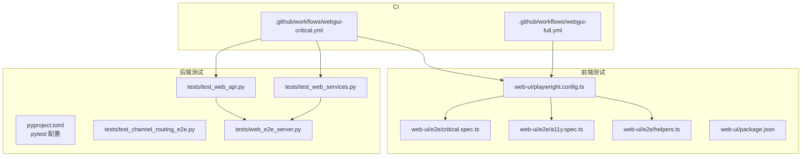
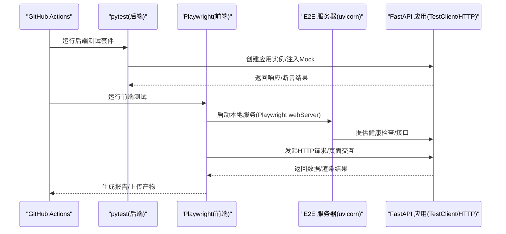
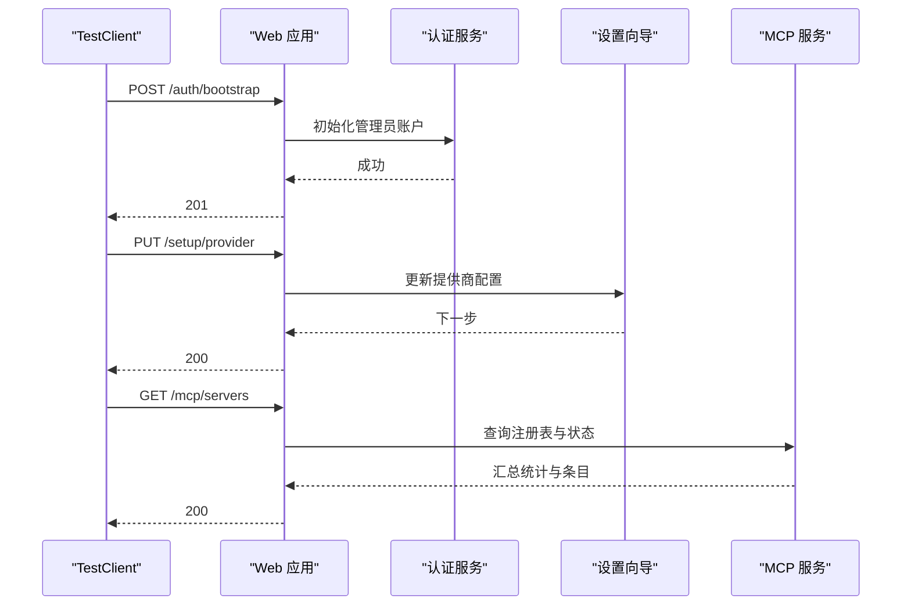
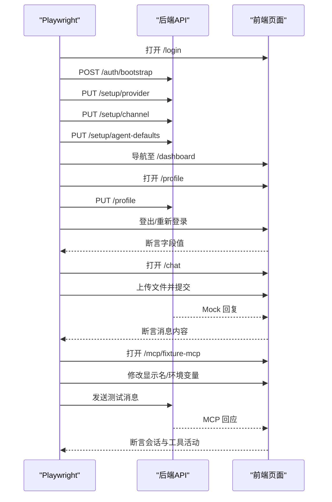
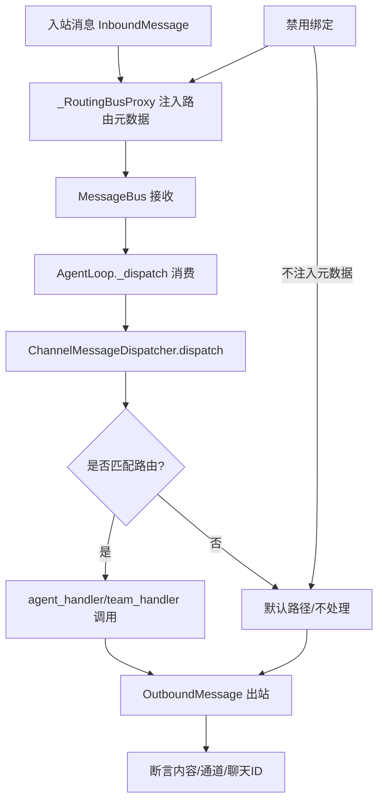
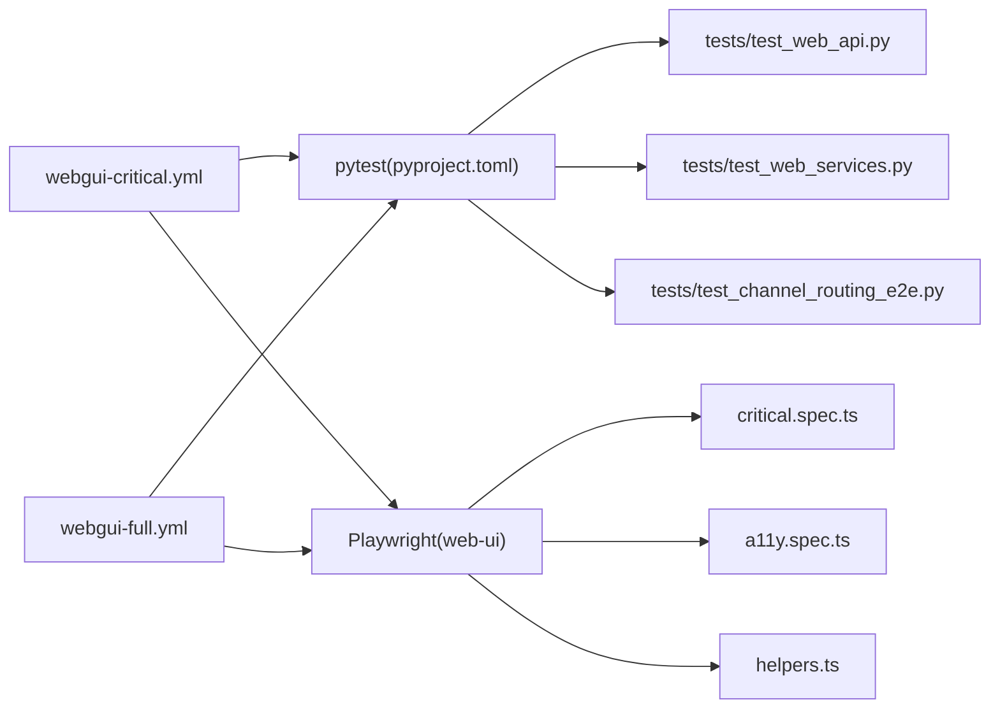

# 测试策略

<cite>
**本文引用的文件**
- [pyproject.toml](file://pyproject.toml)
- [.github/workflows/webgui-critical.yml](file://.github/workflows/webgui-critical.yml)
- [.github/workflows/webgui-full.yml](file://.github/workflows/webgui-full.yml)
- [tests/test_web_api.py](file://tests/test_web_api.py)
- [tests/test_web_services.py](file://tests/test_web_services.py)
- [tests/web_e2e_server.py](file://tests/web_e2e_server.py)
- [tests/test_channel_routing_e2e.py](file://tests/test_channel_routing_e2e.py)
- [web-ui/playwright.config.ts](file://web-ui/playwright.config.ts)
- [web-ui/e2e/critical.spec.ts](file://web-ui/e2e/critical.spec.ts)
- [web-ui/e2e/helpers.ts](file://web-ui/e2e/helpers.ts)
- [web-ui/e2e/a11y.spec.ts](file://web-ui/e2e/a11y.spec.ts)
- [web-ui/package.json](file://web-ui/package.json)
</cite>

## 目录
1. [引言](#引言)
2. [项目结构](#项目结构)
3. [核心组件](#核心组件)
4. [架构总览](#架构总览)
5. [详细组件分析](#详细组件分析)
6. [依赖分析](#依赖分析)
7. [性能考虑](#性能考虑)
8. [故障排查指南](#故障排查指南)
9. [结论](#结论)
10. [附录](#附录)

## 引言
本测试策略文档面向 Nanobot 项目，系统化阐述单元测试、集成测试与端到端测试的设计原则与实施方法，覆盖测试框架选择、工具配置、测试环境搭建、测试用例编写规范、Mock 使用与测试数据管理，以及性能测试、负载测试与压力测试的实施方案。同时明确覆盖率要求、测试报告生成与持续集成中的测试流程，给出测试自动化、回归测试与测试维护策略，帮助团队在快速迭代中保持质量稳定。

## 项目结构
Nanobot 的测试体系由后端 Python 单元/集成测试、前端 Playwright 端到端测试与 CI 工作流三部分组成：
- 后端测试：基于 pytest，覆盖 Web API、服务层与业务流程（含 Mock 与临时配置）。
- 前端测试：基于 Playwright，包含关键路径与可访问性测试套件。
- CI 工作流：在 PR 与主分支上分别运行“关键 GUI 测试”和“完整 GUI 测试”，确保回归与冒烟验证。

图表来源
- [.github/workflows/webgui-critical.yml:1-63](file://.github/workflows/webgui-critical.yml#L1-L63)
- [.github/workflows/webgui-full.yml:1-59](file://.github/workflows/webgui-full.yml#L1-L59)
- [pyproject.toml:119-122](file://pyproject.toml#L119-L122)
- [tests/test_web_api.py:1-800](file://tests/test_web_api.py#L1-L800)
- [tests/test_web_services.py:1-314](file://tests/test_web_services.py#L1-L314)
- [tests/test_channel_routing_e2e.py:1-642](file://tests/test_channel_routing_e2e.py#L1-L642)
- [tests/web_e2e_server.py:1-161](file://tests/web_e2e_server.py#L1-L161)
- [web-ui/playwright.config.ts:1-34](file://web-ui/playwright.config.ts#L1-L34)
- [web-ui/e2e/critical.spec.ts:1-82](file://web-ui/e2e/critical.spec.ts#L1-L82)
- [web-ui/e2e/a11y.spec.ts:1-28](file://web-ui/e2e/a11y.spec.ts#L1-L28)
- [web-ui/e2e/helpers.ts:1-72](file://web-ui/e2e/helpers.ts#L1-L72)
- [web-ui/package.json:1-43](file://web-ui/package.json#L1-L43)

章节来源
- [.github/workflows/webgui-critical.yml:1-63](file://.github/workflows/webgui-critical.yml#L1-L63)
- [.github/workflows/webgui-full.yml:1-59](file://.github/workflows/webgui-full.yml#L1-L59)
- [pyproject.toml:119-122](file://pyproject.toml#L119-L122)

## 核心组件
- 测试框架与运行器
  - 后端：pytest（异步模式自动配置），pytest-asyncio 支持协程测试。
  - 前端：Playwright（Chromium），Axe-core 进行可访问性检测。
- 测试环境
  - 后端：FastAPI TestClient 搭配临时配置与内存数据库；必要时通过临时目录隔离状态。
  - 前端：本地 uvicorn 服务器作为 E2E 服务端，Playwright 自动拉起浏览器。
- Mock 与替身
  - 后端广泛使用 unittest.mock.AsyncMock、patch 替换外部依赖或内部服务。
  - 前端通过自定义请求拦截与假实现模拟网络行为。
- 测试数据管理
  - 使用临时目录与临时数据库文件，按用例粒度初始化配置与数据，结束后清理。
  - E2E 使用固定 fixture 与预置注册表，保证可重复性。

章节来源
- [pyproject.toml:66-73](file://pyproject.toml#L66-L73)
- [tests/test_web_api.py:12-26](file://tests/test_web_api.py#L12-L26)
- [tests/test_web_services.py:10-21](file://tests/test_web_services.py#L10-L21)
- [web-ui/playwright.config.ts:9-33](file://web-ui/playwright.config.ts#L9-L33)
- [tests/web_e2e_server.py:30-72](file://tests/web_e2e_server.py#L30-L72)

## 架构总览
下图展示从 CI 到测试执行的关键路径与交互：

图表来源
- [.github/workflows/webgui-critical.yml:38-51](file://.github/workflows/webgui-critical.yml#L38-L51)
- [web-ui/playwright.config.ts:20-32](file://web-ui/playwright.config.ts#L20-L32)
- [tests/web_e2e_server.py:135-161](file://tests/web_e2e_server.py#L135-L161)

## 详细组件分析

### 后端测试：Web API 与服务层
- 设计原则
  - 使用 TestClient 快速构建应用上下文，避免真实网络开销。
  - 通过 monkeypatch 注入临时配置路径，确保测试隔离。
  - 广泛使用 AsyncMock 与 patch 替换外部服务（如渠道探测、MCP 仓库等），保证可控性与稳定性。
- 关键流程
  - 认证引导、登录登出、会话持久化与重启失效验证。
  - 设置向导步骤推进与恢复、配置落盘校验。
  - 渠道列表/详情/更新、测试端点与绑定管理。
  - MCP 仓库分析/安装/探测、服务器启用切换与删除。
- 数据与状态
  - 通过临时目录写入配置与工作区，避免污染宿主环境。
  - 服务层测试直接构造配置对象，不依赖持久化存储。

图表来源
- [tests/test_web_api.py:121-277](file://tests/test_web_api.py#L121-L277)
- [tests/test_web_api.py:592-687](file://tests/test_web_api.py#L592-L687)
- [tests/test_web_services.py:58-104](file://tests/test_web_services.py#L58-L104)

章节来源
- [tests/test_web_api.py:121-277](file://tests/test_web_api.py#L121-L277)
- [tests/test_web_api.py:592-687](file://tests/test_web_api.py#L592-L687)
- [tests/test_web_services.py:58-104](file://tests/test_web_services.py#L58-L104)

### 前端测试：Playwright 关键路径与可访问性
- 设计原则
  - 关键路径测试（@critical）覆盖引导、设置、个人资料、聊天上传与 MCP 测试对话。
  - 可访问性测试（@a11y）使用 Axe-core 检测严重与严重违规。
  - 使用 helpers 统一登录与引导流程，减少重复代码。
- 关键流程
  - 登录与设置向导完成后进入仪表盘。
  - 个人资料修改后跨会话保持一致。
  - 文件上传与聊天消息确定性 Mock 回复。
  - MCP 详情页更新显示名与环境变量，进行独立测试会话。

图表来源
- [web-ui/e2e/critical.spec.ts:14-81](file://web-ui/e2e/critical.spec.ts#L14-L81)
- [web-ui/e2e/helpers.ts:9-52](file://web-ui/e2e/helpers.ts#L9-L52)
- [web-ui/e2e/a11y.spec.ts:11-26](file://web-ui/e2e/a11y.spec.ts#L11-L26)
- [web-ui/playwright.config.ts:9-33](file://web-ui/playwright.config.ts#L9-L33)

章节来源
- [web-ui/e2e/critical.spec.ts:14-81](file://web-ui/e2e/critical.spec.ts#L14-L81)
- [web-ui/e2e/helpers.ts:9-52](file://web-ui/e2e/helpers.ts#L9-L52)
- [web-ui/e2e/a11y.spec.ts:11-26](file://web-ui/e2e/a11y.spec.ts#L11-L26)

### 端到端测试：通道路由流水线
- 设计原则
  - 覆盖从入站消息到出站响应的完整链路：RoutingBusProxy 注入路由元数据 -> MessageBus -> Dispatcher -> Handler -> OutboundMessage。
  - 包含精确匹配优先于通配符、禁用绑定不注入元数据、错误处理回退等边界场景。
- 关键流程
  - 绑定服务 CRUD 与解析：创建/查询/更新/删除；通配符与精确匹配优先级。
  - 元数据注入：校验路由目标类型、ID 与绑定 ID 是否正确注入。
  - 完整流水线：代理发布入站消息 -> 总线消费 -> 分发器调度 -> 处理器调用 -> 出站消息。
  - Web API 集成：通过本地运行的 Web UI 服务端进行绑定创建/解析/列表/更新等 API 验证。

图表来源
- [tests/test_channel_routing_e2e.py:297-495](file://tests/test_channel_routing_e2e.py#L297-L495)

章节来源
- [tests/test_channel_routing_e2e.py:116-185](file://tests/test_channel_routing_e2e.py#L116-L185)
- [tests/test_channel_routing_e2e.py:232-291](file://tests/test_channel_routing_e2e.py#L232-L291)
- [tests/test_channel_routing_e2e.py:297-495](file://tests/test_channel_routing_e2e.py#L297-L495)
- [tests/test_channel_routing_e2e.py:502-642](file://tests/test_channel_routing_e2e.py#L502-L642)

### 测试数据管理与 Mock 策略
- 测试数据
  - 后端：通过临时目录生成配置与工作区，使用内存数据库文件（如通道绑定）。
  - 前端：E2E 服务器内置固定注册表与 MCP 服务器条目，确保一致性。
- Mock 策略
  - 后端：对第三方 SDK、HTTP 客户端、文件系统与外部进程进行替换，保证可控与可重复。
  - 前端：通过自定义请求拦截与假实现模拟网络行为，避免真实外部依赖。

章节来源
- [tests/test_web_api.py:29-36](file://tests/test_web_api.py#L29-L36)
- [tests/test_web_services.py:107-136](file://tests/test_web_services.py#L107-L136)
- [tests/web_e2e_server.py:52-72](file://tests/web_e2e_server.py#L52-L72)

## 依赖分析
- 测试框架与工具
  - 后端：pytest、pytest-asyncio、FastAPI TestClient、unittest.mock。
  - 前端：Playwright、Axe-core、Vitest（用于组件级测试，不在本文重点范围）。
- CI 工作流
  - 关键 GUI 测试：仅运行后端 GUI 测试与前端关键路径与可访问性测试。
  - 完整 GUI 测试：在主分支与定时任务触发，额外包含前端构建与全量关键路径测试。

图表来源
- [pyproject.toml:66-73](file://pyproject.toml#L66-L73)
- [web-ui/package.json:6-14](file://web-ui/package.json#L6-L14)
- [.github/workflows/webgui-critical.yml:38-51](file://.github/workflows/webgui-critical.yml#L38-L51)
- [.github/workflows/webgui-full.yml:42-59](file://.github/workflows/webgui-full.yml#L42-L59)

章节来源
- [pyproject.toml:66-73](file://pyproject.toml#L66-L73)
- [web-ui/package.json:6-14](file://web-ui/package.json#L6-L14)
- [.github/workflows/webgui-critical.yml:38-51](file://.github/workflows/webgui-critical.yml#L38-L51)
- [.github/workflows/webgui-full.yml:42-59](file://.github/workflows/webgui-full.yml#L42-L59)

## 性能考虑
- 单元测试
  - 优先使用内存态与 Mock，避免磁盘与网络 IO；对耗时操作进行缓存与复用。
- 集成测试
  - 后端使用 TestClient 与临时配置，减少启动成本；必要时共享同一应用实例以降低冷启动。
- 端到端测试
  - 使用本地 uvicorn 服务，缩短响应延迟；合理设置超时与重试，平衡稳定性与速度。
- 资源隔离
  - 严格使用临时目录与随机端口，避免并发冲突；在 CI 中限制并行度，防止资源争用。

## 故障排查指南
- 常见问题
  - 会话与认证：重启后会话失效、登录凭据错误、认证状态异常。
  - 配置与设置向导：配置未落盘、步骤跳过导致后续校验失败。
  - 渠道与 MCP：渠道测试失败、MCP 服务器缺失环境变量、安装重复。
  - 前端：页面元素定位失败、Mock 数据不一致、浏览器驱动版本不匹配。
- 排查建议
  - 后端：开启详细日志，核对 TestClient 请求与响应；检查临时配置路径与权限。
  - 前端：启用 trace/screenshot/video；确认 Playwright webServer 正常启动与健康检查通过。
  - CI：查看 artifacts 与报告，定位失败用例与堆栈；在本地复现最小化场景。

章节来源
- [tests/test_web_api.py:186-210](file://tests/test_web_api.py#L186-L210)
- [tests/test_web_api.py:212-277](file://tests/test_web_api.py#L212-L277)
- [tests/test_web_api.py:341-404](file://tests/test_web_api.py#L341-L404)
- [tests/test_web_api.py:592-687](file://tests/test_web_api.py#L592-L687)
- [web-ui/playwright.config.ts:13-19](file://web-ui/playwright.config.ts#L13-L19)

## 结论
Nanobot 的测试策略以 pytest 与 Playwright 为核心，结合 CI 工作流形成“关键路径 + 完整覆盖”的双轨测试体系。通过严格的 Mock 与测试数据管理、清晰的断言与可观测性配置，确保后端 API、服务层与前端 GUI 在变更中保持稳定。建议持续优化用例粒度与并行度，在保证质量的前提下提升测试效率。

## 附录

### 测试用例编写规范
- 命名与分组
  - 使用语义化命名，区分功能模块与场景（如认证、设置向导、渠道、MCP）。
  - 使用标签（如 @critical、@a11y）组织用例，便于筛选与 CI 调度。
- 断言与期望
  - 明确断言点（状态码、响应体字段、会话 Cookie、文件存在性等）。
  - 对异步流程使用 await 与超时控制，避免 flaky。
- 隔离与清理
  - 每个用例使用独立临时目录与配置，用例间不共享状态。
  - 用例结束清理临时文件与数据库，避免残留影响后续执行。

### 测试覆盖率与报告
- 覆盖率
  - 建议后端覆盖率不低于 80%，关键路径不低于 90%；前端组件级测试覆盖率不低于 70%。
- 报告
  - 后端：pytest 输出简洁报告；前端：Playwright HTML 报告与 artifacts 上传。
- CI 集成
  - 关键 GUI 测试在 PR 触发，完整 GUI 测试在主分支与定时任务触发；失败即阻断合并。

章节来源
- [.github/workflows/webgui-critical.yml:53-61](file://.github/workflows/webgui-critical.yml#L53-L61)
- [.github/workflows/webgui-full.yml:57-59](file://.github/workflows/webgui-full.yml#L57-L59)
- [web-ui/playwright.config.ts:13-13](file://web-ui/playwright.config.ts#L13-L13)