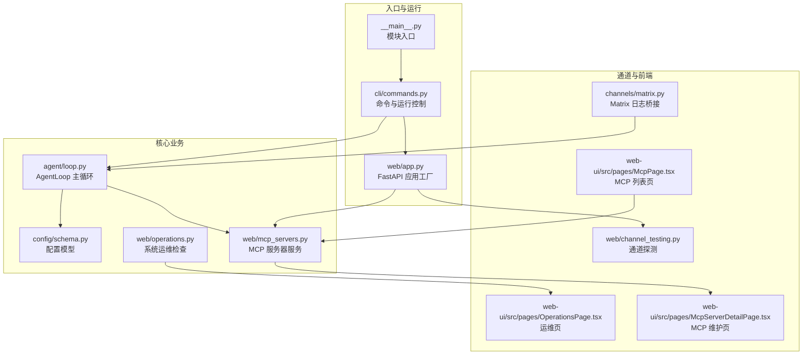
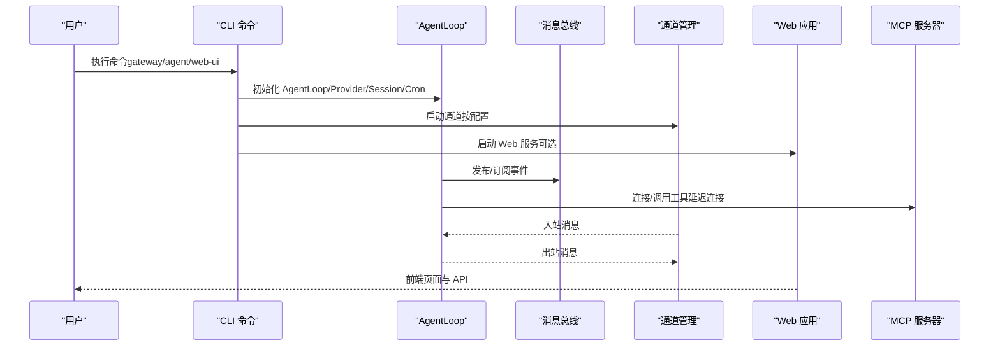
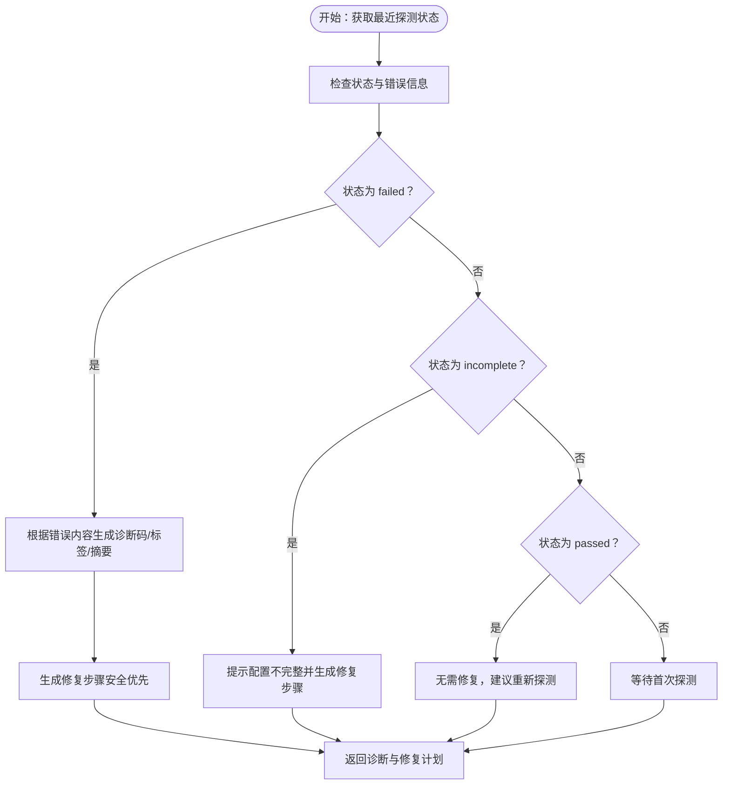
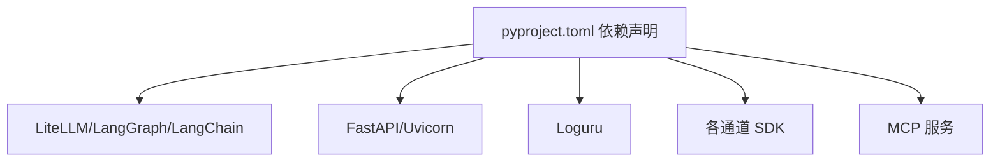

# 调试与故障排除

<cite>
**本文引用的文件**
- [README.md](file://README.md)
- [pyproject.toml](file://pyproject.toml)
- [nanobot/__main__.py](file://nanobot/__main__.py)
- [nanobot/cli/commands.py](file://nanobot/cli/commands.py)
- [nanobot/web/app.py](file://nanobot/web/app.py)
- [nanobot/config/schema.py](file://nanobot/config/schema.py)
- [nanobot/channels/matrix.py](file://nanobot/channels/matrix.py)
- [nanobot/web/mcp_servers.py](file://nanobot/web/mcp_servers.py)
- [nanobot/web/operations.py](file://nanobot/web/operations.py)
- [nanobot/agent/loop.py](file://nanobot/agent/loop.py)
- [nanobot/web/channel_testing.py](file://nanobot/web/channel_testing.py)
- [web-ui/src/pages/OperationsPage.tsx](file://web-ui/src/pages/OperationsPage.tsx)
- [web-ui/src/pages/McpServerDetailPage.tsx](file://web-ui/src/pages/McpServerDetailPage.tsx)
- [web-ui/src/pages/McpPage.tsx](file://web-ui/src/pages/McpPage.tsx)
- [web-ui/src/smoke/app-smoke.test.tsx](file://web-ui/src/smoke/app-smoke.test.tsx)
- [tests/test_mcp_tool.py](file://tests/test_mcp_tool.py)
- [nanobot/platform/runs/store.py](file://nanobot/platform/runs/store.py)
- [nanobot/platform/search_scoring.py](file://nanobot/platform/search_scoring.py)
</cite>

## 目录
1. [简介](#简介)
2. [项目结构](#项目结构)
3. [核心组件](#核心组件)
4. [架构总览](#架构总览)
5. [详细组件分析](#详细组件分析)
6. [依赖分析](#依赖分析)
7. [性能考量](#性能考量)
8. [故障排除指南](#故障排除指南)
9. [结论](#结论)
10. [附录](#附录)

## 简介
本指南面向 Nanobot 开发者与运维人员，系统性梳理开发调试、日志分析、常见错误定位、性能与并发问题排查、网络通信与 API 调用跟踪、数据库查询优化以及生产环境故障排除与应急响应流程。文档基于仓库现有实现进行归纳总结，并提供可视化图示帮助快速定位问题。

## 项目结构
Nanobot 采用模块化分层设计：CLI 命令入口负责交互与网关启动；Web 应用（FastAPI）承载前端与后端接口；通道（Channels）负责多平台消息接入；代理循环（AgentLoop）驱动智能体执行；工具与 MCP 服务器提供外部能力扩展；配置（Pydantic Schema）统一管理运行参数；测试与前端 UI 提供验证与可观测性支持。

图表来源
- [nanobot/__main__.py:1-9](file://nanobot/__main__.py#L1-L9)
- [nanobot/cli/commands.py:308-678](file://nanobot/cli/commands.py#L308-L678)
- [nanobot/web/app.py:70-280](file://nanobot/web/app.py#L70-L280)
- [nanobot/agent/loop.py:161-181](file://nanobot/agent/loop.py#L161-L181)
- [nanobot/config/schema.py:351-449](file://nanobot/config/schema.py#L351-L449)
- [nanobot/web/mcp_servers.py:444-689](file://nanobot/web/mcp_servers.py#L444-L689)
- [nanobot/web/operations.py:205-231](file://nanobot/web/operations.py#L205-L231)
- [nanobot/channels/matrix.py:124-144](file://nanobot/channels/matrix.py#L124-L144)
- [nanobot/web/channel_testing.py:113-138](file://nanobot/web/channel_testing.py#L113-L138)
- [web-ui/src/pages/OperationsPage.tsx:67-105](file://web-ui/src/pages/OperationsPage.tsx#L67-L105)
- [web-ui/src/pages/McpServerDetailPage.tsx:277-305](file://web-ui/src/pages/McpServerDetailPage.tsx#L277-L305)
- [web-ui/src/pages/McpPage.tsx:350-379](file://web-ui/src/pages/McpPage.tsx#L350-L379)

章节来源
- [README.md:1-120](file://README.md#L1-L120)
- [pyproject.toml:1-122](file://pyproject.toml#L1-L122)

## 核心组件
- CLI 与运行控制：提供 onboard、gateway、agent、web-ui 等命令，支持日志开关、工作空间与配置覆盖、终端交互等。
- AgentLoop：主循环，负责消息路由、工具调用、MCP 连接、心跳与定时任务调度。
- Web 应用：FastAPI 应用工厂，注册中间件、异常处理器、路由与静态资源，提供运维与 MCP 管理界面。
- 配置模型：统一的 Pydantic 配置结构，涵盖渠道、代理默认参数、提供商、网关、工具（含 MCP）等。
- 通道与日志桥接：Matrix 通道将标准库日志桥接到 Loguru，便于统一输出。
- 运维与探测：系统运行时检查、通道探测、MCP 服务器探测与修复建议生成。
- 测试与前端：覆盖 MCP 工具超时、取消等边界场景，前端提供运维页与 MCP 维护页。

章节来源
- [nanobot/cli/commands.py:308-800](file://nanobot/cli/commands.py#L308-L800)
- [nanobot/agent/loop.py:161-181](file://nanobot/agent/loop.py#L161-L181)
- [nanobot/web/app.py:70-280](file://nanobot/web/app.py#L70-L280)
- [nanobot/config/schema.py:351-449](file://nanobot/config/schema.py#L351-L449)
- [nanobot/channels/matrix.py:124-144](file://nanobot/channels/matrix.py#L124-L144)
- [nanobot/web/operations.py:205-231](file://nanobot/web/operations.py#L205-L231)
- [nanobot/web/channel_testing.py:113-138](file://nanobot/web/channel_testing.py#L113-L138)

## 架构总览
下图展示从 CLI 启动到 Web UI 的关键交互路径，以及 AgentLoop 与 MCP、通道、配置之间的关系。

图表来源
- [nanobot/cli/commands.py:308-678](file://nanobot/cli/commands.py#L308-L678)
- [nanobot/agent/loop.py:161-181](file://nanobot/agent/loop.py#L161-L181)
- [nanobot/web/app.py:70-280](file://nanobot/web/app.py#L70-L280)

## 详细组件分析

### CLI 调试与断点设置
- 启动与日志
  - gateway 命令支持 --verbose 输出，内部使用标准 logging 将级别设为 DEBUG，便于在关键路径设置断点。
  - agent 命令支持 --logs 控制是否启用 nanobot 模块的日志输出，便于观察运行期日志。
- 断点建议
  - 在 CLI 输入读取与回显处理处设置断点，验证交互输入与历史记录行为。
  - 在 AgentLoop 初始化与 process_direct 路径设置断点，观察消息进入与工具调用链。
  - 在 MCP 连接逻辑（_connect_mcp）设置断点，验证连接失败重试与异常处理。
- 变量监控
  - 关注配置加载（_load_runtime_config）、Provider 创建（_make_provider）、会话管理（SessionManager）等上下文对象。
  - 观察 Cron 与 Heartbeat 的回调与调度状态。

章节来源
- [nanobot/cli/commands.py:308-800](file://nanobot/cli/commands.py#L308-L800)
- [nanobot/agent/loop.py:161-181](file://nanobot/agent/loop.py#L161-L181)

### Web 应用与前端可观测性
- 异常与中间件
  - Web 应用注册了 API 错误、请求校验错误、HTTP 异常处理器，便于捕获与统一返回。
  - 认证中间件对 /api/v1/* 路由进行鉴权拦截，未登录返回 401。
- 前端运维页
  - 运维页提供日志尾部查看与可用运维动作统计，辅助快速定位问题。
- 前端 MCP 维护页
  - 支持探测、启用/停用 MCP、查看修复计划与步骤，结合后端诊断逻辑进行排障。

章节来源
- [nanobot/web/app.py:205-246](file://nanobot/web/app.py#L205-L246)
- [web-ui/src/pages/OperationsPage.tsx:67-105](file://web-ui/src/pages/OperationsPage.tsx#L67-L105)
- [web-ui/src/pages/McpServerDetailPage.tsx:463-502](file://web-ui/src/pages/McpServerDetailPage.tsx#L463-L502)

### 通道与日志桥接（Matrix）
- 标准库日志桥接
  - 将 matrix-nio 的标准库日志桥接到 Loguru，避免日志分散，统一级别与格式。
- 错误分类与日志级别
  - 对 Matrix 同步/加入/发送错误进行分类，区分认证类错误（ERROR）与一般错误（WARNING），便于快速识别严重性。

章节来源
- [nanobot/channels/matrix.py:124-144](file://nanobot/channels/matrix.py#L124-L144)
- [nanobot/channels/matrix.py:393-407](file://nanobot/channels/matrix.py#L393-L407)

### MCP 服务器诊断与修复
- 诊断逻辑
  - 基于最近一次探测状态与错误信息，生成诊断码、标签、摘要、详情与修复步骤。
  - 支持“运行时缺失”“连接被拒绝”“鉴权失败”“超时”等常见错误类型识别。
- 修复步骤
  - 提供“检查命令/脚本路径”“确认远端服务正在监听”“检查鉴权凭据”“检查服务耗时或调高超时”等安全步骤。
- 前端联动
  - 前端 MCP 维护页展示诊断标签、摘要、缺失环境变量与修复步骤清单，支持一键探测与启停。

图表来源
- [nanobot/web/mcp_servers.py:444-493](file://nanobot/web/mcp_servers.py#L444-L493)
- [nanobot/web/mcp_servers.py:560-625](file://nanobot/web/mcp_servers.py#L560-L625)
- [web-ui/src/pages/McpServerDetailPage.tsx:463-502](file://web-ui/src/pages/McpServerDetailPage.tsx#L463-L502)

章节来源
- [nanobot/web/mcp_servers.py:444-689](file://nanobot/web/mcp_servers.py#L444-L689)
- [web-ui/src/pages/McpServerDetailPage.tsx:277-305](file://web-ui/src/pages/McpServerDetailPage.tsx#L277-L305)
- [web-ui/src/pages/McpPage.tsx:350-379](file://web-ui/src/pages/McpPage.tsx#L350-L379)
- [web-ui/src/smoke/app-smoke.test.tsx:1123-1165](file://web-ui/src/smoke/app-smoke.test.tsx#L1123-L1165)

### 通道探测与网络通信调试
- 通道探测
  - WebChannelTestService 提供多种通道的探测函数（Telegram、Discord、Slack、Matrix、Email、WhatsApp、Feishu、DingTalk、Mochat、QQ、WeCom），用于快速验证连通性与配置正确性。
- 调试要点
  - 使用探测接口输出“检查项、状态、详情”，结合前端“运维页”查看日志尾部，定位网络/鉴权/权限等问题。
  - 对长连接通道（Matrix/WebSocket）关注握手、鉴权与心跳；对轮询通道（Email）关注轮询间隔与邮箱权限。

章节来源
- [nanobot/web/channel_testing.py:113-138](file://nanobot/web/channel_testing.py#L113-L138)
- [web-ui/src/pages/OperationsPage.tsx:67-105](file://web-ui/src/pages/OperationsPage.tsx#L67-L105)

### 数据库与索引优化
- 运行记录存储
  - 运行记录与事件表建立多列索引，包括 tenant_id、instance_id、created_at、status、root_run_id、parent_run_id、session_key、agent_id、team_id 等，提升查询效率。
- 查询优化建议
  - 常用过滤条件（如按 agent_id、team_id、status、created_at）尽量走索引；避免 SELECT *，仅取必要字段。
  - 大结果集分页查询时，使用 created_at 降序配合游标式分页，减少排序成本。

章节来源
- [nanobot/platform/runs/store.py:53-82](file://nanobot/platform/runs/store.py#L53-L82)

### 搜索与评分优化
- 评分策略
  - 基于 token 覆盖率、字符 N-gram Jaccard 与短语匹配的加权评分，限制文本长度上限，避免 OOM。
- 优化建议
  - 对长文本进行截断与分段处理；缓存常用查询的 token 化结果；对候选集进行预筛选降低评分计算量。

章节来源
- [nanobot/platform/search_scoring.py:71-97](file://nanobot/platform/search_scoring.py#L71-L97)

## 依赖分析
- 外部依赖与版本范围
  - FastAPI、Uvicorn、Loguru、LiteLLM、LangGraph、LangChain、Pydantic/Settings 等构成核心运行栈。
  - 通道适配器（Telegram、Discord、Slack、Matrix、Email、QQ、WeCom 等）通过各自 SDK/协议接入。
- 潜在耦合与风险
  - 通道与提供商的配置耦合度较高，变更 API Key/Base URL/鉴权方式需同步更新。
  - MCP 服务器类型多样（stdio/SSE/HTTP），需统一错误归类与修复流程。

图表来源
- [pyproject.toml:19-55](file://pyproject.toml#L19-L55)

章节来源
- [pyproject.toml:1-122](file://pyproject.toml#L1-L122)

## 性能考量
- 日志与 I/O
  - 使用 Loguru 替代标准库日志，减少格式化开销；通道日志桥接避免重复输出。
- 并发与异步
  - AgentLoop 与通道均采用异步模型，注意避免阻塞型工具与长耗时操作；对 MCP 工具调用设置合理超时。
- 缓存与估算
  - 使用 tiktoken 估算 token 数量，结合上下文窗口限制控制消息长度，减少不必要的往返。
- 数据库
  - 为运行记录与事件表建立复合索引，优化高频查询；对大字段采用延迟加载或分页。

章节来源
- [nanobot/channels/matrix.py:124-144](file://nanobot/channels/matrix.py#L124-L144)
- [nanobot/utils/helpers.py:92-171](file://nanobot/utils/helpers.py#L92-L171)
- [nanobot/platform/runs/store.py:53-82](file://nanobot/platform/runs/store.py#L53-L82)

## 故障排除指南

### 开发环境调试技巧
- 设置断点
  - 在 CLI 交互输入、AgentLoop 消息处理、MCP 连接与工具调用路径设置断点。
  - 在 Web 异常处理器与中间件处设置断点，捕获 422/401/404 等错误。
- 变量监控
  - 监控配置对象（agents.defaults、channels、providers、tools）、会话键、工具允许列表、技能集合。
  - 观察 Cron 与 Heartbeat 的回调状态与调度间隔。

章节来源
- [nanobot/cli/commands.py:308-800](file://nanobot/cli/commands.py#L308-L800)
- [nanobot/web/app.py:205-246](file://nanobot/web/app.py#L205-L246)
- [nanobot/agent/loop.py:161-181](file://nanobot/agent/loop.py#L161-L181)

### 常见错误类型与解决方案
- MCP 连接失败
  - 诊断码：runtime_missing、connection_refused、auth_failed、timeout、probe_failed。
  - 解决方案：检查命令/脚本路径、服务监听状态、鉴权凭据、网络连通性与超时设置。
- 通道鉴权失败
  - Matrix：认证错误与软登出标记为 ERROR，其余为 WARNING；检查 access_token、device_id 与权限。
  - 其他通道：核对 Bot Token/AppID/AppSecret/Verification Token 等。
- 工具调用超时/取消
  - 单测覆盖了超时与取消场景，建议调高 toolTimeout 或优化工具实现。
- 运行时缺失
  - 前端运维页显示缺失命令，检查 PATH 与安装目录。

章节来源
- [nanobot/web/mcp_servers.py:444-689](file://nanobot/web/mcp_servers.py#L444-L689)
- [nanobot/channels/matrix.py:393-407](file://nanobot/channels/matrix.py#L393-L407)
- [tests/test_mcp_tool.py:52-99](file://tests/test_mcp_tool.py#L52-L99)
- [nanobot/web/operations.py:205-231](file://nanobot/web/operations.py#L205-L231)

### 日志分析方法与级别配置
- 启用/禁用日志
  - CLI agent 命令支持 --logs 控制是否输出运行日志；gateway 命令支持 --verbose 设置为 DEBUG。
- 日志级别
  - Matrix 通道将标准库日志映射到 Loguru 级别；认证错误使用 ERROR，其他错误使用 WARNING。
- 日志收集
  - 前端“运维页”提供日志尾部查看，便于快速定位问题。

章节来源
- [nanobot/cli/commands.py:724-749](file://nanobot/cli/commands.py#L724-L749)
- [nanobot/channels/matrix.py:124-144](file://nanobot/channels/matrix.py#L124-L144)
- [web-ui/src/pages/OperationsPage.tsx:67-105](file://web-ui/src/pages/OperationsPage.tsx#L67-L105)

### 性能分析、内存泄漏检测与并发问题排查
- 性能分析
  - 使用异步性能分析工具（如 uvicorn 的 --log-level 与 --access-log）定位慢请求；结合日志时间戳与事件流。
- 内存泄漏
  - 关注 MCP 连接生命周期（AsyncExitStack）与异常关闭路径，确保异常分支也能释放资源。
- 并发问题
  - 检查通道与 AgentLoop 的并发边界，避免共享可变状态；对工具调用设置超时与取消信号。

章节来源
- [nanobot/agent/loop.py:161-181](file://nanobot/agent/loop.py#L161-L181)

### 网络通信调试、API 调用跟踪与数据库查询优化
- 网络通信
  - 使用通道探测接口输出“检查项、状态、详情”；对长连接通道关注握手与鉴权；对轮询通道关注轮询间隔与权限。
- API 调用跟踪
  - Web 异常处理器统一捕获与返回，便于前端定位错误；结合前端“运维页”查看日志尾部。
- 数据库查询
  - 为高频查询字段建立索引；避免全表扫描；对大结果集分页与游标式遍历。

章节来源
- [nanobot/web/channel_testing.py:113-138](file://nanobot/web/channel_testing.py#L113-L138)
- [nanobot/web/app.py:205-246](file://nanobot/web/app.py#L205-L246)
- [nanobot/platform/runs/store.py:53-82](file://nanobot/platform/runs/store.py#L53-L82)

### 生产环境故障排除流程、监控告警与应急响应
- 故障排除流程
  - 快速自检：使用前端“运维页”与“MCP 维护页”进行探测与修复；检查配置与运行时命令。
  - 分层定位：通道层（鉴权/网络）、代理层（工具/上下文）、MCP 层（连接/鉴权/超时）、数据库层（索引/锁）。
- 监控与告警
  - 建议在网关层记录访问日志与错误计数；在 MCP 层记录探测失败与修复步骤；在通道层记录认证与连接错误。
- 应急响应
  - 临时降级：停用有问题的 MCP 或通道；回滚配置；切换到本地提供商。
  - 快速恢复：按修复步骤逐一验证，完成一次“重新探测”。

章节来源
- [web-ui/src/pages/OperationsPage.tsx:67-105](file://web-ui/src/pages/OperationsPage.tsx#L67-L105)
- [web-ui/src/pages/McpServerDetailPage.tsx:463-502](file://web-ui/src/pages/McpServerDetailPage.tsx#L463-L502)
- [nanobot/web/mcp_servers.py:444-493](file://nanobot/web/mcp_servers.py#L444-L493)

## 结论
本指南基于仓库现有实现，提供了从开发调试、日志分析、常见错误定位到性能与并发问题排查、网络通信与数据库优化以及生产环境应急响应的完整路径。建议在日常开发中结合断点与变量监控，在生产中利用前端运维页与 MCP 诊断能力，形成“探测—诊断—修复—验证”的闭环。

## 附录
- 相关文件与路径
  - CLI 命令与运行控制：[nanobot/cli/commands.py:308-800](file://nanobot/cli/commands.py#L308-L800)
  - Web 应用与中间件：[nanobot/web/app.py:70-280](file://nanobot/web/app.py#L70-L280)
  - 配置模型：[nanobot/config/schema.py:351-449](file://nanobot/config/schema.py#L351-L449)
  - AgentLoop 与 MCP：[nanobot/agent/loop.py:161-181](file://nanobot/agent/loop.py#L161-L181)
  - MCP 诊断与修复：[nanobot/web/mcp_servers.py:444-689](file://nanobot/web/mcp_servers.py#L444-L689)
  - 通道探测：[nanobot/web/channel_testing.py:113-138](file://nanobot/web/channel_testing.py#L113-L138)
  - 前端运维与 MCP 维护页：[web-ui/src/pages/OperationsPage.tsx:67-105](file://web-ui/src/pages/OperationsPage.tsx#L67-L105)、[web-ui/src/pages/McpServerDetailPage.tsx:277-305](file://web-ui/src/pages/McpServerDetailPage.tsx#L277-L305)
  - 数据库索引与查询：[nanobot/platform/runs/store.py:53-82](file://nanobot/platform/runs/store.py#L53-L82)
  - 搜索评分优化：[nanobot/platform/search_scoring.py:71-97](file://nanobot/platform/search_scoring.py#L71-L97)