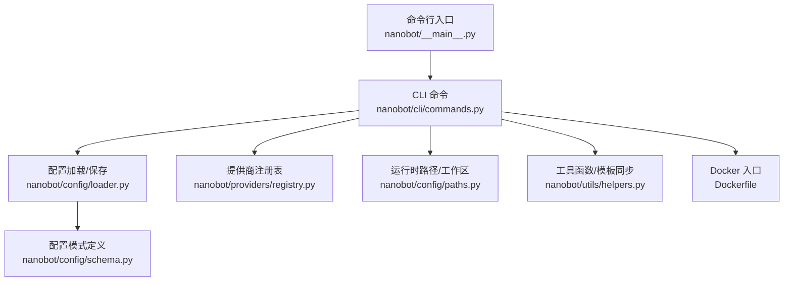
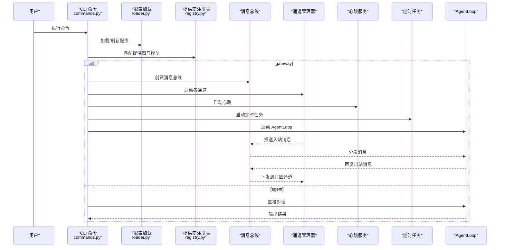
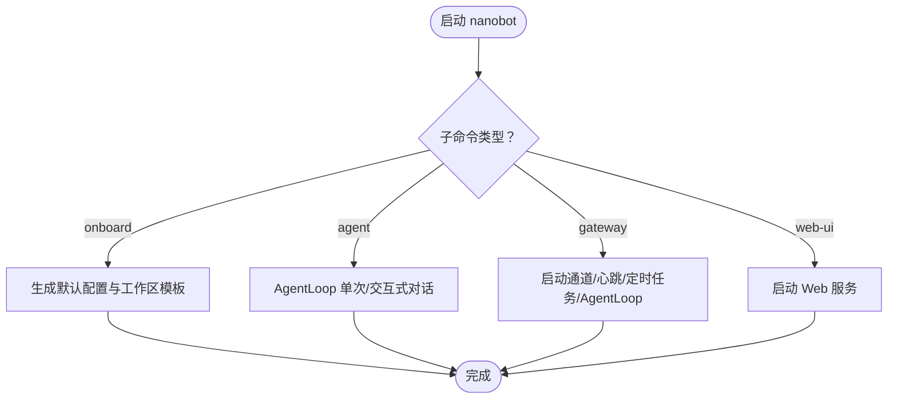
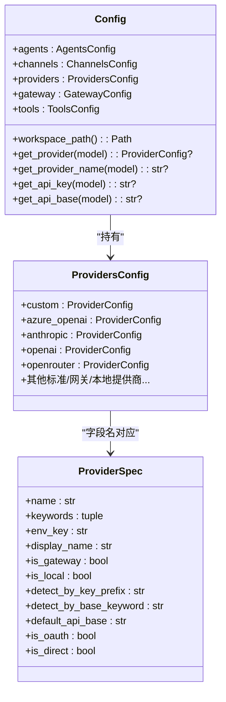
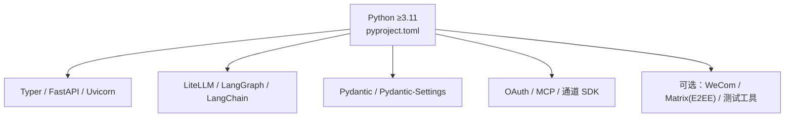

# 快速开始

<cite>
**本文引用的文件**
- [README.md](file://README.md)
- [pyproject.toml](file://pyproject.toml)
- [Dockerfile](file://Dockerfile)
- [nanobot/__main__.py](file://nanobot/__main__.py)
- [nanobot/cli/commands.py](file://nanobot/cli/commands.py)
- [nanobot/config/schema.py](file://nanobot/config/schema.py)
- [nanobot/config/loader.py](file://nanobot/config/loader.py)
- [nanobot/config/paths.py](file://nanobot/config/paths.py)
- [nanobot/providers/registry.py](file://nanobot/providers/registry.py)
- [nanobot/utils/helpers.py](file://nanobot/utils/helpers.py)
</cite>

## 目录
1. [简介](#简介)
2. [项目结构](#项目结构)
3. [核心组件](#核心组件)
4. [架构总览](#架构总览)
5. [详细组件分析](#详细组件分析)
6. [依赖关系分析](#依赖关系分析)
7. [性能与资源建议](#性能与资源建议)
8. [安装与环境准备](#安装与环境准备)
9. [初始化与配置](#初始化与配置)
10. [常见配置示例](#常见配置示例)
11. [启动服务与聊天](#启动服务与聊天)
12. [故障排除指南](#故障排除指南)
13. [结论](#结论)

## 简介
Nanobot 是一个轻量级个人 AI 助手框架，支持多渠道接入（Telegram、Discord、WhatsApp、飞书、QQ、Slack、Email、企业微信等），内置多提供商 LLM 支持（OpenRouter、Anthropic、OpenAI、Azure OpenAI、Gemini、DeepSeek、Groq、Moonshot、MiniMax、DashScope、VolcEngine、SiliconFlow、Ollama、vLLM 等），并提供 Web UI、定时任务、MCP、代理与搜索等能力。本文档面向初学者，提供从零到一的快速上手流程，涵盖安装、环境要求、初始化、配置、启动与常见问题排查。

## 项目结构
- 命令行入口通过脚本注册为 nanobot，核心逻辑集中在 CLI 子命令中。
- 配置采用 JSON 文件（默认位于用户主目录下的 .nanobot/config.json），使用 Pydantic 模型进行校验与迁移。
- 提供商注册表集中管理所有支持的 LLM 提供商，决定模型名匹配、前缀路由、默认网关地址与检测规则。
- Dockerfile 提供基于 uv 的最小化镜像，预装 Node.js 用于 WhatsApp 桥接。

图表来源
- [nanobot/__main__.py:1-9](file://nanobot/__main__.py#L1-L9)
- [nanobot/cli/commands.py:1-120](file://nanobot/cli/commands.py#L1-L120)
- [nanobot/config/loader.py:1-82](file://nanobot/config/loader.py#L1-L82)
- [nanobot/config/schema.py:1-120](file://nanobot/config/schema.py#L1-L120)
- [nanobot/providers/registry.py:1-120](file://nanobot/providers/registry.py#L1-L120)
- [nanobot/config/paths.py:1-56](file://nanobot/config/paths.py#L1-L56)
- [nanobot/utils/helpers.py:173-204](file://nanobot/utils/helpers.py#L173-L204)
- [Dockerfile:1-41](file://Dockerfile#L1-L41)

章节来源
- [nanobot/__main__.py:1-9](file://nanobot/__main__.py#L1-L9)
- [nanobot/cli/commands.py:1-120](file://nanobot/cli/commands.py#L1-L120)
- [nanobot/config/loader.py:1-82](file://nanobot/config/loader.py#L1-L82)
- [nanobot/config/schema.py:1-120](file://nanobot/config/schema.py#L1-L120)
- [nanobot/providers/registry.py:1-120](file://nanobot/providers/registry.py#L1-L120)
- [nanobot/config/paths.py:1-56](file://nanobot/config/paths.py#L1-L56)
- [nanobot/utils/helpers.py:173-204](file://nanobot/utils/helpers.py#L173-L204)
- [Dockerfile:1-41](file://Dockerfile#L1-L41)

## 核心组件
- CLI 命令集：onboard 初始化、agent 单次/交互式对话、gateway 启动网关、web-ui 启动 Web UI。
- 配置系统：默认配置路径、加载/保存、迁移、模板同步；支持代理、Web 搜索、MCP、执行工具等。
- 提供商适配：统一注册表，按模型名关键字、前缀、网关特征自动匹配，支持直连与 LiteLLM 路由。
- 运行时路径：工作区、媒体、日志、桥接目录等统一管理。
- 工具与辅助：模板同步、消息分片、令牌估算、安全文件名处理等。

章节来源
- [nanobot/cli/commands.py:170-211](file://nanobot/cli/commands.py#L170-L211)
- [nanobot/config/schema.py:351-450](file://nanobot/config/schema.py#L351-L450)
- [nanobot/providers/registry.py:68-120](file://nanobot/providers/registry.py#L68-L120)
- [nanobot/config/paths.py:37-56](file://nanobot/config/paths.py#L37-L56)
- [nanobot/utils/helpers.py:173-204](file://nanobot/utils/helpers.py#L173-L204)

## 架构总览
Nanobot 的运行时由“命令行入口”驱动，根据子命令选择不同运行路径：
- onboard：生成默认配置与工作区模板。
- agent：单次或交互式对话，直接调用 AgentLoop。
- gateway：启动消息总线、通道管理器、心跳、定时任务，并在多通道间路由消息。
- web-ui：启动 Web API 并提供前端页面。

图表来源
- [nanobot/cli/commands.py:308-678](file://nanobot/cli/commands.py#L308-L678)
- [nanobot/config/loader.py:26-49](file://nanobot/config/loader.py#L26-L49)
- [nanobot/providers/registry.py:429-458](file://nanobot/providers/registry.py#L429-L458)

章节来源
- [nanobot/cli/commands.py:308-678](file://nanobot/cli/commands.py#L308-L678)

## 详细组件分析

### CLI 命令与入口
- 命令入口：模块入口直接调用 CLI 应用。
- onboard：生成默认配置与工作区模板，提示下一步操作。
- agent：单次消息或交互式会话，支持 Markdown 渲染与日志开关。
- gateway：启动多通道、心跳、定时任务与 AgentLoop，支持通道路由与团队协作。
- web-ui：启动 Web 服务，支持静态/开发/自动模式。

图表来源
- [nanobot/__main__.py:1-9](file://nanobot/__main__.py#L1-L9)
- [nanobot/cli/commands.py:170-211](file://nanobot/cli/commands.py#L170-L211)
- [nanobot/cli/commands.py:717-800](file://nanobot/cli/commands.py#L717-L800)
- [nanobot/cli/commands.py:308-678](file://nanobot/cli/commands.py#L308-L678)
- [nanobot/cli/commands.py:681-710](file://nanobot/cli/commands.py#L681-L710)

章节来源
- [nanobot/__main__.py:1-9](file://nanobot/__main__.py#L1-L9)
- [nanobot/cli/commands.py:170-211](file://nanobot/cli/commands.py#L170-L211)
- [nanobot/cli/commands.py:717-800](file://nanobot/cli/commands.py#L717-L800)
- [nanobot/cli/commands.py:308-678](file://nanobot/cli/commands.py#L308-L678)
- [nanobot/cli/commands.py:681-710](file://nanobot/cli/commands.py#L681-L710)

### 配置系统与提供商匹配
- 配置文件：默认位于 ~/.nanobot/config.json，支持迁移与增量字段保留。
- 模式定义：Channels、Agents、Providers、Gateway、Tools 等配置项均以 Pydantic 模型定义。
- 提供商匹配：按显式前缀、关键字、网关特征、本地部署等顺序匹配，支持默认网关地址与额外头部。

图表来源
- [nanobot/config/schema.py:351-450](file://nanobot/config/schema.py#L351-L450)
- [nanobot/providers/registry.py:19-66](file://nanobot/providers/registry.py#L19-L66)

章节来源
- [nanobot/config/schema.py:351-450](file://nanobot/config/schema.py#L351-L450)
- [nanobot/providers/registry.py:68-120](file://nanobot/providers/registry.py#L68-L120)

### 运行时路径与工作区
- 默认工作区：~/.nanobot/workspace，首次使用时同步模板。
- 运行时目录：媒体、日志、定时任务存储等统一在数据目录下按子目录组织。
- 桥接目录：WhatsApp 桥接安装目录位于 ~/.nanobot/bridge。

章节来源
- [nanobot/config/paths.py:37-56](file://nanobot/config/paths.py#L37-L56)
- [nanobot/utils/helpers.py:173-204](file://nanobot/utils/helpers.py#L173-L204)

## 依赖关系分析
- Python 版本：要求 Python ≥3.11。
- 关键依赖：Typer、FastAPI、Uvicorn、LiteLLM、LangGraph、LangChain、Pydantic/Settings、OAuth 工具、MCP、矩阵/WebRTC/Slack/QQ 等通道 SDK。
- 可选依赖：WeCom、Matrix（含 E2EE）、测试工具链等。

图表来源
- [pyproject.toml:1-122](file://pyproject.toml#L1-L122)

章节来源
- [pyproject.toml:1-122](file://pyproject.toml#L1-L122)

## 性能与资源建议
- 轻量化设计：核心代理代码量小，启动快、资源占用低。
- 令牌估算：内置 tiktoken 估算与提供商计数器回退，便于控制上下文窗口。
- 多通道并发：通道管理器异步启动，消息经总线分发，适合多平台并发接入。
- 本地推理：支持 Ollama、vLLM 等本地部署，降低网络延迟与隐私风险。

[本节为通用建议，不直接分析具体文件]

## 安装与环境准备

### 环境要求
- Python 版本：≥3.11（推荐 3.12）
- 可选：Node.js ≥18（用于 WhatsApp 桥接）

章节来源
- [pyproject.toml:5-17](file://pyproject.toml#L5-L17)
- [Dockerfile:3-13](file://Dockerfile#L3-L13)

### 从源码安装（开发首选）
- 克隆仓库并使用可编辑安装，便于调试与贡献。
- 适用于希望体验最新功能或参与开发的用户。

章节来源
- [README.md:126-132](file://README.md#L126-L132)

### 使用 uv 工具安装（稳定、快速）
- 通过 uv 的工具链安装 nanobot-ai，适合追求安装速度与一致性的用户。

章节来源
- [README.md:134-138](file://README.md#L134-L138)

### 从 PyPI 安装（稳定）
- 使用 pip 安装 nanobot-ai，适合常规使用场景。

章节来源
- [README.md:140-144](file://README.md#L140-L144)

### 更新到最新版本
- pip 或 uv 工具链均可升级至最新版本，并可通过命令查看版本。

章节来源
- [README.md:146-161](file://README.md#L146-L161)

### Docker 部署（可选）
- 基于 uv 的最小镜像，预装 Node.js，构建并编译桥接，暴露默认网关端口。

章节来源
- [Dockerfile:1-41](file://Dockerfile#L1-L41)

## 初始化与配置

### 初始化配置
- 使用 onboard 命令生成默认配置与工作区模板，首次运行会提示下一步操作。
- 若已有配置，可选择覆盖或刷新保留现有值。

章节来源
- [nanobot/cli/commands.py:170-211](file://nanobot/cli/commands.py#L170-L211)

### 配置文件位置与加载
- 默认配置文件：~/.nanobot/config.json
- 加载/保存/迁移：自动处理旧格式迁移，支持自定义配置路径。

章节来源
- [nanobot/config/loader.py:19-49](file://nanobot/config/loader.py#L19-L49)
- [nanobot/config/paths.py:19-24](file://nanobot/config/paths.py#L19-L24)

### 工作区与模板
- 首次运行会同步模板到工作区，仅创建缺失文件。
- 工作区用于存放技能、记忆与持久化数据。

章节来源
- [nanobot/utils/helpers.py:173-204](file://nanobot/utils/helpers.py#L173-L204)

## 常见配置示例

### 设置 API 密钥与模型
- 在配置文件中添加 providers 节点，填入提供商 API 密钥。
- 在 agents.defaults 中指定默认模型与提供商（可选）。

章节来源
- [README.md:185-206](file://README.md#L185-L206)
- [nanobot/config/schema.py:259-289](file://nanobot/config/schema.py#L259-L289)
- [nanobot/config/schema.py:231-246](file://nanobot/config/schema.py#L231-L246)

### 代理与 Web 搜索
- tools.web.proxy：HTTP/SOCKS5 代理地址。
- tools.web.search.api_key：Brave Search API 密钥（可选）。

章节来源
- [nanobot/config/schema.py:306-320](file://nanobot/config/schema.py#L306-L320)

### 通道配置示例（部分）
- Telegram：启用、令牌、允许用户列表、代理、回复策略等。
- Discord：启用、令牌、意图、群组策略等。
- WhatsApp：启用、允许用户列表（需先登录桥接）。
- 飞书：启用、应用 ID/Secret、事件订阅参数等。
- Slack：启用、Socket Mode、App/Bot 令牌、群组策略等。
- Email：启用、IMAP/SMTP 凭据、自动回复策略等。
- 企业微信：启用、机器人 ID/Secret、欢迎语等。

章节来源
- [README.md:246-751](file://README.md#L246-L751)
- [nanobot/config/schema.py:26-229](file://nanobot/config/schema.py#L26-L229)

### 常见提供商配置要点
- OpenRouter：推荐全球可用，支持多种模型。
- Anthropic：Claude 直连，支持提示缓存。
- Azure OpenAI：需提供 api_key 与 api_base，并在模型字段指定部署名称。
- Gemini/OpenAI：无需额外网关，按模型关键字匹配。
- Ollama/vLLM：本地部署，需在配置中提供 api_base。
- Groq：可作为语音转写（Whisper）与 LLM 使用。

章节来源
- [nanobot/providers/registry.py:92-164](file://nanobot/providers/registry.py#L92-L164)
- [nanobot/providers/registry.py:165-236](file://nanobot/providers/registry.py#L165-L236)
- [nanobot/providers/registry.py:344-379](file://nanobot/providers/registry.py#L344-L379)
- [nanobot/providers/registry.py:380-399](file://nanobot/providers/registry.py#L380-L399)

## 启动服务与聊天

### 启动网关（多通道接入）
- 使用 gateway 命令启动，自动加载配置、通道、心跳与定时任务。
- 支持指定端口、工作区、详细日志与自定义配置路径。

章节来源
- [nanobot/cli/commands.py:308-678](file://nanobot/cli/commands.py#L308-L678)

### 交互式聊天
- 使用 agent 命令进入交互式模式，支持会话 ID、Markdown 渲染与日志开关。
- 支持单次消息模式，便于快速验证。

章节来源
- [nanobot/cli/commands.py:717-800](file://nanobot/cli/commands.py#L717-L800)

### Web UI
- 使用 web-ui 命令启动 Web 服务，默认主机与端口可配置，支持静态/开发/自动模式。

章节来源
- [nanobot/cli/commands.py:681-710](file://nanobot/cli/commands.py#L681-L710)

## 故障排除指南

### 常见问题与解决思路
- 无 API 密钥：当未配置提供商密钥时，命令会提示设置。请在配置文件中添加对应提供商的 apiKey。
- 模型匹配失败：若模型名未命中任何提供商，可显式指定 provider 字段或使用支持该模型的网关/本地部署。
- 代理/网络问题：检查 tools.web.proxy 与通道代理设置；确认网络可达性与超时配置。
- 通道登录/桥接：如使用 WhatsApp，升级后需重建桥接目录并重新登录。
- 心跳/定时任务：确认心跳间隔与定时任务配置，必要时调整或禁用。

章节来源
- [nanobot/cli/commands.py:216-272](file://nanobot/cli/commands.py#L216-L272)
- [nanobot/providers/registry.py:429-458](file://nanobot/providers/registry.py#L429-L458)
- [README.md:162-167](file://README.md#L162-L167)

### MCP 服务器诊断与修复
- 当 MCP 服务器探测失败时，系统会根据错误信息给出诊断码与修复步骤，如检查命令/脚本路径、确认远端服务监听、核对鉴权凭据、调整超时等。
- 可在 Web UI 中查看诊断详情并执行受限修复流程。

章节来源
- [nanobot/web/mcp_servers.py:444-689](file://nanobot/web/mcp_servers.py#L444-L689)

### 日志与调试
- agent 命令支持 --logs 开关，便于观察运行时日志。
- gateway 命令支持 --verbose 开启详细日志输出。

章节来源
- [nanobot/cli/commands.py:745-749](file://nanobot/cli/commands.py#L745-L749)
- [nanobot/cli/commands.py:332-335](file://nanobot/cli/commands.py#L332-L335)

## 结论
通过本文档的步骤，您可以从零开始完成 Nanobot 的安装、初始化、配置与启动，并在多平台上快速接入聊天通道。建议优先使用 OpenRouter 或本地部署方案进行初次体验，随后根据实际需求逐步完善代理、搜索、MCP 与通道配置。遇到问题时，可参考故障排除章节中的诊断思路与 Web UI 的修复流程，定位并解决问题。