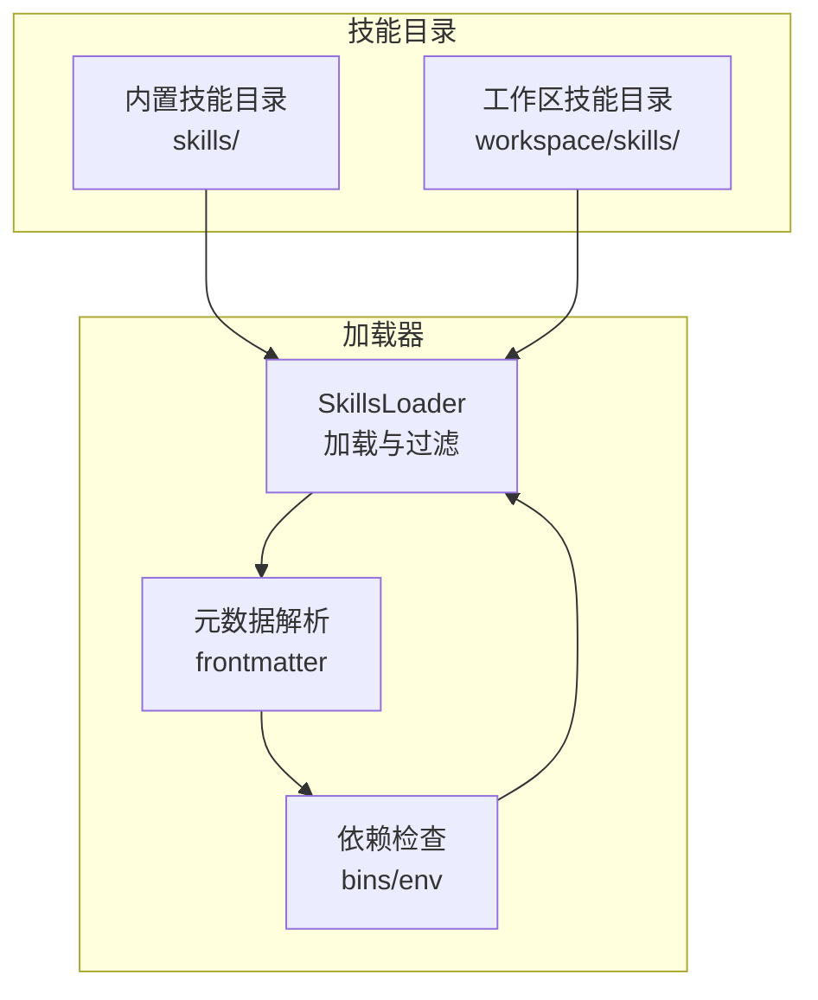
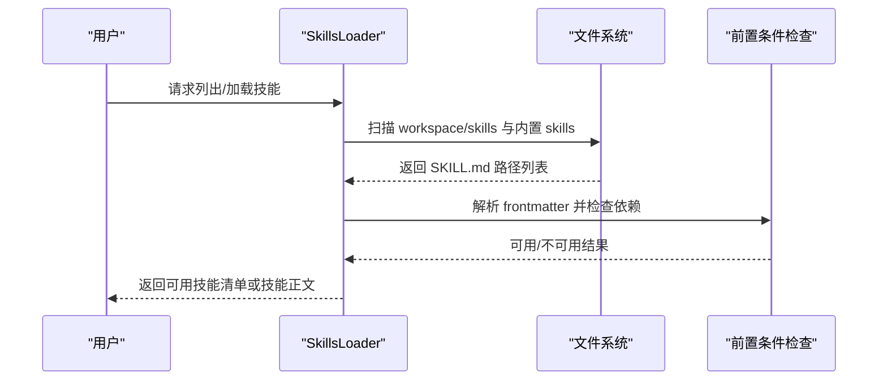
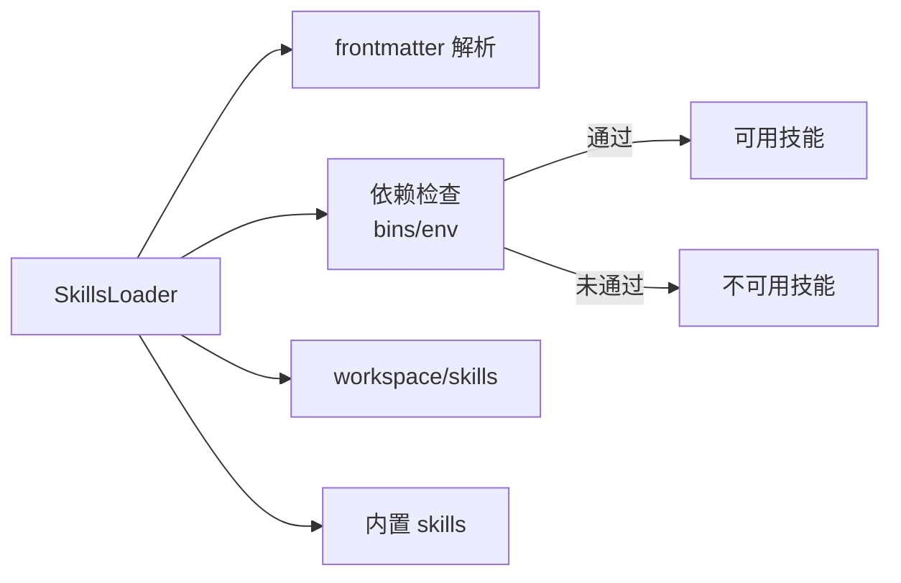

# 内置技能

<cite>
**本文引用的文件**
- [nanobot/skills/README.md](file://nanobot/skills/README.md)
- [nanobot/skills/github/SKILL.md](file://nanobot/skills/github/SKILL.md)
- [nanobot/skills/weather/SKILL.md](file://nanobot/skills/weather/SKILL.md)
- [nanobot/skills/summarize/SKILL.md](file://nanobot/skills/summarize/SKILL.md)
- [nanobot/skills/tmux/SKILL.md](file://nanobot/skills/tmux/SKILL.md)
- [nanobot/skills/tmux/scripts/find-sessions.sh](file://nanobot/skills/tmux/scripts/find-sessions.sh)
- [nanobot/skills/tmux/scripts/wait-for-text.sh](file://nanobot/skills/tmux/scripts/wait-for-text.sh)
- [nanobot/skills/cron/SKILL.md](file://nanobot/skills/cron/SKILL.md)
- [nanobot/skills/memory/SKILL.md](file://nanobot/skills/memory/SKILL.md)
- [nanobot/skills/clawhub/SKILL.md](file://nanobot/skills/clawhub/SKILL.md)
- [nanobot/skills/skill-creator/SKILL.md](file://nanobot/skills/skill-creator/SKILL.md)
- [nanobot/skills/skill-creator/scripts/init_skill.py](file://nanobot/skills/skill-creator/scripts/init_skill.py)
- [nanobot/skills/skill-creator/scripts/package_skill.py](file://nanobot/skills/skill-creator/scripts/package_skill.py)
- [nanobot/skills/skill-creator/scripts/quick_validate.py](file://nanobot/skills/skill-creator/scripts/quick_validate.py)
- [nanobot/agent/skills.py](file://nanobot/agent/skills.py)
- [nanobot/agent/tools/registry.py](file://nanobot/agent/tools/registry.py)
</cite>

## 目录
1. [简介](#简介)
2. [项目结构](#项目结构)
3. [核心组件](#核心组件)
4. [架构总览](#架构总览)
5. [详细组件分析](#详细组件分析)
6. [依赖关系分析](#依赖关系分析)
7. [性能考量](#性能考量)
8. [故障排除指南](#故障排除指南)
9. [结论](#结论)
10. [附录](#附录)

## 简介
本文件为 Nanobot 内置技能的权威参考，覆盖以下技能：GitHub、天气、摘要、tmux、Cron、Memory、ClawHub、Skill Creator。内容包括功能特性、使用方法、配置选项、依赖与权限、安全注意事项、限制与错误处理、性能特点、组合使用最佳实践与故障排除。

## 项目结构
内置技能以“技能目录/SKILL.md”的形式组织，支持可选资源目录（scripts、references、assets）。技能加载器负责扫描工作区与内置技能目录，解析 frontmatter 元数据，按需过滤不可用技能，并在上下文中按需加载技能正文。

图示来源
- [nanobot/skills/README.md:28-38](file://nanobot/skills/README.md#L28-L38)
- [nanobot/agent/skills.py:21-57](file://nanobot/agent/skills.py#L21-L57)

章节来源
- [nanobot/skills/README.md:1-38](file://nanobot/skills/README.md#L1-L38)
- [nanobot/agent/skills.py:13-229](file://nanobot/agent/skills.py#L13-L229)

## 核心组件
- 技能加载器：负责枚举、解析、过滤与按需加载技能；支持“总是可用”技能标记与依赖检查。
- 工具注册表：统一管理工具定义与执行，参数校验与错误提示。
- tmux 辅助脚本：提供会话发现与文本等待能力，支撑 tmux 技能的交互式任务编排。

章节来源
- [nanobot/agent/skills.py:13-229](file://nanobot/agent/skills.py#L13-L229)
- [nanobot/agent/tools/registry.py:8-71](file://nanobot/agent/tools/registry.py#L8-L71)

## 架构总览
下图展示技能系统如何从磁盘加载 SKILL.md，解析元数据，进行依赖检查，并在需要时将技能正文注入到代理上下文。

图示来源
- [nanobot/agent/skills.py:26-100](file://nanobot/agent/skills.py#L26-L100)
- [nanobot/agent/skills.py:177-186](file://nanobot/agent/skills.py#L177-L186)

## 详细组件分析

### GitHub 技能
- 功能概述
  - 通过 gh CLI 与 GitHub 交互，支持 PR 检查状态、CI 运行列表/查看、失败步骤日志、通用 API 查询与结构化输出。
- 使用要点
  - 在非 Git 目录中使用时，必须显式指定仓库参数或直接使用 URL。
  - 大多数命令支持结构化 JSON 输出与 jq 过滤。
- 常见场景
  - 快速检查 PR CI 状态、定位失败步骤、批量列出最近运行、按字段筛选 Issue/PR 列表。
- 依赖与权限
  - 依赖 gh CLI（安装方式见技能文档）。
  - 需要有效认证（gh 自动管理凭据）。
- 安全与限制
  - 仅调用 gh CLI，避免在代理上下文中暴露令牌；注意在受限环境中的二进制可用性。
- 错误处理与性能
  - 网络/认证失败会返回错误；建议分页与精准查询以降低输出体积。
- 示例路径
  - PR CI 检查：[示例路径:13-16](file://nanobot/skills/github/SKILL.md#L13-L16)
  - 最近运行列表：[示例路径:18-21](file://nanobot/skills/github/SKILL.md#L18-L21)
  - 查看运行与失败日志：[示例路径:23-31](file://nanobot/skills/github/SKILL.md#L23-L31)
  - API 字段查询：[示例路径:37-40](file://nanobot/skills/github/SKILL.md#L37-L40)
  - 结构化输出与过滤：[示例路径:42-48](file://nanobot/skills/github/SKILL.md#L42-L48)

章节来源
- [nanobot/skills/github/SKILL.md:1-49](file://nanobot/skills/github/SKILL.md#L1-L49)

### 天气技能
- 功能概述
  - 提供 wttr.in 与 Open-Meteo 两种免费服务，无需 API Key；支持多种格式与单位切换。
- 使用要点
  - wttr.in 支持紧凑格式、完整预报、PNG 输出等；支持 URL 编码与机场代码。
  - Open-Meteo 适合程序化使用，返回 JSON。
- 常见场景
  - 快速获取本地天气、生成简洁报告、按需选择单位与时间粒度。
- 依赖与权限
  - 依赖 curl（安装方式见技能文档）。
- 安全与限制
  - 无密钥要求，但受第三方服务可用性影响；注意网络连通性。
- 错误处理与性能
  - 服务不可达或参数错误会返回错误；建议缓存常用查询结果。
- 示例路径
  - 一键格式：[示例路径:14-18](file://nanobot/skills/weather/SKILL.md#L14-L18)
  - 紧凑格式：[示例路径:20-24](file://nanobot/skills/weather/SKILL.md#L20-L24)
  - 完整预报：[示例路径:26-29](file://nanobot/skills/weather/SKILL.md#L26-L29)
  - 单位与参数说明：[示例路径:33-38](file://nanobot/skills/weather/SKILL.md#L33-L38)
  - Open-Meteo 查询：[示例路径:42-45](file://nanobot/skills/weather/SKILL.md#L42-L45)

章节来源
- [nanobot/skills/weather/SKILL.md:1-50](file://nanobot/skills/weather/SKILL.md#L1-L50)

### 摘要技能
- 功能概述
  - 快速总结 URL、本地文件与 YouTube 视频；支持模型选择与多种标志位；可提取转录或生成摘要。
- 使用要点
  - 触发短语明确；默认模型可配置；支持 API Key 环境变量。
- 常见场景
  - 快速理解链接内容、提取视频转录、生成多长度摘要。
- 依赖与权限
  - 依赖 summarize CLI（安装方式见技能文档）。
  - 可选服务：FireCrawl、Apify（分别对应 API Key）。
- 安全与限制
  - 仅调用外部 CLI；注意输入来源与隐私；避免敏感信息泄露。
- 错误处理与性能
  - 大型转录建议先给摘要再展开特定片段；合理设置长度与 token 上限。
- 示例路径
  - 快速开始（URL/文件/YouTube）：[示例路径:20-26](file://nanobot/skills/summarize/SKILL.md#L20-L26)
  - 提取转录（URL）：[示例路径:30-34](file://nanobot/skills/summarize/SKILL.md#L30-L34)
  - 模型与密钥配置：[示例路径:38-46](file://nanobot/skills/summarize/SKILL.md#L38-L46)
  - 常用标志位：[示例路径:48-56](file://nanobot/skills/summarize/SKILL.md#L48-L56)
  - 配置文件与可选服务：[示例路径:57-68](file://nanobot/skills/summarize/SKILL.md#L57-L68)

章节来源
- [nanobot/skills/summarize/SKILL.md:1-68](file://nanobot/skills/summarize/SKILL.md#L1-L68)

### tmux 技能
- 功能概述
  - 通过 tmux 套接字远程控制会话，发送按键、捕获面板输出；适用于需要交互 TTY 的任务。
- 使用要点
  - 推荐使用隔离套接字与专用会话；命名窗口/面板；使用辅助脚本查找会话与等待文本。
- 常见场景
  - 并行运行多个编码代理、监控命令提示符、捕获历史输出、清理会话。
- 依赖与权限
  - 依赖 tmux；macOS/Linux；WSL 下需在 Linux 子系统安装 tmux。
  - 通过环境变量控制套接字位置。
- 安全与限制
  - 仅操作私有套接字；避免在共享环境中暴露敏感命令；注意进程生命周期。
- 错误处理与性能
  - 建议超时与轮询间隔合理设置；大历史缓冲区使用负索引截断。
- 示例路径
  - 快速开始（隔离套接字与执行工具）：[示例路径:11-22](file://nanobot/skills/tmux/SKILL.md#L11-L22)
  - 套接字约定与目标定位：[示例路径:32-42](file://nanobot/skills/tmux/SKILL.md#L32-L42)
  - 会话发现与扫描：[示例路径:43-47](file://nanobot/skills/tmux/SKILL.md#L43-L47)
  - 发送输入与监控输出：[示例路径:48-58](file://nanobot/skills/tmux/SKILL.md#L48-L58)
  - 并行编码代理编排：[示例路径:68-95](file://nanobot/skills/tmux/SKILL.md#L68-L95)
  - 清理命令：[示例路径:103-108](file://nanobot/skills/tmux/SKILL.md#L103-L108)
  - 等待文本脚本参数：[示例路径:109-122](file://nanobot/skills/tmux/SKILL.md#L109-L122)

tmux 辅助脚本
- find-sessions.sh
  - 支持按套接字名称/路径或扫描全部套接字；可按会话名过滤；检测 tmux 可用性。
  - 参数与行为：[脚本源:1-113](file://nanobot/skills/tmux/scripts/find-sessions.sh#L1-L113)
- wait-for-text.sh
  - 在面板历史中轮询匹配正则或固定字符串；支持超时、轮询间隔与历史行数；检测 tmux 可用性。
  - 参数与行为：[脚本源:1-84](file://nanobot/skills/tmux/scripts/wait-for-text.sh#L1-L84)

章节来源
- [nanobot/skills/tmux/SKILL.md:1-122](file://nanobot/skills/tmux/SKILL.md#L1-L122)
- [nanobot/skills/tmux/scripts/find-sessions.sh:1-113](file://nanobot/skills/tmux/scripts/find-sessions.sh#L1-L113)
- [nanobot/skills/tmux/scripts/wait-for-text.sh:1-84](file://nanobot/skills/tmux/scripts/wait-for-text.sh#L1-L84)

### Cron 技能
- 功能概述
  - 调度提醒、重复任务与一次性任务；支持固定周期、Cron 表达式与时区。
- 使用要点
  - 三种模式：提醒（直接发送消息）、任务（由代理执行并回传结果）、一次性（到达时间后自动删除）。
- 常见场景
  - 定时提醒、周期性任务（如拉取 Star 数）、特定时间一次性提醒。
- 依赖与权限
  - 依赖 cron 工具；服务器时区或显式 IANA 时区。
- 安全与限制
  - 仅在当前实例内调度；避免与系统级计划任务冲突。
- 错误处理与性能
  - 时间表达式解析与时区转换；建议使用固定表达式与明确时区。
- 示例路径
  - 固定提醒：[示例路径:18-21](file://nanobot/skills/cron/SKILL.md#L18-L21)
  - 动态任务：[示例路径:23-26](file://nanobot/skills/cron/SKILL.md#L23-L26)
  - 一次性任务：[示例路径:28-31](file://nanobot/skills/cron/SKILL.md#L28-L31)
  - 时区感知 Cron：[示例路径:33-36](file://nanobot/skills/cron/SKILL.md#L33-L36)
  - 列表与移除：[示例路径:38-42](file://nanobot/skills/cron/SKILL.md#L38-L42)
  - 时间表达式对照：[示例路径:44-54](file://nanobot/skills/cron/SKILL.md#L44-L54)
  - 时区说明：[示例路径:55-58](file://nanobot/skills/cron/SKILL.md#L55-L58)

章节来源
- [nanobot/skills/cron/SKILL.md:1-58](file://nanobot/skills/cron/SKILL.md#L1-L58)

### Memory 技能
- 功能概述
  - 两层记忆系统：长期事实（MEMORY.md）与事件日志（HISTORY.md）；支持 grep 式检索与自动归档。
- 使用要点
  - 小文件：读入内存搜索；大文件：使用 exec 工具进行定向搜索。
  - 重要事实即时写入 MEMORY.md；旧对话自动摘要并归档。
- 常见场景
  - 用户偏好、项目上下文、关系信息的长期存储；历史事件检索。
- 依赖与权限
  - 依赖文件系统访问；无额外二进制依赖。
- 安全与限制
  - 注意敏感信息写入；归档过程自动进行，无需人工干预。
- 错误处理与性能
  - 大文件建议使用命令行工具；小文件可直接内存匹配。
- 示例路径
  - 结构说明：[示例路径:9-13](file://nanobot/skills/memory/SKILL.md#L9-L13)
  - 搜索方法与示例：[示例路径:14-26](file://nanobot/skills/memory/SKILL.md#L14-L26)
  - 更新 MEMORY.md 的时机：[示例路径:28-34](file://nanobot/skills/memory/SKILL.md#L28-L34)
  - 自动归档：[示例路径:35-38](file://nanobot/skills/memory/SKILL.md#L35-L38)

章节来源
- [nanobot/skills/memory/SKILL.md:1-38](file://nanobot/skills/memory/SKILL.md#L1-L38)

### ClawHub 技能
- 功能概述
  - 从公共技能注册表搜索与安装技能；支持搜索、安装、更新与列出已安装技能。
- 使用要点
  - 需要 Node.js（npx）；安装时必须指定工作区目录。
- 常见场景
  - 寻找新技能、安装公开技能、更新现有技能。
- 依赖与权限
  - 依赖 npx（随 Node.js）；无需 API Key。
- 安全与限制
  - 仅在指定工作区安装；建议在新会话中加载以生效。
- 错误处理与性能
  - 网络请求与包管理；建议离线缓存常用技能。
- 示例路径
  - 搜索：[示例路径:21-25](file://nanobot/skills/clawhub/SKILL.md#L21-L25)
  - 安装：[示例路径:27-31](file://nanobot/skills/clawhub/SKILL.md#L27-L31)
  - 更新：[示例路径:35-40](file://nanobot/skills/clawhub/SKILL.md#L35-L40)
  - 列出：[示例路径:41-45](file://nanobot/skills/clawhub/SKILL.md#L41-L45)
  - 注意事项：[示例路径:47-54](file://nanobot/skills/clawhub/SKILL.md#L47-L54)

章节来源
- [nanobot/skills/clawhub/SKILL.md:1-54](file://nanobot/skills/clawhub/SKILL.md#L1-L54)

### Skill Creator 技能
- 功能概述
  - 创建或更新 AgentSkills；提供模板初始化、打包与验证流程；强调渐进披露设计原则。
- 使用要点
  - 三类资源：scripts（可执行代码）、references（参考文档）、assets（输出资源）。
  - 包含初始化脚本、打包脚本与快速验证脚本。
- 常见场景
  - 设计新技能、结构化知识、打包分发技能。
- 依赖与权限
  - Python 环境；打包时禁止符号链接。
- 安全与限制
  - 打包严格校验，拒绝符号链接；验证失败不生成 .skill 文件。
- 错误处理与性能
  - 验证失败给出具体错误；建议先本地验证再打包。
- 示例路径
  - 初始化技能：[示例路径:320-379](file://nanobot/skills/skill-creator/scripts/init_skill.py#L320-L379)
  - 打包技能：[示例路径:129-155](file://nanobot/skills/skill-creator/scripts/package_skill.py#L129-L155)
  - 快速验证：[示例路径:132-204](file://nanobot/skills/skill-creator/scripts/quick_validate.py#L132-L204)

章节来源
- [nanobot/skills/skill-creator/SKILL.md:1-375](file://nanobot/skills/skill-creator/SKILL.md#L1-L375)
- [nanobot/skills/skill-creator/scripts/init_skill.py:1-379](file://nanobot/skills/skill-creator/scripts/init_skill.py#L1-L379)
- [nanobot/skills/skill-creator/scripts/package_skill.py:1-155](file://nanobot/skills/skill-creator/scripts/package_skill.py#L1-L155)
- [nanobot/skills/skill-creator/scripts/quick_validate.py:1-214](file://nanobot/skills/skill-creator/scripts/quick_validate.py#L1-L214)

## 依赖关系分析
技能系统依赖于文件系统与外部 CLI 工具，加载器负责解析 frontmatter 并检查 bins/env 依赖，再决定是否可用。

图示来源
- [nanobot/agent/skills.py:177-186](file://nanobot/agent/skills.py#L177-L186)
- [nanobot/agent/skills.py:188-192](file://nanobot/agent/skills.py#L188-L192)

章节来源
- [nanobot/agent/skills.py:13-229](file://nanobot/agent/skills.py#L13-L229)

## 性能考量
- GitHub：优先使用结构化输出与过滤，减少网络往返与输出体积。
- 天气：缓存常用查询，合理选择格式与单位。
- 摘要：对大型转录先摘要再展开；控制输出长度与 token 上限。
- tmux：合理设置轮询间隔与超时；使用负索引截断历史缓冲。
- Cron：使用精确 Cron 表达式与时区，避免频繁轮询。
- Memory：大文件使用命令行工具定向搜索，小文件可内存匹配。
- Skill Creator：先本地验证再打包，避免重复构建。

## 故障排除指南
- 技能不可用
  - 检查依赖二进制或环境变量是否满足；查看加载器输出的缺失项。
  - 参考路径：[依赖检查逻辑:177-186](file://nanobot/agent/skills.py#L177-L186)
- GitHub
  - 确认 gh 已安装且认证有效；在非 Git 目录中显式指定仓库参数。
  - 参考路径：[使用说明:9-10](file://nanobot/skills/github/SKILL.md#L9-L10)
- 天气
  - 确认网络可达；wttr.in/开放服务端点可用；必要时改用 Open-Meteo。
  - 参考路径：[服务说明:10-11](file://nanobot/skills/weather/SKILL.md#L10-L11)
- 摘要
  - 设置正确的 API Key 环境变量；必要时启用可选服务。
  - 参考路径：[模型与密钥:38-46](file://nanobot/skills/summarize/SKILL.md#L38-L46)
- tmux
  - 确认 tmux 可用；使用辅助脚本进行会话发现与等待；检查套接字目录权限。
  - 参考路径：[套接字约定:32-36](file://nanobot/skills/tmux/SKILL.md#L32-L36)，[会话发现:43-47](file://nanobot/skills/tmux/SKILL.md#L43-L47)，[等待文本:109-122](file://nanobot/skills/tmux/SKILL.md#L109-L122)
- Skill Creator
  - 遵循验证规则；禁止符号链接；修复验证错误后再打包。
  - 参考路径：[验证规则:132-204](file://nanobot/skills/skill-creator/scripts/quick_validate.py#L132-L204)，[打包逻辑:88-110](file://nanobot/skills/skill-creator/scripts/package_skill.py#L88-L110)

## 结论
Nanobot 内置技能以“可发现、可验证、可按需加载”的方式扩展代理能力。通过清晰的 frontmatter 元数据与依赖声明，结合外部 CLI 工具与脚本，形成模块化的技能生态。建议在生产中遵循依赖最小化、参数显式化与安全隔离的原则，并利用辅助脚本与验证工具提升稳定性与可维护性。

## 附录
- 技能格式与兼容性
  - 技能目录包含 SKILL.md 与可选资源；兼容 OpenClaw 约定。
  - 参考路径：[技能格式说明:7-18](file://nanobot/skills/README.md#L7-L18)
- 工具注册与执行
  - 统一的工具注册表负责参数类型转换、校验与异常提示。
  - 参考路径：[工具注册表:8-71](file://nanobot/agent/tools/registry.py#L8-L71)