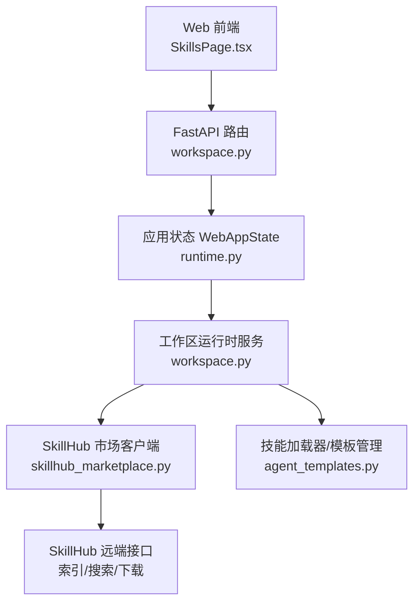
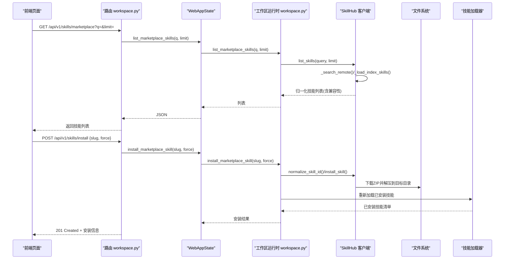
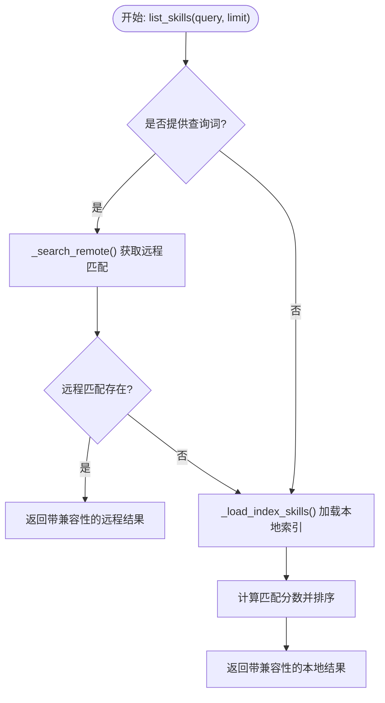
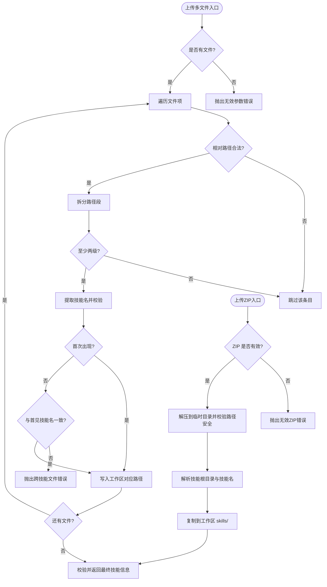
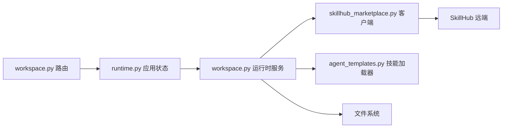

# 技能市场集成

<cite>
**本文引用的文件**
- [nanobot/services/skillhub_marketplace.py](file://nanobot/services/skillhub_marketplace.py)
- [nanobot/web/routers/workspace.py](file://nanobot/web/routers/workspace.py)
- [nanobot/web/runtime.py](file://nanobot/web/runtime.py)
- [nanobot/web/app.py](file://nanobot/web/app.py)
- [nanobot/web/runtime_services/workspace.py](file://nanobot/web/runtime_services/workspace.py)
- [nanobot/services/agent_templates.py](file://nanobot/services/agent_templates.py)
- [nanobot/skills/clawhub/SKILL.md](file://nanobot/skills/clawhub/SKILL.md)
- [tests/test_skillhub_marketplace.py](file://tests/test_skillhub_marketplace.py)
- [tests/test_web_api.py](file://tests/test_web_api.py)
</cite>

## 目录
1. [简介](#简介)
2. [项目结构](#项目结构)
3. [核心组件](#核心组件)
4. [架构总览](#架构总览)
5. [详细组件分析](#详细组件分析)
6. [依赖分析](#依赖分析)
7. [性能考虑](#性能考虑)
8. [故障排除指南](#故障排除指南)
9. [结论](#结论)
10. [附录](#附录)

## 简介
本文件面向 Nanobot 技能市场的集成与使用，重点覆盖以下方面：
- ClawHub 注册表的集成方式与远程技能发现流程
- 远程技能安装与本地技能上传机制
- 技能发现算法、兼容性检查与版本管理策略
- 技能元数据结构、描述格式与安装约束条件
- 技能市场 API 使用示例（搜索、下载、安装）
- 技能缓存机制、离线模式支持与网络异常处理
- 具体集成代码示例与故障排除指南

## 项目结构
技能市场相关能力由“前端页面 → Web 路由 → 应用状态 → 工作区运行时服务 → 技能市场客户端 → 技能加载器”构成的链路协同完成。

图表来源
- [nanobot/web/routers/workspace.py:144-184](file://nanobot/web/routers/workspace.py#L144-L184)
- [nanobot/web/runtime.py:259-272](file://nanobot/web/runtime.py#L259-L272)
- [nanobot/web/runtime_services/workspace.py:21-28](file://nanobot/web/runtime_services/workspace.py#L21-L28)
- [nanobot/services/skillhub_marketplace.py:87-105](file://nanobot/services/skillhub_marketplace.py#L87-L105)
- [nanobot/services/agent_templates.py:447-469](file://nanobot/services/agent_templates.py#L447-L469)

章节来源
- [nanobot/web/app.py:248-262](file://nanobot/web/app.py#L248-L262)
- [nanobot/web/routers/workspace.py:144-184](file://nanobot/web/routers/workspace.py#L144-L184)
- [nanobot/web/runtime.py:259-272](file://nanobot/web/runtime.py#L259-L272)
- [nanobot/web/runtime_services/workspace.py:21-28](file://nanobot/web/runtime_services/workspace.py#L21-L28)

## 核心组件
- SkillHub 市场客户端：负责远程索引获取、搜索、下载与兼容性分析；提供本地安装与归一化结果。
- 工作区运行时服务：封装 Web UI 暴露的工作区能力，协调技能市场客户端与技能加载器，处理上传与删除等操作。
- 技能加载器/模板管理：从工作区 skills 目录加载技能，解析元数据，统一返回给前端展示。
- Web 路由与应用状态：暴露 REST API，将请求转发到工作区运行时服务，并进行错误包装与响应格式化。

章节来源
- [nanobot/services/skillhub_marketplace.py:87-146](file://nanobot/services/skillhub_marketplace.py#L87-L146)
- [nanobot/web/runtime_services/workspace.py:21-28](file://nanobot/web/runtime_services/workspace.py#L21-L28)
- [nanobot/services/agent_templates.py:447-469](file://nanobot/services/agent_templates.py#L447-L469)
- [nanobot/web/routers/workspace.py:144-184](file://nanobot/web/routers/workspace.py#L144-L184)
- [nanobot/web/runtime.py:259-272](file://nanobot/web/runtime.py#L259-L272)

## 架构总览
技能市场调用链路如下：

图表来源
- [nanobot/web/routers/workspace.py:144-161](file://nanobot/web/routers/workspace.py#L144-L161)
- [nanobot/web/runtime.py:262-266](file://nanobot/web/runtime.py#L262-L266)
- [nanobot/web/runtime_services/workspace.py:123-139](file://nanobot/web/runtime_services/workspace.py#L123-L139)
- [nanobot/services/skillhub_marketplace.py:106-161](file://nanobot/services/skillhub_marketplace.py#L106-L161)
- [nanobot/services/agent_templates.py:447-469](file://nanobot/services/agent_templates.py#L447-L469)

## 详细组件分析

### SkillHub 市场客户端
- 远程接口
  - 索引地址：用于获取技能列表
  - 搜索地址：向 SkillHub 发起关键词搜索
  - 下载地址：优先主站下载，失败回退到对象存储下载
- 技能发现与排序
  - 支持查询参数与限制数量
  - 若存在远程匹配结果则优先返回；否则加载本地索引并按下载量、更新时间、名称排序
- 兼容性检查
  - 下载 ZIP 后进行安全性校验（仅允许有效 ZIP）
  - 解析单个 SKILL.md，若缺失或多于一个则判定为不兼容
  - 基于规则集判断“不建议安装/部分兼容/原生可用”，并生成理由摘要
- 缓存机制
  - 对每个技能的兼容性分析结果进行内存缓存，避免重复下载与分析
- 错误处理
  - 统一抛出 SkillHubMarketplaceError，便于上层路由捕获并转换为 API 错误

图表来源
- [nanobot/services/skillhub_marketplace.py:106-140](file://nanobot/services/skillhub_marketplace.py#L106-L140)

章节来源
- [nanobot/services/skillhub_marketplace.py:15-22](file://nanobot/services/skillhub_marketplace.py#L15-L22)
- [nanobot/services/skillhub_marketplace.py:106-140](file://nanobot/services/skillhub_marketplace.py#L106-L140)
- [nanobot/services/skillhub_marketplace.py:320-425](file://nanobot/services/skillhub_marketplace.py#L320-L425)

### 工作区运行时服务
- 技能市场列表：委托 SkillHub 客户端获取并返回
- 远程安装：校验内置技能冲突，调用 SkillHub 客户端安装至工作区 skills 目录，随后刷新已安装技能列表
- 本地上传（多文件）：校验相对路径与技能名合法性，写入工作区 skills 目录，确保包含 SKILL.md
- 本地上传（ZIP）：解压校验安全路径，定位唯一技能根目录，复制到工作区
- 删除技能：仅允许删除工作区技能，内置技能禁止删除

图表来源
- [nanobot/web/runtime_services/workspace.py:187-231](file://nanobot/web/runtime_services/workspace.py#L187-L231)
- [nanobot/web/runtime_services/workspace.py:233-261](file://nanobot/web/runtime_services/workspace.py#L233-L261)

章节来源
- [nanobot/web/runtime_services/workspace.py:123-139](file://nanobot/web/runtime_services/workspace.py#L123-L139)
- [nanobot/web/runtime_services/workspace.py:187-231](file://nanobot/web/runtime_services/workspace.py#L187-L231)
- [nanobot/web/runtime_services/workspace.py:233-261](file://nanobot/web/runtime_services/workspace.py#L233-L261)
- [nanobot/web/runtime_services/workspace.py:263-277](file://nanobot/web/runtime_services/workspace.py#L263-L277)

### 技能加载器与模板管理
- 通过 SkillsLoader 从工作区 skills 目录枚举已安装技能，读取元数据（如 tags、version、author），并标注来源（workspace/builtin）
- 将技能信息统一为前端可消费的结构，包含 id、name、description、source、path、version、tags、enabled、isDeletable 等字段

章节来源
- [nanobot/services/agent_templates.py:447-469](file://nanobot/services/agent_templates.py#L447-L469)

### Web 路由与应用状态
- 暴露以下 API：
  - GET /api/v1/skills/marketplace：查询技能市场列表
  - POST /api/v1/skills/install：安装远程技能
  - POST /api/v1/skills/upload：上传多文件技能
  - POST /api/v1/skills/upload-zip：上传 ZIP 技能
  - DELETE /api/v1/skills/{skill_id}：删除技能
- 应用状态 WebAppState 将请求转发到工作区运行时服务，并对 SkillHubMarketplaceError 与 ValueError 进行统一错误包装

章节来源
- [nanobot/web/routers/workspace.py:144-184](file://nanobot/web/routers/workspace.py#L144-L184)
- [nanobot/web/runtime.py:259-272](file://nanobot/web/runtime.py#L259-L272)

## 依赖分析
- 组件耦合
  - 路由层仅负责参数校验与错误包装，业务逻辑集中在工作区运行时服务
  - 工作区运行时服务依赖 SkillHub 客户端与技能加载器
  - SkillHub 客户端依赖 httpx 与 zipfile，内部维护兼容性缓存
- 外部依赖
  - SkillHub 远端接口（索引、搜索、下载）
  - 文件系统（读写工作区 skills 目录）

图表来源
- [nanobot/web/routers/workspace.py:144-184](file://nanobot/web/routers/workspace.py#L144-L184)
- [nanobot/web/runtime.py:259-272](file://nanobot/web/runtime.py#L259-L272)
- [nanobot/web/runtime_services/workspace.py:21-28](file://nanobot/web/runtime_services/workspace.py#L21-L28)
- [nanobot/services/skillhub_marketplace.py:87-105](file://nanobot/services/skillhub_marketplace.py#L87-L105)

章节来源
- [nanobot/web/app.py:248-262](file://nanobot/web/app.py#L248-L262)

## 性能考虑
- 兼容性缓存：对每个技能的兼容性分析结果进行内存缓存，减少重复下载与解析开销
- 限流与超时：搜索与索引请求设置较短超时，避免阻塞主流程
- 排序与限制：列表默认限制返回数量，搜索命中优先返回，降低网络与解析成本
- ZIP 安全校验：在解压前进行路径安全检查，防止路径穿越与无效 ZIP 导致的资源浪费

章节来源
- [nanobot/services/skillhub_marketplace.py:104-105](file://nanobot/services/skillhub_marketplace.py#L104-L105)
- [nanobot/services/skillhub_marketplace.py:170-190](file://nanobot/services/skillhub_marketplace.py#L170-L190)
- [nanobot/web/runtime_services/workspace.py:244-251](file://nanobot/web/runtime_services/workspace.py#L244-L251)

## 故障排除指南
- 安装失败（技能已存在）
  - 现象：提示内置技能冲突
  - 处理：更换 slug 或选择其他技能
  - 参考
    - [nanobot/web/runtime_services/workspace.py:127-132](file://nanobot/web/runtime_services/workspace.py#L127-L132)
- 安装失败（下载异常）
  - 现象：下载主站或回退地址均失败
  - 处理：检查网络连通性与代理设置；重试或切换网络环境
  - 参考
    - [nanobot/services/skillhub_marketplace.py:207-232](file://nanobot/services/skillhub_marketplace.py#L207-L232)
- 安装失败（ZIP 非法或不安全）
  - 现象：下载内容非 ZIP、包含绝对路径或穿越路径
  - 处理：修正技能包结构，确保仅包含相对路径且为有效 ZIP
  - 参考
    - [nanobot/services/skillhub_marketplace.py:224-226](file://nanobot/services/skillhub_marketplace.py#L224-L226)
    - [nanobot/web/runtime_services/workspace.py:248-250](file://nanobot/web/runtime_services/workspace.py#L248-L250)
- 上传失败（多文件/ZIP）
  - 现象：未提供文件、跨技能文件、ZIP 非法、缺少 SKILL.md
  - 处理：确保同一技能所有文件位于同一根目录；ZIP 内仅包含一个技能；包含 SKILL.md
  - 参考
    - [nanobot/web/runtime_services/workspace.py:187-231](file://nanobot/web/runtime_services/workspace.py#L187-L231)
    - [nanobot/web/runtime_services/workspace.py:233-261](file://nanobot/web/runtime_services/workspace.py#L233-L261)
- 删除失败（内置技能）
  - 现象：尝试删除内置技能
  - 处理：内置技能不可删除，请通过工作区技能进行替换
  - 参考
    - [nanobot/web/runtime_services/workspace.py:273-277](file://nanobot/web/runtime_services/workspace.py#L273-L277)

## 结论
Nanobot 的技能市场集成以 SkillHub 客户端为核心，结合工作区运行时服务与技能加载器，实现了从远程发现、兼容性评估、安装到本地上传与删除的完整闭环。通过缓存与安全校验提升性能与可靠性，配合清晰的 API 与错误处理，为用户提供了稳定易用的技能生态体验。

## 附录

### 技能元数据结构与描述格式
- 字段定义（来自技能加载器）
  - id/name/description：技能标识与描述
  - source：来源（workspace/builtin）
  - path：技能所在路径
  - version/author/tags：版本、作者与标签
  - enabled/isDeletable：启用状态与可删除性
- 示例参考
  - [nanobot/services/agent_templates.py:455-468](file://nanobot/services/agent_templates.py#L455-L468)

章节来源
- [nanobot/services/agent_templates.py:455-468](file://nanobot/services/agent_templates.py#L455-L468)

### 兼容性检查与版本管理策略
- 兼容性等级
  - native：原生可用（包含标准 SKILL.md，未发现不兼容约定）
  - partial：部分兼容（存在第三方运行时约定或路径约定，需手工改造）
  - unsupported：不建议安装（包含明确不兼容的运行时依赖）
  - unknown：待验证（仅能确认存在于市场，尚未下载分析）
- 版本管理
  - 元数据中 version 字段来源于 SKILL.md 或索引；未提供时采用默认值
- 规则依据
  - 包含 sessions_*、hooks/openclaw/claude/codex、.openclaw/.claude/.codex 等约定时，倾向不建议安装或部分兼容
  - 参考
    - [nanobot/services/skillhub_marketplace.py:25-80](file://nanobot/services/skillhub_marketplace.py#L25-L80)
    - [nanobot/services/skillhub_marketplace.py:347-414](file://nanobot/services/skillhub_marketplace.py#L347-L414)

章节来源
- [nanobot/services/skillhub_marketplace.py:25-80](file://nanobot/services/skillhub_marketplace.py#L25-L80)
- [nanobot/services/skillhub_marketplace.py:347-414](file://nanobot/services/skillhub_marketplace.py#L347-L414)

### 技能市场 API 使用示例
- 搜索技能市场
  - 方法：GET /api/v1/skills/marketplace?q=&limit=
  - 参数：q（关键词）、limit（数量上限，默认 24，最大 100）
  - 返回：技能列表（含兼容性、下载量、更新时间等）
  - 参考
    - [nanobot/web/routers/workspace.py:144-150](file://nanobot/web/routers/workspace.py#L144-L150)
    - [nanobot/web/runtime.py:262-263](file://nanobot/web/runtime.py#L262-L263)
- 安装远程技能
  - 方法：POST /api/v1/skills/install
  - 请求体：{ slug, force=false }
  - 返回：安装后的技能信息（source=workspace）
  - 参考
    - [nanobot/web/routers/workspace.py:153-161](file://nanobot/web/routers/workspace.py#L153-L161)
    - [nanobot/web/runtime.py:265-266](file://nanobot/web/runtime.py#L265-L266)
- 上传多文件技能
  - 方法：POST /api/v1/skills/upload
  - 表单字段：path[] 与 file[]（一一对应）
  - 返回：安装后的技能信息
  - 参考
    - [nanobot/web/routers/workspace.py:164-184](file://nanobot/web/routers/workspace.py#L164-L184)
    - [nanobot/web/runtime.py:268-269](file://nanobot/web/runtime.py#L268-L269)
- 上传 ZIP 技能
  - 方法：POST /api/v1/skills/upload-zip
  - 表单字段：file（ZIP）
  - 返回：安装后的技能信息
  - 参考
    - [nanobot/web/routers/workspace.py:187-201](file://nanobot/web/routers/workspace.py#L187-L201)
    - [nanobot/web/runtime.py:271-272](file://nanobot/web/runtime.py#L271-L272)
- 删除技能
  - 方法：DELETE /api/v1/skills/{skill_id}
  - 返回：{ deleted: true }
  - 参考
    - [nanobot/web/routers/workspace.py:204-212](file://nanobot/web/routers/workspace.py#L204-L212)
    - [nanobot/web/runtime.py:274-275](file://nanobot/web/runtime.py#L274-L275)

### 离线模式与网络异常处理
- 离线模式
  - 本地技能列表与已安装技能可在无网络情况下正常访问
  - 远程搜索与安装依赖网络，失败时返回 API 错误
- 网络异常
  - 搜索与索引请求设置较短超时，避免长时间等待
  - 下载失败自动回退到备用地址
  - 参考
    - [nanobot/services/skillhub_marketplace.py:170-190](file://nanobot/services/skillhub_marketplace.py#L170-L190)
    - [nanobot/services/skillhub_marketplace.py:207-232](file://nanobot/services/skillhub_marketplace.py#L207-L232)

### 具体集成代码示例
- 前端调用示例（参考）
  - 搜索市场技能
    - [web-ui/src/api.ts:840-847](file://web-ui/src/api.ts#L840-L847)
  - 安装远程技能
    - [web-ui/src/api.ts:848-852](file://web-ui/src/api.ts#L848-L852)
  - 上传 ZIP 技能
    - [web-ui/src/api.ts:853-858](file://web-ui/src/api.ts#L853-L858)
  - 上传多文件技能
    - [web-ui/src/api.ts:859-864](file://web-ui/src/api.ts#L859-L864)
- 测试用例参考
  - 远程安装与市场搜索测试
    - [tests/test_web_api.py:2969-3005](file://tests/test_web_api.py#L2969-L3005)
  - 兼容性分析测试
    - [tests/test_skillhub_marketplace.py:17-101](file://tests/test_skillhub_marketplace.py#L17-L101)