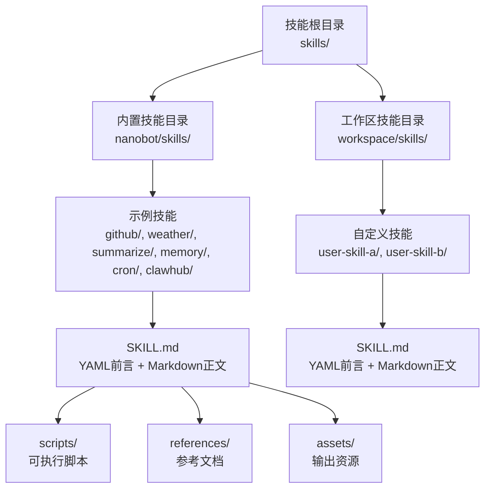
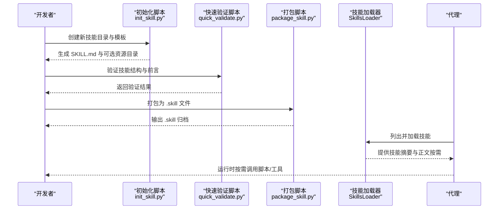
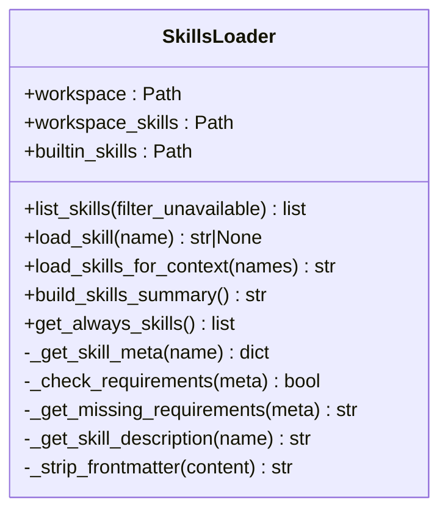
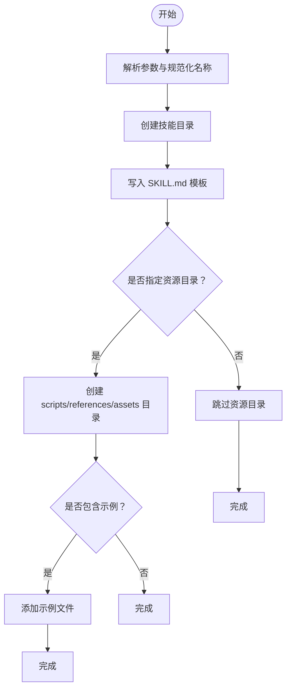
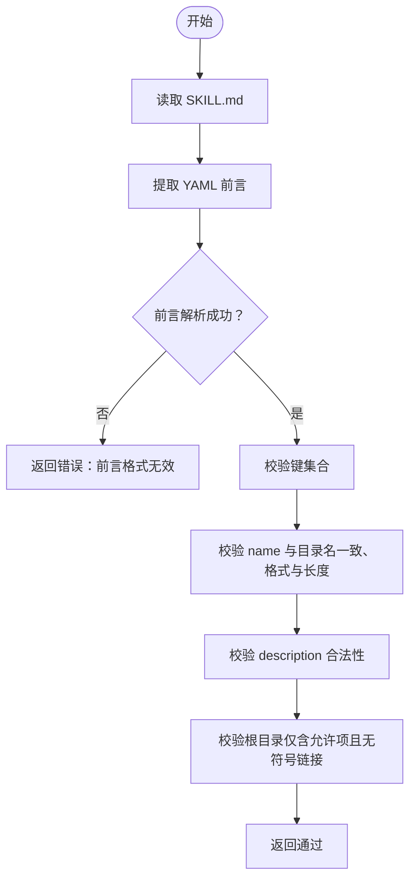
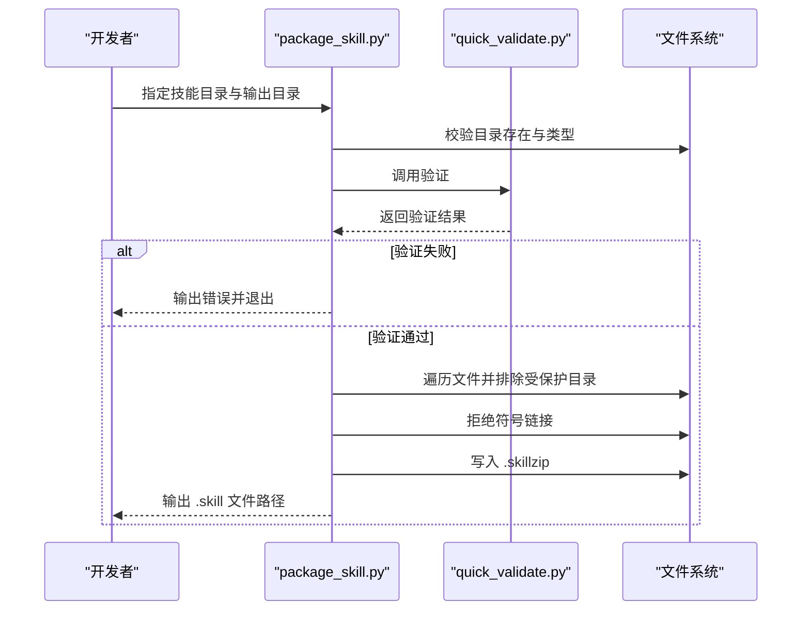
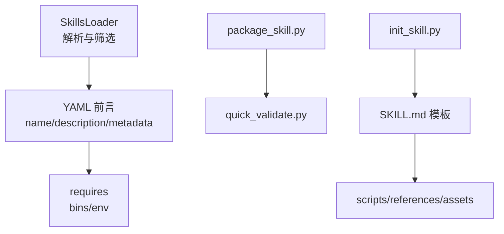

# 技能开发指南

<cite>
**本文引用的文件**
- [nanobot/skills/skill-creator/SKILL.md](file://nanobot/skills/skill-creator/SKILL.md)
- [nanobot/skills/skill-creator/scripts/init_skill.py](file://nanobot/skills/skill-creator/scripts/init_skill.py)
- [nanobot/skills/skill-creator/scripts/package_skill.py](file://nanobot/skills/skill-creator/scripts/package_skill.py)
- [nanobot/skills/skill-creator/scripts/quick_validate.py](file://nanobot/skills/skill-creator/scripts/quick_validate.py)
- [nanobot/skills/README.md](file://nanobot/skills/README.md)
- [nanobot/agent/skills.py](file://nanobot/agent/skills.py)
- [nanobot/skills/github/SKILL.md](file://nanobot/skills/github/SKILL.md)
- [nanobot/skills/weather/SKILL.md](file://nanobot/skills/weather/SKILL.md)
- [nanobot/skills/summarize/SKILL.md](file://nanobot/skills/summarize/SKILL.md)
- [nanobot/skills/memory/SKILL.md](file://nanobot/skills/memory/SKILL.md)
- [nanobot/skills/clawhub/SKILL.md](file://nanobot/skills/clawhub/SKILL.md)
- [nanobot/skills/cron/SKILL.md](file://nanobot/skills/cron/SKILL.md)
- [nanobot/templates/TOOLS.md](file://nanobot/templates/TOOLS.md)
- [nanobot/templates/AGENTS.md](file://nanobot/templates/AGENTS.md)
- [tests/test_skill_creator_scripts.py](file://tests/test_skill_creator_scripts.py)
</cite>

## 目录
1. [简介](#简介)
2. [项目结构](#项目结构)
3. [核心组件](#核心组件)
4. [架构总览](#架构总览)
5. [详细组件分析](#详细组件分析)
6. [依赖分析](#依赖分析)
7. [性能考虑](#性能考虑)
8. [故障排查指南](#故障排查指南)
9. [结论](#结论)
10. [附录](#附录)

## 简介
本指南面向在 Nanobot 平台上进行“技能（Skill）”开发的工程师与产品人员。技能是模块化、可自包含的包，用于扩展代理的能力，提供特定领域的知识、工作流与工具集成。Nanobot 的技能系统以 SKILL.md 为核心契约：通过 YAML 前言元数据定义触发条件与能力描述，并以 Markdown 指令指导代理如何正确使用技能资源（如脚本、参考文档与资产）。  
本指南将系统讲解：
- 技能目录结构与命名规范
- SKILL.md 的 YAML 前言元数据规范
- 技能开发工具链（初始化、验证、打包）
- 最佳实践（代码组织、错误处理、性能优化）
- 测试方法、调试技巧与发布流程
- 完整开发示例（从简单工具到复杂代理的实现思路）

## 项目结构
Nanobot 将内置技能与用户自定义技能统一管理。技能根目录下每个子目录即一个技能包，其中必须包含 SKILL.md；可选包含 scripts/、references/、assets/ 等资源目录。

图示来源
- [nanobot/skills/README.md:7-18](file://nanobot/skills/README.md#L7-L18)
- [nanobot/agent/skills.py:21-57](file://nanobot/agent/skills.py#L21-L57)

章节来源
- [nanobot/skills/README.md:1-38](file://nanobot/skills/README.md#L1-L38)
- [nanobot/agent/skills.py:21-57](file://nanobot/agent/skills.py#L21-L57)

## 核心组件
- 技能加载器（SkillsLoader）
  - 负责扫描工作区与内置技能目录，解析 SKILL.md 的 YAML 前言元数据，按需过滤不可用技能，并支持将技能内容按需加载进代理上下文。
- 工具链脚本
  - 初始化脚本：生成标准化的技能模板与资源目录。
  - 快速验证脚本：校验技能目录结构、前言字段、名称与描述规范等。
  - 打包脚本：将技能打包为 .skill 文件（zip），并拒绝符号链接等不安全内容。

章节来源
- [nanobot/agent/skills.py:13-229](file://nanobot/agent/skills.py#L13-L229)
- [nanobot/skills/skill-creator/scripts/init_skill.py:1-379](file://nanobot/skills/skill-creator/scripts/init_skill.py#L1-L379)
- [nanobot/skills/skill-creator/scripts/quick_validate.py:1-214](file://nanobot/skills/skill-creator/scripts/quick_validate.py#L1-L214)
- [nanobot/skills/skill-creator/scripts/package_skill.py:1-155](file://nanobot/skills/skill-creator/scripts/package_skill.py#L1-L155)

## 架构总览
技能系统围绕“发现—解析—筛选—加载—执行”的闭环工作流展开。代理启动或需要上下文时，由 SkillsLoader 发现并解析技能元数据；随后根据触发条件与可用性动态加载技能正文与资源，最终驱动工具链脚本完成初始化、验证与打包。

图示来源
- [nanobot/skills/skill-creator/scripts/init_skill.py:255-317](file://nanobot/skills/skill-creator/scripts/init_skill.py#L255-L317)
- [nanobot/skills/skill-creator/scripts/quick_validate.py:132-203](file://nanobot/skills/skill-creator/scripts/quick_validate.py#L132-L203)
- [nanobot/skills/skill-creator/scripts/package_skill.py:36-127](file://nanobot/skills/skill-creator/scripts/package_skill.py#L36-L127)
- [nanobot/agent/skills.py:26-99](file://nanobot/agent/skills.py#L26-L99)

## 详细组件分析

### 组件一：技能目录结构与命名规范
- 目录要求
  - 每个技能目录必须包含 SKILL.md；可选包含 scripts/、references/、assets/。
  - 技能目录名必须与 SKILL.md 中的 name 字段一致。
  - 名称仅允许小写字母、数字与连字符，长度不超过 64。
- 资源目录职责
  - scripts/：可直接执行的自动化脚本（Python/Bash 等），适合重复性高、可靠性要求高的任务。
  - references/：按需加载的参考文档，避免将大量细节塞入 SKILL.md 正文。
  - assets/：不放入上下文的输出资源（模板、图标、字体等），用于最终产物生成。

章节来源
- [nanobot/skills/README.md:7-18](file://nanobot/skills/README.md#L7-L18)
- [nanobot/skills/skill-creator/SKILL.md:46-126](file://nanobot/skills/skill-creator/SKILL.md#L46-L126)
- [nanobot/skills/skill-creator/scripts/init_skill.py:194-224](file://nanobot/skills/skill-creator/scripts/init_skill.py#L194-L224)

### 组件二：SKILL.md 的 YAML 前言元数据规范
- 必填字段
  - name：技能名称（与目录同名）
  - description：技能描述，决定何时触发与如何使用
- 可选字段
  - metadata.nanobot.requires：声明外部依赖（如 bins、env）
  - metadata.nanobot.always：是否始终加载（满足依赖时）
  - homepage、license 等
- 触发与可用性
  - 加载器会读取 description 作为触发依据；同时检查 requires 是否满足（如命令是否存在、环境变量是否设置）。

章节来源
- [nanobot/agent/skills.py:169-201](file://nanobot/agent/skills.py#L169-L201)
- [nanobot/skills/github/SKILL.md:1-6](file://nanobot/skills/github/SKILL.md#L1-L6)
- [nanobot/skills/summarize/SKILL.md:1-6](file://nanobot/skills/summarize/SKILL.md#L1-L6)
- [nanobot/skills/memory/SKILL.md:1-5](file://nanobot/skills/memory/SKILL.md#L1-L5)

### 组件三：技能加载器（SkillsLoader）
- 功能要点
  - 支持工作区与内置技能双路径扫描，优先级：工作区 > 内置
  - 解析 YAML 前言，提取 name、description、metadata
  - 按需过滤不可用技能（基于 requires）
  - 提供技能摘要（XML 格式）与正文加载接口
- 关键方法
  - list_skills(filter_unavailable)
  - load_skills_for_context(skill_names)
  - build_skills_summary()
  - get_always_skills()

图示来源
- [nanobot/agent/skills.py:13-229](file://nanobot/agent/skills.py#L13-L229)

章节来源
- [nanobot/agent/skills.py:26-229](file://nanobot/agent/skills.py#L26-L229)

### 组件四：初始化脚本（init_skill.py）
- 功能
  - 生成标准化 SKILL.md 模板与可选资源目录（scripts、references、assets）
  - 支持生成示例文件（便于快速上手）
  - 校验并规范化技能名称（hyphen-case、长度限制）
- 使用建议
  - 先初始化，再编辑 SKILL.md，最后运行验证与打包

图示来源
- [nanobot/skills/skill-creator/scripts/init_skill.py:255-317](file://nanobot/skills/skill-creator/scripts/init_skill.py#L255-L317)

章节来源
- [nanobot/skills/skill-creator/scripts/init_skill.py:1-379](file://nanobot/skills/skill-creator/scripts/init_skill.py#L1-L379)

### 组件五：快速验证脚本（quick_validate.py）
- 校验项
  - SKILL.md 存在且可读
  - YAML 前言格式正确、键合法（name/description/metadata/always 等）
  - name 与目录名一致、长度与格式符合要求
  - description 合法（非空、不含占位符、不包含尖括号、长度限制）
  - 根目录仅允许 SKILL.md 与资源目录（scripts/references/assets），不允许符号链接
- 输出
  - 返回布尔值与提示信息，失败时明确指出原因

图示来源
- [nanobot/skills/skill-creator/scripts/quick_validate.py:132-203](file://nanobot/skills/skill-creator/scripts/quick_validate.py#L132-L203)

章节来源
- [nanobot/skills/skill-creator/scripts/quick_validate.py:1-214](file://nanobot/skills/skill-creator/scripts/quick_validate.py#L1-L214)

### 组件六：打包脚本（package_skill.py）
- 行为
  - 在打包前自动调用验证脚本
  - 递归收集技能目录文件，排除版本控制与临时目录
  - 拒绝符号链接，防止潜在安全风险
  - 输出 .skill 文件（zip），保持目录层级
- 安全与一致性
  - 若输出目录位于技能根内，会跳过输出文件本身，避免写入自身

图示来源
- [nanobot/skills/skill-creator/scripts/package_skill.py:36-127](file://nanobot/skills/skill-creator/scripts/package_skill.py#L36-L127)

章节来源
- [nanobot/skills/skill-creator/scripts/package_skill.py:1-155](file://nanobot/skills/skill-creator/scripts/package_skill.py#L1-L155)

### 组件七：示例技能与参考模式
- GitHub 技能：展示 CLI 工具集成与 JSON 输出过滤
- 天气技能：展示免密服务调用与格式化输出
- 总结技能：展示外部 CLI 的安装与配置、模型与密钥设置
- 记忆技能：展示两层记忆系统与检索策略
- Cron 技能：展示定时提醒与任务调度
- ClawHub 技能：展示从公共注册表搜索与安装技能

章节来源
- [nanobot/skills/github/SKILL.md:1-49](file://nanobot/skills/github/SKILL.md#L1-L49)
- [nanobot/skills/weather/SKILL.md:1-50](file://nanobot/skills/weather/SKILL.md#L1-L50)
- [nanobot/skills/summarize/SKILL.md:1-68](file://nanobot/skills/summarize/SKILL.md#L1-L68)
- [nanobot/skills/memory/SKILL.md:1-38](file://nanobot/skills/memory/SKILL.md#L1-L38)
- [nanobot/skills/cron/SKILL.md:1-58](file://nanobot/skills/cron/SKILL.md#L1-L58)
- [nanobot/skills/clawhub/SKILL.md:1-54](file://nanobot/skills/clawhub/SKILL.md#L1-L54)

## 依赖分析
- 技能加载器对 YAML 前言的依赖
  - 通过正则与简单解析器读取 name/description/metadata
  - 对 metadata.nanobot.requires 进行外部依赖检查（命令是否存在、环境变量是否设置）
- 工具链脚本之间的耦合
  - package_skill.py 依赖 quick_validate.py 的验证逻辑
  - init_skill.py 与 package_skill.py 之间无直接依赖，但共享命名与结构约定

图示来源
- [nanobot/agent/skills.py:169-201](file://nanobot/agent/skills.py#L169-L201)
- [nanobot/skills/skill-creator/scripts/package_skill.py:17-67](file://nanobot/skills/skill-creator/scripts/package_skill.py#L17-L67)
- [nanobot/skills/skill-creator/scripts/quick_validate.py:132-203](file://nanobot/skills/skill-creator/scripts/quick_validate.py#L132-L203)
- [nanobot/skills/skill-creator/scripts/init_skill.py:255-317](file://nanobot/skills/skill-creator/scripts/init_skill.py#L255-L317)

章节来源
- [nanobot/agent/skills.py:169-201](file://nanobot/agent/skills.py#L169-L201)
- [nanobot/skills/skill-creator/scripts/package_skill.py:17-67](file://nanobot/skills/skill-creator/scripts/package_skill.py#L17-L67)
- [nanobot/skills/skill-creator/scripts/quick_validate.py:132-203](file://nanobot/skills/skill-creator/scripts/quick_validate.py#L132-L203)
- [nanobot/skills/skill-creator/scripts/init_skill.py:255-317](file://nanobot/skills/skill-creator/scripts/init_skill.py#L255-L317)

## 性能考虑
- 上下文窗口管理
  - 采用渐进披露：先加载元数据（约 100 字），再按需加载 SKILL.md 正文（建议小于 500 行），最后按需读取资源
  - 将长篇参考文档放入 references/，避免挤占上下文
- 资源执行效率
  - scripts/ 中的脚本可直接执行，无需加载到上下文，适合重复性高、确定性强的任务
- 工具调用限制
  - exec 工具有超时、阻断危险命令、输出截断等安全限制，应结合工具链脚本与技能设计规避风险

章节来源
- [nanobot/skills/skill-creator/SKILL.md:113-126](file://nanobot/skills/skill-creator/SKILL.md#L113-L126)
- [nanobot/templates/TOOLS.md:6-12](file://nanobot/templates/TOOLS.md#L6-L12)

## 故障排查指南
- 常见问题与定位
  - 描述中包含占位符或为空：验证脚本会报错，需完善 description
  - 根目录出现不受支持的文件：删除或移至资源目录
  - 符号链接导致打包失败：移除符号链接，确保内容显式可预测
  - name 与目录名不一致：修改 name 或重命名目录
- 单元测试参考
  - 测试覆盖了初始化、验证、打包与安全约束等场景，可作为本地回归参考

章节来源
- [tests/test_skill_creator_scripts.py:17-128](file://tests/test_skill_creator_scripts.py#L17-L128)
- [nanobot/skills/skill-creator/scripts/quick_validate.py:118-130](file://nanobot/skills/skill-creator/scripts/quick_validate.py#L118-L130)
- [nanobot/skills/skill-creator/scripts/package_skill.py:89-109](file://nanobot/skills/skill-creator/scripts/package_skill.py#L89-L109)

## 结论
Nanobot 的技能体系以 SKILL.md 为契约，辅以标准化的目录结构与工具链脚本，形成“可发现—可验证—可打包—可加载—可执行”的完整闭环。遵循本文规范与最佳实践，可高效构建从简单工具到复杂代理的多样化技能，并在运行时获得稳定的上下文与执行体验。

## 附录

### 开发流程与最佳实践
- 初始化
  - 使用初始化脚本生成模板与资源目录，再编辑 SKILL.md
- 编写
  - 前言聚焦触发条件与使用场景；正文聚焦步骤与参考链接
  - 将长文档放入 references/，将输出资源放入 assets/
- 验证
  - 使用快速验证脚本确保结构与元数据合规
- 打包
  - 生成 .skill 文件以便分发与安装
- 运行
  - 代理按需加载技能，满足依赖后方可使用

章节来源
- [nanobot/skills/skill-creator/SKILL.md:201-275](file://nanobot/skills/skill-creator/SKILL.md#L201-L275)
- [nanobot/skills/skill-creator/scripts/init_skill.py:273-317](file://nanobot/skills/skill-creator/scripts/init_skill.py#L273-L317)
- [nanobot/skills/skill-creator/scripts/quick_validate.py:132-203](file://nanobot/skills/skill-creator/scripts/quick_validate.py#L132-L203)
- [nanobot/skills/skill-creator/scripts/package_skill.py:36-127](file://nanobot/skills/skill-creator/scripts/package_skill.py#L36-L127)

### 示例清单与参考
- 简单工具类：GitHub、天气、总结
- 复杂代理类：记忆、Cron、ClawHub
- 模板与约束：工具使用注意事项、代理指令

章节来源
- [nanobot/skills/github/SKILL.md:1-49](file://nanobot/skills/github/SKILL.md#L1-L49)
- [nanobot/skills/weather/SKILL.md:1-50](file://nanobot/skills/weather/SKILL.md#L1-L50)
- [nanobot/skills/summarize/SKILL.md:1-68](file://nanobot/skills/summarize/SKILL.md#L1-L68)
- [nanobot/skills/memory/SKILL.md:1-38](file://nanobot/skills/memory/SKILL.md#L1-L38)
- [nanobot/skills/cron/SKILL.md:1-58](file://nanobot/skills/cron/SKILL.md#L1-L58)
- [nanobot/skills/clawhub/SKILL.md:1-54](file://nanobot/skills/clawhub/SKILL.md#L1-L54)
- [nanobot/templates/TOOLS.md:1-16](file://nanobot/templates/TOOLS.md#L1-L16)
- [nanobot/templates/AGENTS.md:1-22](file://nanobot/templates/AGENTS.md#L1-L22)