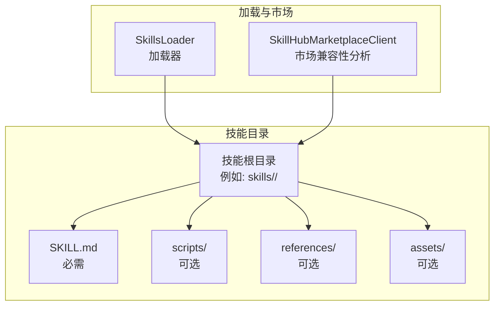
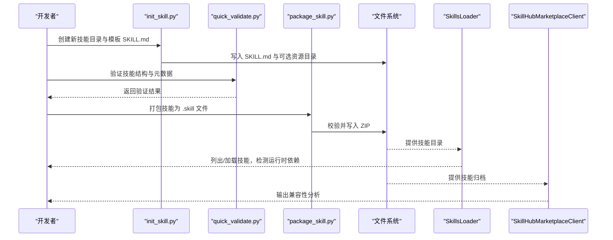
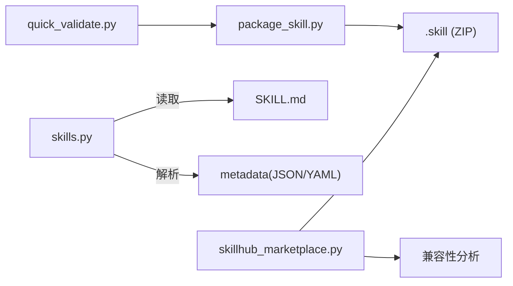

# 技能格式规范

<cite>
**本文引用的文件**   
- [nanobot/skills/skill-creator/scripts/init_skill.py](file://nanobot/skills/skill-creator/scripts/init_skill.py)
- [nanobot/skills/skill-creator/scripts/package_skill.py](file://nanobot/skills/skill-creator/scripts/package_skill.py)
- [nanobot/skills/skill-creator/scripts/quick_validate.py](file://nanobot/skills/skill-creator/scripts/quick_validate.py)
- [nanobot/skills/skill-creator/SKILL.md](file://nanobot/skills/skill-creator/SKILL.md)
- [nanobot/skills/clawhub/SKILL.md](file://nanobot/skills/clawhub/SKILL.md)
- [nanobot/skills/github/SKILL.md](file://nanobot/skills/github/SKILL.md)
- [nanobot/skills/memory/SKILL.md](file://nanobot/skills/memory/SKILL.md)
- [nanobot/skills/weather/SKILL.md](file://nanobot/skills/weather/SKILL.md)
- [nanobot/skills/tmux/SKILL.md](file://nanobot/skills/tmux/SKILL.md)
- [nanobot/skills/summarize/SKILL.md](file://nanobot/skills/summarize/SKILL.md)
- [nanobot/skills/README.md](file://nanobot/skills/README.md)
- [nanobot/agent/skills.py](file://nanobot/agent/skills.py)
- [nanobot/services/skillhub_marketplace.py](file://nanobot/services/skillhub_marketplace.py)
- [tests/test_skill_creator_scripts.py](file://tests/test_skill_creator_scripts.py)
</cite>

## 目录
1. [简介](#简介)
2. [项目结构](#项目结构)
3. [核心组件](#核心组件)
4. [架构总览](#架构总览)
5. [详细组件分析](#详细组件分析)
6. [依赖分析](#依赖分析)
7. [性能考虑](#性能考虑)
8. [故障排查指南](#故障排查指南)
9. [结论](#结论)
10. [附录](#附录)

## 简介
本规范面向 Nanobot 技能（Skill）格式，定义 SKILL.md 的完整格式要求，包括 YAML 前言元数据结构、Markdown 指令格式与版本兼容性规则；明确技能标识符命名约定、描述规范与分类标签系统；记录技能安装包的打包标准（ZIP 结构、文件组织与完整性校验）；提供技能格式的验证规则、错误检查与修复建议；说明格式转换工具的使用方法与向后兼容性保障；并解释与 OpenClaw 生态系统的兼容性差异与迁移指南。

## 项目结构
Nanobot 技能体系由“技能目录 + SKILL.md + 可选资源目录”构成，支持通过内置加载器与 Web UI 市场进行发现与安装。技能资源可包含 scripts/、references/、assets/ 三类目录，分别用于可执行脚本、参考文档与输出模板/素材等。

图表来源
- [nanobot/agent/skills.py:21-80](file://nanobot/agent/skills.py#L21-L80)
- [nanobot/services/skillhub_marketplace.py:142-159](file://nanobot/services/skillhub_marketplace.py#L142-L159)

章节来源
- [nanobot/skills/README.md:7-18](file://nanobot/skills/README.md#L7-L18)
- [nanobot/agent/skills.py:21-80](file://nanobot/agent/skills.py#L21-L80)

## 核心组件
- SKILL.md：技能的“说明书”，包含 YAML 前言元数据与 Markdown 指令正文。前言元数据决定触发条件与运行时要求，正文提供使用指导与资源导航。
- 资源目录：
  - scripts/：可执行脚本（Python/Bash 等），强调确定性与可复用性。
  - references/：需按需加载到上下文的参考文档，避免挤占上下文窗口。
  - assets/：仅用于最终输出的模板/素材，不加载到上下文。
- 加载器 SkillsLoader：负责扫描工作区与内置技能目录，解析 SKILL.md 前言元数据，按需加载正文内容，并检测运行时依赖（如二进制、环境变量）。
- 打包与验证工具：init_skill.py 初始化模板，quick_validate.py 验证结构与元数据，package_skill.py 将技能打包为 .skill 文件（ZIP）。
- 市场兼容性分析：SkillHubMarketplaceClient 对远程技能进行兼容性评估，区分 native/partial/unsupported。

章节来源
- [nanobot/skills/skill-creator/SKILL.md:46-126](file://nanobot/skills/skill-creator/SKILL.md#L46-L126)
- [nanobot/skills/skill-creator/scripts/init_skill.py:194-206](file://nanobot/skills/skill-creator/scripts/init_skill.py#L194-L206)
- [nanobot/skills/skill-creator/scripts/quick_validate.py:102-130](file://nanobot/skills/skill-creator/scripts/quick_validate.py#L102-L130)
- [nanobot/agent/skills.py:13-200](file://nanobot/agent/skills.py#L13-L200)
- [nanobot/services/skillhub_marketplace.py:24-54](file://nanobot/services/skillhub_marketplace.py#L24-L54)

## 架构总览
下图展示从技能目录到加载器、再到市场兼容性分析的整体流程。

图表来源
- [nanobot/skills/skill-creator/scripts/init_skill.py:255-317](file://nanobot/skills/skill-creator/scripts/init_skill.py#L255-L317)
- [nanobot/skills/skill-creator/scripts/quick_validate.py:132-203](file://nanobot/skills/skill-creator/scripts/quick_validate.py#L132-L203)
- [nanobot/skills/skill-creator/scripts/package_skill.py:36-127](file://nanobot/skills/skill-creator/scripts/package_skill.py#L36-L127)
- [nanobot/agent/skills.py:26-57](file://nanobot/agent/skills.py#L26-L57)
- [nanobot/services/skillhub_marketplace.py:115-140](file://nanobot/services/skillhub_marketplace.py#L115-L140)

## 详细组件分析

### YAML 前言元数据结构
- 必填字段
  - name：技能名称，必须为小写字母、数字与短横线组成的 hyphen-case 字符串，长度不超过 64；且必须与技能目录名一致。
  - description：技能描述，不能为空，不得包含 TODO 占位符，不得包含尖括号，长度不超过 1024。
- 可选字段
  - always：布尔值，若为真则在满足运行时依赖的前提下始终加载。
  - metadata：JSON 字符串，支持 nanobot/openclaw 键空间；nanobot 优先使用其键值。
  - homepage：技能主页链接（字符串）。
  - license：许可证信息（字符串）。
  - allowed-tools：允许使用的工具列表（数组，字符串）。
- 元数据解析与兼容性
  - nanobot 会解析 metadata 中的 nanobot/openclaw 键值，以识别运行时需求（如 emoji、操作系统、二进制依赖、安装指引等）。
  - 若 metadata 为 JSON，则优先取 nanobot 键；否则回退到 openclaw 键；若非 JSON 则忽略。

章节来源
- [nanobot/skills/skill-creator/scripts/quick_validate.py:17-24](file://nanobot/skills/skill-creator/scripts/quick_validate.py#L17-L24)
- [nanobot/skills/skill-creator/scripts/quick_validate.py:102-115](file://nanobot/skills/skill-creator/scripts/quick_validate.py#L102-L115)
- [nanobot/skills/skill-creator/scripts/quick_validate.py:118-129](file://nanobot/skills/skill-creator/scripts/quick_validate.py#L118-L129)
- [nanobot/agent/skills.py:169-191](file://nanobot/agent/skills.py#L169-L191)

### Markdown 指令格式与结构
- 正文采用 Markdown，建议遵循“渐进披露”原则：
  - 元数据（name + description）始终在上下文中（约 100 字）。
  - SKILL.md 正文仅在技能触发时加载（建议小于 500 行）。
  - 资源文件仅在需要时按需加载（scripts 可直接执行无需读入上下文）。
- 推荐结构模式
  - 高层概览 + 快速开始 + 分域/变体参考文件（references/）。
  - 对长文档提供目录索引，便于预览与检索。
- 示例技能参考
  - clawhub：公共技能注册表搜索与安装。
  - github：GitHub CLI 使用指南与高级查询。
  - weather：天气服务查询与格式化。
  - tmux：tmux 交互式会话控制与并行编码场景。
  - summarize：URL/视频摘要与转录工具使用。

章节来源
- [nanobot/skills/skill-creator/SKILL.md:113-200](file://nanobot/skills/skill-creator/SKILL.md#L113-L200)
- [nanobot/skills/clawhub/SKILL.md:1-54](file://nanobot/skills/clawhub/SKILL.md#L1-L54)
- [nanobot/skills/github/SKILL.md:1-49](file://nanobot/skills/github/SKILL.md#L1-L49)
- [nanobot/skills/weather/SKILL.md:1-50](file://nanobot/skills/weather/SKILL.md#L1-L50)
- [nanobot/skills/tmux/SKILL.md:1-122](file://nanobot/skills/tmux/SKILL.md#L1-L122)
- [nanobot/skills/summarize/SKILL.md:1-68](file://nanobot/skills/summarize/SKILL.md#L1-L68)

### 技能标识符命名约定
- 仅允许小写字母、数字与短横线；多个单词用短横线连接。
- 长度限制：最多 64 个字符。
- 与目录名一致：技能目录名必须与 name 字段相同。
- 建议：优先短小、动词开头的表达，必要时按工具命名进行命名空间化（如 gh-、linear-）。

章节来源
- [nanobot/skills/skill-creator/scripts/quick_validate.py:102-115](file://nanobot/skills/skill-creator/scripts/quick_validate.py#L102-L115)
- [nanobot/skills/skill-creator/SKILL.md:214-221](file://nanobot/skills/skill-creator/SKILL.md#L214-L221)

### 描述规范与分类标签系统
- 描述规范
  - 非空、不含 TODO 占位符、不含尖括号、长度不超过 1024。
  - 描述是触发机制的核心，应明确“何时使用此技能”。
- 分类标签系统
  - 市场索引技能包含 tags 字段（示例见内置技能 README）。
  - 兼容性分析中，技能列表按下载量、更新时间与名称排序，同时标注 compatibility 与 compatibilityReasons。

章节来源
- [nanobot/skills/skill-creator/scripts/quick_validate.py:118-129](file://nanobot/skills/skill-creator/scripts/quick_validate.py#L118-L129)
- [nanobot/skills/README.md:28-38](file://nanobot/skills/README.md#L28-L38)
- [nanobot/services/skillhub_marketplace.py:115-140](file://nanobot/services/skillhub_marketplace.py#L115-L140)

### 技能安装包的打包标准
- 包结构
  - .skill 文件为 ZIP 格式，内部保持“技能根目录/技能名”的相对路径。
  - 仅允许普通文件，拒绝符号链接；禁止文件逃逸技能根目录。
- 排除规则
  - 自动排除 .git、.svn、.hg、__pycache__、node_modules 等目录。
- 输出位置
  - 默认输出到当前目录；可指定输出目录。
- 完整性校验
  - 打包前自动调用验证器，失败则拒绝生成 .skill 文件。
  - 打包过程中若发现异常（如符号链接、逃逸路径），清理部分产物并报错。

章节来源
- [nanobot/skills/skill-creator/scripts/package_skill.py:36-127](file://nanobot/skills/skill-creator/scripts/package_skill.py#L36-L127)
- [nanobot/skills/skill-creator/scripts/package_skill.py:83-110](file://nanobot/skills/skill-creator/scripts/package_skill.py#L83-L110)

### 验证规则、错误检查与修复建议
- 前言元数据
  - 必须存在 name 与 description；不允许未知键；description 不得为空、含 TODO、含尖括号、超长。
- 目录结构
  - 技能根目录仅允许 SKILL.md 与 scripts/、references/、assets/ 三个资源目录；其他文件/目录视为非法。
  - 不允许符号链接。
- 名称一致性
  - name 必须与目录名一致。
- 运行时依赖
  - 若 metadata 中包含 requires（如 bins、env），加载器会在列出技能时检测缺失项并在摘要中提示。
- 测试用例覆盖
  - 存在针对占位符描述与根目录非法文件的断言，确保验证器正确拦截。

章节来源
- [nanobot/skills/skill-creator/scripts/quick_validate.py:158-201](file://nanobot/skills/skill-creator/scripts/quick_validate.py#L158-L201)
- [nanobot/agent/skills.py:142-152](file://nanobot/agent/skills.py#L142-L152)
- [tests/test_skill_creator_scripts.py:40-74](file://tests/test_skill_creator_scripts.py#L40-L74)

### 格式转换工具与使用方法
- init_skill.py
  - 功能：初始化技能目录，生成模板 SKILL.md 与可选资源目录（scripts/references/assets），可选择生成示例文件。
  - 参数：技能名（将被规范化为 hyphen-case）、输出路径、资源类型（逗号分隔）、是否生成示例。
  - 规范化：自动将输入标题转换为 hyphen-case，长度限制 64；若与示例冲突会给出提示。
- package_skill.py
  - 功能：将技能目录打包为 .skill 文件（ZIP），打包前自动执行验证。
  - 参数：技能目录路径、可选输出目录。
- quick_validate.py
  - 功能：对单个技能目录进行最小化验证，检查前言元数据、目录结构与描述质量。
  - 支持无 PyYAML 环境下的简单 YAML 解析回退。

章节来源
- [nanobot/skills/skill-creator/scripts/init_skill.py:320-379](file://nanobot/skills/skill-creator/scripts/init_skill.py#L320-L379)
- [nanobot/skills/skill-creator/scripts/package_skill.py:129-155](file://nanobot/skills/skill-creator/scripts/package_skill.py#L129-L155)
- [nanobot/skills/skill-creator/scripts/quick_validate.py:206-214](file://nanobot/skills/skill-creator/scripts/quick_validate.py#L206-L214)

### 向后兼容性与 OpenClaw 生态差异
- 兼容性现状
  - Nanobot 技能格式与 OpenClaw 基本一致，主要兼容点在于 SKILL.md 的指令格式与元数据结构。
  - Nanobot 不自动执行其他平台的 hooks、会话工具（sessions_*）或平台特定配置目录。
- 差异与迁移建议
  - 若技能说明中出现 OpenClaw/Claude/Codex hooks、sessions_*、或固定于 ~/.openclaw/.claude/.codex 的路径，请按 nanobot 运行时模型进行改造（例如改为本地可执行脚本与环境变量）。
  - 市场兼容性分析会基于关键词与归档路径进行判定，提供 native/partial/unsupported 三种级别及原因说明。
  - 迁移步骤：剥离平台专属依赖 → 替换为 nanobot 兼容的运行时需求（如 metadata.requires）→ 重新打包验证。

章节来源
- [nanobot/skills/README.md:21-27](file://nanobot/skills/README.md#L21-L27)
- [nanobot/services/skillhub_marketplace.py:24-54](file://nanobot/services/skillhub_marketplace.py#L24-L54)
- [nanobot/services/skillhub_marketplace.py:370-414](file://nanobot/services/skillhub_marketplace.py#L370-L414)

## 依赖分析
- 组件耦合
  - 加载器 SkillsLoader 依赖 SKILL.md 的前言元数据与资源目录布局。
  - 打包器 package_skill.py 依赖验证器 quick_validate.py 的前置检查。
  - 市场兼容性分析 SkillHubMarketplaceClient 依赖技能归档内容与关键词匹配规则。
- 外部依赖
  - YAML 解析（可选）：当 PyYAML 不可用时，使用简单回退解析器。
  - 运行时检测：通过 shutil.which 与 os.environ 检查二进制与环境变量。

图表来源
- [nanobot/skills/skill-creator/scripts/quick_validate.py:132-203](file://nanobot/skills/skill-creator/scripts/quick_validate.py#L132-L203)
- [nanobot/skills/skill-creator/scripts/package_skill.py:36-127](file://nanobot/skills/skill-creator/scripts/package_skill.py#L36-L127)
- [nanobot/agent/skills.py:169-191](file://nanobot/agent/skills.py#L169-L191)
- [nanobot/services/skillhub_marketplace.py:115-140](file://nanobot/services/skillhub_marketplace.py#L115-L140)

章节来源
- [nanobot/agent/skills.py:177-186](file://nanobot/agent/skills.py#L177-L186)
- [nanobot/services/skillhub_marketplace.py:24-54](file://nanobot/services/skillhub_marketplace.py#L24-L54)

## 性能考虑
- 上下文窗口管理
  - 元数据（name + description）始终加载；正文仅在触发时加载；资源按需加载，scripts 可直接执行而无需读入上下文。
- 目录与文件数量控制
  - 避免在 references/ 下深度嵌套；长文档提供目录索引，减少预览时的上下文占用。
- 打包体积
  - .skill 文件仅包含技能所需文件，排除版本控制与缓存目录，降低传输与存储成本。

## 故障排查指南
- 常见错误与修复
  - 描述含 TODO：删除占位符，完善触发条件与使用场景说明。
  - 描述含尖括号或过长：移除尖括号，精简描述至 1024 字符以内。
  - 目录包含非法文件：删除 README.md、CHANGELOG.md 等无关文件，保留 SKILL.md 与资源目录。
  - 符号链接：移除或替换为实际文件；打包阶段会拒绝符号链接。
  - 名称与目录不一致：修改 name 或重命名目录，确保二者一致。
- 工具辅助
  - 使用 quick_validate.py 快速定位问题。
  - 使用 package_skill.py 在打包前自动验证，避免生成无效归档。
  - 使用 init_skill.py 生成标准化模板，减少手写错误。

章节来源
- [nanobot/skills/skill-creator/scripts/quick_validate.py:118-129](file://nanobot/skills/skill-creator/scripts/quick_validate.py#L118-L129)
- [nanobot/skills/skill-creator/scripts/package_skill.py:89-109](file://nanobot/skills/skill-creator/scripts/package_skill.py#L89-L109)
- [tests/test_skill_creator_scripts.py:40-74](file://tests/test_skill_creator_scripts.py#L40-L74)

## 结论
本规范明确了 Nanobot 技能格式的完整要求：从 YAML 前言元数据到 Markdown 指令结构，从命名约定到打包与验证流程，并提供了与 OpenClaw 生态的兼容性边界与迁移路径。遵循上述规范与最佳实践，可确保技能在 Nanobot 平台上稳定加载、高效使用并顺利发布到市场。

## 附录

### SKILL.md 前言元数据字段一览
- name：字符串，hyphen-case，长度 ≤ 64，与目录名一致。
- description：字符串，非空，不含 TODO、不含尖括号，长度 ≤ 1024。
- always：布尔，可选。
- metadata：JSON 字符串，支持 nanobot/openclaw 键；nanobot 优先。
- homepage：字符串，可选。
- license：字符串，可选。
- allowed-tools：数组，字符串，可选。

章节来源
- [nanobot/skills/skill-creator/scripts/quick_validate.py:17-24](file://nanobot/skills/skill-creator/scripts/quick_validate.py#L17-L24)
- [nanobot/agent/skills.py:169-191](file://nanobot/agent/skills.py#L169-L191)

### 技能目录与资源组织
- 必需：SKILL.md
- 可选：scripts/、references/、assets/
- 禁止：其他文件/目录（如 README.md、INSTALLATION_GUIDE.md 等）

章节来源
- [nanobot/skills/skill-creator/SKILL.md:101-112](file://nanobot/skills/skill-creator/SKILL.md#L101-L112)
- [nanobot/skills/skill-creator/scripts/quick_validate.py:190-201](file://nanobot/skills/skill-creator/scripts/quick_validate.py#L190-L201)

### 市场兼容性等级与判定依据
- native：包含标准 SKILL.md，未发现平台专属依赖。
- partial：包含 SKILL.md，但存在平台专属依赖或路径约定，需手工改造。
- unsupported：明确要求平台 hooks 或 sessions_*，当前 nanobot 不支持。

章节来源
- [nanobot/services/skillhub_marketplace.py:24-54](file://nanobot/services/skillhub_marketplace.py#L24-L54)
- [nanobot/services/skillhub_marketplace.py:370-414](file://nanobot/services/skillhub_marketplace.py#L370-L414)