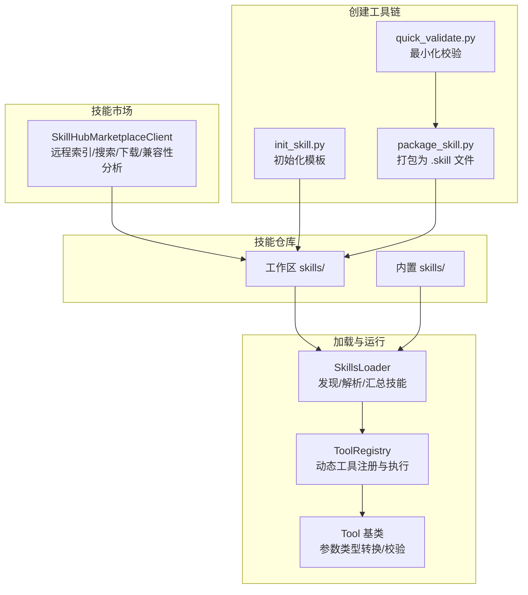
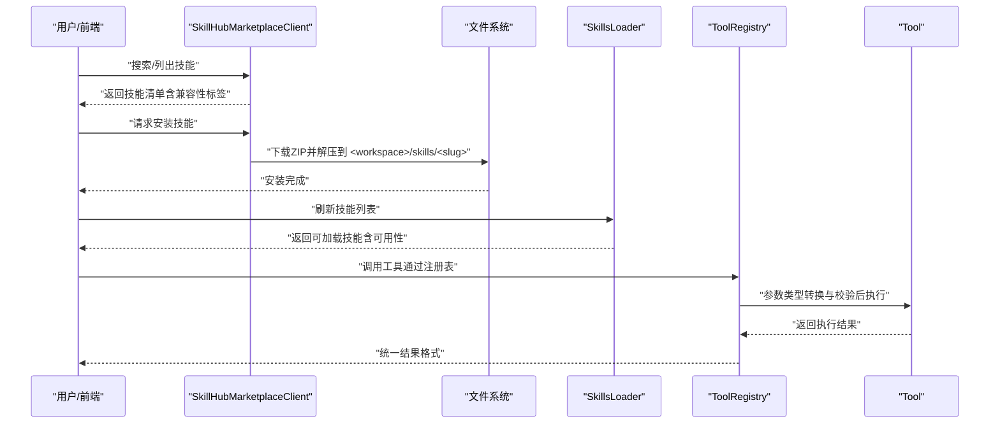
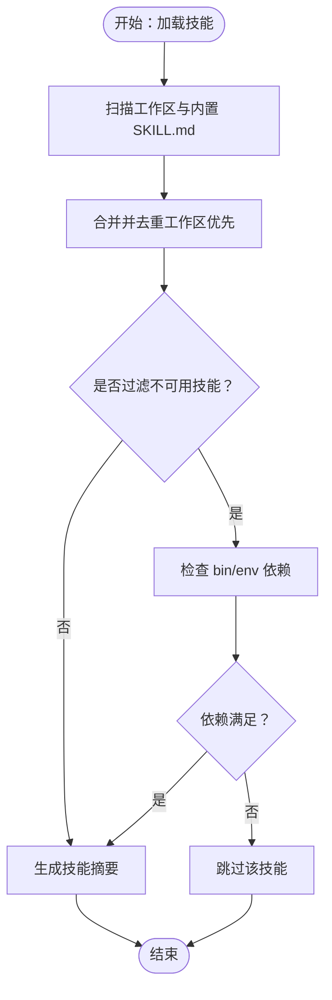
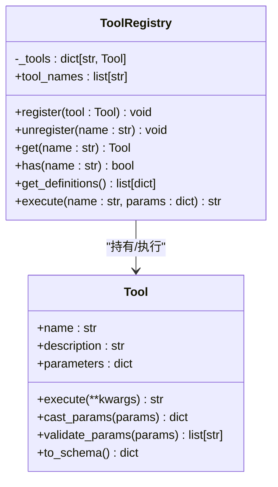
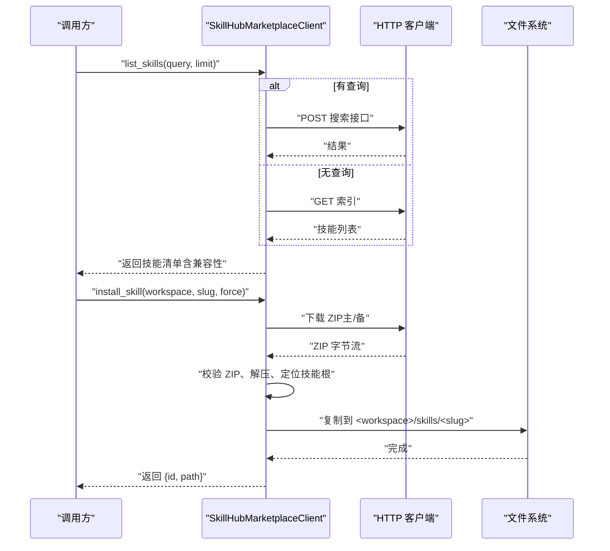
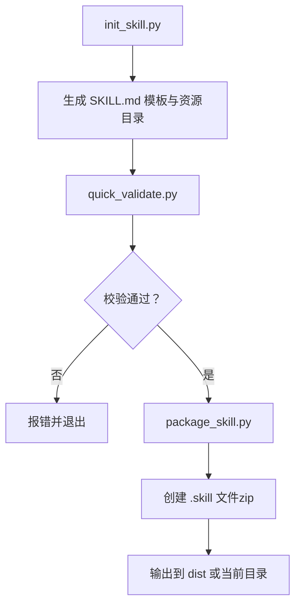
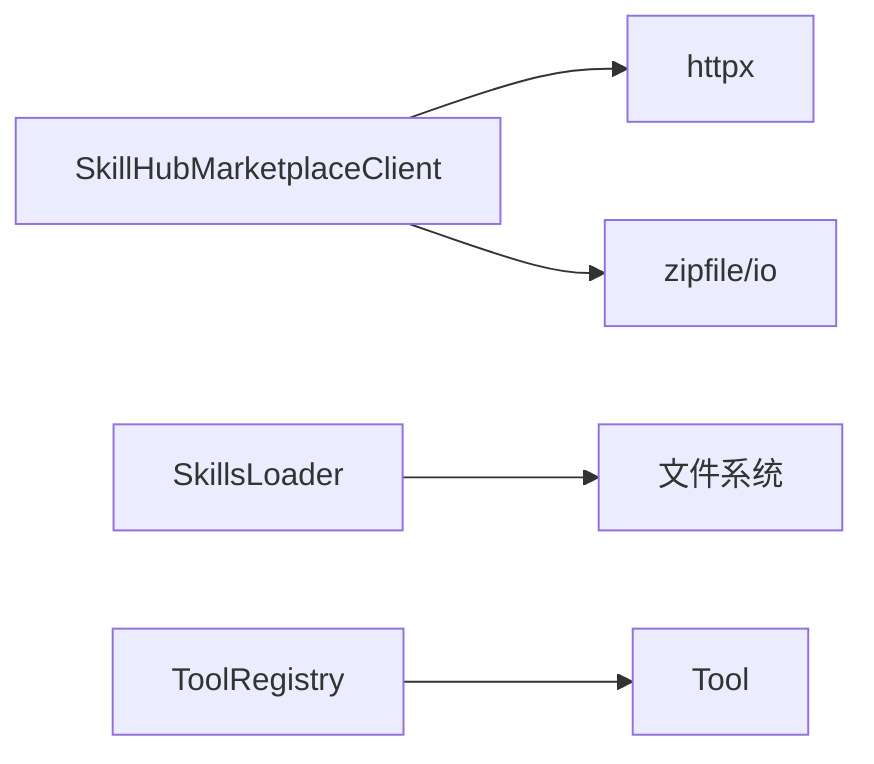

# 技能系统

<cite>
**本文引用的文件**
- [nanobot/skills/README.md](file://nanobot/skills/README.md)
- [nanobot/services/skillhub_marketplace.py](file://nanobot/services/skillhub_marketplace.py)
- [nanobot/agent/skills.py](file://nanobot/agent/skills.py)
- [nanobot/agent/tools/registry.py](file://nanobot/agent/tools/registry.py)
- [nanobot/agent/tools/base.py](file://nanobot/agent/tools/base.py)
- [nanobot/skills/skill-creator/SKILL.md](file://nanobot/skills/skill-creator/SKILL.md)
- [nanobot/skills/skill-creator/scripts/init_skill.py](file://nanobot/skills/skill-creator/scripts/init_skill.py)
- [nanobot/skills/skill-creator/scripts/package_skill.py](file://nanobot/skills/skill-creator/scripts/package_skill.py)
- [nanobot/skills/skill-creator/scripts/quick_validate.py](file://nanobot/skills/skill-creator/scripts/quick_validate.py)
- [nanobot/skills/github/SKILL.md](file://nanobot/skills/github/SKILL.md)
- [nanobot/skills/weather/SKILL.md](file://nanobot/skills/weather/SKILL.md)
- [nanobot/skills/summarize/SKILL.md](file://nanobot/skills/summarize/SKILL.md)
</cite>

## 目录
1. [简介](#简介)
2. [项目结构](#项目结构)
3. [核心组件](#核心组件)
4. [架构总览](#架构总览)
5. [详细组件分析](#详细组件分析)
6. [依赖分析](#依赖分析)
7. [性能考虑](#性能考虑)
8. [故障排查指南](#故障排查指南)
9. [结论](#结论)
10. [附录](#附录)

## 简介
本文件面向 Nanobot 技能系统的开发者与运维人员，系统化阐述技能市场集成、技能安装与管理机制、技能开发规范与模板、打包发布流程、兼容性检查与版本管理、以及技能与代理引擎的集成与运行时行为。文档同时提供可操作的开发示例与最佳实践建议，帮助团队高效构建与维护高质量技能。

## 项目结构
Nanobot 技能系统由“技能仓库（skills）”“技能加载器（SkillsLoader）”“技能市场客户端（SkillHubMarketplaceClient）”“工具注册表（ToolRegistry）”“工具基类（Tool）”以及“技能创建工具链（init_skill.py、quick_validate.py、package_skill.py）”构成。技能以 SKILL.md 为核心契约，配合可选的 scripts/、references/、assets/ 资源目录，形成模块化的知识与自动化能力包。

图示来源
- [nanobot/agent/skills.py:13-229](file://nanobot/agent/skills.py#L13-L229)
- [nanobot/agent/tools/registry.py:8-71](file://nanobot/agent/tools/registry.py#L8-L71)
- [nanobot/agent/tools/base.py:7-182](file://nanobot/agent/tools/base.py#L7-L182)
- [nanobot/services/skillhub_marketplace.py:87-465](file://nanobot/services/skillhub_marketplace.py#L87-L465)
- [nanobot/skills/skill-creator/scripts/init_skill.py:1-379](file://nanobot/skills/skill-creator/scripts/init_skill.py#L1-L379)
- [nanobot/skills/skill-creator/scripts/quick_validate.py:1-214](file://nanobot/skills/skill-creator/scripts/quick_validate.py#L1-L214)
- [nanobot/skills/skill-creator/scripts/package_skill.py:1-155](file://nanobot/skills/skill-creator/scripts/package_skill.py#L1-L155)

章节来源
- [nanobot/skills/README.md:1-38](file://nanobot/skills/README.md#L1-L38)
- [nanobot/agent/skills.py:13-229](file://nanobot/agent/skills.py#L13-L229)
- [nanobot/services/skillhub_marketplace.py:87-465](file://nanobot/services/skillhub_marketplace.py#L87-L465)

## 核心组件
- 技能加载器（SkillsLoader）
  - 负责在工作区与内置目录中发现 SKILL.md，解析元数据，构建技能摘要，并按需加载技能正文。
  - 支持“总是可用”的技能筛选与环境要求检查（如外部二进制、环境变量）。
- 工具注册表（ToolRegistry）
  - 动态注册与执行工具，统一参数类型转换与校验，输出标准化结果。
- 工具基类（Tool）
  - 定义工具抽象接口与参数 JSON Schema 驱动的类型转换/校验逻辑。
- 技能市场客户端（SkillHubMarketplaceClient）
  - 提供远程技能索引查询、关键词搜索、下载与解压、兼容性分析（原生/部分兼容/不建议安装/待验证）。
- 技能创建工具链
  - 初始化模板（init_skill.py）、最小化校验（quick_validate.py）、打包（package_skill.py）。

章节来源
- [nanobot/agent/skills.py:13-229](file://nanobot/agent/skills.py#L13-L229)
- [nanobot/agent/tools/registry.py:8-71](file://nanobot/agent/tools/registry.py#L8-L71)
- [nanobot/agent/tools/base.py:7-182](file://nanobot/agent/tools/base.py#L7-L182)
- [nanobot/services/skillhub_marketplace.py:87-465](file://nanobot/services/skillhub_marketplace.py#L87-L465)
- [nanobot/skills/skill-creator/scripts/init_skill.py:1-379](file://nanobot/skills/skill-creator/scripts/init_skill.py#L1-L379)
- [nanobot/skills/skill-creator/scripts/quick_validate.py:1-214](file://nanobot/skills/skill-creator/scripts/quick_validate.py#L1-L214)
- [nanobot/skills/skill-creator/scripts/package_skill.py:1-155](file://nanobot/skills/skill-creator/scripts/package_skill.py#L1-L155)

## 架构总览
技能系统围绕“发现—解析—加载—执行—市场集成—创建发布”闭环展开。工作区 skills/ 优先级高于内置 skills/；加载器负责将技能内容注入代理上下文；工具注册表承载具体可执行能力；技能市场提供远程发现与安装；创建工具链保障技能质量与分发。

图示来源
- [nanobot/services/skillhub_marketplace.py:106-161](file://nanobot/services/skillhub_marketplace.py#L106-L161)
- [nanobot/agent/skills.py:26-100](file://nanobot/agent/skills.py#L26-L100)
- [nanobot/agent/tools/registry.py:38-59](file://nanobot/agent/tools/registry.py#L38-L59)

## 详细组件分析

### 技能加载与运行时行为（SkillsLoader）
- 发现顺序：工作区 skills/ > 内置 skills/；同名覆盖规则以工作区优先。
- 元数据解析：支持 YAML frontmatter，提取 name、description、metadata（兼容 nanobot/openclaw 键），并解析 requires（bin、env）。
- 摘要生成：build_skills_summary 输出 XML 结构，包含技能可用性与缺失依赖提示。
- 上下文注入：load_skills_for_context 将触发技能的正文内容拼接后注入代理上下文，遵循“先元数据、再正文、最后按需资源”的渐进披露原则。

图示来源
- [nanobot/agent/skills.py:26-141](file://nanobot/agent/skills.py#L26-L141)

章节来源
- [nanobot/agent/skills.py:13-229](file://nanobot/agent/skills.py#L13-L229)

### 工具注册与执行（ToolRegistry 与 Tool）
- 注册表职责：注册/注销工具、按名称获取定义（OpenAI Function Schema）、执行工具并处理异常与参数校验。
- 工具基类：提供参数类型映射、字符串/布尔/整数/数值/数组/对象的类型转换与 JSON Schema 校验，确保输入安全与一致性。

图示来源
- [nanobot/agent/tools/base.py:7-182](file://nanobot/agent/tools/base.py#L7-L182)
- [nanobot/agent/tools/registry.py:8-71](file://nanobot/agent/tools/registry.py#L8-L71)

章节来源
- [nanobot/agent/tools/base.py:7-182](file://nanobot/agent/tools/base.py#L7-L182)
- [nanobot/agent/tools/registry.py:8-71](file://nanobot/agent/tools/registry.py#L8-L71)

### 技能市场集成（SkillHubMarketplaceClient）
- 远程能力：索引查询、关键词搜索、多源下载（主/备）、ZIP 校验与解压。
- 兼容性分析：基于 SKILL.md 存在性、归档路径与文本规则判断“原生/部分兼容/不建议安装/待验证”，并缓存结果。
- 安装流程：规范化技能 ID、目标目录创建、下载与解压、强制覆盖控制、返回安装结果。

图示来源
- [nanobot/services/skillhub_marketplace.py:106-161](file://nanobot/services/skillhub_marketplace.py#L106-L161)
- [nanobot/services/skillhub_marketplace.py:207-232](file://nanobot/services/skillhub_marketplace.py#L207-L232)
- [nanobot/services/skillhub_marketplace.py:347-414](file://nanobot/services/skillhub_marketplace.py#L347-L414)

章节来源
- [nanobot/services/skillhub_marketplace.py:87-465](file://nanobot/services/skillhub_marketplace.py#L87-L465)

### 技能开发规范与模板（skill-creator）
- 触发描述优先：frontmatter 的 description 是触发关键，应明确“何时使用此技能”。
- 渐进披露：SKILL.md 正文按需加载，参考文件与脚本仅在需要时读取。
- 资源组织：scripts/（可执行代码）、references/（参考文档）、assets/（输出资源）三类资源按需组织。
- 创建流程：理解场景 → 规划资源 → 初始化模板 → 编辑 SKILL.md 与资源 → 打包 → 迭代优化。

章节来源
- [nanobot/skills/skill-creator/SKILL.md:1-375](file://nanobot/skills/skill-creator/SKILL.md#L1-L375)

### 技能创建工具链
- 初始化脚本（init_skill.py）
  - 规范化技能名（小写连字符）、生成 SKILL.md 模板、可选创建 scripts/references/assets 示例。
- 最小化校验（quick_validate.py）
  - 校验 frontmatter 结构与字段、技能名与目录一致、不允许意外文件/目录、禁止符号链接。
- 打包脚本（package_skill.py）
  - 自动调用校验、排除隐藏目录、拒绝符号链接、打包为 .skill（zip）文件，输出至指定目录。

图示来源
- [nanobot/skills/skill-creator/scripts/init_skill.py:255-317](file://nanobot/skills/skill-creator/scripts/init_skill.py#L255-L317)
- [nanobot/skills/skill-creator/scripts/quick_validate.py:132-203](file://nanobot/skills/skill-creator/scripts/quick_validate.py#L132-L203)
- [nanobot/skills/skill-creator/scripts/package_skill.py:36-127](file://nanobot/skills/skill-creator/scripts/package_skill.py#L36-L127)

章节来源
- [nanobot/skills/skill-creator/scripts/init_skill.py:1-379](file://nanobot/skills/skill-creator/scripts/init_skill.py#L1-L379)
- [nanobot/skills/skill-creator/scripts/quick_validate.py:1-214](file://nanobot/skills/skill-creator/scripts/quick_validate.py#L1-L214)
- [nanobot/skills/skill-creator/scripts/package_skill.py:1-155](file://nanobot/skills/skill-creator/scripts/package_skill.py#L1-L155)

### 兼容性检查与版本管理
- 兼容性标签：原生可用、部分兼容、不建议安装、待验证。主要依据 SKILL.md 存在性、归档路径与文本规则。
- 版本管理：技能市场返回 version、updatedAt、downloads 等信息；安装时以 slug 作为稳定标识，支持 force 覆盖。
- 更新机制：通过重新安装同一 slug 获取最新版本；若市场未提供版本号，以 updatedAt 作为排序权重之一。

章节来源
- [nanobot/services/skillhub_marketplace.py:25-80](file://nanobot/services/skillhub_marketplace.py#L25-L80)
- [nanobot/services/skillhub_marketplace.py:262-291](file://nanobot/services/skillhub_marketplace.py#L262-L291)
- [nanobot/services/skillhub_marketplace.py:133-140](file://nanobot/services/skillhub_marketplace.py#L133-L140)

### 技能与代理引擎的集成
- 技能发现与上下文注入：SkillsLoader 在构建技能摘要与按需加载时，将技能内容注入代理上下文，实现“按需加载、按需执行”。
- 工具执行：ToolRegistry 统一管理工具生命周期，执行前进行参数类型转换与校验，避免运行期错误。
- 运行时行为：技能本身不直接执行工具，而是通过工具注册表与工具基类提供的能力实现自动化任务。

章节来源
- [nanobot/agent/skills.py:82-100](file://nanobot/agent/skills.py#L82-L100)
- [nanobot/agent/tools/registry.py:38-59](file://nanobot/agent/tools/registry.py#L38-L59)
- [nanobot/agent/tools/base.py:55-131](file://nanobot/agent/tools/base.py#L55-L131)

## 依赖分析
- 组件内聚与耦合
  - SkillsLoader 与 ToolRegistry 解耦：前者专注技能发现与内容管理，后者专注工具执行与参数校验。
  - SkillHubMarketplaceClient 与文件系统交互：下载、校验、解压、复制，保持对外部服务的低耦合。
- 外部依赖
  - httpx：用于远程索引与下载。
  - zipfile/io：用于归档校验与解压。
  - yaml（可选）：用于 frontmatter 解析；无依赖时采用简单解析器。

图示来源
- [nanobot/services/skillhub_marketplace.py:13-13](file://nanobot/services/skillhub_marketplace.py#L13-L13)
- [nanobot/agent/skills.py:1-10](file://nanobot/agent/skills.py#L1-L10)
- [nanobot/agent/tools/registry.py:3-6](file://nanobot/agent/tools/registry.py#L3-L6)

章节来源
- [nanobot/services/skillhub_marketplace.py:13-13](file://nanobot/services/skillhub_marketplace.py#L13-L13)
- [nanobot/agent/skills.py:1-10](file://nanobot/agent/skills.py#L1-L10)
- [nanobot/agent/tools/registry.py:3-6](file://nanobot/agent/tools/registry.py#L3-L6)

## 性能考虑
- 渐进披露：SKILL.md 正文与资源按需加载，减少上下文窗口占用，提升响应效率。
- 缓存策略：兼容性分析结果缓存于内存字典，降低重复请求成本。
- I/O 优化：打包阶段排除隐藏目录与符号链接，保证归档确定性与安全性；解压阶段进行路径安全检查，避免目录穿越风险。
- 参数校验：在工具执行前进行类型转换与校验，尽早失败，减少无效调用。

## 故障排查指南
- 技能未显示或不可用
  - 检查 SKILL.md 是否存在且 frontmatter 合法；确认 name 与目录名一致。
  - 检查 requires 中的外部二进制与环境变量是否满足。
- 安装失败
  - 归档非 ZIP 或包含多个 SKILL.md；检查下载源与归档完整性。
  - 归档路径包含受限制的 hooks 或配置目录，导致“不建议安装”或“部分兼容”。
- 打包失败
  - 包含符号链接或输出路径位于技能根内；移除符号链接并更换输出目录。
- 工具执行异常
  - 参数类型不符或缺失必填项；根据 Tool 的 JSON Schema 修正参数。

章节来源
- [nanobot/agent/skills.py:142-152](file://nanobot/agent/skills.py#L142-L152)
- [nanobot/services/skillhub_marketplace.py:347-414](file://nanobot/services/skillhub_marketplace.py#L347-L414)
- [nanobot/skills/skill-creator/scripts/package_skill.py:88-109](file://nanobot/skills/skill-creator/scripts/package_skill.py#L88-L109)
- [nanobot/agent/tools/base.py:124-170](file://nanobot/agent/tools/base.py#L124-L170)

## 结论
Nanobot 技能系统以 SKILL.md 为契约，结合渐进披露与工具注册表，实现了“可发现、可加载、可执行”的能力扩展框架。通过 SkillHub 市场客户端与创建工具链，团队可以高效地发现、安装、验证与发布技能，确保质量与一致性。建议在实际落地中严格遵循开发规范、使用创建工具链进行质量把关，并持续关注兼容性标签与运行时依赖，以获得稳定的技能体验。

## 附录
- 开发示例
  - GitHub 技能：展示如何在 SKILL.md 中声明外部依赖与安装指引。
  - 天气技能：展示如何通过 curl 获取公开天气服务数据。
  - 摘要技能：展示如何通过命令行工具进行内容摘要与转录。
- 最佳实践
  - 触发描述优先：frontmatter 的 description 应清晰表达“何时使用此技能”。
  - 渐进披露：将复杂细节放入 references/，脚本放入 scripts/，资源放入 assets/。
  - 质量保障：使用 quick_validate.py 与 package_skill.py 保证结构与打包安全。
  - 兼容性优先：避免依赖 SkillHub hooks 或其他平台专属配置，确保“原生可用”。

章节来源
- [nanobot/skills/github/SKILL.md:1-49](file://nanobot/skills/github/SKILL.md#L1-L49)
- [nanobot/skills/weather/SKILL.md:1-50](file://nanobot/skills/weather/SKILL.md#L1-L50)
- [nanobot/skills/summarize/SKILL.md:1-68](file://nanobot/skills/summarize/SKILL.md#L1-L68)
- [nanobot/skills/skill-creator/SKILL.md:1-375](file://nanobot/skills/skill-creator/SKILL.md#L1-L375)