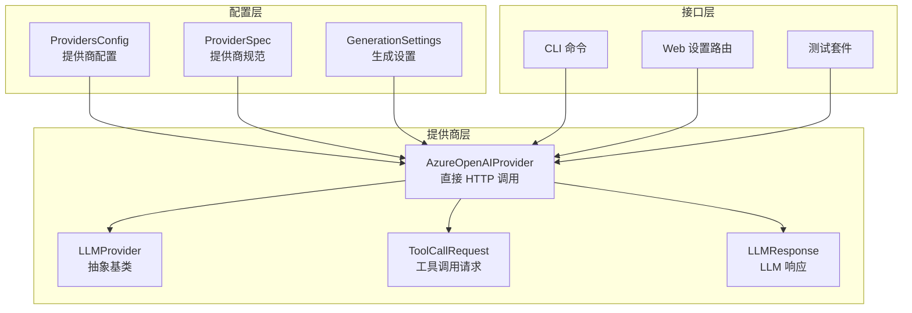
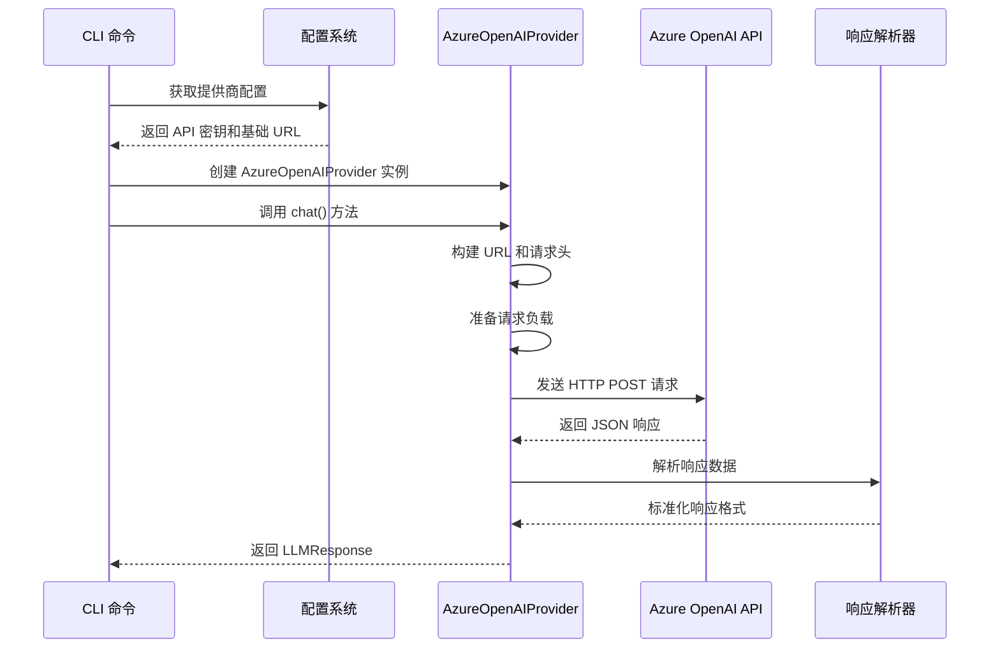
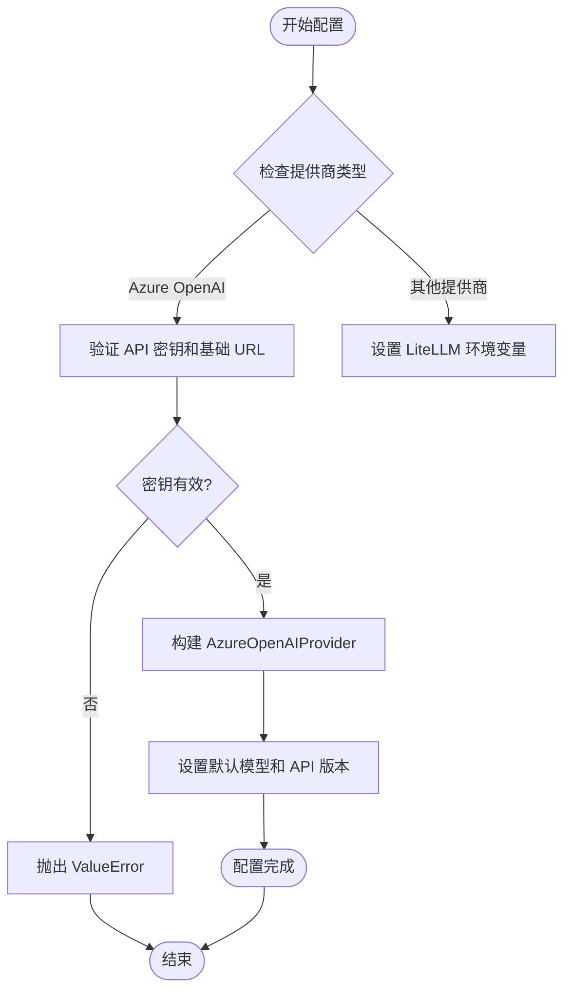
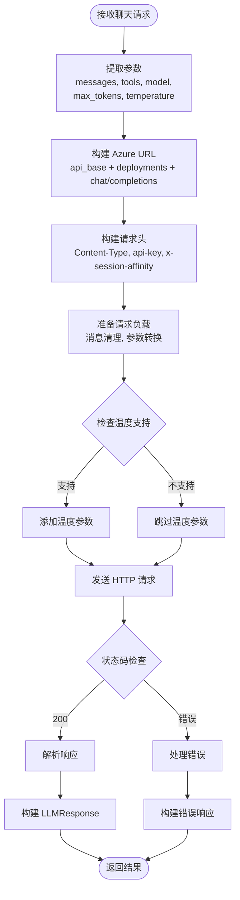
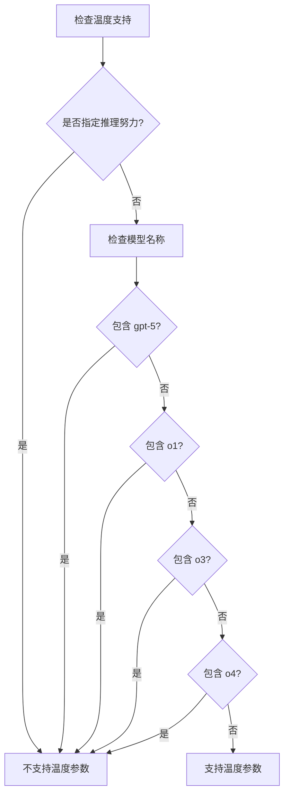
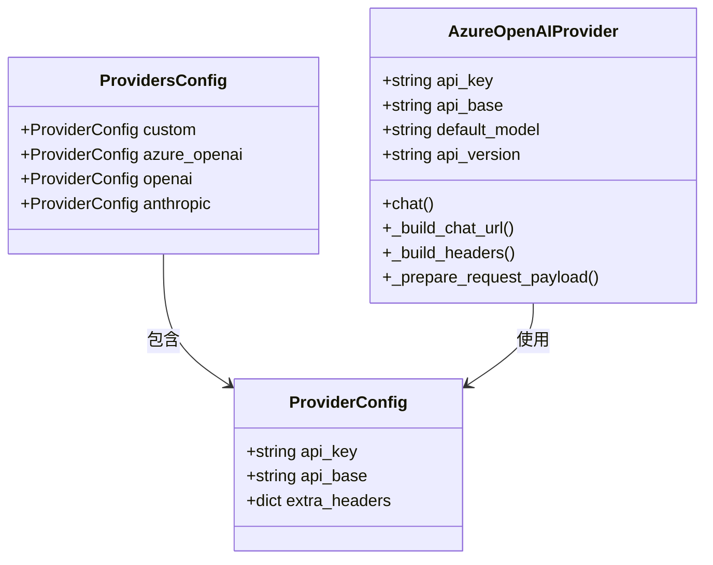
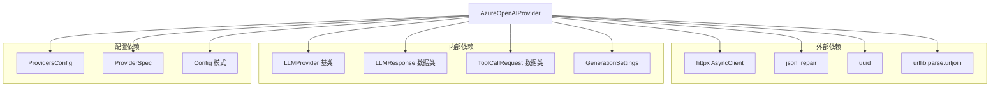

# Azure OpenAI 提供商

<cite>
**本文档引用的文件**
- [azure_openai_provider.py](file://nanobot/providers/azure_openai_provider.py)
- [base.py](file://nanobot/providers/base.py)
- [registry.py](file://nanobot/providers/registry.py)
- [schema.py](file://nanobot/config/schema.py)
- [commands.py](file://nanobot/cli/commands.py)
- [setup.py](file://nanobot/web/routers/setup.py)
- [test_azure_openai_provider.py](file://tests/test_azure_openai_provider.py)
</cite>

## 目录
1. [简介](#简介)
2. [项目结构](#项目结构)
3. [核心组件](#核心组件)
4. [架构概览](#架构概览)
5. [详细组件分析](#详细组件分析)
6. [依赖关系分析](#依赖关系分析)
7. [性能考虑](#性能考虑)
8. [故障排除指南](#故障排除指南)
9. [结论](#结论)
10. [附录](#附录)

## 简介

Azure OpenAI 提供商是 nanobot 框架中的一个直接 API 调用实现，专门用于与 Azure OpenAI 服务进行交互。该实现遵循 Azure OpenAI API 版本 2024-10-21 规范，提供了完整的认证、请求构建、响应解析和错误处理功能。

Azure OpenAI 是微软 Azure 平台上的托管 OpenAI 兼容服务，允许用户通过 Azure 订阅访问 OpenAI 模型。与标准 OpenAI API 不同，Azure OpenAI 使用不同的认证机制、URL 结构和参数格式。

## 项目结构

Azure OpenAI 提供商在 nanobot 项目中的组织结构如下：



**图表来源**
- [azure_openai_provider.py:17-213](file://nanobot/providers/azure_openai_provider.py#L17-L213)
- [base.py:69-271](file://nanobot/providers/base.py#L69-L271)
- [registry.py:19-91](file://nanobot/providers/registry.py#L19-L91)

**章节来源**
- [azure_openai_provider.py:1-213](file://nanobot/providers/azure_openai_provider.py#L1-L213)
- [base.py:1-271](file://nanobot/providers/base.py#L1-L271)
- [registry.py:1-466](file://nanobot/providers/registry.py#L1-L466)

## 核心组件

### AzureOpenAIProvider 类

AzureOpenAIProvider 是主要的提供商实现，继承自 LLMProvider 抽象基类。它实现了以下关键功能：

- **API 版本兼容性**: 硬编码支持 Azure OpenAI API 版本 2024-10-21
- **认证机制**: 使用专用的 api-key 头部而非标准的 Authorization Bearer
- **部署名称映射**: 将模型标识符作为 Azure 部署名称使用
- **参数转换**: 将 max_tokens 映射到 max_completion_tokens
- **直接 HTTP 调用**: 绕过 LiteLLM，直接与 Azure API 通信

### 认证机制

Azure OpenAI 使用独特的认证方式：
- **API 密钥头部**: 使用 `api-key` 而非 `Authorization: Bearer`
- **必需参数**: 同时需要 API 密钥和 API 基础 URL
- **会话亲和性**: 添加 `x-session-affinity` 头部以改善缓存效果

### 请求构建

提供商负责构建符合 Azure OpenAI 规范的请求：
- **URL 结构**: `{api_base}/openai/deployments/{deployment}/chat/completions?api-version={version}`
- **消息清理**: 移除不支持的消息键并标准化内容格式
- **工具调用**: 支持 OpenAI 格式的工具定义和调用

**章节来源**
- [azure_openai_provider.py:17-213](file://nanobot/providers/azure_openai_provider.py#L17-L213)
- [base.py:69-271](file://nanobot/providers/base.py#L69-L271)

## 架构概览

Azure OpenAI 提供商在整个系统中的位置和交互关系：



**图表来源**
- [commands.py:237-248](file://nanobot/cli/commands.py#L237-L248)
- [azure_openai_provider.py:114-162](file://nanobot/providers/azure_openai_provider.py#L114-L162)

## 详细组件分析

### 认证和配置管理

Azure OpenAI 提供商的配置和认证流程：



**图表来源**
- [azure_openai_provider.py:29-48](file://nanobot/providers/azure_openai_provider.py#L29-L48)
- [commands.py:237-248](file://nanobot/cli/commands.py#L237-L248)

### 请求处理流程

Azure OpenAI 请求的完整处理流程：



**图表来源**
- [azure_openai_provider.py:50-162](file://nanobot/providers/azure_openai_provider.py#L50-L162)

### 温度参数支持策略

Azure OpenAI 对温度参数的支持有特定限制：



**图表来源**
- [azure_openai_provider.py:72-82](file://nanobot/providers/azure_openai_provider.py#L72-L82)

**章节来源**
- [azure_openai_provider.py:17-213](file://nanobot/providers/azure_openai_provider.py#L17-L213)
- [test_azure_openai_provider.py:113-151](file://tests/test_azure_openai_provider.py#L113-L151)

### 配置系统集成

Azure OpenAI 提供商与配置系统的集成：

| 配置项 | 类型 | 描述 | 默认值 |
|--------|------|------|--------|
| `providers.azure_openai.api_key` | 字符串 | Azure OpenAI API 密钥 | 空字符串 |
| `providers.azure_openai.api_base` | 字符串 | Azure OpenAI 基础 URL | None |
| `providers.azure_openai.extra_headers` | 字典 | 自定义请求头 | None |

配置加载和验证流程：



**图表来源**
- [schema.py:259-289](file://nanobot/config/schema.py#L259-L289)
- [azure_openai_provider.py:29-48](file://nanobot/providers/azure_openai_provider.py#L29-L48)

**章节来源**
- [schema.py:259-289](file://nanobot/config/schema.py#L259-L289)
- [registry.py:83-91](file://nanobot/providers/registry.py#L83-L91)

## 依赖关系分析

Azure OpenAI 提供商的依赖关系图：



**图表来源**
- [azure_openai_provider.py:1-12](file://nanobot/providers/azure_openai_provider.py#L1-L12)
- [base.py:12-98](file://nanobot/providers/base.py#L12-L98)

### 关键依赖特性

1. **HTTP 客户端**: 使用 httpx 进行异步 HTTP 请求
2. **JSON 修复**: 使用 json_repair 处理可能损坏的 JSON
3. **UUID 生成**: 生成会话亲和性标识符
4. **URL 构建**: 使用 urllib.parse.urljoin 构建正确的 API URL

**章节来源**
- [azure_openai_provider.py:1-12](file://nanobot/providers/azure_openai_provider.py#L1-L12)
- [base.py:69-98](file://nanobot/providers/base.py#L69-L98)

## 性能考虑

### 连接和超时设置

Azure OpenAI 提供商使用以下性能优化设置：
- **超时时间**: 60 秒（可配置）
- **SSL 验证**: 启用 SSL 验证确保安全连接
- **异步调用**: 使用 httpx.AsyncClient 进行非阻塞网络请求

### 缓存和亲和性

- **会话亲和性**: 通过 `x-session-affinity` 头部实现缓存局部性
- **部署名称**: 使用模型作为部署名称，便于 Azure 平台的资源管理和缓存

### 错误处理和重试

虽然 AzureOpenAIProvider 直接调用 API，但基础类提供了通用的错误处理机制：
- **瞬态错误检测**: 自动识别 429、500、503 等临时错误
- **指数退避重试**: 最多重试 3 次，延迟分别为 1、2、4 秒

## 故障排除指南

### 常见配置问题

1. **缺少 API 密钥或基础 URL**
   - 错误信息: "Azure OpenAI api_key is required" 或 "Azure OpenAI api_base is required"
   - 解决方案: 在配置文件中正确设置 `providers.azure_openai.api_key` 和 `providers.azure_openai.api_base`

2. **部署名称无效**
   - 错误信息: Azure API 返回 404 或 400 错误
   - 解决方案: 确认 Azure 门户中的部署名称与配置中的模型名称完全匹配

3. **认证失败**
   - 错误信息: "Azure OpenAI API Error 401"
   - 解决方案: 验证 API 密钥格式和权限范围

### 调试技巧

1. **启用详细日志**: 在 CLI 中使用 `--verbose` 选项获取更多调试信息
2. **检查网络连接**: 确保能够访问 Azure OpenAI 服务端点
3. **验证请求格式**: 使用测试套件验证请求构建逻辑

**章节来源**
- [test_azure_openai_provider.py:25-34](file://tests/test_azure_openai_provider.py#L25-L34)
- [test_azure_openai_provider.py:293-317](file://tests/test_azure_openai_provider.py#L293-L317)

## 结论

Azure OpenAI 提供商为 nanobot 框架提供了完整的 Azure OpenAI 服务集成。其设计特点包括：

1. **严格的 API 兼容性**: 完全遵循 Azure OpenAI API 版本 2024-10-21 规范
2. **直接调用优势**: 绕过中间层，提供更可控的 API 交互
3. **完善的错误处理**: 包含全面的错误检测和恢复机制
4. **灵活的配置系统**: 支持多种配置方式和环境变量

该实现为用户提供了与 Azure OpenAI 服务无缝集成的能力，同时保持了与其他提供商的统一接口。

## 附录

### 集成示例

#### 基本配置示例

```json
{
  "providers": {
    "azure_openai": {
      "apiKey": "your-azure-openai-api-key",
      "apiBase": "https://your-resource.openai.azure.com/",
      "extraHeaders": null
    }
  },
  "agents": {
    "defaults": {
      "provider": "azure_openai",
      "model": "your-deployment-name"
    }
  }
}
```

#### 环境变量配置

虽然 Azure OpenAI 提供商不依赖环境变量，但可以通过以下方式设置：

- **API 密钥**: 在配置文件中设置 `providers.azure_openai.apiKey`
- **API 基础 URL**: 在配置文件中设置 `providers.azure_openai.apiBase`

#### 高级模型支持

Azure OpenAI 提供商支持多种模型类型：

- **GPT-4 系列**: gpt-4o、gpt-4-turbo 等
- **GPT-3.5 系列**: gpt-35-turbo 等
- **推理模型**: 支持 reasoning_effort 参数的推理模型

**章节来源**
- [commands.py:237-248](file://nanobot/cli/commands.py#L237-L248)
- [setup.py:74-79](file://nanobot/web/routers/setup.py#L74-L79)