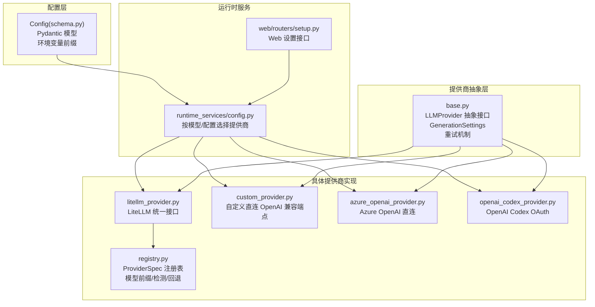
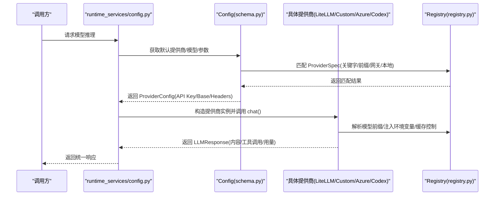
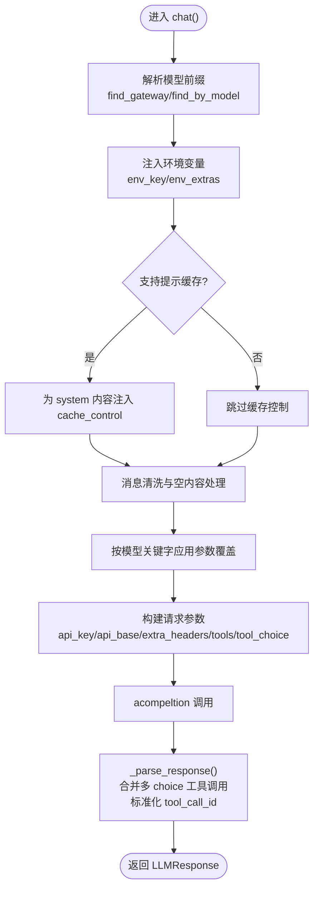
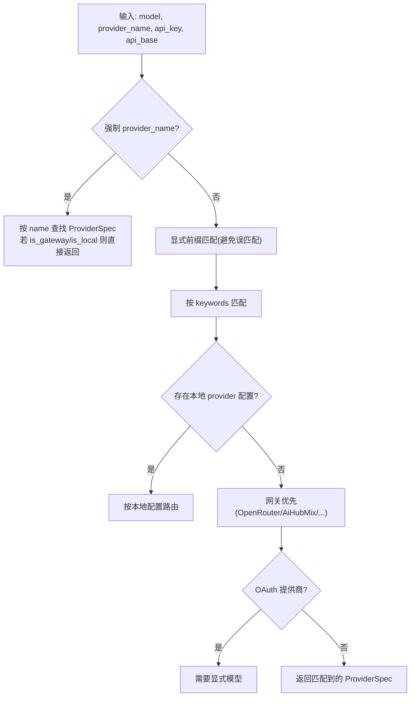
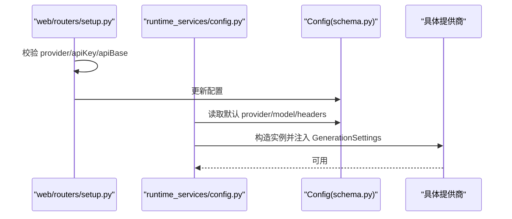
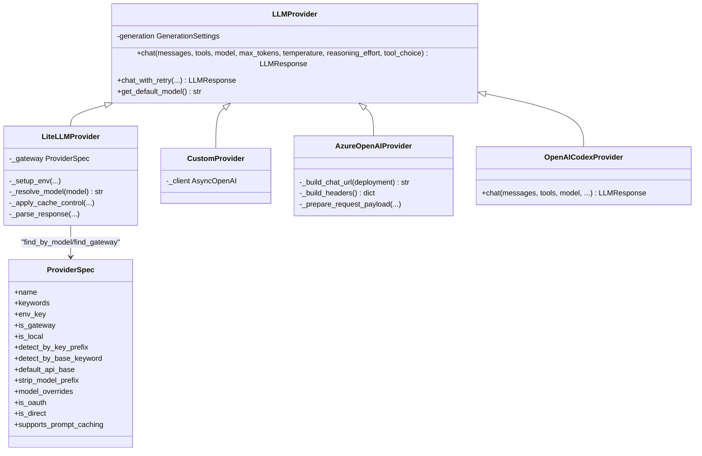

# LiteLLM 提供商

<cite>
**本文档引用的文件**
- [nanobot/providers/__init__.py](file://nanobot/providers/__init__.py)
- [nanobot/providers/base.py](file://nanobot/providers/base.py)
- [nanobot/providers/litellm_provider.py](file://nanobot/providers/litellm_provider.py)
- [nanobot/providers/registry.py](file://nanobot/providers/registry.py)
- [nanobot/providers/custom_provider.py](file://nanobot/providers/custom_provider.py)
- [nanobot/providers/openai_codex_provider.py](file://nanobot/providers/openai_codex_provider.py)
- [nanobot/providers/azure_openai_provider.py](file://nanobot/providers/azure_openai_provider.py)
- [nanobot/providers/transcription.py](file://nanobot/providers/transcription.py)
- [nanobot/config/schema.py](file://nanobot/config/schema.py)
- [nanobot/web/runtime_services/config.py](file://nanobot/web/runtime_services/config.py)
- [nanobot/web/routers/setup.py](file://nanobot/web/routers/setup.py)
- [tests/test_provider_retry.py](file://tests/test_provider_retry.py)
- [tests/test_gemini_thought_signature.py](file://tests/test_gemini_thought_signature.py)
</cite>

## 目录
1. [简介](#简介)
2. [项目结构](#项目结构)
3. [核心组件](#核心组件)
4. [架构总览](#架构总览)
5. [详细组件分析](#详细组件分析)
6. [依赖关系分析](#依赖关系分析)
7. [性能考虑](#性能考虑)
8. [故障排查指南](#故障排查指南)
9. [结论](#结论)
10. [附录](#附录)

## 简介
本文件面向 LiteLLM 提供商集成，系统性阐述统一接口设计理念与多提供商支持能力，详解配置方式、模型路由机制、支持提供商清单及各自配置方法，并提供集成示例、性能优化建议、缓存机制与负载均衡思路，以及多提供商切换与故障转移的实现方案。

## 项目结构
围绕提供商模块的核心目录与文件如下：
- providers：抽象与具体提供商实现（基础接口、LiteLLM 统一接口、自定义直连、Azure OpenAI、OAuth 提供商等）
- config：配置模式与解析逻辑（Pydantic 模型、环境变量前缀、自动匹配与回退策略）
- web/runtime_services：运行时根据配置选择具体提供商实例
- web/routers：Web 设置接口，用于配置提供商参数
- tests：重试机制与工具调用字段保留等行为验证

图表来源
- [nanobot/config/schema.py:351-449](file://nanobot/config/schema.py#L351-L449)
- [nanobot/web/runtime_services/config.py:38-77](file://nanobot/web/runtime_services/config.py#L38-L77)
- [nanobot/web/routers/setup.py:47-95](file://nanobot/web/routers/setup.py#L47-L95)
- [nanobot/providers/base.py:69-271](file://nanobot/providers/base.py#L69-L271)
- [nanobot/providers/litellm_provider.py:27-349](file://nanobot/providers/litellm_provider.py#L27-L349)
- [nanobot/providers/custom_provider.py:14-63](file://nanobot/providers/custom_provider.py#L14-L63)
- [nanobot/providers/azure_openai_provider.py:17-213](file://nanobot/providers/azure_openai_provider.py#L17-L213)
- [nanobot/providers/openai_codex_provider.py:20-318](file://nanobot/providers/openai_codex_provider.py#L20-L318)
- [nanobot/providers/registry.py:19-466](file://nanobot/providers/registry.py#L19-L466)

章节来源
- [nanobot/providers/__init__.py:1-9](file://nanobot/providers/__init__.py#L1-L9)
- [nanobot/providers/base.py:69-271](file://nanobot/providers/base.py#L69-L271)
- [nanobot/providers/registry.py:19-466](file://nanobot/providers/registry.py#L19-L466)

## 核心组件
- 抽象接口与通用能力
  - LLMProvider：定义统一的异步聊天接口、消息清洗、默认生成参数、重试策略与错误标记
  - GenerationSettings：温度、最大 token、推理努力度等默认值，可被调用方覆盖
- LiteLLM 统一接口
  - LiteLLMProvider：通过 LiteLLM 完成多提供商路由；负责模型名规范化、环境变量注入、工具调用标准化、缓存控制注入、响应解析与用量统计
- 注册表与路由
  - ProviderSpec：描述提供商元数据（名称、关键词、环境变量、是否网关/本地/OAuth、前缀策略、参数覆盖、默认 API 基址等）
  - find_by_model/find_gateway/find_by_name：基于模型关键字、配置键、API Key 前缀、API Base 关键词进行匹配与自动检测
- 直连与特殊提供商
  - CustomProvider：直接对接任意 OpenAI 兼容端点（可设置会话亲和头）
  - AzureOpenAIProvider：严格遵循 Azure API 版本规范（2024-10-21），使用 api-key 头、max_completion_tokens、部署名作为路径参数
  - OpenAICodexProvider：OAuth 流程调用 Responses API，支持 SSE 流式输出与工具调用
- 配置与运行时选择
  - Config：提供模型/提供商匹配、API Key/API Base 解析、默认值回退策略
  - runtime_services/config.py：根据配置与模型选择具体提供商实例
  - web/routers/setup.py：Web 接口写入配置并校验必要参数

章节来源
- [nanobot/providers/base.py:69-271](file://nanobot/providers/base.py#L69-L271)
- [nanobot/providers/litellm_provider.py:27-349](file://nanobot/providers/litellm_provider.py#L27-L349)
- [nanobot/providers/registry.py:19-466](file://nanobot/providers/registry.py#L19-L466)
- [nanobot/providers/custom_provider.py:14-63](file://nanobot/providers/custom_provider.py#L14-L63)
- [nanobot/providers/azure_openai_provider.py:17-213](file://nanobot/providers/azure_openai_provider.py#L17-L213)
- [nanobot/providers/openai_codex_provider.py:20-318](file://nanobot/providers/openai_codex_provider.py#L20-L318)
- [nanobot/config/schema.py:351-449](file://nanobot/config/schema.py#L351-L449)
- [nanobot/web/runtime_services/config.py:38-77](file://nanobot/web/runtime_services/config.py#L38-L77)
- [nanobot/web/routers/setup.py:47-95](file://nanobot/web/routers/setup.py#L47-L95)

## 架构总览
统一接口通过 LiteLLMProvider 实现“一个接口，多提供商路由”。注册表驱动模型前缀、环境变量注入与网关/本地检测；配置层决定 API Key、API Base 与额外请求头；运行时服务按模型与配置选择具体提供商实例。

图表来源
- [nanobot/web/runtime_services/config.py:38-77](file://nanobot/web/runtime_services/config.py#L38-L77)
- [nanobot/config/schema.py:365-447](file://nanobot/config/schema.py#L365-L447)
- [nanobot/providers/registry.py:407-466](file://nanobot/providers/registry.py#L407-L466)
- [nanobot/providers/litellm_provider.py:89-107](file://nanobot/providers/litellm_provider.py#L89-L107)

## 详细组件分析

### LiteLLMProvider 组件分析
- 设计理念
  - 通过 ProviderSpec 与 find_by_model/find_gateway 实现“零 if-elif”路由，避免硬编码分支
  - 支持网关（OpenRouter、AiHubMix、SiliconFlow、VolcEngine）、标准提供商（Anthropic、OpenAI、Gemini、DashScope、DeepSeek、Moonshot、MiniMax、Groq）与本地部署（vLLM、Ollama）
- 关键流程
  - 模型解析：优先网关模式（strip_model_prefix、litellm_prefix），否则按标准提供商自动加前缀
  - 环境变量注入：根据 ProviderSpec.env_key/env_extras 注入 API Key 与占位符替换后的额外环境变量
  - 缓存控制：针对支持提示缓存的提供商（如 Anthropic），在 system 内容块注入 cache_control
  - 工具调用：标准化 tool_call_id，合并多 choice 中的 tool_calls，修复参数 JSON 字符串
  - 参数覆盖：按模型关键字应用 per-model overrides
  - 错误处理：异常转为 LLMResponse，finish_reason="error"，便于上层优雅处理
- 适配差异
  - 不同提供商的消息键集合不同（如 Anthropic 支持 thinking_blocks），通过 _extra_msg_keys 保留扩展字段
  - 温度支持因部署而异（Azure 2024-10-21 对部分模型不支持 temperature）

图表来源
- [nanobot/providers/litellm_provider.py:89-107](file://nanobot/providers/litellm_provider.py#L89-L107)
- [nanobot/providers/litellm_provider.py:119-124](file://nanobot/providers/litellm_provider.py#L119-L124)
- [nanobot/providers/litellm_provider.py:126-150](file://nanobot/providers/litellm_provider.py#L126-L150)
- [nanobot/providers/litellm_provider.py:152-160](file://nanobot/providers/litellm_provider.py#L152-L160)
- [nanobot/providers/litellm_provider.py:180-207](file://nanobot/providers/litellm_provider.py#L180-L207)
- [nanobot/providers/litellm_provider.py:209-282](file://nanobot/providers/litellm_provider.py#L209-L282)
- [nanobot/providers/litellm_provider.py:283-344](file://nanobot/providers/litellm_provider.py#L283-L344)

章节来源
- [nanobot/providers/litellm_provider.py:27-349](file://nanobot/providers/litellm_provider.py#L27-L349)

### ProviderSpec 注册表与模型路由
- ProviderSpec 字段
  - identity：name、keywords、env_key、display_name
  - model prefixing：litellm_prefix、skip_prefixes
  - env_extras：额外环境变量（支持 {api_key}、{api_base} 占位符）
  - gateway/local：is_gateway、is_local、detect_by_key_prefix、detect_by_base_keyword、default_api_base、strip_model_prefix
  - model_overrides：按模型关键字覆盖参数
  - oauth/local：is_oauth、is_direct
  - cache_control：supports_prompt_caching
- 匹配与回退顺序
  - 强制指定 provider 名称优先
  - 显式前缀模型（如 github-copilot/...）优先于关键字匹配
  - 按 ProviderSpec.keywords 匹配模型关键字
  - 本地部署（Ollama/vLLM）在无关键字时仍可路由
  - 网关优先（OpenRouter、AiHubMix、SiliconFlow、VolcEngine）
  - OAuth 提供商需显式模型选择
- 自动检测
  - find_gateway：按 provider_name、api_key 前缀、api_base 关键词检测网关/本地

图表来源
- [nanobot/providers/registry.py:407-466](file://nanobot/providers/registry.py#L407-L466)
- [nanobot/config/schema.py:365-416](file://nanobot/config/schema.py#L365-L416)

章节来源
- [nanobot/providers/registry.py:19-466](file://nanobot/providers/registry.py#L19-L466)
- [nanobot/config/schema.py:365-416](file://nanobot/config/schema.py#L365-L416)

### 运行时提供商选择与配置
- Web 设置接口
  - 校验 provider 是否存在，校验自定义/azure_openai 必填项，写入 providers 下对应字段
- 运行时选择
  - 根据 provider_name 与配置构造具体提供商实例
  - LiteLLMProvider：传入 api_key、api_base、extra_headers、provider_name（用于网关/本地检测）
  - Custom/Azure/Codex：按需构造直连实例
- 默认参数注入
  - 将 Config.agents.defaults 的 temperature/max_tokens/reasoning_effort 注入提供商

图表来源
- [nanobot/web/routers/setup.py:47-95](file://nanobot/web/routers/setup.py#L47-L95)
- [nanobot/web/runtime_services/config.py:38-77](file://nanobot/web/runtime_services/config.py#L38-L77)
- [nanobot/config/schema.py:231-246](file://nanobot/config/schema.py#L231-L246)

章节来源
- [nanobot/web/routers/setup.py:47-95](file://nanobot/web/routers/setup.py#L47-L95)
- [nanobot/web/runtime_services/config.py:38-77](file://nanobot/web/runtime_services/config.py#L38-L77)
- [nanobot/config/schema.py:231-246](file://nanobot/config/schema.py#L231-L246)

### 直连与特殊提供商
- CustomProvider
  - 直接使用 OpenAI SDK，设置会话亲和头以提升后端缓存命中
  - 适用于任意 OpenAI 兼容端点（如本地 vLLM/Ollama）
- AzureOpenAIProvider
  - 使用 api-key 头，路径中以部署名为参数，max_completion_tokens 替代 max_tokens
  - 严格遵循 2024-10-21 版本语义，对部分模型不支持 temperature
- OpenAICodexProvider
  - OAuth 流程获取 token，调用 Responses API，支持 SSE 流式输出与工具调用
  - 支持提示缓存键计算与 SSL 证书失败降级重试

章节来源
- [nanobot/providers/custom_provider.py:14-63](file://nanobot/providers/custom_provider.py#L14-L63)
- [nanobot/providers/azure_openai_provider.py:17-213](file://nanobot/providers/azure_openai_provider.py#L17-L213)
- [nanobot/providers/openai_codex_provider.py:20-318](file://nanobot/providers/openai_codex_provider.py#L20-L318)

## 依赖关系分析

图表来源
- [nanobot/providers/base.py:69-271](file://nanobot/providers/base.py#L69-L271)
- [nanobot/providers/litellm_provider.py:27-349](file://nanobot/providers/litellm_provider.py#L27-L349)
- [nanobot/providers/custom_provider.py:14-63](file://nanobot/providers/custom_provider.py#L14-L63)
- [nanobot/providers/azure_openai_provider.py:17-213](file://nanobot/providers/azure_openai_provider.py#L17-L213)
- [nanobot/providers/openai_codex_provider.py:20-318](file://nanobot/providers/openai_codex_provider.py#L20-L318)
- [nanobot/providers/registry.py:19-66](file://nanobot/providers/registry.py#L19-L66)

章节来源
- [nanobot/providers/base.py:69-271](file://nanobot/providers/base.py#L69-L271)
- [nanobot/providers/litellm_provider.py:27-349](file://nanobot/providers/litellm_provider.py#L27-L349)
- [nanobot/providers/registry.py:19-66](file://nanobot/providers/registry.py#L19-L66)

## 性能考虑
- 重试与退避
  - LLMProvider.chat_with_retry 提供最多 3 次退避重试（1s、2s、4s），仅对“瞬时错误”标记进行重试
  - 测试覆盖了瞬时错误重试、非瞬时错误不重试、取消错误透传、默认参数继承与显式覆盖
- 工具调用与消息清洗
  - 自动清理空内容与无效文本块，避免 400 错误
  - 合并多 choice 的 tool_calls，避免丢失
- 会话亲和与缓存
  - CustomProvider 设置会话亲和头，有助于后端缓存命中
  - LiteLLMProvider 支持提示缓存（Anthropic 等），在 system 内容块注入 cache_control
- 参数覆盖与兼容性
  - ProviderSpec.model_overrides 为特定模型（如 Kimi K2.5）提供参数覆盖，减少调用失败
  - Azure 2024-10-21 版本特性（temperature 支持判定、max_completion_tokens）在直连实现中体现

章节来源
- [nanobot/providers/base.py:187-266](file://nanobot/providers/base.py#L187-L266)
- [tests/test_provider_retry.py:27-126](file://tests/test_provider_retry.py#L27-L126)
- [nanobot/providers/litellm_provider.py:119-124](file://nanobot/providers/litellm_provider.py#L119-L124)
- [nanobot/providers/custom_provider.py:16-24](file://nanobot/providers/custom_provider.py#L16-L24)
- [nanobot/providers/azure_openai_provider.py:73-82](file://nanobot/providers/azure_openai_provider.py#L73-L82)

## 故障排查指南
- 常见问题与定位
  - 瞬时错误未重试：确认错误内容包含瞬时错误标记（如 429、rate limit、500/502/503/504、overloaded、timeout、server error、temporarily unavailable）
  - 工具调用丢失：检查是否来自多 choice 的合并逻辑，或参数 JSON 字符串解析
  - Azure 温度不生效：确认部署名是否属于不支持 temperature 的模型族
  - Codex SSL 证书失败：库已内置降级重试（verify=False），若仍失败请检查网络与证书链
- 诊断步骤
  - 打开日志，观察 LiteLLM 调用与响应
  - 检查 ProviderSpec 是否正确匹配（关键字/前缀/网关/本地）
  - 核对 API Key/API Base/Extra Headers 是否正确注入
  - 使用 chat_with_retry 并观察重试次数与延迟

章节来源
- [nanobot/providers/base.py:187-266](file://nanobot/providers/base.py#L187-L266)
- [nanobot/providers/litellm_provider.py:273-282](file://nanobot/providers/litellm_provider.py#L273-L282)
- [nanobot/providers/azure_openai_provider.py:158-162](file://nanobot/providers/azure_openai_provider.py#L158-L162)
- [nanobot/providers/openai_codex_provider.py:64-81](file://nanobot/providers/openai_codex_provider.py#L64-L81)

## 结论
该提供商体系以统一接口为核心，通过 ProviderSpec 注册表与自动路由实现“一次接口，多提供商支持”。LiteLLMProvider 在统一抽象下完成模型前缀、环境变量、缓存控制与响应解析；直连与 OAuth 提供商满足特殊场景需求；配置层提供灵活的参数注入与回退策略。配合重试机制与工具调用合并，整体具备良好的稳定性与可扩展性。

## 附录

### 支持的提供商清单与配置要点
- 网关类（路由任意模型）
  - OpenRouter：API Key 前缀检测，支持提示缓存
  - AiHubMix：OpenAI 兼容接口，strip_model_prefix=True
  - SiliconFlow：OpenAI 兼容接口，保留组织前缀
  - VolcEngine：Ark 模型，OpenAI 兼容接口
- 标准提供商（按模型关键字匹配）
  - Anthropic/Gemini/OpenAI/DashScope/DeepSeek/Moonshot/MiniMax/Groq
  - 需要相应 env_key，部分需要 litellm_prefix 或 skip_prefixes
- 本地部署
  - vLLM：hosted_vllm 前缀，需用户在配置中提供 api_base
  - Ollama：ollama_chat 前缀，本地端口 11434
- 直连与 OAuth
  - Custom：任意 OpenAI 兼容端点，可设置 extra_headers
  - Azure OpenAI：api-key 头，max_completion_tokens，部署名为路径参数
  - OpenAI Codex：OAuth 流程，Responses API，SSE 流式输出

章节来源
- [nanobot/providers/registry.py:72-399](file://nanobot/providers/registry.py#L72-L399)

### 配置方式与模型路由机制
- 配置文件
  - ProvidersConfig：每个提供商的 api_key、api_base、extra_headers
  - AgentDefaults：默认 provider（"auto" 表示自动匹配）、model、temperature、max_tokens、reasoning_effort
- 路由规则
  - 强制 provider 名称优先
  - 显式前缀模型优先
  - 按 ProviderSpec.keywords 匹配
  - 本地部署在无关键字时仍可路由
  - 网关优先，OAuth 需显式模型
- 环境变量
  - 通过 ProviderSpec.env_key/env_extras 注入，支持 {api_key}/{api_base} 占位符
  - 网关/本地默认 API Base 由注册表提供

章节来源
- [nanobot/config/schema.py:259-289](file://nanobot/config/schema.py#L259-L289)
- [nanobot/config/schema.py:231-246](file://nanobot/config/schema.py#L231-L246)
- [nanobot/config/schema.py:365-447](file://nanobot/config/schema.py#L365-L447)
- [nanobot/providers/registry.py:407-466](file://nanobot/providers/registry.py#L407-L466)

### 集成示例与最佳实践
- Web 设置
  - 通过 /setup/provider 接口设置 provider、model、apiKey、apiBase
  - 自定义/azure_openai 需要必填项校验
- CLI/运行时
  - 从配置读取默认 provider/model，构造 LiteLLMProvider 或直连提供商
  - 注入 GenerationSettings（temperature/max_tokens/reasoning_effort）
- 最佳实践
  - 优先使用“auto”自动匹配，必要时显式指定 provider
  - 为本地部署提供明确的 api_base
  - 对需要提示缓存的提供商启用 system cache_control
  - 使用 chat_with_retry 处理瞬时错误

章节来源
- [nanobot/web/routers/setup.py:47-95](file://nanobot/web/routers/setup.py#L47-L95)
- [nanobot/web/runtime_services/config.py:38-77](file://nanobot/web/runtime_services/config.py#L38-L77)
- [nanobot/providers/base.py:187-266](file://nanobot/providers/base.py#L187-L266)

### 缓存机制与负载均衡
- 提示缓存
  - LiteLLMProvider 对支持提示缓存的提供商，在 system 内容块注入 cache_control
  - 适用于 Anthropic 等平台的提示缓存能力
- 会话亲和
  - CustomProvider 设置 x-session-affinity 头，提升后端缓存命中
- 负载均衡与多提供商切换
  - 通过 ProviderSpec 的 is_gateway 与 detect_by_key_prefix/detect_by_base_keyword 实现自动切换
  - 在配置层为多个提供商配置不同 api_key/api_base，按模型关键字与网关检测回退

章节来源
- [nanobot/providers/litellm_provider.py:119-150](file://nanobot/providers/litellm_provider.py#L119-L150)
- [nanobot/providers/custom_provider.py:16-24](file://nanobot/providers/custom_provider.py#L16-L24)
- [nanobot/providers/registry.py:429-457](file://nanobot/providers/registry.py#L429-L457)

### 故障转移与多提供商切换
- 回退策略
  - 强制 provider 名称 > 显式前缀模型 > 关键字匹配 > 本地部署 > 网关 > OAuth（需显式模型）
- 实现方案
  - 在配置中为多个提供商设置 api_key/api_base，注册表按关键字/前缀/网关检测自动选择
  - 对瞬时错误使用 chat_with_retry 重试，降低单点故障影响
  - 对不支持 temperature 的模型（如 Azure 部分部署）在直连实现中规避该参数

章节来源
- [nanobot/config/schema.py:365-416](file://nanobot/config/schema.py#L365-L416)
- [nanobot/providers/base.py:187-266](file://nanobot/providers/base.py#L187-L266)
- [nanobot/providers/azure_openai_provider.py:73-82](file://nanobot/providers/azure_openai_provider.py#L73-L82)