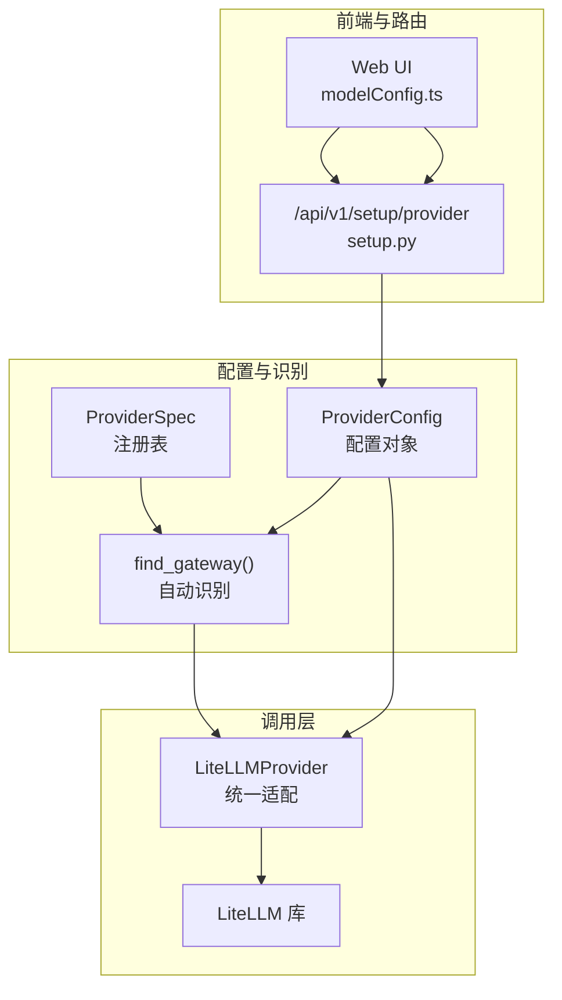
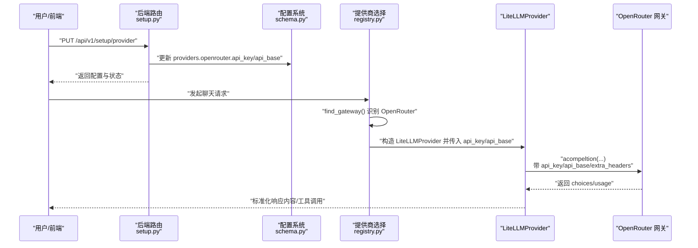
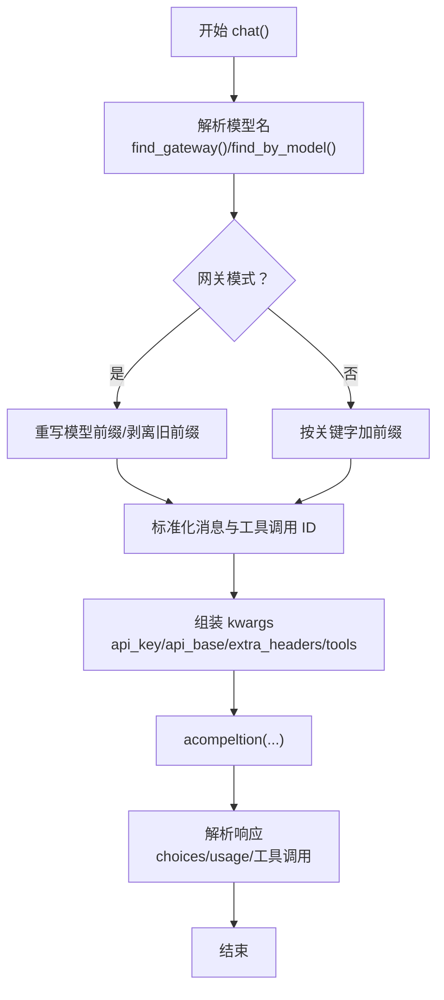
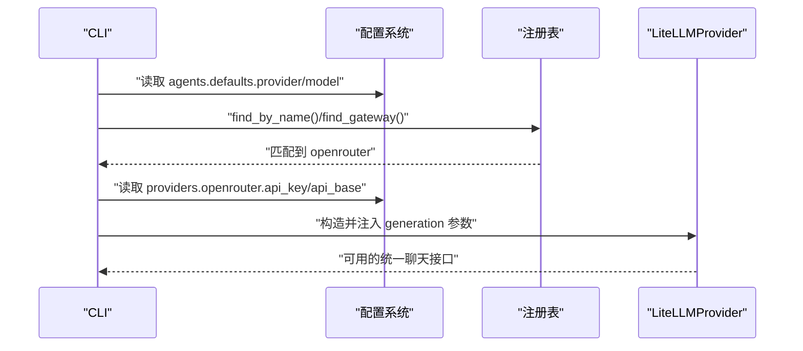
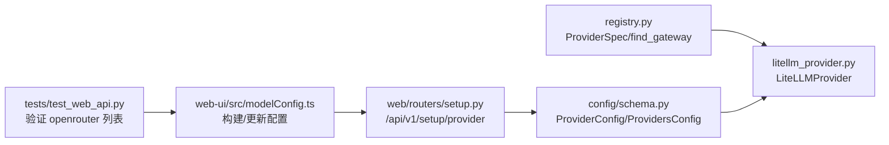

# OpenRouter 提供商

<cite>
**本文引用的文件**
- [nanobot/providers/registry.py](file://nanobot/providers/registry.py)
- [nanobot/providers/litellm_provider.py](file://nanobot/providers/litellm_provider.py)
- [nanobot/config/schema.py](file://nanobot/config/schema.py)
- [nanobot/cli/commands.py](file://nanobot/cli/commands.py)
- [nanobot/web/routers/setup.py](file://nanobot/web/routers/setup.py)
- [web-ui/src/modelConfig.ts](file://web-ui/src/modelConfig.ts)
- [web-ui/src/modelCatalog.ts](file://web-ui/src/modelCatalog.ts)
- [web-ui/src/configMeta.ts](file://web-ui/src/configMeta.ts)
- [tests/test_web_api.py](file://tests/test_web_api.py)
</cite>

## 目录
1. [简介](#简介)
2. [项目结构](#项目结构)
3. [核心组件](#核心组件)
4. [架构总览](#架构总览)
5. [详细组件分析](#详细组件分析)
6. [依赖分析](#依赖分析)
7. [性能考虑](#性能考虑)
8. [故障排除指南](#故障排除指南)
9. [结论](#结论)
10. [附录](#附录)

## 简介
本文件面向希望在 nanobot 中集成 OpenRouter 的开发者，系统性说明 OpenRouter 的认证机制、API 调用流程、配置方法、支持的模型与性能特性，并给出集成示例、参数说明、与 OpenAI 兼容的 API 规范及特殊参数处理方式，以及常见问题排查建议。

## 项目结构
OpenRouter 在该代码库中通过“提供商注册表 + LiteLLM 统一适配层”的方式实现：
- 注册表定义了 OpenRouter 的识别规则（如密钥前缀、默认基础地址等）。
- LiteLLMProvider 将统一的聊天接口请求路由到 OpenRouter 网关。
- 配置系统支持在运行时动态设置 API Key 与 API Base。
- Web UI 与后端路由提供可视化配置入口。

图表来源
- [nanobot/providers/registry.py:93-111](file://nanobot/providers/registry.py#L93-L111)
- [nanobot/providers/litellm_provider.py:27-64](file://nanobot/providers/litellm_provider.py#L27-L64)
- [nanobot/web/routers/setup.py:47-95](file://nanobot/web/routers/setup.py#L47-L95)
- [web-ui/src/modelConfig.ts:10-16](file://web-ui/src/modelConfig.ts#L10-L16)

章节来源
- [nanobot/providers/registry.py:93-111](file://nanobot/providers/registry.py#L93-L111)
- [nanobot/providers/litellm_provider.py:27-64](file://nanobot/providers/litellm_provider.py#L27-L64)
- [nanobot/web/routers/setup.py:47-95](file://nanobot/web/routers/setup.py#L47-L95)
- [web-ui/src/modelConfig.ts:10-16](file://web-ui/src/modelConfig.ts#L10-L16)

## 核心组件
- OpenRouter 注册规范（ProviderSpec）
  - 关键识别字段：名称、关键词、环境变量键、是否网关、密钥前缀、默认基础地址、是否本地等。
  - OpenRouter 的识别要点：密钥前缀为特定前缀；默认基础地址为官方网关；标记为网关类型。
- LiteLLMProvider（统一适配层）
  - 自动检测网关/本地提供者；根据模型应用前缀；注入额外头部；处理工具调用与消息清洗；解析响应。
- 配置系统（ProviderConfig）
  - 支持 api_key、api_base、extra_headers 字段；在运行时可由后端路由更新。
- Web UI 与后端路由
  - 提供配置构建、字段更新、设置提供商的接口；默认首选 OpenRouter。

章节来源
- [nanobot/providers/registry.py:93-111](file://nanobot/providers/registry.py#L93-L111)
- [nanobot/providers/litellm_provider.py:27-64](file://nanobot/providers/litellm_provider.py#L27-L64)
- [nanobot/config/schema.py:259-265](file://nanobot/config/schema.py#L259-L265)
- [web-ui/src/modelConfig.ts:10-16](file://web-ui/src/modelConfig.ts#L10-L16)
- [web-ui/src/configMeta.ts:28-48](file://web-ui/src/configMeta.ts#L28-L48)

## 架构总览
OpenRouter 集成遵循“识别—路由—调用—解析”的链路：

图表来源
- [nanobot/web/routers/setup.py:47-95](file://nanobot/web/routers/setup.py#L47-L95)
- [nanobot/config/schema.py:274-274](file://nanobot/config/schema.py#L274-L274)
- [nanobot/providers/registry.py:429-457](file://nanobot/providers/registry.py#L429-L457)
- [nanobot/providers/litellm_provider.py:209-282](file://nanobot/providers/litellm_provider.py#L209-L282)

## 详细组件分析

### OpenRouter 注册规范与识别
- 识别规则
  - 密钥前缀：OpenRouter 使用特定前缀作为密钥标识，便于自动识别。
  - 默认基础地址：官方网关地址，未显式配置时使用。
  - 类别：标记为网关，具备全局路由能力。
- 前缀与模型重写
  - 网关模式下会为模型添加统一前缀；部分网关需要剥离已有前缀后再重写。
- 提示词缓存支持
  - 标记支持提示词缓存，可在系统消息中注入缓存控制。

章节来源
- [nanobot/providers/registry.py:93-111](file://nanobot/providers/registry.py#L93-L111)
- [nanobot/providers/registry.py:429-457](file://nanobot/providers/registry.py#L429-L457)

### LiteLLMProvider 调用流程与参数处理
- 初始化与环境变量
  - 依据识别结果设置环境变量；若为网关则覆盖环境变量，否则仅在未设置时填充。
  - 可设置自定义 api_base 与 extra_headers。
- 模型解析与消息清洗
  - 网关模式：按注册表前缀策略重写模型名；必要时剥离已有前缀再重写。
  - 标准模式：按模型关键字自动加前缀。
  - 清洗：移除非标准字段；工具调用 ID 正规化；确保助手消息包含内容键。
- 特殊参数与兼容性
  - drop_params：丢弃不被目标提供商接受的参数，避免请求被拒。
  - reasoning_effort：当提供时传递给底层调用。
  - 工具调用：合并多 choice 的工具调用，修复参数为字符串时的 JSON 修复。
- 响应解析
  - 合并多 choice 的内容与工具调用；提取 usage；保留提供商特定字段。

图表来源
- [nanobot/providers/litellm_provider.py:89-107](file://nanobot/providers/litellm_provider.py#L89-L107)
- [nanobot/providers/litellm_provider.py:180-207](file://nanobot/providers/litellm_provider.py#L180-L207)
- [nanobot/providers/litellm_provider.py:209-282](file://nanobot/providers/litellm_provider.py#L209-L282)

章节来源
- [nanobot/providers/litellm_provider.py:27-64](file://nanobot/providers/litellm_provider.py#L27-L64)
- [nanobot/providers/litellm_provider.py:89-107](file://nanobot/providers/litellm_provider.py#L89-L107)
- [nanobot/providers/litellm_provider.py:180-207](file://nanobot/providers/litellm_provider.py#L180-L207)
- [nanobot/providers/litellm_provider.py:209-282](file://nanobot/providers/litellm_provider.py#L209-L282)

### 配置与设置流程（CLI 与 Web）
- CLI
  - 从配置中读取默认提供商与模型；若非显式 OAuth/本地提供商且缺少密钥则报错。
  - 构造 LiteLLMProvider 并注入生成参数（温度、最大 token、推理强度）。
- Web 设置路由
  - 校验提供商名称与模型；针对不同提供商校验 api_key/api_base；
  - 更新 providers.openrouter.api_key/api_base，并持久化配置。
- Web UI
  - 默认首选 OpenRouter；提供构建 ProviderConfig 的辅助函数与字段更新逻辑。

图表来源
- [nanobot/cli/commands.py:216-271](file://nanobot/cli/commands.py#L216-L271)
- [nanobot/config/schema.py:418-426](file://nanobot/config/schema.py#L418-L426)
- [nanobot/providers/registry.py:460-466](file://nanobot/providers/registry.py#L460-L466)

章节来源
- [nanobot/cli/commands.py:216-271](file://nanobot/cli/commands.py#L216-L271)
- [nanobot/web/routers/setup.py:47-95](file://nanobot/web/routers/setup.py#L47-L95)
- [web-ui/src/modelConfig.ts:10-16](file://web-ui/src/modelConfig.ts#L10-L16)

### 支持的模型与性能特点
- 模型目录（Web UI）
  - OpenRouter 示例模型：包含跨厂商的 Claude/GPT/Gemini 等组合。
- 性能与特性
  - OpenRouter 作为网关：具备统一路由能力；默认基础地址已内置；支持提示词缓存。
  - LiteLLM 层面：自动丢弃不被目标提供商接受的参数，减少失败率；工具调用合并提升稳定性。

章节来源
- [web-ui/src/modelCatalog.ts:1-20](file://web-ui/src/modelCatalog.ts#L1-L20)
- [nanobot/providers/registry.py:93-111](file://nanobot/providers/registry.py#L93-L111)
- [nanobot/providers/litellm_provider.py:62-62](file://nanobot/providers/litellm_provider.py#L62-L62)

### 与 OpenAI 兼容的 API 规范与特殊参数
- 兼容性
  - LiteLLMProvider 以 OpenAI 兼容格式发送请求；支持 tools/tool_choice；消息键清洗；工具调用 ID 正规化。
- 特殊参数
  - reasoning_effort：当提供时传递到底层调用；同时启用 drop_params 以避免参数冲突。
  - extra_headers：可用于携带网关所需的自定义头部（例如某些网关要求的 APP-Code）。
- 错误处理
  - 统一捕获异常并以标准响应形式返回，便于上层优雅处理。

章节来源
- [nanobot/providers/litellm_provider.py:243-272](file://nanobot/providers/litellm_provider.py#L243-L272)
- [nanobot/providers/litellm_provider.py:273-282](file://nanobot/providers/litellm_provider.py#L273-L282)

## 依赖分析
OpenRouter 集成的关键依赖关系如下：

图表来源
- [nanobot/providers/registry.py:429-457](file://nanobot/providers/registry.py#L429-L457)
- [nanobot/providers/litellm_provider.py:27-64](file://nanobot/providers/litellm_provider.py#L27-L64)
- [nanobot/config/schema.py:259-288](file://nanobot/config/schema.py#L259-L288)
- [nanobot/web/routers/setup.py:47-95](file://nanobot/web/routers/setup.py#L47-L95)
- [web-ui/src/modelConfig.ts:10-16](file://web-ui/src/modelConfig.ts#L10-L16)
- [tests/test_web_api.py:2528-2529](file://tests/test_web_api.py#L2528-L2529)

章节来源
- [nanobot/providers/registry.py:429-457](file://nanobot/providers/registry.py#L429-L457)
- [nanobot/providers/litellm_provider.py:27-64](file://nanobot/providers/litellm_provider.py#L27-L64)
- [nanobot/config/schema.py:259-288](file://nanobot/config/schema.py#L259-L288)
- [nanobot/web/routers/setup.py:47-95](file://nanobot/web/routers/setup.py#L47-L95)
- [web-ui/src/modelConfig.ts:10-16](file://web-ui/src/modelConfig.ts#L10-L16)
- [tests/test_web_api.py:2528-2529](file://tests/test_web_api.py#L2528-L2529)

## 性能考虑
- 参数裁剪：启用 drop_params 以避免不被目标提供商接受的参数导致请求失败。
- 工具调用合并：合并多 choice 的工具调用，降低丢失风险。
- 消息清洗：标准化消息与工具调用 ID，减少因格式差异引发的错误。
- 默认基础地址：OpenRouter 网关默认地址可减少配置成本，提高首开体验。

章节来源
- [nanobot/providers/litellm_provider.py:62-62](file://nanobot/providers/litellm_provider.py#L62-L62)
- [nanobot/providers/litellm_provider.py:292-304](file://nanobot/providers/litellm_provider.py#L292-L304)

## 故障排除指南
- 无法识别 OpenRouter
  - 确认使用的 API Key 是否以 OpenRouter 的密钥前缀开头。
  - 若通过 api_base 推断，请确保其中包含网关关键字。
- 缺少 API Key 或 API Base
  - 非 OAuth/本地提供商需至少提供 API Key 或 API Base；OpenRouter 作为网关默认基础地址可省略。
- 请求被拒绝或参数无效
  - 启用 drop_params 后，不被目标提供商接受的参数会被丢弃；请检查是否传入了不受支持的参数。
- 工具调用缺失或参数为字符串
  - 系统会尝试修复 JSON 字符串参数；若仍失败，请检查工具定义与参数格式。
- 认证相关错误
  - 若出现 401/403 等鉴权错误，优先检查 api_key 是否正确、是否过期或权限不足。
- 网络连通性
  - 确认 api_base 可达；若使用代理或自定义网关，请确保 extra_headers 正确配置。

章节来源
- [nanobot/web/routers/setup.py:72-86](file://nanobot/web/routers/setup.py#L72-L86)
- [nanobot/providers/litellm_provider.py:262-267](file://nanobot/providers/litellm_provider.py#L262-L267)
- [nanobot/providers/litellm_provider.py:309-311](file://nanobot/providers/litellm_provider.py#L309-L311)

## 结论
OpenRouter 在 nanobot 中通过“注册表识别 + LiteLLM 统一适配 + 配置系统”的方式实现无缝集成。开发者只需提供正确的 API Key（或 API Base），即可利用网关的统一路由能力访问多家模型；同时，系统在参数兼容性、工具调用稳定性与错误处理方面提供了良好保障。

## 附录

### 配置参数说明
- providers.openrouter.api_key
  - OpenRouter API Key（以特定前缀开头时可自动识别为网关）。
- providers.openrouter.api_base
  - OpenRouter 默认基础地址可省略（使用内置默认值）；自定义网关时需填写。
- providers.openrouter.extra_headers
  - 自定义请求头（如某些网关要求的 APP-Code）。
- agents.defaults.provider
  - 默认提供商名称；OpenRouter 作为默认首选之一。
- agents.defaults.model
  - 默认模型标识；网关模式下会按规则重写模型名。

章节来源
- [nanobot/config/schema.py:259-265](file://nanobot/config/schema.py#L259-L265)
- [nanobot/config/schema.py:235-238](file://nanobot/config/schema.py#L235-L238)
- [web-ui/src/modelConfig.ts:10-16](file://web-ui/src/modelConfig.ts#L10-L16)

### 集成示例（步骤指引）
- 获取 OpenRouter API Key
  - 在 OpenRouter 官网申请并复制 Key。
- 配置提供商
  - 通过 Web UI 或后端路由设置 providers.openrouter.api_key；若使用自定义网关则设置 api_base。
- 发起对话
  - CLI 或后端调用将自动识别 OpenRouter 并路由请求；工具调用与消息清洗由 LiteLLMProvider 处理。

章节来源
- [nanobot/cli/commands.py:207-210](file://nanobot/cli/commands.py#L207-L210)
- [nanobot/web/routers/setup.py:47-95](file://nanobot/web/routers/setup.py#L47-L95)
- [web-ui/src/configMeta.ts:33-33](file://web-ui/src/configMeta.ts#L33-L33)