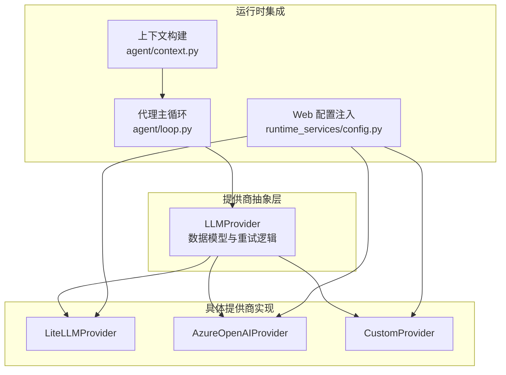
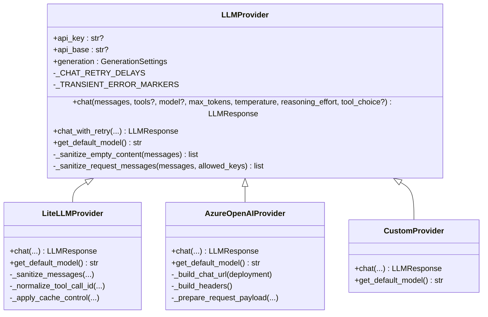
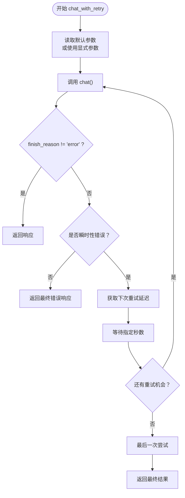
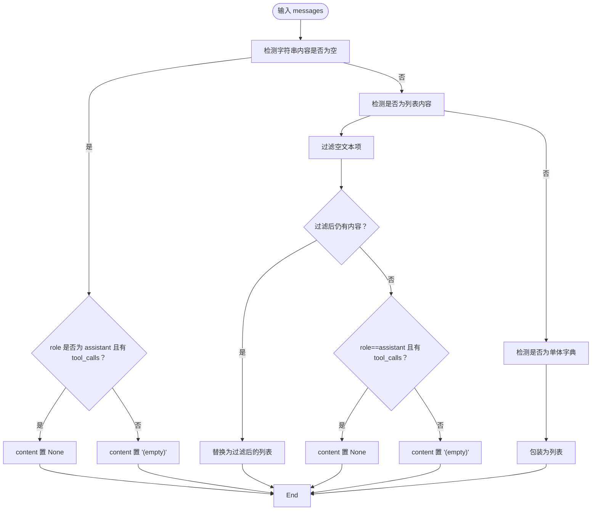
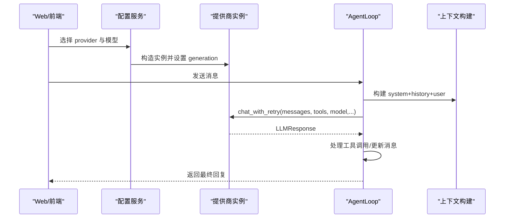

# 提供商基础接口

<cite>
**本文引用的文件**
- [nanobot/providers/base.py](file://nanobot/providers/base.py)
- [nanobot/providers/litellm_provider.py](file://nanobot/providers/litellm_provider.py)
- [nanobot/providers/azure_openai_provider.py](file://nanobot/providers/azure_openai_provider.py)
- [nanobot/providers/custom_provider.py](file://nanobot/providers/custom_provider.py)
- [nanobot/providers/__init__.py](file://nanobot/providers/__init__.py)
- [nanobot/web/runtime_services/config.py](file://nanobot/web/runtime_services/config.py)
- [nanobot/agent/context.py](file://nanobot/agent/context.py)
- [nanobot/agent/loop.py](file://nanobot/agent/loop.py)
- [tests/test_provider_retry.py](file://tests/test_provider_retry.py)
</cite>

## 目录
1. [简介](#简介)
2. [项目结构](#项目结构)
3. [核心组件](#核心组件)
4. [架构总览](#架构总览)
5. [详细组件分析](#详细组件分析)
6. [依赖关系分析](#依赖关系分析)
7. [性能考量](#性能考量)
8. [故障排查指南](#故障排查指南)
9. [结论](#结论)
10. [附录：使用示例与最佳实践](#附录使用示例与最佳实践)

## 简介
本文件面向“提供商基础接口”，系统化阐述 LLMProvider 抽象基类的设计理念、接口规范与扩展模式；详解 LLMResponse、ToolCallRequest、GenerationSettings 三大数据模型的职责与用法；完整说明 chat() 方法的参数、返回值与异常处理；深入解析重试机制（含 _CHAT_RETRY_DELAYS 与 _TRANSIENT_ERROR_MARKERS）；并给出消息清理与标准化（_sanitize_empty_content 与 _sanitize_request_messages）的实现细节与最佳实践。

## 项目结构
- 提供商抽象与实现集中在 nanobot/providers 下：
  - 基类与数据模型：base.py
  - 多提供商统一接入：litellm_provider.py
  - Azure OpenAI 特定实现：azure_openai_provider.py
  - 自定义 OpenAI 兼容实现：custom_provider.py
  - 导出聚合：providers/__init__.py
- 运行时配置与注入：web/runtime_services/config.py
- 上下文构建与消息组装：agent/context.py
- 核心循环中对 LLMProvider 的调用：agent/loop.py
- 重试行为的单元测试：tests/test_provider_retry.py

图表来源
- [nanobot/providers/base.py:69-271](file://nanobot/providers/base.py#L69-L271)
- [nanobot/providers/litellm_provider.py:27-349](file://nanobot/providers/litellm_provider.py#L27-L349)
- [nanobot/providers/azure_openai_provider.py:17-213](file://nanobot/providers/azure_openai_provider.py#L17-L213)
- [nanobot/providers/custom_provider.py:14-63](file://nanobot/providers/custom_provider.py#L14-L63)
- [nanobot/web/runtime_services/config.py:38-77](file://nanobot/web/runtime_services/config.py#L38-L77)
- [nanobot/agent/context.py:16-227](file://nanobot/agent/context.py#L16-L227)
- [nanobot/agent/loop.py:35-200](file://nanobot/agent/loop.py#L35-L200)

章节来源
- [nanobot/providers/base.py:1-271](file://nanobot/providers/base.py#L1-L271)
- [nanobot/providers/__init__.py:1-9](file://nanobot/providers/__init__.py#L1-L9)

## 核心组件
- LLMProvider（抽象基类）
  - 定义统一的异步聊天接口 chat()，以及可选的工具函数（消息清理与标准化）、重试策略与默认模型查询。
  - 内置 GenerationSettings 作为默认生成参数容器，便于在调用链中复用。
- LLMResponse（响应模型）
  - 统一承载文本内容、工具调用列表、结束原因、用量统计、推理/思考扩展字段。
- ToolCallRequest（工具调用请求）
  - 表达一次工具调用的标识、名称与参数，支持跨提供商的兼容序列化。
- GenerationSettings（生成参数）
  - 温度、最大令牌数、推理强度等默认值，由具体提供商实例继承。

章节来源
- [nanobot/providers/base.py:12-67](file://nanobot/providers/base.py#L12-L67)
- [nanobot/providers/base.py:69-271](file://nanobot/providers/base.py#L69-L271)

## 架构总览
LLMProvider 将“消息标准化”“参数默认化”“重试策略”“错误归一化”等横切关注点收敛到抽象基类，具体提供商仅需实现 chat() 与 get_default_model()，即可无缝接入上层 AgentLoop、上下文构建与 Web 配置注入。

图表来源
- [nanobot/providers/base.py:69-271](file://nanobot/providers/base.py#L69-L271)
- [nanobot/providers/litellm_provider.py:27-349](file://nanobot/providers/litellm_provider.py#L27-L349)
- [nanobot/providers/azure_openai_provider.py:17-213](file://nanobot/providers/azure_openai_provider.py#L17-L213)
- [nanobot/providers/custom_provider.py:14-63](file://nanobot/providers/custom_provider.py#L14-L63)

## 详细组件分析

### LLMProvider 抽象基类与接口规范
- 设计理念
  - 通过统一接口屏蔽不同提供商的差异，确保上层无需关心底层实现细节。
  - 默认参数 GenerationSettings 与 sentinel 参数占位，简化调用方负担。
- 关键接口
  - chat()：发送聊天补全请求，返回 LLMResponse。
  - chat_with_retry()：在瞬时性错误时自动重试，重试间隔来自 _CHAT_RETRY_DELAYS。
  - get_default_model()：返回提供商默认模型标识。
- 消息清理与标准化
  - _sanitize_empty_content：将空内容替换为安全占位或保留工具调用场景下的 None，避免 400 错误。
  - _sanitize_request_messages：仅保留允许的键集合，规范化助手消息内容键缺失场景。
- 重试机制
  - _CHAT_RETRY_DELAYS：重试等待间隔序列。
  - _TRANSIENT_ERROR_MARKERS：用于识别瞬时性错误的关键字集合。
  - _is_transient_error：判断错误是否属于瞬时性，从而决定是否继续重试。
- 异常处理
  - chat() 可能抛出异常；chat_with_retry 捕获异常并返回带错误原因的 LLMResponse，保证上层稳定。

章节来源
- [nanobot/providers/base.py:69-271](file://nanobot/providers/base.py#L69-L271)

### LLMResponse 数据模型
- 字段语义
  - content：模型输出文本；可能为 None。
  - tool_calls：工具调用列表。
  - finish_reason：结束原因（如 stop、error、tool_calls 等）。
  - usage：用量统计（提示/补全/总计令牌数）。
  - reasoning_content/thinking_blocks：部分提供商的推理/思考扩展字段。
- 使用要点
  - 上层根据 finish_reason 判断是否需要继续工具调用或直接返回。
  - usage 用于成本控制与审计。

章节来源
- [nanobot/providers/base.py:38-52](file://nanobot/providers/base.py#L38-L52)

### ToolCallRequest 数据模型
- 字段语义
  - id：工具调用唯一标识。
  - name：工具名称。
  - arguments：工具参数字典。
  - provider_specific_fields/function_provider_specific_fields：提供商特定字段，便于跨提供商兼容。
- 序列化
  - to_openai_tool_call：将请求序列化为 OpenAI 风格的工具调用载荷，便于统一处理。

章节来源
- [nanobot/providers/base.py:12-36](file://nanobot/providers/base.py#L12-L36)

### GenerationSettings 数据模型
- 字段语义
  - temperature：采样温度。
  - max_tokens：最大输出令牌数。
  - reasoning_effort：推理强度（可为空）。
- 使用方式
  - 在提供商初始化时设置，随后 chat_with_retry 未显式传参时自动使用。

章节来源
- [nanobot/providers/base.py:54-67](file://nanobot/providers/base.py#L54-L67)

### chat() 方法参数规范与返回值
- 参数
  - messages：消息列表，每条包含 role 与 content 等键。
  - tools：可选的工具定义（OpenAI 风格）。
  - model：模型标识（提供商特定）。
  - max_tokens：最大输出令牌数。
  - temperature：采样温度。
  - reasoning_effort：推理强度（可为空）。
  - tool_choice：工具选择策略（如 auto、required 或具体工具定义）。
- 返回值
  - LLMResponse：包含 content/tool_calls/finish_reason/usage/reasoning_content/thinking_blocks。
- 异常处理
  - chat() 可能抛出异常；chat_with_retry 捕获后返回错误原因的 LLMResponse，避免上游崩溃。

章节来源
- [nanobot/providers/base.py:160-185](file://nanobot/providers/base.py#L160-L185)

### 重试机制实现原理
- 重试策略
  - _CHAT_RETRY_DELAYS：重试等待间隔序列（秒级）。
  - chat_with_retry：逐次尝试调用 chat()，若返回非 error 结果则直接返回；否则判断是否为瞬时性错误。
  - 对于瞬时性错误，按顺序等待对应时间后重试；超过最大次数后，最后一次尝试失败则返回最终错误响应。
- 错误判定
  - _TRANSIENT_ERROR_MARKERS：包含常见瞬时性错误关键字（如 429、rate limit、500、timeout 等）。
  - _is_transient_error：大小写不敏感地匹配关键字，判定是否应重试。
- 取消与异常
  - 若捕获到取消异常（CancelledError），直接向上抛出，不吞掉取消信号。

图表来源
- [nanobot/providers/base.py:187-266](file://nanobot/providers/base.py#L187-L266)

章节来源
- [nanobot/providers/base.py:77-91](file://nanobot/providers/base.py#L77-L91)
- [nanobot/providers/base.py:187-266](file://nanobot/providers/base.py#L187-L266)
- [tests/test_provider_retry.py:27-126](file://tests/test_provider_retry.py#L27-L126)

### 消息清理与标准化
- _sanitize_empty_content
  - 场景：当内容为空字符串或空文本块时，替换为安全占位或 None，避免被提供商拒绝。
  - 角色区分：对助手且存在工具调用时，可能置空内容以满足严格提供商的要求。
  - 列表内容过滤：移除空文本项，必要时回退为占位或 None。
  - 单体字典内容：转换为列表形式，确保后续序列化一致。
- _sanitize_request_messages
  - 仅保留允许的键集合（如 role、content、tool_calls、tool_call_id、name 等），避免传递不被支持的键。
  - 规范化助手消息：若缺少 content 键，补为 None，避免某些提供商报错。

图表来源
- [nanobot/providers/base.py:100-144](file://nanobot/providers/base.py#L100-L144)

章节来源
- [nanobot/providers/base.py:100-158](file://nanobot/providers/base.py#L100-L158)

### 具体提供商实现要点

#### LiteLLMProvider
- 职责
  - 通过 LiteLLM 统一多提供商接入，自动前缀模型名、注入环境变量、应用模型特定覆盖。
- 消息处理
  - _sanitize_messages：在 _sanitize_empty_content 基础上，进一步裁剪不允许的键、保持工具调用 ID 一致性。
  - _normalize_tool_call_id：将过长或不兼容的工具调用 ID 规范化为 9 字符字母数字串。
  - _apply_cache_control：对系统消息与工具定义注入缓存控制（当提供商支持时）。
- chat() 实现
  - 解析/前缀模型名，注入 max_tokens、temperature、reasoning_effort、tools/tool_choice 等参数。
  - 调用 acompletion 后，_parse_response 统一解析为 LLMResponse，合并多 choice 的工具调用。

章节来源
- [nanobot/providers/litellm_provider.py:27-349](file://nanobot/providers/litellm_provider.py#L27-L349)

#### AzureOpenAIProvider
- 职责
  - 遵循 Azure OpenAI API 版本 2024-10-21 的约束：使用 api-key 头、部署名为路径参数、使用 max_completion_tokens 等。
- 请求准备
  - _build_chat_url/_build_headers：构造 URL 与请求头。
  - _prepare_request_payload：标准化消息与工具调用，映射 max_tokens 为 max_completion_tokens。
- chat() 实现
  - 直接 HTTP 调用，解析 200 响应为 LLMResponse，非 200 返回错误原因。

章节来源
- [nanobot/providers/azure_openai_provider.py:17-213](file://nanobot/providers/azure_openai_provider.py#L17-L213)

#### CustomProvider
- 职责
  - 直连任意 OpenAI 兼容端点，绕过 LiteLLM，适合本地或自建服务。
- chat() 实现
  - 使用 AsyncOpenAI 客户端，调用 chat.completions.create 并解析为 LLMResponse。

章节来源
- [nanobot/providers/custom_provider.py:14-63](file://nanobot/providers/custom_provider.py#L14-L63)

## 依赖关系分析
- 运行时注入
  - Web 配置服务根据用户选择的 provider 名称与模型，构造具体提供商实例，并注入默认生成参数（GenerationSettings）。
- 上下文与消息
  - ContextBuilder 负责拼装 system/user/messages，避免连续相同角色消息导致的提供商拒绝。
- 主循环调用
  - AgentLoop 在每次推理中调用 provider.chat_with_retry，统一处理工具调用与消息追加。

图表来源
- [nanobot/web/runtime_services/config.py:38-77](file://nanobot/web/runtime_services/config.py#L38-L77)
- [nanobot/agent/context.py:145-181](file://nanobot/agent/context.py#L145-L181)
- [nanobot/agent/loop.py:233-240](file://nanobot/agent/loop.py#L233-L240)

章节来源
- [nanobot/web/runtime_services/config.py:38-77](file://nanobot/web/runtime_services/config.py#L38-L77)
- [nanobot/agent/context.py:145-181](file://nanobot/agent/context.py#L145-L181)
- [nanobot/agent/loop.py:233-240](file://nanobot/agent/loop.py#L233-L240)

## 性能考量
- 重试策略
  - 合理的重试间隔与上限可提升稳定性，但会增加总体耗时。应结合业务 SLA 调整 _CHAT_RETRY_DELAYS。
- 参数默认化
  - 通过 GenerationSettings 减少重复参数传递，降低调用开销。
- 消息标准化
  - 避免不必要的键与空内容，减少网络传输与解析成本。
- 缓存控制（LiteLLMProvider）
  - 对系统消息与工具定义注入缓存控制可减少重复计算，提升吞吐。

## 故障排查指南
- 常见问题
  - 400 错误：检查消息内容是否为空或包含空文本块；使用 _sanitize_empty_content 清理。
  - 429/5xx：确认是否命中瞬时性错误标记；chat_with_retry 会自动重试。
  - 工具调用 ID 不兼容：LiteLLMProvider 会规范化 ID，确保前后端一致。
- 调试建议
  - 打印最后一次调用的 kwargs（测试中可通过 ScriptedProvider 记录）。
  - 在 chat() 中捕获异常并返回错误原因，便于定位。
  - 使用单元测试验证重试行为与参数覆盖。

章节来源
- [tests/test_provider_retry.py:27-126](file://tests/test_provider_retry.py#L27-L126)
- [nanobot/providers/base.py:187-266](file://nanobot/providers/base.py#L187-L266)

## 结论
LLMProvider 抽象基类通过统一接口、默认参数、消息清理与重试机制，显著降低了多提供商接入的复杂度。配合 LiteLLMProvider、AzureOpenAIProvider、CustomProvider 等实现，可在不改变上层逻辑的前提下灵活切换与扩展。建议在生产环境中结合业务需求调整重试策略与默认参数，并持续完善消息标准化流程以提升稳定性与性能。

## 附录：使用示例与最佳实践

### 使用示例
- 构造提供商并设置默认参数
  - 参考 Web 配置注入逻辑，按 provider 名称与模型创建实例，并设置 GenerationSettings。
- 在 AgentLoop 中发起聊天
  - 使用 chat_with_retry 发起请求，自动处理重试与错误归一化。
- 处理工具调用
  - 根据 LLMResponse 的 tool_calls 列表执行相应工具，再将结果追加到消息列表继续对话。

章节来源
- [nanobot/web/runtime_services/config.py:38-77](file://nanobot/web/runtime_services/config.py#L38-L77)
- [nanobot/agent/loop.py:233-240](file://nanobot/agent/loop.py#L233-L240)
- [nanobot/agent/context.py:204-227](file://nanobot/agent/context.py#L204-L227)

### 最佳实践
- 参数管理
  - 将温度、最大令牌数、推理强度等参数集中放在 GenerationSettings，避免层层传递。
- 消息质量
  - 使用 _sanitize_empty_content 与 _sanitize_request_messages 清理与标准化消息，减少提供商拒绝。
- 重试策略
  - 依据业务 SLA 调整重试间隔与上限；对不可重试的错误（如 401）不应盲目重试。
- 工具调用一致性
  - 规范化工具调用 ID，确保工具调用与工具结果之间的关联稳定。
- 可观测性
  - 记录关键调用参数与响应状态，便于问题定位与性能分析。