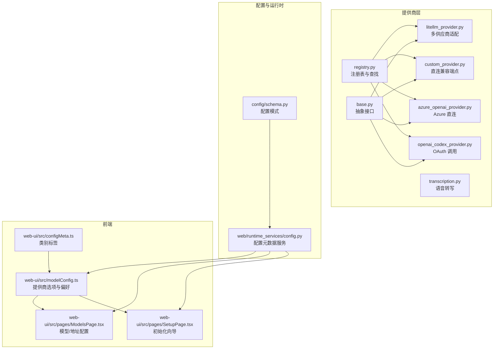
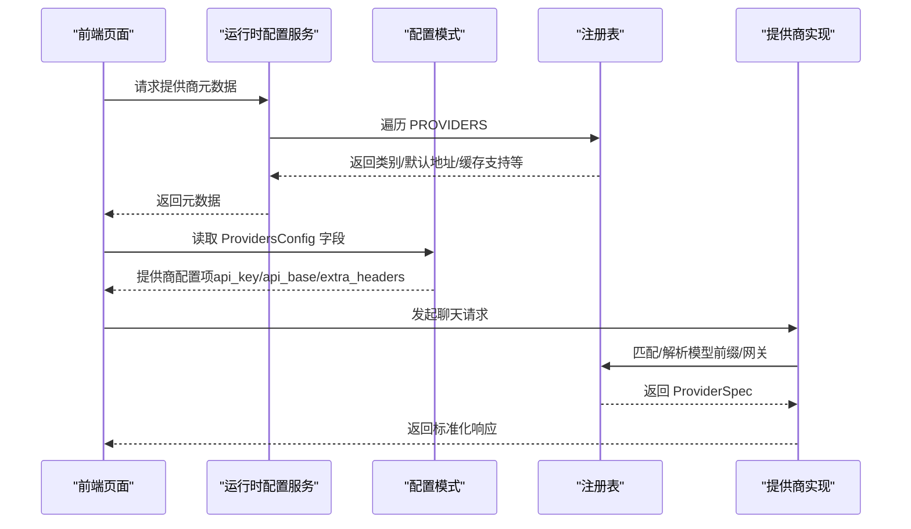
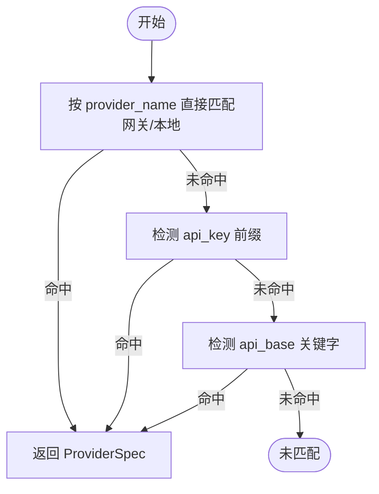
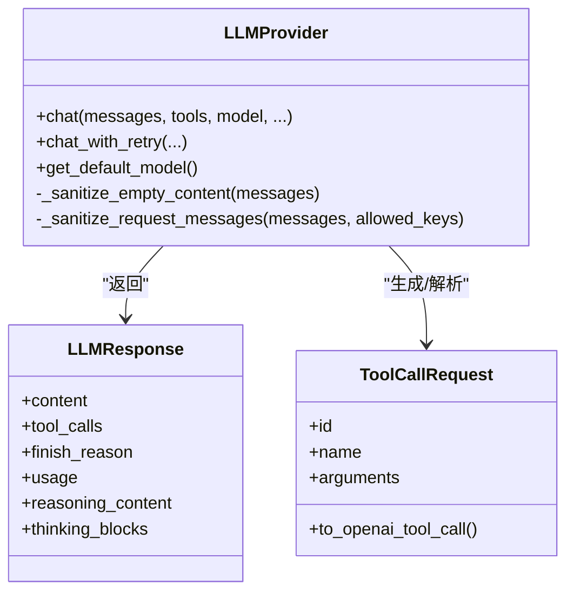
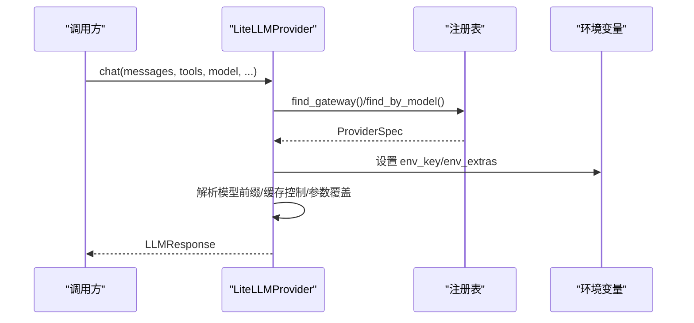
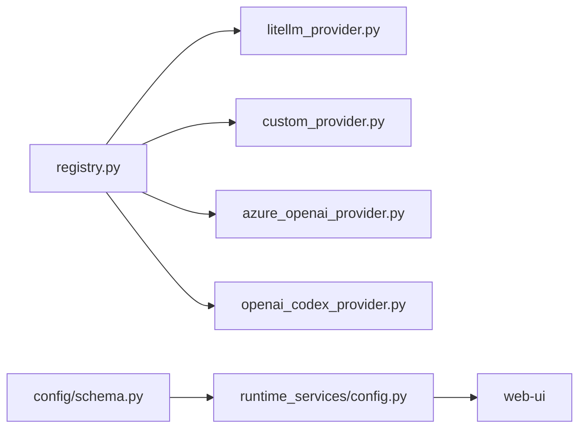

# 提供商注册中心

<cite>
**本文引用的文件**
- [nanobot/providers/registry.py](file://nanobot/providers/registry.py)
- [nanobot/providers/__init__.py](file://nanobot/providers/__init__.py)
- [nanobot/providers/base.py](file://nanobot/providers/base.py)
- [nanobot/providers/custom_provider.py](file://nanobot/providers/custom_provider.py)
- [nanobot/providers/litellm_provider.py](file://nanobot/providers/litellm_provider.py)
- [nanobot/providers/openai_codex_provider.py](file://nanobot/providers/openai_codex_provider.py)
- [nanobot/providers/azure_openai_provider.py](file://nanobot/providers/azure_openai_provider.py)
- [nanobot/providers/transcription.py](file://nanobot/providers/transcription.py)
- [nanobot/config/schema.py](file://nanobot/config/schema.py)
- [nanobot/web/runtime_services/config.py](file://nanobot/web/runtime_services/config.py)
- [web-ui/src/modelConfig.ts](file://web-ui/src/modelConfig.ts)
- [web-ui/src/pages/ModelsPage.tsx](file://web-ui/src/pages/ModelsPage.tsx)
- [web-ui/src/pages/SetupPage.tsx](file://web-ui/src/pages/SetupPage.tsx)
- [web-ui/src/configMeta.ts](file://web-ui/src/configMeta.ts)
- [tests/test_azure_openai_provider.py](file://tests/test_azure_openai_provider.py)
</cite>

## 目录
1. [简介](#简介)
2. [项目结构](#项目结构)
3. [核心组件](#核心组件)
4. [架构总览](#架构总览)
5. [详细组件分析](#详细组件分析)
6. [依赖分析](#依赖分析)
7. [性能考虑](#性能考虑)
8. [故障排除指南](#故障排除指南)
9. [结论](#结论)
10. [附录](#附录)

## 简介
本文件面向“提供商注册中心”的技术文档，系统性阐述提供商注册机制与动态加载能力，覆盖以下主题：
- 注册表的初始化与提供商发现机制
- 注册流程与生命周期管理
- 自定义提供商注册示例与最佳实践
- 提供商优先级与选择策略
- 注册表的查询与管理接口
- 常见问题与故障排除

本项目通过统一的提供商注册表（Provider Registry）集中管理所有 LLM 供应商元数据，并由 LiteLLMProvider、CustomProvider、AzureOpenAIProvider 等实现类按需调用。前端通过配置元数据接口暴露可用提供商类别、默认地址与缓存支持等信息，供初始化向导与模型页面使用。

## 项目结构
围绕提供商注册中心的关键目录与文件如下：
- providers：提供商抽象与具体实现
  - registry.py：注册表与查找函数
  - base.py：抽象接口与通用响应结构
  - litellm_provider.py：多供应商统一接入
  - custom_provider.py：直连 OpenAI 兼容端点
  - azure_openai_provider.py：Azure OpenAI 直连实现
  - openai_codex_provider.py：OAuth 方式调用 Responses API
  - transcription.py：语音转写（Groq）
- config/schema.py：配置模式与提供商字段定义
- web/runtime_services/config.py：后端配置服务，输出提供商元数据
- web-ui：前端模型与设置页面，展示与选择提供商

图表来源
- [nanobot/providers/registry.py:1-466](file://nanobot/providers/registry.py#L1-L466)
- [nanobot/providers/base.py:1-271](file://nanobot/providers/base.py#L1-L271)
- [nanobot/providers/litellm_provider.py:1-349](file://nanobot/providers/litellm_provider.py#L1-L349)
- [nanobot/providers/custom_provider.py:1-63](file://nanobot/providers/custom_provider.py#L1-L63)
- [nanobot/providers/azure_openai_provider.py:1-213](file://nanobot/providers/azure_openai_provider.py#L1-L213)
- [nanobot/providers/openai_codex_provider.py:1-318](file://nanobot/providers/openai_codex_provider.py#L1-L318)
- [nanobot/providers/transcription.py:1-65](file://nanobot/providers/transcription.py#L1-L65)
- [nanobot/config/schema.py:259-289](file://nanobot/config/schema.py#L259-L289)
- [nanobot/web/runtime_services/config.py:110-155](file://nanobot/web/runtime_services/config.py#L110-L155)
- [web-ui/src/modelConfig.ts:1-117](file://web-ui/src/modelConfig.ts#L1-L117)
- [web-ui/src/pages/ModelsPage.tsx:268-292](file://web-ui/src/pages/ModelsPage.tsx#L268-L292)
- [web-ui/src/pages/SetupPage.tsx:303-382](file://web-ui/src/pages/SetupPage.tsx#L303-L382)
- [web-ui/src/configMeta.ts:50-65](file://web-ui/src/configMeta.ts#L50-L65)

章节来源
- [nanobot/providers/registry.py:1-466](file://nanobot/providers/registry.py#L1-L466)
- [nanobot/providers/base.py:1-271](file://nanobot/providers/base.py#L1-L271)
- [nanobot/providers/litellm_provider.py:1-349](file://nanobot/providers/litellm_provider.py#L1-L349)
- [nanobot/providers/custom_provider.py:1-63](file://nanobot/providers/custom_provider.py#L1-L63)
- [nanobot/providers/azure_openai_provider.py:1-213](file://nanobot/providers/azure_openai_provider.py#L1-L213)
- [nanobot/providers/openai_codex_provider.py:1-318](file://nanobot/providers/openai_codex_provider.py#L1-L318)
- [nanobot/providers/transcription.py:1-65](file://nanobot/providers/transcription.py#L1-L65)
- [nanobot/config/schema.py:259-289](file://nanobot/config/schema.py#L259-L289)
- [nanobot/web/runtime_services/config.py:110-155](file://nanobot/web/runtime_services/config.py#L110-L155)
- [web-ui/src/modelConfig.ts:1-117](file://web-ui/src/modelConfig.ts#L1-L117)
- [web-ui/src/pages/ModelsPage.tsx:268-292](file://web-ui/src/pages/ModelsPage.tsx#L268-L292)
- [web-ui/src/pages/SetupPage.tsx:303-382](file://web-ui/src/pages/SetupPage.tsx#L303-L382)
- [web-ui/src/configMeta.ts:50-65](file://web-ui/src/configMeta.ts#L50-L65)

## 核心组件
- ProviderSpec 注册表：集中定义每个提供商的标识、关键词、环境变量、前缀策略、网关/本地检测规则、默认 API 地址、模型覆盖参数、OAuth 支持与提示缓存支持等。
- 查找与匹配函数：find_by_model、find_gateway、find_by_name，用于根据模型名、配置键或 API 密钥/基础地址自动识别提供商。
- 抽象接口 LLMProvider：统一聊天接口、重试机制、消息清洗与工具调用解析。
- 具体实现：
  - LiteLLMProvider：通过注册表驱动的统一入口，支持网关/标准/本地/直连等模式。
  - CustomProvider：直连任意 OpenAI 兼容端点，绕过 LiteLLM。
  - AzureOpenAIProvider：Azure OpenAI 直连实现，遵循特定 API 版本与请求格式。
  - OpenAICodexProvider：OAuth 流程调用 Responses API。
  - TranscriptionProvider：基于 Groq 的语音转写。
- 配置与运行时：
  - ProvidersConfig 字段：为每个提供商定义独立配置项（api_key、api_base、extra_headers）。
  - 运行时配置服务：将注册表转换为前端可用的提供商元数据（类别、默认地址、是否支持缓存等）。
  - 前端模型配置：提供提供商类别排序、默认配置构建、首选提供商选择逻辑。

章节来源
- [nanobot/providers/registry.py:19-66](file://nanobot/providers/registry.py#L19-L66)
- [nanobot/providers/registry.py:407-466](file://nanobot/providers/registry.py#L407-L466)
- [nanobot/providers/base.py:69-271](file://nanobot/providers/base.py#L69-L271)
- [nanobot/providers/litellm_provider.py:27-349](file://nanobot/providers/litellm_provider.py#L27-L349)
- [nanobot/providers/custom_provider.py:14-63](file://nanobot/providers/custom_provider.py#L14-L63)
- [nanobot/providers/azure_openai_provider.py:17-213](file://nanobot/providers/azure_openai_provider.py#L17-L213)
- [nanobot/providers/openai_codex_provider.py:20-318](file://nanobot/providers/openai_codex_provider.py#L20-L318)
- [nanobot/providers/transcription.py:10-65](file://nanobot/providers/transcription.py#L10-L65)
- [nanobot/config/schema.py:259-289](file://nanobot/config/schema.py#L259-L289)
- [nanobot/web/runtime_services/config.py:110-155](file://nanobot/web/runtime_services/config.py#L110-L155)
- [web-ui/src/modelConfig.ts:1-117](file://web-ui/src/modelConfig.ts#L1-L117)

## 架构总览
提供商注册中心采用“注册表驱动 + 多实现适配”的架构：
- 注册表（registry.py）是单一事实来源，定义了所有提供商的元数据与匹配规则。
- 运行时通过配置（schema.py）与注册表联动，决定使用哪种实现（LiteLLMProvider、CustomProvider、AzureOpenAIProvider、OpenAICodexProvider）。
- 前端通过运行时配置服务获取提供商元数据，用于初始化向导与模型页面的交互。

图表来源
- [nanobot/web/runtime_services/config.py:110-155](file://nanobot/web/runtime_services/config.py#L110-L155)
- [nanobot/providers/registry.py:407-466](file://nanobot/providers/registry.py#L407-L466)
- [nanobot/config/schema.py:259-289](file://nanobot/config/schema.py#L259-L289)
- [nanobot/providers/litellm_provider.py:27-349](file://nanobot/providers/litellm_provider.py#L27-L349)

## 详细组件分析

### 注册表与提供商发现机制
- ProviderSpec 字段族：name、keywords、env_key、display_name、litellm_prefix、skip_prefixes、env_extras、is_gateway、is_local、detect_by_key_prefix、detect_by_base_keyword、default_api_base、strip_model_prefix、model_overrides、is_oauth、is_direct、supports_prompt_caching。
- 查找函数：
  - find_by_model：按模型关键字匹配标准提供商（跳过网关/本地），优先显式前缀。
  - find_gateway：按 provider_name、api_key 前缀、api_base 关键字匹配网关/本地。
  - find_by_name：按配置字段名查找。
- 顺序即优先级：注册表中顺序控制匹配优先级与回退策略，网关优先于标准提供商，本地提供商次之。

图表来源
- [nanobot/providers/registry.py:429-457](file://nanobot/providers/registry.py#L429-L457)

章节来源
- [nanobot/providers/registry.py:19-66](file://nanobot/providers/registry.py#L19-L66)
- [nanobot/providers/registry.py:407-466](file://nanobot/providers/registry.py#L407-L466)

### 抽象接口与响应模型
- LLMProvider 抽象：定义 chat、chat_with_retry、get_default_model 等接口；内置重试延迟序列与瞬时错误标记；提供消息清洗与工具调用解析辅助。
- LLMResponse：统一内容、工具调用、结束原因、用量统计与扩展字段（推理内容、思考块）。
- ToolCallRequest：工具调用请求的标准化表示，支持跨提供商的字段映射。

图表来源
- [nanobot/providers/base.py:12-271](file://nanobot/providers/base.py#L12-L271)

章节来源
- [nanobot/providers/base.py:12-271](file://nanobot/providers/base.py#L12-L271)

### LiteLLMProvider：多供应商统一接入
- 初始化：根据 provider_name、api_key、api_base 检测网关/本地；设置环境变量（含 env_extras 占位符解析）；配置 LiteLLM 参数。
- 模型解析：网关模式下应用网关前缀并可剥离已有前缀；标准模式下按 ProviderSpec 应用前缀并避免重复。
- 缓存控制：对支持提示缓存的提供商注入 cache_control。
- 参数覆盖：按模型关键字应用 model_overrides。
- 工具调用与消息清洗：标准化工具调用 ID，保留提供商特定额外键（如 Anthropic 的 thinking_blocks）。
- 错误处理：异常包装为 LLMResponse，便于上层统一处理。

图表来源
- [nanobot/providers/litellm_provider.py:27-349](file://nanobot/providers/litellm_provider.py#L27-L349)
- [nanobot/providers/registry.py:407-466](file://nanobot/providers/registry.py#L407-L466)

章节来源
- [nanobot/providers/litellm_provider.py:27-349](file://nanobot/providers/litellm_provider.py#L27-L349)

### CustomProvider：直连 OpenAI 兼容端点
- 直接使用 AsyncOpenAI 客户端，支持默认模型与会话亲和头。
- 对响应进行工具调用解析与用量统计提取。
- 适用于自建或第三方 OpenAI 兼容网关。

章节来源
- [nanobot/providers/custom_provider.py:14-63](file://nanobot/providers/custom_provider.py#L14-L63)

### AzureOpenAIProvider：Azure 直连实现
- 遵循 API 版本 2024-10-21，模型作为部署名称拼接到路径。
- 使用 api-key 头而非 Bearer 认证，使用 max_completion_tokens。
- 对温度参数支持进行判断（某些部署不支持）。
- 请求前对消息进行清洗，移除非标准键。

章节来源
- [nanobot/providers/azure_openai_provider.py:17-213](file://nanobot/providers/azure_openai_provider.py#L17-L213)

### OpenAICodexProvider：OAuth 方式调用 Responses API
- 通过 OAuth 获取令牌后调用 Responses API，支持流式事件解析。
- 将消息与工具转换为 Codex 平台格式，处理 SSE 事件流并合并多 choice 的工具调用。

章节来源
- [nanobot/providers/openai_codex_provider.py:20-318](file://nanobot/providers/openai_codex_provider.py#L20-L318)

### 配置与运行时：ProvidersConfig 与元数据服务
- ProvidersConfig：为每个提供商定义独立配置项（custom、azure_openai、anthropic、openai、openrouter、deepseek、groq、zhipu、dashscope、vllm、gemini、moonshot、minimax、aihubmix、ollama、siliconflow、volcengine、openai_codex、github_copilot）。
- 运行时配置服务：将 PROVIDERS 转换为前端可用的元数据（类别、关键词、默认地址、是否支持提示缓存、是否网关/本地/直连/OAuth）。
- 前端模型配置：提供提供商类别排序、默认配置构建、首选提供商选择逻辑（优先已配置/已解析/非 OAuth 第一个）。

章节来源
- [nanobot/config/schema.py:259-289](file://nanobot/config/schema.py#L259-L289)
- [nanobot/web/runtime_services/config.py:110-155](file://nanobot/web/runtime_services/config.py#L110-L155)
- [web-ui/src/modelConfig.ts:1-117](file://web-ui/src/modelConfig.ts#L1-L117)

### 前端交互：初始化向导与模型页面
- 初始化向导：根据提供商元数据显示 API Key 输入（OAuth 供应商除外）、服务地址输入（非 OAuth 且非本地通常需要）。
- 模型页面：展示服务地址默认值与“使用默认地址”快捷操作。
- 类别标签：标准、网关、本地、直连、OAuth 的分类标签。

章节来源
- [web-ui/src/pages/SetupPage.tsx:303-382](file://web-ui/src/pages/SetupPage.tsx#L303-L382)
- [web-ui/src/pages/ModelsPage.tsx:268-292](file://web-ui/src/pages/ModelsPage.tsx#L268-L292)
- [web-ui/src/configMeta.ts:50-65](file://web-ui/src/configMeta.ts#L50-L65)

## 依赖分析
- 组件内聚与耦合：
  - LiteLLMProvider 与注册表强耦合（通过 find_gateway/find_by_model），但通过 ProviderSpec 解耦具体实现细节。
  - Custom/Azure/Codex 实现各自独立，仅共享抽象接口。
- 外部依赖：
  - LiteLLMProvider 依赖 LiteLLM；Custom/Azure/Codex 各自依赖对应客户端库。
  - 前端通过运行时配置服务消费注册表元数据，不直接依赖实现类。

图表来源
- [nanobot/providers/registry.py:407-466](file://nanobot/providers/registry.py#L407-L466)
- [nanobot/providers/litellm_provider.py:27-349](file://nanobot/providers/litellm_provider.py#L27-L349)
- [nanobot/providers/custom_provider.py:14-63](file://nanobot/providers/custom_provider.py#L14-L63)
- [nanobot/providers/azure_openai_provider.py:17-213](file://nanobot/providers/azure_openai_provider.py#L17-L213)
- [nanobot/providers/openai_codex_provider.py:20-318](file://nanobot/providers/openai_codex_provider.py#L20-L318)
- [nanobot/config/schema.py:259-289](file://nanobot/config/schema.py#L259-L289)
- [nanobot/web/runtime_services/config.py:110-155](file://nanobot/web/runtime_services/config.py#L110-L155)

章节来源
- [nanobot/providers/registry.py:407-466](file://nanobot/providers/registry.py#L407-L466)
- [nanobot/providers/litellm_provider.py:27-349](file://nanobot/providers/litellm_provider.py#L27-L349)
- [nanobot/providers/custom_provider.py:14-63](file://nanobot/providers/custom_provider.py#L14-L63)
- [nanobot/providers/azure_openai_provider.py:17-213](file://nanobot/providers/azure_openai_provider.py#L17-L213)
- [nanobot/providers/openai_codex_provider.py:20-318](file://nanobot/providers/openai_codex_provider.py#L20-L318)
- [nanobot/config/schema.py:259-289](file://nanobot/config/schema.py#L259-L289)
- [nanobot/web/runtime_services/config.py:110-155](file://nanobot/web/runtime_services/config.py#L110-L155)

## 性能考虑
- 请求重试：LLMProvider 内置有限次数重试与指数退避，减少瞬时错误对用户体验的影响。
- 消息清洗：在进入具体实现前进行消息清洗与工具调用 ID 规范化，降低下游报错概率。
- LiteLLM 参数优化：启用 drop_params 以避免不支持的参数导致失败。
- 会话亲和：部分实现注入亲和头以提升后端缓存命中率。
- 建议：
  - 合理设置 max_tokens 与温度，避免无效重试。
  - 对高并发场景，确保后端服务具备足够的速率限制与缓存能力。

[本节为通用指导，无需列出章节来源]

## 故障排除指南
- “找不到提供商”或“未匹配到配置”
  - 检查模型前缀是否正确（例如 github-copilot/...），显式前缀优先于关键字匹配。
  - 确认配置中对应提供商的 api_key 是否填写，OAuth 与本地提供商有特殊要求。
- “网关/本地未生效”
  - 确保 provider_name 正确或 api_key 前缀/ api_base 关键字符合预期。
- “Azure OpenAI 请求失败”
  - 确认 api_base 以斜杠结尾，模型作为部署名称传入，温度在特定部署不支持时应移除。
- “Codex OAuth 失败”
  - 检查证书验证失败时的降级处理与账户令牌有效性。
- “语音转写为空”
  - 确认 GROQ_API_KEY 已配置且音频文件存在。

章节来源
- [nanobot/providers/litellm_provider.py:27-349](file://nanobot/providers/litellm_provider.py#L27-L349)
- [nanobot/providers/azure_openai_provider.py:17-213](file://nanobot/providers/azure_openai_provider.py#L17-L213)
- [nanobot/providers/openai_codex_provider.py:20-318](file://nanobot/providers/openai_codex_provider.py#L20-L318)
- [nanobot/providers/transcription.py:10-65](file://nanobot/providers/transcription.py#L10-L65)

## 结论
提供商注册中心通过统一的 ProviderSpec 注册表与查找机制，实现了对多种提供商形态（网关、标准、本地、直连、OAuth）的一致化接入。结合 LiteLLMProvider 的多供应商适配与各具体实现的差异化处理，既能满足复杂场景需求，又保持了良好的可维护性与扩展性。前端通过运行时配置服务获取元数据，使初始化向导与模型页面能够直观地呈现与配置提供商。

[本节为总结，无需列出章节来源]

## 附录

### 注册流程与生命周期管理
- 注册流程
  - 在 PROVIDERS 中新增 ProviderSpec 条目，定义 name、keywords、env_key、is_gateway/is_local/is_direct/is_oauth、detect_by_key_prefix/detect_by_base_keyword、default_api_base、model_overrides、supports_prompt_caching 等字段。
  - 在 ProvidersConfig 中添加对应的配置项（若非 OAuth/本地）。
  - 若需要前端展示与选择，确保运行时配置服务输出该提供商元数据。
- 生命周期管理
  - 初始化：根据 provider_name、api_key、api_base 自动检测网关/本地；设置环境变量；解析模型前缀与参数覆盖。
  - 运行期：消息清洗、工具调用解析、缓存控制、重试与错误包装。
  - 关闭/重建：更新配置后触发运行时重建与通道重启（由运行时服务负责）。

章节来源
- [nanobot/providers/registry.py:68-399](file://nanobot/providers/registry.py#L68-L399)
- [nanobot/config/schema.py:259-289](file://nanobot/config/schema.py#L259-L289)
- [nanobot/web/runtime_services/config.py:147-155](file://nanobot/web/runtime_services/config.py#L147-L155)

### 自定义提供商注册示例与最佳实践
- 示例步骤
  - 在 PROVIDERS 中新增条目，设置 name、keywords、env_key、is_direct/is_gateway/is_local/is_oauth、detect_by_key_prefix/detect_by_base_keyword、default_api_base、model_overrides、supports_prompt_caching。
  - 在 ProvidersConfig 中添加对应字段（OAuth/本地可省略 api_key）。
  - 如需前端展示，确认运行时配置服务输出该提供商元数据。
- 最佳实践
  - 明确区分网关与标准提供商，避免关键字冲突。
  - 为网关/本地提供 default_api_base，减少用户配置负担。
  - 对需要前缀的提供商设置 litellm_prefix 与 skip_prefixes，防止重复前缀。
  - 对特殊模型参数使用 model_overrides，确保兼容性。
  - 对支持提示缓存的提供商开启 supports_prompt_caching，提升性能。

章节来源
- [nanobot/providers/registry.py:68-399](file://nanobot/providers/registry.py#L68-L399)
- [nanobot/config/schema.py:259-289](file://nanobot/config/schema.py#L259-L289)
- [nanobot/web/runtime_services/config.py:110-155](file://nanobot/web/runtime_services/config.py#L110-L155)

### 提供商优先级与选择策略
- 优先级顺序（注册表顺序）
  - 网关（OpenRouter、AiHubMix、SiliconFlow、VolcEngine 等）
  - 标准提供商（Anthropic、OpenAI、DeepSeek、Gemini、Zhipu、DashScope、Moonshot、MiniMax 等）
  - 本地（vLLM、Ollama）
  - 直连（Custom、Azure OpenAI）
  - OAuth（OpenAI Codex、GitHub Copilot）
- 选择策略
  - 显式 provider_name 优先匹配网关/本地。
  - api_key 前缀与 api_base 关键字用于网关/本地自动检测。
  - 标准提供商按模型关键字匹配，优先显式前缀。
  - 本地与直连在无关键字时通过 api_base 存在与否回退。
  - OAuth 供应商需显式模型选择，不参与自动回退。

章节来源
- [nanobot/providers/registry.py:407-466](file://nanobot/providers/registry.py#L407-L466)
- [nanobot/config/schema.py:365-416](file://nanobot/config/schema.py#L365-L416)

### 查询与管理接口
- 注册表查询
  - find_by_model：按模型关键字匹配标准提供商。
  - find_gateway：按 provider_name、api_key 前缀、api_base 关键字匹配网关/本地。
  - find_by_name：按配置字段名查找。
- 运行时配置元数据
  - get_config_meta：输出提供商列表（类别、关键词、默认地址、是否支持缓存、是否网关/本地/直连/OAuth）。
  - update_config：更新配置后重建运行时并重启通道运行时。
- 前端交互
  - getProviderOptions：按类别与标签排序提供提供商选项。
  - ensureProviderSelection：确保所选提供商与默认模型一致。
  - normalizeModelConfig：规范化模型配置，填充默认提供商与配置。

章节来源
- [nanobot/providers/registry.py:407-466](file://nanobot/providers/registry.py#L407-L466)
- [nanobot/web/runtime_services/config.py:110-155](file://nanobot/web/runtime_services/config.py#L110-L155)
- [web-ui/src/modelConfig.ts:1-117](file://web-ui/src/modelConfig.ts#L1-L117)

### 测试参考
- AzureOpenAIProvider 的单元测试展示了 URL 构建、头部设置、负载准备、工具调用解析与错误处理等关键路径。

章节来源
- [tests/test_azure_openai_provider.py:1-399](file://tests/test_azure_openai_provider.py#L1-L399)