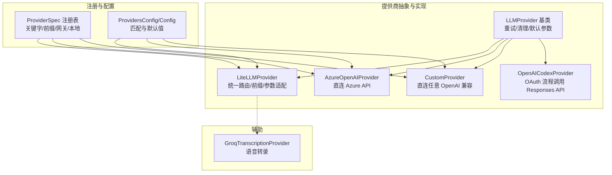
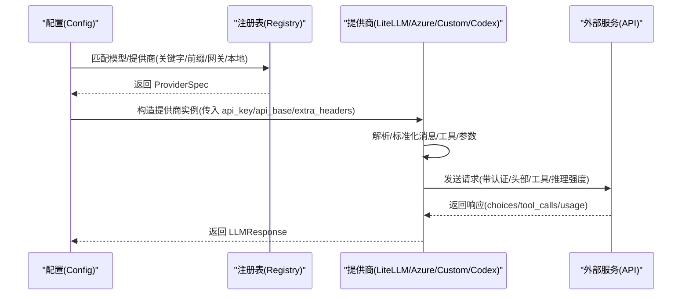
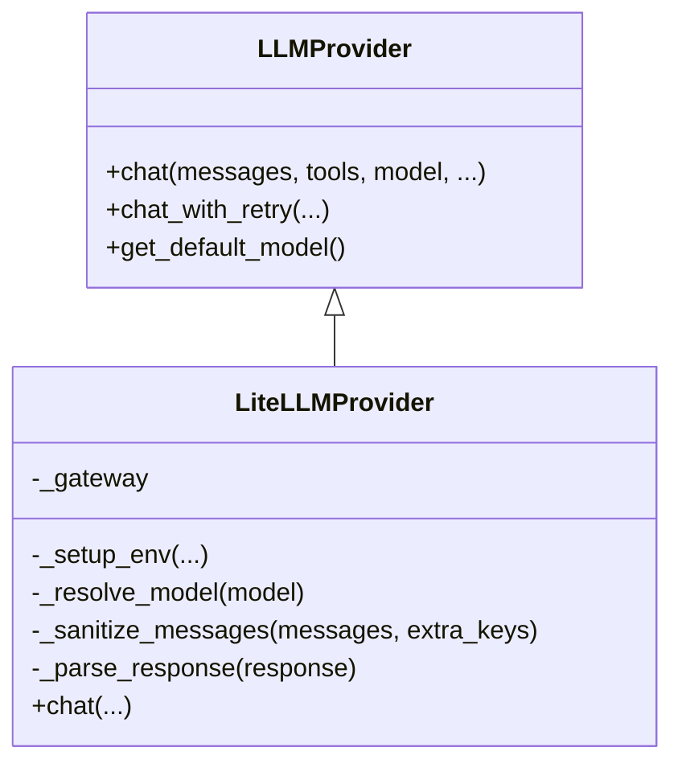
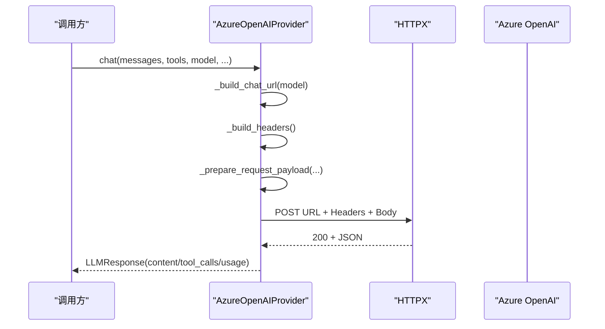
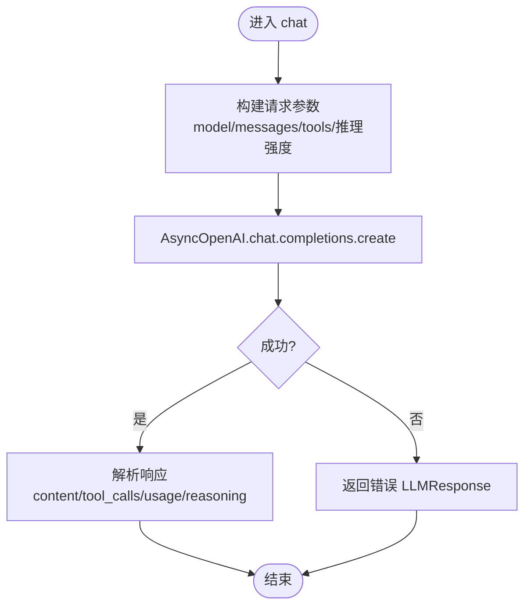
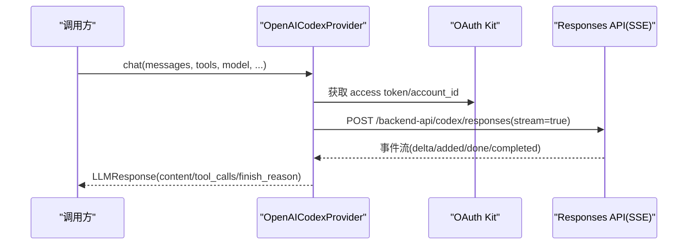
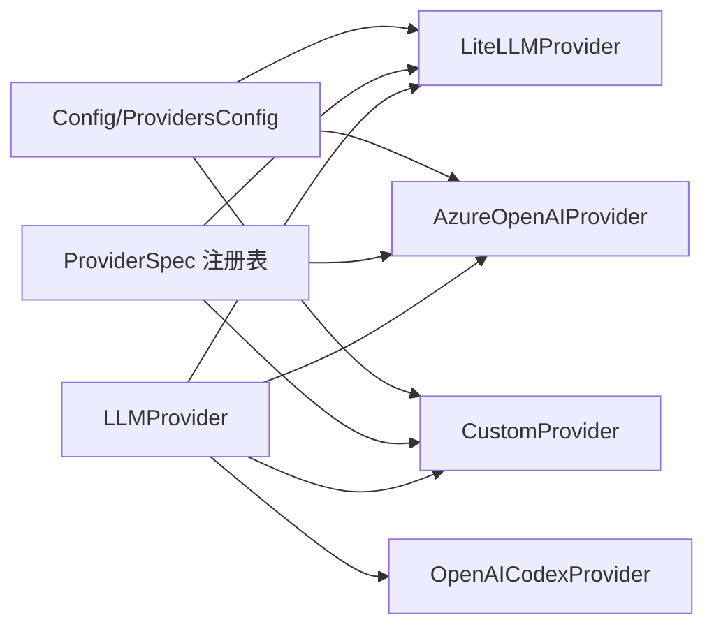

# 提供商集成

<cite>
**本文引用的文件**
- [nanobot/providers/base.py](file://nanobot/providers/base.py)
- [nanobot/providers/registry.py](file://nanobot/providers/registry.py)
- [nanobot/providers/litellm_provider.py](file://nanobot/providers/litellm_provider.py)
- [nanobot/providers/azure_openai_provider.py](file://nanobot/providers/azure_openai_provider.py)
- [nanobot/providers/custom_provider.py](file://nanobot/providers/custom_provider.py)
- [nanobot/providers/openai_codex_provider.py](file://nanobot/providers/openai_codex_provider.py)
- [nanobot/providers/transcription.py](file://nanobot/providers/transcription.py)
- [nanobot/config/schema.py](file://nanobot/config/schema.py)
- [tests/test_azure_openai_provider.py](file://tests/test_azure_openai_provider.py)
- [tests/test_provider_retry.py](file://tests/test_provider_retry.py)
- [README.md](file://README.md)
</cite>

## 目录
1. [简介](#简介)
2. [项目结构](#项目结构)
3. [核心组件](#核心组件)
4. [架构总览](#架构总览)
5. [详细组件分析](#详细组件分析)
6. [依赖分析](#依赖分析)
7. [性能考量](#性能考量)
8. [故障排查指南](#故障排查指南)
9. [结论](#结论)
10. [附录](#附录)

## 简介
本文件面向 LLM 提供商集成，系统化阐述抽象设计、接口规范与集成模式。文档覆盖 OpenRouter、Azure OpenAI、Custom Provider、LiteLLM 等多种集成路径，并给出自定义提供商开发指南（认证、调用、错误处理）、配置项、性能特性与成本考量，以及语音转录与多模态支持说明。目标是帮助开发者快速、安全地接入并扩展多提供商能力。

## 项目结构
提供商相关代码集中在 nanobot/providers 下，采用“抽象基类 + 多实现 + 注册表 + 配置”的分层设计：
- 抽象与通用：LLMProvider 基类、响应数据结构、重试与清理逻辑
- 实现层：LiteLLMProvider、AzureOpenAIProvider、CustomProvider、OpenAICodexProvider
- 注册与匹配：ProviderSpec 注册表，按关键字/前缀/网关/本地部署自动匹配
- 配置：ProvidersConfig 与 Config 的匹配逻辑，支持环境变量与默认值
- 辅助：语音转录（Groq）

图表来源
- [nanobot/providers/base.py:69-271](file://nanobot/providers/base.py#L69-L271)
- [nanobot/providers/litellm_provider.py:27-349](file://nanobot/providers/litellm_provider.py#L27-L349)
- [nanobot/providers/azure_openai_provider.py:17-213](file://nanobot/providers/azure_openai_provider.py#L17-L213)
- [nanobot/providers/custom_provider.py:14-63](file://nanobot/providers/custom_provider.py#L14-L63)
- [nanobot/providers/openai_codex_provider.py:20-318](file://nanobot/providers/openai_codex_provider.py#L20-L318)
- [nanobot/providers/registry.py:19-466](file://nanobot/providers/registry.py#L19-L466)
- [nanobot/config/schema.py:259-449](file://nanobot/config/schema.py#L259-L449)
- [nanobot/providers/transcription.py:10-65](file://nanobot/providers/transcription.py#L10-L65)

章节来源
- [nanobot/providers/base.py:69-271](file://nanobot/providers/base.py#L69-L271)
- [nanobot/providers/registry.py:19-466](file://nanobot/providers/registry.py#L19-L466)
- [nanobot/config/schema.py:259-449](file://nanobot/config/schema.py#L259-L449)

## 核心组件
- LLMProvider 抽象基类
  - 统一接口：chat(...)、chat_with_retry(...)、get_default_model(...)
  - 默认生成参数：GenerationSettings（温度、最大 token、推理强度）
  - 请求清理：空内容与非法键过滤、消息标准化
  - 错误处理：瞬时错误标记、指数退避重试
- LLMResponse 数据结构
  - content、tool_calls、finish_reason、usage、reasoning_content、thinking_blocks
- ProviderSpec 注册表
  - 关键字匹配、前缀/去重前缀、网关/本地检测、OAuth 标记、默认 API Base、提示缓存支持等
- 配置与匹配
  - ProvidersConfig 定义各提供商字段；Config._match_provider 按优先级匹配（显式前缀 > 关键字 > 本地回退 > 网关）

章节来源
- [nanobot/providers/base.py:12-271](file://nanobot/providers/base.py#L12-L271)
- [nanobot/providers/registry.py:19-110](file://nanobot/providers/registry.py#L19-L110)
- [nanobot/config/schema.py:259-449](file://nanobot/config/schema.py#L259-L449)

## 架构总览
下图展示从配置到具体提供商调用的关键流程，以及 LiteLLM 的路由与参数适配。

图表来源
- [nanobot/config/schema.py:365-449](file://nanobot/config/schema.py#L365-L449)
- [nanobot/providers/registry.py:407-466](file://nanobot/providers/registry.py#L407-L466)
- [nanobot/providers/litellm_provider.py:209-282](file://nanobot/providers/litellm_provider.py#L209-L282)
- [nanobot/providers/azure_openai_provider.py:114-163](file://nanobot/providers/azure_openai_provider.py#L114-L163)
- [nanobot/providers/custom_provider.py:26-44](file://nanobot/providers/custom_provider.py#L26-L44)
- [nanobot/providers/openai_codex_provider.py:27-82](file://nanobot/providers/openai_codex_provider.py#L27-L82)

## 详细组件分析

### LiteLLMProvider（统一多提供商）
- 设计要点
  - 通过 ProviderSpec 自动注入环境变量、前缀与默认 API Base
  - 支持网关/本地/标准提供商三类路由策略
  - 参数适配：max_tokens 规范化、工具调用合并、Anthropic 思维块保留、提示缓存注入
  - 工具调用 ID 正规化，避免严格提供商拒绝
- 关键流程
  - 模型解析：网关模式直接加前缀；标准模式按 ProviderSpec 加前缀或规范化显式前缀
  - 请求准备：消息键裁剪、空内容清洗、工具调用合并、推理强度 drop_params
  - 响应解析：多 choice 合并 tool_calls、usage 字段映射、reasoning/thinking 提取
- 适用场景
  - 多提供商统一接入、需要路由与参数适配的场景

图表来源
- [nanobot/providers/base.py:69-271](file://nanobot/providers/base.py#L69-L271)
- [nanobot/providers/litellm_provider.py:27-349](file://nanobot/providers/litellm_provider.py#L27-L349)

章节来源
- [nanobot/providers/litellm_provider.py:27-349](file://nanobot/providers/litellm_provider.py#L27-L349)
- [nanobot/providers/registry.py:68-110](file://nanobot/providers/registry.py#L68-L110)

### AzureOpenAIProvider（Azure 直连）
- 设计要点
  - 固定 API 版本 2024-10-21，使用 api-key 头部
  - 模型名作为部署名拼接 URL，max_completion_tokens 替代 max_tokens
  - 温度支持受部署类型限制（如 gpt-5/o1/o3/o4 不支持温度）
- 关键流程
  - URL 构建：api_base + /openai/deployments/{model}/chat/completions?api-version=2024-10-21
  - 请求体：消息标准化、工具与推理强度注入
  - 响应解析：tool_calls 合并与 usage 映射

图表来源
- [nanobot/providers/azure_openai_provider.py:50-163](file://nanobot/providers/azure_openai_provider.py#L50-L163)

章节来源
- [nanobot/providers/azure_openai_provider.py:17-213](file://nanobot/providers/azure_openai_provider.py#L17-L213)
- [tests/test_azure_openai_provider.py:1-399](file://tests/test_azure_openai_provider.py#L1-L399)

### CustomProvider（任意 OpenAI 兼容直连）
- 设计要点
  - 直连任意 OpenAI 兼容端点，绕过 LiteLLM
  - 会话亲和头稳定后端缓存局部性
  - 工具调用参数修复（JSON 字符串解析）
- 适用场景
  - 本地/私有部署、边缘网关、自建兼容服务

图表来源
- [nanobot/providers/custom_provider.py:26-58](file://nanobot/providers/custom_provider.py#L26-L58)

章节来源
- [nanobot/providers/custom_provider.py:14-63](file://nanobot/providers/custom_provider.py#L14-L63)

### OpenAICodexProvider（OAuth 登录 + Responses API）
- 设计要点
  - 使用 OAuth 获取 token，调用 Responses API（SSE 流式）
  - 消息与工具格式转换、提示缓存键生成、SSE 事件解析
  - SSL 证书失败时自动降级重试
- 适用场景
  - 需要 Codex 能力但不暴露真实 API Key 的场景

图表来源
- [nanobot/providers/openai_codex_provider.py:105-304](file://nanobot/providers/openai_codex_provider.py#L105-L304)

章节来源
- [nanobot/providers/openai_codex_provider.py:20-318](file://nanobot/providers/openai_codex_provider.py#L20-L318)

### 语音转录与多模态支持
- 语音转录
  - GroqTranscriptionProvider 使用 Groq Whisper 接口进行转录
  - 需配置 GROQ_API_KEY 或环境变量
- 多模态
  - OpenAI Codex 在消息中支持图片输入（image_url），并将其转换为 Codex 输入项
  - LiteLLMProvider 对 Anthropic 的 thinking_blocks 进行额外保留

章节来源
- [nanobot/providers/transcription.py:10-65](file://nanobot/providers/transcription.py#L10-L65)
- [nanobot/providers/openai_codex_provider.py:197-214](file://nanobot/providers/openai_codex_provider.py#L197-L214)
- [nanobot/providers/litellm_provider.py:163-168](file://nanobot/providers/litellm_provider.py#L163-L168)

## 依赖分析
- 抽象与实现耦合
  - 所有提供商均继承 LLMProvider，确保统一接口与默认行为
  - LiteLLMProvider 依赖注册表进行模型前缀与环境变量注入
- 配置与匹配
  - Config._match_provider 依据 ProviderSpec 顺序进行匹配，优先显式前缀，其次关键字，再本地回退，最后网关
- 测试验证
  - AzureOpenAIProvider 单测覆盖 URL 构建、请求体准备、工具调用、错误处理等
  - 重试机制单测验证瞬时错误重试与非瞬时错误短路

图表来源
- [nanobot/providers/base.py:69-271](file://nanobot/providers/base.py#L69-L271)
- [nanobot/providers/registry.py:68-110](file://nanobot/providers/registry.py#L68-L110)
- [nanobot/config/schema.py:365-449](file://nanobot/config/schema.py#L365-L449)

章节来源
- [nanobot/providers/registry.py:407-466](file://nanobot/providers/registry.py#L407-L466)
- [nanobot/config/schema.py:365-449](file://nanobot/config/schema.py#L365-L449)
- [tests/test_azure_openai_provider.py:1-399](file://tests/test_azure_openai_provider.py#L1-L399)
- [tests/test_provider_retry.py:1-126](file://tests/test_provider_retry.py#L1-L126)

## 性能考量
- 重试与退避
  - LLMProvider.chat_with_retry 对瞬时错误（如 429/5xx/超时）按 1s/2s/4s 退避重试，减少抖动对上游的影响
- 参数适配
  - LiteLLMProvider 将 max_tokens 至少设为 1，避免被拒绝；drop_params 丢弃不被特定模型支持的参数
- 缓存控制
  - 对支持提示缓存的提供商（如 Anthropic/OpenRouter），注入 cache_control ephemeral，提升重复提示命中率
- 本地部署
  - vLLM/Ollama 本地部署可显著降低网络延迟与带宽成本，适合内网或边缘场景

章节来源
- [nanobot/providers/base.py:187-266](file://nanobot/providers/base.py#L187-L266)
- [nanobot/providers/litellm_provider.py:119-151](file://nanobot/providers/litellm_provider.py#L119-L151)
- [nanobot/providers/registry.py:344-379](file://nanobot/providers/registry.py#L344-L379)

## 故障排查指南
- 常见错误与定位
  - 瞬时错误：429/502/503/timeout 等会被自动重试；若持续出现，检查上游配额与限流策略
  - 认证失败：确认 api_key 是否正确、是否符合提供商要求（Azure 使用 api-key 头）
  - 模型/前缀问题：LiteLLMProvider 会根据 ProviderSpec 自动加前缀；若报“未知模型”，检查模型关键字或显式前缀
  - Azure 特性：gpt-5/o1/o3/o4 不支持 temperature；推理强度与温度互斥
- 日志与调试
  - 提供商内部捕获异常并以 content 返回错误信息，便于上层统一处理
  - 可开启更详细的日志级别以观察请求/响应细节
- 单元测试参考
  - AzureOpenAIProvider 测试覆盖 URL 构建、请求体准备、工具调用、错误码与连接异常
  - 重试机制测试覆盖瞬时错误重试、非瞬时错误短路、取消错误透传

章节来源
- [tests/test_azure_openai_provider.py:1-399](file://tests/test_azure_openai_provider.py#L1-L399)
- [tests/test_provider_retry.py:1-126](file://tests/test_provider_retry.py#L1-L126)
- [nanobot/providers/azure_openai_provider.py:114-163](file://nanobot/providers/azure_openai_provider.py#L114-L163)
- [nanobot/providers/base.py:187-266](file://nanobot/providers/base.py#L187-L266)

## 结论
通过抽象基类 + 注册表 + 配置匹配的设计，系统实现了对多家 LLM 提供商的一致接入与灵活切换。LiteLLMProvider 提供强大的路由与参数适配能力，Azure/Custom/Codex 等直连实现满足特定场景需求。配合重试、缓存与本地部署策略，可在稳定性、性能与成本之间取得良好平衡。建议在新场景下优先使用 LiteLLMProvider，必要时再引入直连实现。

## 附录

### 配置选项与最佳实践
- 配置项
  - ProvidersConfig：每个提供商的 apiKey、apiBase、extraHeaders
  - Config.agents.defaults：默认模型、推理强度、上下文窗口等
- 最佳实践
  - 显式前缀优先：当模型带有明确提供商前缀时，优先按前缀匹配
  - 网关优先：OpenRouter/AiHubMix 等网关具备更强的路由能力
  - 本地回退：Ollama/vLLM 等本地部署适合内网与低延迟场景
  - 环境变量：LiteLLMProvider 会在网关模式下直接写入环境变量，标准提供商使用 setdefault 保持全局干净
- 参考
  - [README.md 提供商一览与获取方式:777-798](file://README.md#L777-L798)

章节来源
- [nanobot/config/schema.py:259-449](file://nanobot/config/schema.py#L259-L449)
- [nanobot/providers/registry.py:68-110](file://nanobot/providers/registry.py#L68-L110)
- [README.md:777-798](file://README.md#L777-L798)