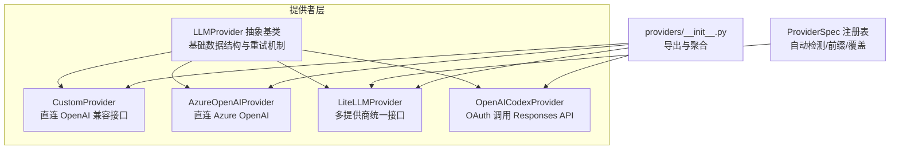
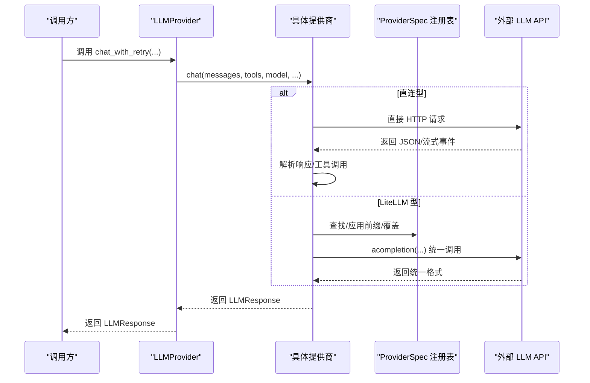
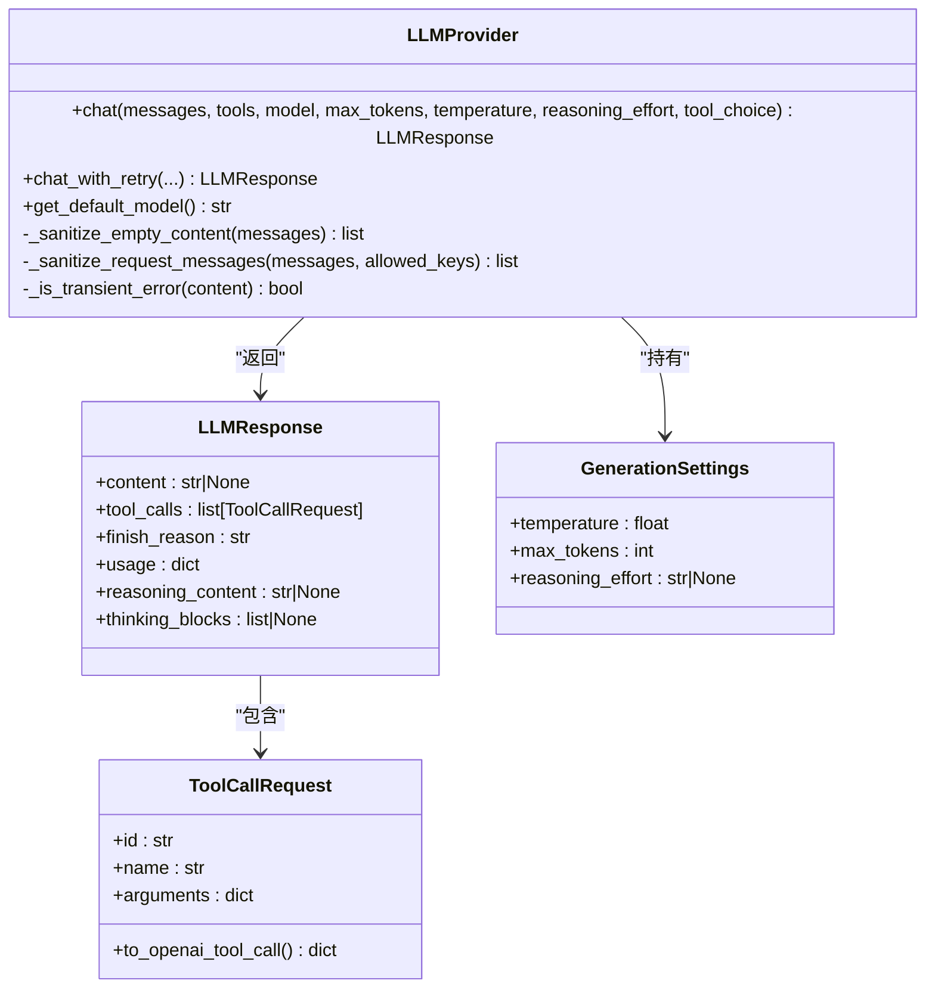
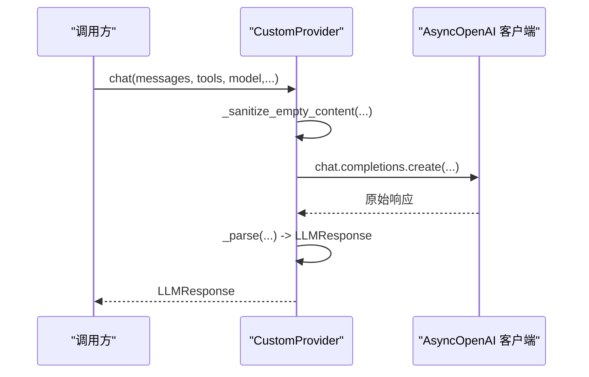
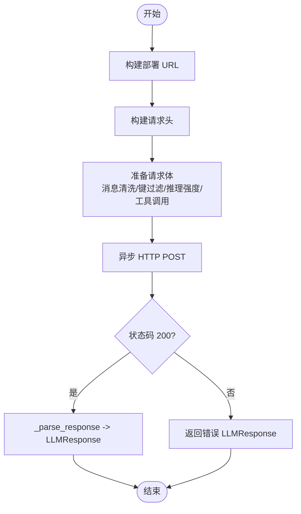
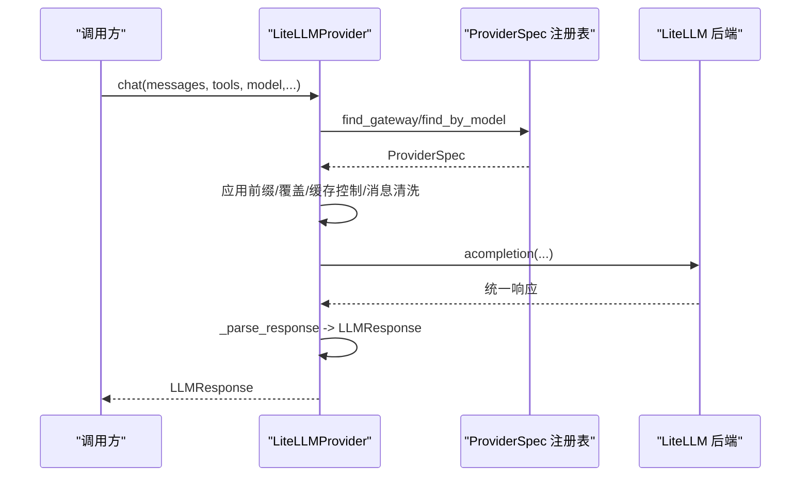
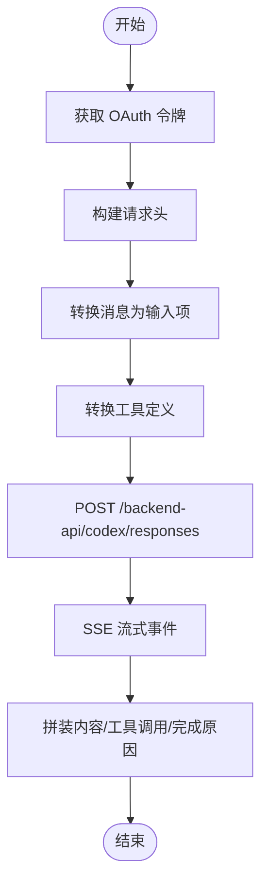
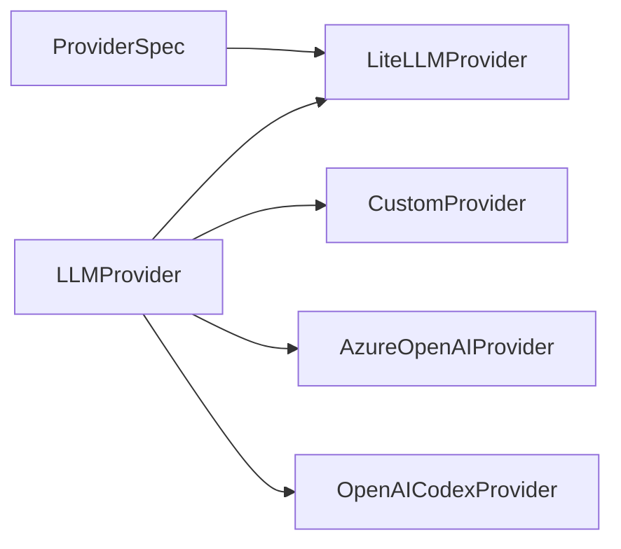

# 自定义提供商

<cite>
**本文引用的文件**
- [基础提供者接口与重试机制](file://nanobot/providers/base.py)
- [自定义直连提供商（OpenAI兼容）](file://nanobot/providers/custom_provider.py)
- [Azure OpenAI 直连提供商](file://nanobot/providers/azure_openai_provider.py)
- [LiteLLM 多提供商统一接口](file://nanobot/providers/litellm_provider.py)
- [OpenAI Codex OAuth提供商](file://nanobot/providers/openai_codex_provider.py)
- [提供商注册表与匹配逻辑](file://nanobot/providers/registry.py)
- [提供商初始化与导出](file://nanobot/providers/__init__.py)
- [提供商重试测试](file://tests/test_provider_retry.py)
- [Azure OpenAI 提供商测试](file://tests/test_azure_openai_provider.py)
- [配置模式与字段定义](file://nanobot/config/schema.py)
</cite>

## 目录
1. [简介](#简介)
2. [项目结构](#项目结构)
3. [核心组件](#核心组件)
4. [架构总览](#架构总览)
5. [详细组件分析](#详细组件分析)
6. [依赖关系分析](#依赖关系分析)
7. [性能考量](#性能考量)
8. [故障排查指南](#故障排查指南)
9. [结论](#结论)
10. [附录：开发步骤与最佳实践](#附录开发步骤与最佳实践)

## 简介
本指南面向希望在系统中新增自定义 LLM 提供商的开发者，围绕 LLMProvider 抽象基类展开，解释如何继承并实现以下能力：
- 必须实现的方法与职责边界
- 可选扩展功能（如特殊参数、OAuth、直连 vs 代理）
- 认证处理、API 调用与响应解析
- 错误处理与重试机制
- 特殊模型参数与提供商特性
- 测试策略与调试技巧

## 项目结构
与“自定义提供商”相关的核心模块位于 nanobot/providers 下，包含抽象基类、多种具体提供商实现以及统一的提供商注册表与导出入口。

图表来源
- [基础提供者接口与重试机制:69-271](file://nanobot/providers/base.py#L69-L271)
- [自定义直连提供商（OpenAI兼容）:14-63](file://nanobot/providers/custom_provider.py#L14-L63)
- [Azure OpenAI 直连提供商:17-213](file://nanobot/providers/azure_openai_provider.py#L17-L213)
- [LiteLLM 多提供商统一接口:27-349](file://nanobot/providers/litellm_provider.py#L27-L349)
- [OpenAI Codex OAuth提供商:20-318](file://nanobot/providers/openai_codex_provider.py#L20-L318)
- [提供商注册表与匹配逻辑:19-466](file://nanobot/providers/registry.py#L19-L466)
- [提供商初始化与导出:1-9](file://nanobot/providers/__init__.py#L1-L9)

章节来源
- [基础提供者接口与重试机制:1-271](file://nanobot/providers/base.py#L1-L271)
- [提供商注册表与匹配逻辑:1-466](file://nanobot/providers/registry.py#L1-L466)
- [提供商初始化与导出:1-9](file://nanobot/providers/__init__.py#L1-L9)

## 核心组件
- LLMProvider 抽象基类
  - 定义统一的 chat 接口、LLMResponse/ToolCallRequest 数据结构、GenerationSettings 默认参数
  - 内置消息清洗、请求键过滤、重试策略与错误标记
- ProviderSpec 注册表
  - 描述提供商元信息、前缀规则、网关/本地识别、额外环境变量、模型覆盖等
- 具体提供商实现
  - 直连型：CustomProvider、AzureOpenAIProvider
  - 统一接口型：LiteLLMProvider
  - OAuth 型：OpenAICodexProvider

章节来源
- [基础提供者接口与重试机制:69-271](file://nanobot/providers/base.py#L69-L271)
- [提供商注册表与匹配逻辑:19-466](file://nanobot/providers/registry.py#L19-L466)

## 架构总览
下图展示了“调用方”到“具体提供商”的典型交互路径，以及 LiteLLM 的路由与参数适配。

图表来源
- [基础提供者接口与重试机制:192-266](file://nanobot/providers/base.py#L192-L266)
- [LiteLLM 多提供商统一接口:209-282](file://nanobot/providers/litellm_provider.py#L209-L282)
- [Azure OpenAI 直连提供商:114-163](file://nanobot/providers/azure_openai_provider.py#L114-L163)

## 详细组件分析

### LLMProvider 抽象基类与重试机制
- 必须实现
  - chat(...): 发送聊天请求，返回 LLMResponse
  - get_default_model(): 返回默认模型标识
- 可选扩展
  - 消息清洗与键过滤：_sanitize_empty_content、_sanitize_request_messages
  - 重试策略：chat_with_retry，内置错误标记集合与固定退避序列
- 关键数据结构
  - LLMResponse：内容、工具调用、finish_reason、usage、推理内容等
  - ToolCallRequest：工具调用请求，支持提供商特定字段
  - GenerationSettings：温度、最大输出长度、推理强度等默认值

图表来源
- [基础提供者接口与重试机制:12-271](file://nanobot/providers/base.py#L12-L271)

章节来源
- [基础提供者接口与重试机制:69-271](file://nanobot/providers/base.py#L69-L271)

### 直连型提供商：CustomProvider（OpenAI 兼容）
- 特点
  - 直接使用 OpenAI 客户端，绕过 LiteLLM
  - 支持推理强度、工具调用、消息清洗
  - 通过会话亲和头提升缓存命中
- 认证与调用
  - 从构造函数接收 api_key 与 api_base，默认模型
  - 调用 _client.chat.completions.create(...)
  - 解析返回为 LLMResponse，含 usage 与推理内容
- 适用场景
  - 自建或第三方 OpenAI 兼容服务；需要细粒度控制参数

图表来源
- [自定义直连提供商（OpenAI兼容）:26-58](file://nanobot/providers/custom_provider.py#L26-L58)

章节来源
- [自定义直连提供商（OpenAI兼容）:14-63](file://nanobot/providers/custom_provider.py#L14-L63)

### 直连型提供商：AzureOpenAIProvider（API 版本 2024-10-21）
- 特点
  - 直连 Azure OpenAI，硬编码 API 版本
  - 使用 api-key 头，部署名作为模型
  - 使用 max_completion_tokens，支持推理强度
- 认证与调用
  - 构造时校验 api_key 与 api_base
  - 构建 URL（openai/deployments/{deployment}/chat/completions?api-version=2024-10-21）
  - 构建 headers（Content-Type、api-key、亲和性头）
  - 准备 payload（消息清洗、键过滤、推理强度、工具调用）
  - 异步 HTTP 调用，解析响应为 LLMResponse
- 适用场景
  - Azure OpenAI 环境；需要严格遵循 2024-10-21 参数语义

图表来源
- [Azure OpenAI 直连提供商:50-163](file://nanobot/providers/azure_openai_provider.py#L50-L163)

章节来源
- [Azure OpenAI 直连提供商:17-213](file://nanobot/providers/azure_openai_provider.py#L17-L213)

### 统一接口型提供商：LiteLLMProvider
- 特点
  - 通过 LiteLLM 聚合多家提供商
  - 基于 ProviderSpec 进行前缀、覆盖、提示缓存等适配
  - 支持额外消息键（如 Anthropic 思维块）、工具调用 ID 规范化
- 认证与调用
  - 优先根据配置/密钥/基础地址识别网关/本地
  - 设置环境变量（或直接传参），解析模型前缀
  - 清洗消息、注入缓存控制、应用模型覆盖
  - 调用 acompletion(...)，解析响应为 LLMResponse
- 适用场景
  - 需要同时对接多家提供商且统一管理；对参数差异进行自动适配

图表来源
- [LiteLLM 多提供商统一接口:27-349](file://nanobot/providers/litellm_provider.py#L27-L349)
- [提供商注册表与匹配逻辑:407-466](file://nanobot/providers/registry.py#L407-L466)

章节来源
- [LiteLLM 多提供商统一接口:27-349](file://nanobot/providers/litellm_provider.py#L27-L349)
- [提供商注册表与匹配逻辑:19-466](file://nanobot/providers/registry.py#L19-L466)

### OAuth 型提供商：OpenAICodexProvider
- 特点
  - 使用 OAuth 获取访问令牌，调用 Responses API
  - 支持 SSE 流式输出、工具调用拼装、提示缓存键
- 认证与调用
  - 通过 oauth_cli_kit 获取账户与令牌
  - 构建请求头（Authorization、chatgpt-account-id、Beta 头等）
  - 将消息转换为 Codex 输入项，按需转换工具定义
  - 流式消费事件，组装内容与工具调用，映射完成原因
- 适用场景
  - 需要通过 OAuth 访问受限接口；支持流式与工具调用

图表来源
- [OpenAI Codex OAuth提供商:20-318](file://nanobot/providers/openai_codex_provider.py#L20-L318)

章节来源
- [OpenAI Codex OAuth提供商:20-318](file://nanobot/providers/openai_codex_provider.py#L20-L318)

## 依赖关系分析
- ProviderSpec 与 LiteLLMProvider 的耦合
  - LiteLLMProvider 在初始化阶段读取 ProviderSpec，用于环境变量设置、模型前缀、覆盖、提示缓存等
- 直连型提供商与注册表的解耦
  - Custom/Azure 直连提供商不依赖注册表；它们通过构造参数与内部逻辑处理认证与调用
- 重试机制的通用性
  - 所有提供商共享 LLMProvider 的重试策略，通过错误标记判断是否重试

图表来源
- [LiteLLM 多提供商统一接口:27-349](file://nanobot/providers/litellm_provider.py#L27-L349)
- [提供商注册表与匹配逻辑:19-466](file://nanobot/providers/registry.py#L19-L466)
- [基础提供者接口与重试机制:69-271](file://nanobot/providers/base.py#L69-L271)

章节来源
- [LiteLLM 多提供商统一接口:27-349](file://nanobot/providers/litellm_provider.py#L27-L349)
- [提供商注册表与匹配逻辑:19-466](file://nanobot/providers/registry.py#L19-L466)
- [基础提供者接口与重试机制:69-271](file://nanobot/providers/base.py#L69-L271)

## 性能考量
- 直连 vs 代理
  - 直连型减少中间层开销，适合可控的兼容服务；代理型通过 LiteLLM 统一路由，便于扩展与参数适配
- 消息清洗与键过滤
  - 避免无效内容导致 400 错误，减少重试次数
- 重试策略
  - 固定退避序列与错误标记，避免对瞬时错误过度重试
- 工具调用与流式
  - 流式事件与工具调用拼装需注意内存与解析成本

[本节为通用指导，不直接分析具体文件]

## 故障排查指南
- 重试行为验证
  - 使用测试用例中的脚手架提供商，模拟不同错误类型与重试次数，验证重试策略与参数传递
- Azure OpenAI 常见问题
  - 验证 api_key 与 api_base 是否正确；确认部署名为 model 字段；检查 2024-10-21 参数语义（max_completion_tokens、推理强度）
- OAuth 访问
  - 确认 OAuth 令牌有效；检查证书验证失败回退逻辑；关注 SSE 事件解析与完成原因映射
- 参数覆盖与前缀
  - 对于 LiteLLM 型提供商，确认模型覆盖规则与前缀是否符合预期

章节来源
- [提供商重试测试:1-126](file://tests/test_provider_retry.py#L1-L126)
- [Azure OpenAI 提供商测试:1-399](file://tests/test_azure_openai_provider.py#L1-L399)

## 结论
通过继承 LLMProvider 并实现 chat 与 get_default_model，即可快速接入新的 LLM 提供商。对于需要统一管理多家提供商的场景，推荐使用 LiteLLMProvider 并配合 ProviderSpec；对于需要严格遵循特定 API 语义或直连兼容服务的场景，可采用直连型实现。结合内置重试机制与测试用例，能够稳定地处理瞬时错误与参数差异。

[本节为总结，不直接分析具体文件]

## 附录：开发步骤与最佳实践

### 开发步骤
1. 选择实现方式
   - 若需直连 OpenAI 兼容接口：参考 CustomProvider
   - 若需严格遵循特定 API（如 Azure 2024-10-21）：参考 AzureOpenAIProvider
   - 若需统一多家提供商：参考 LiteLLMProvider，并在注册表中添加 ProviderSpec
   - 若需 OAuth：参考 OpenAICodexProvider 的认证与流式处理
2. 实现必要方法
   - chat(...): 构建请求、发送调用、解析响应为 LLMResponse
   - get_default_model(): 返回默认模型标识
3. 处理认证与配置
   - 直连型：从构造函数接收 api_key/api_base
   - LiteLLM 型：通过 ProviderSpec 设置环境变量或直接传参
   - OAuth 型：通过外部库获取令牌并注入请求头
4. 处理特殊参数与提供商特性
   - 推理强度、工具调用、消息清洗、键过滤、提示缓存控制
5. 编写测试
   - 使用测试用例风格模拟错误与成功路径，覆盖重试、参数传递、响应解析

### 最佳实践
- 错误处理与重试
  - 使用 LLMProvider 的重试机制，确保对瞬时错误进行退避重试
  - 明确区分瞬时错误与永久错误，避免无意义重试
- 参数传递与默认值
  - 优先使用 provider.generation 的默认值，允许调用方显式覆盖
- 响应解析一致性
  - 统一返回 LLMResponse，包含 content/tool_calls/finish_reason/usage
- 消息与工具调用
  - 使用消息清洗与键过滤，避免无效内容导致 400 错误
  - 对工具调用 ID 进行规范化，保证跨提供商一致性

### 示例参考路径
- 直连 OpenAI 兼容：[自定义直连提供商（OpenAI兼容）:14-63](file://nanobot/providers/custom_provider.py#L14-L63)
- Azure OpenAI 2024-10-21：[Azure OpenAI 直连提供商:17-213](file://nanobot/providers/azure_openai_provider.py#L17-L213)
- LiteLLM 多提供商：[LiteLLM 多提供商统一接口:27-349](file://nanobot/providers/litellm_provider.py#L27-L349)
- OAuth 流式调用：[OpenAI Codex OAuth提供商:20-318](file://nanobot/providers/openai_codex_provider.py#L20-L318)
- 注册表与匹配：[提供商注册表与匹配逻辑:19-466](file://nanobot/providers/registry.py#L19-L466)
- 重试测试模板：[提供商重试测试:1-126](file://tests/test_provider_retry.py#L1-L126)
- Azure 测试用例：[Azure OpenAI 提供商测试:1-399](file://tests/test_azure_openai_provider.py#L1-L399)