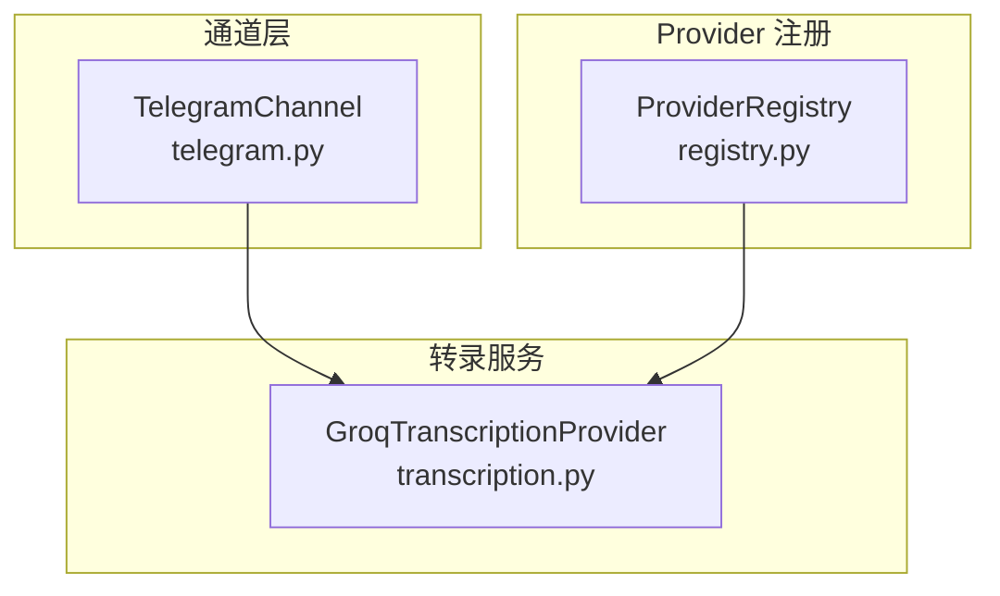
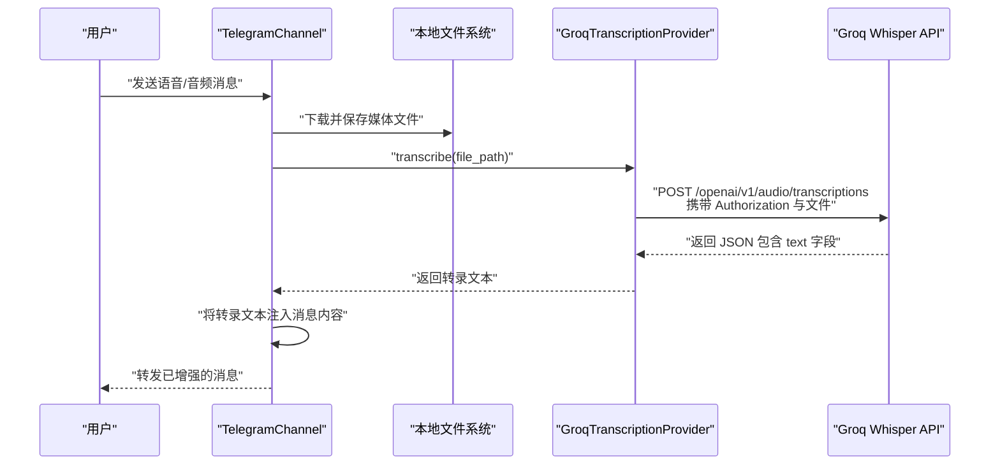
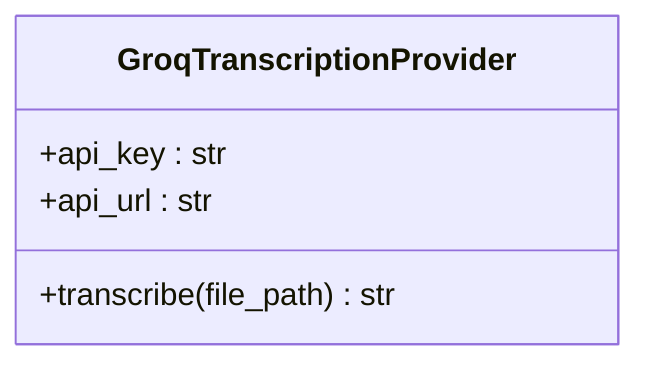
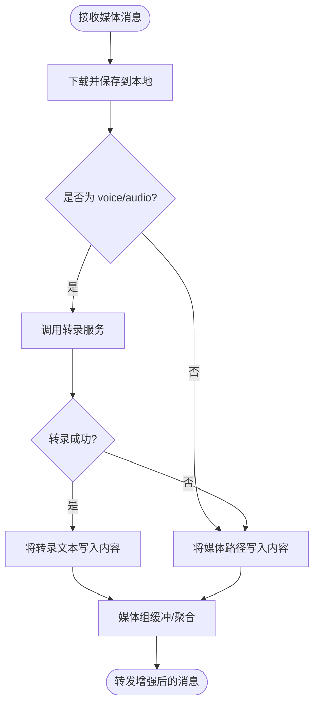
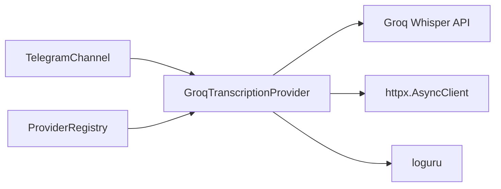

# 语音转录提供商

<cite>
**本文引用的文件**
- [transcription.py](file://nanobot/providers/transcription.py)
- [base.py](file://nanobot/providers/base.py)
- [registry.py](file://nanobot/providers/registry.py)
- [telegram.py](file://nanobot/channels/telegram.py)
- [schema.py](file://nanobot/config/schema.py)
- [README.md](file://README.md)
</cite>

## 目录
1. [简介](#简介)
2. [项目结构](#项目结构)
3. [核心组件](#核心组件)
4. [架构总览](#架构总览)
5. [详细组件分析](#详细组件分析)
6. [依赖分析](#依赖分析)
7. [性能考虑](#性能考虑)
8. [故障排查指南](#故障排查指南)
9. [结论](#结论)
10. [附录](#附录)

## 简介
本文件面向“语音转录提供商”的技术文档，聚焦于在 AI 代理中集成语音转录能力的应用场景与实现细节。当前仓库实现了基于 Groq Whisper 的语音转录能力，并在 Telegram 频道中对语音消息进行自动转录，以增强多模态输入处理与用户体验。

- 应用场景与价值
  - 自动化语音理解：将语音消息转换为文本，便于后续由代理进行语义理解、摘要、问答等处理。
  - 多渠道接入：在 Telegram 等聊天通道中，自动下载并转录音频/语音，提升消息处理的完整性和可检索性。
  - 成本与性能平衡：通过合理的超时、错误重试与日志记录，降低异常对系统的影响，同时利用 Groq 的快速响应能力提升吞吐。

- 支持的音频格式与转录质量
  - 当前实现固定使用 whisper-large-v3 模型进行转录，该模型在准确率与速度之间取得良好平衡。
  - Telegram 侧根据媒体类型推断扩展名（如 voice/audio），并针对不同 MIME 类型选择合适的本地存储扩展名，确保后续转录兼容性。

- 配置与调用流程
  - 配置项：通过环境变量 GROQ_API_KEY 提供密钥；若未配置，转录将被跳过并记录警告。
  - 调用流程：频道层下载媒体文件后触发转录，转录服务异步上传至 Groq Whisper 接口，返回文本内容并注入到消息上下文中。

- 实现示例与参数优化建议
  - 示例路径：参见“详细组件分析”中的调用序列图与代码片段路径。
  - 参数优化：合理设置超时时间、错误重试策略、日志级别，以及在上游通道层对媒体组进行缓冲聚合，减少重复转录与网络请求。

- 多语言与实时性
  - 多语言：Groq Whisper 支持多语言转录，具体语言能力取决于其模型版本与训练数据；当前实现未显式指定语言参数，遵循默认行为。
  - 实时性：转录为异步请求，配合频道层的媒体组缓冲机制，可在用户连续发送语音片段时合并为一次处理，提升交互效率。

- 结果后处理与格式化
  - 通道层将转录结果以特定标记形式注入消息内容，便于下游代理逻辑识别与处理；同时保留原始媒体路径以便回溯或二次处理。

- 性能与成本
  - 性能：异步 HTTP 客户端、超时控制与错误日志有助于稳定吞吐；媒体组缓冲减少重复请求。
  - 成本：Groq 提供免费配额，建议结合业务量评估与限流策略，避免不必要的转录调用。

**章节来源**
- [README.md:768-776](file://README.md#L768-L776)
- [transcription.py:10-19](file://nanobot/providers/transcription.py#L10-L19)

## 项目结构
围绕语音转录的相关模块分布如下：
- providers/transcription.py：实现 Groq Whisper 转录服务，负责异步上传音频并解析返回文本。
- channels/telegram.py：在 Telegram 频道中处理媒体消息，自动下载并触发转录，将结果注入消息内容。
- providers/base.py：提供通用的 LLM Provider 抽象与重试机制（虽非转录直接继承，但体现整体设计风格）。
- providers/registry.py：注册与匹配各类 Provider 的元数据，其中包含 Groq 的路由与前缀规则。
- config/schema.py：定义配置结构（与转录无直接耦合，但体现配置体系）。

**图表来源**
- [transcription.py:10-64](file://nanobot/providers/transcription.py#L10-L64)
- [telegram.py:613-621](file://nanobot/channels/telegram.py#L613-L621)
- [registry.py:383-398](file://nanobot/providers/registry.py#L383-L398)

**章节来源**
- [transcription.py:1-64](file://nanobot/providers/transcription.py#L1-L64)
- [telegram.py:600-736](file://nanobot/channels/telegram.py#L600-L736)
- [registry.py:1-466](file://nanobot/providers/registry.py#L1-L466)

## 核心组件
- GroqTranscriptionProvider
  - 功能：封装 Groq Whisper 的转录接口，支持异步上传音频文件并返回文本。
  - 关键点：从环境变量读取 API Key；固定使用 whisper-large-v3 模型；设置请求超时；异常捕获并记录错误。
  - 返回值：成功返回文本字符串，失败返回空字符串并记录日志。

- TelegramChannel 中的转录集成
  - 功能：在收到 voice/audio 媒体时，先下载到本地，再调用转录服务；将转录结果以标记形式拼接到消息内容中。
  - 关键点：媒体组缓冲（media_group_id）用于聚合连续媒体，减少重复处理；扩展名推断保证文件类型与后续转录兼容。

- Provider 注册与路由
  - 功能：为 Groq 提供模型前缀、检测规则与显示名称等元数据，便于统一管理与匹配。
  - 关键点：Groq 使用 groq/ 前缀路由，避免重复前缀；作为标准 Provider 存在，不参与网关或本地部署检测。

**章节来源**
- [transcription.py:17-64](file://nanobot/providers/transcription.py#L17-L64)
- [telegram.py:613-621](file://nanobot/channels/telegram.py#L613-L621)
- [registry.py:383-398](file://nanobot/providers/registry.py#L383-L398)

## 架构总览
下图展示了从 Telegram 接收语音消息到转录服务调用的整体流程：

**图表来源**
- [telegram.py:613-621](file://nanobot/channels/telegram.py#L613-L621)
- [transcription.py:40-60](file://nanobot/providers/transcription.py#L40-L60)

## 详细组件分析

### GroqTranscriptionProvider 组件
- 类职责
  - 封装 Groq Whisper 的转录调用，提供异步接口。
- 关键实现要点
  - 初始化：从环境变量读取 GROQ_API_KEY，构造请求 URL。
  - 转录流程：打开文件二进制流，构造 multipart/form-data，设置 Authorization 头，发起 POST 请求，解析 JSON 并提取 text 字段。
  - 错误处理：缺少 API Key、文件不存在、HTTP 异常均会记录日志并返回空字符串。
  - 超时控制：设置为 60 秒，避免长时间阻塞。
- 数据结构与复杂度
  - 文件读取为 O(n)（n 为音频大小），网络请求受带宽与 API 延迟影响。
- 依赖关系
  - httpx.AsyncClient 用于异步 HTTP 请求。
  - loguru 用于日志记录。
- 可优化点
  - 增加对语言参数的支持（如 language 字段）以提升多语言准确性。
  - 增加重试与指数退避策略，提高稳定性。
  - 对不同音频格式进行预处理（如转码）以提升兼容性。

**图表来源**
- [transcription.py:10-64](file://nanobot/providers/transcription.py#L10-L64)

**章节来源**
- [transcription.py:17-64](file://nanobot/providers/transcription.py#L17-L64)

### TelegramChannel 与转录集成
- 流程要点
  - 下载媒体：根据媒体类型与 MIME 推断扩展名，保存到本地临时目录。
  - 条件转录：仅对 voice/audio 类型触发转录；成功则将转录文本以标记形式加入内容，否则保留媒体路径。
  - 媒体组缓冲：同一 media_group_id 的消息会被短暂缓冲并在稍后聚合处理，减少重复转录。
- 扩展名映射
  - image/audio 等常见 MIME 映射到 .jpg/.ogg/.mp3/.m4a 等扩展名，确保后续转录兼容。
- 错误处理
  - 下载失败或转录异常均记录错误并保留兜底提示，避免中断消息流转。

**图表来源**
- [telegram.py:613-621](file://nanobot/channels/telegram.py#L613-L621)
- [telegram.py:711-736](file://nanobot/channels/telegram.py#L711-L736)

**章节来源**
- [telegram.py:600-736](file://nanobot/channels/telegram.py#L600-L736)

### Provider 注册与路由
- 规则要点
  - Groq 使用 groq/ 前缀进行模型路由，避免重复前缀；作为标准 Provider 存在，不参与网关或本地部署检测。
  - 注册表提供统一的显示名称、环境变量键、默认 API Base 等元数据，便于配置与状态展示。
- 影响
  - 在需要将转录能力与其他 LLM Provider 协同时，可通过注册表统一管理与匹配。

**章节来源**
- [registry.py:383-398](file://nanobot/providers/registry.py#L383-L398)

## 依赖分析
- 组件耦合
  - TelegramChannel 与 GroqTranscriptionProvider 通过方法调用耦合，耦合点清晰且职责单一。
  - Provider 注册表与转录服务无直接耦合，但通过 Provider 元数据影响模型前缀与路由策略。
- 外部依赖
  - Groq Whisper API：转录服务的外部依赖，受网络与配额限制。
  - httpx：异步 HTTP 客户端，承担请求与响应处理。
  - loguru：统一日志输出，便于问题定位与审计。
- 循环依赖
  - 未发现循环依赖，模块边界清晰。

**图表来源**
- [telegram.py:613-621](file://nanobot/channels/telegram.py#L613-L621)
- [transcription.py:40-60](file://nanobot/providers/transcription.py#L40-L60)
- [registry.py:383-398](file://nanobot/providers/registry.py#L383-L398)

**章节来源**
- [telegram.py:600-736](file://nanobot/channels/telegram.py#L600-L736)
- [transcription.py:1-64](file://nanobot/providers/transcription.py#L1-L64)
- [registry.py:1-466](file://nanobot/providers/registry.py#L1-L466)

## 性能考虑
- 异步与超时
  - 使用 httpx.AsyncClient 进行异步请求，避免阻塞事件循环；设置 60 秒超时，平衡响应时间与稳定性。
- 媒体组缓冲
  - 同一 media_group_id 的消息在短时间内聚合处理，减少重复下载与转录请求，提升吞吐。
- 日志与可观测性
  - 对缺失 API Key、文件不存在、网络异常等情况记录日志，便于定位问题与统计失败率。
- 成本控制
  - 利用 Groq 的免费配额，结合业务量评估与限流策略，避免不必要的转录调用（例如仅对 voice/audio 类型启用）。

**章节来源**
- [transcription.py:40-60](file://nanobot/providers/transcription.py#L40-L60)
- [telegram.py:636-653](file://nanobot/channels/telegram.py#L636-L653)

## 故障排查指南
- 常见问题与处理
  - 未配置 GROQ_API_KEY：转录将被跳过并记录警告。请检查环境变量或配置文件。
  - 音频文件不存在：记录错误并返回空文本。请确认媒体下载与路径正确。
  - 网络异常或超时：记录错误并返回空文本。请检查网络连通性与防火墙设置。
  - 媒体类型不支持：当前仅对 voice/audio 触发转录，其他类型将保留媒体路径。请确认媒体类型与扩展名映射。
- 建议排查步骤
  - 检查环境变量 GROQ_API_KEY 是否正确设置。
  - 查看日志中关于转录错误的记录，定位具体异常类型。
  - 验证媒体下载路径与扩展名映射是否符合预期。
  - 在 Telegram 频道中测试语音消息，观察是否触发转录与消息内容注入。

**章节来源**
- [transcription.py:31-38](file://nanobot/providers/transcription.py#L31-L38)
- [transcription.py:62-64](file://nanobot/providers/transcription.py#L62-L64)
- [telegram.py:613-621](file://nanobot/channels/telegram.py#L613-L621)

## 结论
本项目通过 Groq Whisper 提供了高效、低成本的语音转录能力，并在 Telegram 频道中实现了自动化的语音消息处理。整体架构清晰、职责分离明确，具备良好的扩展性与可观测性。未来可在语言参数支持、重试策略与格式兼容性方面进一步优化，以满足更复杂的多语言与实时转录需求。

## 附录
- 配置与使用建议
  - 环境变量：GROQ_API_KEY（必填）
  - 业务策略：仅对 voice/audio 类型启用转录；对媒体组进行缓冲聚合；设置合理的日志级别与告警阈值。
- 相关参考
  - README 中关于 Groq 提供免费语音转录的提示与提供商列表。

**章节来源**
- [README.md:768-776](file://README.md#L768-L776)