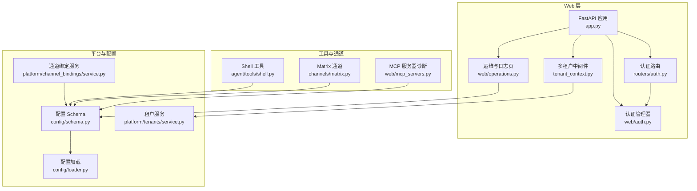
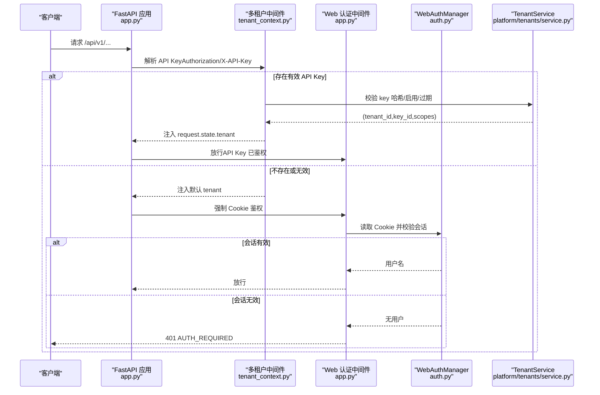
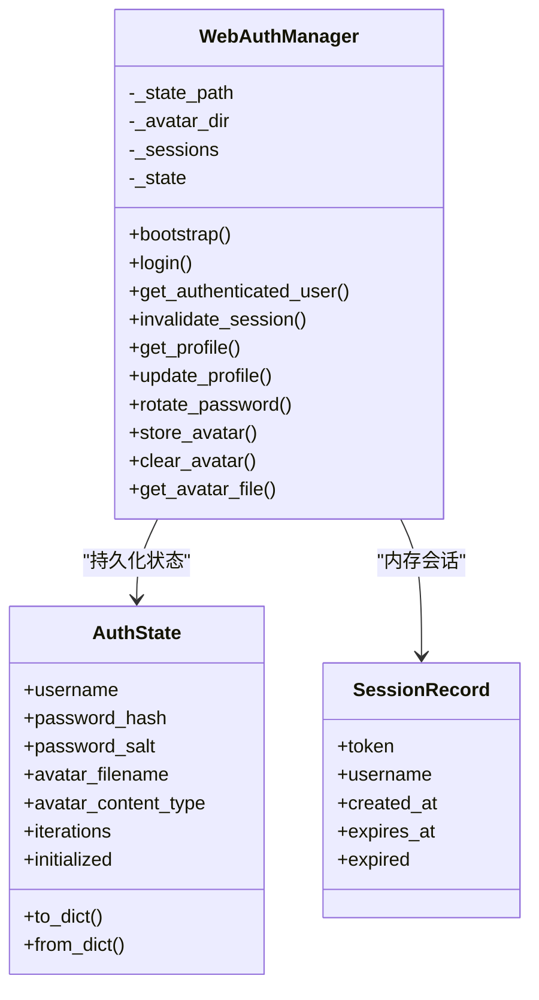
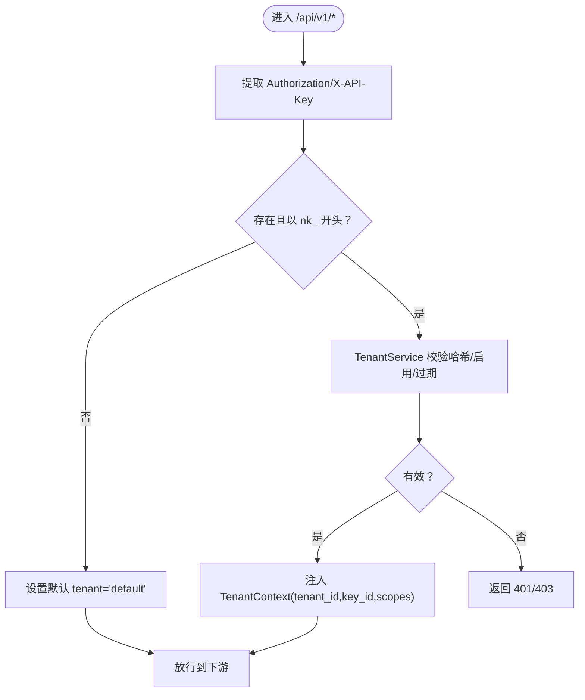
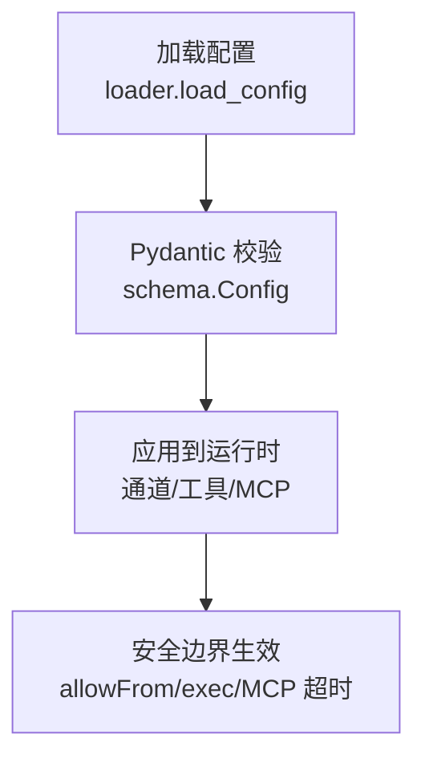
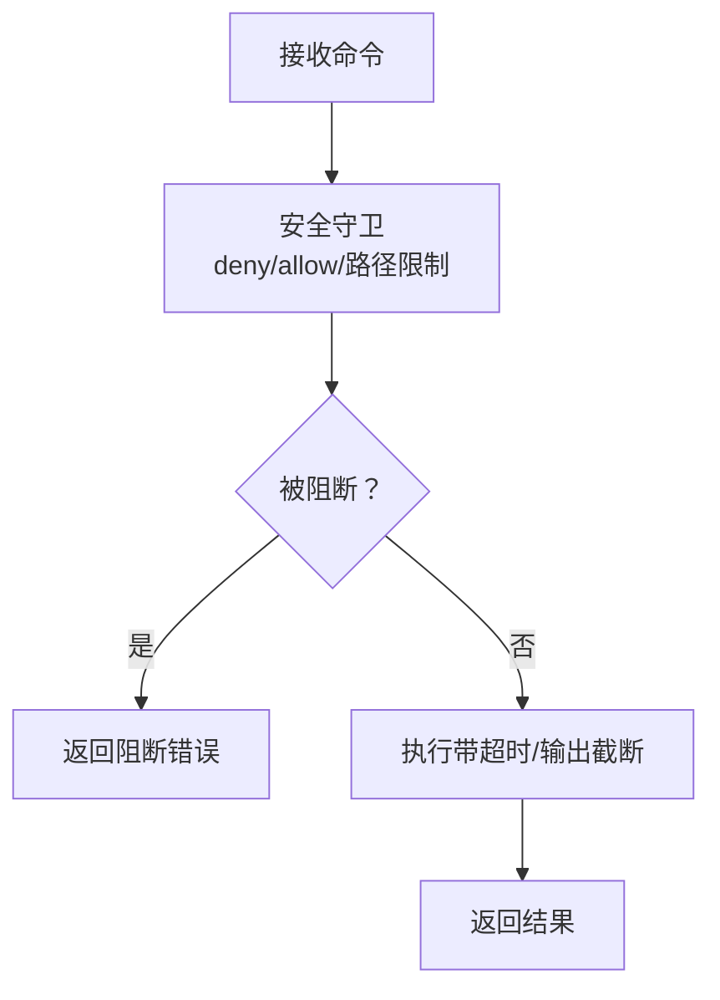
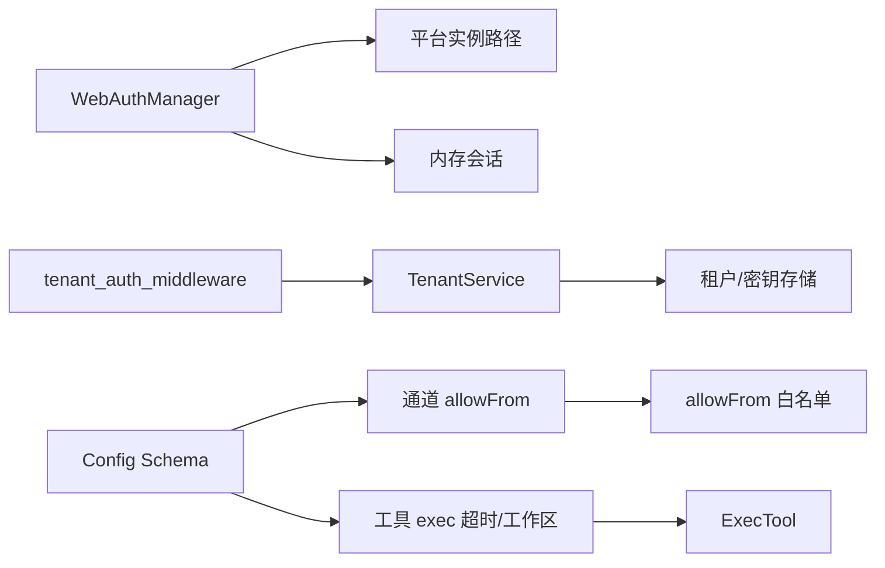

# 安全问题排查

<cite>
**本文引用的文件**
- [SECURITY.md](file://SECURITY.md)
- [nanobot/web/auth.py](file://nanobot/web/auth.py)
- [nanobot/web/app.py](file://nanobot/web/app.py)
- [nanobot/web/tenant_context.py](file://nanobot/web/tenant_context.py)
- [nanobot/web/routers/auth.py](file://nanobot/web/routers/auth.py)
- [nanobot/config/schema.py](file://nanobot/config/schema.py)
- [nanobot/config/loader.py](file://nanobot/config/loader.py)
- [nanobot/agent/tools/shell.py](file://nanobot/agent/tools/shell.py)
- [nanobot/platform/tenants/service.py](file://nanobot/platform/tenants/service.py)
- [nanobot/web/operations.py](file://nanobot/web/operations.py)
- [nanobot/web/mcp_servers.py](file://nanobot/web/mcp_servers.py)
- [nanobot/platform/channel_bindings/service.py](file://nanobot/platform/channel_bindings/service.py)
- [nanobot/channels/matrix.py](file://nanobot/channels/matrix.py)
- [nanobot/templates/TOOLS.md](file://nanobot/templates/TOOLS.md)
- [TOOLS.md](file://TOOLS.md)
- [tests/test_web_api.py](file://tests/test_web_api.py)
- [tests/test_base_channel.py](file://tests/test_base_channel.py)
- [tests/test_tool_validation.py](file://tests/test_tool_validation.py)
</cite>

## 目录
1. [简介](#简介)
2. [项目结构](#项目结构)
3. [核心组件](#核心组件)
4. [架构总览](#架构总览)
5. [详细组件分析](#详细组件分析)
6. [依赖分析](#依赖分析)
7. [性能考虑](#性能考虑)
8. [故障排查指南](#故障排查指南)
9. [结论](#结论)
10. [附录](#附录)

## 简介
本指南面向 Nanobot 的安全问题排查与加固，聚焦以下目标：
- 安全漏洞检测：识别配置风险、工具安全边界与通道访问控制。
- 认证与会话验证：Cookie 会话、API Key 多租户鉴权、登录失败处理。
- 认证失败排查：登录错误码、会话失效与重置流程。
- API 密钥管理：生成、轮换、吊销与有效期校验。
- 权限配置：通道 allowFrom 白名单、工具工作区限制与 MCP 服务器诊断。
- 加密通信：HTTPS/TLS、Matrix E2EE、WhatsApp 桥接本地绑定与令牌。
- 常见威胁识别：破坏性命令模式、路径遍历、未授权访问尝试。
- 入侵检测与响应：日志监控、异常活动告警与应急处置步骤。
- 安全配置审计与合规：依赖审计、生产部署最佳实践与安全检查清单。

## 项目结构
Nanobot 的 Web UI 使用 FastAPI 提供认证、多租户 API Key 鉴权与前端静态资源服务；认证与会话由 WebAuthManager 管理；多租户 API Key 由 TenantService 负责；配置模型与加载由 Config 与 loader 提供；工具层（如 exec）内置安全限制；通道层支持 allowFrom 白名单；日志与运维页面提供安全事件观测入口。

图表来源
- [nanobot/web/app.py:70-280](file://nanobot/web/app.py#L70-L280)
- [nanobot/web/routers/auth.py:1-220](file://nanobot/web/routers/auth.py#L1-L220)
- [nanobot/web/auth.py:129-414](file://nanobot/web/auth.py#L129-L414)
- [nanobot/web/tenant_context.py:26-108](file://nanobot/web/tenant_context.py#L26-L108)
- [nanobot/web/operations.py:40-69](file://nanobot/web/operations.py#L40-L69)
- [nanobot/config/schema.py:1-450](file://nanobot/config/schema.py#L1-L450)
- [nanobot/config/loader.py:26-82](file://nanobot/config/loader.py#L26-L82)
- [nanobot/platform/tenants/service.py:43-191](file://nanobot/platform/tenants/service.py#L43-L191)
- [nanobot/platform/channel_bindings/service.py:28-201](file://nanobot/platform/channel_bindings/service.py#L28-L201)
- [nanobot/agent/tools/shell.py:12-179](file://nanobot/agent/tools/shell.py#L12-L179)
- [nanobot/channels/matrix.py:242-273](file://nanobot/channels/matrix.py#L242-L273)
- [nanobot/web/mcp_servers.py:314-345](file://nanobot/web/mcp_servers.py#L314-L345)

章节来源
- [nanobot/web/app.py:70-280](file://nanobot/web/app.py#L70-L280)
- [nanobot/config/schema.py:1-450](file://nanobot/config/schema.py#L1-L450)

## 核心组件
- 认证与会话
  - WebAuthManager：PBKDF2 密码哈希、会话内存存储、头像上传与校验、状态查询与失效。
  - Cookie 会话：名称、最大时长、HttpOnly、SameSite、Secure（仅 HTTPS）。
  - 登录失败与状态接口：统一错误码与响应格式。
- 多租户 API Key 鉴权
  - tenant_auth_middleware：优先校验 Authorization 或 X-API-Key，注入 TenantContext。
  - TenantService：API Key 生成（nk_ 前缀）、哈希存储、有效期与启用状态校验。
- 配置与安全边界
  - Config：通道 allowFrom、工具 exec 超时与工作区限制、MCP 服务器类型与超时等。
  - loader：默认配置路径、迁移逻辑、保存与加载。
- 工具与通道安全
  - ExecTool：破坏性命令模式阻断、允许/拒绝白名单、工作区限制与路径提取。
  - 通道 allowFrom：严格匹配策略，避免子串攻击。
  - Matrix E2EE：加密房间消息发送选项。
  - WhatsApp 桥接：本地回环绑定 + 可选共享令牌。
- 日志与运维
  - 运维页：日志尾部查看与可执行动作统计。
  - 配置验证：核心检查、危险配置隔离区与修复建议。

章节来源
- [nanobot/web/auth.py:129-414](file://nanobot/web/auth.py#L129-L414)
- [nanobot/web/routers/auth.py:87-127](file://nanobot/web/routers/auth.py#L87-L127)
- [nanobot/web/tenant_context.py:26-108](file://nanobot/web/tenant_context.py#L26-L108)
- [nanobot/platform/tenants/service.py:121-191](file://nanobot/platform/tenants/service.py#L121-L191)
- [nanobot/config/schema.py:17-228](file://nanobot/config/schema.py#L17-L228)
- [nanobot/config/loader.py:26-82](file://nanobot/config/loader.py#L26-L82)
- [nanobot/agent/tools/shell.py:12-179](file://nanobot/agent/tools/shell.py#L12-L179)
- [nanobot/platform/channel_bindings/service.py:73-85](file://nanobot/platform/channel_bindings/service.py#L73-L85)
- [nanobot/channels/matrix.py:242-273](file://nanobot/channels/matrix.py#L242-L273)
- [nanobot/web/operations.py:55-69](file://nanobot/web/operations.py#L55-L69)

## 架构总览
下图展示 Web UI 的认证与会话控制流，以及多租户 API Key 鉴权与 Cookie 鉴权的协同机制。

图表来源
- [nanobot/web/app.py:225-243](file://nanobot/web/app.py#L225-L243)
- [nanobot/web/tenant_context.py:26-92](file://nanobot/web/tenant_context.py#L26-L92)
- [nanobot/web/auth.py:317-346](file://nanobot/web/auth.py#L317-L346)
- [nanobot/platform/tenants/service.py:160-179](file://nanobot/platform/tenants/service.py#L160-L179)

章节来源
- [nanobot/web/app.py:225-243](file://nanobot/web/app.py#L225-L243)
- [nanobot/web/tenant_context.py:26-92](file://nanobot/web/tenant_context.py#L26-L92)
- [nanobot/web/auth.py:317-346](file://nanobot/web/auth.py#L317-L346)
- [nanobot/platform/tenants/service.py:160-179](file://nanobot/platform/tenants/service.py#L160-L179)

## 详细组件分析

### 认证与会话（WebAuthManager）
- 密码策略：PBKDF2 迭代次数、用户名/密码长度校验、邮箱格式校验。
- 会话管理：内存存储、过期判断、令牌生成与失效。
- 头像管理：大小限制、媒体类型白名单、相对路径保护。
- 状态接口：初始化状态、认证状态、头像获取与上传。

图表来源
- [nanobot/web/auth.py:46-113](file://nanobot/web/auth.py#L46-L113)
- [nanobot/web/auth.py:129-414](file://nanobot/web/auth.py#L129-L414)

章节来源
- [nanobot/web/auth.py:129-414](file://nanobot/web/auth.py#L129-L414)
- [nanobot/web/routers/auth.py:87-127](file://nanobot/web/routers/auth.py#L87-L127)

### 多租户 API Key 鉴权（tenant_auth_middleware + TenantService）
- API Key 规范：以 nk_ 开头的原始密钥，服务端存储哈希与前缀，支持启用/禁用与过期时间。
- 鉴权流程：中间件优先校验请求头中的 Bearer 或 X-API-Key，校验通过后注入 TenantContext。
- 会话与 API Key 协同：若通过 API Key 鉴权，则跳过 Cookie 校验；否则走 Cookie 会话。

图表来源
- [nanobot/web/tenant_context.py:26-92](file://nanobot/web/tenant_context.py#L26-L92)
- [nanobot/platform/tenants/service.py:160-179](file://nanobot/platform/tenants/service.py#L160-L179)

章节来源
- [nanobot/web/tenant_context.py:26-92](file://nanobot/web/tenant_context.py#L26-L92)
- [nanobot/platform/tenants/service.py:121-191](file://nanobot/platform/tenants/service.py#L121-L191)

### 配置与安全边界（Config + loader）
- 通道 allowFrom：各通道均支持 allowFrom 白名单，严格匹配策略。
- 工具 exec：超时、输出截断、路径遍历限制、工作区限制。
- MCP 服务器：支持 stdio/sse/streamableHttp，带超时与自适应类型推断。
- 配置加载：默认路径、迁移逻辑、保存与加载。

图表来源
- [nanobot/config/loader.py:26-82](file://nanobot/config/loader.py#L26-L82)
- [nanobot/config/schema.py:17-228](file://nanobot/config/schema.py#L17-L228)
- [nanobot/agent/tools/shell.py:12-179](file://nanobot/agent/tools/shell.py#L12-L179)
- [nanobot/web/mcp_servers.py:336-345](file://nanobot/web/mcp_servers.py#L336-L345)

章节来源
- [nanobot/config/schema.py:17-228](file://nanobot/config/schema.py#L17-L228)
- [nanobot/config/loader.py:26-82](file://nanobot/config/loader.py#L26-L82)
- [nanobot/agent/tools/shell.py:12-179](file://nanobot/agent/tools/shell.py#L12-L179)
- [nanobot/web/mcp_servers.py:314-345](file://nanobot/web/mcp_servers.py#L314-L345)

### 工具与通道安全（ExecTool + 通道 allowFrom + Matrix E2EE）
- ExecTool 安全策略：阻断危险模式（删除、格式化、系统关机、fork bomb 等）、允许/拒绝白名单、工作区限制与绝对路径提取。
- 通道 allowFrom：严格匹配，避免子串攻击；测试用例验证精确匹配。
- Matrix E2EE：加密房间消息发送时忽略未验证设备选项。

图表来源
- [nanobot/agent/tools/shell.py:144-172](file://nanobot/agent/tools/shell.py#L144-L172)
- [tests/test_tool_validation.py:125-128](file://tests/test_tool_validation.py#L125-L128)
- [tests/test_base_channel.py:21-25](file://tests/test_base_channel.py#L21-L25)
- [nanobot/channels/matrix.py:260-273](file://nanobot/channels/matrix.py#L260-L273)

章节来源
- [nanobot/agent/tools/shell.py:12-179](file://nanobot/agent/tools/shell.py#L12-L179)
- [tests/test_tool_validation.py:92-128](file://tests/test_tool_validation.py#L92-L128)
- [tests/test_base_channel.py:21-25](file://tests/test_base_channel.py#L21-L25)
- [nanobot/channels/matrix.py:242-273](file://nanobot/channels/matrix.py#L242-L273)

### 日志与运维（Operations + 运维页）
- 运维服务：聚合配置验证、运行时检查、网关连通性、路径与 MCP 检查、危险配置隔离。
- 运维页：日志尾部查看、可执行动作统计与刷新。

章节来源
- [nanobot/web/operations.py:55-69](file://nanobot/web/operations.py#L55-L69)
- [web-ui/src/pages/OperationsPage.tsx:67-105](file://web-ui/src/pages/OperationsPage.tsx#L67-L105)

## 依赖分析
- WebAuthManager 依赖平台实例路径（认证状态与头像目录），并使用线程锁保证并发安全。
- tenant_auth_middleware 依赖 TenantService 的 API Key 校验能力，并在未初始化或校验失败时返回相应错误。
- 配置 Schema 对通道 allowFrom、工具 exec、MCP 服务器类型与超时进行约束。
- 工具层 ExecTool 与通道层 allowFrom 共同构成“最小权限”与“路径限制”的双重防护。

图表来源
- [nanobot/web/auth.py:129-139](file://nanobot/web/auth.py#L129-L139)
- [nanobot/web/tenant_context.py:54-88](file://nanobot/web/tenant_context.py#L54-L88)
- [nanobot/platform/tenants/service.py:160-179](file://nanobot/platform/tenants/service.py#L160-L179)
- [nanobot/config/schema.py:17-228](file://nanobot/config/schema.py#L17-L228)
- [nanobot/agent/tools/shell.py:12-179](file://nanobot/agent/tools/shell.py#L12-L179)

章节来源
- [nanobot/web/auth.py:129-139](file://nanobot/web/auth.py#L129-L139)
- [nanobot/web/tenant_context.py:54-88](file://nanobot/web/tenant_context.py#L54-L88)
- [nanobot/platform/tenants/service.py:160-179](file://nanobot/platform/tenants/service.py#L160-L179)
- [nanobot/config/schema.py:17-228](file://nanobot/config/schema.py#L17-L228)
- [nanobot/agent/tools/shell.py:12-179](file://nanobot/agent/tools/shell.py#L12-L179)

## 性能考虑
- 会话与密钥校验：内存态存储与哈希比对，开销低；建议避免频繁重建会话。
- 工具执行：超时与输出截断限制资源占用；工作区限制减少磁盘 IO。
- 配置加载：默认路径与迁移逻辑避免重复解析；建议集中式配置更新。
- 通道与 MCP：传输类型自动推断与超时设置，降低连接抖动成本。

## 故障排查指南

### 安全漏洞检测
- 配置风险
  - 检查通道 allowFrom 是否配置；严格匹配策略避免子串攻击。
  - 工具 exec 是否开启工作区限制；是否配置超时与输出截断。
  - MCP 服务器是否缺少必要环境变量；诊断报告应明确缺失项与修复步骤。
- 工具安全
  - 执行破坏性命令被阻断：确认 deny/allow 白名单与工作区限制。
  - 路径遍历被阻断：确认 restrict_to_workspace 与绝对路径提取逻辑。
- 通道安全
  - allowFrom 未生效：核对配置与运行时是否正确加载；测试用例验证精确匹配。

章节来源
- [nanobot/config/schema.py:17-228](file://nanobot/config/schema.py#L17-L228)
- [nanobot/agent/tools/shell.py:144-172](file://nanobot/agent/tools/shell.py#L144-L172)
- [nanobot/web/mcp_servers.py:399-420](file://nanobot/web/mcp_servers.py#L399-L420)
- [tests/test_base_channel.py:21-25](file://tests/test_base_channel.py#L21-L25)
- [tests/test_tool_validation.py:125-128](file://tests/test_tool_validation.py#L125-L128)

### 认证与会话验证
- 登录失败
  - 错误码：AUTH_NOT_INITIALIZED、AUTH_INVALID_CREDENTIALS、AUTH_VALIDATION_ERROR。
  - 处理：确认管理员账户是否已引导；检查用户名/密码长度与格式；确保 Cookie 安全标志（Secure/HttpOnly）。
- 会话失效
  - 现象：401 AUTH_REQUIRED；检查会话过期时间与 Cookie 设置。
  - 重启后会话不存活：测试覆盖了重启后会话不存活的行为，属预期。
- 头像上传失败
  - 错误：文件为空、大小超限、媒体类型不在白名单。
  - 处理：检查文件大小与类型；确认头像目录权限。

章节来源
- [nanobot/web/routers/auth.py:92-127](file://nanobot/web/routers/auth.py#L92-L127)
- [nanobot/web/auth.py:257-315](file://nanobot/web/auth.py#L257-L315)
- [tests/test_web_api.py:152-187](file://tests/test_web_api.py#L152-L187)

### API 密钥管理
- 生成
  - 生成 nk_ 前缀的原始密钥；服务端仅存储哈希与前缀。
- 轮换
  - 当前密码校验失败将返回 401 PROFILE_PASSWORD_INVALID。
- 吊销
  - 通过 key_id 删除密钥；后续校验将返回无效。
- 有效期
  - 校验时检查启用状态与过期时间；过期则视为无效。

章节来源
- [nanobot/platform/tenants/service.py:121-191](file://nanobot/platform/tenants/service.py#L121-L191)
- [nanobot/web/tenant_context.py:95-107](file://nanobot/web/tenant_context.py#L95-L107)
- [nanobot/web/routers/auth.py:163-187](file://nanobot/web/routers/auth.py#L163-L187)

### 权限配置
- 通道 allowFrom
  - 严格匹配策略；测试用例验证“attacker|allow@email.com”不会被允许。
- 工具工作区限制
  - restrict_to_workspace 生效时，绝对路径不在工作区将被阻断。
- 多租户作用域
  - API Key 校验成功后注入 scopes；可通过 X-Tenant-Id 与密钥所属租户一致性校验。

章节来源
- [tests/test_base_channel.py:21-25](file://tests/test_base_channel.py#L21-L25)
- [nanobot/agent/tools/shell.py:157-171](file://nanobot/agent/tools/shell.py#L157-L171)
- [nanobot/web/tenant_context.py:74-81](file://nanobot/web/tenant_context.py#L74-L81)

### 加密通信
- 外部 API：默认 HTTPS；请求超时配置防止挂起。
- Telegram：TLS 保障；失败尝试记录。
- WhatsApp 桥接：本地回环绑定（127.0.0.1:3001）+ 可选共享令牌；认证数据目录权限 0700。
- Matrix：E2EE 房间消息发送时忽略未验证设备选项。

章节来源
- [SECURITY.md:90-101](file://SECURITY.md#L90-L101)
- [nanobot/channels/matrix.py:260-273](file://nanobot/channels/matrix.py#L260-L273)

### 常见威胁识别与应对
- 破坏性命令模式
  - 已阻断：rm -rf、format、dd、shutdown、fork bomb 等。
  - 应对：保持 deny 白名单更新；必要时引入更严格的 allow 白名单。
- 路径遍历
  - 已阻断：../、..\\ 与绝对路径越权访问。
  - 应对：开启 restrict_to_workspace；定期审计工具调用日志。
- 未授权访问
  - 已阻断：空 allowFrom 在新版本中默认拒绝；严格匹配策略。
  - 应对：为所有通道配置 allowFrom；启用 API Key 鉴权；监控 401/403。

章节来源
- [nanobot/agent/tools/shell.py:26-36](file://nanobot/agent/tools/shell.py#L26-L36)
- [nanobot/agent/tools/shell.py:157-171](file://nanobot/agent/tools/shell.py#L157-L171)
- [SECURITY.md:57-61](file://SECURITY.md#L57-L61)

### 入侵检测与安全事件响应
- 日志监控
  - 运维页查看日志尾部；生产建议使用集中式日志与告警。
- 异常访问监控
  - 关注 401/403 频率突增；API Key 校验失败；会话异常失效。
- 应急处置
  - 立即吊销可疑 API Key；审查日志中的异常访问；检查文件系统变更；轮换所有凭证；升级至最新版本；按需上报。

章节来源
- [SECURITY.md:191-203](file://SECURITY.md#L191-L203)
- [nanobot/web/operations.py:55-69](file://nanobot/web/operations.py#L55-L69)

### 安全配置审计与合规
- 依赖审计
  - 定期运行 pip-audit 与 npm audit；关注 DoS 与高危漏洞。
- 生产部署
  - 容器/VM 隔离；专用用户；权限 0700/0600；启用日志；速率限制；定期更新。
- 开发与生产差异
  - 分离 API Key；非敏感数据测试；启用详细日志；使用测试机器人。
- 数据隐私
  - 日志与聊天历史本地存储；提示 LLM 提供商可见性；生产使用系统密钥环。

章节来源
- [SECURITY.md:102-182](file://SECURITY.md#L102-L182)

## 结论
Nanobot 在认证、通道访问控制、工具安全边界与加密通信方面提供了基础安全能力。建议在生产环境中：
- 强制配置通道 allowFrom 与 API Key 鉴权；
- 启用工作区限制与工具超时/输出截断；
- 定期进行依赖与配置审计；
- 建立日志监控与应急响应流程；
- 使用系统密钥环存储敏感凭据，避免明文配置。

## 附录

### 安全检查清单（部署前）
- [ ] API Key 存储安全（不在代码中）
- [ ] 配置文件权限 0600
- [ ] 所有通道 allowFrom 已配置
- [ ] 非 root 用户运行
- [ ] 文件系统权限受限
- [ ] 依赖更新至安全版本
- [ ] 日志监控安全事件
- [ ] API 提供商速率限制与消费上限
- [ ] 备份与灾难恢复计划
- [ ] 自定义技能/工具安全评审

章节来源
- [SECURITY.md:238-251](file://SECURITY.md#L238-L251)

### 工具使用与安全限制参考
- exec 工具：超时、阻断破坏性命令、输出截断、工作区限制。
- cron 技能：参见技能文档。

章节来源
- [nanobot/templates/TOOLS.md:6-11](file://nanobot/templates/TOOLS.md#L6-L11)
- [TOOLS.md:6-11](file://TOOLS.md#L6-L11)