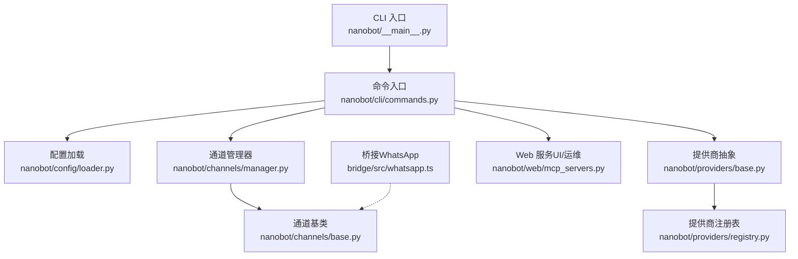
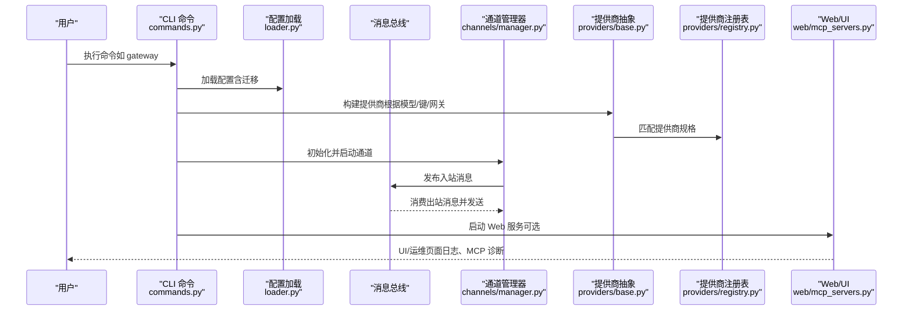
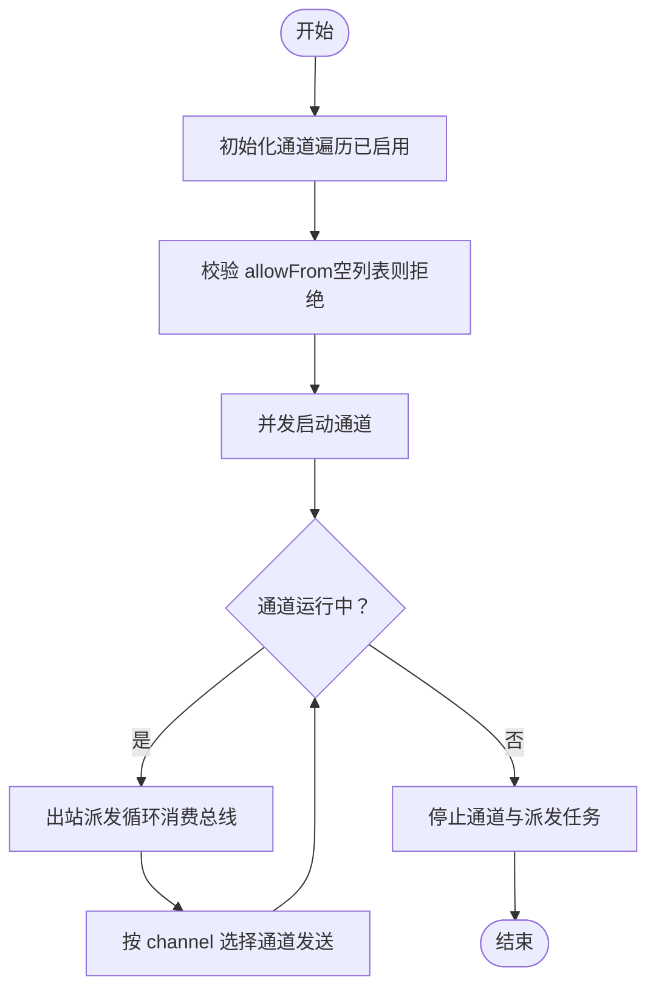
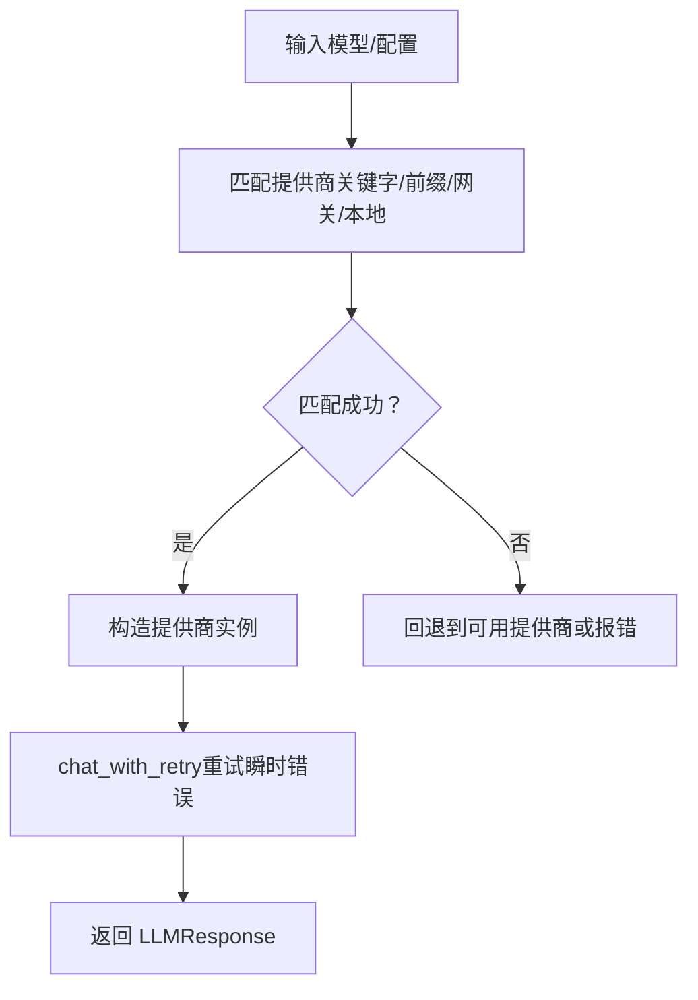
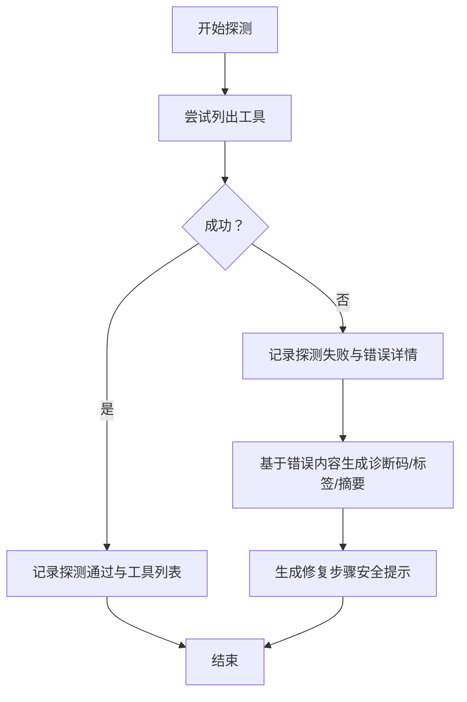
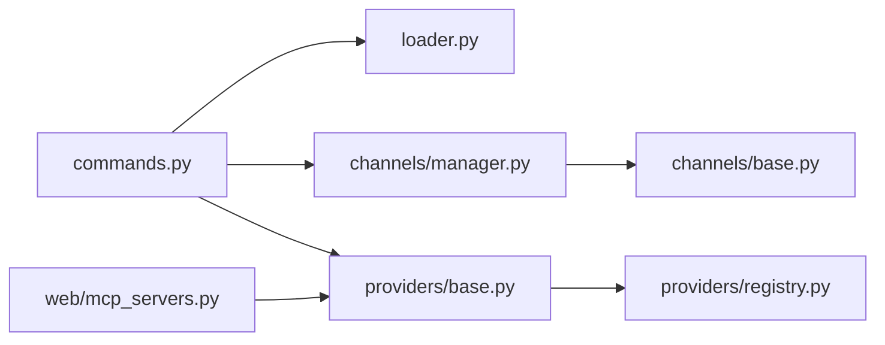

# 常见问题解决

<cite>
**本文引用的文件**   
- [README.md](file://README.md)
- [nanobot/__main__.py](file://nanobot/__main__.py)
- [nanobot/cli/commands.py](file://nanobot/cli/commands.py)
- [nanobot/config/loader.py](file://nanobot/config/loader.py)
- [nanobot/config/schema.py](file://nanobot/config/schema.py)
- [nanobot/channels/base.py](file://nanobot/channels/base.py)
- [nanobot/channels/manager.py](file://nanobot/channels/manager.py)
- [nanobot/providers/base.py](file://nanobot/providers/base.py)
- [nanobot/providers/registry.py](file://nanobot/providers/registry.py)
- [nanobot/web/mcp_servers.py](file://nanobot/web/mcp_servers.py)
- [bridge/src/whatsapp.ts](file://bridge/src/whatsapp.ts)
- [SECURITY.md](file://SECURITY.md)
- [tests/test_web_api.py](file://tests/test_web_api.py)
</cite>

## 目录
1. [简介](#简介)
2. [项目结构](#项目结构)
3. [核心组件](#核心组件)
4. [架构总览](#架构总览)
5. [详细组件分析](#详细组件分析)
6. [依赖分析](#依赖分析)
7. [性能考量](#性能考量)
8. [故障排除指南](#故障排除指南)
9. [结论](#结论)
10. [附录](#附录)

## 简介
本指南面向使用 Nanobot 的用户与运维人员，聚焦于“启动失败、渠道连接异常、API 调用错误、权限问题”等常见问题，提供症状描述、可能原因分析、分步排查与修复步骤，并覆盖网络连接、配置错误、依赖缺失等具体案例。同时给出跨平台（Windows、Linux、macOS）与容器环境下的特殊注意事项，以及快速自检清单与紧急修复步骤。

## 项目结构
Nanobot 采用模块化设计：CLI 入口负责启动网关/交互；配置加载器解析用户配置；通道管理器协调多聊天渠道；提供商注册表与基础提供商抽象统一 LLM 访问；Web 层提供 UI 与运维能力；桥接层（如 WhatsApp）独立进程与 Python 后端通信。

图示来源
- [nanobot/__main__.py:1-9](file://nanobot/__main__.py#L1-L9)
- [nanobot/cli/commands.py:308-678](file://nanobot/cli/commands.py#L308-L678)
- [nanobot/config/loader.py:26-66](file://nanobot/config/loader.py#L26-L66)
- [nanobot/channels/manager.py:52-209](file://nanobot/channels/manager.py#L52-L209)
- [nanobot/providers/base.py:69-271](file://nanobot/providers/base.py#L69-L271)
- [nanobot/providers/registry.py:19-466](file://nanobot/providers/registry.py#L19-L466)
- [nanobot/web/mcp_servers.py:170-210](file://nanobot/web/mcp_servers.py#L170-L210)
- [bridge/src/whatsapp.ts:56-95](file://bridge/src/whatsapp.ts#L56-L95)

章节来源
- [nanobot/__main__.py:1-9](file://nanobot/__main__.py#L1-L9)
- [nanobot/cli/commands.py:308-678](file://nanobot/cli/commands.py#L308-L678)
- [nanobot/config/loader.py:26-66](file://nanobot/config/loader.py#L26-L66)
- [nanobot/channels/manager.py:52-209](file://nanobot/channels/manager.py#L52-L209)
- [nanobot/providers/base.py:69-271](file://nanobot/providers/base.py#L69-L271)
- [nanobot/providers/registry.py:19-466](file://nanobot/providers/registry.py#L19-L466)
- [nanobot/web/mcp_servers.py:170-210](file://nanobot/web/mcp_servers.py#L170-L210)
- [bridge/src/whatsapp.ts:56-95](file://bridge/src/whatsapp.ts#L56-L95)

## 核心组件
- CLI 命令与入口
  - 提供 onboard、gateway、agent、web-ui 等子命令，负责加载配置、构建运行时、启动网关与通道、执行代理循环。
- 配置系统
  - 加载与迁移配置，校验字段，提供默认值与环境变量映射；支持多实例路径切换。
- 通道管理
  - 统一初始化与启停各聊天渠道，进行入站消息路由与出站消息派发，校验 allowFrom 白名单。
- 提供商体系
  - 抽象统一的 LLM 调用接口，内置重试与瞬时错误识别；注册表按关键字/前缀/网关特性匹配提供商。
- Web 与运维
  - 提供 Web UI、认证、系统状态、MCP 服务器探测与诊断、日志查看等能力。

章节来源
- [nanobot/cli/commands.py:170-211](file://nanobot/cli/commands.py#L170-L211)
- [nanobot/cli/commands.py:308-678](file://nanobot/cli/commands.py#L308-L678)
- [nanobot/config/loader.py:26-66](file://nanobot/config/loader.py#L26-L66)
- [nanobot/config/schema.py:351-449](file://nanobot/config/schema.py#L351-L449)
- [nanobot/channels/manager.py:52-209](file://nanobot/channels/manager.py#L52-L209)
- [nanobot/providers/base.py:69-271](file://nanobot/providers/base.py#L69-L271)
- [nanobot/providers/registry.py:407-466](file://nanobot/providers/registry.py#L407-L466)
- [nanobot/web/mcp_servers.py:170-210](file://nanobot/web/mcp_servers.py#L170-L210)

## 架构总览
下图展示从 CLI 到通道、提供商与 Web 的关键交互路径，以及错误与日志落点。

图示来源
- [nanobot/cli/commands.py:308-678](file://nanobot/cli/commands.py#L308-L678)
- [nanobot/config/loader.py:26-66](file://nanobot/config/loader.py#L26-L66)
- [nanobot/providers/base.py:69-271](file://nanobot/providers/base.py#L69-L271)
- [nanobot/providers/registry.py:407-466](file://nanobot/providers/registry.py#L407-L466)
- [nanobot/channels/manager.py:52-209](file://nanobot/channels/manager.py#L52-L209)
- [nanobot/web/mcp_servers.py:170-210](file://nanobot/web/mcp_servers.py#L170-L210)

## 详细组件分析

### 组件A：通道管理与消息路由
- 职责
  - 初始化启用的通道（Telegram、WhatsApp、Discord 等），启动/停止通道与出站派发任务。
  - 校验 allowFrom 配置，空列表将直接拒绝所有访问。
  - 将入站消息注入消息总线，按目标类型/ID 注入路由元数据。
- 关键流程
  - 启动：并发启动各通道，等待其长期运行任务。
  - 出站：从总线消费消息，按 channel 字段选择对应通道发送。
  - 错误：捕获通道启动/发送异常并记录日志。

图示来源
- [nanobot/channels/manager.py:86-139](file://nanobot/channels/manager.py#L86-L139)
- [nanobot/channels/manager.py:160-190](file://nanobot/channels/manager.py#L160-L190)
- [nanobot/channels/base.py:79-129](file://nanobot/channels/base.py#L79-L129)

章节来源
- [nanobot/channels/manager.py:52-209](file://nanobot/channels/manager.py#L52-L209)
- [nanobot/channels/base.py:79-129](file://nanobot/channels/base.py#L79-L129)

### 组件B：提供商匹配与调用
- 职责
  - 根据模型名与配置匹配提供商（关键字/显式前缀/网关/本地），构造具体提供商实例。
  - 统一 chat 接口，内置瞬时错误重试策略。
- 关键流程
  - 匹配：优先显式前缀，其次关键字，再考虑网关/本地兜底。
  - 调用：chat_with_retry 自动处理瞬时错误与指数退避重试。

图示来源
- [nanobot/providers/registry.py:407-466](file://nanobot/providers/registry.py#L407-L466)
- [nanobot/providers/base.py:192-266](file://nanobot/providers/base.py#L192-L266)

章节来源
- [nanobot/providers/registry.py:407-466](file://nanobot/providers/registry.py#L407-L466)
- [nanobot/providers/base.py:192-266](file://nanobot/providers/base.py#L192-L266)

### 组件C：Web 与 MCP 诊断
- 职责
  - 探测 MCP 服务器连通性与工具列表，记录探测结果与错误信息。
  - 基于错误内容生成诊断码、标签、摘要与修复步骤。
- 关键流程
  - 探测：尝试列出工具，失败则记录错误；成功则记录工具名与计数。
  - 诊断：根据错误字符串匹配错误码，生成修复建议。

图示来源
- [nanobot/web/mcp_servers.py:170-210](file://nanobot/web/mcp_servers.py#L170-L210)
- [nanobot/web/mcp_servers.py:444-651](file://nanobot/web/mcp_servers.py#L444-L651)

章节来源
- [nanobot/web/mcp_servers.py:170-210](file://nanobot/web/mcp_servers.py#L170-L210)
- [nanobot/web/mcp_servers.py:444-651](file://nanobot/web/mcp_servers.py#L444-L651)

## 依赖分析
- CLI 依赖配置加载器与提供商工厂，间接依赖注册表与通道管理器。
- 通道管理器依赖通道基类与消息总线，负责并发启停与出站派发。
- 提供商抽象依赖注册表进行匹配，内部实现各自适配。
- Web 层依赖 MCP 服务进行探测与诊断。

图示来源
- [nanobot/cli/commands.py:308-678](file://nanobot/cli/commands.py#L308-L678)
- [nanobot/config/loader.py:26-66](file://nanobot/config/loader.py#L26-L66)
- [nanobot/channels/manager.py:52-209](file://nanobot/channels/manager.py#L52-L209)
- [nanobot/providers/base.py:69-271](file://nanobot/providers/base.py#L69-L271)
- [nanobot/providers/registry.py:19-466](file://nanobot/providers/registry.py#L19-L466)
- [nanobot/web/mcp_servers.py:170-210](file://nanobot/web/mcp_servers.py#L170-L210)

章节来源
- [nanobot/cli/commands.py:308-678](file://nanobot/cli/commands.py#L308-L678)
- [nanobot/channels/manager.py:52-209](file://nanobot/channels/manager.py#L52-L209)
- [nanobot/providers/base.py:69-271](file://nanobot/providers/base.py#L69-L271)
- [nanobot/providers/registry.py:19-466](file://nanobot/providers/registry.py#L19-L466)
- [nanobot/web/mcp_servers.py:170-210](file://nanobot/web/mcp_servers.py#L170-L210)

## 性能考量
- 启动与并发
  - 通道并发启动，避免阻塞；出站派发使用超时轮询，降低资源占用。
- LLM 调用
  - 瞬时错误自动重试，减少偶发网络抖动影响；合理设置温度、最大令牌等参数。
- 日志与可观测性
  - 使用 loguru 输出结构化日志，便于定位问题；Web UI 支持查看日志尾部与运维动作。

## 故障排除指南

### 一、启动失败
- 症状
  - 执行命令后立即退出或无响应。
- 可能原因
  - 配置文件不存在或格式错误，导致默认配置加载失败。
  - 缺少必需的 API Key 或模型配置。
  - 权限不足（如端口占用、文件权限）。
- 诊断步骤
  - 检查配置文件是否存在与可读：参考配置加载逻辑与默认路径。
  - 验证提供商配置（模型、API Key、网关地址）。
  - 在 Windows 上确保终端编码为 UTF-8；在 Linux/macOS 上检查端口占用与权限。
- 修复建议
  - 使用初始化命令重建配置模板，再补充必要字段。
  - 设置合适的文件权限与运行用户。
  - 如需调试，使用命令的 verbose 选项输出更详细日志。

章节来源
- [nanobot/config/loader.py:26-66](file://nanobot/config/loader.py#L26-L66)
- [nanobot/cli/commands.py:170-211](file://nanobot/cli/commands.py#L170-L211)
- [nanobot/cli/commands.py:308-678](file://nanobot/cli/commands.py#L308-L678)

### 二、渠道连接异常
- 症状
  - 渠道启动后无消息到达或发送失败。
- 可能原因
  - 未启用任何渠道或配置为空 allowFrom。
  - 平台侧限制（如 Discord 意图未开启、Telegram 未复制用户 ID）。
  - 网络/代理/防火墙导致连接失败。
- 诊断步骤
  - 查看启动日志中的“通道启用/警告”信息。
  - 核对各渠道的 token、ID、allowFrom 等配置。
  - 检查平台开发者文档中的权限与集成要求。
- 修复建议
  - 为每个渠道设置 allowFrom 白名单；生产环境务必配置。
  - 确认平台意图/权限已开启，按平台指引获取 token/ID。
  - 如需代理，配置相应代理参数；确保网络可达。

章节来源
- [nanobot/channels/manager.py:107-114](file://nanobot/channels/manager.py#L107-L114)
- [nanobot/channels/base.py:79-129](file://nanobot/channels/base.py#L79-L129)
- [README.md:246-384](file://README.md#L246-L384)
- [README.md:386-450](file://README.md#L386-L450)
- [README.md:453-491](file://README.md#L453-L491)
- [README.md:494-536](file://README.md#L494-L536)
- [README.md:582-618](file://README.md#L582-L618)
- [README.md:621-664](file://README.md#L621-L664)
- [README.md:667-711](file://README.md#L667-L711)
- [README.md:714-751](file://README.md#L714-L751)

### 三、API 调用错误
- 症状
  - LLM 调用失败、速率限制、超时或返回错误。
- 可能原因
  - API Key 未配置或无效。
  - 模型名不匹配提供商前缀或关键字。
  - 网络不稳定或上游服务过载。
- 诊断步骤
  - 检查提供商匹配与默认 API Base 设置。
  - 观察重试日志与瞬时错误标记。
  - 使用 Web UI 的日志面板查看最新错误。
- 修复建议
  - 补充正确的 API Key 与模型前缀；必要时指定 provider。
  - 降低温度/最大令牌等参数，缓解过载。
  - 配置代理或调整超时，避免网络波动。

章节来源
- [nanobot/providers/registry.py:407-466](file://nanobot/providers/registry.py#L407-L466)
- [nanobot/providers/base.py:188-266](file://nanobot/providers/base.py#L188-L266)
- [nanobot/config/schema.py:365-449](file://nanobot/config/schema.py#L365-L449)

### 四、权限问题
- 症状
  - 访问被拒绝、无法执行工具、文件系统操作失败。
- 可能原因
  - 渠道 allowFrom 为空导致默认拒绝。
  - 文件权限不当、非安全用户运行。
  - Shell 工具被阻断（破坏性命令模式）。
- 诊断步骤
  - 查看通道基类的访问控制日志。
  - 检查配置文件与桥接认证目录权限。
  - 审核工具调用与文件操作日志。
- 修复建议
  - 显式设置 allowFrom 白名单；生产环境务必配置。
  - 使用专用用户运行，设置 0600/0700 权限。
  - 仅在受控环境下启用 exec 工具，避免 root 运行。

章节来源
- [nanobot/channels/base.py:79-129](file://nanobot/channels/base.py#L79-L129)
- [SECURITY.md:37-62](file://SECURITY.md#L37-L62)
- [SECURITY.md:63-90](file://SECURITY.md#L63-L90)
- [SECURITY.md:139-151](file://SECURITY.md#L139-L151)

### 五、网络连接问题
- 症状
  - 通道无法建立连接、Web UI 无法访问、MCP 服务器探测失败。
- 可能原因
  - 本地桥接（如 WhatsApp）未正确启动或端口冲突。
  - 防火墙/代理阻止外联或回连。
  - 远端服务不可达或鉴权失败。
- 诊断步骤
  - 检查桥接进程与端口绑定状态。
  - 使用 Web UI 的“日志与运维”查看最新错误。
  - 基于 MCP 诊断生成的修复步骤逐项验证。
- 修复建议
  - 重启桥接进程并确认端口可用。
  - 配置代理或放通防火墙规则。
  - 核对远端服务 URL、鉴权头与 token。

章节来源
- [bridge/src/whatsapp.ts:56-95](file://bridge/src/whatsapp.ts#L56-L95)
- [nanobot/web/mcp_servers.py:444-651](file://nanobot/web/mcp_servers.py#L444-L651)

### 六、配置错误
- 症状
  - 配置加载失败、字段缺失、默认值覆盖预期。
- 可能原因
  - JSON 格式错误、字段拼写不一致。
  - 旧版配置未迁移。
- 诊断步骤
  - 查看配置加载器的警告与默认回退。
  - 使用 onboard 刷新配置模板，保留现有字段。
- 修复建议
  - 修正 JSON 语法与字段命名（camelCase/snake_case 自动兼容）。
  - 运行 onboard 以迁移旧配置并补充新字段。

章节来源
- [nanobot/config/loader.py:26-66](file://nanobot/config/loader.py#L26-L66)
- [nanobot/config/schema.py:11-14](file://nanobot/config/schema.py#L11-L14)
- [nanobot/cli/commands.py:170-211](file://nanobot/cli/commands.py#L170-L211)

### 七、依赖缺失
- 症状
  - 启动时报模块导入错误、功能不可用。
- 可能原因
  - 未安装可选依赖（如 Matrix、WeCom）。
  - Node.js 版本不满足（WhatsApp 桥接）。
- 诊断步骤
  - 查看通道初始化时的导入告警。
  - 检查 README 中的可选安装说明。
- 修复建议
  - 安装对应可选依赖包。
  - 升级 Node.js 至要求版本并重建桥接。

章节来源
- [nanobot/channels/manager.py:102-104](file://nanobot/channels/manager.py#L102-L104)
- [README.md:389-393](file://README.md#L389-L393)
- [README.md:720-725](file://README.md#L720-L725)
- [README.md:455-456](file://README.md#L455-L456)

### 八、跨平台与容器环境
- Windows
  - 强制 UTF-8 编码；注意终端与日志显示。
- Linux/macOS
  - 使用非 root 用户运行；设置文件权限；检查端口占用。
- 容器
  - 使用只读根文件系统、最小权限；挂载必要的配置与日志目录；暴露必要端口。

章节来源
- [nanobot/cli/commands.py:10-20](file://nanobot/cli/commands.py#L10-L20)
- [SECURITY.md:139-151](file://SECURITY.md#L139-L151)

### 九、认证与 Web UI
- 症状
  - 访问受保护接口返回 401，或初始化向导状态异常。
- 可能原因
  - 未初始化管理员账户或会话失效。
- 诊断步骤
  - 使用测试用例中的认证流程验证状态。
  - 查看 Web UI 的认证状态与错误提示。
- 修复建议
  - 通过引导接口创建管理员账户。
  - 登录后刷新状态并重试受保护接口。

章节来源
- [tests/test_web_api.py:121-150](file://tests/test_web_api.py#L121-L150)

## 结论
通过理解 CLI、配置、通道、提供商与 Web 的协作关系，配合日志与诊断工具，大多数启动失败、渠道异常、API 错误与权限问题都能快速定位并修复。建议在生产环境严格配置白名单、权限与审计日志，并定期更新依赖与版本。

## 附录

### 快速自检清单
- [ ] 配置文件存在且可读，API Key 正确，模型前缀与提供商匹配。
- [ ] 各渠道 allowFrom 已配置；生产环境务必设置。
- [ ] 运行用户具备必要权限；文件权限符合安全规范。
- [ ] 网络可达，代理/防火墙配置正确；桥接进程正常。
- [ ] 依赖齐全，Node.js 版本满足要求；可选包已安装。
- [ ] 日志可读，关注最近错误；必要时开启详细日志。
- [ ] 认证已初始化，会话有效；受保护接口可访问。

### 紧急修复步骤
- [ ] 重新初始化配置并补充关键字段。
- [ ] 为所有渠道设置 allowFrom 白名单。
- [ ] 以专用用户运行，修正文件权限。
- [ ] 重启桥接与网关；检查端口占用。
- [ ] 更新依赖与 nanobot 版本；运行安全扫描。
- [ ] 通过 Web UI 查看日志与 MCP 诊断，按步骤修复。