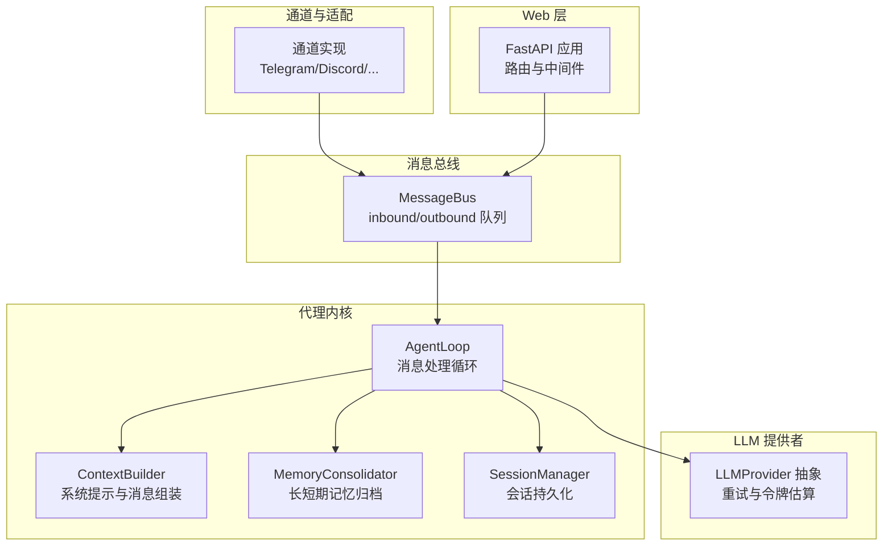
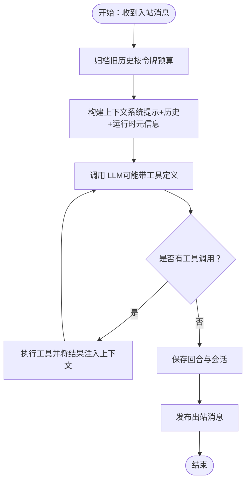
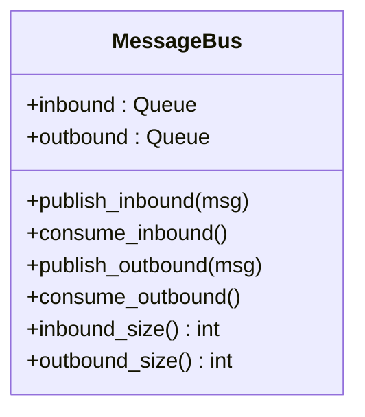
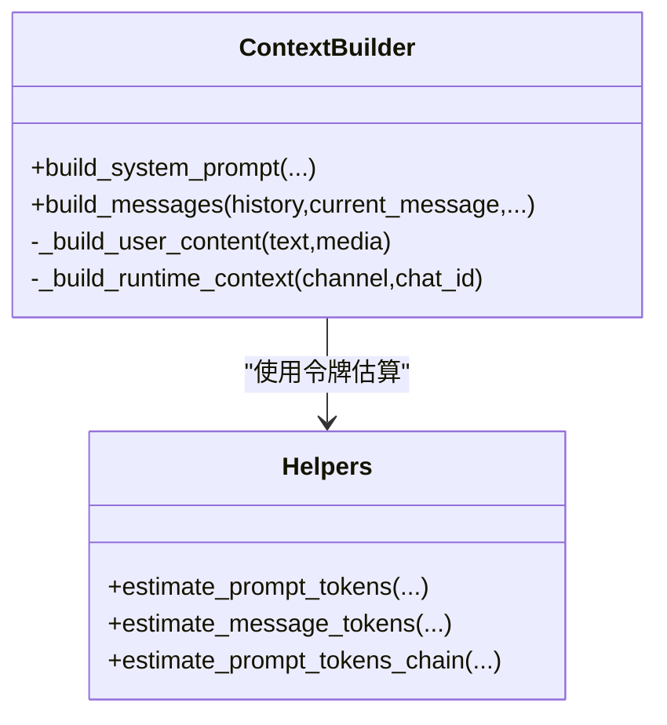
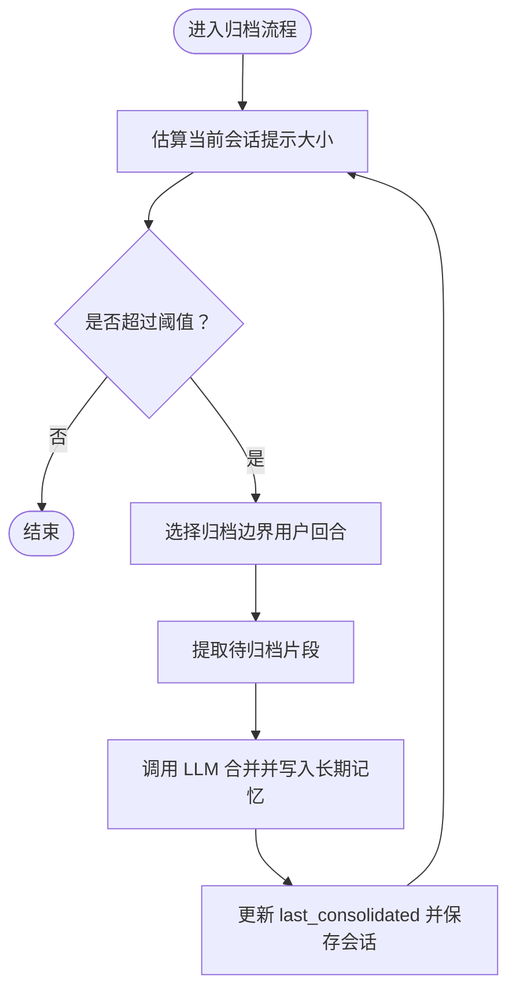
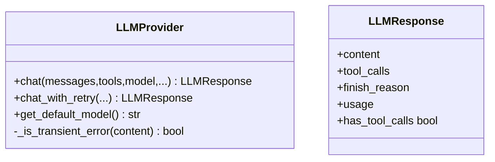
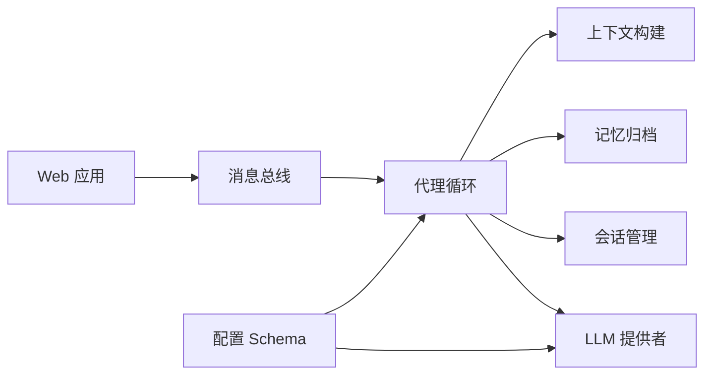

# 性能诊断

<cite>
**本文引用的文件**
- [nanobot/agent/loop.py](file://nanobot/agent/loop.py)
- [nanobot/bus/queue.py](file://nanobot/bus/queue.py)
- [nanobot/web/app.py](file://nanobot/web/app.py)
- [nanobot/agent/context.py](file://nanobot/agent/context.py)
- [nanobot/agent/memory.py](file://nanobot/agent/memory.py)
- [nanobot/providers/base.py](file://nanobot/providers/base.py)
- [nanobot/session/manager.py](file://nanobot/session/manager.py)
- [nanobot/utils/helpers.py](file://nanobot/utils/helpers.py)
- [nanobot/config/schema.py](file://nanobot/config/schema.py)
- [nanobot/config/loader.py](file://nanobot/config/loader.py)
- [tests/test_web_api.py](file://tests/test_web_api.py)
- [memory/MEMORY.md](file://memory/MEMORY.md)
</cite>

## 目录
1. [引言](#引言)
2. [项目结构](#项目结构)
3. [核心组件](#核心组件)
4. [架构总览](#架构总览)
5. [详细组件分析](#详细组件分析)
6. [依赖分析](#依赖分析)
7. [性能考量](#性能考量)
8. [故障排查指南](#故障排查指南)
9. [结论](#结论)
10. [附录](#附录)

## 引言
本指南面向 Nanobot 的性能诊断与优化，聚焦以下目标：
- 明确性能监控指标（内存、CPU、网络、队列积压）
- 瓶颈识别方法（代理循环、消息总线吞吐、API 响应时间）
- 实用优化策略（上下文窗口、工具调用、会话持久化、并发控制）
- 基准与压测实施（基于现有测试框架与配置）
- 调优最佳实践与资源配置建议

## 项目结构
Nanobot 采用模块化分层设计：Web 层（FastAPI）、通道适配层、消息总线、代理内核（AgentLoop）、会话与记忆、LLM 提供者接口等。消息通过异步队列在通道与代理之间解耦，代理内部以迭代循环处理消息、构建上下文、调用 LLM 并执行工具。



图表来源
- [nanobot/web/app.py:70-280](file://nanobot/web/app.py#L70-L280)
- [nanobot/bus/queue.py:8-45](file://nanobot/bus/queue.py#L8-L45)
- [nanobot/agent/loop.py:35-129](file://nanobot/agent/loop.py#L35-L129)
- [nanobot/agent/context.py:16-78](file://nanobot/agent/context.py#L16-L78)
- [nanobot/agent/memory.py:149-285](file://nanobot/agent/memory.py#L149-L285)
- [nanobot/session/manager.py:73-252](file://nanobot/session/manager.py#L73-L252)
- [nanobot/providers/base.py:69-271](file://nanobot/providers/base.py#L69-L271)

章节来源
- [nanobot/web/app.py:70-280](file://nanobot/web/app.py#L70-L280)
- [nanobot/bus/queue.py:8-45](file://nanobot/bus/queue.py#L8-L45)

## 核心组件
- 消息总线：异步队列承载入站/出站消息，支持查看队列长度用于评估积压。
- 代理循环：负责接收消息、构建上下文、调用 LLM、执行工具、发送响应；内置最大迭代次数与“/stop”取消机制。
- 上下文构建：整合身份、引导文件、工作区记忆、技能、运行时元信息，统一生成系统提示与消息列表。
- 记忆归档：按令牌预算策略归档历史，避免上下文超限；支持会话级锁避免并发冲突。
- 会话管理：JSONL 存储会话历史，支持迁移、缓存与元数据更新。
- LLM 提供者：统一抽象与重试逻辑，支持令牌估算与空内容清洗。

章节来源
- [nanobot/bus/queue.py:8-45](file://nanobot/bus/queue.py#L8-L45)
- [nanobot/agent/loop.py:289-485](file://nanobot/agent/loop.py#L289-L485)
- [nanobot/agent/context.py:145-180](file://nanobot/agent/context.py#L145-L180)
- [nanobot/agent/memory.py:149-285](file://nanobot/agent/memory.py#L149-L285)
- [nanobot/session/manager.py:73-252](file://nanobot/session/manager.py#L73-L252)
- [nanobot/providers/base.py:69-271](file://nanobot/providers/base.py#L69-L271)

## 架构总览
下图展示从 Web 请求到消息总线再到代理循环的端到端流程，以及关键性能观测点（队列长度、令牌估算、会话持久化）。

```mermaid
sequenceDiagram
participant Client as "客户端/通道"
participant Web as "FastAPI 应用"
participant Bus as "消息总线"
participant Loop as "AgentLoop"
participant Ctx as "ContextBuilder"
participant Mem as "MemoryConsolidator"
participant Sess as "SessionManager"
participant Prov as "LLMProvider"
Client->>Web : "HTTP 请求"
Web->>Bus : "发布入站消息"
Bus-->>Loop : "消费入站消息"
Loop->>Mem : "按令牌预算归档旧历史"
Mem-->>Loop : "归档完成"
Loop->>Ctx : "构建系统提示与消息"
Loop->>Prov : "调用 LLM含工具定义"
Prov-->>Loop : "返回文本/工具调用"
alt "存在工具调用"
Loop->>Loop : "执行工具并追加结果"
Loop->>Prov : "二次调用 LLM"
end
Loop->>Sess : "保存回合与会话"
Loop->>Bus : "发布出站消息"
Bus-->>Client : "HTTP 响应/通道回传"
```

图表来源
- [nanobot/web/app.py:248-262](file://nanobot/web/app.py#L248-L262)
- [nanobot/bus/queue.py:20-34](file://nanobot/bus/queue.py#L20-L34)
- [nanobot/agent/loop.py:371-485](file://nanobot/agent/loop.py#L371-L485)
- [nanobot/agent/context.py:145-180](file://nanobot/agent/context.py#L145-L180)
- [nanobot/agent/memory.py:229-285](file://nanobot/agent/memory.py#L229-L285)
- [nanobot/session/manager.py:172-189](file://nanobot/session/manager.py#L172-L189)
- [nanobot/providers/base.py:192-265](file://nanobot/providers/base.py#L192-L265)

## 详细组件分析

### 代理循环（AgentLoop）性能分析
- 关键路径：消费入站消息 → 归档历史（令牌预算）→ 构建上下文 → LLM 调用 → 工具执行（如有）→ 保存回合 → 发布出站消息。
- 并发与取消：全局处理锁与任务列表确保“/stop”可取消当前会话的所有活动任务；活跃任务数与队列长度是关键观察指标。
- 迭代上限：max_iterations 防止长轮询或工具循环卡死；达到上限时给出明确提示。
- MCP 连接：首次消息触发一次性懒连接，异常不影响后续消息处理。



图表来源
- [nanobot/agent/loop.py:218-287](file://nanobot/agent/loop.py#L218-L287)
- [nanobot/agent/memory.py:229-285](file://nanobot/agent/memory.py#L229-L285)
- [nanobot/agent/context.py:145-180](file://nanobot/agent/context.py#L145-L180)

章节来源
- [nanobot/agent/loop.py:289-485](file://nanobot/agent/loop.py#L289-L485)

### 消息总线（MessageBus）吞吐与积压
- 入/出站队列均支持 qsize 查询，可用于监控积压。
- 生产者（通道）与消费者（代理）解耦，积压通常反映代理处理能力或上游生产速率。



图表来源
- [nanobot/bus/queue.py:8-45](file://nanobot/bus/queue.py#L8-L45)

章节来源
- [nanobot/bus/queue.py:8-45](file://nanobot/bus/queue.py#L8-L45)

### 上下文构建（ContextBuilder）与令牌估算
- 统一生成系统提示与消息列表，避免连续相同角色消息导致的兼容性问题。
- 令牌估算优先使用提供者的计数器，回退至 tiktoken；对多模态输入进行安全处理。



图表来源
- [nanobot/agent/context.py:145-180](file://nanobot/agent/context.py#L145-L180)
- [nanobot/utils/helpers.py:92-171](file://nanobot/utils/helpers.py#L92-L171)

章节来源
- [nanobot/agent/context.py:145-180](file://nanobot/agent/context.py#L145-L180)
- [nanobot/utils/helpers.py:92-171](file://nanobot/utils/helpers.py#L92-L171)

### 记忆归档（MemoryConsolidator）与会话持久化
- 依据上下文窗口阈值选择用户回合边界进行归档，限制最大归档轮次，避免无限循环。
- 会话按 JSONL 存储，支持元数据与最后归档位置记录，迁移旧路径，缓存提升读写效率。



图表来源
- [nanobot/agent/memory.py:229-285](file://nanobot/agent/memory.py#L229-L285)
- [nanobot/session/manager.py:172-189](file://nanobot/session/manager.py#L172-L189)

章节来源
- [nanobot/agent/memory.py:149-285](file://nanobot/agent/memory.py#L149-L285)
- [nanobot/session/manager.py:73-252](file://nanobot/session/manager.py#L73-L252)

### LLM 提供者（LLMProvider）与重试
- 统一 chat 接口与 chat_with_retry；对常见瞬时错误进行指数退避重试。
- 对空内容进行清洗，避免部分提供方拒绝空字符串或空文本块。



图表来源
- [nanobot/providers/base.py:69-271](file://nanobot/providers/base.py#L69-L271)

章节来源
- [nanobot/providers/base.py:69-271](file://nanobot/providers/base.py#L69-L271)

## 依赖分析
- Web 层通过路由注册与中间件接入应用状态（平台实例、服务集合），并提供静态资源与前端托管。
- 代理循环依赖消息总线、上下文构建、记忆归档、会话管理与 LLM 提供者。
- 记忆归档依赖令牌估算工具与提供者计数器。
- 配置层提供默认参数（如上下文窗口、温度、最大工具迭代），影响代理行为与性能。



图表来源
- [nanobot/web/app.py:70-280](file://nanobot/web/app.py#L70-L280)
- [nanobot/agent/loop.py:35-129](file://nanobot/agent/loop.py#L35-L129)
- [nanobot/config/schema.py:231-246](file://nanobot/config/schema.py#L231-L246)

章节来源
- [nanobot/web/app.py:70-280](file://nanobot/web/app.py#L70-L280)
- [nanobot/config/schema.py:231-246](file://nanobot/config/schema.py#L231-L246)

## 性能考量

### 监控指标与观测点
- 内存使用
  - 长期记忆文件（MEMORY.md）与历史日志（HISTORY.md）大小增长趋势。
  - 会话 JSONL 文件体积与消息条数。
- CPU 占用
  - 代理循环中 LLM 调用与工具执行耗时；令牌估算与消息序列化开销。
- 网络延迟
  - LLM 提供者调用 RTT；外部工具（Web 搜索/抓取）与通道 API。
- 队列积压
  - 入/出站队列长度（inbound_size/outbound_size）。

章节来源
- [memory/MEMORY.md:1-24](file://memory/MEMORY.md#L1-L24)
- [nanobot/bus/queue.py:37-44](file://nanobot/bus/queue.py#L37-L44)
- [nanobot/agent/memory.py:60-83](file://nanobot/agent/memory.py#L60-L83)
- [nanobot/session/manager.py:172-189](file://nanobot/session/manager.py#L172-L189)

### 瓶颈识别方法
- 代理循环
  - 观察“/stop”取消响应时间与活跃任务数；若长时间无响应，检查工具执行与 LLM 调用。
  - 分析 max_iterations 是否过低导致任务无法完成。
- 消息总线
  - inbound_size 持续上升表明代理处理慢或通道生产快；outbound_size 上升表示下游消费慢。
- 记忆归档
  - 归档轮次过多或单轮 chunk 过大，可能拖累整体性能。
- 上下文构建
  - 多模态输入（图片）与长历史合并可能导致消息体膨胀与令牌估算昂贵。

章节来源
- [nanobot/agent/loop.py:289-485](file://nanobot/agent/loop.py#L289-L485)
- [nanobot/bus/queue.py:37-44](file://nanobot/bus/queue.py#L37-L44)
- [nanobot/agent/memory.py:229-285](file://nanobot/agent/memory.py#L229-L285)
- [nanobot/agent/context.py:182-202](file://nanobot/agent/context.py#L182-L202)

### 优化策略
- 控制上下文规模
  - 调整 context_window_tokens 与 max_tool_iterations；启用记忆归档降低历史长度。
- 减少工具调用成本
  - 合理设置工具超时（工具配置中的超时参数）；避免不必要的工具链组合。
- 优化会话存储
  - 使用缓存与增量写入；定期清理旧会话；避免单回合消息过大。
- 提升令牌估算准确性
  - 优先使用提供者自带计数器；必要时回退 tiktoken；减少重复估算。
- 并发与取消
  - 合理划分会话键，避免跨会话锁竞争；确保“/stop”快速生效。

章节来源
- [nanobot/config/schema.py:231-246](file://nanobot/config/schema.py#L231-L246)
- [nanobot/agent/memory.py:229-285](file://nanobot/agent/memory.py#L229-L285)
- [nanobot/utils/helpers.py:151-171](file://nanobot/utils/helpers.py#L151-L171)
- [nanobot/agent/loop.py:308-323](file://nanobot/agent/loop.py#L308-L323)

### 基准与压测实施
- 基于现有测试客户端
  - 使用 FastAPI TestClient 创建应用实例，构造请求并断言响应码与结构，适合轻量基准。
- 负载与压力测试
  - 在测试夹具中批量发送消息，统计平均/尾延迟与错误率；结合队列长度与归档耗时评估系统极限。
- 配置驱动的场景
  - 通过配置文件调整上下文窗口、工具超时、最大迭代等参数，对比不同配置下的吞吐与延迟。

章节来源
- [tests/test_web_api.py:106-118](file://tests/test_web_api.py#L106-L118)
- [nanobot/config/loader.py:51-66](file://nanobot/config/loader.py#L51-L66)
- [nanobot/config/schema.py:231-246](file://nanobot/config/schema.py#L231-L246)

## 故障排查指南
- LLM 错误与重试
  - chat_with_retry 对瞬时错误自动重试；若非瞬时错误则直接返回，需检查模型/密钥/配额。
- 空内容清洗
  - 提供者侧对空内容进行清洗，避免 400 错误；若仍报错，检查工具返回与多模态内容格式。
- 代理循环异常
  - 观察“/stop”是否生效；检查活跃任务列表与会话键；确认 MCP 连接状态。
- 记忆归档失败
  - 查看归档日志与异常堆栈；确认 LLM 工具调用是否成功；必要时降低归档轮次或增大阈值。

章节来源
- [nanobot/providers/base.py:192-265](file://nanobot/providers/base.py#L192-L265)
- [nanobot/agent/loop.py:308-356](file://nanobot/agent/loop.py#L308-L356)
- [nanobot/agent/memory.py:106-146](file://nanobot/agent/memory.py#L106-L146)

## 结论
Nanobot 的性能由“消息总线吞吐 + 代理循环处理 + 记忆归档 + LLM 调用”共同决定。通过监控队列积压、令牌估算与会话体积，结合合理的上下文窗口与工具超时配置，可在保证稳定性的同时提升吞吐与响应速度。测试框架可作为基准与压测的基础工具，配合配置项进行系统性调优。

## 附录

### 性能调优与资源配置建议
- 上下文窗口与迭代
  - 将 context_window_tokens 设置为模型实际可用窗口的一半以内，max_tool_iterations 控制工具链深度。
- 工具超时与并发
  - 为外部工具设置合理超时；按会话键隔离任务，避免全局锁争用。
- 存储与归档
  - 定期归档历史，保持 HISTORY.md 与 MEMORY.md 合理大小；启用会话缓存。
- 提供者与网络
  - 选择稳定提供者与就近网关；开启 chat_with_retry 以应对瞬时错误；监控 API 限额与速率限制。

章节来源
- [nanobot/config/schema.py:231-246](file://nanobot/config/schema.py#L231-L246)
- [nanobot/agent/memory.py:229-285](file://nanobot/agent/memory.py#L229-L285)
- [nanobot/providers/base.py:192-265](file://nanobot/providers/base.py#L192-L265)