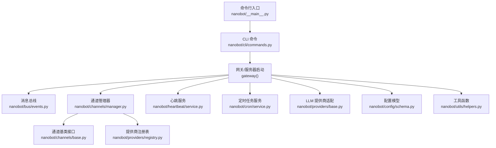
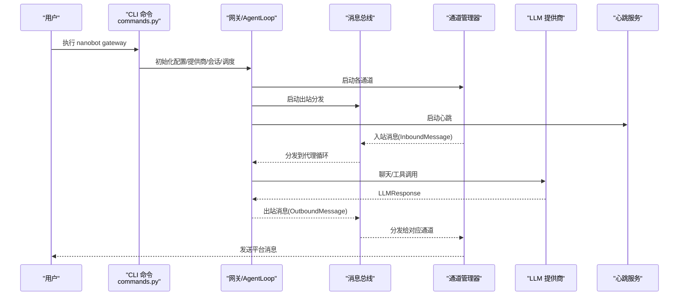
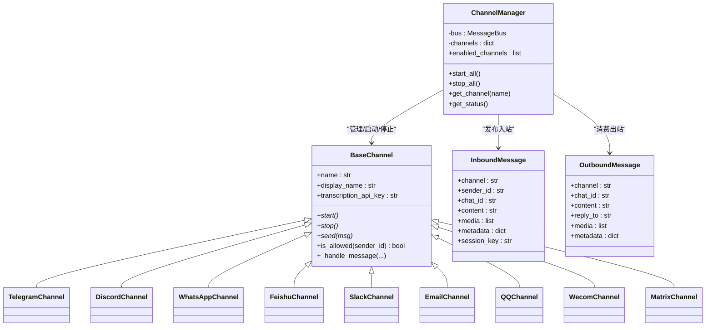
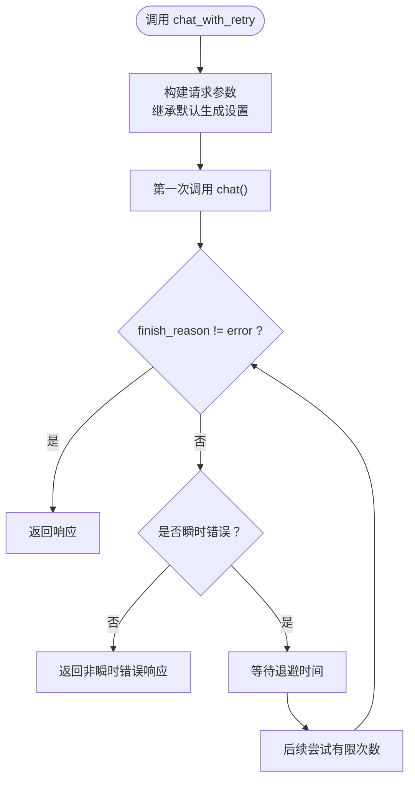
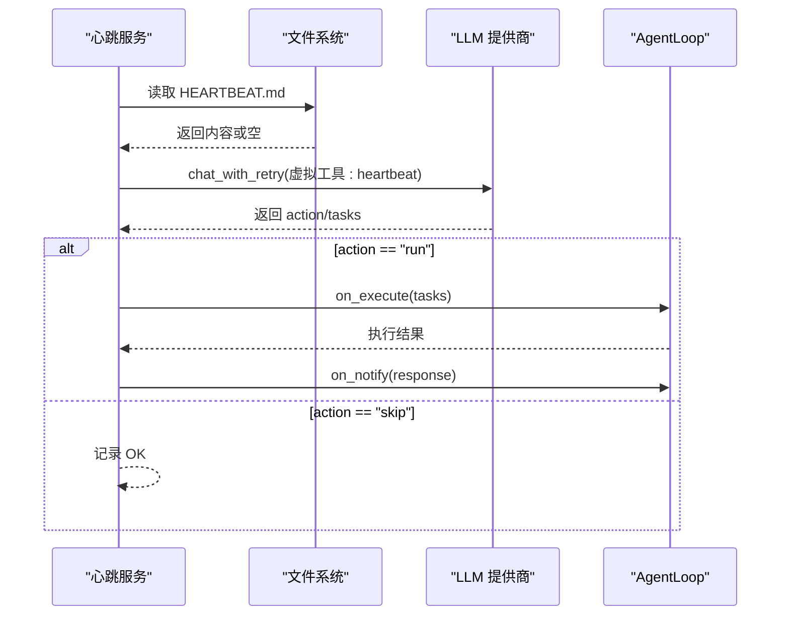
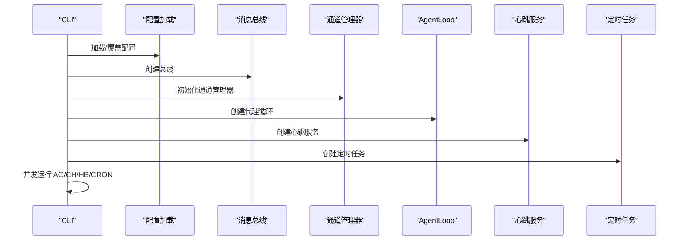
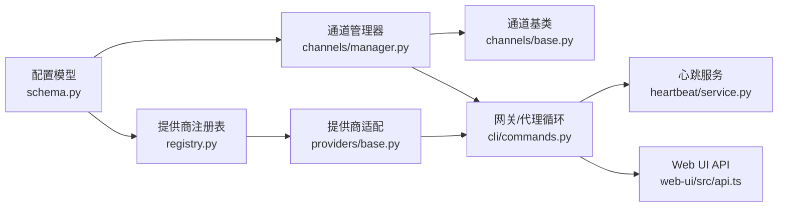

# 故障排除

<cite>
**本文引用的文件**
- [README.md](file://README.md)
- [SECURITY.md](file://SECURITY.md)
- [nanobot/__main__.py](file://nanobot/__main__.py)
- [nanobot/config/schema.py](file://nanobot/config/schema.py)
- [nanobot/utils/helpers.py](file://nanobot/utils/helpers.py)
- [nanobot/channels/base.py](file://nanobot/channels/base.py)
- [nanobot/heartbeat/service.py](file://nanobot/heartbeat/service.py)
- [nanobot/providers/base.py](file://nanobot/providers/base.py)
- [nanobot/cli/commands.py](file://nanobot/cli/commands.py)
- [nanobot/bus/events.py](file://nanobot/bus/events.py)
- [nanobot/channels/manager.py](file://nanobot/channels/manager.py)
- [nanobot/providers/registry.py](file://nanobot/providers/registry.py)
- [nanobot/web/mcp_servers.py](file://nanobot/web/mcp_servers.py)
- [nanobot/channels/matrix.py](file://nanobot/channels/matrix.py)
- [web-ui/src/api.ts](file://web-ui/src/api.ts)
</cite>

## 目录
1. [简介](#简介)
2. [项目结构](#项目结构)
3. [核心组件](#核心组件)
4. [架构总览](#架构总览)
5. [详细组件分析](#详细组件分析)
6. [依赖关系分析](#依赖关系分析)
7. [性能考量](#性能考量)
8. [故障排除指南](#故障排除指南)
9. [结论](#结论)
10. [附录](#附录)

## 简介
本指南面向运维与开发者，聚焦 Nanobot 在实际运行中可能遇到的常见问题：网络连接异常、API 调用失败、渠道集成异常、心跳与定时任务中断、MCP 工具链异常、以及安全与合规风险。文档提供系统健康检查清单、性能监控建议、日志分析方法、调试工具使用方式，并给出针对不同场景的诊断与修复步骤。

## 项目结构
Nanobot 的运行由“网关（gateway）+ 消息总线 + 渠道管理 + 代理循环 + 提供商适配层 + 心跳/定时任务 + Web UI”构成。命令入口通过 CLI 启动网关，加载配置，初始化消息总线与通道，随后进入事件驱动的异步循环。

图示来源
- [nanobot/__main__.py:1-9](file://nanobot/__main__.py#L1-L9)
- [nanobot/cli/commands.py:308-678](file://nanobot/cli/commands.py#L308-L678)
- [nanobot/bus/events.py:8-39](file://nanobot/bus/events.py#L8-L39)
- [nanobot/channels/manager.py:52-209](file://nanobot/channels/manager.py#L52-L209)
- [nanobot/heartbeat/service.py:40-174](file://nanobot/heartbeat/service.py#L40-L174)
- [nanobot/providers/base.py:69-271](file://nanobot/providers/base.py#L69-L271)
- [nanobot/providers/registry.py:19-466](file://nanobot/providers/registry.py#L19-L466)
- [nanobot/config/schema.py:351-450](file://nanobot/config/schema.py#L351-L450)
- [nanobot/utils/helpers.py:1-204](file://nanobot/utils/helpers.py#L1-L204)

章节来源
- [nanobot/__main__.py:1-9](file://nanobot/__main__.py#L1-L9)
- [nanobot/cli/commands.py:308-678](file://nanobot/cli/commands.py#L308-L678)

## 核心组件
- 配置模型：集中定义提供商、通道、网关、工具、Web 搜索等配置项，支持环境变量前缀与驼峰/蛇尾键兼容。
- 通道基类与管理器：抽象出统一的通道接口，负责接入 Telegram、Discord、WhatsApp、Feishu、Slack、Email、QQ、Wecom、Matrix 等；管理器负责启动/停止、路由与出站分发。
- LLM 提供商适配：统一聊天接口、重试策略、瞬时错误识别、消息清洗与令牌估算。
- 心跳服务：周期性读取工作区中的任务文件，通过虚拟工具调用决策是否执行，并可通知回执。
- CLI 命令：提供 onboard、gateway、agent、web-ui 等子命令，支持日志开关、工作区与配置覆盖。
- 工具函数：文件同步、消息拆分、令牌估算、安全文件名等辅助能力。

章节来源
- [nanobot/config/schema.py:351-450](file://nanobot/config/schema.py#L351-L450)
- [nanobot/channels/base.py:15-135](file://nanobot/channels/base.py#L15-L135)
- [nanobot/channels/manager.py:52-209](file://nanobot/channels/manager.py#L52-L209)
- [nanobot/providers/base.py:69-271](file://nanobot/providers/base.py#L69-L271)
- [nanobot/heartbeat/service.py:40-174](file://nanobot/heartbeat/service.py#L40-L174)
- [nanobot/cli/commands.py:170-800](file://nanobot/cli/commands.py#L170-L800)
- [nanobot/utils/helpers.py:1-204](file://nanobot/utils/helpers.py#L1-L204)

## 架构总览
下图展示从 CLI 到通道、消息总线、提供商与 Web UI 的交互路径，以及心跳与定时任务的嵌入位置。

图示来源
- [nanobot/cli/commands.py:308-678](file://nanobot/cli/commands.py#L308-L678)
- [nanobot/bus/events.py:8-39](file://nanobot/bus/events.py#L8-L39)
- [nanobot/channels/manager.py:160-190](file://nanobot/channels/manager.py#L160-L190)
- [nanobot/providers/base.py:192-266](file://nanobot/providers/base.py#L192-L266)
- [nanobot/heartbeat/service.py:108-174](file://nanobot/heartbeat/service.py#L108-L174)

## 详细组件分析

### 组件一：通道与消息总线
- 通道基类提供统一的 start/stop/send 接口，入站消息经权限校验后封装为 InboundMessage 并发布到总线；出站消息由总线分发至对应通道。
- 通道管理器负责发现与初始化启用的通道，启动出站分发协程，捕获启动/发送异常并记录日志；当 allowFrom 为空时会触发严格限制（空列表即拒绝所有）。

图示来源
- [nanobot/channels/base.py:15-135](file://nanobot/channels/base.py#L15-L135)
- [nanobot/channels/manager.py:52-209](file://nanobot/channels/manager.py#L52-L209)
- [nanobot/bus/events.py:8-39](file://nanobot/bus/events.py#L8-L39)

章节来源
- [nanobot/channels/base.py:79-135](file://nanobot/channels/base.py#L79-L135)
- [nanobot/channels/manager.py:107-159](file://nanobot/channels/manager.py#L107-L159)
- [nanobot/bus/events.py:8-39](file://nanobot/bus/events.py#L8-L39)

### 组件二：提供商适配与重试
- 提供商基类定义统一聊天接口与默认生成参数；内置瞬时错误识别标记集，支持带退避的重试；提供消息清洗以避免空内容导致的 400 错误。
- 注册表定义了多种提供商的匹配规则、前缀、默认 API Base、OAuth/本地检测等元信息，用于自动选择与路由。

图示来源
- [nanobot/providers/base.py:192-266](file://nanobot/providers/base.py#L192-L266)

章节来源
- [nanobot/providers/base.py:69-271](file://nanobot/providers/base.py#L69-L271)
- [nanobot/providers/registry.py:19-466](file://nanobot/providers/registry.py#L19-L466)

### 组件三：心跳服务
- 周期性读取工作区中的任务文件，通过虚拟工具调用让 LLM 决定是否执行；执行阶段回调代理循环，执行后可按目标通道回传结果。
- 若未找到任务或执行失败，记录相应日志；支持手动触发。

图示来源
- [nanobot/heartbeat/service.py:85-174](file://nanobot/heartbeat/service.py#L85-L174)

章节来源
- [nanobot/heartbeat/service.py:40-174](file://nanobot/heartbeat/service.py#L40-L174)

### 组件四：CLI 与网关启动流程
- CLI 提供 onboard 初始化配置与工作区模板同步；gateway 启动网关，创建消息总线、提供商、会话管理、心跳、定时任务与通道管理器，并并发运行代理循环与通道。
- 支持通过选项覆盖配置与工作区，支持日志级别控制。

图示来源
- [nanobot/cli/commands.py:308-678](file://nanobot/cli/commands.py#L308-L678)

章节来源
- [nanobot/cli/commands.py:170-800](file://nanobot/cli/commands.py#L170-L800)

## 依赖关系分析
- 配置模型与提供商注册表共同决定模型到提供商的路由与默认行为。
- 通道管理器依赖配置模型与注册表进行通道实例化与校验。
- 提供商适配层为代理循环与心跳服务提供统一的 LLM 能力。
- Web UI 通过前端 API 封装与后端交互，认证失败时触发授权事件。

图示来源
- [nanobot/config/schema.py:351-450](file://nanobot/config/schema.py#L351-L450)
- [nanobot/providers/registry.py:19-466](file://nanobot/providers/registry.py#L19-L466)
- [nanobot/providers/base.py:69-271](file://nanobot/providers/base.py#L69-L271)
- [nanobot/channels/manager.py:52-209](file://nanobot/channels/manager.py#L52-L209)
- [nanobot/channels/base.py:15-135](file://nanobot/channels/base.py#L15-L135)
- [nanobot/heartbeat/service.py:40-174](file://nanobot/heartbeat/service.py#L40-L174)
- [web-ui/src/api.ts:78-143](file://web-ui/src/api.ts#L78-L143)

章节来源
- [nanobot/config/schema.py:351-450](file://nanobot/config/schema.py#L351-L450)
- [nanobot/providers/registry.py:19-466](file://nanobot/providers/registry.py#L19-L466)
- [nanobot/providers/base.py:69-271](file://nanobot/providers/base.py#L69-L271)
- [nanobot/channels/manager.py:52-209](file://nanobot/channels/manager.py#L52-L209)
- [nanobot/channels/base.py:15-135](file://nanobot/channels/base.py#L15-L135)
- [nanobot/heartbeat/service.py:40-174](file://nanobot/heartbeat/service.py#L40-L174)
- [web-ui/src/api.ts:78-143](file://web-ui/src/api.ts#L78-L143)

## 性能考量
- 令牌估算与上下文窗口：通过工具函数估算提示词令牌数，避免超出上下文窗口导致的失败与资源浪费。
- 重试与超时：提供商层内置瞬时错误识别与有限次重试，减少网络抖动影响。
- 出站分发：通道管理器的出站分发采用轮询与超时控制，避免阻塞。
- 日志级别：CLI 提供日志开关，生产环境建议降低日志级别以减少 IO 开销。

章节来源
- [nanobot/utils/helpers.py:92-171](file://nanobot/utils/helpers.py#L92-L171)
- [nanobot/providers/base.py:192-266](file://nanobot/providers/base.py#L192-L266)
- [nanobot/channels/manager.py:160-190](file://nanobot/channels/manager.py#L160-L190)
- [nanobot/cli/commands.py:745-749](file://nanobot/cli/commands.py#L745-L749)

## 故障排除指南

### 一、系统健康检查清单
- 配置文件存在且可读：确认 ~/.nanobot/config.json 存在并包含必要的提供商与通道配置。
- 权限与访问控制：通道 allowFrom 列表已正确配置；空列表将拒绝所有访问。
- 网络连通性：提供商 API 可访问；代理/防火墙未阻断；必要时配置代理。
- 心跳与定时任务：HEARTBEAT.md 文件存在；定时任务作业已加载。
- 日志输出：根据需要开启/关闭日志，定位问题。

章节来源
- [nanobot/channels/manager.py:107-114](file://nanobot/channels/manager.py#L107-L114)
- [nanobot/heartbeat/service.py:77-84](file://nanobot/heartbeat/service.py#L77-L84)
- [nanobot/cli/commands.py:745-749](file://nanobot/cli/commands.py#L745-L749)

### 二、网络连接问题
- 现象
  - 通道无法连接或频繁断开
  - 出站消息发送失败
  - Web UI 请求 401 或无响应
- 诊断要点
  - 检查提供商 API Base 与 Key 配置是否正确
  - 检查代理设置（HTTP/SOCKS5），确保可用
  - 检查通道特定的鉴权与回调错误（如 Matrix 的鉴权/加入/发送错误）
  - 检查 Web UI 前端 API 的认证事件与响应码
- 修复步骤
  - 更新配置中的 api_base 与 api_key
  - 如需代理，配置 providers/openrouter 等的 api_base 或工具代理
  - 修正通道鉴权参数（如 token、access_token、device_id 等）
  - 修复 Web UI 登录态与 Cookie 设置

章节来源
- [nanobot/providers/base.py:192-266](file://nanobot/providers/base.py#L192-L266)
- [nanobot/channels/matrix.py:393-407](file://nanobot/channels/matrix.py#L393-L407)
- [web-ui/src/api.ts:116-143](file://web-ui/src/api.ts#L116-L143)

### 三、API 调用失败
- 现象
  - LLM 调用报错或返回瞬时错误
  - 工具调用超时或鉴权失败
- 诊断要点
  - 查看提供商层的瞬时错误标记与重试日志
  - 检查工具超时与鉴权头/凭据
  - 核对 MCP 服务器探测状态与错误摘要
- 修复步骤
  - 调整提供商默认参数（温度、最大令牌等）
  - 增大工具调用超时或优化后端性能
  - 补齐 MCP 服务器的命令/URL/鉴权/超时等参数
  - 重新探测以刷新工具列表与状态

章节来源
- [nanobot/providers/base.py:78-91](file://nanobot/providers/base.py#L78-L91)
- [nanobot/web/mcp_servers.py:444-651](file://nanobot/web/mcp_servers.py#L444-L651)

### 四、渠道集成异常
- 现象
  - 入站消息无法到达或被拒绝
  - 出站消息无法发送
  - 特定渠道出现鉴权/连接错误
- 诊断要点
  - 检查通道 allowFrom 列表与空列表限制
  - 检查通道启动异常日志
  - 检查出站分发是否被过滤（进度/提示开关）
  - 检查特定渠道的错误回调（如 Matrix）
- 修复步骤
  - 将 allowFrom 设为 ["*"] 或添加允许的用户/房间标识
  - 修复通道配置（token、端点、意图/权限等）
  - 开启/关闭进度/提示开关以验证分发逻辑
  - 修正渠道特有的鉴权与回调处理

章节来源
- [nanobot/channels/base.py:79-88](file://nanobot/channels/base.py#L79-L88)
- [nanobot/channels/manager.py:115-139](file://nanobot/channels/manager.py#L115-L139)
- [nanobot/channels/manager.py:160-190](file://nanobot/channels/manager.py#L160-L190)
- [nanobot/channels/matrix.py:393-407](file://nanobot/channels/matrix.py#L393-L407)

### 五、心跳与定时任务问题
- 现象
  - 心跳未触发或执行失败
  - 定时任务未执行或重复执行
- 诊断要点
  - 检查 HEARTBEAT.md 是否存在且有内容
  - 检查心跳间隔与启用状态
  - 检查定时任务存储与回调
- 修复步骤
  - 创建/补充 HEARTBEAT.md 内容
  - 调整心跳间隔或禁用测试
  - 修复定时任务回调中的工具上下文与发送逻辑

章节来源
- [nanobot/heartbeat/service.py:77-84](file://nanobot/heartbeat/service.py#L77-L84)
- [nanobot/heartbeat/service.py:108-174](file://nanobot/heartbeat/service.py#L108-L174)
- [nanobot/cli/commands.py:550-588](file://nanobot/cli/commands.py#L550-L588)

### 六、MCP 工具链异常
- 现象
  - MCP 服务器探测失败
  - 工具列表为空或工具调用报错
- 诊断要点
  - 根据错误信息判断是运行时缺失、连接被拒、鉴权失败还是超时
  - 检查安装目录与安装步骤元数据
- 修复步骤
  - 校验命令/脚本路径与安装目录
  - 确认远端服务已监听且网络可达
  - 校验鉴权头/令牌有效性
  - 调整工具超时或优化后端性能
  - 重新探测以更新状态

章节来源
- [nanobot/web/mcp_servers.py:444-651](file://nanobot/web/mcp_servers.py#L444-L651)

### 七、日志分析与调试工具
- 日志级别
  - CLI 提供 --logs/--no-logs 控制运行时日志输出
  - 生产建议降低日志级别，避免磁盘压力
- 调试技巧
  - 使用 CLI agent 的单次消息模式快速验证
  - 通过通道管理器的状态查询与错误日志定位问题
  - 结合提供商重试日志与错误标记快速判断瞬时/永久错误

章节来源
- [nanobot/cli/commands.py:745-749](file://nanobot/cli/commands.py#L745-L749)
- [nanobot/providers/base.py:240-247](file://nanobot/providers/base.py#L240-L247)

### 八、安全相关问题与应急响应
- 风险与防护
  - API Key 管理：禁止提交到版本控制；使用受限权限文件；定期轮换
  - 访问控制：生产必须配置 allowFrom；Empty allowFrom 即拒绝
  - Shell/文件系统：限制工具执行与工作区访问；避免 root 运行
  - 网络安全：HTTPS 默认；考虑防火墙与速率限制；定期审计依赖
- 应急响应
  - 立即撤销可疑凭据；审查日志与文件变更；更新到最新版本；上报维护者

章节来源
- [SECURITY.md:17-264](file://SECURITY.md#L17-L264)

## 结论
通过系统化的健康检查、明确的诊断流程与针对性修复步骤，大多数运行时问题可在短时间内定位并解决。建议在生产环境中遵循安全最佳实践，建立日志与告警机制，并定期演练应急响应流程，以保障系统的稳定性与安全性。

## 附录

### A. 常见错误代码与修复步骤（摘自 MCP 诊断）
- 运行时缺失：检查命令/脚本路径与安装目录
- 连接被拒：确认远端服务已监听且网络可达
- 鉴权失败：核对 env/headers/token 有效性
- 超时：评估服务性能或提高工具超时
- 探测失败：结合错误详情进一步诊断

章节来源
- [nanobot/web/mcp_servers.py:444-651](file://nanobot/web/mcp_servers.py#L444-L651)