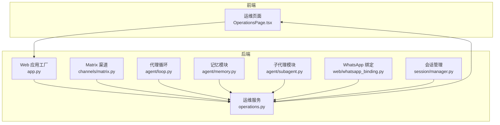
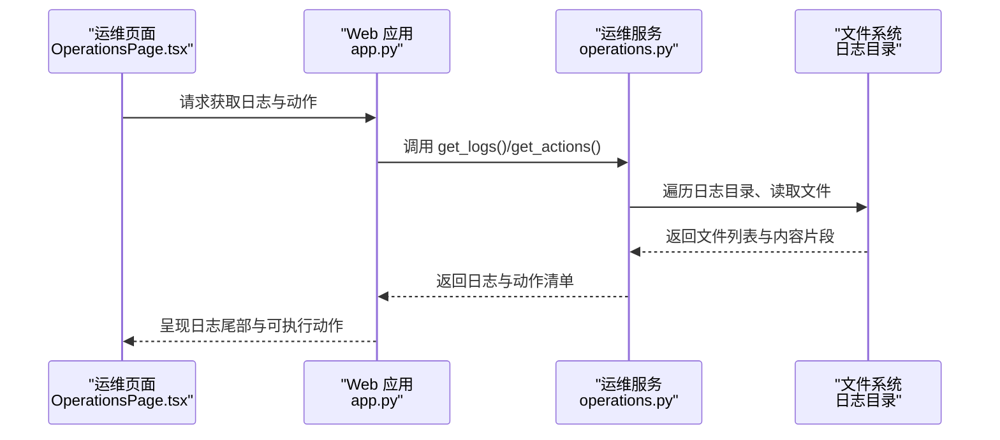
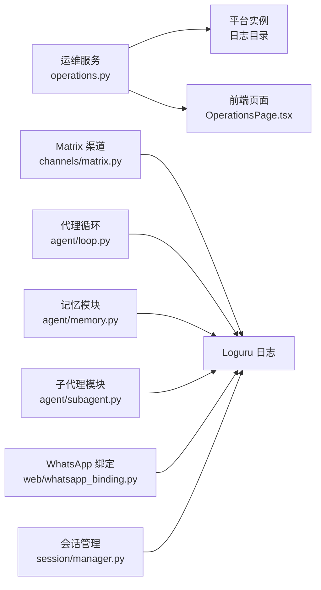

# 日志分析

<cite>
**本文引用的文件**
- [nanobot/web/operations.py](file://nanobot/web/operations.py)
- [web-ui/src/pages/OperationsPage.tsx](file://web-ui/src/pages/OperationsPage.tsx)
- [nanobot/web/app.py](file://nanobot/web/app.py)
- [nanobot/channels/matrix.py](file://nanobot/channels/matrix.py)
- [nanobot/agent/loop.py](file://nanobot/agent/loop.py)
- [nanobot/agent/memory.py](file://nanobot/agent/memory.py)
- [nanobot/agent/subagent.py](file://nanobot/agent/subagent.py)
- [nanobot/web/whatsapp_binding.py](file://nanobot/web/whatsapp_binding.py)
- [nanobot/session/manager.py](file://nanobot/session/manager.py)
- [README.md](file://README.md)
</cite>

## 目录
1. [简介](#简介)
2. [项目结构](#项目结构)
3. [核心组件](#核心组件)
4. [架构总览](#架构总览)
5. [详细组件分析](#详细组件分析)
6. [依赖分析](#依赖分析)
7. [性能考量](#性能考量)
8. [故障排查指南](#故障排查指南)
9. [结论](#结论)
10. [附录](#附录)

## 简介
本指南面向 Nanobot 的运维与研发人员，提供一套系统化的日志分析方法论与实操建议。内容覆盖日志级别配置、日志文件位置与格式、日志收集与过滤、关键日志信息的解读、错误/调试/性能日志的分析要点、日志监控工具使用与自动化分析脚本思路，以及常见日志模式与对应故障特征。

## 项目结构
Nanobot 的日志生态主要由以下部分构成：
- Web 运维服务：负责扫描实例日志目录、聚合最近日志、暴露运维动作（如重启、更新）等。
- 前端运维页面：展示日志尾部、统计日志文件数量与行数、触发运维动作。
- 底层通道与业务模块：在运行期产生各类日志（Info/Warn/Error/Exception），统一由 Loguru 输出。
- 平台实例：定义日志目录、工作区、配置与数据目录等路径。

图表来源
- [nanobot/web/app.py:70-280](file://nanobot/web/app.py#L70-L280)
- [nanobot/web/operations.py:83-102](file://nanobot/web/operations.py#L83-L102)
- [nanobot/channels/matrix.py:146-214](file://nanobot/channels/matrix.py#L146-L214)
- [nanobot/agent/loop.py:259-480](file://nanobot/agent/loop.py#L259-L480)
- [nanobot/agent/memory.py:126-144](file://nanobot/agent/memory.py#L126-L144)
- [nanobot/agent/subagent.py:116-220](file://nanobot/agent/subagent.py#L116-L220)
- [nanobot/web/whatsapp_binding.py:318-338](file://nanobot/web/whatsapp_binding.py#L318-L338)
- [nanobot/session/manager.py:125-235](file://nanobot/session/manager.py#L125-L235)

章节来源
- [nanobot/web/app.py:70-280](file://nanobot/web/app.py#L70-L280)
- [nanobot/web/operations.py:83-102](file://nanobot/web/operations.py#L83-L102)

## 核心组件
- 日志目录与扫描
  - 日志目录由平台实例决定，运维服务会枚举该目录下的文件，按修改时间倒序返回，并截取指定行数作为“日志尾部”。
  - 可通过前端“运维页面”查看日志文件数量、每文件行数与最新日志片段。
- 日志级别与输出
  - 多处模块使用 Loguru 记录 Info/Warn/Error/Exception 级别日志，便于区分普通事件、潜在问题与异常。
  - Matrix 渠道桥接标准库 logging 到 Loguru，确保第三方库日志也能被统一采集。
- 关键业务日志
  - 代理循环：消息处理开始/结束、工具调用、最大迭代警告、异常等。
  - 记忆模块：记忆合并开始/结束、参数校验提示、异常等。
  - 子代理：子任务创建、启动、完成、取消等。
  - WhatsApp 绑定：QR 更新、连接状态、错误上报等。
  - 会话管理：会话迁移、持久化、元数据更新等。

章节来源
- [nanobot/web/operations.py:83-102](file://nanobot/web/operations.py#L83-L102)
- [web-ui/src/pages/OperationsPage.tsx:98-130](file://web-ui/src/pages/OperationsPage.tsx#L98-L130)
- [nanobot/channels/matrix.py:124-144](file://nanobot/channels/matrix.py#L124-L144)
- [nanobot/agent/loop.py:259-480](file://nanobot/agent/loop.py#L259-L480)
- [nanobot/agent/memory.py:126-144](file://nanobot/agent/memory.py#L126-L144)
- [nanobot/agent/subagent.py:116-220](file://nanobot/agent/subagent.py#L116-L220)
- [nanobot/web/whatsapp_binding.py:318-338](file://nanobot/web/whatsapp_binding.py#L318-L338)
- [nanobot/session/manager.py:125-235](file://nanobot/session/manager.py#L125-L235)

## 架构总览
下图展示了从前端到后端、再到业务模块的日志采集与呈现链路。

图表来源
- [web-ui/src/pages/OperationsPage.tsx:25-38](file://web-ui/src/pages/OperationsPage.tsx#L25-L38)
- [nanobot/web/app.py:70-280](file://nanobot/web/app.py#L70-L280)
- [nanobot/web/operations.py:83-102](file://nanobot/web/operations.py#L83-L102)

## 详细组件分析

### 日志目录与格式
- 日志目录定位
  - 运维服务通过平台实例解析日志目录，遍历该目录下的文件。
  - 每个文件被读取为 UTF-8 文本，按行分割，返回最后 N 行作为“日志尾部”。
- 文件属性
  - 返回字段包括：文件名、绝对路径、大小字节、行数、最后修改时间（ISO 8601）、尾部行数组成的数组。
- 前端展示
  - 展示日志文件数量、每个文件的行数标签，以及最多若干条日志尾部内容。

章节来源
- [nanobot/web/operations.py:83-102](file://nanobot/web/operations.py#L83-L102)
- [web-ui/src/pages/OperationsPage.tsx:98-130](file://web-ui/src/pages/OperationsPage.tsx#L98-L130)

### 日志级别与输出策略
- 统一使用 Loguru
  - 多模块直接使用 logger.info/warning/error/exception 记录运行态事件。
  - Matrix 渠道通过自定义 Handler 将 nio 标准库日志桥接到 Loguru，保证第三方库日志不遗漏。
- 日志级别建议
  - Info：常规流程、任务开始/结束、成功响应等。
  - Warning：可恢复风险、参数异常、非致命错误。
  - Error：连接失败、认证失败、严重配置问题。
  - Exception：捕获异常堆栈，便于定位根因。

章节来源
- [nanobot/channels/matrix.py:124-144](file://nanobot/channels/matrix.py#L124-L144)
- [nanobot/agent/loop.py:259-480](file://nanobot/agent/loop.py#L259-L480)
- [nanobot/agent/memory.py:126-144](file://nanobot/agent/memory.py#L126-L144)
- [nanobot/agent/subagent.py:116-220](file://nanobot/agent/subagent.py#L116-L220)

### 日志收集与过滤技巧
- 收集策略
  - 使用运维服务的 get_logs 接口一次性获取多文件尾部，避免逐文件轮询。
  - 前端可选择显示的尾部行数上限（20–400），兼顾性能与可观测性。
- 过滤技巧
  - 按时间窗口：结合“最后修改时间”筛选近期文件。
  - 按关键词：在前端文本框中进行关键字过滤（例如“ERROR”、“exception”、“timeout”）。
  - 按来源：根据文件名或路径前缀区分不同模块（如矩阵、代理、记忆、子代理）。
- 自动化采集
  - 建议在容器或 systemd 环境中将 Loguru 输出重定向至 stdout/stderr，再由集中式日志系统采集（如 Loki、ELK、Cloud Logging）。

章节来源
- [nanobot/web/operations.py:83-102](file://nanobot/web/operations.py#L83-L102)
- [web-ui/src/pages/OperationsPage.tsx:98-130](file://web-ui/src/pages/OperationsPage.tsx#L98-L130)

### 关键日志信息解读
- 代理循环
  - 工具调用：记录工具名称与参数预览，便于核对输入是否符合预期。
  - 最大迭代警告：提示可能陷入循环或长时间未收敛。
  - 异常处理：出现异常时记录异常堆栈，便于回溯。
- 记忆模块
  - 合并开始/结束：用于评估记忆聚合耗时与吞吐。
  - 参数校验提示：当 LLM 未正确调用保存接口时给出告警。
- 子代理
  - 创建/启动/完成/取消：用于追踪子任务生命周期与并发状态。
- WhatsApp 绑定
  - QR 更新、连接状态、错误上报：用于判断桥接链路健康度。
- 会话管理
  - 迁移与异常：记录会话从旧路径迁移至新路径的结果与异常。

章节来源
- [nanobot/agent/loop.py:259-480](file://nanobot/agent/loop.py#L259-L480)
- [nanobot/agent/memory.py:126-144](file://nanobot/agent/memory.py#L126-L144)
- [nanobot/agent/subagent.py:116-220](file://nanobot/agent/subagent.py#L116-L220)
- [nanobot/web/whatsapp_binding.py:318-338](file://nanobot/web/whatsapp_binding.py#L318-L338)
- [nanobot/session/manager.py:125-235](file://nanobot/session/manager.py#L125-L235)

### 错误日志分析要点
- 认证/授权类错误
  - Matrix：同步/加入/发送失败且状态码属于未知令牌/禁止/未授权时，按 ERROR 级别记录，必要时视为致命错误。
- 连接/网络类错误
  - MCP 服务器连接失败：提示“将在下一条消息时重试”，需关注后续重试是否成功。
- 文件/存储类错误
  - 会话迁移异常：记录异常堆栈，检查磁盘权限与路径有效性。
- 第三方依赖错误
  - Matrix 依赖缺失：导入时报错，需安装可选依赖。

章节来源
- [nanobot/channels/matrix.py:393-407](file://nanobot/channels/matrix.py#L393-L407)
- [nanobot/agent/loop.py:172-172](file://nanobot/agent/loop.py#L172-L172)
- [nanobot/session/manager.py:133-135](file://nanobot/session/manager.py#L133-L135)

### 调试日志分析要点
- 代理循环
  - 消息处理开始/结束、系统消息处理、响应预览：用于验证消息路由与处理链路。
- 记忆模块
  - 合并进度与异常：结合“done”与“failed”两类日志，评估记忆聚合稳定性。
- 子代理
  - 执行细节与取消状态：用于定位子任务卡顿或提前终止原因。

章节来源
- [nanobot/agent/loop.py:292-368](file://nanobot/agent/loop.py#L292-L368)
- [nanobot/agent/memory.py:141-144](file://nanobot/agent/memory.py#L141-L144)
- [nanobot/agent/subagent.py:186-253](file://nanobot/agent/subagent.py#L186-L253)

### 性能日志分析要点
- 日志尾部长度与刷新频率
  - 前端默认展示少量尾部行，避免大量 IO；可根据需要调整行数上限。
- 日志文件数量与大小
  - 通过“日志文件”统计与“行数”标签，快速识别热点文件与异常膨胀。
- 第三方库日志桥接
  - Matrix 渠道桥接 nio 日志，有助于定位底层网络/加密/媒体传输问题。

章节来源
- [web-ui/src/pages/OperationsPage.tsx:92-95](file://web-ui/src/pages/OperationsPage.tsx#L92-L95)
- [nanobot/channels/matrix.py:124-144](file://nanobot/channels/matrix.py#L124-L144)

### 日志监控工具与自动化脚本示例
- 监控工具建议
  - 结合集中式日志系统（如 Loki、ELK、Cloud Logging）采集 stdout/stderr。
  - 设置告警规则：ERROR/exception 单位时间内阈值、特定关键词命中、日志文件增长过快。
- 自动化脚本思路
  - 定时调用运维服务的 get_logs 接口，将结果写入数据库或对象存储，供报表与趋势分析使用。
  - 对关键模块（代理、记忆、子代理）建立独立的告警通道，按模块过滤日志尾部。
  - 结合环境变量触发运维动作（如重启、更新），并通过日志记录动作请求与退出码。

章节来源
- [nanobot/web/operations.py:104-134](file://nanobot/web/operations.py#L104-L134)

### 常见日志模式与故障特征
- 模式一：INFO 为主，偶发 WARN
  - 特征：正常运行态，少量参数校验或策略提示。
  - 建议：持续观察，关注是否逐步增多。
- 模式二：ERROR 频繁出现
  - 特征：认证失败、网络超时、连接中断。
  - 建议：优先核查凭证、网络连通性与第三方服务可用性。
- 模式三：exception 堆栈
  - 特征：异常堆栈清晰，定位到具体模块与函数。
  - 建议：结合上下文日志与配置，复现并修复。
- 模式四：会话迁移异常
  - 特征：迁移失败日志与异常堆栈。
  - 建议：检查磁盘权限、路径存在性与文件锁。

章节来源
- [nanobot/agent/loop.py:350-350](file://nanobot/agent/loop.py#L350-L350)
- [nanobot/session/manager.py:133-135](file://nanobot/session/manager.py#L133-L135)

## 依赖分析
- 组件耦合
  - 运维服务依赖平台实例提供的日志目录路径，耦合度低，便于扩展其他实例。
  - 前端仅依赖后端接口，解耦于具体日志实现。
  - 业务模块与日志系统通过 Loguru 解耦，便于替换或增强。
- 外部依赖
  - Matrix 渠道依赖 nio 与相关安全库，缺失时会报导入错误。
  - 前端依赖 Ant Design 组件库渲染日志与动作面板。

图表来源
- [nanobot/web/operations.py:35-37](file://nanobot/web/operations.py#L35-L37)
- [web-ui/src/pages/OperationsPage.tsx:98-130](file://web-ui/src/pages/OperationsPage.tsx#L98-L130)
- [nanobot/channels/matrix.py:124-144](file://nanobot/channels/matrix.py#L124-L144)
- [nanobot/agent/loop.py:259-480](file://nanobot/agent/loop.py#L259-L480)
- [nanobot/agent/memory.py:126-144](file://nanobot/agent/memory.py#L126-L144)
- [nanobot/agent/subagent.py:116-220](file://nanobot/agent/subagent.py#L116-L220)
- [nanobot/web/whatsapp_binding.py:318-338](file://nanobot/web/whatsapp_binding.py#L318-L338)
- [nanobot/session/manager.py:125-235](file://nanobot/session/manager.py#L125-L235)

## 性能考量
- 日志读取与传输
  - 限制尾部行数（20–400），避免大文件全量读取带来的 IO 压力。
  - 按修改时间排序，优先查看最新文件，提升定位效率。
- 日志级别与开销
  - Debug 级别日志在高并发场景下应谨慎开启，避免过度 IO。
  - Info/Warn/Error/Exception 分级有助于在生产中保留关键信息的同时控制体量。
- 第三方库日志桥接
  - Matrix 渠道桥接 nio 日志，有助于快速定位底层问题，但需注意日志量级。

章节来源
- [nanobot/web/operations.py:83-84](file://nanobot/web/operations.py#L83-L84)
- [nanobot/channels/matrix.py:124-144](file://nanobot/channels/matrix.py#L124-L144)

## 故障排查指南
- 快速定位
  - 在运维页面查看“日志文件”数量与“行数”标签，优先关注最近修改的文件。
  - 使用关键字过滤（ERROR、exception、timeout、failed）缩小范围。
- 常见问题
  - 认证失败：检查 provider 凭证、token、API Base 是否正确配置。
  - 连接失败：检查网关 host/port、心跳配置、网络连通性。
  - 文件不可写：检查工作区与日志目录权限。
  - 依赖缺失：安装可选依赖（如 Matrix）。
- 动作执行
  - 通过运维页面触发“重启实例”“更新实例”等动作，观察动作状态与退出码。

章节来源
- [nanobot/web/operations.py:104-134](file://nanobot/web/operations.py#L104-L134)
- [web-ui/src/pages/OperationsPage.tsx:132-138](file://web-ui/src/pages/OperationsPage.tsx#L132-L138)
- [README.md:389-450](file://README.md#L389-L450)

## 结论
通过统一的日志目录与扫描机制、分级日志策略、前端可视化与运维动作集成，Nanobot 提供了完整的日志可观测性方案。建议在生产环境中结合集中式日志系统与告警规则，配合自动化脚本与定期巡检，持续优化日志质量与分析效率。

## 附录
- 日志目录来源：平台实例定义
- 前端页面：运维中心（日志尾部与运维动作）
- 关键模块：代理循环、记忆模块、子代理、Matrix 渠道、WhatsApp 绑定、会话管理