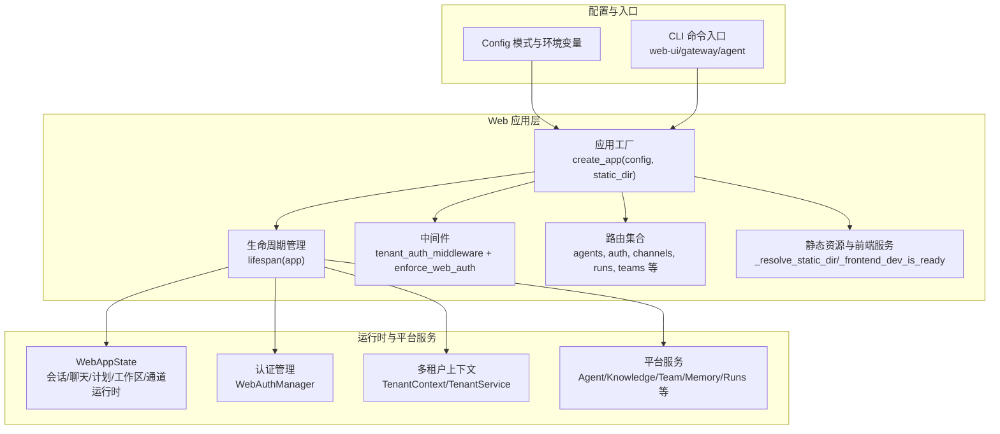
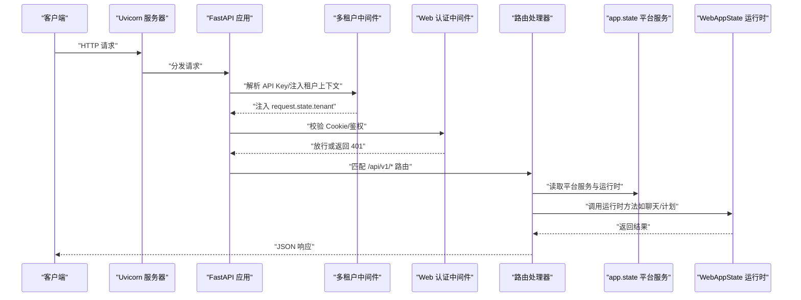
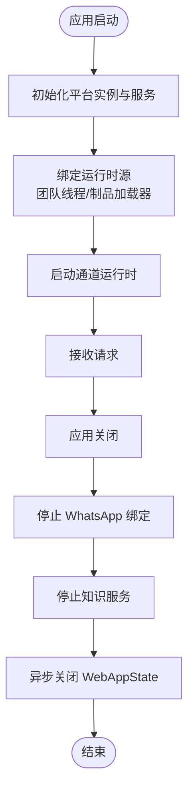
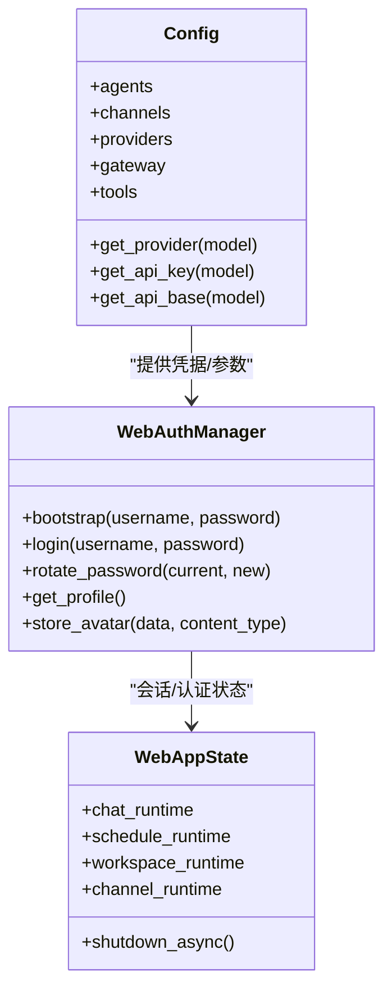
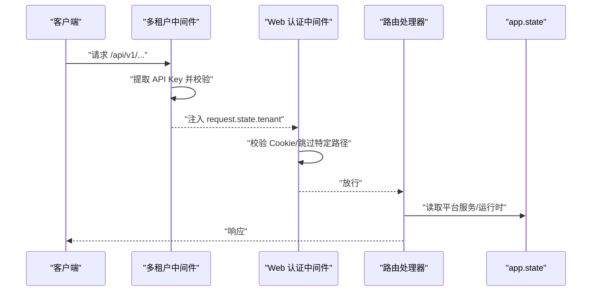
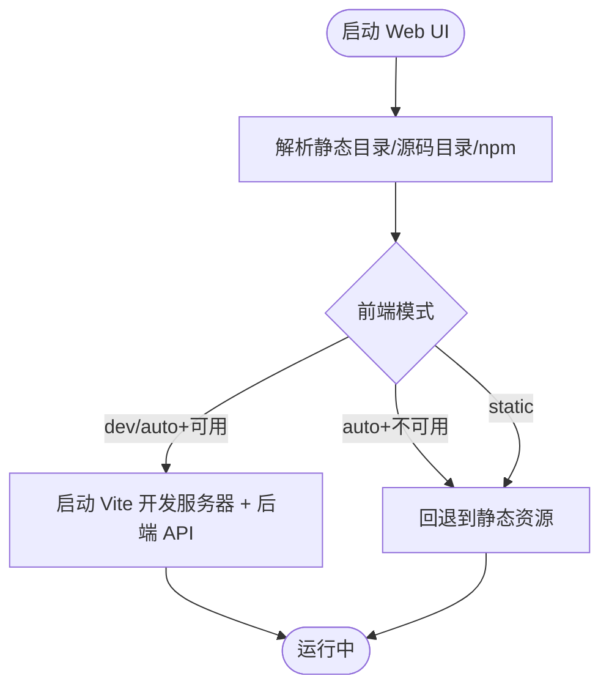
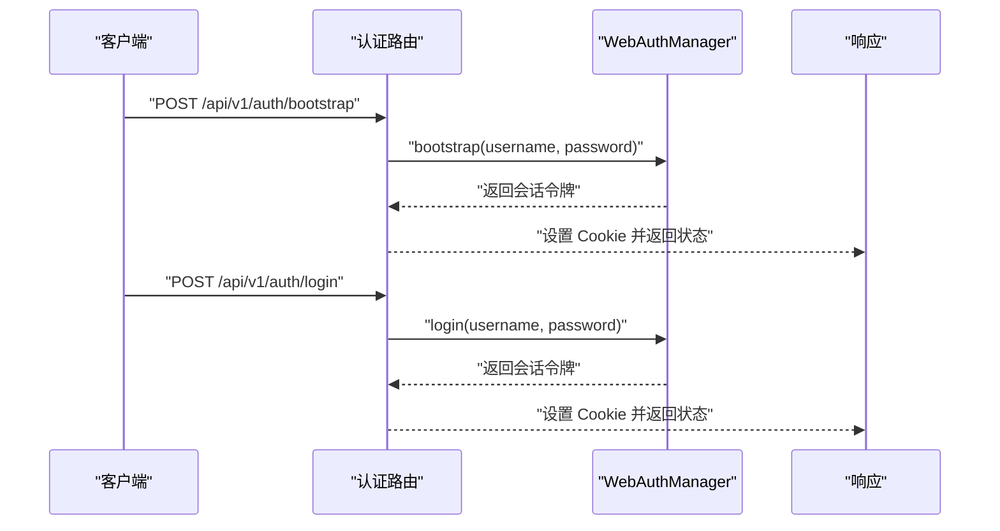
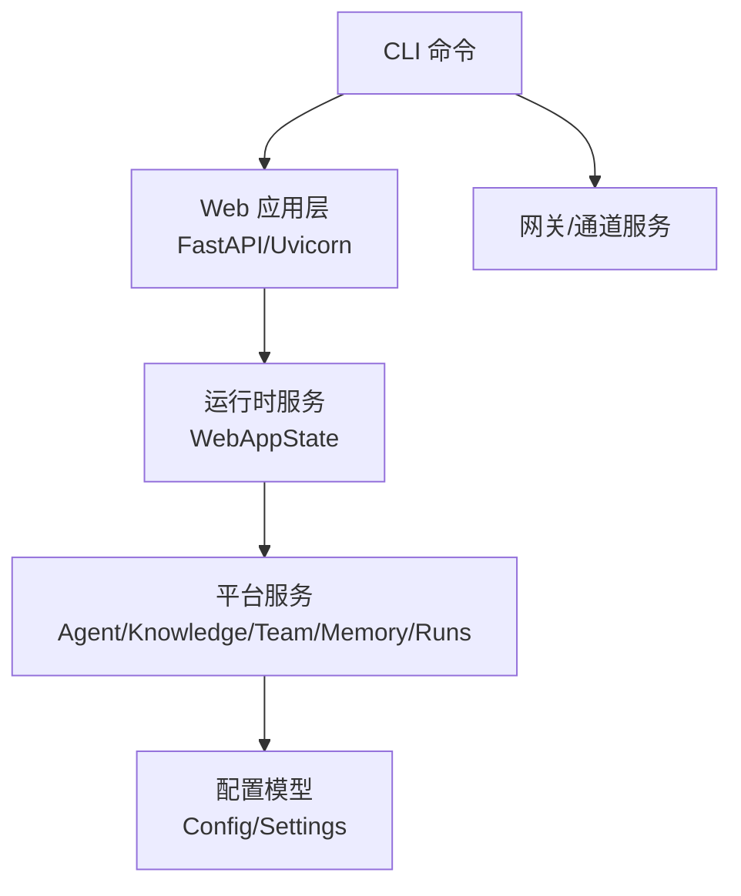

# FastAPI 应用设计

<cite>
**本文档引用的文件**
- [nanobot/web/app.py](file://nanobot/web/app.py)
- [nanobot/web/api.py](file://nanobot/web/api.py)
- [nanobot/web/runtime.py](file://nanobot/web/runtime.py)
- [nanobot/web/frontend.py](file://nanobot/web/frontend.py)
- [nanobot/web/auth.py](file://nanobot/web/auth.py)
- [nanobot/web/tenant_context.py](file://nanobot/web/tenant_context.py)
- [nanobot/web/routers/agents.py](file://nanobot/web/routers/agents.py)
- [nanobot/web/routers/auth.py](file://nanobot/web/routers/auth.py)
- [nanobot/config/loader.py](file://nanobot/config/loader.py)
- [nanobot/config/schema.py](file://nanobot/config/schema.py)
- [nanobot/cli/commands.py](file://nanobot/cli/commands.py)
- [pyproject.toml](file://pyproject.toml)
</cite>

## 目录
1. [引言](#引言)
2. [项目结构](#项目结构)
3. [核心组件](#核心组件)
4. [架构总览](#架构总览)
5. [详细组件分析](#详细组件分析)
6. [依赖分析](#依赖分析)
7. [性能考虑](#性能考虑)
8. [故障排查指南](#故障排查指南)
9. [结论](#结论)
10. [附录](#附录)

## 引言
本文件面向使用 FastAPI 构建 Web 应用的工程师，系统性阐述 nanobot 的应用工厂模式、依赖注入与配置管理、应用状态与生命周期、中间件与路由组织、开发与生产模式差异、静态资源服务与热重载机制，并给出扩展与定制的最佳实践。文档以代码为依据，辅以图示帮助不同背景读者快速理解。

## 项目结构
nanobot 将 Web UI 与后端业务逻辑解耦：Web 层通过应用工厂函数创建 FastAPI 实例，集中初始化平台服务、运行时状态与中间件；路由模块按功能域拆分；前端支持静态打包与 Vite 热重载两种运行模式；配置采用 Pydantic 模型与环境变量前缀，便于在多租户与多实例场景下灵活管理。

图表来源
- [nanobot/web/app.py:70-280](file://nanobot/web/app.py#L70-L280)
- [nanobot/web/runtime.py:72-114](file://nanobot/web/runtime.py#L72-L114)
- [nanobot/web/frontend.py:21-80](file://nanobot/web/frontend.py#L21-L80)
- [nanobot/config/schema.py:351-449](file://nanobot/config/schema.py#L351-L449)
- [nanobot/cli/commands.py:681-710](file://nanobot/cli/commands.py#L681-L710)

章节来源
- [nanobot/web/app.py:70-280](file://nanobot/web/app.py#L70-L280)
- [nanobot/web/frontend.py:21-80](file://nanobot/web/frontend.py#L21-L80)
- [nanobot/config/schema.py:351-449](file://nanobot/config/schema.py#L351-L449)
- [nanobot/cli/commands.py:681-710](file://nanobot/cli/commands.py#L681-L710)

## 核心组件
- 应用工厂与生命周期
  - 应用工厂负责解析静态目录、加载平台实例、构建认证与 MCP 服务、初始化各平台服务（代理、知识库、团队、内存、运行记录、租户等），并通过 lifespan 注入到 app.state 中，统一管理启动与关闭。
- 运行时状态
  - WebAppState 聚合聊天、计划、工作区、通道等运行时服务，提供统一的异步关闭接口，确保通道运行时、日程调度与团队运行时正确释放。
- 认证与会话
  - WebAuthManager 提供管理员账户引导、登录校验、密码轮换、头像上传与会话令牌管理；配合 Cookie 与会话过期策略保障安全。
- 多租户上下文
  - TenantContext 与 tenant_auth_middleware 支持 API Key 优先的复合认证，自动注入租户上下文，兼容非 API 路径与健康检查。
- 路由组织
  - 路由按领域拆分（如 agents、auth、channels、runs、teams 等），统一通过 APIRouter 定义，访问 app.state 获取平台服务与运行时能力。
- 前端与静态资源
  - 前端可选择静态打包或 Vite 开发服务器热重载；当未找到静态资源时返回友好提示页面。

章节来源
- [nanobot/web/app.py:70-280](file://nanobot/web/app.py#L70-L280)
- [nanobot/web/runtime.py:72-295](file://nanobot/web/runtime.py#L72-L295)
- [nanobot/web/auth.py:129-414](file://nanobot/web/auth.py#L129-L414)
- [nanobot/web/tenant_context.py:11-108](file://nanobot/web/tenant_context.py#L11-L108)
- [nanobot/web/routers/agents.py:43-162](file://nanobot/web/routers/agents.py#L43-L162)
- [nanobot/web/frontend.py:21-80](file://nanobot/web/frontend.py#L21-L80)

## 架构总览
下图展示从请求进入、中间件处理、路由分发到平台服务调用的完整链路，以及生命周期内运行时服务的启动与关闭顺序。

图表来源
- [nanobot/web/app.py:225-246](file://nanobot/web/app.py#L225-L246)
- [nanobot/web/tenant_context.py:26-92](file://nanobot/web/tenant_context.py#L26-L92)
- [nanobot/web/routers/agents.py:43-162](file://nanobot/web/routers/agents.py#L43-L162)
- [nanobot/web/runtime.py:289-295](file://nanobot/web/runtime.py#L289-L295)

章节来源
- [nanobot/web/app.py:225-246](file://nanobot/web/app.py#L225-L246)
- [nanobot/web/tenant_context.py:26-92](file://nanobot/web/tenant_context.py#L26-L92)
- [nanobot/web/routers/agents.py:43-162](file://nanobot/web/routers/agents.py#L43-L162)
- [nanobot/web/runtime.py:289-295](file://nanobot/web/runtime.py#L289-L295)

## 详细组件分析

### 应用工厂与生命周期管理
- 工厂职责
  - 解析静态资源目录，加载默认平台实例，初始化认证、MCP 注册表、仓库与服务、通道、测试、WhatsApp 绑定、设置与操作、代理/知识/团队/内存/运行/租户等服务。
  - 在 lifespan 中绑定运行时源、启动通道运行时，并在退出时安全关闭。
- 生命周期钩子
  - 启动阶段：绑定团队线程与制品为运行时源，启动通道运行时。
  - 关闭阶段：关闭 WhatsApp 绑定、知识服务，异步关闭 WebAppState。
- 异常处理
  - 自定义 APIError、请求验证错误与 HTTP 异常映射为统一 JSON 响应格式。

图表来源
- [nanobot/web/app.py:148-184](file://nanobot/web/app.py#L148-L184)
- [nanobot/web/runtime.py:289-295](file://nanobot/web/runtime.py#L289-L295)

章节来源
- [nanobot/web/app.py:70-280](file://nanobot/web/app.py#L70-L280)
- [nanobot/web/runtime.py:72-295](file://nanobot/web/runtime.py#L72-L295)

### 依赖注入与配置管理
- 依赖注入
  - 所有平台服务与运行时均通过 app.state 注入，路由处理器通过 request.app.state 获取所需服务，避免全局导入与循环依赖。
- 配置模型
  - 使用 Pydantic Settings，支持驼峰/蛇形字段互转与环境变量前缀（NANOBOT_），提供网关、渠道、工具、代理等配置项。
- 配置加载
  - 默认配置路径位于用户主目录下的 .nanobot/config.json；支持迁移旧配置格式；保存时写入磁盘并保证目录存在。

图表来源
- [nanobot/config/schema.py:351-449](file://nanobot/config/schema.py#L351-L449)
- [nanobot/web/auth.py:129-414](file://nanobot/web/auth.py#L129-L414)
- [nanobot/web/runtime.py:72-114](file://nanobot/web/runtime.py#L72-L114)

章节来源
- [nanobot/config/loader.py:26-66](file://nanobot/config/loader.py#L26-L66)
- [nanobot/config/schema.py:351-449](file://nanobot/config/schema.py#L351-L449)
- [nanobot/web/auth.py:129-414](file://nanobot/web/auth.py#L129-L414)
- [nanobot/web/runtime.py:72-114](file://nanobot/web/runtime.py#L72-L114)

### 中间件与路由组织
- 中间件
  - 多租户中间件：优先从 Authorization 或 X-API-Key 提取 API Key，校验后注入 TenantContext；否则默认租户上下文。
  - Web 认证中间件：对 /api/v1/ 路径进行 Cookie 鉴权，跳过 /api/v1/auth/* 与 /api/v1/health；支持通过 API Key 上下文跳过 Cookie 校验。
- 路由组织
  - 路由按领域拆分，统一前缀 /api/v1/，通过 request.app.state 访问平台服务与运行时；部分通用错误通过 app.exception_handler 统一处理。

图表来源
- [nanobot/web/tenant_context.py:26-92](file://nanobot/web/tenant_context.py#L26-L92)
- [nanobot/web/app.py:225-246](file://nanobot/web/app.py#L225-L246)
- [nanobot/web/routers/auth.py:87-127](file://nanobot/web/routers/auth.py#L87-L127)

章节来源
- [nanobot/web/tenant_context.py:26-92](file://nanobot/web/tenant_context.py#L26-L92)
- [nanobot/web/app.py:225-246](file://nanobot/web/app.py#L225-L246)
- [nanobot/web/routers/agents.py:43-162](file://nanobot/web/routers/agents.py#L43-L162)
- [nanobot/web/routers/auth.py:87-127](file://nanobot/web/routers/auth.py#L87-L127)

### 前端与静态资源服务
- 静态资源
  - 优先查找 web-ui/dist 或内置 static 目录；不存在时返回“前端未构建”的提示页面。
- 开发模式
  - 若检测到 web-ui 源码、npm 可用且 node_modules 存在，则启动 Vite 开发服务器与后端 API 的后台服务，通过环境变量传递 API 地址。
- 生产模式
  - 直接以静态目录运行，不启动前端开发服务器。

图表来源
- [nanobot/web/frontend.py:138-225](file://nanobot/web/frontend.py#L138-L225)
- [nanobot/web/api.py:24-57](file://nanobot/web/api.py#L24-L57)

章节来源
- [nanobot/web/frontend.py:138-225](file://nanobot/web/frontend.py#L138-L225)
- [nanobot/web/api.py:24-57](file://nanobot/web/api.py#L24-L57)

### 认证与会话
- 管理员引导与登录
  - 首次启动需引导创建管理员账户；后续登录进行 PBKDF2 密码哈希校验；支持更新资料与密码轮换。
- 会话管理
  - 生成安全随机令牌，设置 Cookie 过期时间；支持头像上传与清理。
- 错误处理
  - 对已初始化、凭证无效、头像缺失等场景抛出明确异常，路由层转换为统一错误响应。

图表来源
- [nanobot/web/routers/auth.py:92-119](file://nanobot/web/routers/auth.py#L92-L119)
- [nanobot/web/auth.py:154-194](file://nanobot/web/auth.py#L154-L194)

章节来源
- [nanobot/web/auth.py:129-414](file://nanobot/web/auth.py#L129-L414)
- [nanobot/web/routers/auth.py:87-127](file://nanobot/web/routers/auth.py#L87-L127)

### 运行时服务与扩展点
- WebAppState
  - 聚合聊天、计划、工作区、通道等运行时服务；提供会话管理、消息查询、MCP 测试聊天、模板与技能管理等能力；统一异步关闭。
- 扩展建议
  - 新增领域路由时，优先通过 app.state 访问现有服务；若需新增平台服务，可在工厂中注入并在 lifespan 初始化；避免直接在路由中创建重型对象。

章节来源
- [nanobot/web/runtime.py:72-295](file://nanobot/web/runtime.py#L72-L295)

## 依赖分析
- 语言与框架
  - Python 3.11+，FastAPI、Uvicorn、Pydantic/Settings、loguru、rich、croniter、langgraph/langchain 等。
- 依赖关系
  - Web 层依赖平台服务与运行时；平台服务依赖配置与实例；CLI 提供入口命令，调用 Web API 启动前端或网关。

图表来源
- [pyproject.toml:19-55](file://pyproject.toml#L19-L55)
- [nanobot/web/app.py:70-280](file://nanobot/web/app.py#L70-L280)
- [nanobot/cli/commands.py:308-710](file://nanobot/cli/commands.py#L308-L710)

章节来源
- [pyproject.toml:19-55](file://pyproject.toml#L19-L55)
- [nanobot/cli/commands.py:308-710](file://nanobot/cli/commands.py#L308-L710)

## 性能考虑
- 事件循环与并发
  - 运行时服务使用异步关闭，避免阻塞；聊天与 MCP 测试接口采用异步回调推进进度。
- 资源管理
  - 生命周期统一管理通道运行时与知识服务，减少泄漏风险；静态资源按需加载，开发模式下仅在需要时启动 Vite。
- 配置与环境变量
  - 通过环境变量前缀快速覆盖配置，适合容器化部署与多环境管理。

## 故障排查指南
- 常见问题
  - 前端未构建：静态目录不存在时返回提示页面，需先构建或启用开发模式。
  - 认证失败：检查 Cookie 是否设置、会话是否过期；确认管理员账户已引导。
  - API Key 无效：核对 Authorization 或 X-API-Key 头部格式与租户匹配。
  - 配置加载失败：检查 ~/.nanobot/config.json 格式与权限，必要时重新初始化。
- 排查步骤
  - 查看日志输出与统一错误响应体；确认路由前缀与路径是否正确；检查 app.state 注入的服务是否可用。

章节来源
- [nanobot/web/frontend.py:51-78](file://nanobot/web/frontend.py#L51-L78)
- [nanobot/web/tenant_context.py:64-81](file://nanobot/web/tenant_context.py#L64-L81)
- [nanobot/config/loader.py:36-48](file://nanobot/config/loader.py#L36-L48)

## 结论
该 FastAPI 应用通过应用工厂模式与生命周期管理实现了清晰的依赖注入与状态管理；多租户中间件与认证中间件提供了灵活的安全控制；路由按领域拆分，便于扩展；前端支持静态与热重载两种模式，满足开发与生产的差异化需求。结合统一的配置模型与运行时服务，系统具备良好的可维护性与可扩展性。

## 附录
- 最佳实践
  - 路由层只做参数校验与调用 app.state 服务，避免在路由中创建重型对象。
  - 新增平台服务时，在工厂注入并在 lifespan 初始化，确保生命周期一致。
  - 使用环境变量前缀覆盖配置，便于 CI/CD 与容器化部署。
  - 开发模式优先使用 Vite 热重载提升迭代效率，生产模式使用静态资源以降低运行时开销。