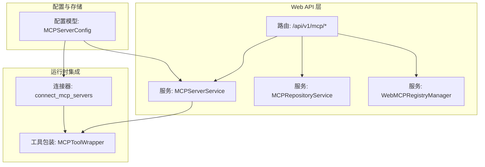
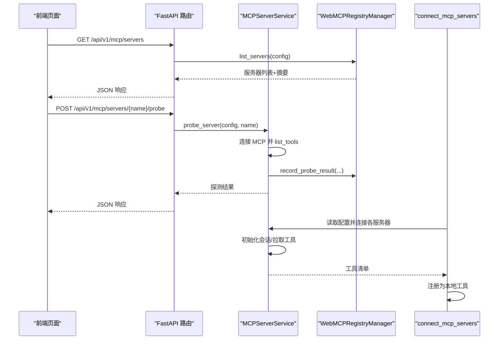
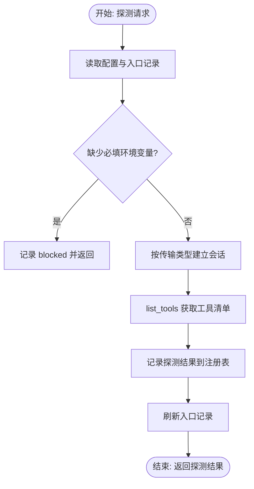
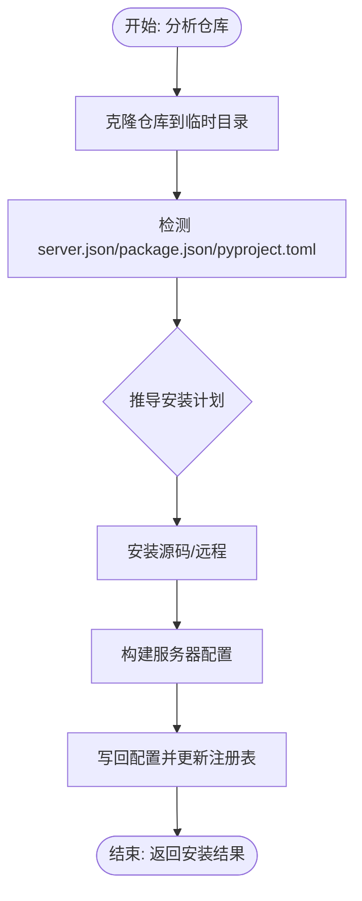
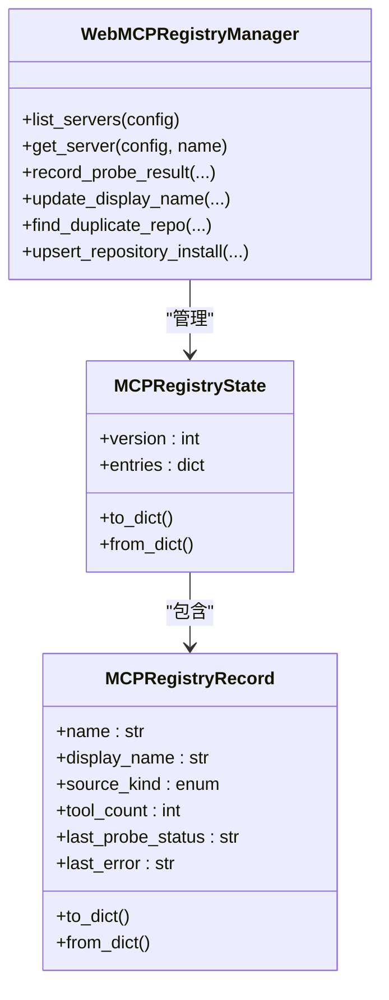
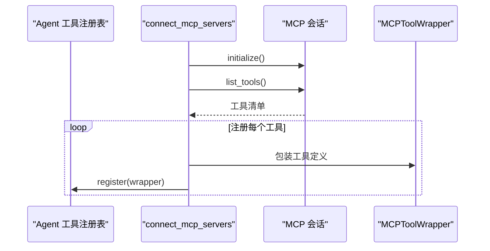
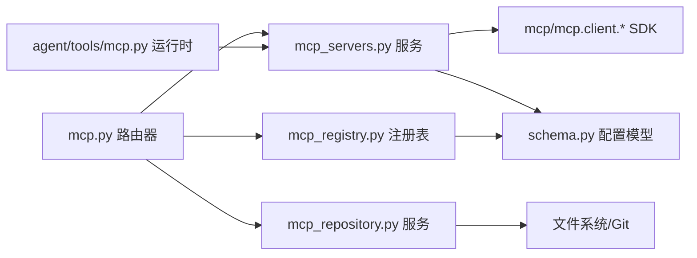

# MCP 协议 API

<cite>
**本文引用的文件**
- [nanobot/web/routers/mcp.py](file://nanobot/web/routers/mcp.py)
- [nanobot/web/mcp_registry.py](file://nanobot/web/mcp_registry.py)
- [nanobot/web/mcp_repository.py](file://nanobot/web/mcp_repository.py)
- [nanobot/web/mcp_servers.py](file://nanobot/web/mcp_servers.py)
- [nanobot/agent/tools/mcp.py](file://nanobot/agent/tools/mcp.py)
- [nanobot/web/app.py](file://nanobot/web/app.py)
- [nanobot/config/schema.py](file://nanobot/config/schema.py)
- [web-ui/src/pages/McpPage.tsx](file://web-ui/src/pages/McpPage.tsx)
- [web-ui/src/pages/McpServerDetailPage.tsx](file://web-ui/src/pages/McpServerDetailPage.tsx)
</cite>

## 目录
1. [简介](#简介)
2. [项目结构](#项目结构)
3. [核心组件](#核心组件)
4. [架构总览](#架构总览)
5. [详细组件分析](#详细组件分析)
6. [依赖分析](#依赖分析)
7. [性能考量](#性能考量)
8. [故障排查指南](#故障排查指南)
9. [结论](#结论)
10. [附录](#附录)

## 简介
本文件面向 MCP（Model Context Protocol）协议在 nanobot 中的 Web API 实现，系统性梳理 MCP 服务器注册、工具同步与协议通信的端点接口，覆盖服务器发现、工具清单获取、远程工具调用、协议适配、消息路由与状态同步等能力。同时提供 MCP 服务器配置、工具注册与协议测试的完整示例，以及安全认证与连接管理的最佳实践。

## 项目结构
围绕 MCP 的 Web API 主要由以下模块构成：
- 路由层：定义 /api/v1/mcp 下的全部端点，负责请求解析与响应封装
- 服务层：MCP 注册表、仓库分析与安装、服务器运维（探测、修复、更新）
- 配置模型：MCPServerConfig 定义 MCP 服务器连接参数
- 运行时集成：将 MCP 工具注册到 Agent 工具注册表，实现协议适配与消息路由
- 前端页面：MCP 列表页与详情页，驱动 API 完成交互

图表来源
- [nanobot/web/routers/mcp.py:45-216](file://nanobot/web/routers/mcp.py#L45-L216)
- [nanobot/web/mcp_servers.py:23-706](file://nanobot/web/mcp_servers.py#L23-L706)
- [nanobot/web/mcp_repository.py:18-589](file://nanobot/web/mcp_repository.py#L18-L589)
- [nanobot/web/mcp_registry.py:145-378](file://nanobot/web/mcp_registry.py#L145-L378)
- [nanobot/agent/tools/mcp.py:14-153](file://nanobot/agent/tools/mcp.py#L14-L153)
- [nanobot/config/schema.py:329-349](file://nanobot/config/schema.py#L329-L349)

章节来源
- [nanobot/web/routers/mcp.py:1-216](file://nanobot/web/routers/mcp.py#L1-L216)
- [nanobot/web/app.py:70-281](file://nanobot/web/app.py#L70-L281)

## 核心组件
- 路由器（/api/v1/mcp）：提供 MCP 服务器生命周期管理、仓库分析与安装、测试聊天等端点
- 服务器服务（MCPServerService）：负责服务器探测、修复计划生成、修复执行、配置更新与删除
- 仓库服务（MCPRepositoryService）：分析 GitHub 仓库结构，推导安装计划，执行安装并写回配置
- 注册表（WebMCPRegistryManager）：维护 MCP 元数据（来源、安装信息、工具计数、探测状态等），并与配置同步
- 工具包装（MCPToolWrapper）：将 MCP 工具转换为 nanobot 工具，统一参数与执行逻辑
- 运行时连接（connect_mcp_servers）：根据配置建立 MCP 会话，拉取工具清单并注册到工具注册表

章节来源
- [nanobot/web/mcp_servers.py:23-706](file://nanobot/web/mcp_servers.py#L23-L706)
- [nanobot/web/mcp_repository.py:18-589](file://nanobot/web/mcp_repository.py#L18-L589)
- [nanobot/web/mcp_registry.py:145-378](file://nanobot/web/mcp_registry.py#L145-L378)
- [nanobot/agent/tools/mcp.py:14-153](file://nanobot/agent/tools/mcp.py#L14-L153)
- [nanobot/config/schema.py:329-349](file://nanobot/config/schema.py#L329-L349)

## 架构总览
MCP 协议在 nanobot 中的端到端流程如下：
- Web UI 通过 /api/v1/mcp 端点提交操作（列举、探测、修复、安装、更新、删除）
- 服务层基于配置与平台实例进行实际操作（进程/HTTP 连接、文件系统、Git）
- 注册表持久化 MCP 元数据，用于前端展示与诊断
- 运行时在 Agent 启动时连接 MCP 服务器，拉取工具清单并注册为本地工具

图表来源
- [nanobot/web/routers/mcp.py:45-216](file://nanobot/web/routers/mcp.py#L45-L216)
- [nanobot/web/mcp_servers.py:139-211](file://nanobot/web/mcp_servers.py#L139-L211)
- [nanobot/web/mcp_registry.py:154-180](file://nanobot/web/mcp_registry.py#L154-L180)
- [nanobot/agent/tools/mcp.py:74-153](file://nanobot/agent/tools/mcp.py#L74-L153)

## 详细组件分析

### 路由与端点定义
- 服务器管理
  - GET /api/v1/mcp/servers：列出所有 MCP 服务器及摘要
  - GET /api/v1/mcp/servers/{server_name}：获取单个服务器详情
  - POST /api/v1/mcp/servers/{server_name}/probe：探测服务器并返回工具清单
  - GET /api/v1/mcp/servers/{server_name}/repair-plan：生成修复计划
  - POST /api/v1/mcp/servers/{server_name}/repair-run：运行修复（受限/危险）
  - POST /api/v1/mcp/servers/{server_name}/enabled：启用/停用服务器
  - PUT /api/v1/mcp/servers/{server_name}：更新服务器配置
  - DELETE /api/v1/mcp/servers/{server_name}：删除服务器（可清理受管安装）
- 测试聊天
  - GET /api/v1/mcp/servers/{server_name}/test-chat：获取隔离测试会话
  - DELETE /api/v1/mcp/servers/{server_name}/test-chat：清空隔离测试会话
  - POST /api/v1/mcp/servers/{server_name}/test-chat/messages：发送测试消息
- 仓库分析与安装
  - POST /api/v1/mcp/repositories/inspect：分析仓库并返回安装计划
  - POST /api/v1/mcp/repositories/install：安装并登记 MCP

章节来源
- [nanobot/web/routers/mcp.py:45-216](file://nanobot/web/routers/mcp.py#L45-L216)

### 服务器服务（MCPServerService）
职责与关键流程：
- 探测（probe_server）：根据配置选择 stdio/sse/streamableHttp，初始化会话并 list_tools，记录探测结果到注册表
- 修复（get_repair_plan/run_repair）：基于诊断生成修复步骤，支持受限与危险模式，通过外部 worker 执行
- 更新（update_server）：校验传输类型与参数，写回配置并更新显示名
- 删除（remove_server）：从配置移除，尝试删除受管安装目录
- 诊断（_diagnose_server）：综合环境变量、传输类型、上次探测状态生成诊断与修复步骤

图表来源
- [nanobot/web/mcp_servers.py:139-211](file://nanobot/web/mcp_servers.py#L139-L211)
- [nanobot/web/mcp_servers.py:399-501](file://nanobot/web/mcp_servers.py#L399-L501)

章节来源
- [nanobot/web/mcp_servers.py:23-706](file://nanobot/web/mcp_servers.py#L23-L706)

### 仓库服务（MCPRepositoryService）
职责与关键流程：
- 分析（analyze_repository）：克隆仓库，解析 server.json/package.json/pyproject.toml，推导安装模式、传输方式、运行命令与安装步骤
- 安装（install_repository）：校验重复、执行安装步骤、构建服务器配置、写回配置并更新注册表
- 运行时检测：收集缺失运行时与必填环境变量，指导下一步操作

图表来源
- [nanobot/web/mcp_repository.py:27-104](file://nanobot/web/mcp_repository.py#L27-L104)
- [nanobot/web/mcp_repository.py:137-166](file://nanobot/web/mcp_repository.py#L137-L166)

章节来源
- [nanobot/web/mcp_repository.py:18-589](file://nanobot/web/mcp_repository.py#L18-L589)

### 注册表（WebMCPRegistryManager）
职责与关键流程：
- 维护 MCP 元数据（来源、安装信息、工具计数、最后探测状态、错误等）
- 与配置同步，构建对外展示项（含状态与统计）
- 记录探测结果、更新显示名、查找重复仓库

图表来源
- [nanobot/web/mcp_registry.py:145-378](file://nanobot/web/mcp_registry.py#L145-L378)

章节来源
- [nanobot/web/mcp_registry.py:1-378](file://nanobot/web/mcp_registry.py#L1-L378)

### 工具包装与运行时集成（MCPToolWrapper、connect_mcp_servers）
职责与关键流程：
- MCPToolWrapper：将 MCP 工具名映射为本地工具名，封装参数 Schema，执行时调用 session.call_tool，并处理超时与异常
- connect_mcp_servers：根据配置选择传输（stdio/sse/streamableHttp），初始化会话，list_tools 并批量注册为本地工具

图表来源
- [nanobot/agent/tools/mcp.py:74-153](file://nanobot/agent/tools/mcp.py#L74-L153)
- [nanobot/agent/tools/mcp.py:14-72](file://nanobot/agent/tools/mcp.py#L14-L72)

章节来源
- [nanobot/agent/tools/mcp.py:1-153](file://nanobot/agent/tools/mcp.py#L1-L153)

### 配置模型（MCPServerConfig）
- 支持三种传输：stdio、sse、streamableHttp
- stdio：command、args、env
- HTTP：url、headers
- 通用：enabled、tool_timeout

章节来源
- [nanobot/config/schema.py:329-349](file://nanobot/config/schema.py#L329-L349)

### 前端页面与 API 驱动
- MCP 列表页：展示服务器状态、工具数、来源与安装信息，支持预检仓库、安装与探测
- MCP 详情页：编辑连接参数、保存配置、生成修复计划、运行修复、隔离测试聊天、删除服务器

章节来源
- [web-ui/src/pages/McpPage.tsx:1-380](file://web-ui/src/pages/McpPage.tsx#L1-L380)
- [web-ui/src/pages/McpServerDetailPage.tsx:1-694](file://web-ui/src/pages/McpServerDetailPage.tsx#L1-L694)

## 依赖分析
- 路由器依赖应用状态中的 mcp_servers、mcp_registry、mcp_repository 服务
- 服务器服务依赖 mcp_sdk（mcp、mcp.client.*）进行协议通信
- 仓库服务依赖 git 子进程与文件系统
- 注册表与配置模型解耦，便于持久化与前端展示
- 运行时连接依赖工具注册表，实现 MCP 工具到本地工具的桥接

图表来源
- [nanobot/web/app.py:70-281](file://nanobot/web/app.py#L70-L281)
- [nanobot/web/mcp_servers.py:23-706](file://nanobot/web/mcp_servers.py#L23-L706)
- [nanobot/web/mcp_repository.py:18-589](file://nanobot/web/mcp_repository.py#L18-L589)
- [nanobot/web/mcp_registry.py:145-378](file://nanobot/web/mcp_registry.py#L145-L378)
- [nanobot/agent/tools/mcp.py:74-153](file://nanobot/agent/tools/mcp.py#L74-L153)
- [nanobot/config/schema.py:329-349](file://nanobot/config/schema.py#L329-L349)

章节来源
- [nanobot/web/app.py:70-281](file://nanobot/web/app.py#L70-L281)

## 性能考量
- 工具超时：通过 tool_timeout 控制单次工具调用上限，避免阻塞
- 传输选择：HTTP 传输使用显式 httpx 客户端，避免默认超时影响上层控制
- 探测并发：路由层按服务器串行探测，避免资源竞争；可在前端批量触发时注意节流
- 仓库分析：使用临时目录与浅克隆（depth=1）降低网络与磁盘开销
- 注册表持久化：采用原子替换写入，减少竞态风险

## 故障排查指南
常见错误与定位要点：
- MCP_SERVER_NOT_FOUND：服务器名不存在或已被删除
- VALIDATION_ERROR：请求体字段校验失败（如 content 为空）
- MCP_PROBE_FAILED：连接失败、鉴权失败、超时或运行时缺失
- MCP_REPAIR_*：修复任务冲突、未配置 worker、危险模式未启用
- MCP_REPOSITORY_*：仓库地址非法、重复安装、安装步骤失败

排查步骤建议：
- 先执行探测，查看 statusLabel 与 error
- 若缺失环境变量，补齐后重新探测
- 若为 HTTP 连接，确认 URL 可达、鉴权头有效
- 若为 stdio，确认命令与路径存在
- 使用修复计划生成器，按步骤逐一修正

章节来源
- [nanobot/web/routers/mcp.py:58-98](file://nanobot/web/routers/mcp.py#L58-L98)
- [nanobot/web/mcp_servers.py:139-211](file://nanobot/web/mcp_servers.py#L139-L211)

## 结论
本文档系统化梳理了 nanobot 中 MCP 协议的 Web API，涵盖服务器注册、仓库安装、探测修复、配置更新与运行时集成。通过清晰的端点设计、稳健的服务层实现与完善的前端交互，用户可高效地完成 MCP 服务器的全生命周期管理，并在运行时无缝获得远程工具能力。

## 附录

### API 端点一览（按功能分组）

- 服务器管理
  - GET /api/v1/mcp/servers
  - GET /api/v1/mcp/servers/{server_name}
  - POST /api/v1/mcp/servers/{server_name}/probe
  - GET /api/v1/mcp/servers/{server_name}/repair-plan
  - POST /api/v1/mcp/servers/{server_name}/repair-run
  - POST /api/v1/mcp/servers/{server_name}/enabled
  - PUT /api/v1/mcp/servers/{server_name}
  - DELETE /api/v1/mcp/servers/{server_name}

- 测试聊天
  - GET /api/v1/mcp/servers/{server_name}/test-chat
  - DELETE /api/v1/mcp/servers/{server_name}/test-chat
  - POST /api/v1/mcp/servers/{server_name}/test-chat/messages

- 仓库分析与安装
  - POST /api/v1/mcp/repositories/inspect
  - POST /api/v1/mcp/repositories/install

章节来源
- [nanobot/web/routers/mcp.py:45-216](file://nanobot/web/routers/mcp.py#L45-L216)

### 安全与连接管理最佳实践
- 认证：Web API 对 /api/v1/ 路径强制 Cookie 认证，Tenant Key 可绕过
- 传输安全：HTTP 传输建议使用受信网络与鉴权头；必要时启用代理
- 环境变量：在 env/headers 中集中管理敏感信息，避免明文存储
- 修复模式：默认受限修复，危险模式需显式允许；修复过程通过外部 worker 执行
- 超时与重试：合理设置 tool_timeout，关注网络波动与远端服务性能

章节来源
- [nanobot/web/app.py:225-246](file://nanobot/web/app.py#L225-L246)
- [nanobot/web/mcp_servers.py:234-288](file://nanobot/web/mcp_servers.py#L234-L288)