# RESTful API 设计

<cite>
**本文引用的文件**
- [nanobot/web/app.py](file://nanobot/web/app.py)
- [nanobot/web/api.py](file://nanobot/web/api.py)
- [nanobot/web/routers/__init__.py](file://nanobot/web/routers/__init__.py)
- [nanobot/web/routers/agents.py](file://nanobot/web/routers/agents.py)
- [nanobot/web/routers/channels.py](file://nanobot/web/routers/channels.py)
- [nanobot/web/routers/chat.py](file://nanobot/web/routers/chat.py)
- [nanobot/web/routers/memory.py](file://nanobot/web/routers/memory.py)
- [nanobot/web/routers/teams.py](file://nanobot/web/routers/teams.py)
- [nanobot/web/routers/knowledge.py](file://nanobot/web/routers/knowledge.py)
- [nanobot/web/routers/operations.py](file://nanobot/web/routers/operations.py)
- [nanobot/web/routers/runs.py](file://nanobot/web/routers/runs.py)
- [nanobot/web/routers/tenants.py](file://nanobot/web/routers/tenants.py)
- [nanobot/web/routers/channel_bindings.py](file://nanobot/web/routers/channel_bindings.py)
- [nanobot/web/routers/schedule.py](file://nanobot/web/routers/schedule.py)
- [nanobot/web/routers/workspace.py](file://nanobot/web/routers/workspace.py)
- [nanobot/web/http.py](file://nanobot/web/http.py)
- [nanobot/web/auth.py](file://nanobot/web/auth.py)
- [nanobot/web/tenant_context.py](file://nanobot/web/tenant_context.py)
</cite>

## 目录
1. [引言](#引言)
2. [项目结构](#项目结构)
3. [核心组件](#核心组件)
4. [架构总览](#架构总览)
5. [详细组件分析](#详细组件分析)
6. [依赖分析](#依赖分析)
7. [性能考虑](#性能考虑)
8. [故障排查指南](#故障排查指南)
9. [结论](#结论)
10. [附录](#附录)

## 引言
本文件面向基于 FastAPI 的 RESTful API 设计与实现，系统性阐述路由体系、端点组织、请求响应模式、参数校验、错误处理、版本控制策略、文档生成与测试方法，并给出 API 设计规范与最佳实践。重点覆盖以下领域路由器模块：agents、channels、chat、memory、teams、knowledge、runs、tenants、channel_bindings、schedule、workspace、operations、auth、mcp（由应用入口统一注册）。

## 项目结构
后端采用 FastAPI 应用工厂模式创建服务实例，通过中间件注入多租户上下文与认证态，统一注册各领域路由器模块，形成清晰的按域分层路由组织。

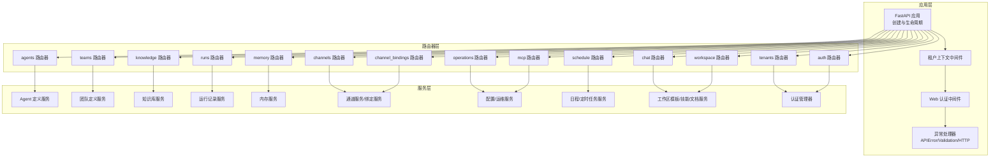

图表来源
- [nanobot/web/app.py:70-280](file://nanobot/web/app.py#L70-L280)
- [nanobot/web/routers/__init__.py:19-35](file://nanobot/web/routers/__init__.py#L19-L35)

章节来源
- [nanobot/web/app.py:70-280](file://nanobot/web/app.py#L70-L280)
- [nanobot/web/routers/__init__.py:19-35](file://nanobot/web/routers/__init__.py#L19-L35)

## 核心组件
- 应用工厂与生命周期：在应用工厂中完成实例化、状态注入、中间件注册与路由器挂载，确保服务层依赖在请求上下文中可用。
- 中间件链路：租户上下文中间件优先于 Web 认证中间件执行，支持 API Key 与 Cookie 双重鉴权；健康检查与认证端点豁免。
- 统一响应与错误：通过通用 HTTP 辅助模块输出统一响应体，自定义 APIError 用于结构化错误返回。
- 版本控制：所有 API 前缀为 /api/v1，便于未来版本演进与兼容策略制定。
- 文档生成：使用 FastAPI 内置 OpenAPI/Swagger 文档能力，结合统一响应与错误处理，提升接口可读性。

章节来源
- [nanobot/web/app.py:186-280](file://nanobot/web/app.py#L186-L280)
- [nanobot/web/http.py:11-40](file://nanobot/web/http.py#L11-L40)
- [nanobot/web/tenant_context.py:26-92](file://nanobot/web/tenant_context.py#L26-L92)
- [nanobot/web/auth.py:129-194](file://nanobot/web/auth.py#L129-L194)

## 架构总览
下图展示从客户端到服务层的调用路径与错误处理策略：

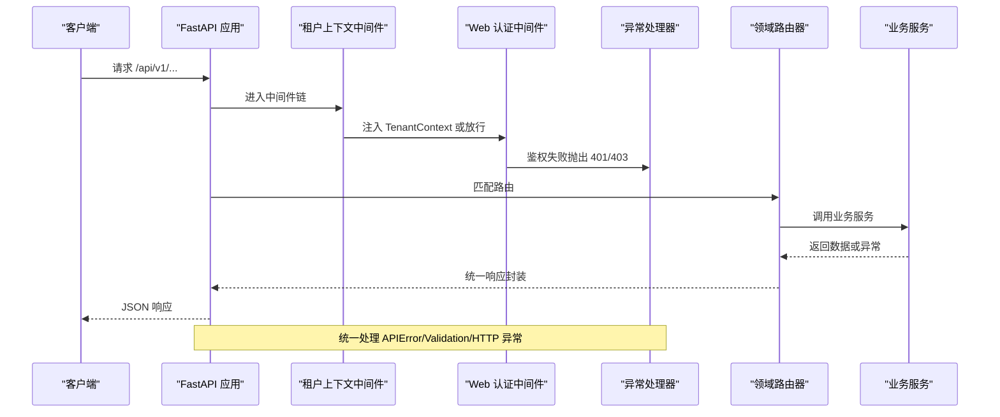

图表来源
- [nanobot/web/app.py:205-246](file://nanobot/web/app.py#L205-L246)
- [nanobot/web/tenant_context.py:26-92](file://nanobot/web/tenant_context.py#L26-L92)
- [nanobot/web/auth.py:129-194](file://nanobot/web/auth.py#L129-L194)
- [nanobot/web/http.py:23-40](file://nanobot/web/http.py#L23-L40)

## 详细组件分析

### 路由器：agents（智能体定义）
- 功能：提供智能体的增删改查、复制、启停、模板解析、测试运行等能力。
- 参数校验：使用 Pydantic 模型进行请求体校验；查询参数使用 Query 并设置范围约束。
- 错误处理：捕获定义冲突、未找到、校验错误，映射为结构化错误码与状态码。
- 关键端点示例：
  - GET /api/v1/agents?enabled=... 列表过滤
  - POST /api/v1/agents 创建（支持模板快照）
  - PUT /api/v1/agents/{agent_id} 更新
  - DELETE /api/v1/agents/{agent_id} 删除
  - POST /api/v1/agents/{agent_id}/copy 复制
  - POST /api/v1/agents/{agent_id}/enable/disable 启停
  - POST /api/v1/agents/{agent_id}/test-run 测试运行

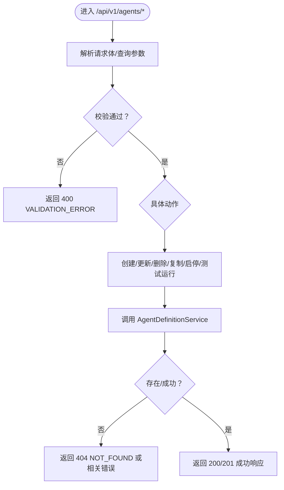

图表来源
- [nanobot/web/routers/agents.py:43-162](file://nanobot/web/routers/agents.py#L43-L162)

章节来源
- [nanobot/web/routers/agents.py:43-162](file://nanobot/web/routers/agents.py#L43-L162)

### 路由器：channels（通道管理）
- 功能：列出通道、更新通道配置、通道投递策略、通道测试、WhatsApp 绑定状态与启动/停止。
- 参数校验：Body 默认字典，配合服务层内部校验；部分端点对必填字段进行显式校验。
- 错误处理：未知通道、更新失败、测试失败、绑定失败均映射为结构化错误。

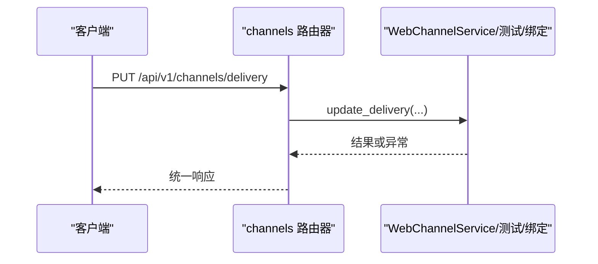

图表来源
- [nanobot/web/routers/channels.py:22-123](file://nanobot/web/routers/channels.py#L22-L123)

章节来源
- [nanobot/web/routers/channels.py:22-123](file://nanobot/web/routers/channels.py#L22-L123)

### 路由器：chat（会话与消息）
- 功能：文件上传、工作区信息、会话列表、创建/重命名/删除会话、消息列表、发送消息（支持流式 SSE）。
- 参数校验：Pydantic 模型校验请求体；Query 参数限制页大小与数量上限。
- 错误处理：会话不存在、内容为空、流式过程异常等均有明确错误码。
- 流式响应：使用 SSE，事件类型包括 start、progress、done、error，前端可逐步渲染。

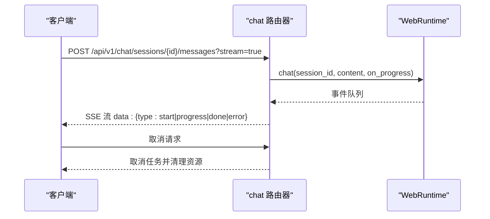

图表来源
- [nanobot/web/routers/chat.py:105-187](file://nanobot/web/routers/chat.py#L105-L187)

章节来源
- [nanobot/web/routers/chat.py:105-187](file://nanobot/web/routers/chat.py#L105-L187)

### 路由器：memory（团队记忆）
- 功能：获取/更新团队记忆、列举候选记忆、搜索记忆、获取记忆源、应用/拒绝候选。
- 参数校验：Pydantic 模型校验查询与请求体。
- 错误处理：候选无效、未找到等映射为结构化错误。

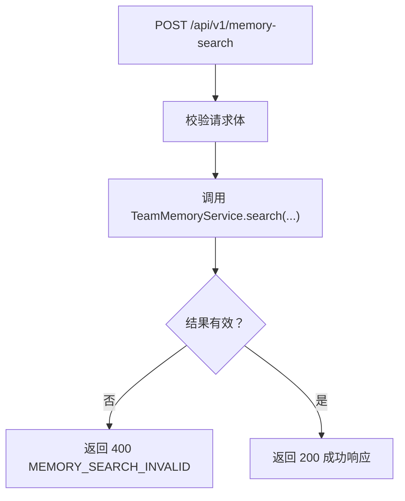

图表来源
- [nanobot/web/routers/memory.py:74-125](file://nanobot/web/routers/memory.py#L74-L125)

章节来源
- [nanobot/web/routers/memory.py:32-125](file://nanobot/web/routers/memory.py#L32-L125)

### 路由器：teams（团队定义）
- 功能：团队 CRUD、启用/禁用、复制、线程摘要/消息、测试运行与重试。
- 参数校验：Pydantic 模型与 Query 限制。
- 错误处理：团队未找到、冲突、校验错误等。

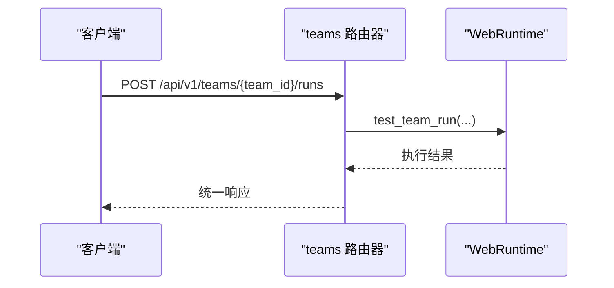

图表来源
- [nanobot/web/routers/teams.py:152-185](file://nanobot/web/routers/teams.py#L152-L185)

章节来源
- [nanobot/web/routers/teams.py:30-185](file://nanobot/web/routers/teams.py#L30-L185)

### 路由器：knowledge（知识库）
- 功能：知识库 CRUD、文档/源管理、批量删除、异步入知识库（文件/URL/FAQ 表）、检索测试、重建索引、同步源。
- 参数校验：multipart/form-data 与 JSON payload 分支校验；JSON 解析异常处理。
- 错误处理：知识库/源未找到、校验错误、JSON 解析错误等。

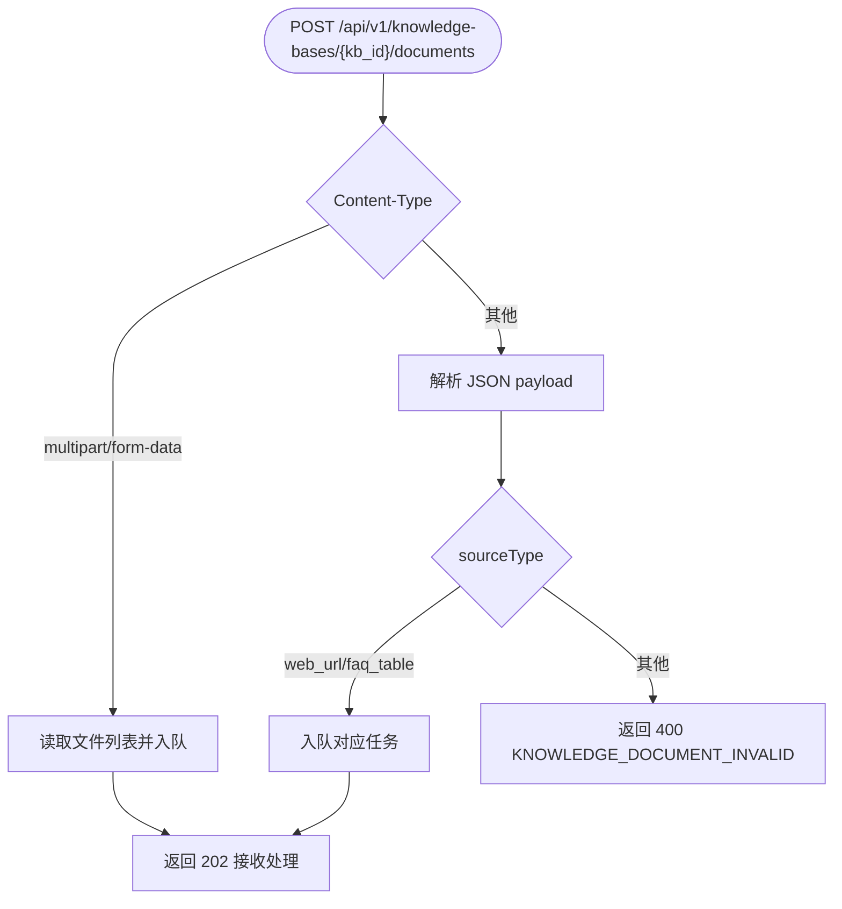

图表来源
- [nanobot/web/routers/knowledge.py:150-187](file://nanobot/web/routers/knowledge.py#L150-L187)

章节来源
- [nanobot/web/routers/knowledge.py:22-240](file://nanobot/web/routers/knowledge.py#L22-L240)

### 路由器：runs（运行记录）
- 功能：运行记录列表、详情、子运行、树形结构、产物获取、取消运行（含子代理/团队根运行联动取消）。
- 错误处理：运行未找到、产物未找到、状态非法等。

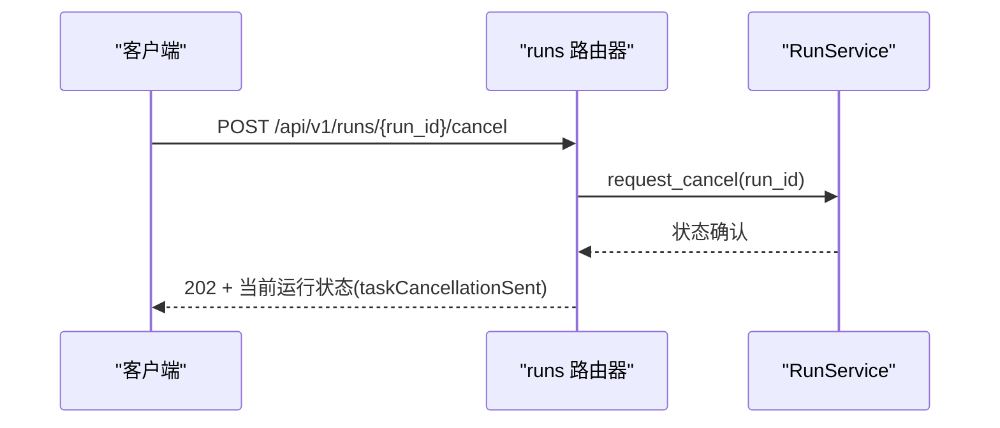

图表来源
- [nanobot/web/routers/runs.py:81-120](file://nanobot/web/routers/runs.py#L81-L120)

章节来源
- [nanobot/web/routers/runs.py:14-120](file://nanobot/web/routers/runs.py#L14-L120)

### 路由器：tenants（多租户）
- 功能：租户 CRUD、API Key 管理（列表、创建、吊销）。
- 错误处理：租户/密钥未找到、冲突、校验错误等。

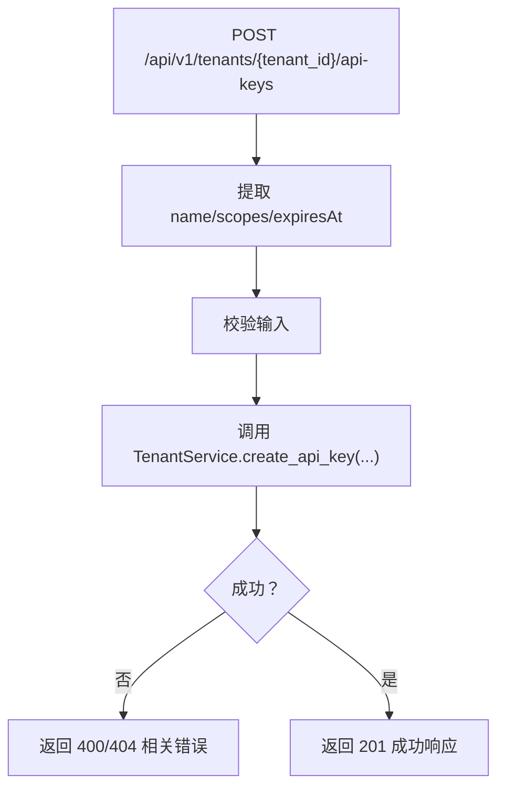

图表来源
- [nanobot/web/routers/tenants.py:89-119](file://nanobot/web/routers/tenants.py#L89-L119)

章节来源
- [nanobot/web/routers/tenants.py:24-119](file://nanobot/web/routers/tenants.py#L24-L119)

### 路由器：channel_bindings（通道绑定）
- 功能：通道绑定 CRUD、按通道名与聊天 ID 解析绑定。
- 错误处理：绑定未找到、冲突、校验错误等。

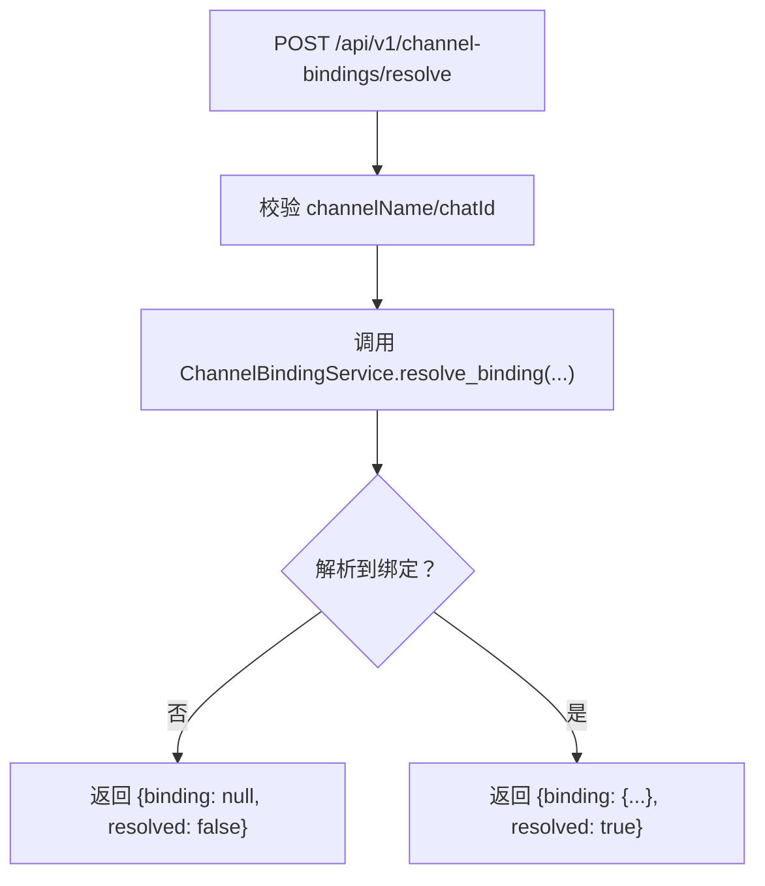

图表来源
- [nanobot/web/routers/channel_bindings.py:83-102](file://nanobot/web/routers/channel_bindings.py#L83-L102)

章节来源
- [nanobot/web/routers/channel_bindings.py:21-102](file://nanobot/web/routers/channel_bindings.py#L21-L102)

### 路由器：schedule（日程与定时）
- 功能：定时任务 CRUD、立即运行、状态查询；日历事件 CRUD、设置管理、日历关联任务。
- 参数校验：Pydantic 模型严格约束触发器与设置字段。

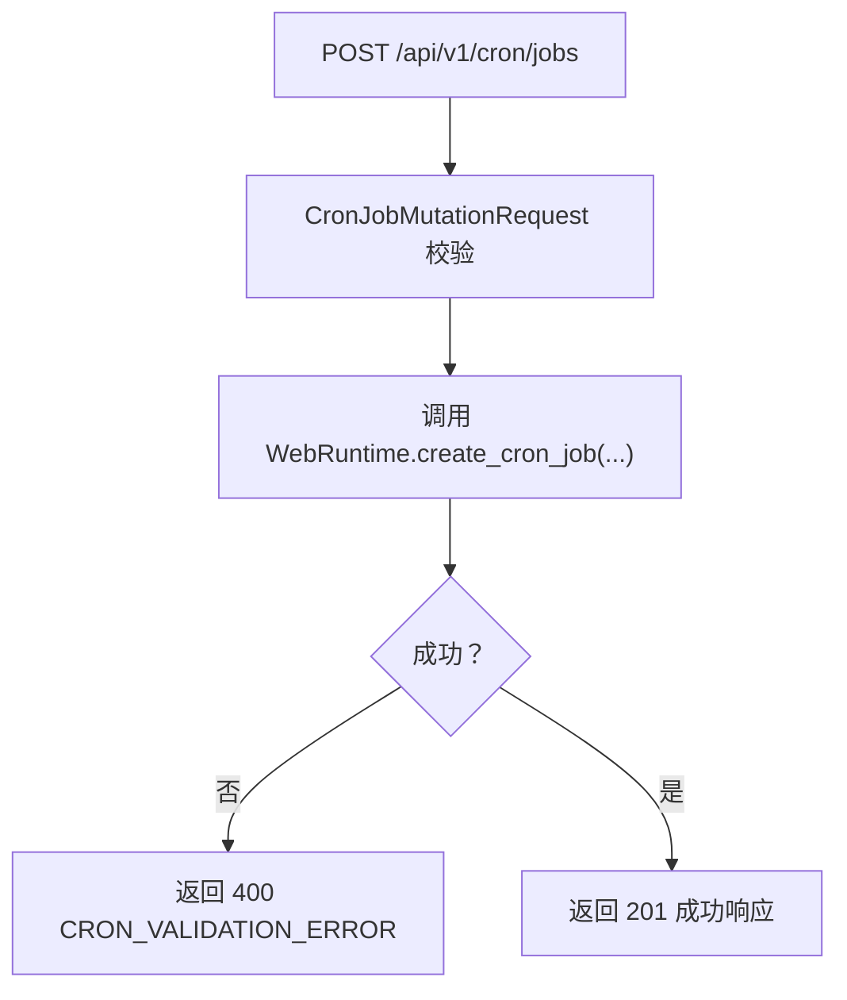

图表来源
- [nanobot/web/routers/schedule.py:53-95](file://nanobot/web/routers/schedule.py#L53-L95)

章节来源
- [nanobot/web/routers/schedule.py:40-161](file://nanobot/web/routers/schedule.py#L40-L161)

### 路由器：workspace（工作区）
- 功能：智能体模板 CRUD、导入/导出、重载；已安装/市场技能管理；技能上传（单文件/ZIP）；文档 CRUD。
- 错误处理：模板/技能/文档未找到、校验错误、上传不匹配等。

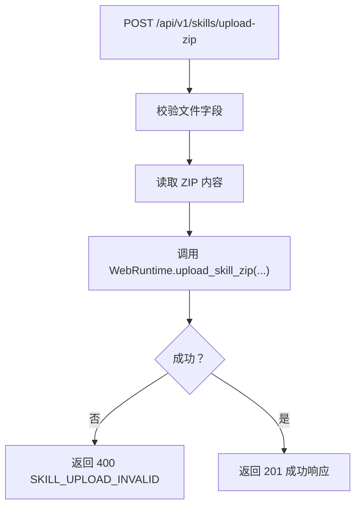

图表来源
- [nanobot/web/routers/workspace.py:187-202](file://nanobot/web/routers/workspace.py#L187-L202)

章节来源
- [nanobot/web/routers/workspace.py:47-245](file://nanobot/web/routers/workspace.py#L47-L245)

### 路由器：operations（运维与配置）
- 功能：获取配置与元数据、更新配置、系统状态、运行校验、查看日志、触发运维动作。
- 错误处理：配置更新失败、动作执行中/无效等。

图表来源
- [nanobot/web/routers/operations.py:62-72](file://nanobot/web/routers/operations.py#L62-L72)

章节来源
- [nanobot/web/routers/operations.py:16-72](file://nanobot/web/routers/operations.py#L16-L72)

### 路由器：auth（认证）
- 功能：引导初始化、登录、登出、个人资料、密码轮换、头像上传/清理。
- 安全要点：PBKDF2 密码哈希、会话令牌、过期时间、头像尺寸与类型校验。

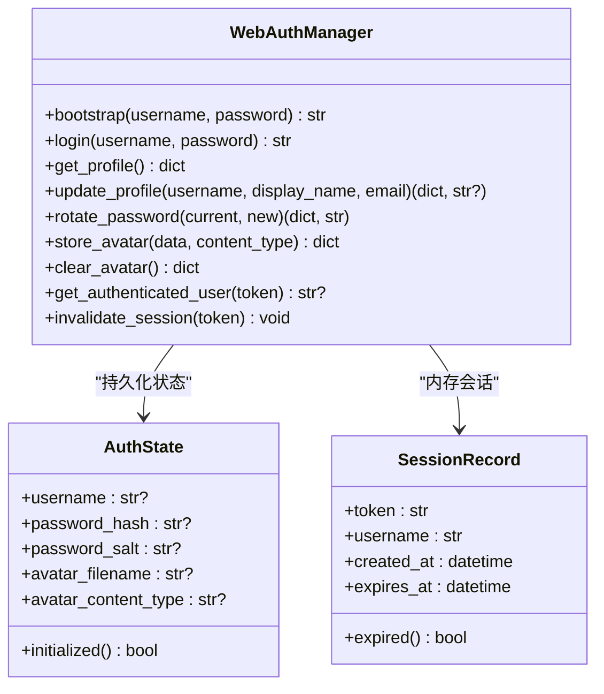

图表来源
- [nanobot/web/auth.py:129-414](file://nanobot/web/auth.py#L129-L414)

章节来源
- [nanobot/web/auth.py:129-414](file://nanobot/web/auth.py#L129-L414)

### 路由器：mcp（MCP 服务）
- 功能：MCP 注册中心、仓库、服务器管理（由应用入口统一注册）。
- 说明：该模块通过应用工厂集中挂载，具体端点由对应服务实现。

章节来源
- [nanobot/web/app.py:47-63](file://nanobot/web/app.py#L47-L63)

## 依赖分析
- 路由器到服务层：每个路由器仅依赖 app.state 中注入的服务对象，耦合度低、内聚性强。
- 中间件依赖：租户上下文中间件依赖租户服务进行 API Key 校验；认证中间件依赖 WebAuthManager。
- 统一响应与错误：所有路由器通过 http.py 提供的 _ok/_err/_json_response 输出一致格式，异常通过全局异常处理器转换。

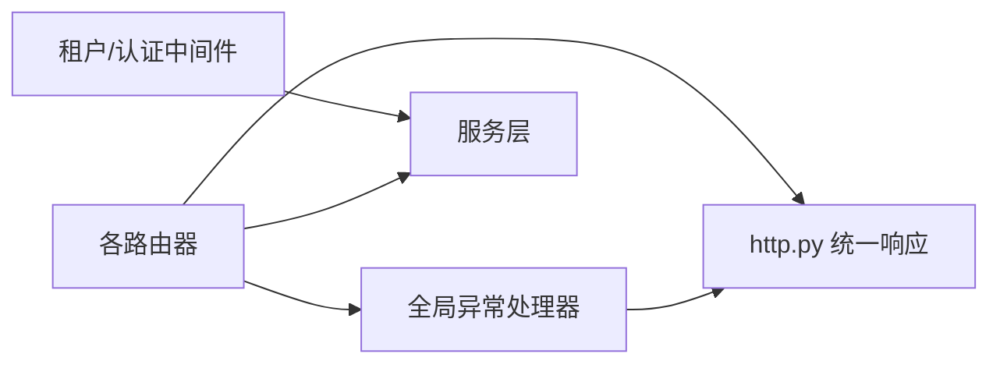

图表来源
- [nanobot/web/app.py:205-246](file://nanobot/web/app.py#L205-L246)
- [nanobot/web/http.py:23-40](file://nanobot/web/http.py#L23-L40)

章节来源
- [nanobot/web/app.py:205-246](file://nanobot/web/app.py#L205-L246)
- [nanobot/web/http.py:23-40](file://nanobot/web/http.py#L23-L40)

## 性能考虑
- 流式响应：chat 路由器使用 SSE，前端可渐进渲染，降低首屏等待；注意取消任务时及时释放资源。
- 查询参数限制：多处 Query 参数设置最小/最大值，避免高负载查询。
- 任务取消：runs 路由器支持跨子代理/团队根运行的取消，减少无效计算。
- 前端静态资源：应用工厂内置静态资源与开发热更新模式，减少不必要的后端压力。

## 故障排查指南
- 401 未授权：检查 Cookie 是否有效或 API Key 是否正确；确认中间件是否正确注入 TenantContext。
- 403 禁止访问：API Key 所属租户与请求头 x-tenant-id 不一致。
- 404 资源不存在：确认 ID 是否正确、是否存在；部分端点对模板/文档/技能等资源未找到有专门错误码。
- 422 参数校验失败：检查请求体结构与字段类型；Pydantic 模型会返回详细错误位置。
- 400 业务校验失败：常见于知识库/通道/定时任务等场景，查看错误详情定位问题。
- 500 服务器错误：查看日志，关注 chat 流式过程异常与知识库异步任务异常。

章节来源
- [nanobot/web/app.py:205-246](file://nanobot/web/app.py#L205-L246)
- [nanobot/web/http.py:31-40](file://nanobot/web/http.py#L31-L40)

## 结论
本项目以 FastAPI 为核心，采用“应用工厂 + 中间件链 + 统一响应 + 结构化错误”的设计，实现了清晰的领域路由分层与强一致的响应契约。通过多租户上下文与认证中间件，兼顾了 Web 交互与 API Key 场景；通过 SSE、任务取消与查询参数限制，提升了用户体验与系统稳定性。建议后续持续完善 OpenAPI 文档与自动化测试，进一步强化可观测性与回归保障。

## 附录

### API 版本控制策略
- 所有端点统一前缀 /api/v1，便于未来引入 v2 保持向后兼容。
- 建议新增端点先在 v1 下线实验，再迁移至稳定版本。

章节来源
- [nanobot/web/app.py:248-262](file://nanobot/web/app.py#L248-L262)

### 文档生成与测试方法
- 文档生成：使用 FastAPI 内置的 OpenAPI/Swagger，默认启用，无需额外配置。
- 测试方法：建议结合单元测试与端到端测试，覆盖关键路由器与服务层逻辑；对流式响应与异步任务编写集成测试。

章节来源
- [nanobot/web/app.py:186-204](file://nanobot/web/app.py#L186-L204)

### API 设计规范与最佳实践
- 响应格式：始终使用统一成功/错误包装，错误包含 code/message/details。
- 错误码：遵循“领域_动作_原因”命名风格，便于前端与日志检索。
- 参数校验：优先使用 Pydantic 模型，Query 参数设置合理边界。
- 路由组织：按领域拆分路由器，避免单文件过大；公共逻辑下沉至服务层。
- 安全：API Key 与 Cookie 双重鉴权，严格校验头像与上传文件；密码存储使用 PBKDF2。
- 可观测性：异常统一处理并记录日志；对耗时操作提供进度事件（如 SSE）。

章节来源
- [nanobot/web/http.py:11-40](file://nanobot/web/http.py#L11-L40)
- [nanobot/web/auth.py:18-27](file://nanobot/web/auth.py#L18-L27)
- [nanobot/web/tenant_context.py:95-107](file://nanobot/web/tenant_context.py#L95-L107)