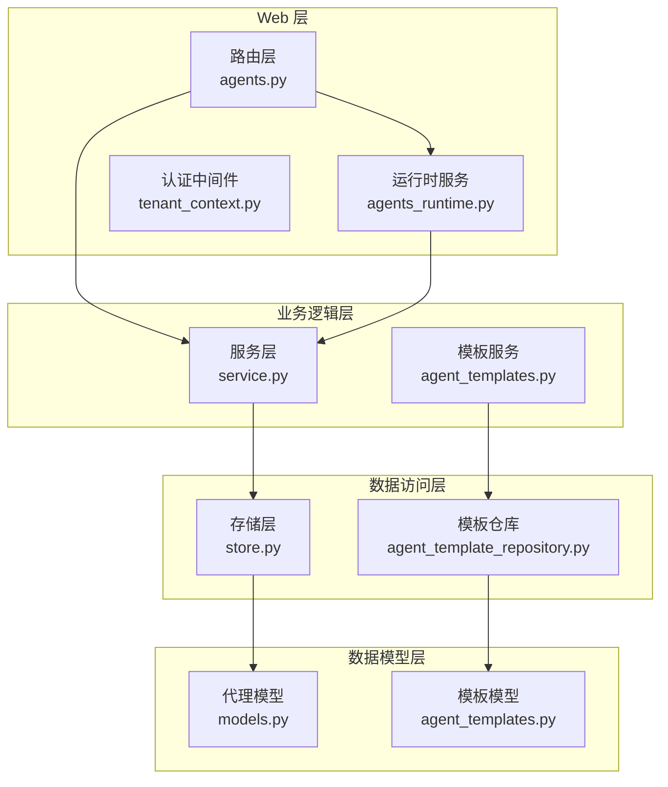
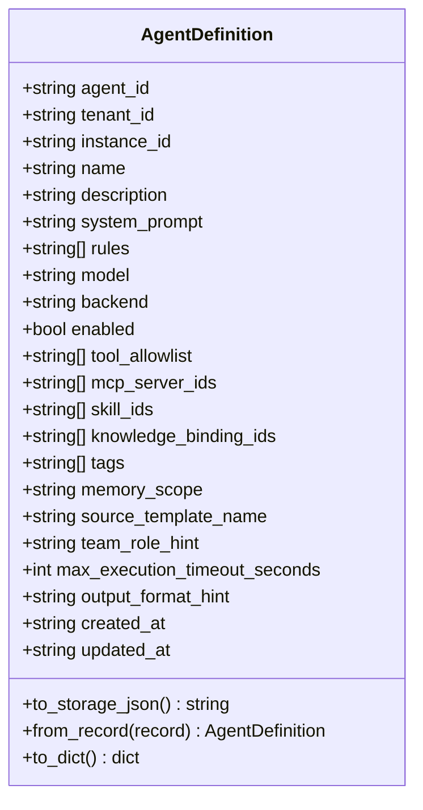
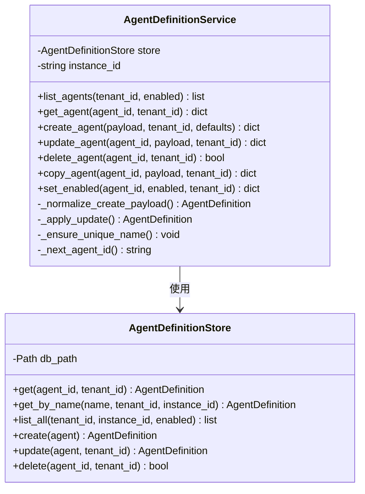
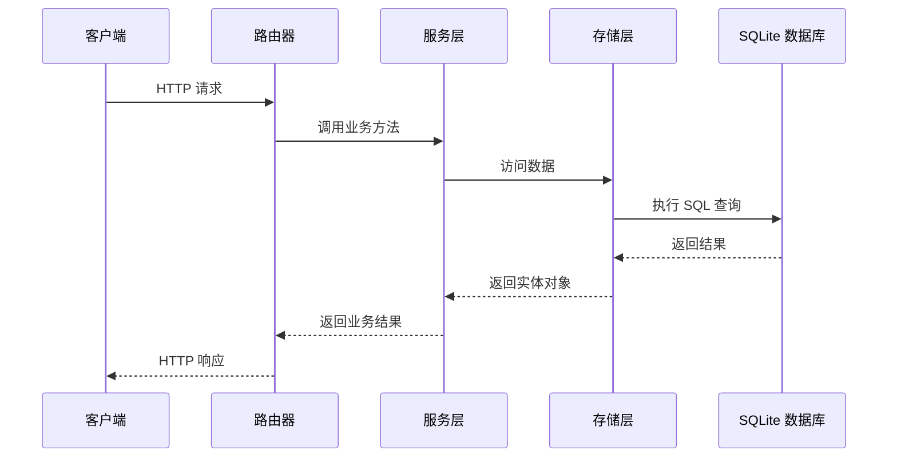
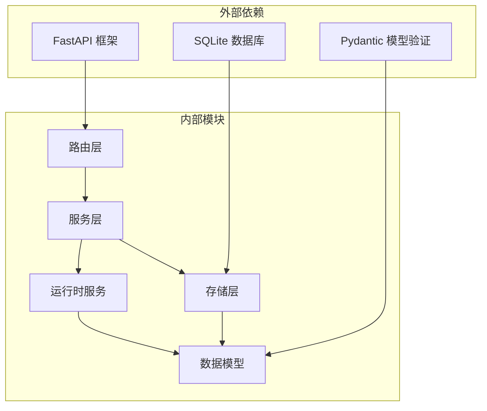

# 代理管理 API

<cite>
**本文档引用的文件**
- [agents.py](file://nanobot/web/routers/agents.py)
- [models.py](file://nanobot/platform/agents/models.py)
- [service.py](file://nanobot/platform/agents/service.py)
- [store.py](file://nanobot/platform/agents/store.py)
- [agent_templates.py](file://nanobot/services/agent_templates.py)
- [agent_template_repository.py](file://nanobot/storage/agent_template_repository.py)
- [agents_runtime.py](file://nanobot/web/runtime_services/agents.py)
- [app.py](file://nanobot/web/app.py)
- [tenant_context.py](file://nanobot/web/tenant_context.py)
- [auth.py](file://nanobot/web/auth.py)
- [service.py](file://nanobot/heartbeat/service.py)
- [models.py](file://nanobot/platform/runs/models.py)
</cite>

## 目录
1. [简介](#简介)
2. [项目结构](#项目结构)
3. [核心组件](#核心组件)
4. [架构概览](#架构概览)
5. [详细组件分析](#详细组件分析)
6. [依赖分析](#依赖分析)
7. [性能考虑](#性能考虑)
8. [故障排除指南](#故障排除指南)
9. [结论](#结论)

## 简介

代理管理 API 是 nanobot 平台的核心功能模块，负责管理智能体（Agent）的全生命周期。该系统提供了完整的 CRUD 操作、代理模板管理、配置更新、状态管理和运行监控等功能。通过 RESTful API 接口，用户可以创建、查询、更新和删除代理定义，同时支持代理模板的创建、编辑和导入导出操作。

## 项目结构

代理管理 API 的架构采用分层设计模式，主要分为以下几个层次：

**图表来源**
- [agents.py:1-162](file://nanobot/web/routers/agents.py#L1-L162)
- [service.py:30-404](file://nanobot/platform/agents/service.py#L30-L404)
- [store.py:12-206](file://nanobot/platform/agents/store.py#L12-L206)

**章节来源**
- [agents.py:1-162](file://nanobot/web/routers/agents.py#L1-L162)
- [app.py:70-200](file://nanobot/web/app.py#L70-L200)

## 核心组件

### 代理定义模型

代理定义使用数据类实现，包含以下核心字段：

**图表来源**
- [models.py:15-109](file://nanobot/platform/agents/models.py#L15-L109)

### 代理服务层

服务层提供完整的 CRUD 操作和业务逻辑验证：

**图表来源**
- [service.py:30-404](file://nanobot/platform/agents/service.py#L30-L404)
- [store.py:12-206](file://nanobot/platform/agents/store.py#L12-L206)

**章节来源**
- [models.py:15-109](file://nanobot/platform/agents/models.py#L15-L109)
- [service.py:30-404](file://nanobot/platform/agents/service.py#L30-L404)
- [store.py:12-206](file://nanobot/platform/agents/store.py#L12-L206)

## 架构概览

代理管理 API 采用多层架构设计，确保了清晰的关注点分离和可维护性：

**图表来源**
- [agents.py:43-162](file://nanobot/web/routers/agents.py#L43-L162)
- [service.py:345-404](file://nanobot/platform/agents/service.py#L345-L404)
- [store.py:58-206](file://nanobot/platform/agents/store.py#L58-L206)

## 详细组件分析

### 代理 CRUD 操作

#### 列表代理
- **端点**: `GET /api/v1/agents`
- **查询参数**: `enabled` (可选布尔值)
- **功能**: 支持按启用状态过滤代理列表
- **响应**: 代理定义数组

#### 创建代理
- **端点**: `POST /api/v1/agents`
- **请求体**: 代理配置 JSON 对象
- **功能**: 
  - 支持从模板快照创建代理
  - 自动分配唯一代理 ID
  - 验证必填字段和约束条件
- **响应**: 创建的代理定义

#### 获取代理
- **端点**: `GET /api/v1/agents/{agent_id}`
- **路径参数**: `agent_id`
- **功能**: 按 ID 获取单个代理定义

#### 更新代理
- **端点**: `PUT /api/v1/agents/{agent_id}`
- **路径参数**: `agent_id`
- **请求体**: 部分更新的代理配置
- **功能**: 支持增量更新，保持未指定字段不变

#### 删除代理
- **端点**: `DELETE /api/v1/agents/{agent_id}`
- **路径参数**: `agent_id`
- **功能**: 彻底删除代理定义

#### 复制代理
- **端点**: `POST /api/v1/agents/{agent_id}/copy`
- **路径参数**: `agent_id`
- **功能**: 创建现有代理的副本，自动生成新名称

#### 启用/禁用代理
- **端点**: `POST /api/v1/agents/{agent_id}/enable`
- **端点**: `POST /api/v1/agents/{agent_id}/disable`
- **功能**: 切换代理的启用状态

**章节来源**
- [agents.py:43-162](file://nanobot/web/routers/agents.py#L43-L162)

### 代理模板管理

#### 模板 CRUD 操作
- **创建模板**: `POST /api/v1/agent-templates`
- **获取模板**: `GET /api/v1/agent-templates/{template_name}`
- **更新模板**: `PATCH /api/v1/agent-templates/{template_name}`
- **删除模板**: `DELETE /api/v1/agent-templates/{template_name}`

#### 模板导入导出
- **导入**: 支持 YAML 格式批量导入
- **导出**: 支持选择性导出多个模板
- **冲突处理**: 支持跳过、替换、重命名策略

#### 内置模板
系统提供多种预定义模板：
- **minimal**: 轻量级工作器模板
- **coder**: 代码导向模板
- **researcher**: 研究导向模板
- **analyst**: 分析导向模板

**章节来源**
- [agent_templates.py:207-566](file://nanobot/services/agent_templates.py#L207-L566)
- [agent_template_repository.py:13-205](file://nanobot/storage/agent_template_repository.py#L13-L205)

### 代理配置验证规则

服务层实现了严格的验证机制：

#### 字段验证
- **必填字段**: `name`、`systemPrompt`
- **字符串清理**: 自动去除首尾空白字符
- **列表去重**: 工具列表自动去重和清理
- **数值范围**: 执行超时时间限制在 10-3600 秒

#### 唯一性约束
- **代理名称唯一**: 同租户内代理名称必须唯一
- **代理 ID 自动生成**: 基于名称生成唯一 ID

#### 绑定验证
- **工具有效性**: 验证工具名称在可用工具目录中
- **MCP 服务器验证**: 检查 MCP 服务器存在性和启用状态
- **技能验证**: 验证技能名称在工作区中存在

**章节来源**
- [service.py:120-327](file://nanobot/platform/agents/service.py#L120-L327)

### 权限控制和认证

#### 多层认证机制
1. **API 密钥认证**: 支持 Bearer Token 和 X-API-Key
2. **Cookie 认证**: 兼容传统的 Web UI 认证
3. **租户隔离**: 基于租户 ID 的数据隔离

#### 租户上下文
- **默认租户**: 未提供 API 密钥时使用 'default'
- **租户验证**: 可选的 X-Tenant-Id 头部验证
- **作用域控制**: API 密钥的作用域限制

**章节来源**
- [tenant_context.py:26-108](file://nanobot/web/tenant_context.py#L26-L108)
- [auth.py:129-200](file://nanobot/web/auth.py#L129-L200)

### 代理运行监控

#### 运行状态管理
- **运行记录**: 完整的任务执行历史
- **状态跟踪**: 支持 queued、running、succeeded、failed 等状态
- **事件日志**: 详细的执行事件记录

#### 心跳服务
- **周期性检查**: 默认每 30 分钟检查一次
- **任务决策**: 通过 LLM 判断是否有待处理任务
- **自动执行**: 发现任务时自动触发执行

#### 性能指标
- **执行时间**: 记录每次任务的执行耗时
- **资源使用**: 监控内存和 CPU 使用情况
- **成功率统计**: 计算代理的成功率和失败率

**章节来源**
- [service.py:40-174](file://nanobot/heartbeat/service.py#L40-L174)
- [models.py:94-161](file://nanobot/platform/runs/models.py#L94-L161)

### 测试运行功能

#### 代理测试运行
- **端点**: `POST /api/v1/agents/{agent_id}/test-run`
- **功能**: 在隔离环境中测试代理配置
- **输出**: 返回完整的运行报告和消息历史

#### 运行环境隔离
- **独立会话**: 为测试运行创建专用会话
- **绑定验证**: 检查所有绑定的有效性
- **知识检索**: 支持知识库绑定的测试

**章节来源**
- [agents_runtime.py:18-401](file://nanobot/web/runtime_services/agents.py#L18-L401)

## 依赖分析

代理管理 API 的依赖关系清晰且模块化：

**图表来源**
- [app.py:70-200](file://nanobot/web/app.py#L70-L200)
- [service.py:30-404](file://nanobot/platform/agents/service.py#L30-L404)

**章节来源**
- [app.py:70-200](file://nanobot/web/app.py#L70-L200)
- [store.py:12-206](file://nanobot/platform/agents/store.py#L12-L206)

## 性能考虑

### 数据库优化
- **索引策略**: 为常用查询字段建立索引
- **连接池**: 使用连接池减少数据库连接开销
- **批量操作**: 支持批量查询和更新操作

### 缓存机制
- **模板缓存**: 代理模板在内存中缓存
- **租户上下文**: 租户信息缓存避免重复计算
- **工具目录**: 工具目录在运行时缓存

### 异步处理
- **测试运行**: 异步执行代理测试
- **心跳服务**: 非阻塞的心跳检查
- **并发控制**: 限制同时运行的代理数量

## 故障排除指南

### 常见错误类型

#### 代理定义错误
- **代理不存在**: `AGENT_NOT_FOUND` - 代理 ID 无效
- **代理冲突**: `AGENT_CONFLICT` - 名称或 ID 冲突
- **验证错误**: `AGENT_VALIDATION_ERROR` - 字段验证失败

#### 模板错误
- **模板不存在**: `AGENT_TEMPLATE_NOT_FOUND` - 模板名称无效
- **模板验证错误**: `AGENT_TEMPLATE_VALIDATION_ERROR` - 模板配置错误

#### 认证错误
- **API 密钥无效**: `401 Unauthorized` - 无效或过期的 API 密钥
- **租户不匹配**: `403 Forbidden` - API 密钥不属于指定租户

### 调试建议

1. **检查请求格式**: 确保 JSON 格式正确且字段完整
2. **验证权限**: 确认 API 密钥具有足够的权限
3. **查看日志**: 检查服务器日志获取详细错误信息
4. **测试连接**: 验证数据库连接和网络连通性

**章节来源**
- [agents.py:66-161](file://nanobot/web/routers/agents.py#L66-L161)
- [tenant_context.py:64-88](file://nanobot/web/tenant_context.py#L64-L88)

## 结论

代理管理 API 提供了一个完整、健壮且易于使用的智能体管理解决方案。其设计特点包括：

- **模块化架构**: 清晰的分层设计便于维护和扩展
- **严格验证**: 完善的数据验证确保系统稳定性
- **灵活配置**: 支持丰富的代理配置选项
- **安全可靠**: 多层认证和授权机制保障安全性
- **可观测性**: 完整的运行监控和日志记录

该 API 适合构建企业级的智能体管理系统，支持从简单的个人助手到复杂的团队协作场景的各种应用需求。