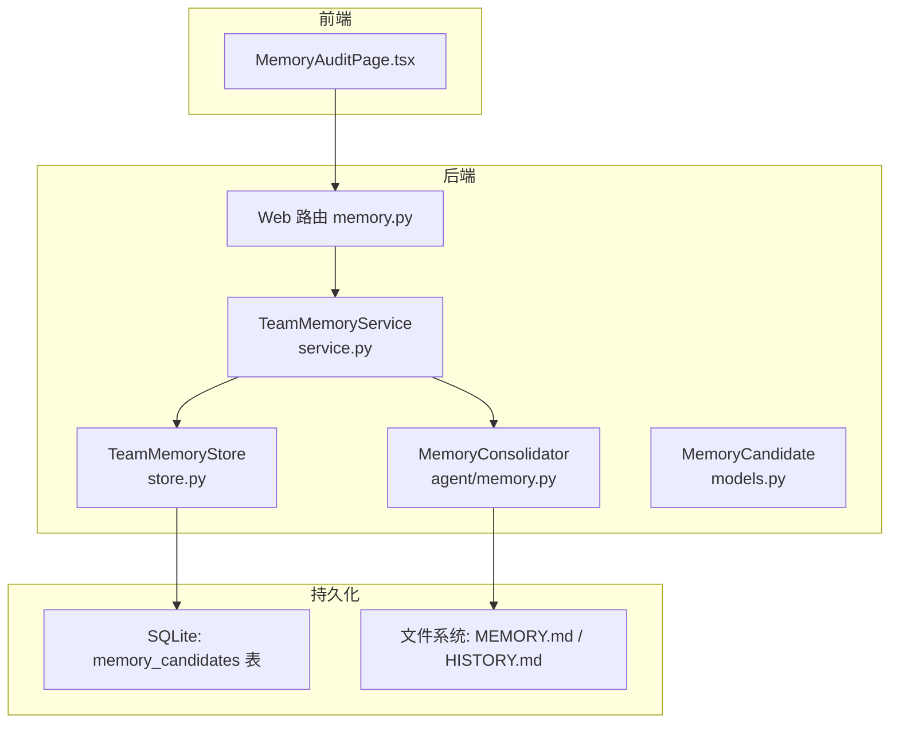
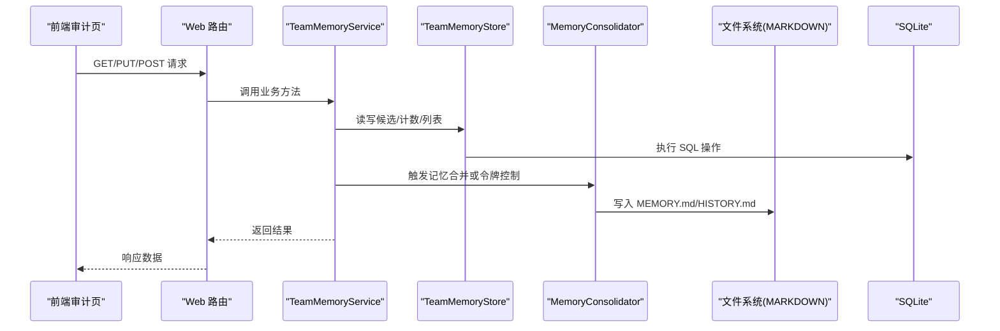
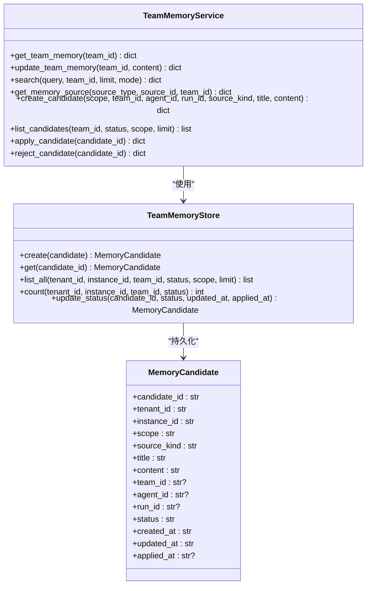
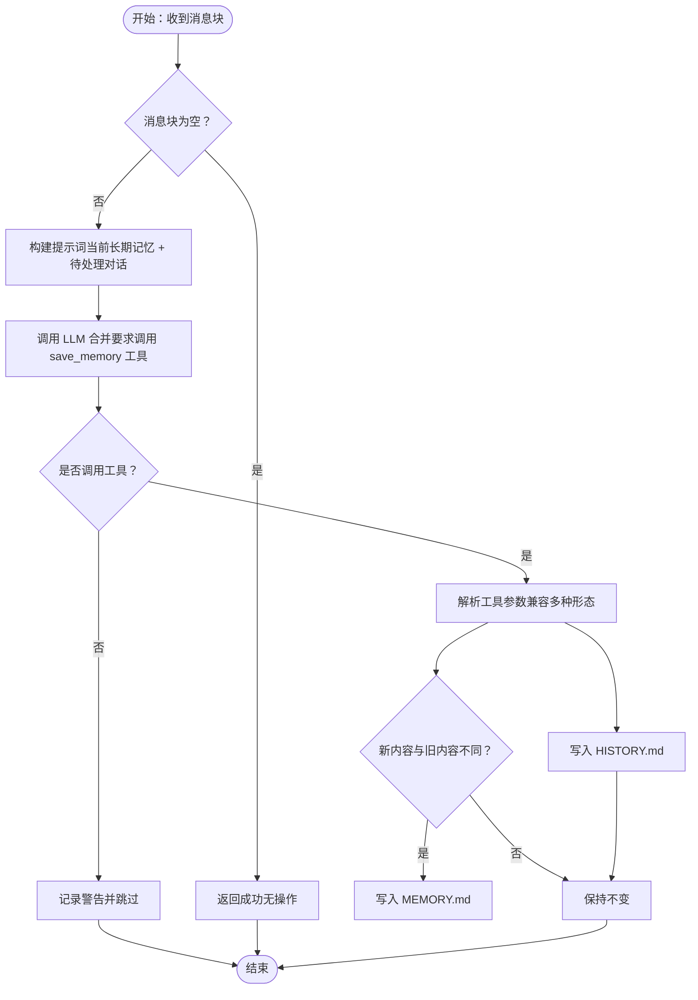
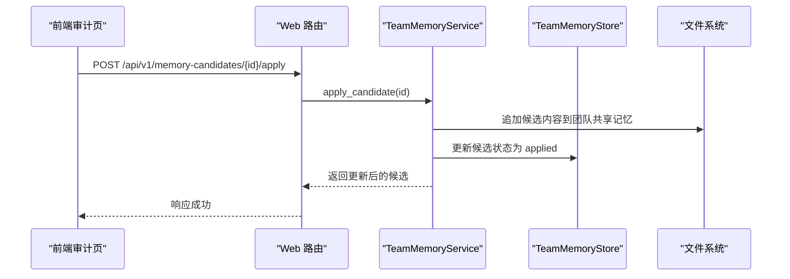
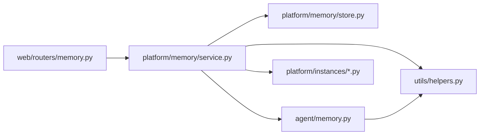

# 内存管理 API

<cite>
**本文引用的文件**
- [nanobot/agent/memory.py](file://nanobot/agent/memory.py)
- [nanobot/platform/memory/models.py](file://nanobot/platform/memory/models.py)
- [nanobot/platform/memory/service.py](file://nanobot/platform/memory/service.py)
- [nanobot/platform/memory/store.py](file://nanobot/platform/memory/store.py)
- [nanobot/web/routers/memory.py](file://nanobot/web/routers/memory.py)
- [nanobot/templates/memory/MEMORY.md](file://nanobot/templates/memory/MEMORY.md)
- [memory/MEMORY.md](file://memory/MEMORY.md)
- [web-ui/src/pages/MemoryAuditPage.tsx](file://web-ui/src/pages/MemoryAuditPage.tsx)
- [tests/test_memory_service.py](file://tests/test_memory_service.py)
- [tests/test_memory_consolidation_types.py](file://tests/test_memory_consolidation_types.py)
- [tests/test_loop_consolidation_tokens.py](file://tests/test_loop_consolidation_tokens.py)
- [nanobot/config/schema.py](file://nanobot/config/schema.py)
</cite>

## 目录
1. [简介](#简介)
2. [项目结构](#项目结构)
3. [核心组件](#核心组件)
4. [架构总览](#架构总览)
5. [详细组件分析](#详细组件分析)
6. [依赖关系分析](#依赖关系分析)
7. [性能考虑](#性能考虑)
8. [故障排除指南](#故障排除指南)
9. [结论](#结论)
10. [附录](#附录)

## 简介
本文件为内存管理 API 的全面技术文档，覆盖用户记忆、上下文记忆与长期记忆的存储、检索与管理接口。重点包括：
- 记忆片段的创建、更新、删除与查询
- 记忆合并策略、令牌管理与上下文窗口优化
- 记忆审计、清理策略与性能监控实践

系统采用分层设计：前端通过 Web 路由调用后端服务；后端服务协调平台共享记忆与候选更新；底层持久化使用 SQLite 存储候选，Markdown 文件存储长期记忆；同时提供基于 LLM 的自动记忆合并能力。

## 项目结构
围绕内存管理的关键模块与文件如下：
- 后端服务层：平台共享记忆与候选更新服务
- 数据模型：候选记忆的数据结构定义
- 存储层：SQLite 持久化与索引
- 代理层：本地长期记忆与历史日志的合并与归档
- Web 路由：REST API 定义
- 前端审计页：记忆检索、候选审核与证据链核验
- 测试：服务行为、合并策略与令牌控制的验证

图表来源
- [nanobot/web/routers/memory.py:1-125](file://nanobot/web/routers/memory.py#L1-L125)
- [nanobot/platform/memory/service.py:31-447](file://nanobot/platform/memory/service.py#L31-L447)
- [nanobot/platform/memory/store.py:12-202](file://nanobot/platform/memory/store.py#L12-L202)
- [nanobot/platform/memory/models.py:14-65](file://nanobot/platform/memory/models.py#L14-L65)
- [nanobot/agent/memory.py:60-285](file://nanobot/agent/memory.py#L60-L285)

章节来源
- [nanobot/web/routers/memory.py:1-125](file://nanobot/web/routers/memory.py#L1-L125)
- [nanobot/platform/memory/service.py:31-447](file://nanobot/platform/memory/service.py#L31-L447)
- [nanobot/platform/memory/store.py:12-202](file://nanobot/platform/memory/store.py#L12-L202)
- [nanobot/platform/memory/models.py:14-65](file://nanobot/platform/memory/models.py#L14-L65)
- [nanobot/agent/memory.py:60-285](file://nanobot/agent/memory.py#L60-L285)

## 核心组件
- 记忆候选数据模型：用于描述候选记忆的元数据与状态
- 平台共享记忆服务：提供团队共享记忆的读取、更新、搜索与候选管理
- 团队记忆存储：SQLite 持久化候选，支持计数、列表与状态更新
- 本地记忆合并器：负责将历史消息合并到长期记忆并维护历史日志
- Web 路由：暴露 REST API，供前端与外部系统调用
- 前端审计页：提供记忆检索、候选审核与证据链核验界面

章节来源
- [nanobot/platform/memory/models.py:14-65](file://nanobot/platform/memory/models.py#L14-L65)
- [nanobot/platform/memory/service.py:31-447](file://nanobot/platform/memory/service.py#L31-L447)
- [nanobot/platform/memory/store.py:12-202](file://nanobot/platform/memory/store.py#L12-L202)
- [nanobot/agent/memory.py:60-285](file://nanobot/agent/memory.py#L60-L285)
- [nanobot/web/routers/memory.py:1-125](file://nanobot/web/routers/memory.py#L1-L125)
- [web-ui/src/pages/MemoryAuditPage.tsx:1-694](file://web-ui/src/pages/MemoryAuditPage.tsx#L1-L694)

## 架构总览
下图展示了从前端到后端、再到持久化的整体流程，以及记忆合并与令牌控制的关键路径。

图表来源
- [nanobot/web/routers/memory.py:32-124](file://nanobot/web/routers/memory.py#L32-L124)
- [nanobot/platform/memory/service.py:107-447](file://nanobot/platform/memory/service.py#L107-L447)
- [nanobot/platform/memory/store.py:63-202](file://nanobot/platform/memory/store.py#L63-L202)
- [nanobot/agent/memory.py:96-285](file://nanobot/agent/memory.py#L96-L285)

## 详细组件分析

### 组件一：平台共享记忆服务（TeamMemoryService）
职责与能力：
- 获取与更新团队共享记忆（Markdown 文件）
- 搜索：支持工作区共享记忆、团队共享记忆、团队线程、运行产物等多源聚合检索
- 候选管理：创建候选、列出候选、应用候选（写入团队共享记忆）、拒绝候选
- 记忆源获取：按 sourceType/sourceId/teamId 获取不同来源的记忆内容
- 参数校验与错误处理：对必填字段进行标准化与异常抛出

关键接口（按路由映射）：
- GET /api/v1/teams/{team_id}/memory：获取团队共享记忆
- PUT /api/v1/teams/{team_id}/memory：更新团队共享记忆
- GET /api/v1/memory-candidates：列出候选（支持过滤）
- POST /api/v1/memory-search：检索（支持 keyword/hybrid/semantic 模式）
- POST /api/v1/memory-get：获取指定记忆源
- POST /api/v1/memory-candidates/{candidate_id}/apply：应用候选
- POST /api/v1/memory-candidates/{candidate_id}/reject：拒绝候选

图表来源
- [nanobot/platform/memory/service.py:31-447](file://nanobot/platform/memory/service.py#L31-L447)
- [nanobot/platform/memory/store.py:12-202](file://nanobot/platform/memory/store.py#L12-L202)
- [nanobot/platform/memory/models.py:14-65](file://nanobot/platform/memory/models.py#L14-L65)

章节来源
- [nanobot/platform/memory/service.py:107-447](file://nanobot/platform/memory/service.py#L107-L447)
- [nanobot/platform/memory/store.py:63-202](file://nanobot/platform/memory/store.py#L63-L202)
- [nanobot/platform/memory/models.py:14-65](file://nanobot/platform/memory/models.py#L14-L65)
- [nanobot/web/routers/memory.py:32-124](file://nanobot/web/routers/memory.py#L32-L124)

### 组件二：本地记忆合并器（MemoryConsolidator 与 MemoryStore）
职责与能力：
- 将历史消息块合并到长期记忆（MEMORY.md）并追加历史日志（HISTORY.md）
- 基于令牌估算与上下文窗口阈值，自动选择安全边界进行归档
- 提供并发锁，避免同一会话的重复合并
- 支持多种工具调用参数形态（字符串、字典、JSON 字符串、列表）

图表来源
- [nanobot/agent/memory.py:96-146](file://nanobot/agent/memory.py#L96-L146)

章节来源
- [nanobot/agent/memory.py:96-285](file://nanobot/agent/memory.py#L96-L285)
- [tests/test_memory_consolidation_types.py:62-291](file://tests/test_memory_consolidation_types.py#L62-L291)

### 组件三：Web 路由与前端集成
- Web 路由定义了完整的 REST API，涵盖团队共享记忆读写、候选列表、检索、源获取与候选应用/拒绝
- 前端审计页提供团队选择、共享记忆概览、最近执行与对话、候选审核与检索取证工作台
- 前端通过 API 调用实现“候选应用即写入团队共享记忆”的闭环

图表来源
- [nanobot/web/routers/memory.py:109-124](file://nanobot/web/routers/memory.py#L109-L124)
- [nanobot/platform/memory/service.py:417-434](file://nanobot/platform/memory/service.py#L417-L434)

章节来源
- [nanobot/web/routers/memory.py:32-124](file://nanobot/web/routers/memory.py#L32-L124)
- [web-ui/src/pages/MemoryAuditPage.tsx:179-203](file://web-ui/src/pages/MemoryAuditPage.tsx#L179-L203)
- [nanobot/platform/memory/service.py:417-434](file://nanobot/platform/memory/service.py#L417-L434)

## 依赖关系分析
- 服务层依赖存储层（SQLite）与实例路径（工作区/团队目录），并通过注入的运行时加载器访问团队线程与运行产物
- 代理层依赖 LLM 提供者与令牌估算工具，实现自动合并与上下文窗口优化
- Web 路由依赖服务层，提供统一的 REST 接口
- 前端依赖 Web 路由，实现记忆审计与检索

图表来源
- [nanobot/web/routers/memory.py:1-125](file://nanobot/web/routers/memory.py#L1-L125)
- [nanobot/platform/memory/service.py:1-52](file://nanobot/platform/memory/service.py#L1-L52)
- [nanobot/platform/memory/store.py:1-11](file://nanobot/platform/memory/store.py#L1-L11)
- [nanobot/agent/memory.py:1-18](file://nanobot/agent/memory.py#L1-L18)

章节来源
- [nanobot/web/routers/memory.py:1-125](file://nanobot/web/routers/memory.py#L1-L125)
- [nanobot/platform/memory/service.py:1-52](file://nanobot/platform/memory/service.py#L1-L52)
- [nanobot/platform/memory/store.py:1-11](file://nanobot/platform/memory/store.py#L1-L11)
- [nanobot/agent/memory.py:1-18](file://nanobot/agent/memory.py#L1-L18)

## 性能考虑
- 令牌控制与上下文窗口优化
  - 通过估计当前会话提示词大小，动态计算目标阈值（通常为上下文窗口的一半），循环归档旧消息直到满足阈值
  - 使用并发锁避免重复合并，减少资源竞争
- 检索性能
  - 多源检索时，优先从工作区共享记忆与团队共享记忆开始，再扩展到团队线程与运行产物
  - 支持三种检索模式：关键词、混合、语义，按需选择以平衡速度与召回
- 存储与索引
  - SQLite 对候选表建立复合索引，支持按团队、状态、更新时间排序与限制数量
- 合并健壮性
  - 兼容多种工具调用参数形态，避免因 LLM 输出格式差异导致失败

章节来源
- [nanobot/agent/memory.py:229-285](file://nanobot/agent/memory.py#L229-L285)
- [nanobot/platform/memory/service.py:249-346](file://nanobot/platform/memory/service.py#L249-L346)
- [nanobot/platform/memory/store.py:15-39](file://nanobot/platform/memory/store.py#L15-L39)

## 故障排除指南
常见问题与定位建议：
- 合并失败或未触发
  - 检查 LLM 是否调用了保存工具；若未调用，系统会跳过合并
  - 检查工具参数形态是否为字符串/字典/JSON 字符串/列表，确保被正确解析
  - 参考测试用例验证不同参数形态的兼容性
- 候选应用后未写入团队共享记忆
  - 确认候选作用域为团队共享且存在 team_id
  - 检查文件写入权限与路径
- 检索无结果或命中不准确
  - 调整检索模式（keyword/hybrid/semantic）
  - 确认目标团队存在且有相关源（线程/产物）
- 令牌控制无效
  - 确认上下文窗口配置与令牌估算函数正常
  - 检查会话消息是否包含用户消息边界，以便选择安全归档点

章节来源
- [tests/test_memory_consolidation_types.py:138-166](file://tests/test_memory_consolidation_types.py#L138-L166)
- [tests/test_memory_service.py:9-58](file://tests/test_memory_service.py#L9-L58)
- [tests/test_loop_consolidation_tokens.py:61-143](file://tests/test_loop_consolidation_tokens.py#L61-L143)
- [nanobot/agent/memory.py:229-285](file://nanobot/agent/memory.py#L229-L285)

## 结论
本内存管理 API 通过“候选—合并—检索—审计”的闭环，实现了从短期上下文到长期记忆的有序沉淀与治理。平台共享记忆服务提供统一的多源检索与候选管理能力，本地合并器保障长期记忆的稳定性与一致性，Web 路由与前端审计页则为使用者提供了直观的操作入口。配合令牌控制与检索模式，系统在性能与准确性之间取得良好平衡。

## 附录

### API 定义与示例（按路由）
- 获取团队共享记忆
  - 方法：GET
  - 路径：/api/v1/teams/{team_id}/memory
  - 示例响应：包含 content、fileName、candidateCount、updatedAt
- 更新团队共享记忆
  - 方法：PUT
  - 路径：/api/v1/teams/{team_id}/memory
  - 请求体：{ content: "..." }
- 列出候选
  - 方法：GET
  - 路径：/api/v1/memory-candidates
  - 查询参数：teamId、status、scope、limit
- 记忆检索
  - 方法：POST
  - 路径：/api/v1/memory-search
  - 请求体：{ query, teamId, limit, mode }
  - 示例响应：items（含 preview/score）、effectiveMode、total
- 获取记忆源
  - 方法：POST
  - 路径：/api/v1/memory-get
  - 请求体：{ sourceType, sourceId, teamId }
- 应用候选
  - 方法：POST
  - 路径：/api/v1/memory-candidates/{candidate_id}/apply
- 拒绝候选
  - 方法：POST
  - 路径：/api/v1/memory-candidates/{candidate_id}/reject

章节来源
- [nanobot/web/routers/memory.py:32-124](file://nanobot/web/routers/memory.py#L32-L124)

### 记忆模板与默认内容
- 长期记忆模板（Markdown）：包含用户信息、偏好、项目上下文与重要备注等分区
- 默认文件位置：工作区 memory 目录下的 MEMORY.md 与 HISTORY.md

章节来源
- [nanobot/templates/memory/MEMORY.md:1-24](file://nanobot/templates/memory/MEMORY.md#L1-L24)
- [memory/MEMORY.md:1-24](file://memory/MEMORY.md#L1-L24)

### 配置要点（上下文窗口与模型）
- 上下文窗口与模型配置位于全局配置中，影响令牌估算与合并阈值
- 建议根据实际模型与硬件条件合理设置上下文窗口

章节来源
- [nanobot/config/schema.py:231-251](file://nanobot/config/schema.py#L231-L251)