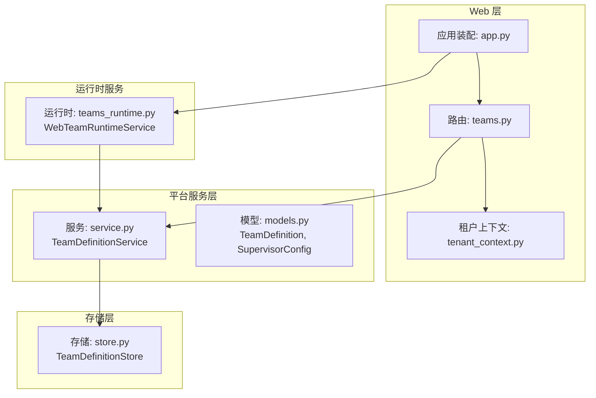
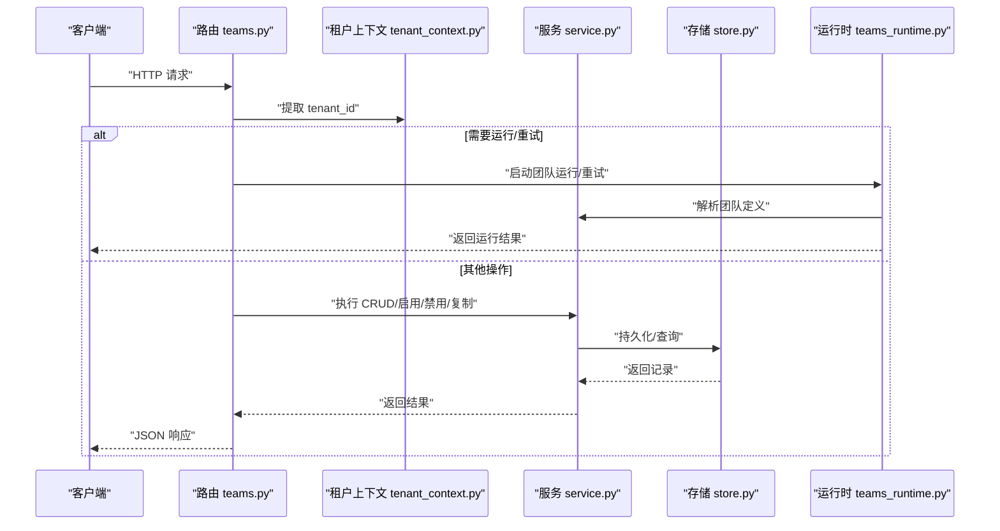
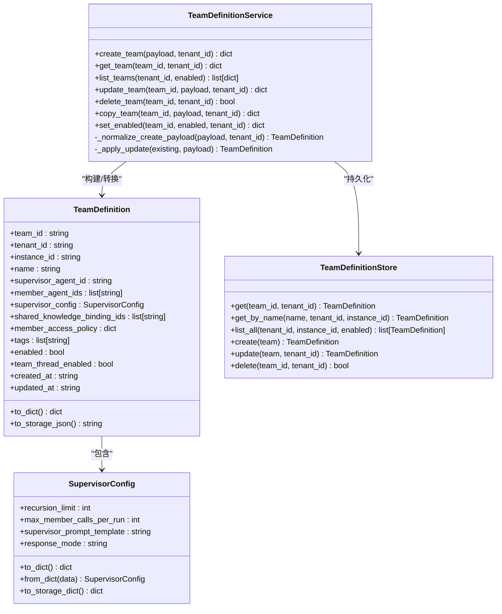
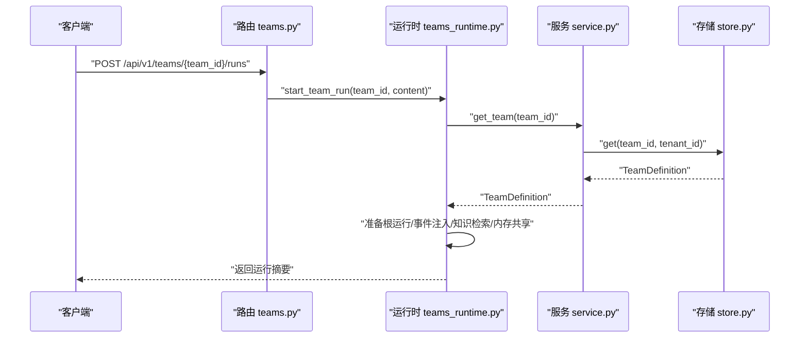

# 团队协作 API

<cite>
**本文引用的文件列表**
- [teams.py](file://nanobot/web/routers/teams.py)
- [models.py](file://nanobot/platform/teams/models.py)
- [service.py](file://nanobot/platform/teams/service.py)
- [store.py](file://nanobot/platform/teams/store.py)
- [teams_runtime.py](file://nanobot/web/runtime_services/teams.py)
- [tenant_context.py](file://nanobot/web/tenant_context.py)
- [app.py](file://nanobot/web/app.py)
- [test_team_definitions.py](file://tests/test_team_definitions.py)
- [test_web_api.py](file://tests/test_web_api.py)
</cite>

## 目录
1. [简介](#简介)
2. [项目结构](#项目结构)
3. [核心组件](#核心组件)
4. [架构总览](#架构总览)
5. [详细组件分析](#详细组件分析)
6. [依赖关系分析](#依赖关系分析)
7. [性能考量](#性能考量)
8. [故障排查指南](#故障排查指南)
9. [结论](#结论)
10. [附录](#附录)

## 简介
本文件为团队协作 API 的详细技术文档，覆盖团队创建、成员管理与权限分配的端点接口，以及团队配置、角色权限与协作流程的 API 操作。文档还解释了团队资源访问控制、团队间通信与协作状态管理，并提供在多租户环境下团队隔离机制的说明与实践建议。内容面向开发者与运维人员，既包含高层架构说明，也包含代码级细节与调用序列图。

## 项目结构
团队协作 API 的实现由三层组成：
- Web 层路由：定义 REST 接口与请求参数校验
- 平台服务层：业务规则、数据校验与跨租户/实例隔离
- 存储层：基于 SQLite 的持久化存储，支持索引优化

图表来源
- [teams.py:1-185](file://nanobot/web/routers/teams.py#L1-L185)
- [tenant_context.py:1-108](file://nanobot/web/tenant_context.py#L1-L108)
- [app.py:70-280](file://nanobot/web/app.py#L70-L280)
- [service.py:35-358](file://nanobot/platform/teams/service.py#L35-L358)
- [models.py:22-143](file://nanobot/platform/teams/models.py#L22-L143)
- [store.py:12-201](file://nanobot/platform/teams/store.py#L12-L201)
- [teams_runtime.py:16-543](file://nanobot/web/runtime_services/teams.py#L16-L543)

章节来源
- [teams.py:1-185](file://nanobot/web/routers/teams.py#L1-L185)
- [app.py:70-280](file://nanobot/web/app.py#L70-L280)

## 核心组件
- 路由器：提供团队 CRUD、启用/禁用、复制、运行与重试等端点
- 服务层：负责团队定义的校验、唯一性检查、代理引用验证、策略归一化
- 存储层：以 SQLite 表保存团队定义，带多索引优化查询
- 运行时服务：封装团队运行、线程会话、知识检索、内存共享与重试逻辑
- 租户上下文：多租户隔离与 API Key 认证中间件

章节来源
- [teams.py:30-185](file://nanobot/web/routers/teams.py#L30-L185)
- [service.py:35-358](file://nanobot/platform/teams/service.py#L35-L358)
- [store.py:12-201](file://nanobot/platform/teams/store.py#L12-L201)
- [teams_runtime.py:16-543](file://nanobot/web/runtime_services/teams.py#L16-L543)
- [tenant_context.py:20-108](file://nanobot/web/tenant_context.py#L20-L108)

## 架构总览
团队协作 API 的调用链路如下：
- 客户端通过 Web 路由发起请求
- 路由器提取租户 ID（默认“default”），并调用平台服务层
- 服务层执行业务校验与策略归一化，再通过存储层持久化
- 运行时服务处理团队运行、线程与知识/记忆共享

图表来源
- [teams.py:30-185](file://nanobot/web/routers/teams.py#L30-L185)
- [tenant_context.py:20-108](file://nanobot/web/tenant_context.py#L20-L108)
- [service.py:317-358](file://nanobot/platform/teams/service.py#L317-L358)
- [store.py:109-201](file://nanobot/platform/teams/store.py#L109-L201)
- [teams_runtime.py:414-522](file://nanobot/web/runtime_services/teams.py#L414-L522)

## 详细组件分析

### 路由器：团队 API 端点
- 列表团队：GET /api/v1/teams?enabled=布尔
- 创建团队：POST /api/v1/teams
- 获取团队：GET /api/v1/teams/{team_id}
- 获取团队线程摘要：GET /api/v1/teams/{team_id}/thread
- 获取团队线程消息：GET /api/v1/teams/{team_id}/thread/messages?limit=N
- 更新团队：PUT /api/v1/teams/{team_id}
- 删除团队：DELETE /api/v1/teams/{team_id}
- 复制团队：POST /api/v1/teams/{team_id}/copy
- 启用团队：POST /api/v1/teams/{team_id}/enable
- 禁用团队：POST /api/v1/teams/{team_id}/disable
- 测试运行团队：POST /api/v1/teams/{team_id}/runs
- 重试团队运行：POST /api/v1/teams/{team_id}/runs/{run_id}/retry

错误码与异常：
- 404：团队不存在（TeamDefinitionNotFoundError）
- 409：冲突（TeamDefinitionConflictError）
- 400：参数或校验错误（TeamDefinitionValidationError）

章节来源
- [teams.py:30-185](file://nanobot/web/routers/teams.py#L30-L185)

### 服务层：TeamDefinitionService
职责与要点：
- 数据校验与归一化：名称、代理 ID、成员列表、监督者配置、访问策略、标签、启用状态、线程开关
- 唯一性约束：同租户+实例下名称唯一；复制时生成“名称 Copy”候选名
- 代理引用验证：通过 agent_lookup 校验代理存在性
- 监督者配置校验：递归限制、最大成员调用次数、响应模式、提示模板长度
- 运行时集成：与运行时服务配合，支持测试运行、重试、取消

章节来源
- [service.py:35-358](file://nanobot/platform/teams/service.py#L35-L358)

### 存储层：TeamDefinitionStore
- 表结构：包含 team_id、tenant_id、instance_id、name、enabled、config_json、created_at、updated_at
- 索引：tenant_id+instance_id+updated_at、enabled、name
- 查询：按 team_id、按 name（tenant_id+instance_id）、分页与过滤 enabled
- 写入：插入与更新均写入 config_json 字段，使用统一时间戳

章节来源
- [store.py:12-201](file://nanobot/platform/teams/store.py#L12-L201)

### 运行时服务：WebTeamRuntimeService
- 团队线程：维护 team-thread 会话，支持摘要与消息查询
- 知识检索：根据团队绑定的知识库 ID 检索命中
- 内存共享：读取团队共享记忆，作为上下文块
- 运行生命周期：准备根运行、事件注入、LangGraph 执行、产物写入、完成/失败/取消
- 重试：从源运行提取任务内容，合并附加上下文后重新运行

章节来源
- [teams_runtime.py:16-543](file://nanobot/web/runtime_services/teams.py#L16-L543)

### 租户上下文与多租户隔离
- 中间件优先尝试 API Key 认证（Authorization 或 X-API-Key），否则回退到 Cookie 认证
- 提供 tenant_id 提取函数，默认“default”
- 路由器在执行业务前提取 tenant_id，确保 CRUD 操作限定在当前租户内
- 应用装配时将服务注入到 app.state，运行时通过 app.state.web 访问

章节来源
- [tenant_context.py:20-108](file://nanobot/web/tenant_context.py#L20-L108)
- [teams.py:35-36](file://nanobot/web/routers/teams.py#L35-L36)
- [app.py:70-280](file://nanobot/web/app.py#L70-L280)

### 数据模型：TeamDefinition 与 SupervisorConfig
- TeamDefinition 字段：团队标识、租户标识、实例标识、名称、监督者代理 ID、描述、成员代理 ID 列表、监督者配置、共享知识库绑定 ID 列表、成员访问策略、标签、启用状态、团队线程开关、创建/更新时间
- SupervisorConfig 字段：递归限制、每轮最大成员调用数、监督者提示模板、响应模式
- 访问策略默认值：团队共享知识库仅显式授权；团队共享记忆仅负责人写入/成员只读

章节来源
- [models.py:22-143](file://nanobot/platform/teams/models.py#L22-L143)

## 依赖关系分析

图表来源
- [models.py:22-143](file://nanobot/platform/teams/models.py#L22-L143)
- [service.py:35-358](file://nanobot/platform/teams/service.py#L35-L358)
- [store.py:12-201](file://nanobot/platform/teams/store.py#L12-L201)

## 性能考量
- 存储层索引：按 tenant_id+instance_id+updated_at、enabled、name 建立索引，提升列表与过滤查询效率
- 分页与限制：线程消息查询支持 limit 参数，避免一次性返回大量历史消息
- 异步运行：团队运行采用异步任务，后台执行 LangGraph 工作流，主线程快速返回运行信息
- 缓存与会话：团队线程会话在内存中维护，减少重复 IO

章节来源
- [store.py:27-33](file://nanobot/platform/teams/store.py#L27-L33)
- [teams_runtime.py:453-475](file://nanobot/web/runtime_services/teams.py#L453-L475)

## 故障排查指南
常见错误与定位：
- 404 TEAM_NOT_FOUND：团队不存在，检查 team_id 是否正确或是否属于当前租户
- 409 TEAM_CONFLICT：名称冲突或复制命名冲突，修改名称或删除同名团队
- 400 TEAM_VALIDATION_ERROR：字段类型不符、代理不存在、成员包含监督者、监督者配置越界
- 400 TEAM_RUN_INVALID/TEAM_RUN_RETRY_INVALID：运行内容为空或重试时无法提取源任务内容
- 401/403：API Key 无效或租户不匹配，检查请求头 Authorization/X-API-Key 与 X-Tenant-Id

章节来源
- [teams.py:47-101](file://nanobot/web/routers/teams.py#L47-L101)
- [teams_runtime.py:502-522](file://nanobot/web/runtime_services/teams.py#L502-L522)

## 结论
团队协作 API 在多租户隔离、团队配置与权限策略、运行时协作方面提供了清晰的分层设计与完善的错误处理。通过 SQLite 存储与索引优化，结合运行时服务的异步执行与上下文聚合能力，能够支撑中小规模到中等规模的团队编排场景。建议在生产环境中：
- 对外暴露 API 使用 API Key 认证并严格校验租户头
- 控制监督者配置参数范围，避免过深递归与过多成员调用
- 对线程消息与知识检索设置合理上限，防止内存膨胀
- 对运行任务进行可观测性埋点，便于追踪与审计

## 附录

### API 端点一览与示例

- 列表团队
  - 方法：GET
  - 路径：/api/v1/teams?enabled=布尔
  - 示例：GET /api/v1/teams?enabled=true
  - 返回：团队数组（含成员计数、启用状态等）

- 创建团队
  - 方法：POST
  - 路径：/api/v1/teams
  - 请求体：包含名称、监督者代理 ID、成员代理 ID 列表、共享知识库绑定 ID 列表、成员访问策略、标签、启用状态、团队线程开关等
  - 示例：见测试用例中的创建请求
  - 返回：新团队对象（含 teamId、memberCount 等）

- 获取团队
  - 方法：GET
  - 路径：/api/v1/teams/{team_id}
  - 示例：GET /api/v1/teams/abc123
  - 返回：团队详情

- 获取团队线程摘要
  - 方法：GET
  - 路径：/api/v1/teams/{team_id}/thread
  - 示例：GET /api/v1/teams/abc123/thread
  - 返回：线程 ID 与会话摘要

- 获取团队线程消息
  - 方法：GET
  - 路径：/api/v1/teams/{team_id}/thread/messages?limit=N
  - 示例：GET /api/v1/teams/abc123/thread/messages?limit=40
  - 返回：消息列表与总数

- 更新团队
  - 方法：PUT
  - 路径：/api/v1/teams/{team_id}
  - 请求体：可选字段（名称、描述、监督者代理 ID、成员代理 ID 列表、监督者配置、共享知识库绑定 ID 列表、成员访问策略、标签、启用状态、团队线程开关）
  - 示例：PUT /api/v1/teams/abc123，body 中仅传入 memberAccessPolicy
  - 返回：更新后的团队对象

- 删除团队
  - 方法：DELETE
  - 路径：/api/v1/teams/{team_id}
  - 示例：DELETE /api/v1/teams/abc123
  - 返回：{"deleted": true}

- 复制团队
  - 方法：POST
  - 路径：/api/v1/teams/{team_id}/copy
  - 请求体：可选新名称
  - 示例：POST /api/v1/teams/abc123/copy
  - 返回：复制出的新团队对象

- 启用/禁用团队
  - 方法：POST
  - 路径：/api/v1/teams/{team_id}/enable 或 /disable
  - 示例：POST /api/v1/teams/abc123/disable
  - 返回：更新后的团队对象

- 测试运行团队
  - 方法：POST
  - 路径：/api/v1/teams/{team_id}/runs
  - 请求体：{"content": "任务内容"}
  - 示例：POST /api/v1/teams/abc123/runs，body 为 {"content": "分析报告"}
  - 返回：运行摘要（包含团队、根运行、最终答案等）

- 重试团队运行
  - 方法：POST
  - 路径：/api/v1/teams/{team_id}/runs/{run_id}/retry
  - 请求体：{"appendContext": "附加上下文"}
  - 示例：POST /api/v1/teams/abc123/runs/root123/retry，body 为 {"appendContext": "请考虑最新数据"}
  - 返回：新的运行摘要

章节来源
- [teams.py:30-185](file://nanobot/web/routers/teams.py#L30-L185)
- [test_web_api.py:1545-1677](file://tests/test_web_api.py#L1545-L1677)
- [test_team_definitions.py:28-136](file://tests/test_team_definitions.py#L28-L136)

### 多租户与团队隔离机制
- 路由器在执行业务前提取 tenant_id（默认“default”），所有 CRUD 操作均按 tenant_id 过滤
- 存储层在查询与更新时可选择性带上 tenant_id，确保跨租户隔离
- 应用装配时将服务注入 app.state，运行时通过 app.state.web 访问团队运行时服务
- API Key 认证中间件优先于 Cookie 认证，且支持 X-Tenant-Id 头校验，进一步强化租户边界

章节来源
- [tenant_context.py:20-108](file://nanobot/web/tenant_context.py#L20-L108)
- [teams.py:35-36](file://nanobot/web/routers/teams.py#L35-L36)
- [store.py:57-82](file://nanobot/platform/teams/store.py#L57-L82)
- [app.py:70-280](file://nanobot/web/app.py#L70-L280)

### 团队配置与权限策略
- 成员访问策略（memberAccessPolicy）默认值：
  - teamSharedKnowledge：仅显式授权
  - teamSharedMemory：负责人写入/成员只读
- 可通过更新团队接口调整上述策略，如允许成员读取共享知识库或限制共享记忆访问范围
- 监督者配置（supervisorConfig）支持递归限制、每轮最大成员调用数、响应模式与提示模板

章节来源
- [models.py:15-19](file://nanobot/platform/teams/models.py#L15-L19)
- [service.py:82-132](file://nanobot/platform/teams/service.py#L82-L132)
- [teams.py:86-101](file://nanobot/web/routers/teams.py#L86-L101)

### 协作流程与运行时交互

图表来源
- [teams.py:152-164](file://nanobot/web/routers/teams.py#L152-L164)
- [teams_runtime.py:414-451](file://nanobot/web/runtime_services/teams.py#L414-L451)
- [service.py:314-315](file://nanobot/platform/teams/service.py#L314-L315)
- [store.py:57-70](file://nanobot/platform/teams/store.py#L57-L70)