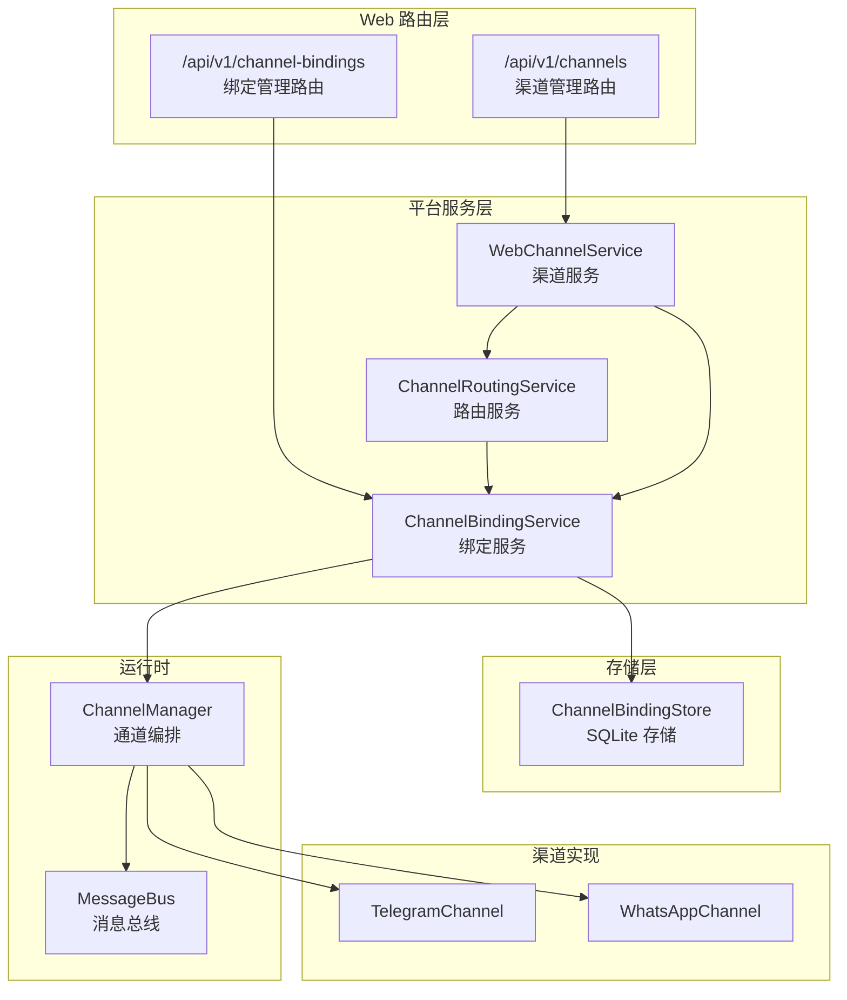
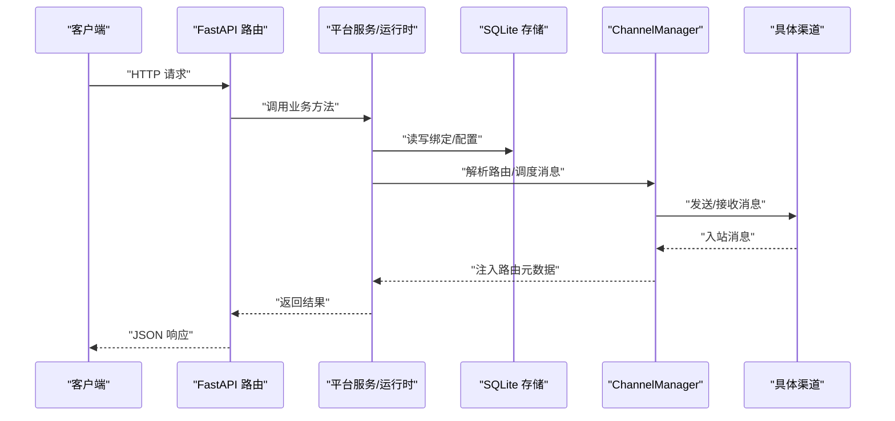
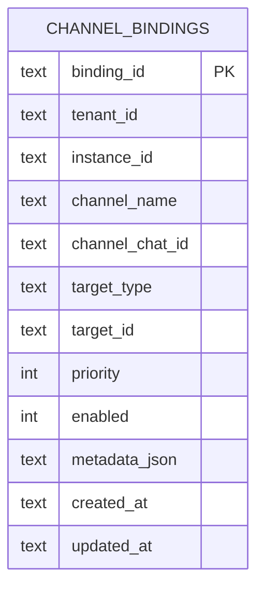
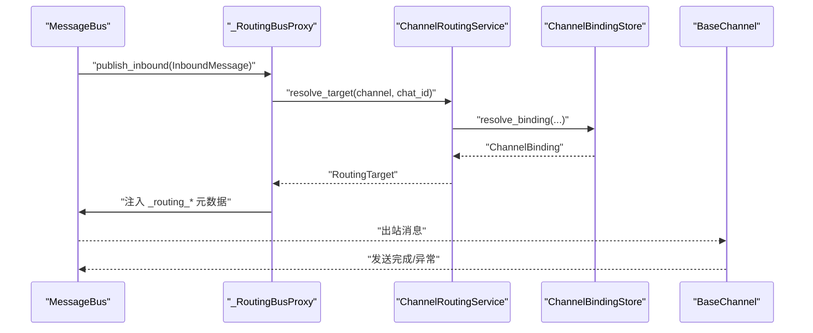
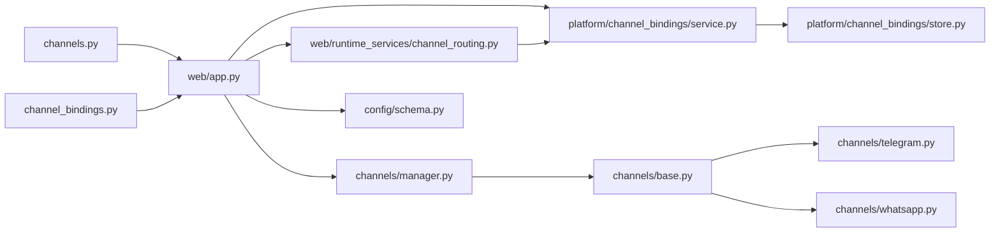
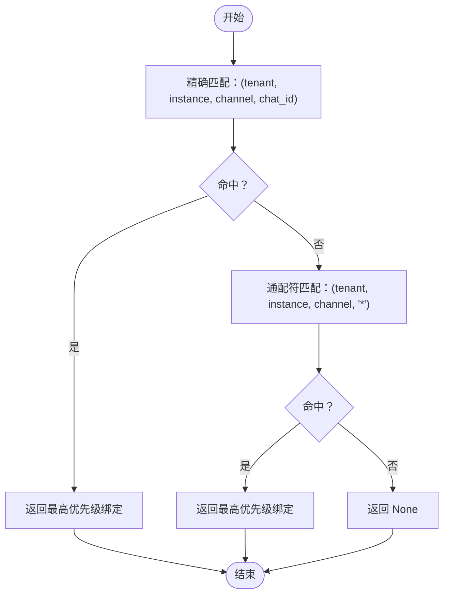

# 渠道管理 API

<cite>
**本文引用的文件**
- [channels.py](file://nanobot/web/routers/channels.py)
- [channel_bindings.py](file://nanobot/web/routers/channel_bindings.py)
- [models.py](file://nanobot/platform/channel_bindings/models.py)
- [service.py](file://nanobot/platform/channel_bindings/service.py)
- [store.py](file://nanobot/platform/channel_bindings/store.py)
- [channel_routing.py](file://nanobot/web/runtime_services/channel_routing.py)
- [manager.py](file://nanobot/channels/manager.py)
- [base.py](file://nanobot/channels/base.py)
- [app.py](file://nanobot/web/app.py)
- [schema.py](file://nanobot/config/schema.py)
- [telegram.py](file://nanobot/channels/telegram.py)
- [whatsapp.py](file://nanobot/channels/whatsapp.py)
- [channel_testing.py](file://nanobot/web/channel_testing.py)
- [whatsapp_binding.py](file://nanobot/web/whatsapp_binding.py)
</cite>

## 目录
1. [简介](#简介)
2. [项目结构](#项目结构)
3. [核心组件](#核心组件)
4. [架构总览](#架构总览)
5. [详细组件分析](#详细组件分析)
6. [依赖分析](#依赖分析)
7. [性能考虑](#性能考虑)
8. [故障排查指南](#故障排查指南)
9. [结论](#结论)
10. [附录](#附录)

## 简介
本文件为 nanobot 渠道管理 API 的权威文档，覆盖渠道配置、渠道绑定与状态管理、渠道类型管理、渠道认证配置、渠道连接状态监控、渠道绑定的创建/更新/删除、消息路由 API 以及健康检查等能力。文档以代码为依据，提供端到端的接口说明、数据模型、调用序列图与流程图，帮助开发者快速集成与排障。

## 项目结构
- Web 层路由：定义渠道与绑定的 REST API，负责参数解析、错误处理与响应封装。
- 平台层服务：提供渠道绑定的持久化、解析与校验逻辑。
- 运行时服务：负责消息路由解析与目标绑定映射。
- 渠道实现：各平台通道（如 Telegram、WhatsApp）的具体接入与消息收发。
- 配置模型：统一的渠道配置结构，用于渠道启用、鉴权与行为控制。

**图表来源**
- [channels.py:16-123](file://nanobot/web/routers/channels.py#L16-L123)
- [channel_bindings.py:21-102](file://nanobot/web/routers/channel_bindings.py#L21-L102)
- [service.py:28-201](file://nanobot/platform/channel_bindings/service.py#L28-L201)
- [store.py:11-231](file://nanobot/platform/channel_bindings/store.py#L11-L231)
- [channel_routing.py:23-73](file://nanobot/web/runtime_services/channel_routing.py#L23-L73)
- [manager.py:52-209](file://nanobot/channels/manager.py#L52-L209)
- [telegram.py:150-736](file://nanobot/channels/telegram.py#L150-L736)
- [whatsapp.py:16-172](file://nanobot/channels/whatsapp.py#L16-L172)

**章节来源**
- [channels.py:16-123](file://nanobot/web/routers/channels.py#L16-L123)
- [channel_bindings.py:21-102](file://nanobot/web/routers/channel_bindings.py#L21-L102)
- [service.py:28-201](file://nanobot/platform/channel_bindings/service.py#L28-L201)
- [store.py:11-231](file://nanobot/platform/channel_bindings/store.py#L11-L231)
- [channel_routing.py:23-73](file://nanobot/web/runtime_services/channel_routing.py#L23-L73)
- [manager.py:52-209](file://nanobot/channels/manager.py#L52-L209)
- [telegram.py:150-736](file://nanobot/channels/telegram.py#L150-L736)
- [whatsapp.py:16-172](file://nanobot/channels/whatsapp.py#L16-L172)

## 核心组件
- 渠道管理路由：提供渠道列表、详情查询、配置更新、连通性测试、WhatsApp 绑定状态与启停等接口。
- 渠道绑定路由：提供绑定的增删改查与解析接口，支持按渠道名与聊天 ID 解析目标。
- 绑定服务与存储：提供绑定的校验、冲突检测、优先级解析、持久化与查询。
- 路由服务：基于绑定规则解析入站消息的目标（agent/team），并注入元数据。
- 渠道编排器：统一启动/停止各通道，调度出站消息，维护通道状态。
- 渠道实现：具体平台的消息收发与权限控制。
- 配置模型：集中定义各渠道的配置项与默认值。

**章节来源**
- [channels.py:16-123](file://nanobot/web/routers/channels.py#L16-L123)
- [channel_bindings.py:21-102](file://nanobot/web/routers/channel_bindings.py#L21-L102)
- [service.py:28-201](file://nanobot/platform/channel_bindings/service.py#L28-L201)
- [store.py:11-231](file://nanobot/platform/channel_bindings/store.py#L11-L231)
- [channel_routing.py:23-73](file://nanobot/web/runtime_services/channel_routing.py#L23-L73)
- [manager.py:52-209](file://nanobot/channels/manager.py#L52-L209)
- [schema.py:17-229](file://nanobot/config/schema.py#L17-L229)

## 架构总览
下图展示从 Web 路由到平台服务、存储与运行时的整体交互：

**图表来源**
- [channels.py:16-123](file://nanobot/web/routers/channels.py#L16-L123)
- [channel_bindings.py:21-102](file://nanobot/web/routers/channel_bindings.py#L21-L102)
- [service.py:28-201](file://nanobot/platform/channel_bindings/service.py#L28-L201)
- [store.py:11-231](file://nanobot/platform/channel_bindings/store.py#L11-L231)
- [manager.py:52-209](file://nanobot/channels/manager.py#L52-L209)

## 详细组件分析

### 渠道管理 API
- 获取所有渠道概览与投递设置
  - 方法与路径：GET /api/v1/channels
  - 功能：返回渠道投递设置与各渠道状态（启用/配置/未配置/待补全）
  - 关键实现：WebChannelService 将配置转换为前端友好的结构
- 更新投递设置
  - 方法与路径：PUT /api/v1/channels/delivery
  - 参数：sendProgress、sendToolHints
  - 行为：更新 channels.sendProgress 与 channels.sendToolHints
- 查询单个渠道详情
  - 方法与路径：GET /api/v1/channels/{channel_name}
  - 返回：渠道配置、投递设置与状态标签
- 更新单个渠道配置
  - 方法与路径：PUT /api/v1/channels/{channel_name}
  - 参数：按渠道类型所需的必要字段
  - 行为：合并现有配置并校验必填项
- 测试渠道连通性
  - 方法与路径：POST /api/v1/channels/{channel_name}/test
  - 行为：对 Telegram/Discord/Slack/Matrix/Email/WhatsApp 等执行最小化连通性探测
- WhatsApp 绑定状态
  - 方法与路径：GET /api/v1/channels/whatsapp/bind/status
  - 返回：bridgeUrl、bridgeDir、进程状态、认证目录、是否需要绑定、最近日志等
- 启动/停止 WhatsApp 绑定流程
  - 方法与路径：POST /api/v1/channels/whatsapp/bind/start、POST /api/v1/channels/whatsapp/bind/stop
  - 行为：启动/停止内置 bridge 进程，监听 QR 与状态事件

请求/响应要点
- 成功响应：统一包装为 { "code": "OK", "message": "success", "data": ... }
- 错误响应：统一包装为 { "code": "...", "message": "...", "details": [...] 或字符串 }

**章节来源**
- [channels.py:16-123](file://nanobot/web/routers/channels.py#L16-L123)
- [channel_testing.py:81-131](file://nanobot/web/channel_testing.py#L81-L131)
- [whatsapp_binding.py:43-339](file://nanobot/web/whatsapp_binding.py#L43-L339)

### 渠道绑定 API
- 列表绑定
  - 方法与路径：GET /api/v1/channel-bindings
  - 返回：当前租户下所有绑定（按优先级与时间排序）
- 创建绑定
  - 方法与路径：POST /api/v1/channel-bindings
  - 参数：channelName、channelChatId、targetType(agent/team)、targetId、priority、enabled、metadata
  - 冲突：同一租户+实例+渠道+聊天 ID 的唯一约束
- 查询绑定
  - 方法与路径：GET /api/v1/channel-bindings/{binding_id}
- 更新绑定
  - 方法与路径：PUT /api/v1/channel-bindings/{binding_id}
  - 行为：可增量更新字段，校验目标存在性
- 删除绑定
  - 方法与路径：DELETE /api/v1/channel-bindings/{binding_id}
- 解析绑定
  - 方法与路径：POST /api/v1/channel-bindings/resolve
  - 输入：channelName、chatId
  - 输出：binding（若命中）、resolved 标记

绑定解析规则
- 先精确匹配 (channel_chat_id=指定值)，再回退到通配符 "*"（均要求 enabled=true）
- 优先级降序，同优先级按更新时间降序

**章节来源**
- [channel_bindings.py:21-102](file://nanobot/web/routers/channel_bindings.py#L21-L102)
- [service.py:73-201](file://nanobot/platform/channel_bindings/service.py#L73-L201)
- [store.py:74-128](file://nanobot/platform/channel_bindings/store.py#L74-L128)

### 数据模型与存储
- ChannelBinding 数据类
  - 字段：binding_id、tenant_id、instance_id、channel_name、channel_chat_id、target_type、target_id、priority、enabled、metadata、created_at、updated_at
  - 序列化：to_storage_json、to_dict
- SQLite 存储
  - 索引：唯一索引 (tenant_id, instance_id, channel_name, channel_chat_id)、查询索引 (lookup)
  - 支持：get、resolve、list_all、create、update、delete

**图表来源**
- [store.py:14-35](file://nanobot/platform/channel_bindings/store.py#L14-L35)
- [models.py:15-69](file://nanobot/platform/channel_bindings/models.py#L15-L69)

**章节来源**
- [models.py:15-69](file://nanobot/platform/channel_bindings/models.py#L15-L69)
- [store.py:11-231](file://nanobot/platform/channel_bindings/store.py#L11-L231)

### 消息路由与运行时
- ChannelRoutingService
  - resolve_target：根据 channel_name + chat_id 解析目标（agent/team），返回 RoutingTarget
- ChannelManager
  - 在有路由服务时，通过代理向入站消息注入 _routing_target_type/_routing_target_id/_routing_binding_id
  - 出站分发：按 msg.channel 查找对应 Channel，过滤进度/工具提示开关后发送
  - 状态查询：返回每个启用通道的运行状态

**图表来源**
- [manager.py:19-50](file://nanobot/channels/manager.py#L19-L50)
- [channel_routing.py:38-73](file://nanobot/web/runtime_services/channel_routing.py#L38-L73)
- [service.py:73-85](file://nanobot/platform/channel_bindings/service.py#L73-L85)
- [store.py:74-110](file://nanobot/platform/channel_bindings/store.py#L74-L110)

**章节来源**
- [channel_routing.py:23-73](file://nanobot/web/runtime_services/channel_routing.py#L23-L73)
- [manager.py:52-209](file://nanobot/channels/manager.py#L52-L209)

### 渠道类型与认证配置
- 渠道类型与必填字段
  - Telegram：token、allowFrom
  - WhatsApp：bridgeUrl、allowFrom
  - Discord：token、allowFrom
  - QQ：appId、secret、allowFrom
  - Slack：botToken、appToken、allowFrom
  - Matrix：accessToken、userId、allowFrom
  - Feishu：appId、appSecret、allowFrom
  - DingTalk：clientId、clientSecret、allowFrom
  - WeCom：botId、secret、allowFrom
  - MoChat：clawToken、agentUserId、allowFrom
  - Email：consentGranted、imap/smtp 凭据、fromAddress、allowFrom
- 投递设置
  - channels.sendProgress：是否推送进度文本
  - channels.sendToolHints：是否推送工具提示
- 允许列表
  - allowFrom：空列表将拒绝所有；"*" 表示允许所有；具体平台允许名单策略不同（如 Telegram 支持 id|username）

**章节来源**
- [schema.py:17-229](file://nanobot/config/schema.py#L17-L229)
- [channels.py:13-35](file://nanobot/web/channels.py#L13-L35)
- [channels.py:117-159](file://nanobot/web/channels.py#L117-L159)

### 渠道实现要点
- BaseChannel
  - 抽象接口：start/stop/send
  - 权限控制：is_allowed（allowFrom）
  - 入站封装：_handle_message 构造 InboundMessage 并发布
- TelegramChannel
  - 支持文本、图片、语音、音频、文档
  - 支持话题/子主题会话键派生
  - 支持媒体组聚合与转录（Groq）
- WhatsAppChannel
  - 通过 WebSocket 与 Node.js bridge 通信
  - 处理 QR、状态、消息事件
  - 支持媒体路径标记

**章节来源**
- [base.py:15-135](file://nanobot/channels/base.py#L15-L135)
- [telegram.py:150-736](file://nanobot/channels/telegram.py#L150-L736)
- [whatsapp.py:16-172](file://nanobot/channels/whatsapp.py#L16-L172)

## 依赖分析
- 路由层依赖 WebAppState 注入的服务（WebChannelService、ChannelBindingService、WebChannelTestService、WebWhatsAppBindingService）
- 平台层服务依赖存储层（ChannelBindingStore）
- 运行时依赖消息总线与通道实现
- 配置模型集中定义渠道配置项

**图表来源**
- [channels.py:16-123](file://nanobot/web/routers/channels.py#L16-L123)
- [channel_bindings.py:21-102](file://nanobot/web/routers/channel_bindings.py#L21-L102)
- [app.py:70-204](file://nanobot/web/app.py#L70-L204)
- [service.py:28-201](file://nanobot/platform/channel_bindings/service.py#L28-L201)
- [store.py:11-231](file://nanobot/platform/channel_bindings/store.py#L11-L231)
- [channel_routing.py:23-73](file://nanobot/web/runtime_services/channel_routing.py#L23-L73)
- [manager.py:52-209](file://nanobot/channels/manager.py#L52-L209)
- [base.py:15-135](file://nanobot/channels/base.py#L15-L135)
- [telegram.py:150-736](file://nanobot/channels/telegram.py#L150-L736)
- [whatsapp.py:16-172](file://nanobot/channels/whatsapp.py#L16-L172)
- [schema.py:17-229](file://nanobot/config/schema.py#L17-L229)

**章节来源**
- [app.py:70-204](file://nanobot/web/app.py#L70-L204)

## 性能考虑
- 出站分发轮询：ChannelManager 出站调度使用超时等待，避免阻塞；可通过配置开关控制进度与工具提示的推送，减少冗余消息。
- 绑定解析：SQLite 使用索引优化 exact/wildcard 匹配；优先级与时间排序确保命中命中效率。
- 渠道实现：Telegram 使用连接池与媒体组缓冲，降低网络开销；WhatsApp 通过 bridge 异步处理消息与状态。

[本节为通用指导，无需特定文件引用]

## 故障排查指南
常见错误与定位
- 渠道配置缺失：更新渠道配置时必须包含该渠道的必填字段，否则状态为“待补全”或返回错误。
- 绑定冲突：同一租户+实例+渠道+聊天 ID 的组合唯一，重复创建会触发冲突错误。
- 绑定不存在：查询/更新/删除绑定时若不存在，返回“未找到”。
- 渠道测试失败：根据渠道类型进行最小化探测（如 Telegram Token、Discord Bot Token、Slack App Token、Matrix Token、Email 凭据、WhatsApp Bridge 连通性等），查看详细诊断信息。
- WhatsApp 绑定：若认证目录为空或状态非 connected，则需要先完成绑定流程；可通过 status 接口查看 bridgeUrl、running、authPresent、bindingRequired、recentLogs 等。

**章节来源**
- [channels.py:22-38](file://nanobot/web/routers/channels.py#L22-L38)
- [channel_bindings.py:34-42](file://nanobot/web/routers/channel_bindings.py#L34-L42)
- [channel_testing.py:87-131](file://nanobot/web/channel_testing.py#L87-L131)
- [whatsapp_binding.py:64-92](file://nanobot/web/whatsapp_binding.py#L64-L92)

## 结论
本套 API 提供了从渠道配置、认证、连通性测试到绑定管理与消息路由的完整闭环。通过清晰的路由层、健壮的平台服务与存储、可扩展的运行时编排，开发者可以快速实现多渠道接入与智能路由。建议在生产环境中：
- 明确各渠道的 allowFrom 策略与凭据管理
- 使用绑定解析实现精细化路由与优先级控制
- 定期进行渠道连通性测试与绑定健康检查
- 基于进度/工具提示开关优化用户体验

[本节为总结性内容，无需特定文件引用]

## 附录

### API 定义速览
- 渠道管理
  - GET /api/v1/channels
  - PUT /api/v1/channels/delivery
  - GET /api/v1/channels/{channel_name}
  - PUT /api/v1/channels/{channel_name}
  - POST /api/v1/channels/{channel_name}/test
  - GET /api/v1/channels/whatsapp/bind/status
  - POST /api/v1/channels/whatsapp/bind/start
  - POST /api/v1/channels/whatsapp/bind/stop
- 渠道绑定
  - GET /api/v1/channel-bindings
  - POST /api/v1/channel-bindings
  - GET /api/v1/channel-bindings/{binding_id}
  - PUT /api/v1/channel-bindings/{binding_id}
  - DELETE /api/v1/channel-bindings/{binding_id}
  - POST /api/v1/channel-bindings/resolve

**章节来源**
- [channels.py:16-123](file://nanobot/web/routers/channels.py#L16-L123)
- [channel_bindings.py:21-102](file://nanobot/web/routers/channel_bindings.py#L21-L102)

### 绑定解析流程

**图表来源**
- [store.py:74-110](file://nanobot/platform/channel_bindings/store.py#L74-L110)
- [service.py:73-85](file://nanobot/platform/channel_bindings/service.py#L73-L85)