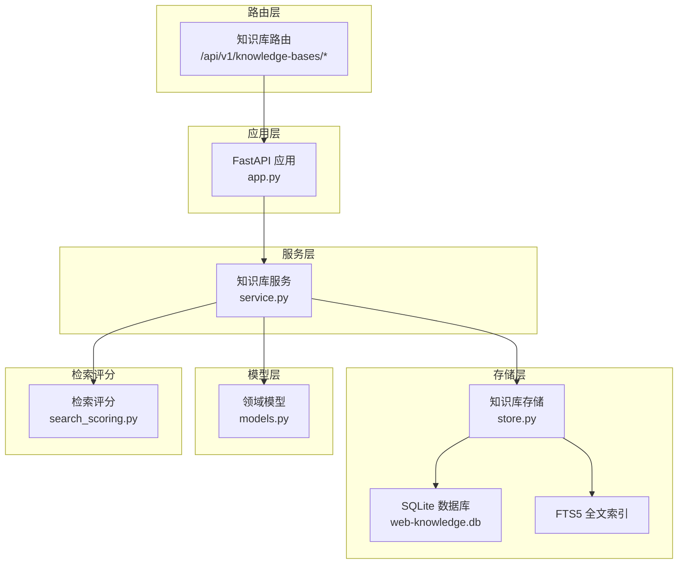
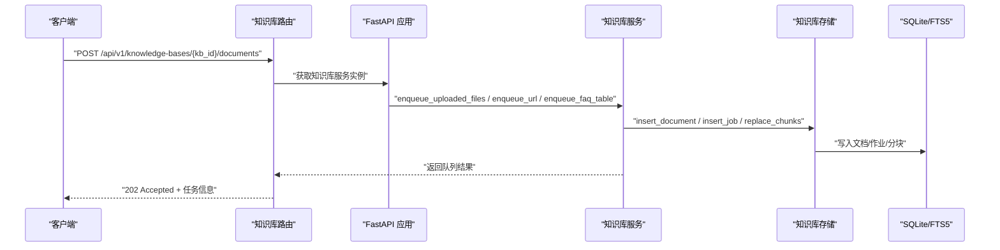
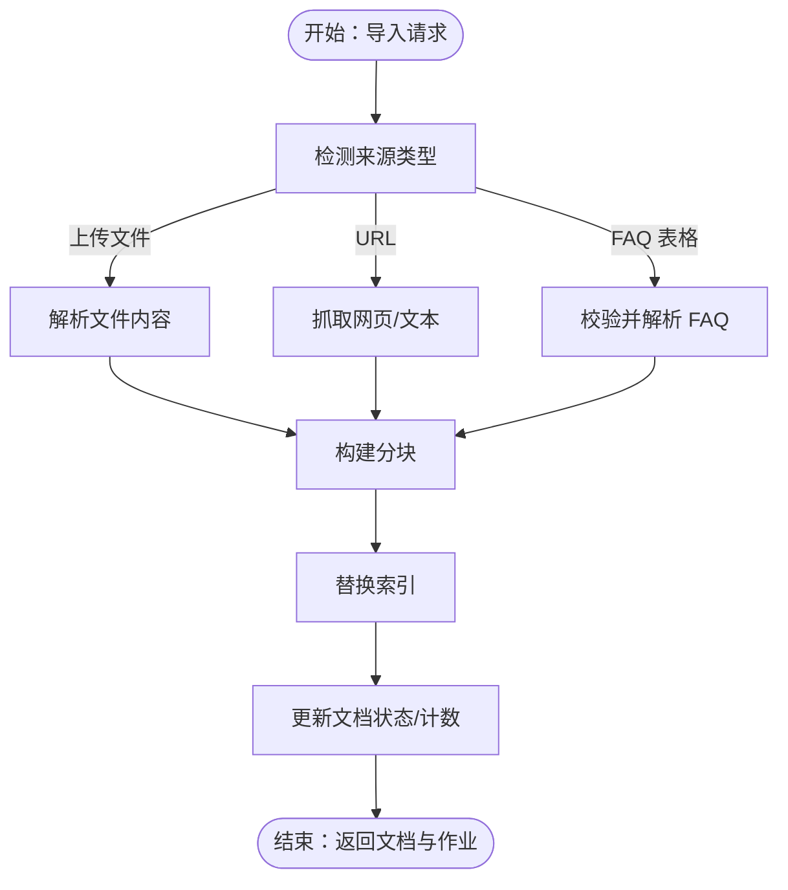
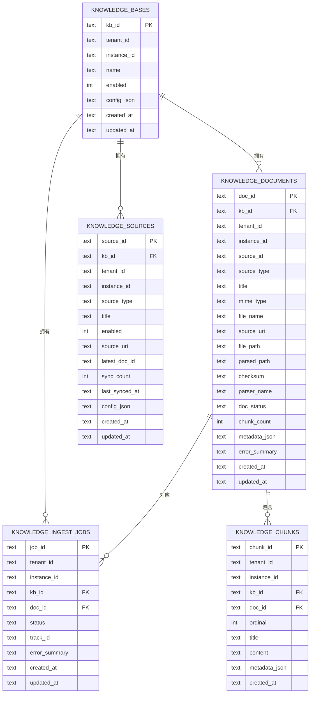
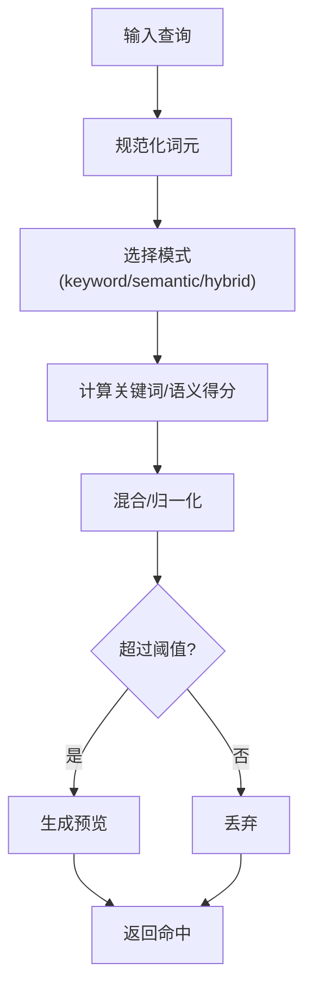
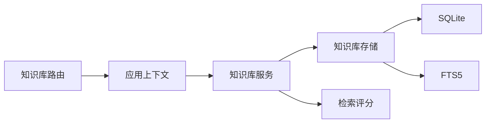

# 知识库管理 API

<cite>
**本文档引用的文件**
- [nanobot/platform/knowledge/models.py](file://nanobot/platform/knowledge/models.py)
- [nanobot/platform/knowledge/service.py](file://nanobot/platform/knowledge/service.py)
- [nanobot/platform/knowledge/store.py](file://nanobot/platform/knowledge/store.py)
- [nanobot/platform/search_scoring.py](file://nanobot/platform/search_scoring.py)
- [nanobot/web/routers/knowledge.py](file://nanobot/web/routers/knowledge.py)
- [nanobot/web/app.py](file://nanobot/web/app.py)
- [tests/test_knowledge_bases.py](file://tests/test_knowledge_bases.py)
</cite>

## 目录
1. [简介](#简介)
2. [项目结构](#项目结构)
3. [核心组件](#核心组件)
4. [架构总览](#架构总览)
5. [详细组件分析](#详细组件分析)
6. [依赖关系分析](#依赖关系分析)
7. [性能考虑](#性能考虑)
8. [故障排除指南](#故障排除指南)
9. [结论](#结论)
10. [附录](#附录)

## 简介
本文件为 nanobot 平台的知识库管理 API 提供全面的技术文档。涵盖知识条目创建、索引、检索与管理的完整接口，包括知识分类、标签管理与搜索优化端点；解释知识更新策略、版本控制与内容审核流程；提供知识导入、批量处理与质量评估的实践示例，并说明向量化存储与相似度匹配能力。

## 项目结构
知识库相关代码主要分布在以下模块：
- 路由层：定义 REST API 端点（知识库 CRUD、文档导入、检索、重索引、源同步等）
- 服务层：业务逻辑编排（解析、分块、索引、检索、重索引、源同步、批量删除）
- 存储层：SQLite 持久化与 FTS5 全文检索支持
- 模型层：知识库、文档、作业、源的领域模型与序列化
- 检索评分：关键词/语义混合检索评分与阈值

图表来源
- [nanobot/web/routers/knowledge.py:1-240](file://nanobot/web/routers/knowledge.py#L1-L240)
- [nanobot/web/app.py:70-280](file://nanobot/web/app.py#L70-L280)
- [nanobot/platform/knowledge/service.py:71-1814](file://nanobot/platform/knowledge/service.py#L71-L1814)
- [nanobot/platform/knowledge/store.py:18-729](file://nanobot/platform/knowledge/store.py#L18-L729)
- [nanobot/platform/knowledge/models.py:1-298](file://nanobot/platform/knowledge/models.py#L1-L298)
- [nanobot/platform/search_scoring.py:1-143](file://nanobot/platform/search_scoring.py#L1-L143)

章节来源
- [nanobot/web/routers/knowledge.py:1-240](file://nanobot/web/routers/knowledge.py#L1-L240)
- [nanobot/web/app.py:70-280](file://nanobot/web/app.py#L70-L280)

## 核心组件
- 领域模型
  - 知识库定义：名称、描述、启用状态、标签、检索配置
  - 知识文档：来源类型、标题、元数据、状态、分块数量
  - 索引作业：状态、跟踪 ID、错误摘要
  - 知识源：来源类型、标题、启用状态、最新文档、同步统计
  - 检索配置：模式（关键词/语义/混合）、返回数量、分块大小与重叠、引用要求、重排序开关、元数据过滤
- 服务层职责
  - 知识库 CRUD、文档列表、作业列表、源列表与更新
  - 文件上传、URL 抓取、FAQ 表格三种导入方式
  - 解析、分块、替换索引、状态流转与错误处理
  - 检索：关键词/语义/混合模式，预览生成，引用信息
  - 重索引与源同步
- 存储层职责
  - SQLite 表结构与索引，FTS5 全文索引
  - 增量迁移（新增列与索引），兼容旧数据库
  - 搜索与分页查询
- 检索评分
  - 查询词规范化、关键词得分、语义近似得分、混合得分与阈值

章节来源
- [nanobot/platform/knowledge/models.py:16-298](file://nanobot/platform/knowledge/models.py#L16-L298)
- [nanobot/platform/knowledge/service.py:71-1814](file://nanobot/platform/knowledge/service.py#L71-L1814)
- [nanobot/platform/knowledge/store.py:18-729](file://nanobot/platform/knowledge/store.py#L18-L729)
- [nanobot/platform/search_scoring.py:17-143](file://nanobot/platform/search_scoring.py#L17-L143)

## 架构总览
知识库管理采用“路由 → 应用上下文注入 → 服务层 → 存储层”的分层架构。应用启动时初始化知识库服务与存储，路由通过请求上下文访问服务层执行业务操作。检索路径结合 FTS5 与自研评分函数，支持关键词、语义与混合模式。

图表来源
- [nanobot/web/routers/knowledge.py:150-186](file://nanobot/web/routers/knowledge.py#L150-L186)
- [nanobot/web/app.py:87-91](file://nanobot/web/app.py#L87-L91)
- [nanobot/platform/knowledge/service.py:1164-1249](file://nanobot/platform/knowledge/service.py#L1164-L1249)
- [nanobot/platform/knowledge/store.py:289-422](file://nanobot/platform/knowledge/store.py#L289-L422)

## 详细组件分析

### 路由与端点
- 知识库管理
  - GET /api/v1/knowledge-bases：列出知识库（可按启用状态筛选）
  - POST /api/v1/knowledge-bases：创建知识库（名称唯一性校验）
  - GET /api/v1/knowledge-bases/{kb_id}：获取知识库详情
  - PUT /api/v1/knowledge-bases/{kb_id}：更新知识库（名称唯一性校验）
  - DELETE /api/v1/knowledge-bases/{kb_id}：删除知识库（级联清理文件与索引）
- 文档与作业
  - GET /api/v1/knowledge-bases/{kb_id}/documents：列出文档
  - GET /api/v1/knowledge-bases/{kb_id}/jobs：列出作业
  - DELETE /api/v1/knowledge-bases/{kb_id}/documents/{doc_id}：删除单个文档
  - POST /api/v1/knowledge-bases/{kb_id}/documents/delete：批量删除文档
- 导入与检索
  - POST /api/v1/knowledge-bases/{kb_id}/documents：多格式导入（multipart/form-data 或 JSON）
  - POST /api/v1/knowledge-bases/{kb_id}/retrieve-test：检索测试（关键词/语义/混合）
  - POST /api/v1/knowledge-bases/{kb_id}/reindex：重索引（可指定文档 ID 列表）
- 源管理
  - GET /api/v1/knowledge-bases/{kb_id}/sources：列出源
  - PUT /api/v1/knowledge-bases/{kb_id}/sources/{source_id}：更新源（web_url/faq_table）
  - POST /api/v1/knowledge-bases/{kb_id}/sources/{source_id}/sync：同步源并触发重索引

章节来源
- [nanobot/web/routers/knowledge.py:22-240](file://nanobot/web/routers/knowledge.py#L22-L240)

### 服务层：知识库服务
- 知识库 CRUD
  - 名称唯一性检查、检索配置标准化、创建/更新时间戳维护
- 文档与作业
  - 文档列表、作业列表、删除单个或批量文档
- 导入流程
  - 上传文件：保存原始与解析文件，解析文本，构建分块，写入索引
  - URL 抓取：下载 HTML/纯文本，解析标题与正文，构建分块，写入索引
  - FAQ 表格：校验问题/答案对，转为问答文本，构建分块，写入索引
- 重索引与源同步
  - 重索引：支持全库或指定文档 ID 列表，失败状态回退
  - 源同步：根据源类型刷新标题/URL/FAQ 内容并重新入队
- 检索
  - 关键词/语义/混合模式，预览生成，引用信息，元数据过滤

图表来源
- [nanobot/platform/knowledge/service.py:824-1030](file://nanobot/platform/knowledge/service.py#L824-L1030)
- [nanobot/platform/knowledge/service.py:1097-1162](file://nanobot/platform/knowledge/service.py#L1097-L1162)
- [nanobot/platform/knowledge/service.py:1228-1249](file://nanobot/platform/knowledge/service.py#L1228-L1249)

章节来源
- [nanobot/platform/knowledge/service.py:71-1814](file://nanobot/platform/knowledge/service.py#L71-L1814)

### 存储层：知识库存储
- 表结构
  - knowledge_bases：知识库元数据与配置
  - knowledge_documents：文档元数据、状态、分块计数、元数据 JSON
  - knowledge_sources：知识源、启用状态、最新文档、同步统计
  - knowledge_ingest_jobs：导入作业状态与跟踪
  - knowledge_chunks：分块内容与元数据
  - knowledge_chunks_fts：FTS5 虚拟表（全文检索）
- 索引
  - 主键与多处二级索引，加速查询
  - FTS5 支持，自动降级
- 迁移
  - 自动迁移旧数据库，补齐缺失列与索引

图表来源
- [nanobot/platform/knowledge/store.py:21-131](file://nanobot/platform/knowledge/store.py#L21-L131)

章节来源
- [nanobot/platform/knowledge/store.py:18-729](file://nanobot/platform/knowledge/store.py#L18-L729)

### 检索评分与相似度匹配
- 查询词规范化：提取中英文词元，去重
- 关键词得分：基于命中覆盖与密度
- 语义得分：字符 N-gram Jaccard 与前缀匹配近似
- 混合得分：加权融合关键词与语义得分
- 阈值：不同模式下的最低阈值
- 预览：截取命中片段，便于前端展示

图表来源
- [nanobot/platform/search_scoring.py:24-118](file://nanobot/platform/search_scoring.py#L24-L118)
- [nanobot/platform/knowledge/service.py:1655-1814](file://nanobot/platform/knowledge/service.py#L1655-L1814)

章节来源
- [nanobot/platform/search_scoring.py:17-143](file://nanobot/platform/search_scoring.py#L17-L143)
- [nanobot/platform/knowledge/service.py:1655-1814](file://nanobot/platform/knowledge/service.py#L1655-L1814)

### 知识更新策略、版本控制与审核
- 更新策略
  - 知识库：名称唯一性校验、检索配置可增量更新
  - 源：web_url/faq_table 类型支持字段更新，自动同步最新文档元数据
- 版本控制
  - 文档状态机：uploaded → parsing → parsed → indexing → indexed/error_parsing/error_indexing
  - 作业状态机：queued → running → succeeded/failed
  - 通过状态与错误摘要追踪版本与变更
- 审核流程
  - 错误摘要记录在文档与作业中，便于人工复核
  - 支持重索引修复错误状态

章节来源
- [nanobot/platform/knowledge/models.py:16-31](file://nanobot/platform/knowledge/models.py#L16-L31)
- [nanobot/platform/knowledge/service.py:805-822](file://nanobot/platform/knowledge/service.py#L805-L822)

### 知识导入、批量处理与质量评估
- 导入方式
  - 上传文件：支持 txt/md/html/json/csv/xlsx/pdf/docx
  - URL 抓取：HTML/纯文本自动解析
  - FAQ 表格：JSON/CSV 结构化问答
- 批量处理
  - 批量删除文档：传入 docIds 数组
  - 重索引：支持全库或指定文档 ID 列表
- 质量评估
  - 分块大小与重叠参数影响召回与上下文连续性
  - 引用信息包含来源类型、URI、文件名等，便于溯源
  - 预览与得分用于人工评估检索质量

章节来源
- [nanobot/platform/knowledge/service.py:657-697](file://nanobot/platform/knowledge/service.py#L657-L697)
- [nanobot/platform/knowledge/service.py:1208-1249](file://nanobot/platform/knowledge/service.py#L1208-L1249)
- [nanobot/platform/knowledge/service.py:1307-1338](file://nanobot/platform/knowledge/service.py#L1307-L1338)
- [tests/test_knowledge_bases.py:19-88](file://tests/test_knowledge_bases.py#L19-L88)

## 依赖关系分析
- 路由依赖应用上下文中的知识库服务实例
- 服务层依赖存储层进行持久化与检索
- 检索评分独立于外部向量库，内置关键词/语义混合评分
- 存储层依赖 SQLite 与 FTS5，具备自动降级能力

图表来源
- [nanobot/web/routers/knowledge.py:1-240](file://nanobot/web/routers/knowledge.py#L1-L240)
- [nanobot/web/app.py:87-91](file://nanobot/web/app.py#L87-L91)
- [nanobot/platform/knowledge/service.py:71-1814](file://nanobot/platform/knowledge/service.py#L71-L1814)
- [nanobot/platform/knowledge/store.py:18-729](file://nanobot/platform/knowledge/store.py#L18-L729)
- [nanobot/platform/search_scoring.py:1-143](file://nanobot/platform/search_scoring.py#L1-L143)

章节来源
- [nanobot/web/app.py:87-91](file://nanobot/web/app.py#L87-L91)

## 性能考虑
- 检索性能
  - FTS5 启用时优先使用 BM25 排序，未启用时回退 LIKE 匹配
  - 混合模式下先做关键词匹配，再补充语义候选集
- 分块策略
  - chunk_size 与 chunk_overlap 影响召回与上下文连续性，建议结合业务调优
  - 去重相邻重复分块，减少冗余
- 并发与后台作业
  - 多线程池并发执行导入作业，避免阻塞主线程
- 存储优化
  - 多处索引加速查询，FTS5 在大文本场景表现更佳

## 故障排除指南
- 常见错误码
  - 404 KNOWLEDGE_BASE_NOT_FOUND：知识库不存在
  - 404 KNOWLEDGE_SOURCE_NOT_FOUND：知识源不存在
  - 400 KNOWLEDGE_BASE_INVALID / KNOWLEDGE_SOURCE_INVALID / KNOWLEDGE_DOCUMENT_INVALID：请求体校验失败
  - 409 KNOWLEDGE_BASE_CONFLICT：名称冲突
- 排查步骤
  - 检查文档状态与错误摘要，定位解析/索引阶段错误
  - 使用重索引修复错误状态
  - 确认检索模式与阈值设置是否合理
  - 核对源配置（URL/FAQ 列表）是否有效

章节来源
- [nanobot/web/routers/knowledge.py:37-111](file://nanobot/web/routers/knowledge.py#L37-L111)
- [nanobot/platform/knowledge/service.py:952-1028](file://nanobot/platform/knowledge/service.py#L952-L1028)

## 结论
该知识库管理 API 提供了从导入、解析、分块到检索的完整链路，支持多种来源与检索模式，具备良好的扩展性与可维护性。通过状态机与错误摘要实现版本控制与审核闭环，配合 FTS5 与自研评分机制，满足企业级知识管理需求。

## 附录

### API 端点一览（按功能分组）
- 知识库管理
  - GET /api/v1/knowledge-bases
  - POST /api/v1/knowledge-bases
  - GET /api/v1/knowledge-bases/{kb_id}
  - PUT /api/v1/knowledge-bases/{kb_id}
  - DELETE /api/v1/knowledge-bases/{kb_id}
- 文档与作业
  - GET /api/v1/knowledge-bases/{kb_id}/documents
  - GET /api/v1/knowledge-bases/{kb_id}/jobs
  - DELETE /api/v1/knowledge-bases/{kb_id}/documents/{doc_id}
  - POST /api/v1/knowledge-bases/{kb_id}/documents/delete
- 导入与检索
  - POST /api/v1/knowledge-bases/{kb_id}/documents
  - POST /api/v1/knowledge-bases/{kb_id}/retrieve-test
  - POST /api/v1/knowledge-bases/{kb_id}/reindex
- 源管理
  - GET /api/v1/knowledge-bases/{kb_id}/sources
  - PUT /api/v1/knowledge-bases/{kb_id}/sources/{source_id}
  - POST /api/v1/knowledge-bases/{kb_id}/sources/{source_id}/sync

章节来源
- [nanobot/web/routers/knowledge.py:22-240](file://nanobot/web/routers/knowledge.py#L22-L240)