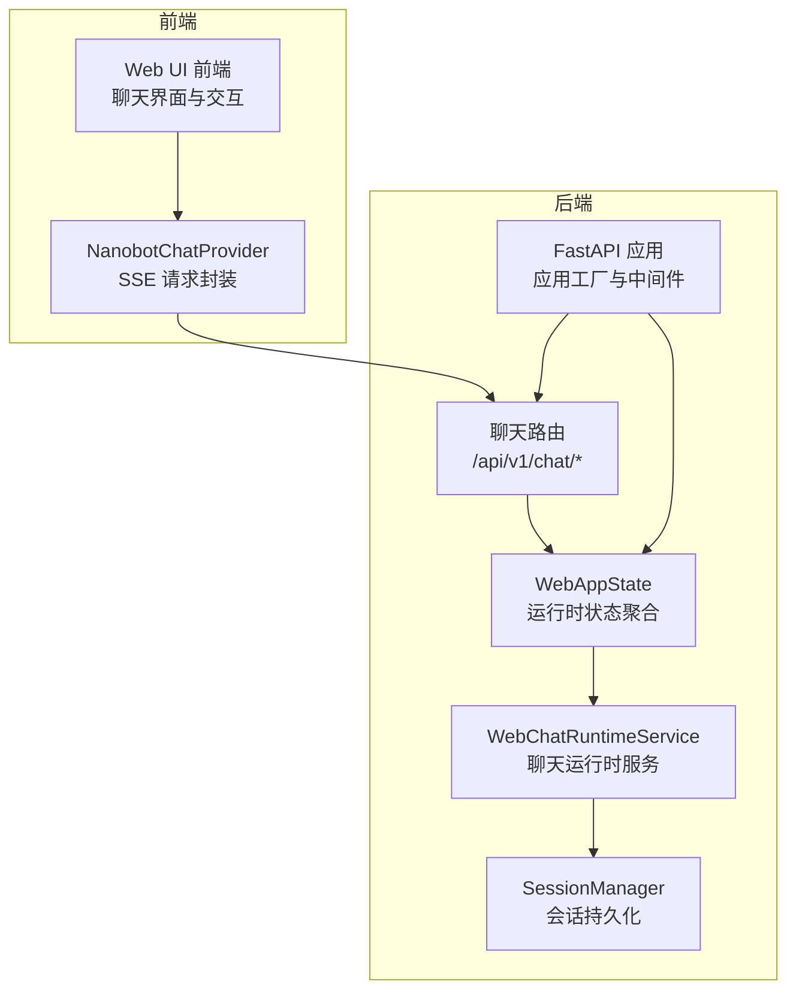
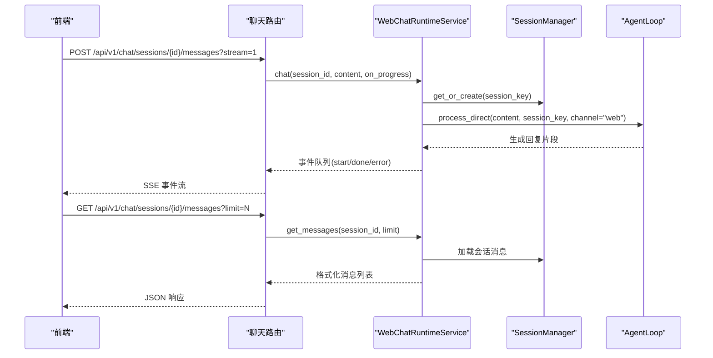
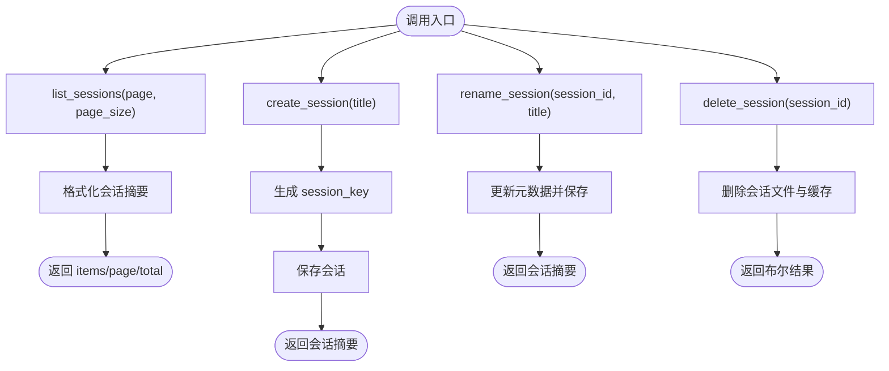
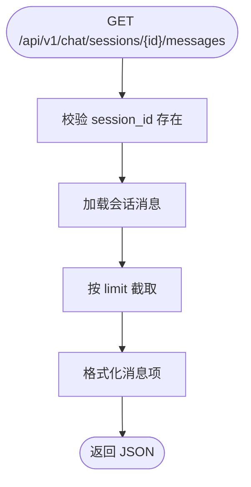
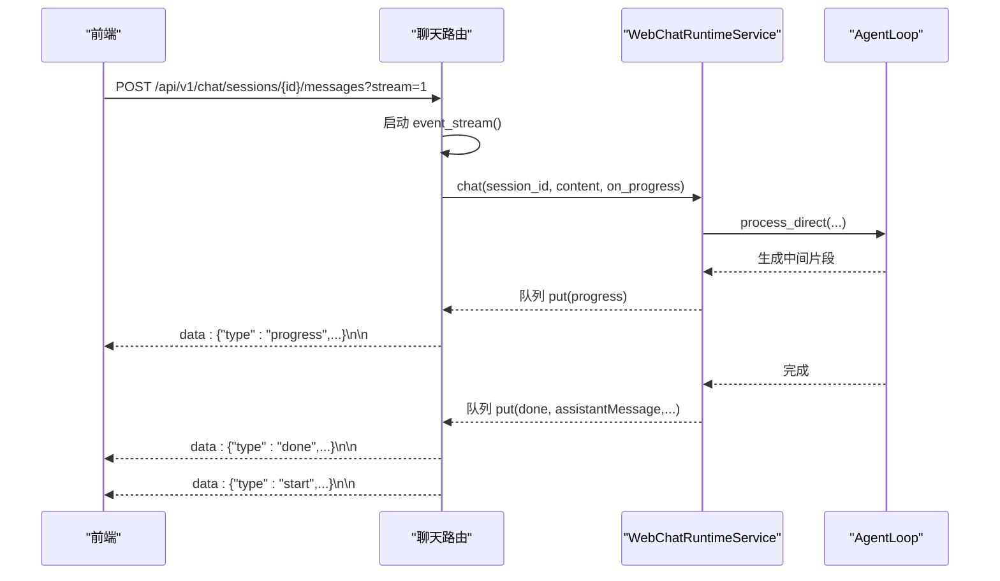
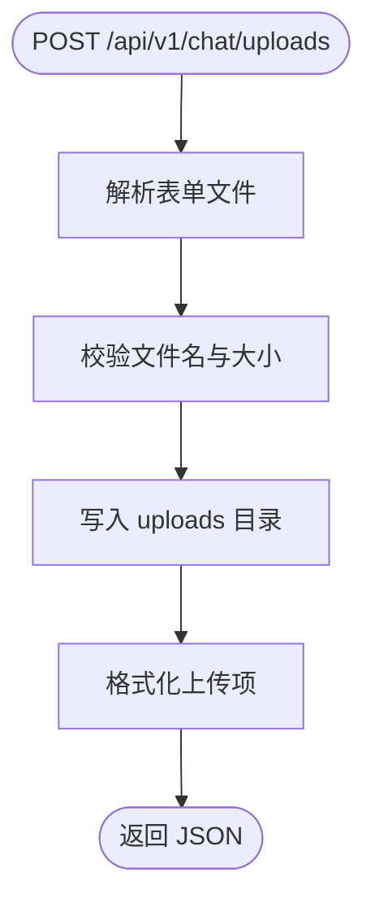
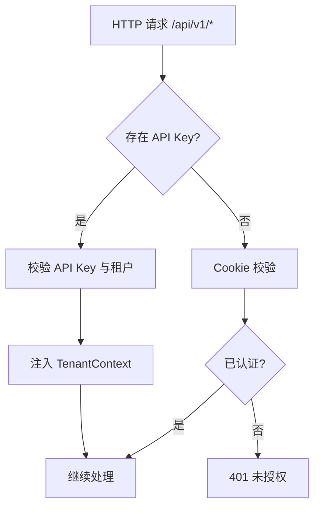
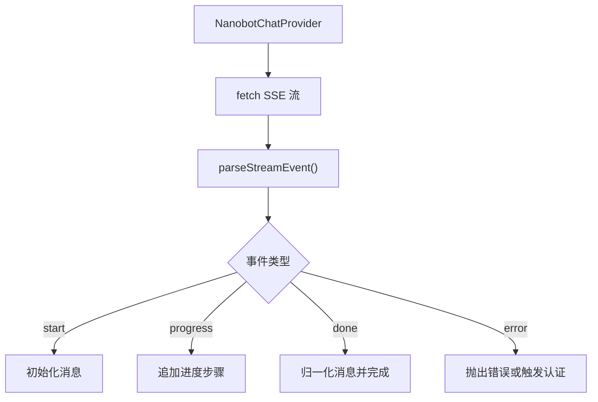
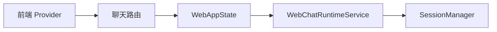

# 聊天通信 API

<cite>
**本文引用的文件**
- [nanobot/web/routers/chat.py](file://nanobot/web/routers/chat.py)
- [nanobot/web/runtime_services/chat.py](file://nanobot/web/runtime_services/chat.py)
- [nanobot/web/runtime.py](file://nanobot/web/runtime.py)
- [nanobot/session/manager.py](file://nanobot/session/manager.py)
- [nanobot/web/http.py](file://nanobot/web/http.py)
- [nanobot/web/app.py](file://nanobot/web/app.py)
- [nanobot/web/auth.py](file://nanobot/web/auth.py)
- [nanobot/web/tenant_context.py](file://nanobot/web/tenant_context.py)
- [web-ui/src/chat/NanobotChatProvider.ts](file://web-ui/src/chat/NanobotChatProvider.ts)
- [web-ui/src/chat/chatMessageUtils.ts](file://web-ui/src/chat/chatMessageUtils.ts)
- [SECURITY.md](file://SECURITY.md)
</cite>

## 目录
1. [简介](#简介)
2. [项目结构](#项目结构)
3. [核心组件](#核心组件)
4. [架构总览](#架构总览)
5. [详细组件分析](#详细组件分析)
6. [依赖分析](#依赖分析)
7. [性能考量](#性能考量)
8. [故障排查指南](#故障排查指南)
9. [结论](#结论)
10. [附录](#附录)

## 简介
本文件为 nanobot 聊天通信 API 的详细技术文档，覆盖以下内容：
- 实时聊天消息的发送、接收与历史记录查询接口
- 会话管理（创建、重命名、删除、分页列表）
- 消息转发与聊天上下文维护
- WebSocket 连接与事件处理机制（基于服务端事件 SSE）
- 聊天室创建、成员管理与消息历史查询的完整示例
- 认证与安全考虑（Cookie 会话、API Key 多租户、前端交互）

## 项目结构
聊天通信 API 的后端由 FastAPI 提供，路由集中在聊天模块；运行时服务封装了会话、上传、工作区信息等能力；前端通过服务端事件（SSE）实现流式响应。

**图表来源**
- [nanobot/web/app.py:70-280](file://nanobot/web/app.py#L70-L280)
- [nanobot/web/routers/chat.py:1-187](file://nanobot/web/routers/chat.py#L1-L187)
- [nanobot/web/runtime.py:72-301](file://nanobot/web/runtime.py#L72-L301)
- [nanobot/web/runtime_services/chat.py:18-440](file://nanobot/web/runtime_services/chat.py#L18-L440)
- [nanobot/session/manager.py:73-252](file://nanobot/session/manager.py#L73-L252)
- [web-ui/src/chat/NanobotChatProvider.ts:18-172](file://web-ui/src/chat/NanobotChatProvider.ts#L18-L172)

**章节来源**
- [nanobot/web/app.py:70-280](file://nanobot/web/app.py#L70-L280)
- [nanobot/web/routers/chat.py:1-187](file://nanobot/web/routers/chat.py#L1-L187)
- [nanobot/web/runtime.py:72-301](file://nanobot/web/runtime.py#L72-L301)
- [nanobot/web/runtime_services/chat.py:18-440](file://nanobot/web/runtime_services/chat.py#L18-L440)
- [nanobot/session/manager.py:73-252](file://nanobot/session/manager.py#L73-L252)
- [web-ui/src/chat/NanobotChatProvider.ts:18-172](file://web-ui/src/chat/NanobotChatProvider.ts#L18-L172)

## 核心组件
- 路由层：定义 /api/v1/chat 下的所有端点，负责参数校验、错误处理与响应封装。
- 运行时服务：封装会话管理、消息格式化、上传处理、工作区信息等。
- 会话管理器：负责会话的加载、保存、清理与列表展示。
- 前端 Provider：封装 SSE 流式请求、进度事件解析与消息归一化。

**章节来源**
- [nanobot/web/routers/chat.py:19-187](file://nanobot/web/routers/chat.py#L19-L187)
- [nanobot/web/runtime_services/chat.py:18-440](file://nanobot/web/runtime_services/chat.py#L18-L440)
- [nanobot/session/manager.py:16-252](file://nanobot/session/manager.py#L16-L252)
- [web-ui/src/chat/NanobotChatProvider.ts:96-172](file://web-ui/src/chat/NanobotChatProvider.ts#L96-L172)

## 架构总览
后端采用 FastAPI + 自定义运行时状态 WebAppState 聚合各子服务。聊天路由将请求委派给运行时服务，后者通过 SessionManager 持久化消息，并通过 AgentLoop 处理消息生成最终回复。前端通过 SSE 接收 start/done/error 等事件，逐步渲染消息与进度。

**图表来源**
- [nanobot/web/routers/chat.py:105-187](file://nanobot/web/routers/chat.py#L105-L187)
- [nanobot/web/runtime_services/chat.py:418-440](file://nanobot/web/runtime_services/chat.py#L418-L440)
- [nanobot/session/manager.py:96-124](file://nanobot/session/manager.py#L96-L124)
- [web-ui/src/chat/NanobotChatProvider.ts:20-79](file://web-ui/src/chat/NanobotChatProvider.ts#L20-L79)

**章节来源**
- [nanobot/web/routers/chat.py:105-187](file://nanobot/web/routers/chat.py#L105-L187)
- [nanobot/web/runtime_services/chat.py:418-440](file://nanobot/web/runtime_services/chat.py#L418-L440)
- [nanobot/session/manager.py:96-124](file://nanobot/session/manager.py#L96-L124)
- [web-ui/src/chat/NanobotChatProvider.ts:20-79](file://web-ui/src/chat/NanobotChatProvider.ts#L20-L79)

## 详细组件分析

### 1) 会话管理
- 列表与分页：支持分页参数，返回会话摘要（含标题、时间戳、消息数）。
- 创建：自动生成 session_id，设置默认标题，保存到 SessionManager。
- 重命名：更新会话元数据并持久化。
- 删除：按 key 删除会话文件与缓存。
- 最近助手消息：用于快速定位最新 AI 回复。

**图表来源**
- [nanobot/web/runtime_services/chat.py:85-134](file://nanobot/web/runtime_services/chat.py#L85-L134)
- [nanobot/web/runtime_services/chat.py:101-130](file://nanobot/web/runtime_services/chat.py#L101-L130)
- [nanobot/web/runtime_services/chat.py:132-134](file://nanobot/web/runtime_services/chat.py#L132-L134)

**章节来源**
- [nanobot/web/runtime_services/chat.py:85-134](file://nanobot/web/runtime_services/chat.py#L85-L134)
- [nanobot/web/runtime_services/chat.py:101-130](file://nanobot/web/runtime_services/chat.py#L101-L130)
- [nanobot/web/runtime_services/chat.py:132-134](file://nanobot/web/runtime_services/chat.py#L132-L134)

### 2) 消息历史查询
- 支持 limit 参数限制返回条数，默认 200，上限 500。
- 返回消息列表，包含角色、内容、时间戳、工具调用等字段。
- 使用 SessionManager 获取会话并切片输出。

**图表来源**
- [nanobot/web/routers/chat.py:92-102](file://nanobot/web/routers/chat.py#L92-L102)
- [nanobot/web/runtime_services/chat.py:135-142](file://nanobot/web/runtime_services/chat.py#L135-L142)
- [nanobot/session/manager.py:131-167](file://nanobot/session/manager.py#L131-L167)

**章节来源**
- [nanobot/web/routers/chat.py:92-102](file://nanobot/web/routers/chat.py#L92-L102)
- [nanobot/web/runtime_services/chat.py:135-142](file://nanobot/web/runtime_services/chat.py#L135-L142)
- [nanobot/session/manager.py:131-167](file://nanobot/session/manager.py#L131-L167)

### 3) 实时消息发送与流式响应（SSE）
- 支持 stream 查询参数开启流式模式。
- 后端通过 asyncio.Queue 维护事件队列，推送 start/done/error 事件。
- 前端使用 SSE 解析 start/done/progress 事件，逐步渲染消息与进度步骤。

**图表来源**
- [nanobot/web/routers/chat.py:118-169](file://nanobot/web/routers/chat.py#L118-L169)
- [nanobot/web/runtime_services/chat.py:418-439](file://nanobot/web/runtime_services/chat.py#L418-L439)
- [web-ui/src/chat/NanobotChatProvider.ts:81-94](file://web-ui/src/chat/NanobotChatProvider.ts#L81-L94)

**章节来源**
- [nanobot/web/routers/chat.py:118-169](file://nanobot/web/routers/chat.py#L118-L169)
- [nanobot/web/runtime_services/chat.py:418-439](file://nanobot/web/runtime_services/chat.py#L418-L439)
- [web-ui/src/chat/NanobotChatProvider.ts:81-94](file://web-ui/src/chat/NanobotChatProvider.ts#L81-L94)

### 4) 文件上传与工作区信息
- 上传接口接收 multipart/form-data，校验文件存在性与大小（≤10MB），保存至工作区 uploads 目录。
- 工作区信息包含运行时配置、启用通道、最近上传与工具活动等。

**图表来源**
- [nanobot/web/routers/chat.py:31-42](file://nanobot/web/routers/chat.py#L31-L42)
- [nanobot/web/runtime_services/chat.py:152-166](file://nanobot/web/runtime_services/chat.py#L152-L166)

**章节来源**
- [nanobot/web/routers/chat.py:31-42](file://nanobot/web/routers/chat.py#L31-L42)
- [nanobot/web/runtime_services/chat.py:152-166](file://nanobot/web/runtime_services/chat.py#L152-L166)

### 5) 认证与多租户
- Cookie 会话：后端强制对 /api/v1/ 路径进行 Cookie 校验，未登录返回 401。
- API Key 多租户：支持 Authorization: Bearer 或 X-API-Key，验证通过后注入 TenantContext。
- 前端登录：通过 /api/v1/auth/* 完成引导初始化与登录，成功后写入会话 Cookie。

**图表来源**
- [nanobot/web/app.py:225-246](file://nanobot/web/app.py#L225-L246)
- [nanobot/web/tenant_context.py:26-92](file://nanobot/web/tenant_context.py#L26-L92)
- [nanobot/web/auth.py:129-196](file://nanobot/web/auth.py#L129-L196)

**章节来源**
- [nanobot/web/app.py:225-246](file://nanobot/web/app.py#L225-L246)
- [nanobot/web/tenant_context.py:26-92](file://nanobot/web/tenant_context.py#L26-L92)
- [nanobot/web/auth.py:129-196](file://nanobot/web/auth.py#L129-L196)

### 6) 前端交互与事件处理
- 前端通过 NanobotChatProvider 封装 SSE 请求，自动携带 Cookie 并解析事件。
- 事件类型：
  - start：开始事件，包含 sessionId
  - progress：进度事件，包含内容与 toolHint 标记
  - done：完成事件，包含 assistantMessage 与最终内容
  - error：异常事件，包含错误信息
- 前端工具函数负责解析附加文件与用户问题块，合并进度步骤。

**图表来源**
- [web-ui/src/chat/NanobotChatProvider.ts:20-79](file://web-ui/src/chat/NanobotChatProvider.ts#L20-L79)
- [web-ui/src/chat/NanobotChatProvider.ts:141-166](file://web-ui/src/chat/NanobotChatProvider.ts#L141-L166)
- [web-ui/src/chat/chatMessageUtils.ts:106-116](file://web-ui/src/chat/chatMessageUtils.ts#L106-L116)

**章节来源**
- [web-ui/src/chat/NanobotChatProvider.ts:20-79](file://web-ui/src/chat/NanobotChatProvider.ts#L20-L79)
- [web-ui/src/chat/NanobotChatProvider.ts:141-166](file://web-ui/src/chat/NanobotChatProvider.ts#L141-L166)
- [web-ui/src/chat/chatMessageUtils.ts:106-116](file://web-ui/src/chat/chatMessageUtils.ts#L106-L116)

## 依赖分析
- 路由依赖运行时服务：所有聊天端点通过 request.app.state.web 调用运行时方法。
- 运行时服务依赖 SessionManager：会话读写、列表与元数据更新均通过其完成。
- 前端依赖路由：SSE 请求指向 /api/v1/chat/sessions/stream 或带 sessionId 的消息端点。

**图表来源**
- [nanobot/web/routers/chat.py:14-16](file://nanobot/web/routers/chat.py#L14-L16)
- [nanobot/web/runtime.py:99-105](file://nanobot/web/runtime.py#L99-L105)
- [nanobot/web/runtime_services/chat.py:21-23](file://nanobot/web/runtime_services/chat.py#L21-L23)
- [nanobot/session/manager.py:80-84](file://nanobot/session/manager.py#L80-L84)
- [web-ui/src/chat/NanobotChatProvider.ts:96-104](file://web-ui/src/chat/NanobotChatProvider.ts#L96-L104)

**章节来源**
- [nanobot/web/routers/chat.py:14-16](file://nanobot/web/routers/chat.py#L14-L16)
- [nanobot/web/runtime.py:99-105](file://nanobot/web/runtime.py#L99-L105)
- [nanobot/web/runtime_services/chat.py:21-23](file://nanobot/web/runtime_services/chat.py#L21-L23)
- [nanobot/session/manager.py:80-84](file://nanobot/session/manager.py#L80-L84)
- [web-ui/src/chat/NanobotChatProvider.ts:96-104](file://web-ui/src/chat/NanobotChatProvider.ts#L96-L104)

## 性能考量
- 会话消息切片：get_history 仅返回未归并的历史消息，避免重复计算。
- 事件驱动流式：SSE 逐段推送，降低前端等待时间。
- 上传限制：文件大小限制与目录隔离，防止磁盘膨胀。
- 并发控制：流式任务通过 asyncio 任务与取消机制管理生命周期。

[本节为通用指导，无需特定文件引用]

## 故障排查指南
- 401 未授权：检查 Cookie 是否正确携带，或 API Key 是否有效。
- 404 会话不存在：确认 session_id 是否正确，或先创建会话。
- 400 参数错误：检查 content 是否为空，或上传文件是否合规。
- SSE 异常：关注 error 事件内容，必要时刷新页面重试。
- 上传失败：确认文件大小与类型限制，检查 uploads 目录权限。

**章节来源**
- [nanobot/web/routers/chat.py:112-114](file://nanobot/web/routers/chat.py#L112-L114)
- [nanobot/web/routers/chat.py:137-141](file://nanobot/web/routers/chat.py#L137-L141)
- [nanobot/web/http.py:31-40](file://nanobot/web/http.py#L31-L40)
- [web-ui/src/chat/NanobotChatProvider.ts:47-72](file://web-ui/src/chat/NanobotChatProvider.ts#L47-L72)

## 结论
该聊天通信 API 以清晰的路由与运行时服务分离为核心，结合 SSE 实现流畅的实时交互体验。会话管理与消息持久化确保上下文可追溯，认证与多租户策略满足生产部署的安全需求。前端通过统一的 Provider 封装事件解析与消息归一化，简化了集成复杂度。

[本节为总结性内容，无需特定文件引用]

## 附录

### A. 端点一览与示例

- 会话管理
  - GET /api/v1/chat/sessions?page=1&pageSize=20
  - POST /api/v1/chat/sessions（可选 title）
  - PATCH /api/v1/chat/sessions/{session_id}（必须提供 title）
  - DELETE /api/v1/chat/sessions/{session_id}

- 消息操作
  - GET /api/v1/chat/sessions/{session_id}/messages?limit=200
  - POST /api/v1/chat/sessions/{session_id}/messages?stream=false
  - POST /api/v1/chat/sessions/{session_id}/messages?stream=true（SSE）

- 上传与工作区
  - POST /api/v1/chat/uploads（multipart/form-data）
  - GET /api/v1/chat/workspace

- 认证
  - POST /api/v1/auth/bootstrap（首次引导）
  - POST /api/v1/auth/login
  - POST /api/v1/auth/logout
  - GET /api/v1/auth/status

**章节来源**
- [nanobot/web/routers/chat.py:45-187](file://nanobot/web/routers/chat.py#L45-L187)
- [nanobot/web/auth.py:87-196](file://nanobot/web/auth.py#L87-L196)

### B. WebSocket 连接与事件处理机制
- 当前实现基于服务端事件（SSE），非传统 WebSocket。
- 事件类型：
  - start：标识流式开始，包含 sessionId
  - progress：阶段性进度，包含内容与 toolHint
  - done：最终完成，包含 assistantMessage 与内容
  - error：异常，包含错误信息

**章节来源**
- [nanobot/web/routers/chat.py:118-169](file://nanobot/web/routers/chat.py#L118-L169)
- [web-ui/src/chat/NanobotChatProvider.ts:81-94](file://web-ui/src/chat/NanobotChatProvider.ts#L81-L94)

### C. 安全与合规建议
- 严格限制上传文件大小与类型，定期清理 uploads 目录。
- 生产环境启用 HTTPS 与强 Cookie 属性（secure、httponly、sameSite）。
- 多租户场景下校验 X-Tenant-Id 与 API Key 所属租户一致性。
- 参考安全策略文档中的最佳实践与已知限制。

**章节来源**
- [SECURITY.md:1-264](file://SECURITY.md#L1-L264)
- [nanobot/web/app.py:225-246](file://nanobot/web/app.py#L225-L246)
- [nanobot/web/tenant_context.py:74-81](file://nanobot/web/tenant_context.py#L74-L81)