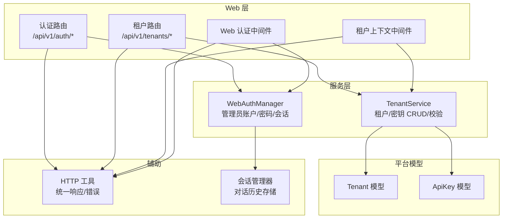
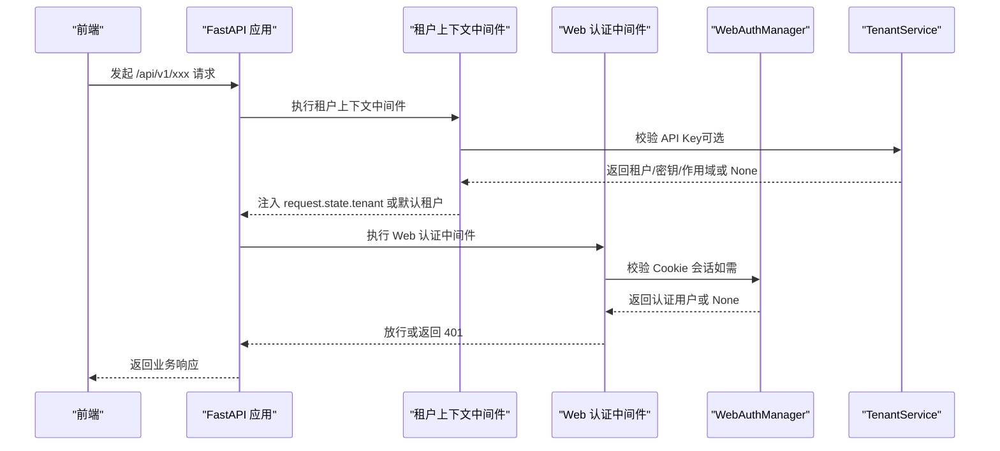
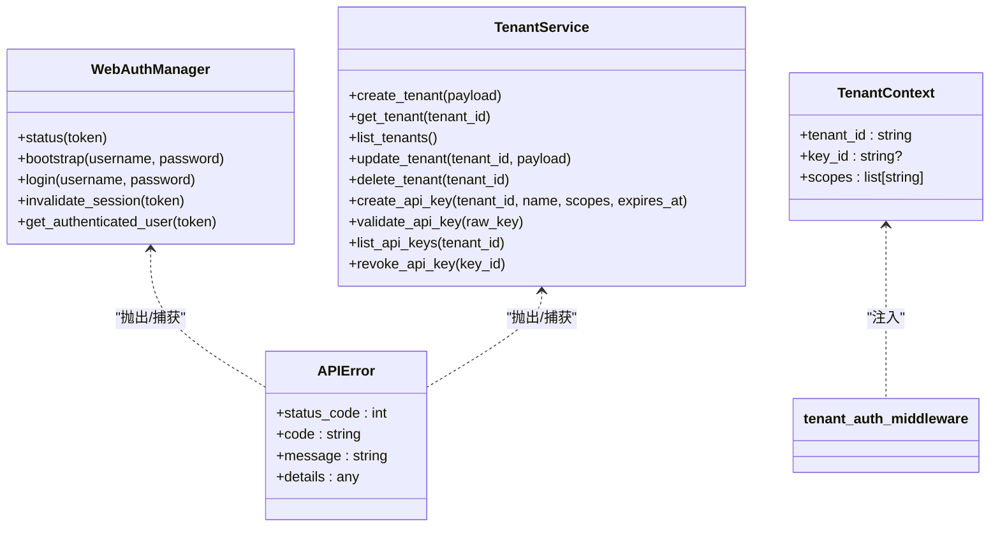

# 认证授权 API

<cite>
**本文引用的文件**
- [nanobot/web/routers/auth.py](file://nanobot/web/routers/auth.py)
- [nanobot/web/auth.py](file://nanobot/web/auth.py)
- [nanobot/web/app.py](file://nanobot/web/app.py)
- [nanobot/web/tenant_context.py](file://nanobot/web/tenant_context.py)
- [nanobot/web/routers/tenants.py](file://nanobot/web/routers/tenants.py)
- [nanobot/platform/tenants/models.py](file://nanobot/platform/tenants/models.py)
- [nanobot/platform/tenants/service.py](file://nanobot/platform/tenants/service.py)
- [nanobot/web/http.py](file://nanobot/web/http.py)
- [nanobot/session/manager.py](file://nanobot/session/manager.py)
</cite>

## 目录
1. [简介](#简介)
2. [项目结构](#项目结构)
3. [核心组件](#核心组件)
4. [架构总览](#架构总览)
5. [详细组件分析](#详细组件分析)
6. [依赖关系分析](#依赖关系分析)
7. [性能考虑](#性能考虑)
8. [故障排除指南](#故障排除指南)
9. [结论](#结论)

## 简介
本文件为 nanobot 平台的认证授权 API 提供全面的技术文档，覆盖以下主题：
- 用户登录、注册（引导）、权限验证与会话管理
- 多租户认证、API 密钥与作用域控制
- 会话 Cookie 安全策略与过期机制
- 前端交互流程与错误处理
- 密码策略与安全防护措施

该系统采用“Cookie 会话 + API Key”的复合认证模式：对 Web UI 使用 Cookie 会话；对 API 请求支持 API Key 认证，并在必要时进行租户隔离与作用域校验。

## 项目结构
认证授权相关的核心模块分布如下：
- Web 路由层：认证路由与多租户路由
- 认证服务层：WebAuthManager（管理管理员账户、密码哈希、会话）
- 中间件层：租户上下文中间件与 Web 认证中间件
- 平台模型与服务：租户与 API Key 的数据模型与服务实现
- HTTP 辅助：统一响应格式与错误封装

图表来源
- [nanobot/web/routers/auth.py:1-220](file://nanobot/web/routers/auth.py#L1-L220)
- [nanobot/web/routers/tenants.py:1-119](file://nanobot/web/routers/tenants.py#L1-L119)
- [nanobot/web/auth.py:1-414](file://nanobot/web/auth.py#L1-L414)
- [nanobot/web/tenant_context.py:1-108](file://nanobot/web/tenant_context.py#L1-L108)
- [nanobot/platform/tenants/service.py:1-191](file://nanobot/platform/tenants/service.py#L1-L191)
- [nanobot/platform/tenants/models.py:1-100](file://nanobot/platform/tenants/models.py#L1-L100)
- [nanobot/web/http.py:1-40](file://nanobot/web/http.py#L1-L40)
- [nanobot/session/manager.py:1-252](file://nanobot/session/manager.py#L1-L252)

章节来源
- [nanobot/web/routers/auth.py:1-220](file://nanobot/web/routers/auth.py#L1-L220)
- [nanobot/web/routers/tenants.py:1-119](file://nanobot/web/routers/tenants.py#L1-L119)
- [nanobot/web/auth.py:1-414](file://nanobot/web/auth.py#L1-L414)
- [nanobot/web/tenant_context.py:1-108](file://nanobot/web/tenant_context.py#L1-L108)
- [nanobot/platform/tenants/service.py:1-191](file://nanobot/platform/tenants/service.py#L1-L191)
- [nanobot/platform/tenants/models.py:1-100](file://nanobot/platform/tenants/models.py#L1-L100)
- [nanobot/web/http.py:1-40](file://nanobot/web/http.py#L1-L40)
- [nanobot/session/manager.py:1-252](file://nanobot/session/manager.py#L1-L252)

## 核心组件
- 认证路由（/api/v1/auth/*）：提供引导初始化、登录、登出、状态查询、个人资料与头像管理等接口。
- 租户路由（/api/v1/tenants/*）：提供租户 CRUD 与 API Key 管理接口。
- WebAuthManager：负责管理员账户的引导初始化、登录校验、密码轮换、会话创建与失效、头像上传与清理。
- 租户上下文中间件：优先使用 API Key 进行认证，若存在则注入租户上下文；否则回退到默认租户。
- Web 认证中间件：对非 /api/v1/auth/* 的 API 请求进行 Cookie 会话校验。
- TenantService：提供租户与 API Key 的创建、查询、更新、删除与密钥校验逻辑。
- HTTP 工具：统一响应体结构与错误封装，便于前端解析。

章节来源
- [nanobot/web/routers/auth.py:87-220](file://nanobot/web/routers/auth.py#L87-L220)
- [nanobot/web/routers/tenants.py:24-119](file://nanobot/web/routers/tenants.py#L24-L119)
- [nanobot/web/auth.py:129-414](file://nanobot/web/auth.py#L129-L414)
- [nanobot/web/tenant_context.py:26-108](file://nanobot/web/tenant_context.py#L26-L108)
- [nanobot/platform/tenants/service.py:43-191](file://nanobot/platform/tenants/service.py#L43-L191)
- [nanobot/web/http.py:11-40](file://nanobot/web/http.py#L11-L40)

## 架构总览
系统采用“路由层 + 服务层 + 中间件层”的分层设计，认证与多租户能力通过中间件与服务类解耦，便于扩展与维护。

图表来源
- [nanobot/web/app.py:225-243](file://nanobot/web/app.py#L225-L243)
- [nanobot/web/tenant_context.py:26-108](file://nanobot/web/tenant_context.py#L26-L108)
- [nanobot/web/auth.py:317-346](file://nanobot/web/auth.py#L317-L346)
- [nanobot/platform/tenants/service.py:160-179](file://nanobot/platform/tenants/service.py#L160-L179)

## 详细组件分析

### 认证路由与会话管理
- 接口概览
  - GET /api/v1/auth/status：查询当前认证状态（是否初始化、是否已登录、用户名）
  - POST /api/v1/auth/bootstrap：首次引导创建管理员账户（仅当未初始化时可用）
  - POST /api/v1/auth/login：登录并创建会话，返回状态与 Cookie
  - POST /api/v1/auth/logout：登出并清除会话与 Cookie
  - GET /api/v1/profile：获取个人资料
  - PUT /api/v1/profile：更新用户名/显示名/邮箱（用户名变更会触发会话失效并重新签发）
  - POST /api/v1/profile/password：修改密码（旧会话失效并重新签发）
  - GET/POST/DELETE /api/v1/profile/avatar：头像上传/获取/删除

- 会话与 Cookie
  - 会话令牌为内存中生成的随机字符串，有效期为固定秒数
  - 登录成功后设置 HttpOnly、SameSite=Lax、Secure（HTTPS）的会话 Cookie
  - 登出时清除 Cookie 并使会话失效

- 错误处理
  - 引导重复初始化、登录未初始化、凭据无效、参数校验失败等均返回结构化错误

章节来源
- [nanobot/web/routers/auth.py:87-220](file://nanobot/web/routers/auth.py#L87-L220)
- [nanobot/web/auth.py:144-346](file://nanobot/web/auth.py#L144-L346)
- [nanobot/web/http.py:31-40](file://nanobot/web/http.py#L31-L40)

### 多租户认证与 API Key 管理
- 租户上下文中间件
  - 仅对 /api/v1/ 路径生效
  - 优先从 Authorization: Bearer 或 X-API-Key 提取 API Key
  - 校验通过后将租户 ID、密钥 ID、作用域注入 request.state.tenant
  - 若请求头 X-Tenant-Id 与密钥所属租户不一致，返回 403
  - 未携带 API Key 时，默认租户上下文为 "default"

- 租户与 API Key 路由
  - 租户 CRUD：GET/POST/PUT/DELETE /api/v1/tenants
  - 租户 API Key 列表：GET /api/v1/tenants/{tenant_id}/api-keys
  - 创建 API Key：POST /api/v1/tenants/{tenant_id}/api-keys（支持设置名称、作用域、过期时间）
  - 撤销 API Key：DELETE /api/v1/api-keys/{key_id}

- 数据模型
  - Tenant：包含租户 ID、名称、状态、套餐、设置、时间戳
  - ApiKey：包含密钥 ID、租户 ID、密钥哈希、前缀、名称、作用域、启用状态、过期时间、时间戳

- 服务逻辑
  - TenantService 负责租户与 API Key 的创建、查询、更新、删除、密钥校验与最后使用时间更新
  - API Key 采用固定前缀与哈希存储，支持过期时间校验与作用域列表

章节来源
- [nanobot/web/tenant_context.py:26-108](file://nanobot/web/tenant_context.py#L26-L108)
- [nanobot/web/routers/tenants.py:24-119](file://nanobot/web/routers/tenants.py#L24-L119)
- [nanobot/platform/tenants/models.py:15-100](file://nanobot/platform/tenants/models.py#L15-L100)
- [nanobot/platform/tenants/service.py:43-191](file://nanobot/platform/tenants/service.py#L43-L191)

### Web 认证中间件与权限校验
- Web 认证中间件
  - 对 /api/v1/ 路径进行拦截
  - 排除 /api/v1/auth/* 与 /api/v1/health
  - 若已通过租户上下文中间件注入了 API Key，则跳过 Cookie 校验
  - 否则校验 Cookie 中的会话令牌是否有效
  - 未认证返回 401

- 权限与作用域
  - 当前 Web 认证中间件不强制作用域校验，仅进行会话有效性检查
  - API Key 作用域在租户上下文中间件中返回，可在后续路由中按需使用

章节来源
- [nanobot/web/app.py:225-243](file://nanobot/web/app.py#L225-L243)
- [nanobot/web/tenant_context.py:72-87](file://nanobot/web/tenant_context.py#L72-L87)

### 会话管理与安全策略
- 会话存储
  - 内存字典保存会话记录，包含令牌、用户名、创建与过期时间
  - 会话过期判断基于当前 UTC 时间与过期时间比较

- Cookie 安全属性
  - HttpOnly：防止 XSS
  - SameSite=Lax：缓解 CSRF
  - Secure：仅 HTTPS 下传输
  - Max-Age：固定会话有效期
  - Path=/：作用路径

- 密码策略与安全
  - PBKDF2-HMAC-SHA256，迭代次数为固定值
  - 用户名长度限制、不允许空白字符
  - 密码长度限制
  - 头像上传大小限制、媒体类型白名单、原子性写入与清理

- 会话失效与续期
  - 修改密码或用户名会清空所有会话并重新签发
  - 登出会清除 Cookie 并失效对应会话

章节来源
- [nanobot/web/auth.py:101-113](file://nanobot/web/auth.py#L101-L113)
- [nanobot/web/auth.py:19-27](file://nanobot/web/auth.py#L19-L27)
- [nanobot/web/auth.py:378-384](file://nanobot/web/auth.py#L378-L384)
- [nanobot/web/auth.py:257-301](file://nanobot/web/auth.py#L257-L301)

### 前端交互与错误处理
- 前端通过调用认证状态接口进行刷新，根据返回的 initialized/authenticated/username 控制 UI 行为
- 登录/引导失败、参数校验失败、认证失败等均以统一错误结构返回，前端据此展示提示

章节来源
- [nanobot/web/routers/auth.py:87-127](file://nanobot/web/routers/auth.py#L87-L127)
- [nanobot/web/http.py:11-25](file://nanobot/web/http.py#L11-L25)

## 依赖关系分析

图表来源
- [nanobot/web/auth.py:129-414](file://nanobot/web/auth.py#L129-L414)
- [nanobot/platform/tenants/service.py:43-191](file://nanobot/platform/tenants/service.py#L43-L191)
- [nanobot/web/tenant_context.py:11-18](file://nanobot/web/tenant_context.py#L11-L18)
- [nanobot/web/http.py:31-40](file://nanobot/web/http.py#L31-L40)

## 性能考虑
- 会话存储为内存字典，适合单实例部署；若需分布式部署，建议迁移到持久化存储（如 Redis）以支持横向扩展。
- PBKDF2 迭代次数较高，保证安全性的同时增加 CPU 开销；可根据硬件能力调整。
- 头像上传采用临时文件写入再替换的方式，避免部分写入导致的数据损坏。
- 中间件链路短、逻辑清晰，认证开销较低；建议在网关层统一做速率限制与 WAF 防护。

## 故障排除指南
- 401 未认证
  - 检查是否携带有效 Cookie 或 API Key
  - 确认 API Key 是否启用且未过期
  - 若使用 API Key，请确保 X-Tenant-Id 与密钥所属租户一致

- 409 已初始化/未初始化
  - 引导接口仅在未初始化时可用
  - 登录接口需先完成引导

- 400 参数校验失败
  - 用户名/密码/邮箱/头像等字段长度与格式不符合要求
  - 新密码与当前密码相同或确认不一致

- 404 头像不存在
  - 头像文件被清理或未上传

- 会话异常
  - 修改密码或用户名会导致旧会话失效并重新签发
  - 登出后会清除 Cookie 并失效对应会话

章节来源
- [nanobot/web/routers/auth.py:94-115](file://nanobot/web/routers/auth.py#L94-L115)
- [nanobot/web/routers/auth.py:164-175](file://nanobot/web/routers/auth.py#L164-L175)
- [nanobot/web/routers/auth.py:190-196](file://nanobot/web/routers/auth.py#L190-L196)
- [nanobot/web/tenant_context.py:64-81](file://nanobot/web/tenant_context.py#L64-L81)
- [nanobot/web/auth.py:228-255](file://nanobot/web/auth.py#L228-L255)

## 结论
本认证授权体系以“Cookie 会话 + API Key”为核心，结合多租户隔离与作用域控制，满足 Web UI 与 API 场景下的安全需求。通过明确的错误处理与安全策略（PBKDF2、HttpOnly Cookie、头像白名单等），系统在易用性与安全性之间取得平衡。建议在生产环境中配合网关层的速率限制、WAF 与审计日志进一步强化安全能力。