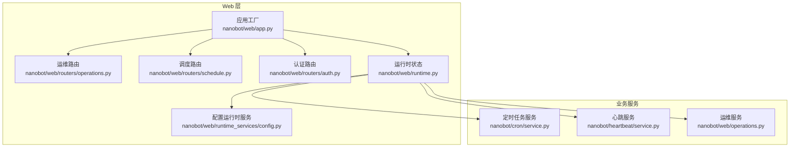
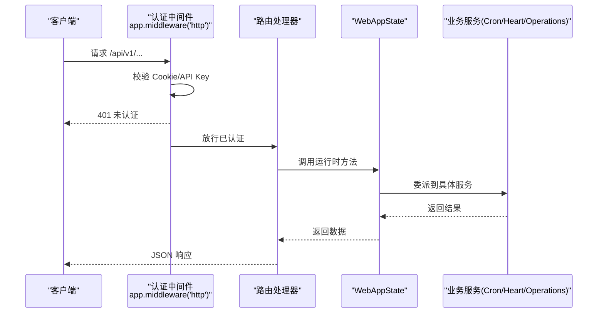
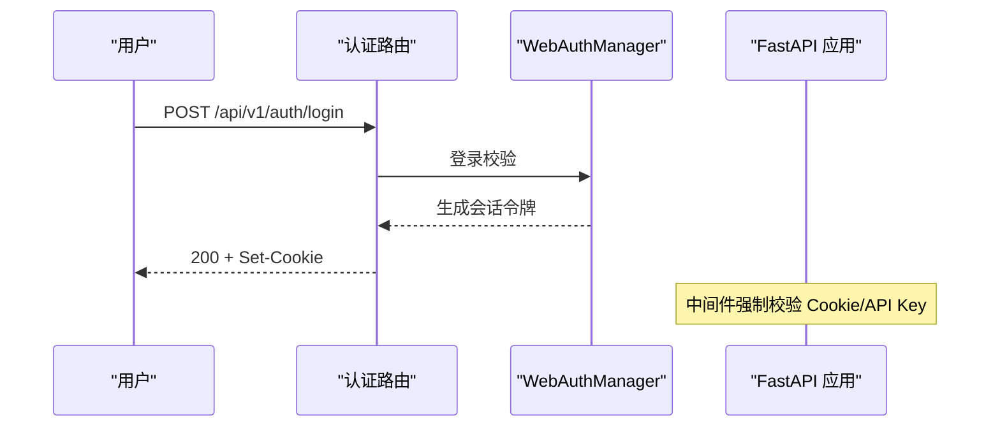
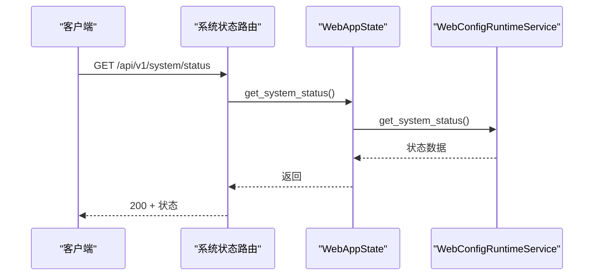
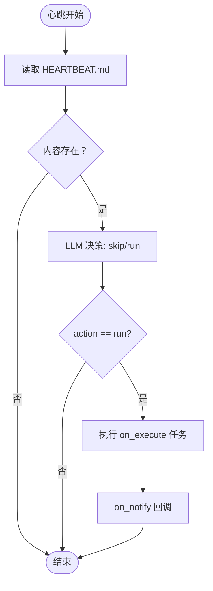
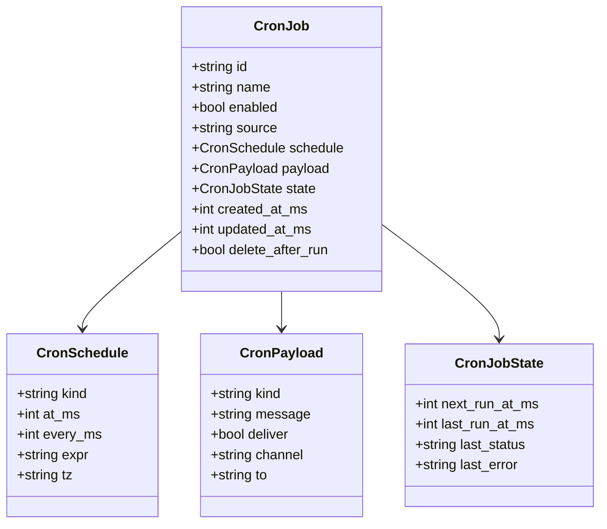
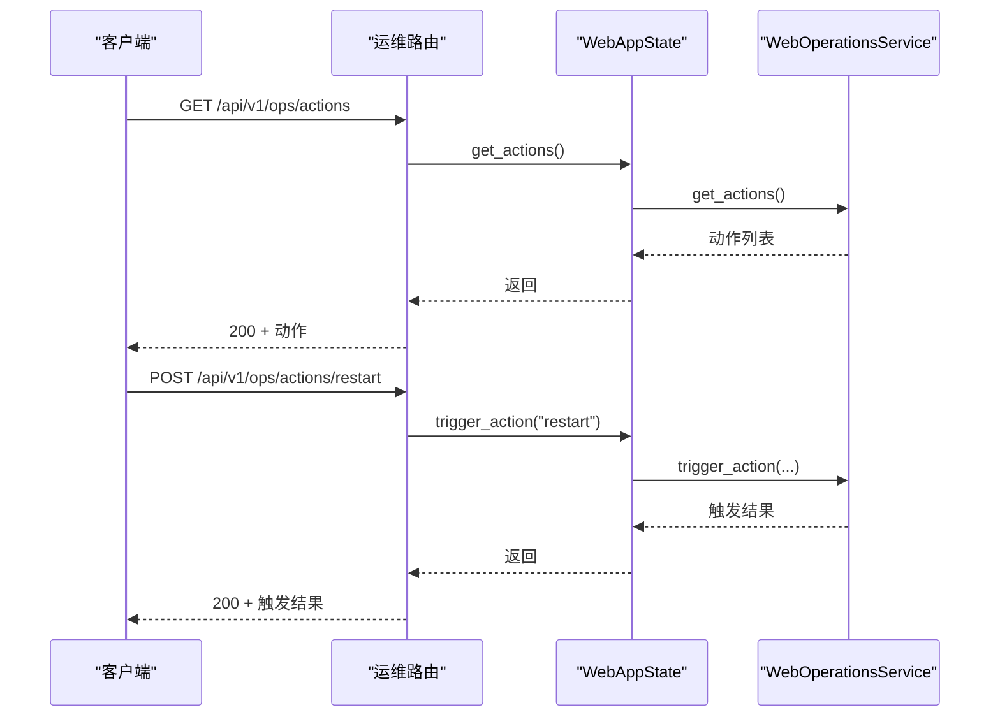
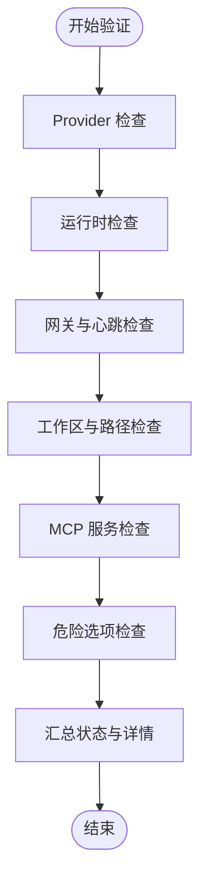
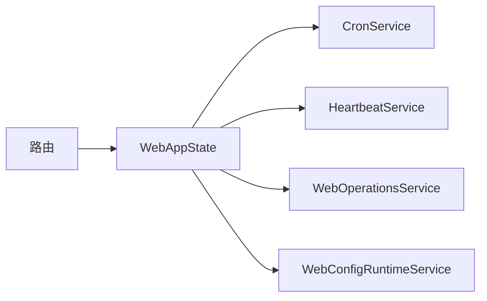

# 运维管理 API

<cite>
**本文引用的文件**
- [nanobot/web/app.py](file://nanobot/web/app.py)
- [nanobot/web/api.py](file://nanobot/web/api.py)
- [nanobot/web/routers/operations.py](file://nanobot/web/routers/operations.py)
- [nanobot/web/routers/schedule.py](file://nanobot/web/routers/schedule.py)
- [nanobot/web/routers/auth.py](file://nanobot/web/routers/auth.py)
- [nanobot/web/runtime.py](file://nanobot/web/runtime.py)
- [nanobot/web/runtime_services/config.py](file://nanobot/web/runtime_services/config.py)
- [nanobot/web/operations.py](file://nanobot/web/operations.py)
- [nanobot/cron/service.py](file://nanobot/cron/service.py)
- [nanobot/cron/types.py](file://nanobot/cron/types.py)
- [nanobot/heartbeat/service.py](file://nanobot/heartbeat/service.py)
- [nanobot/heartbeat/__init__.py](file://nanobot/heartbeat/__init__.py)
- [web-ui/src/api.ts](file://web-ui/src/api.ts)
- [web-ui/src/pages/SystemPage.tsx](file://web-ui/src/pages/SystemPage.tsx)
- [web-ui/src/pages/OperationsPage.tsx](file://web-ui/src/pages/OperationsPage.tsx)
- [web-ui/src/pages/ValidationPage.tsx](file://web-ui/src/pages/ValidationPage.tsx)
- [tests/test_web_api.py](file://tests/test_web_api.py)
</cite>

## 目录
1. [简介](#简介)
2. [项目结构](#项目结构)
3. [核心组件](#核心组件)
4. [架构总览](#架构总览)
5. [详细组件分析](#详细组件分析)
6. [依赖分析](#依赖分析)
7. [性能考虑](#性能考虑)
8. [故障排查指南](#故障排查指南)
9. [结论](#结论)
10. [附录](#附录)

## 简介
本文件面向运维工程师与平台管理员，系统化梳理 nanobot 的运维管理 API，覆盖以下主题：
- 系统健康检查、心跳监控与定时任务管理
- 系统状态查询、性能指标采集与故障告警
- 运维脚本执行、系统配置更新与日志管理
- 运维自动化、监控告警与系统维护的完整示例
- 安全访问控制与审计日志策略

目标是帮助读者快速定位接口、理解数据流与错误处理，并在生产环境中安全、稳定地使用这些能力。

## 项目结构
运维相关的后端入口位于 FastAPI 应用工厂，路由按功能域拆分，运行时状态集中于 WebAppState，定时任务与心跳分别由 CronService 与 HeartbeatService 提供。

**图表来源**
- [nanobot/web/app.py:70-280](file://nanobot/web/app.py#L70-L280)
- [nanobot/web/runtime.py:72-301](file://nanobot/web/runtime.py#L72-L301)
- [nanobot/cron/service.py:63-448](file://nanobot/cron/service.py#L63-L448)
- [nanobot/heartbeat/service.py:40-174](file://nanobot/heartbeat/service.py#L40-L174)
- [nanobot/web/operations.py:40-457](file://nanobot/web/operations.py#L40-L457)

**章节来源**
- [nanobot/web/app.py:70-280](file://nanobot/web/app.py#L70-L280)
- [nanobot/web/runtime.py:72-301](file://nanobot/web/runtime.py#L72-L301)

## 核心组件
- 应用工厂与中间件：负责路由注册、认证中间件、异常处理与静态资源服务。
- WebAppState：统一持有运行时服务（配置、会话、聊天、计划、工作区等），并启动 CronService 与心跳服务。
- 运维服务（WebOperationsService）：系统验证、日志读取、运维动作触发。
- 定时任务服务（CronService）：作业的增删改查、执行与状态持久化。
- 心跳服务（HeartbeatService）：周期性决策与执行，驱动任务执行与通知。

**章节来源**
- [nanobot/web/app.py:225-246](file://nanobot/web/app.py#L225-L246)
- [nanobot/web/runtime.py:72-114](file://nanobot/web/runtime.py#L72-L114)
- [nanobot/web/operations.py:40-457](file://nanobot/web/operations.py#L40-L457)
- [nanobot/cron/service.py:63-448](file://nanobot/cron/service.py#L63-L448)
- [nanobot/heartbeat/service.py:40-174](file://nanobot/heartbeat/service.py#L40-L174)

## 架构总览
运维管理 API 的请求流经认证中间件，进入对应路由，路由调用 WebAppState 中的服务方法，最终落到具体业务服务（CronService、HeartbeatService、WebOperationsService）。

**图表来源**
- [nanobot/web/app.py:225-246](file://nanobot/web/app.py#L225-L246)
- [nanobot/web/runtime.py:171-224](file://nanobot/web/runtime.py#L171-L224)

**章节来源**
- [nanobot/web/app.py:225-246](file://nanobot/web/app.py#L225-L246)
- [nanobot/web/runtime.py:171-224](file://nanobot/web/runtime.py#L171-L224)

## 详细组件分析

### 认证与会话（安全访问控制）
- 接口要点
  - /api/v1/auth/status：查询当前会话状态
  - /api/v1/auth/bootstrap：首次初始化管理员账户
  - /api/v1/auth/login：登录并下发会话 Cookie
  - /api/v1/auth/logout：登出并清除会话
  - /api/v1/profile：查询/更新个人资料与密码
- 安全特性
  - 会话 Cookie 使用 HttpOnly、SameSite=Lax、Secure（HTTPS）等策略
  - 非公开路由均受中间件保护，未认证返回 401
  - 异常统一转换为带错误码的 JSON 响应

**图表来源**
- [nanobot/web/routers/auth.py:87-127](file://nanobot/web/routers/auth.py#L87-L127)
- [nanobot/web/app.py:225-246](file://nanobot/web/app.py#L225-L246)

**章节来源**
- [nanobot/web/routers/auth.py:87-127](file://nanobot/web/routers/auth.py#L87-L127)
- [nanobot/web/app.py:225-246](file://nanobot/web/app.py#L225-L246)
- [tests/test_web_api.py:152-187](file://tests/test_web_api.py#L152-L187)

### 系统健康检查与状态查询
- 接口要点
  - /api/v1/system/status：系统总体状态（版本、运行时长、工作区、模型、通道、定时任务数等）
  - /api/v1/config：获取当前配置
  - /api/v1/config/meta：获取配置元信息（支持的 Provider 列表）
  - /api/v1/config：PUT 更新配置（触发运行时重建与通道重启）
- 数据来源
  - WebConfigRuntimeService.get_system_status 汇总 Web 进程、会话、通道、定时任务与环境信息
  - 更新配置后重建 AgentLoop、重启通道运行时

**图表来源**
- [nanobot/web/routers/operations.py:39-42](file://nanobot/web/routers/operations.py#L39-L42)
- [nanobot/web/runtime_services/config.py:157-189](file://nanobot/web/runtime_services/config.py#L157-L189)

**章节来源**
- [nanobot/web/routers/operations.py:16-23](file://nanobot/web/routers/operations.py#L16-L23)
- [nanobot/web/routers/operations.py:39-42](file://nanobot/web/routers/operations.py#L39-L42)
- [nanobot/web/runtime_services/config.py:157-189](file://nanobot/web/runtime_services/config.py#L157-L189)

### 性能指标采集与故障告警
- 指标来源
  - 系统状态中的统计字段：会话总数、Web 会话数、消息总数、启用通道数、定时任务数量
  - 环境信息：Python 版本、平台信息
- 告警建议
  - 通道启用数骤降可触发“通信链路告警”
  - 定时任务数归零可触发“计划任务告警”
  - 运行时长异常波动可触发“进程重启告警”

**章节来源**
- [nanobot/web/runtime_services/config.py:176-189](file://nanobot/web/runtime_services/config.py#L176-L189)

### 心跳监控（Heartbeat）
- 功能概述
  - 周期性读取 HEARTBEAT.md 并通过 LLM 工具调用决策是否执行任务
  - 可手动触发一次心跳
- 关键参数
  - 间隔（秒）、是否启用、回调 on_execute/on_notify
- 典型用途
  - 将运维脚本封装为自然语言任务，由心跳服务触发执行

**图表来源**
- [nanobot/heartbeat/service.py:108-174](file://nanobot/heartbeat/service.py#L108-L174)

**章节来源**
- [nanobot/heartbeat/service.py:40-174](file://nanobot/heartbeat/service.py#L40-L174)

### 定时任务管理（Cron）
- 路由与能力
  - 获取状态：/api/v1/cron/status
  - 查询作业：/api/v1/cron/jobs?includeDisabled=...
  - 新增作业：POST /api/v1/cron/jobs
  - 更新作业：PATCH /api/v1/cron/jobs/{job_id}
  - 删除作业：DELETE /api/v1/cron/jobs/{job_id}
  - 手动执行：POST /api/v1/cron/jobs/{job_id}/run
- 作业类型
  - at：一次性，指定时间戳
  - every：固定间隔
  - cron：标准表达式，支持时区
- 数据模型
  - CronJob、CronSchedule、CronPayload、CronStore

**图表来源**
- [nanobot/cron/types.py:7-61](file://nanobot/cron/types.py#L7-L61)

**章节来源**
- [nanobot/web/routers/schedule.py:40-95](file://nanobot/web/routers/schedule.py#L40-L95)
- [nanobot/cron/service.py:63-448](file://nanobot/cron/service.py#L63-L448)
- [nanobot/cron/types.py:7-61](file://nanobot/cron/types.py#L7-L61)

### 运维脚本执行与系统配置更新
- 运维脚本执行
  - 触发动作：POST /api/v1/ops/actions/{action_name}
  - 查询动作：GET /api/v1/ops/actions
  - 日志查看：GET /api/v1/ops/logs?lines=N
- 系统配置更新
  - GET /api/v1/config：获取配置
  - PUT /api/v1/config：更新配置（触发运行时重建与通道重启）
  - GET /api/v1/config/meta：获取 Provider 元信息

**图表来源**
- [nanobot/web/routers/operations.py:56-72](file://nanobot/web/routers/operations.py#L56-L72)
- [nanobot/web/operations.py:104-135](file://nanobot/web/operations.py#L104-L135)

**章节来源**
- [nanobot/web/routers/operations.py:56-72](file://nanobot/web/routers/operations.py#L56-L72)
- [nanobot/web/operations.py:19-32](file://nanobot/web/operations.py#L19-L32)
- [nanobot/web/operations.py:104-135](file://nanobot/web/operations.py#L104-L135)

### 日志管理
- 接口
  - GET /api/v1/ops/logs?lines=N（20-400 行）
- 行为
  - 读取实例日志目录，按更新时间倒序列出文件，截取尾部若干行
- 建议
  - 结合前端分页与实时滚动，实现运维面板的日志监控

**章节来源**
- [nanobot/web/routers/operations.py:50-54](file://nanobot/web/routers/operations.py#L50-L54)
- [nanobot/web/operations.py:83-102](file://nanobot/web/operations.py#L83-L102)

### 系统验证与健康度
- 接口
  - POST /api/v1/validation/run：运行系统验证（Provider、运行时、网关、路径、MCP 等）
- 输出
  - 汇总状态（ready/attention/blocked）、各项检查详情与危险选项提示

**图表来源**
- [nanobot/web/operations.py:55-81](file://nanobot/web/operations.py#L55-L81)
- [nanobot/web/operations.py:136-381](file://nanobot/web/operations.py#L136-L381)

**章节来源**
- [nanobot/web/routers/operations.py:44-47](file://nanobot/web/routers/operations.py#L44-L47)
- [nanobot/web/operations.py:55-81](file://nanobot/web/operations.py#L55-L81)

## 依赖分析
- 路由到运行时
  - 各路由处理器通过 request.app.state 访问 WebAppState，再委派到具体服务
- 运行时到服务
  - WebAppState 统一持有 CronService、HeartbeatService、WebOperationsService 等
- 错误处理
  - 自定义 APIError 在应用层转换为统一 JSON 响应

**图表来源**
- [nanobot/web/runtime.py:171-224](file://nanobot/web/runtime.py#L171-L224)
- [nanobot/web/app.py:205-223](file://nanobot/web/app.py#L205-L223)

**章节来源**
- [nanobot/web/runtime.py:171-224](file://nanobot/web/runtime.py#L171-L224)
- [nanobot/web/app.py:205-223](file://nanobot/web/app.py#L205-L223)

## 性能考虑
- 定时任务
  - CronService 使用异步事件循环与最小唤醒时间计算，避免轮询开销
  - 作业状态持久化采用增量保存，减少 IO 压力
- 心跳
  - 间隔可配置，建议根据任务复杂度与资源占用调整
- 日志
  - 日志读取支持行数上限与截断，避免大文件读取导致阻塞
- 配置更新
  - 更新后重建 AgentLoop 与重启通道运行时，注意在低峰时段进行

[本节为通用指导，无需特定文件引用]

## 故障排查指南
- 认证相关
  - 401 未认证：检查 Cookie 是否正确下发与未过期
  - 401 凭证无效：核对用户名/密码或初始化状态
- 验证与健康
  - 验证返回 blocked/attention：根据详情修复 Provider、运行时、网关、路径或 MCP
- 定时任务
  - 404 作业不存在：确认作业 ID
  - 500 执行失败：查看作业状态 last_error
- 运维动作
  - 409 正在执行：等待上一次动作完成后重试
  - 400 无效动作：确认环境变量命令已配置

**章节来源**
- [nanobot/web/routers/schedule.py:71-94](file://nanobot/web/routers/schedule.py#L71-L94)
- [nanobot/web/routers/operations.py:62-71](file://nanobot/web/routers/operations.py#L62-L71)
- [tests/test_web_api.py:152-187](file://tests/test_web_api.py#L152-L187)

## 结论
运维管理 API 以 WebAppState 为中心，将认证、系统状态、配置、定时任务、心跳与运维动作整合为统一的运维平台。通过标准化的接口与一致的错误响应，可在生产环境中实现安全、可观测、可维护的自动化运维。

[本节为总结，无需特定文件引用]

## 附录

### API 端点一览（运维相关）
- 认证与会话
  - GET /api/v1/auth/status
  - POST /api/v1/auth/bootstrap
  - POST /api/v1/auth/login
  - POST /api/v1/auth/logout
  - GET/PUT /api/v1/profile
  - POST /api/v1/profile/password
- 系统与配置
  - GET /api/v1/system/status
  - GET /api/v1/config
  - GET /api/v1/config/meta
  - PUT /api/v1/config
- 运维与验证
  - POST /api/v1/validation/run
  - GET /api/v1/ops/logs?lines=N
  - GET /api/v1/ops/actions
  - POST /api/v1/ops/actions/{action_name}
- 定时任务
  - GET /api/v1/cron/status
  - GET /api/v1/cron/jobs?includeDisabled=...
  - POST /api/v1/cron/jobs
  - PATCH /api/v1/cron/jobs/{job_id}
  - DELETE /api/v1/cron/jobs/{job_id}
  - POST /api/v1/cron/jobs/{job_id}/run

**章节来源**
- [nanobot/web/routers/auth.py:87-219](file://nanobot/web/routers/auth.py#L87-L219)
- [nanobot/web/routers/operations.py:16-72](file://nanobot/web/routers/operations.py#L16-L72)
- [nanobot/web/routers/schedule.py:40-161](file://nanobot/web/routers/schedule.py#L40-L161)

### 前端集成参考
- 健康检查与系统状态
  - 前端页面通过 /api/v1/health 与 /api/v1/system/status 获取数据
- 运维日志与动作
  - 前端页面通过 /api/v1/ops/logs 与 /api/v1/ops/actions 获取数据
- 验证页面
  - 前端页面通过 /api/v1/validation/run 触发验证

**章节来源**
- [web-ui/src/pages/SystemPage.tsx:14-43](file://web-ui/src/pages/SystemPage.tsx#L14-L43)
- [web-ui/src/pages/OperationsPage.tsx:107-138](file://web-ui/src/pages/OperationsPage.tsx#L107-L138)
- [web-ui/src/pages/ValidationPage.tsx:1-53](file://web-ui/src/pages/ValidationPage.tsx#L1-53)
- [web-ui/src/api.ts:145-176](file://web-ui/src/api.ts#L145-L176)
- [web-ui/src/api.ts:442-478](file://web-ui/src/api.ts#L442-L478)