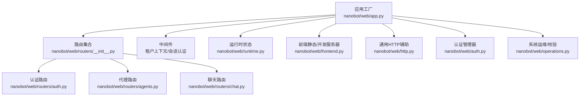
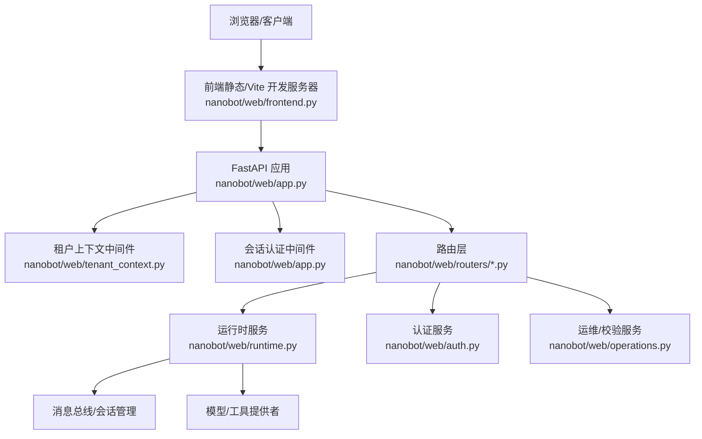
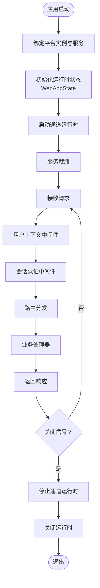
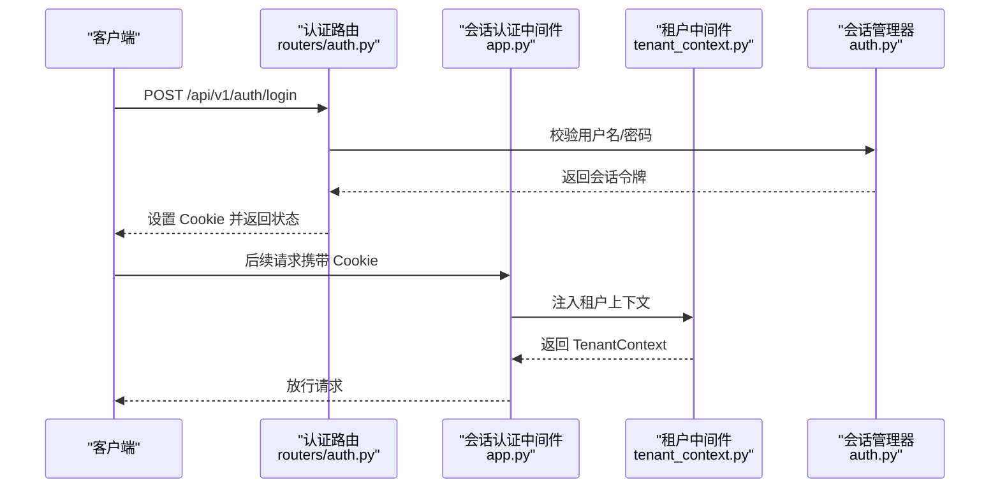
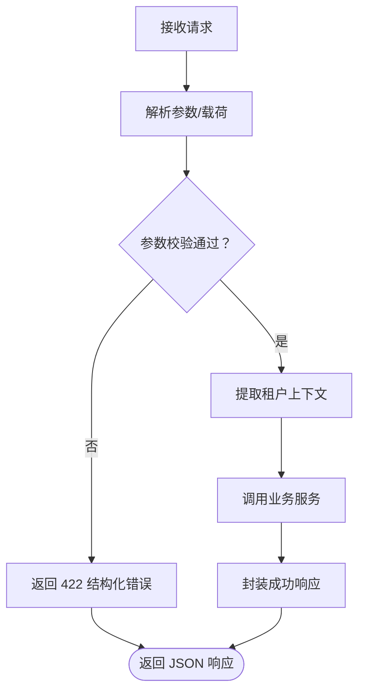
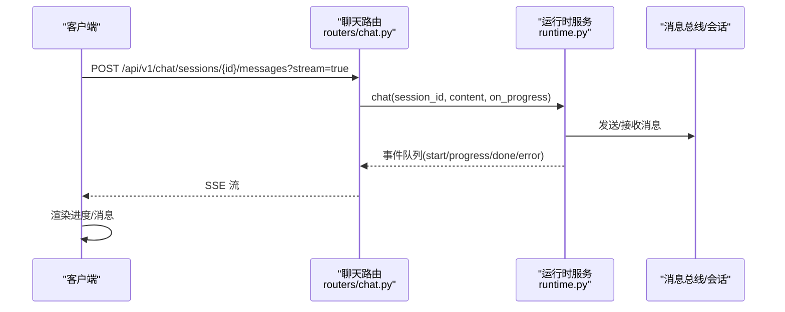
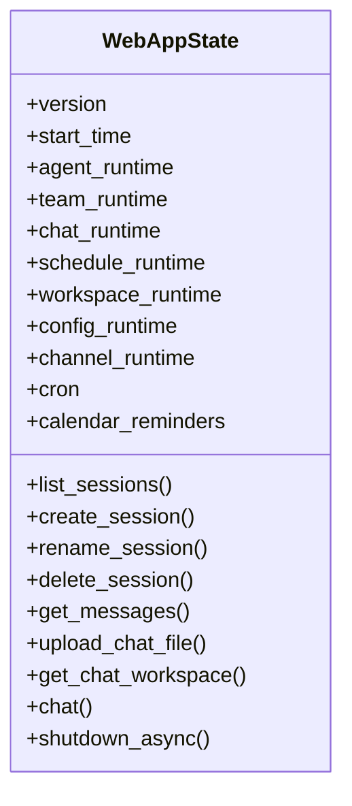
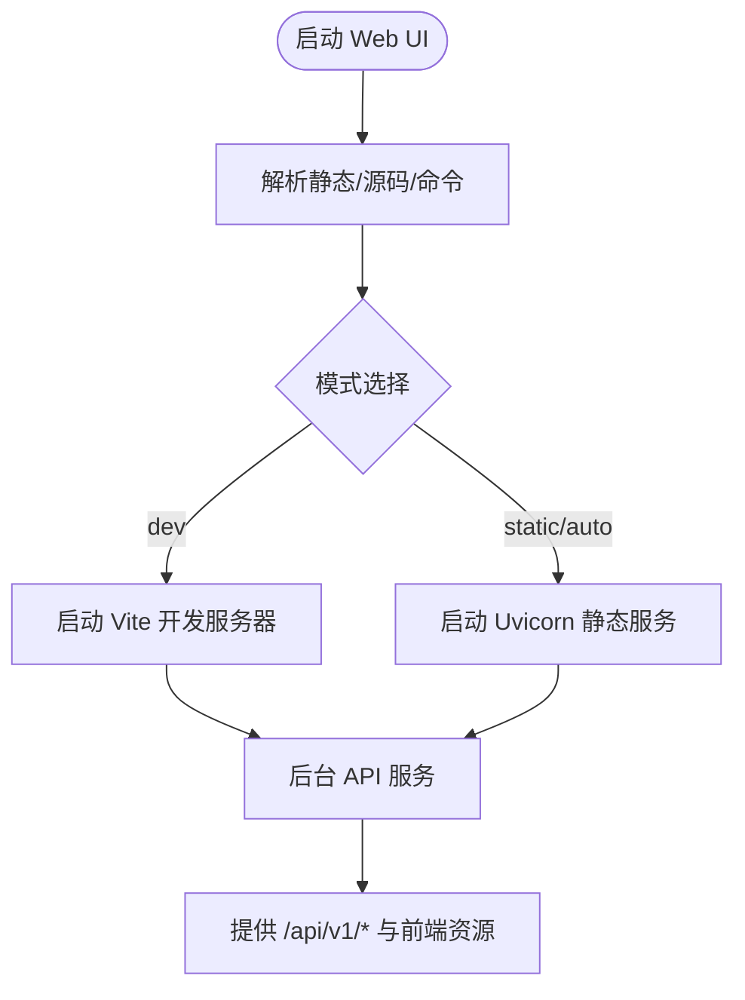
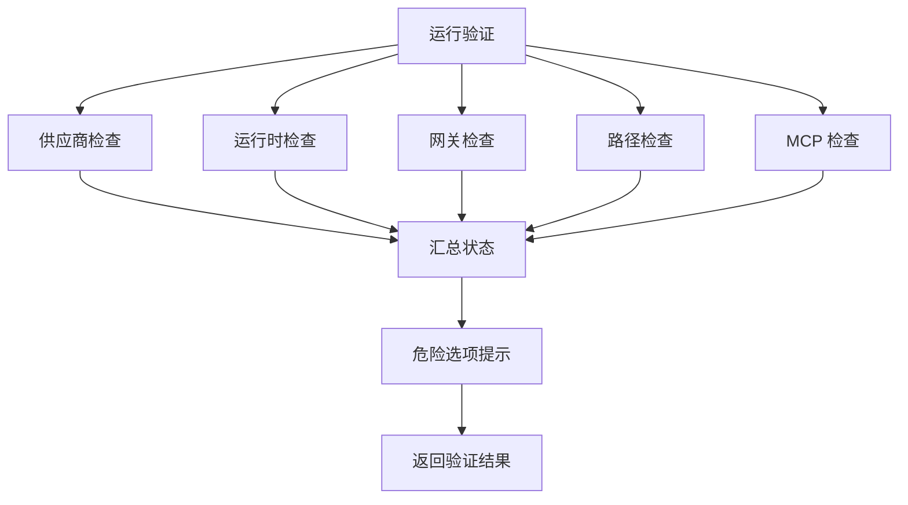
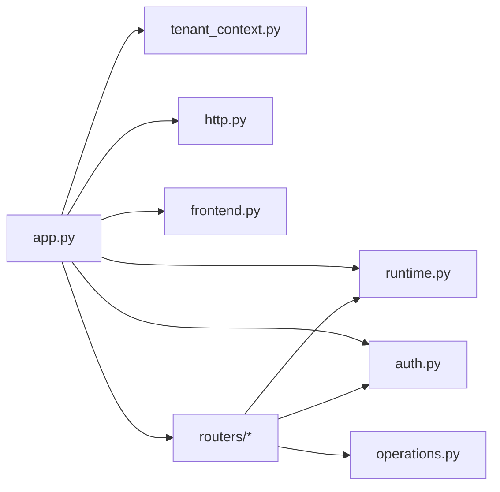

# Web 服务架构

<cite>
**本文引用的文件**
- [nanobot/web/app.py](file://nanobot/web/app.py)
- [nanobot/web/api.py](file://nanobot/web/api.py)
- [nanobot/web/auth.py](file://nanobot/web/auth.py)
- [nanobot/web/http.py](file://nanobot/web/http.py)
- [nanobot/web/frontend.py](file://nanobot/web/frontend.py)
- [nanobot/web/routers/__init__.py](file://nanobot/web/routers/__init__.py)
- [nanobot/web/routers/auth.py](file://nanobot/web/routers/auth.py)
- [nanobot/web/routers/agents.py](file://nanobot/web/routers/agents.py)
- [nanobot/web/routers/chat.py](file://nanobot/web/routers/chat.py)
- [nanobot/web/tenant_context.py](file://nanobot/web/tenant_context.py)
- [nanobot/web/runtime.py](file://nanobot/web/runtime.py)
- [nanobot/web/setup.py](file://nanobot/web/setup.py)
- [nanobot/web/operations.py](file://nanobot/web/operations.py)
</cite>

## 目录
1. [简介](#简介)
2. [项目结构](#项目结构)
3. [核心组件](#核心组件)
4. [架构总览](#架构总览)
5. [详细组件分析](#详细组件分析)
6. [依赖分析](#依赖分析)
7. [性能考量](#性能考量)
8. [故障排查指南](#故障排查指南)
9. [结论](#结论)
10. [附录](#附录)

## 简介
本文件面向基于 FastAPI 的 Web 服务架构，系统化阐述 RESTful API 设计、路由体系、中间件管道、请求处理流程、响应格式、认证授权、CORS 与安全策略、WebSocket 实时通信、版本控制、错误处理与日志记录、性能优化与扩展性等主题。文档同时给出代码级架构图与流程图，帮助读者快速定位实现位置与最佳实践。

## 项目结构
Web 服务采用模块化组织：应用工厂负责生命周期管理、中间件与路由装配；路由按领域拆分；运行时状态统一由 WebAppState 管理；前端资源可静态打包或开发模式热更新；认证与会话管理独立于路由层；操作与校验服务提供系统运维能力。

图表来源
- [nanobot/web/app.py:70-280](file://nanobot/web/app.py#L70-L280)
- [nanobot/web/routers/__init__.py:1-36](file://nanobot/web/routers/__init__.py#L1-L36)
- [nanobot/web/runtime.py:72-301](file://nanobot/web/runtime.py#L72-L301)
- [nanobot/web/frontend.py:138-226](file://nanobot/web/frontend.py#L138-L226)
- [nanobot/web/http.py:11-40](file://nanobot/web/http.py#L11-L40)
- [nanobot/web/auth.py:129-414](file://nanobot/web/auth.py#L129-L414)
- [nanobot/web/operations.py:40-457](file://nanobot/web/operations.py#L40-L457)

章节来源
- [nanobot/web/app.py:70-280](file://nanobot/web/app.py#L70-L280)
- [nanobot/web/routers/__init__.py:1-36](file://nanobot/web/routers/__init__.py#L1-L36)

## 核心组件
- 应用工厂与生命周期
  - 负责创建 FastAPI 实例、注入平台服务与运行时状态、注册异常处理器与中间件、装配路由、提供静态/开发前端服务器入口。
- 路由系统
  - 按领域拆分（认证、代理、聊天、知识库、团队、租户、工作区等），统一前缀 /api/v1，便于版本控制与扩展。
- 中间件管道
  - 租户上下文中间件：优先解析 API Key，支持多租户与作用域；否则回退到默认租户。
  - 会话认证中间件：对 /api/v1/ 请求强制 Cookie 登录，跳过健康检查与认证端点。
- 运行时状态 WebAppState
  - 统一承载聊天、代理、团队、计划、工作区、配置、通道等运行时服务，提供异步聊天与测试运行接口。
- 认证与会话
  - 基于 PBKDF2 的密码存储、内存会话、Cookie 管理、头像上传与清理。
- 前端集成
  - 支持静态打包与 Vite 开发模式热更新，自动回退至 API-only 模式。
- 错误与响应
  - 统一响应体结构，异常转换为结构化错误码与消息，支持 SSE 流式输出。

章节来源
- [nanobot/web/app.py:148-280](file://nanobot/web/app.py#L148-L280)
- [nanobot/web/routers/__init__.py:19-35](file://nanobot/web/routers/__init__.py#L19-L35)
- [nanobot/web/tenant_context.py:26-92](file://nanobot/web/tenant_context.py#L26-L92)
- [nanobot/web/auth.py:129-414](file://nanobot/web/auth.py#L129-L414)
- [nanobot/web/runtime.py:72-301](file://nanobot/web/runtime.py#L72-L301)
- [nanobot/web/frontend.py:138-226](file://nanobot/web/frontend.py#L138-L226)
- [nanobot/web/http.py:11-40](file://nanobot/web/http.py#L11-L40)

## 架构总览
下图展示从客户端到后端服务的典型交互路径，包括认证、租户上下文、路由处理与运行时服务调用。

图表来源
- [nanobot/web/app.py:225-246](file://nanobot/web/app.py#L225-L246)
- [nanobot/web/tenant_context.py:26-92](file://nanobot/web/tenant_context.py#L26-L92)
- [nanobot/web/routers/auth.py:87-128](file://nanobot/web/routers/auth.py#L87-L128)
- [nanobot/web/routers/agents.py:43-162](file://nanobot/web/routers/agents.py#L43-L162)
- [nanobot/web/routers/chat.py:105-187](file://nanobot/web/routers/chat.py#L105-L187)
- [nanobot/web/runtime.py:99-295](file://nanobot/web/runtime.py#L99-L295)
- [nanobot/web/operations.py:40-457](file://nanobot/web/operations.py#L40-L457)

## 详细组件分析

### 应用工厂与生命周期（FastAPI）
- 生命周期管理
  - 使用 lifespan 管理服务绑定、运行时启动与关闭、内存源绑定、通道运行时启动与停止。
- 异常处理
  - APIError、RequestValidationError、StarletteHTTPException 统一转换为结构化响应。
- 中间件
  - 租户上下文中间件优先于会话认证中间件注册，确保 API Key 优先校验。
  - 会话认证中间件对 /api/v1/ 路径强制 Cookie 登录，跳过健康检查与认证端点。
- 路由装配
  - 包含认证、代理、聊天、知识库、团队、租户、工作区、MCP、通道、计划、操作等路由。
- 前端集成
  - 提供静态与开发两种模式，自动回退与错误提示。

图表来源
- [nanobot/web/app.py:148-184](file://nanobot/web/app.py#L148-L184)
- [nanobot/web/app.py:205-243](file://nanobot/web/app.py#L205-L243)
- [nanobot/web/app.py:248-262](file://nanobot/web/app.py#L248-L262)
- [nanobot/web/runtime.py:289-295](file://nanobot/web/runtime.py#L289-L295)

章节来源
- [nanobot/web/app.py:148-280](file://nanobot/web/app.py#L148-L280)

### 认证与会话（Cookie + API Key）
- 会话与 Cookie
  - 会话令牌有效期、HttpOnly Cookie、SameSite/Lax、HTTPS 安全策略。
- 密码与状态
  - PBKDF2 存储、盐值与迭代次数、并发安全、头像上传与清理。
- 路由端点
  - 状态查询、引导初始化、登录、登出、资料更新、密码轮换、头像上传与删除。
- 多租户 API Key
  - 优先从 Authorization: Bearer 或 X-API-Key 解析，校验后注入 TenantContext，支持 x-tenant-id 对比。

图表来源
- [nanobot/web/routers/auth.py:106-128](file://nanobot/web/routers/auth.py#L106-L128)
- [nanobot/web/app.py:225-243](file://nanobot/web/app.py#L225-L243)
- [nanobot/web/tenant_context.py:26-92](file://nanobot/web/tenant_context.py#L26-L92)
- [nanobot/web/auth.py:129-414](file://nanobot/web/auth.py#L129-L414)

章节来源
- [nanobot/web/routers/auth.py:87-220](file://nanobot/web/routers/auth.py#L87-L220)
- [nanobot/web/tenant_context.py:26-108](file://nanobot/web/tenant_context.py#L26-L108)
- [nanobot/web/auth.py:129-414](file://nanobot/web/auth.py#L129-L414)

### 路由系统与请求处理
- 路由前缀与版本控制
  - 所有业务路由统一前缀 /api/v1，便于未来版本迁移与兼容。
- 典型流程
  - 读取请求体/查询参数 → 参数校验 → 租户上下文解析 → 业务服务调用 → 统一响应封装。
- 错误处理
  - 业务异常转换为结构化错误码与消息；422/404/HTTP 异常分别映射。

图表来源
- [nanobot/web/routers/agents.py:43-162](file://nanobot/web/routers/agents.py#L43-L162)
- [nanobot/web/routers/chat.py:105-187](file://nanobot/web/routers/chat.py#L105-L187)
- [nanobot/web/http.py:11-40](file://nanobot/web/http.py#L11-L40)

章节来源
- [nanobot/web/routers/__init__.py:19-35](file://nanobot/web/routers/__init__.py#L19-L35)
- [nanobot/web/routers/agents.py:43-162](file://nanobot/web/routers/agents.py#L43-L162)
- [nanobot/web/routers/chat.py:105-187](file://nanobot/web/routers/chat.py#L105-L187)
- [nanobot/web/http.py:11-40](file://nanobot/web/http.py#L11-L40)

### 实时通信与流式响应（SSE）
- 聊天流式接口
  - 支持 ?stream=true 时返回 Server-Sent Events，事件类型包括 start、progress、done、error。
  - 事件编码遵循 SSE 规范，客户端逐条解析。
- 进度回调
  - 通过 on_progress 回调传递工具提示与进度文本，前端可实时渲染。

图表来源
- [nanobot/web/routers/chat.py:105-187](file://nanobot/web/routers/chat.py#L105-L187)
- [nanobot/web/http.py:27-28](file://nanobot/web/http.py#L27-L28)
- [nanobot/web/runtime.py:163-169](file://nanobot/web/runtime.py#L163-L169)

章节来源
- [nanobot/web/routers/chat.py:105-187](file://nanobot/web/routers/chat.py#L105-L187)
- [nanobot/web/http.py:27-28](file://nanobot/web/http.py#L27-L28)
- [nanobot/web/runtime.py:163-169](file://nanobot/web/runtime.py#L163-L169)

### 运行时状态与服务编排（WebAppState）
- 统一运行时
  - 聊天、代理、团队、计划、工作区、配置、通道、定时任务等服务聚合。
- 生命周期
  - 启动时重建配置、启动计划运行时；关闭时停止通道运行时、停止计划运行时、关闭代理 MCP。
- 会话与消息
  - 提供会话列表、创建、重命名、删除、消息查询、最后一条助手消息、文件上传、工作区信息等。

图表来源
- [nanobot/web/runtime.py:72-301](file://nanobot/web/runtime.py#L72-L301)

章节来源
- [nanobot/web/runtime.py:72-301](file://nanobot/web/runtime.py#L72-L301)

### 前端集成与开发模式
- 静态模式
  - 解析静态资源目录，回退到 index.html，缺失时返回友好提示。
- 开发模式
  - 自动寻找 web-ui 源码与 npm，启动 Vite 开发服务器并通过环境变量指定 API Origin。
- 服务器启动
  - 支持 auto/static/dev 三种模式，自动回退与错误提示。

图表来源
- [nanobot/web/frontend.py:138-226](file://nanobot/web/frontend.py#L138-L226)
- [nanobot/web/api.py:24-68](file://nanobot/web/api.py#L24-L68)

章节来源
- [nanobot/web/frontend.py:138-226](file://nanobot/web/frontend.py#L138-L226)
- [nanobot/web/api.py:24-68](file://nanobot/web/api.py#L24-L68)

### 系统运维与校验（Operations）
- 验证检查
  - 供应商配置、运行时依赖、网关与服务地址、工作区/日志路径、MCP 状态、危险选项。
- 日志查看
  - 按时间排序列出日志文件，截取尾部若干行。
- 动作触发
  - 通过环境变量注入命令，支持重启与更新动作，带进程状态跟踪。

图表来源
- [nanobot/web/operations.py:55-82](file://nanobot/web/operations.py#L55-L82)
- [nanobot/web/operations.py:136-381](file://nanobot/web/operations.py#L136-L381)

章节来源
- [nanobot/web/operations.py:40-457](file://nanobot/web/operations.py#L40-L457)

## 依赖分析
- 组件耦合
  - 应用工厂通过 app.state 注入平台服务与运行时，路由仅依赖 app.state 与请求上下文，保持低耦合。
  - 租户中间件与认证中间件解耦，分别负责多租户与会话校验。
- 外部依赖
  - FastAPI、Uvicorn、Loguru、Starlette 异常体系。
- 循环依赖
  - 未见直接循环导入；路由与运行时通过服务接口解耦。

图表来源
- [nanobot/web/app.py:70-280](file://nanobot/web/app.py#L70-L280)
- [nanobot/web/runtime.py:72-301](file://nanobot/web/runtime.py#L72-L301)
- [nanobot/web/tenant_context.py:26-92](file://nanobot/web/tenant_context.py#L26-L92)
- [nanobot/web/auth.py:129-414](file://nanobot/web/auth.py#L129-L414)
- [nanobot/web/http.py:11-40](file://nanobot/web/http.py#L11-L40)
- [nanobot/web/frontend.py:138-226](file://nanobot/web/frontend.py#L138-L226)
- [nanobot/web/operations.py:40-457](file://nanobot/web/operations.py#L40-L457)

章节来源
- [nanobot/web/app.py:70-280](file://nanobot/web/app.py#L70-L280)

## 性能考量
- 流式响应
  - 使用 SSE 传输聊天进度与工具提示，避免长连接阻塞，提升交互体验。
- 会话与缓存
  - 内存会话与 PBKDF2 存储，避免频繁磁盘 IO；头像文件最小化写入与原子替换。
- 路由与中间件
  - 将租户与认证中间件前置，尽早短路非 API 请求与健康检查，减少不必要处理。
- 前端模式
  - 开发模式使用 Vite 热更新，静态模式减少不必要的文件扫描与回退逻辑。
- 运行时
  - WebAppState 聚合服务，避免重复初始化；关闭时有序释放资源，防止资源泄漏。

## 故障排查指南
- 常见错误与处理
  - 401 未认证：检查 Cookie 是否正确设置与未过期；确认会话认证中间件是否生效。
  - 404 未找到：确认路由前缀与路径拼写；未知 API 路由会被统一拦截。
  - 422 参数校验失败：根据错误详情修正请求体字段。
  - SSE 流异常：检查事件编码与客户端解析逻辑，关注 start/progress/done/error 类型。
- 日志与诊断
  - 使用运维服务的日志接口查看最近日志片段；结合验证检查定位配置问题。
- 安全与合规
  - 确保 Cookie Secure 仅在 HTTPS 下设置；SameSite/Lax 与 HttpOnly 防止 CSRF/XSS。
  - API Key 与 x-tenant-id 校验，避免跨租户越权。

章节来源
- [nanobot/web/app.py:205-243](file://nanobot/web/app.py#L205-L243)
- [nanobot/web/routers/chat.py:105-187](file://nanobot/web/routers/chat.py#L105-L187)
- [nanobot/web/operations.py:83-102](file://nanobot/web/operations.py#L83-L102)

## 结论
该 Web 服务架构以 FastAPI 为核心，采用清晰的路由分层、中间件管道与运行时状态管理，实现了 RESTful API 与实时流式通信的统一。通过多租户 API Key 与 Cookie 双重认证、结构化错误与日志体系、以及运维校验与动作触发，系统在安全性、可观测性与可维护性方面具备良好基础。建议在生产环境中强化 CORS 配置、速率限制与审计日志，并持续完善版本迁移策略与灰度发布流程。

## 附录
- 版本控制建议
  - 采用 /api/v1 前缀，保留旧端点兼容窗口；新增端点以新版本号推进。
- CORS 与安全策略
  - 明确允许来源、方法与头部；对敏感端点启用严格 SameSite/Lax 与 HttpOnly Cookie。
- 扩展性建议
  - 引入速率限制中间件、链路追踪与指标采集；对大文件上传增加预签名与分片策略；对 MCP 服务引入健康探针与熔断。