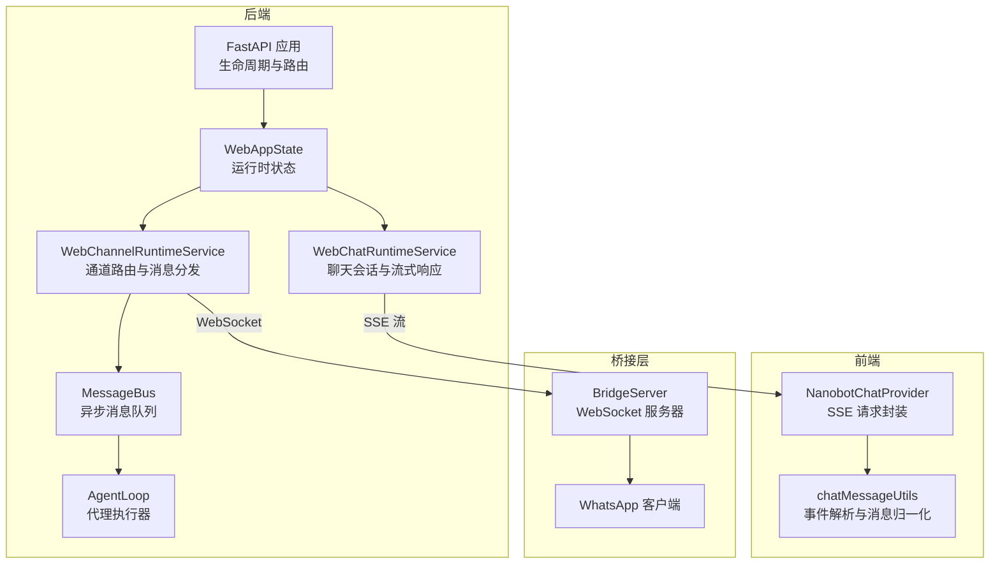
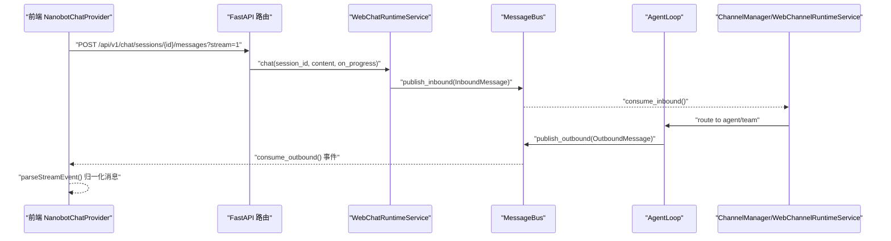
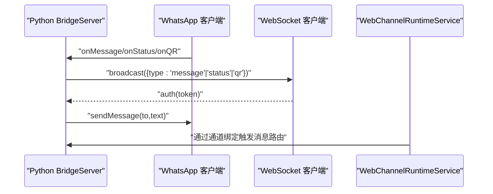
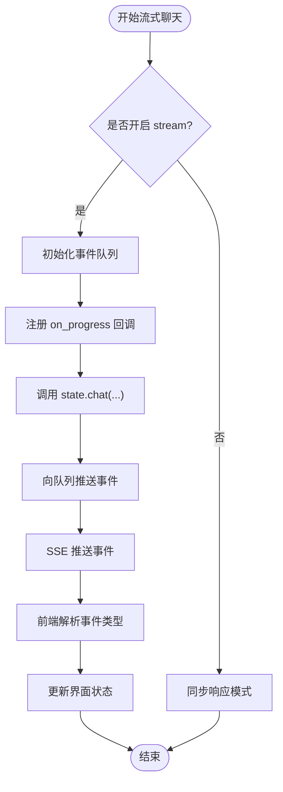
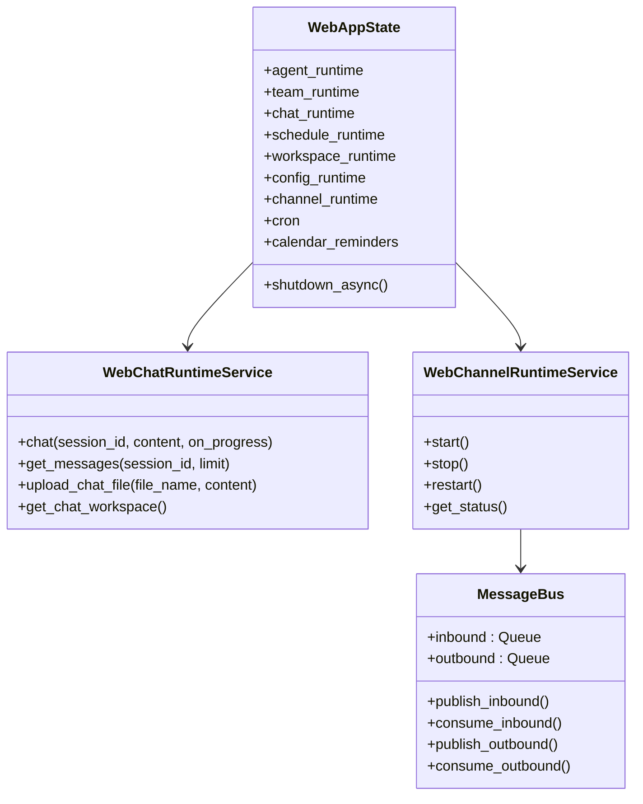
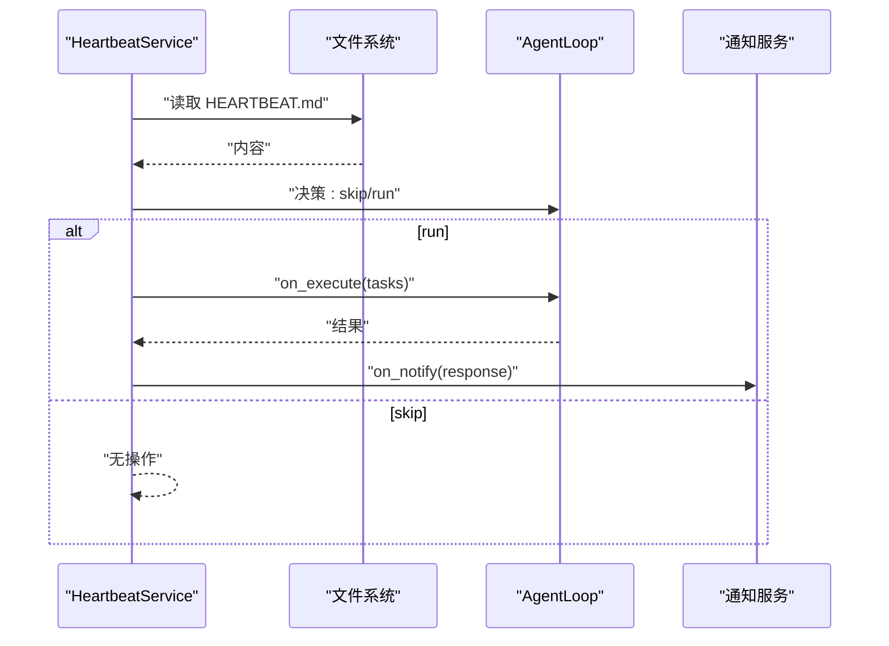
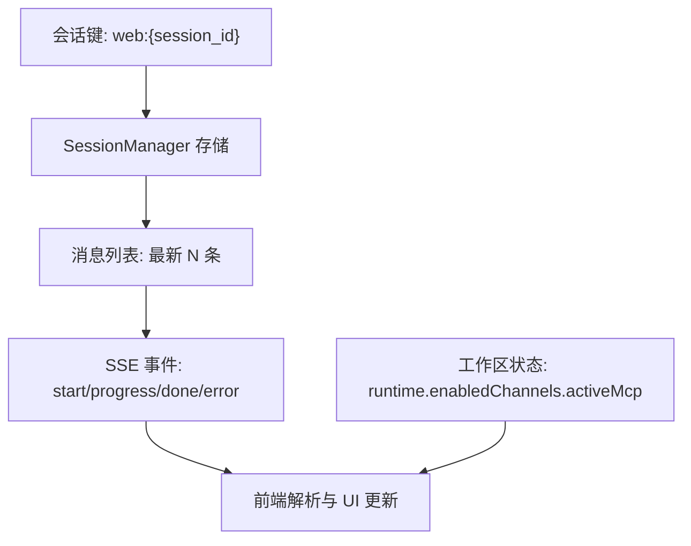
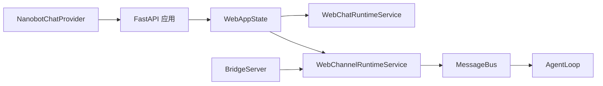

# 实时通信支持

<cite>
**本文档引用的文件**
- [nanobot/web/runtime.py](file://nanobot/web/runtime.py)
- [nanobot/web/app.py](file://nanobot/web/app.py)
- [nanobot/web/routers/chat.py](file://nanobot/web/routers/chat.py)
- [nanobot/web/runtime_services/chat.py](file://nanobot/web/runtime_services/chat.py)
- [nanobot/web/runtime_services/channel_runtime.py](file://nanobot/web/runtime_services/channel_runtime.py)
- [nanobot/web/channels.py](file://nanobot/web/channels.py)
- [nanobot/bus/queue.py](file://nanobot/bus/queue.py)
- [nanobot/bus/events.py](file://nanobot/bus/events.py)
- [nanobot/heartbeat/service.py](file://nanobot/heartbeat/service.py)
- [web-ui/src/chat/NanobotChatProvider.ts](file://web-ui/src/chat/NanobotChatProvider.ts)
- [web-ui/src/chat/chatMessageUtils.ts](file://web-ui/src/chat/chatMessageUtils.ts)
- [bridge/src/index.ts](file://bridge/src/index.ts)
- [bridge/src/server.ts](file://bridge/src/server.ts)
</cite>

## 目录
1. [简介](#简介)
2. [项目结构](#项目结构)
3. [核心组件](#核心组件)
4. [架构总览](#架构总览)
5. [详细组件分析](#详细组件分析)
6. [依赖关系分析](#依赖关系分析)
7. [性能考虑](#性能考虑)
8. [故障排除指南](#故障排除指南)
9. [结论](#结论)

## 简介
本文件面向实时通信支持的技术文档，聚焦于 WebSocket 连接管理、消息推送机制与双向通信实现。文档深入解释运行时服务的实时处理能力、消息队列与事件分发系统，覆盖连接建立流程、心跳检测与断线重连机制，并阐述实时数据同步、状态更新与通知推送的实现方式。同时提供性能优化与并发处理的最佳实践，帮助开发者在复杂场景下构建稳定高效的实时通信系统。

## 项目结构
实时通信相关的核心模块分布于后端 Python 与前端 TypeScript 两部分：
- 后端：通过 FastAPI 应用承载 WebUI 生命周期与路由；实时聊天采用 Server-Sent Events（SSE）进行流式传输；通道路由通过独立线程+事件循环实现异步消息分发；消息总线使用 asyncio 队列解耦通道与代理核心。
- 前端：基于 Ant Design X SDK 的 NanobotChatProvider 封装，负责 SSE 流解析与消息归一化；桥接层（Bridge）为 WhatsApp 提供 WebSocket 桥接，实现与外部平台的消息互通。

**图表来源**
- [nanobot/web/app.py:70-280](file://nanobot/web/app.py#L70-L280)
- [nanobot/web/runtime.py:72-300](file://nanobot/web/runtime.py#L72-L300)
- [nanobot/web/runtime_services/chat.py:18-440](file://nanobot/web/runtime_services/chat.py#L18-L440)
- [nanobot/web/runtime_services/channel_runtime.py:31-382](file://nanobot/web/runtime_services/channel_runtime.py#L31-L382)
- [nanobot/bus/queue.py:8-45](file://nanobot/bus/queue.py#L8-L45)
- [web-ui/src/chat/NanobotChatProvider.ts:96-172](file://web-ui/src/chat/NanobotChatProvider.ts#L96-L172)
- [web-ui/src/chat/chatMessageUtils.ts:106-170](file://web-ui/src/chat/chatMessageUtils.ts#L106-L170)
- [bridge/src/server.ts:20-130](file://bridge/src/server.ts#L20-L130)

**章节来源**
- [nanobot/web/app.py:70-280](file://nanobot/web/app.py#L70-L280)
- [nanobot/web/runtime.py:72-300](file://nanobot/web/runtime.py#L72-L300)

## 核心组件
- WebAppState：承载应用全局状态，初始化运行时服务（聊天、团队、工作区、配置、日程、通道等），并负责生命周期管理与资源清理。
- WebChatRuntimeService：封装聊天会话、消息列表、文件上传与 MCP 测试会话；提供流式聊天接口，通过回调 on_progress 推送进度事件。
- WebChannelRuntimeService：启动专用线程+事件循环，构建消息总线与通道管理器，实现入站消息到代理或团队的路由分发。
- MessageBus：基于 asyncio.Queue 的异步消息总线，解耦通道与代理核心，支持入站/出站队列与容量监控。
- AgentLoop：代理执行器，支持工具调用、会话管理、MCP 服务器集成与通道配置。
- NanobotChatProvider：前端 SSE 客户端，封装流式请求、错误处理与事件解析。
- BridgeServer：本地 WebSocket 服务器，用于与 WhatsApp 客户端桥接，广播消息与状态。

**章节来源**
- [nanobot/web/runtime.py:72-300](file://nanobot/web/runtime.py#L72-L300)
- [nanobot/web/runtime_services/chat.py:18-440](file://nanobot/web/runtime_services/chat.py#L18-L440)
- [nanobot/web/runtime_services/channel_runtime.py:31-382](file://nanobot/web/runtime_services/channel_runtime.py#L31-L382)
- [nanobot/bus/queue.py:8-45](file://nanobot/bus/queue.py#L8-L45)
- [web-ui/src/chat/NanobotChatProvider.ts:96-172](file://web-ui/src/chat/NanobotChatProvider.ts#L96-L172)
- [bridge/src/server.ts:20-130](file://bridge/src/server.ts#L20-L130)

## 架构总览
实时通信架构由“前端 SSE 流 + 后端消息总线 + 通道路由 + 代理执行器”构成，形成从用户输入到多通道输出的闭环：

**图表来源**
- [nanobot/web/routers/chat.py:105-187](file://nanobot/web/routers/chat.py#L105-L187)
- [nanobot/web/runtime_services/chat.py:418-440](file://nanobot/web/runtime_services/chat.py#L418-L440)
- [nanobot/web/runtime_services/channel_runtime.py:142-200](file://nanobot/web/runtime_services/channel_runtime.py#L142-L200)
- [nanobot/bus/queue.py:20-34](file://nanobot/bus/queue.py#L20-L34)
- [web-ui/src/chat/NanobotChatProvider.ts:96-172](file://web-ui/src/chat/NanobotChatProvider.ts#L96-L172)

## 详细组件分析

### 组件A：WebSocket 连接管理与桥接
- BridgeServer：监听本地回环地址，支持可选令牌认证；维护客户端集合，广播消息与状态；处理命令发送与错误。
- WhatsApp 客户端：与 BridgeServer 协作，接收入站消息并通过广播转发给后端通道路由。
- 运行时集成：WebChannelRuntimeService 在独立线程中启动通道管理器，绑定消息总线，实现与外部平台的双向通信。

**图表来源**
- [bridge/src/server.ts:20-130](file://bridge/src/server.ts#L20-L130)
- [bridge/src/index.ts:15-52](file://bridge/src/index.ts#L15-L52)
- [nanobot/web/runtime_services/channel_runtime.py:142-200](file://nanobot/web/runtime_services/channel_runtime.py#L142-L200)

**章节来源**
- [bridge/src/server.ts:20-130](file://bridge/src/server.ts#L20-L130)
- [bridge/src/index.ts:15-52](file://bridge/src/index.ts#L15-L52)
- [nanobot/web/runtime_services/channel_runtime.py:31-120](file://nanobot/web/runtime_services/channel_runtime.py#L31-L120)

### 组件B：消息推送机制与双向通信
- SSE 流式响应：后端路由在开启 stream 参数时返回 Server-Sent Events，前端逐条解析事件类型（start/progress/done/error）。
- 进度回调：WebChatRuntimeService 将 on_progress 回调注入代理执行器，代理在工具调用与中间步骤中推送进度事件。
- 事件模型：InboundMessage/OutboundMessage 定义统一的入站/出站消息结构，确保跨通道一致性。

**图表来源**
- [nanobot/web/routers/chat.py:118-170](file://nanobot/web/routers/chat.py#L118-L170)
- [nanobot/web/runtime_services/chat.py:418-440](file://nanobot/web/runtime_services/chat.py#L418-L440)
- [web-ui/src/chat/NanobotChatProvider.ts:96-172](file://web-ui/src/chat/NanobotChatProvider.ts#L96-L172)
- [web-ui/src/chat/chatMessageUtils.ts:106-170](file://web-ui/src/chat/chatMessageUtils.ts#L106-L170)

**章节来源**
- [nanobot/web/routers/chat.py:105-187](file://nanobot/web/routers/chat.py#L105-L187)
- [nanobot/web/runtime_services/chat.py:18-440](file://nanobot/web/runtime_services/chat.py#L18-L440)
- [nanobot/bus/events.py:8-39](file://nanobot/bus/events.py#L8-L39)

### 组件C：运行时服务的实时处理能力
- WebAppState：集中管理运行时服务与资源，负责配置重建、日程调度启动与通道运行时启动。
- WebChatRuntimeService：提供会话管理、消息查询、文件上传与 MCP 测试会话；封装流式聊天与进度回调。
- WebChannelRuntimeService：在独立线程中启动 AgentLoop 与 ChannelManager，使用 MessageBus 解耦消息处理与通道实现。

**图表来源**
- [nanobot/web/runtime.py:72-300](file://nanobot/web/runtime.py#L72-L300)
- [nanobot/web/runtime_services/chat.py:18-440](file://nanobot/web/runtime_services/chat.py#L18-L440)
- [nanobot/web/runtime_services/channel_runtime.py:31-200](file://nanobot/web/runtime_services/channel_runtime.py#L31-L200)
- [nanobot/bus/queue.py:8-45](file://nanobot/bus/queue.py#L8-L45)

**章节来源**
- [nanobot/web/runtime.py:72-300](file://nanobot/web/runtime.py#L72-L300)
- [nanobot/web/runtime_services/channel_runtime.py:31-200](file://nanobot/web/runtime_services/channel_runtime.py#L31-L200)

### 组件D：心跳检测与断线重连机制
- 心跳服务：周期性读取工作区中的心跳文件，通过虚拟工具调用决策是否执行任务；执行阶段可触发通知。
- 断线重连：BridgeServer 对外暴露停止与重启能力，配合 WebChannelRuntimeService 的 restart 可在配置变更后重建通道管道。

**图表来源**
- [nanobot/heartbeat/service.py:40-174](file://nanobot/heartbeat/service.py#L40-L174)

**章节来源**
- [nanobot/heartbeat/service.py:40-174](file://nanobot/heartbeat/service.py#L40-L174)
- [nanobot/web/runtime_services/channel_runtime.py:124-128](file://nanobot/web/runtime_services/channel_runtime.py#L124-L128)

### 组件E：实时数据同步与状态更新
- 会话同步：WebChatRuntimeService 维护会话键空间，消息列表按时间戳排序，前端通过 SSE 逐步接收进度与最终回复。
- 工作区状态：get_chat_workspace 返回运行时环境、启用通道、MCP 列表与最近上传等聚合状态，便于前端快速渲染。
- 通道状态：WebChannelRuntimeService 提供 get_status，汇总启用通道与各通道状态，辅助前端显示连接状态。

**图表来源**
- [nanobot/web/runtime_services/chat.py:32-118](file://nanobot/web/runtime_services/chat.py#L32-L118)
- [nanobot/web/runtime_services/chat.py:310-331](file://nanobot/web/runtime_services/chat.py#L310-L331)
- [nanobot/web/runtime_services/channel_runtime.py:129-137](file://nanobot/web/runtime_services/channel_runtime.py#L129-L137)

**章节来源**
- [nanobot/web/runtime_services/chat.py:18-440](file://nanobot/web/runtime_services/chat.py#L18-L440)
- [nanobot/web/runtime_services/channel_runtime.py:129-137](file://nanobot/web/runtime_services/channel_runtime.py#L129-L137)

## 依赖关系分析
- 组件耦合：WebAppState 作为中枢，向上提供统一 API，向下协调各运行时服务；WebChannelRuntimeService 通过 MessageBus 与 AgentLoop 解耦。
- 外部依赖：FastAPI 路由层负责请求接入与异常处理；前端通过 SSE 与后端交互；BridgeServer 与 WhatsApp 客户端通过 WebSocket 互通。
- 循环依赖：当前设计避免了循环导入，消息总线与通道管理器通过回调与队列解耦。

**图表来源**
- [nanobot/web/app.py:70-280](file://nanobot/web/app.py#L70-L280)
- [nanobot/web/runtime.py:72-300](file://nanobot/web/runtime.py#L72-L300)
- [nanobot/web/runtime_services/channel_runtime.py:31-200](file://nanobot/web/runtime_services/channel_runtime.py#L31-L200)
- [nanobot/bus/queue.py:8-45](file://nanobot/bus/queue.py#L8-L45)
- [web-ui/src/chat/NanobotChatProvider.ts:96-172](file://web-ui/src/chat/NanobotChatProvider.ts#L96-L172)
- [bridge/src/server.ts:20-130](file://bridge/src/server.ts#L20-L130)

**章节来源**
- [nanobot/web/app.py:70-280](file://nanobot/web/app.py#L70-L280)
- [nanobot/web/runtime.py:72-300](file://nanobot/web/runtime.py#L72-L300)

## 性能考虑
- 异步解耦：通过 asyncio.Queue 与独立线程事件循环降低阻塞风险，提升并发吞吐。
- 资源隔离：代理执行器支持工具白名单、技能限制与系统提示覆盖，避免单次调用对系统造成过载。
- 流式传输：SSE 以事件形式推送，前端按需渲染，减少一次性大包带来的内存压力。
- 缓存与去重：前端对附件引用与进度步骤进行去重与合并，降低重复渲染成本。
- 心跳节流：心跳服务按固定间隔执行，避免频繁 IO；可通过配置调整间隔与开关。

[本节为通用性能建议，无需特定文件引用]

## 故障排除指南
- SSE 连接失败：检查路由参数（sessionId/query）、后端日志与网络连通性；确认前端 fetchChatStream 返回体可用。
- 会话不存在：后端在会话缺失时抛出 404 错误，前端应捕获并提示用户。
- 认证失效：当后端返回 401 时，前端触发认证事件，引导重新登录。
- 通道未启用：WebChannelRuntimeService 在配置中未发现启用通道时不会启动；检查 channels 配置。
- 桥接断开：BridgeServer 提供优雅关闭逻辑，若出现连接异常，尝试重启服务并检查令牌与认证目录。

**章节来源**
- [nanobot/web/routers/chat.py:171-187](file://nanobot/web/routers/chat.py#L171-L187)
- [web-ui/src/chat/NanobotChatProvider.ts:67-79](file://web-ui/src/chat/NanobotChatProvider.ts#L67-L79)
- [nanobot/web/runtime_services/channel_runtime.py:58-67](file://nanobot/web/runtime_services/channel_runtime.py#L58-L67)
- [bridge/src/server.ts:110-130](file://bridge/src/server.ts#L110-L130)

## 结论
该实时通信体系通过 SSE 流式传输与消息总线解耦实现了从前端到代理再到多通道的高效闭环；通道路由在独立线程中运行，确保主事件循环不受阻塞；心跳服务与桥接层进一步完善了系统稳定性与扩展性。遵循本文档的架构与最佳实践，可在保证性能的同时实现可靠的实时数据同步与状态更新。