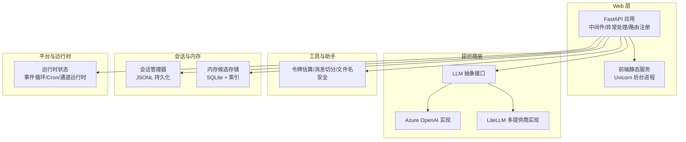
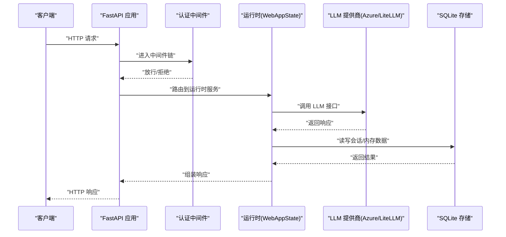
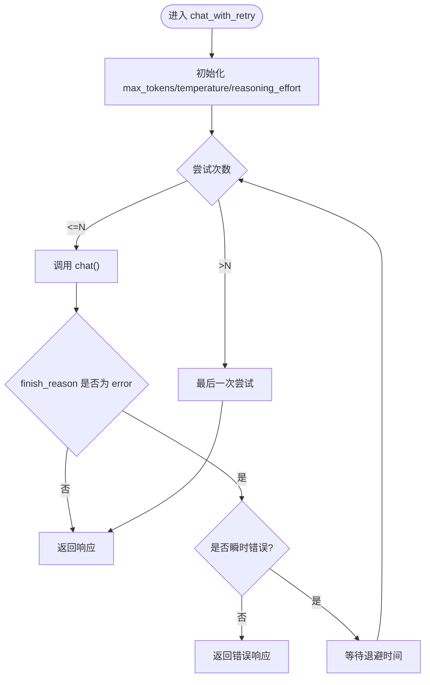
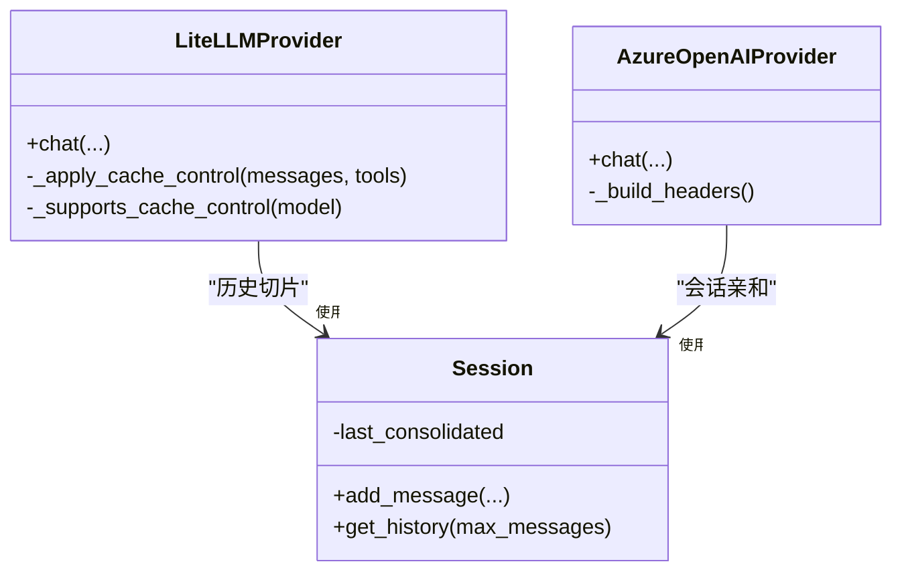
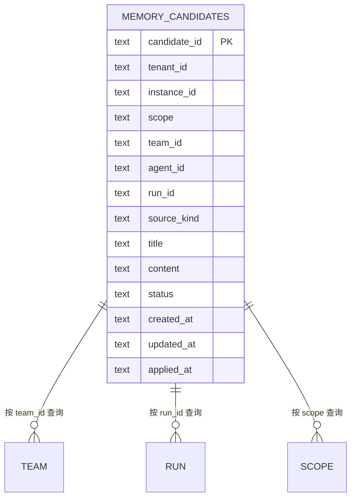
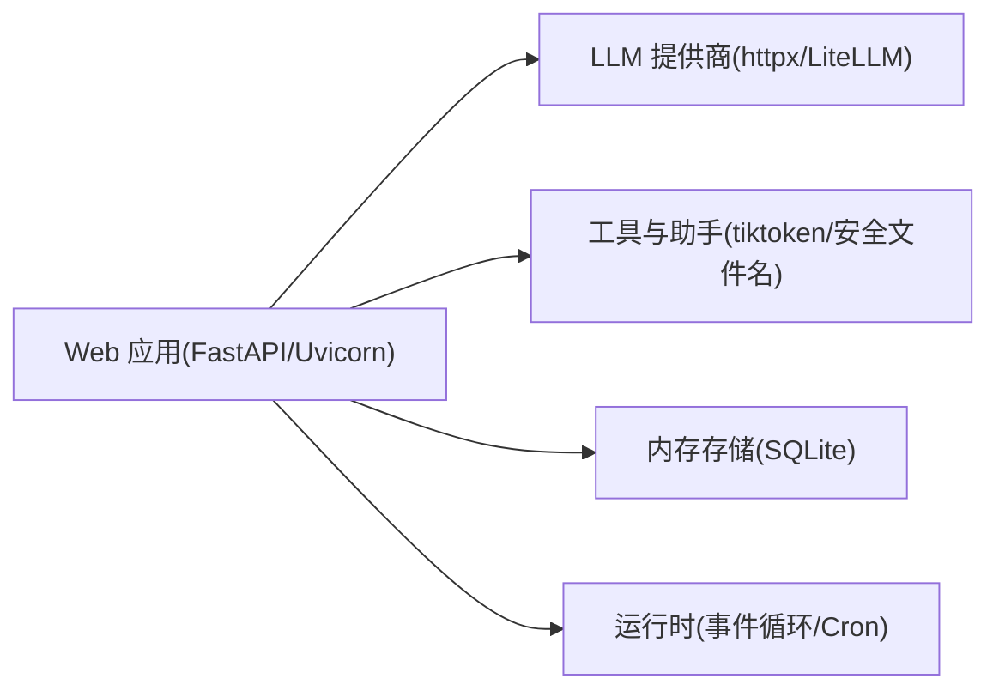

# 性能优化策略

<cite>
**本文引用的文件**
- [nanobot/web/app.py](file://nanobot/web/app.py)
- [nanobot/web/http.py](file://nanobot/web/http.py)
- [nanobot/web/frontend.py](file://nanobot/web/frontend.py)
- [nanobot/web/runtime.py](file://nanobot/web/runtime.py)
- [nanobot/providers/base.py](file://nanobot/providers/base.py)
- [nanobot/providers/azure_openai_provider.py](file://nanobot/providers/azure_openai_provider.py)
- [nanobot/providers/litellm_provider.py](file://nanobot/providers/litellm_provider.py)
- [nanobot/utils/helpers.py](file://nanobot/utils/helpers.py)
- [nanobot/session/manager.py](file://nanobot/session/manager.py)
- [nanobot/platform/memory/store.py](file://nanobot/platform/memory/store.py)
- [pyproject.toml](file://pyproject.toml)
</cite>

## 目录
1. [简介](#简介)
2. [项目结构](#项目结构)
3. [核心组件](#核心组件)
4. [架构总览](#架构总览)
5. [详细组件分析](#详细组件分析)
6. [依赖分析](#依赖分析)
7. [性能考量](#性能考量)
8. [故障排查指南](#故障排查指南)
9. [结论](#结论)
10. [附录](#附录)

## 简介
本文件面向性能优化，系统梳理并给出可操作的策略与实践，覆盖以下方面：
- HTTP 客户端配置与连接池管理
- 请求优化（重试、超时、压缩、缓存）
- 缓存策略（提示词缓存、会话历史缓存、响应缓存）
- 负载均衡与并发处理（多模型网关、异步并发、任务调度）
- 数据库连接优化（SQLite 连接复用、索引与查询优化）
- 中间件性能调优（认证、CORS、静态资源）
- 静态资源优化（构建产物、CDN、缓存头）
- 监控指标与瓶颈识别（日志、埋点、链路追踪）
- 扩展性设计（水平扩展、限流、熔断）
- 性能测试方法与优化建议

## 项目结构
本项目采用分层与模块化组织：
- Web 层：FastAPI 应用、路由、中间件、前端静态服务
- 提供商层：抽象 LLMProvider 及具体实现（Azure OpenAI、LiteLLM）
- 工具与助手：令牌估算、消息切分、文件名安全等
- 会话与内存：会话管理、SQLite 内存候选存储
- 平台与运行时：运行时状态、定时任务、通道运行时



**图表来源**
- [nanobot/web/app.py:70-280](file://nanobot/web/app.py#L70-L280)
- [nanobot/web/frontend.py:138-225](file://nanobot/web/frontend.py#L138-L225)
- [nanobot/providers/base.py:69-271](file://nanobot/providers/base.py#L69-L271)
- [nanobot/providers/azure_openai_provider.py:17-213](file://nanobot/providers/azure_openai_provider.py#L17-L213)
- [nanobot/providers/litellm_provider.py:27-349](file://nanobot/providers/litellm_provider.py#L27-L349)
- [nanobot/utils/helpers.py:92-171](file://nanobot/utils/helpers.py#L92-L171)
- [nanobot/session/manager.py:73-252](file://nanobot/session/manager.py#L73-L252)
- [nanobot/platform/memory/store.py:12-202](file://nanobot/platform/memory/store.py#L12-L202)
- [nanobot/web/runtime.py:72-301](file://nanobot/web/runtime.py#L72-L301)

**章节来源**
- [nanobot/web/app.py:70-280](file://nanobot/web/app.py#L70-L280)
- [nanobot/web/frontend.py:138-225](file://nanobot/web/frontend.py#L138-L225)
- [nanobot/web/runtime.py:72-301](file://nanobot/web/runtime.py#L72-L301)

## 核心组件
- Web 应用与中间件：统一异常处理、认证中间件、路由注册、静态资源服务
- LLM 提供商：抽象接口与重试机制；Azure OpenAI 与 LiteLLM 实现
- 会话管理：消息追加、历史切片、持久化与缓存
- 内存存储：SQLite 表与索引，支持按团队/作用域/状态查询
- 运行时：事件循环、Cron、通道运行时、聊天运行时

**章节来源**
- [nanobot/web/app.py:205-246](file://nanobot/web/app.py#L205-L246)
- [nanobot/providers/base.py:69-271](file://nanobot/providers/base.py#L69-L271)
- [nanobot/session/manager.py:16-71](file://nanobot/session/manager.py#L16-L71)
- [nanobot/platform/memory/store.py:12-61](file://nanobot/platform/memory/store.py#L12-L61)
- [nanobot/web/runtime.py:72-114](file://nanobot/web/runtime.py#L72-L114)

## 架构总览
下图展示 Web 应用启动、中间件拦截、路由分发到运行时与提供商，以及数据库/会话持久化的交互。



**图表来源**
- [nanobot/web/app.py:225-262](file://nanobot/web/app.py#L225-L262)
- [nanobot/web/runtime.py:72-114](file://nanobot/web/runtime.py#L72-L114)
- [nanobot/providers/azure_openai_provider.py:114-163](file://nanobot/providers/azure_openai_provider.py#L114-L163)
- [nanobot/providers/litellm_provider.py:209-282](file://nanobot/providers/litellm_provider.py#L209-L282)
- [nanobot/platform/memory/store.py:108-151](file://nanobot/platform/memory/store.py#L108-L151)

## 详细组件分析

### HTTP 客户端配置与连接池管理
- Uvicorn 后台服务器：在开发模式下以后台线程启动，避免阻塞主流程；生产模式直接运行，关闭访问日志以降低开销
- FastAPI 异常处理：统一结构化错误响应，减少重复逻辑
- 认证中间件：对非 /api/v1/ 路径放行，对受保护路径进行 Cookie 校验，并设置必要的缓存控制头
- 前端静态服务：优先使用构建产物目录，否则回退到单页应用入口；未构建时返回友好提示

优化建议
- 生产环境启用 gzip/br 压缩（通过反向代理或中间件）
- 对静态资源设置强缓存策略（ETag/Last-Modified）
- 限制并发连接数与队列长度，防止突发流量击穿
- 使用连接池复用长连接（如自定义 HTTPX 客户端池）

**章节来源**
- [nanobot/web/frontend.py:93-151](file://nanobot/web/frontend.py#L93-L151)
- [nanobot/web/app.py:205-246](file://nanobot/web/app.py#L205-L246)
- [nanobot/web/http.py:11-40](file://nanobot/web/http.py#L11-L40)

### 请求优化技术
- 重试与退避：LLM 抽象层内置重试延迟序列，自动过滤瞬时错误
- 请求清理：标准化消息键、去除空内容、保证 assistant 的 content 键存在
- 参数校正：最大 token 至少为 1，避免被 LiteLLM 拒绝
- 工具调用规范化：统一 tool_call_id 长度与格式，避免严格提供商拒绝



**图表来源**
- [nanobot/providers/base.py:192-265](file://nanobot/providers/base.py#L192-L265)

**章节来源**
- [nanobot/providers/base.py:100-158](file://nanobot/providers/base.py#L100-L158)
- [nanobot/providers/litellm_provider.py:239-272](file://nanobot/providers/litellm_provider.py#L239-L272)

### 缓存策略
- 提示词缓存控制：LiteLLM 实现中对 system 内容与工具注入 cache_control（ephemeral），提升重复输入命中率
- 会话历史缓存：会话管理器追加消息不修改原列表，通过 last_consolidated 标记已归档部分，避免重复计算
- 响应缓存：Azure OpenAI 实现中使用会话亲和头（x-session-affinity）提升缓存命中



**图表来源**
- [nanobot/providers/litellm_provider.py:126-150](file://nanobot/providers/litellm_provider.py#L126-L150)
- [nanobot/session/manager.py:46-71](file://nanobot/session/manager.py#L46-L71)
- [nanobot/providers/azure_openai_provider.py:64-70](file://nanobot/providers/azure_openai_provider.py#L64-L70)

**章节来源**
- [nanobot/providers/litellm_provider.py:126-150](file://nanobot/providers/litellm_provider.py#L126-L150)
- [nanobot/session/manager.py:46-71](file://nanobot/session/manager.py#L46-L71)
- [nanobot/providers/azure_openai_provider.py:64-70](file://nanobot/providers/azure_openai_provider.py#L64-L70)

### 负载均衡与并发处理机制
- 多提供商网关：LiteLLM 支持 OpenRouter、Anthropic、OpenAI、Gemini 等，通过统一接口路由
- 异步并发：Agent 循环基于 asyncio，消息入站后创建任务，便于响应 /stop 命令
- 运行时服务：WebAppState 将聊天、计划、工作区等服务解耦，便于独立扩展

```mermaid
sequenceDiagram
participant Bus as "消息总线"
participant Loop as "AgentLoop"
participant RT as "WebAppState"
participant Svc as "运行时服务(聊天/计划/工作区)"
Bus-->>Loop : "入站消息"
Loop->>Loop : "创建任务"
Loop->>Svc : "派发处理"
Svc-->>Loop : "进度/结果"
Loop-->>Bus : "出站消息"
```

**图表来源**
- [nanobot/web/runtime.py:163-169](file://nanobot/web/runtime.py#L163-L169)
- [nanobot/agent/loop.py:289-306](file://nanobot/agent/loop.py#L289-L306)

**章节来源**
- [nanobot/providers/litellm_provider.py:27-64](file://nanobot/providers/litellm_provider.py#L27-L64)
- [nanobot/web/runtime.py:72-114](file://nanobot/web/runtime.py#L72-L114)
- [nanobot/agent/loop.py:161-306](file://nanobot/agent/loop.py#L161-L306)

### 数据库连接优化
- SQLite 连接工厂：每次操作建立连接，使用 row_factory 提升字典访问效率
- 索引设计：按团队/状态/更新时间排序，支持高频查询
- 事务与提交：插入后立即加载验证，更新操作使用原子语句



**图表来源**
- [nanobot/platform/memory/store.py:15-39](file://nanobot/platform/memory/store.py#L15-L39)
- [nanobot/platform/memory/store.py:108-151](file://nanobot/platform/memory/store.py#L108-L151)

**章节来源**
- [nanobot/platform/memory/store.py:46-55](file://nanobot/platform/memory/store.py#L46-L55)
- [nanobot/platform/memory/store.py:117-151](file://nanobot/platform/memory/store.py#L117-L151)

### 中间件性能调优
- 认证中间件：跳过 OPTIONS 预检与健康检查；对受保护路由进行 Cookie 校验并设置缓存控制
- 异常处理：结构化错误响应，减少分支判断与重复序列化

**章节来源**
- [nanobot/web/app.py:225-246](file://nanobot/web/app.py#L225-L246)
- [nanobot/web/http.py:11-40](file://nanobot/web/http.py#L11-L40)

### 静态资源优化
- 前端静态目录解析：优先 dist，其次内置 static；未找到时返回友好提示
- 开发模式：Vite 热更新，后台启动 Uvicorn API；生产模式直接运行
- 建议：构建时生成 Source Map，启用 CDN 与缓存头，按需拆分包

**章节来源**
- [nanobot/web/frontend.py:21-78](file://nanobot/web/frontend.py#L21-L78)
- [nanobot/web/frontend.py:138-225](file://nanobot/web/frontend.py#L138-L225)

## 依赖分析
- Web 应用依赖 FastAPI、Uvicorn、Loguru、OAuth 工具等
- 提供商层依赖 httpx、LiteLLM、json-repair、tiktoken
- 会话与内存依赖 SQLite、消息持久化



**图表来源**
- [pyproject.toml:19-55](file://pyproject.toml#L19-L55)
- [nanobot/web/app.py:15-67](file://nanobot/web/app.py#L15-L67)
- [nanobot/providers/litellm_provider.py:1-20](file://nanobot/providers/litellm_provider.py#L1-L20)
- [nanobot/utils/helpers.py:92-114](file://nanobot/utils/helpers.py#L92-L114)
- [nanobot/platform/memory/store.py:12-20](file://nanobot/platform/memory/store.py#L12-L20)

**章节来源**
- [pyproject.toml:19-55](file://pyproject.toml#L19-L55)

## 性能考量
- 令牌估算：使用 tiktoken 估算提示词成本，结合提供商计数器回退
- 消息切分：按换行/空格切分，避免超长消息导致截断
- 会话窗口：通过 last_consolidated 与 get_history 切片，减少上下文大小
- 数据库查询：使用索引字段组合，限制返回条数，避免全表扫描

**章节来源**
- [nanobot/utils/helpers.py:92-171](file://nanobot/utils/helpers.py#L92-L171)
- [nanobot/session/manager.py:46-71](file://nanobot/session/manager.py#L46-L71)
- [nanobot/platform/memory/store.py:117-151](file://nanobot/platform/memory/store.py#L117-L151)

## 故障排查指南
- 认证失败：检查 Cookie 名称与中间件顺序，确认 OPTIONS 预检放行
- LLM 调用错误：查看重试日志与瞬时错误标记，确认网络连通与配额
- 前端未构建：确保 dist 存在或使用开发模式；检查 NPM 命令可用性
- MCP 探测失败：根据错误信息映射到具体原因（缺少运行时、连接被拒、鉴权失败、超时）

**章节来源**
- [nanobot/web/app.py:225-246](file://nanobot/web/app.py#L225-L246)
- [nanobot/providers/base.py:188-191](file://nanobot/providers/base.py#L188-L191)
- [nanobot/web/frontend.py:41-48](file://nanobot/web/frontend.py#L41-L48)
- [nanobot/web/mcp_servers.py:628-651](file://nanobot/web/mcp_servers.py#L628-L651)

## 结论
通过抽象 LLM 提供商接口、引入重试与请求清理、利用提示词缓存与会话切片、优化 SQLite 查询与连接、以及完善中间件与静态资源策略，可在保证功能完整性的同时显著提升系统性能与稳定性。建议在生产环境中配合反向代理启用压缩与缓存，并持续监控关键指标以指导进一步优化。

## 附录
- 性能测试方法
  - 压力测试：使用 wrk/ab 对关键路由进行并发压测，观察 P95/P99 延迟与错误率
  - 场景回归：针对聊天、工具调用、会话加载等场景制定自动化脚本
  - 资源监控：采集 CPU、内存、磁盘 IO、网络带宽与数据库连接数
- 优化建议
  - 引入连接池与超时配置
  - 启用 gzip/br 压缩与静态资源缓存
  - 对热点数据增加二级索引或物化视图
  - 使用限流/熔断保护下游依赖
  - 结合链路追踪定位慢调用