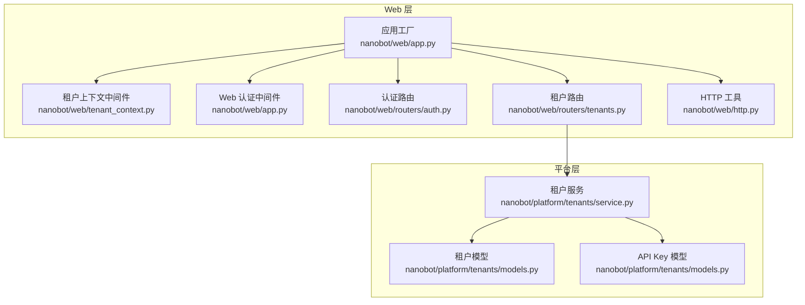
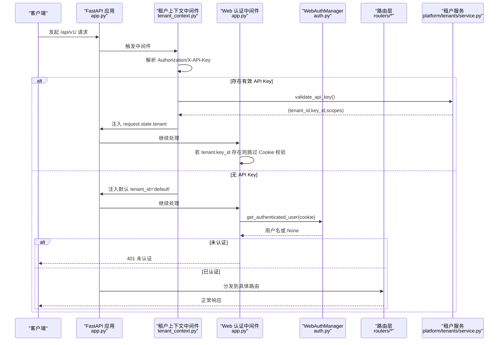
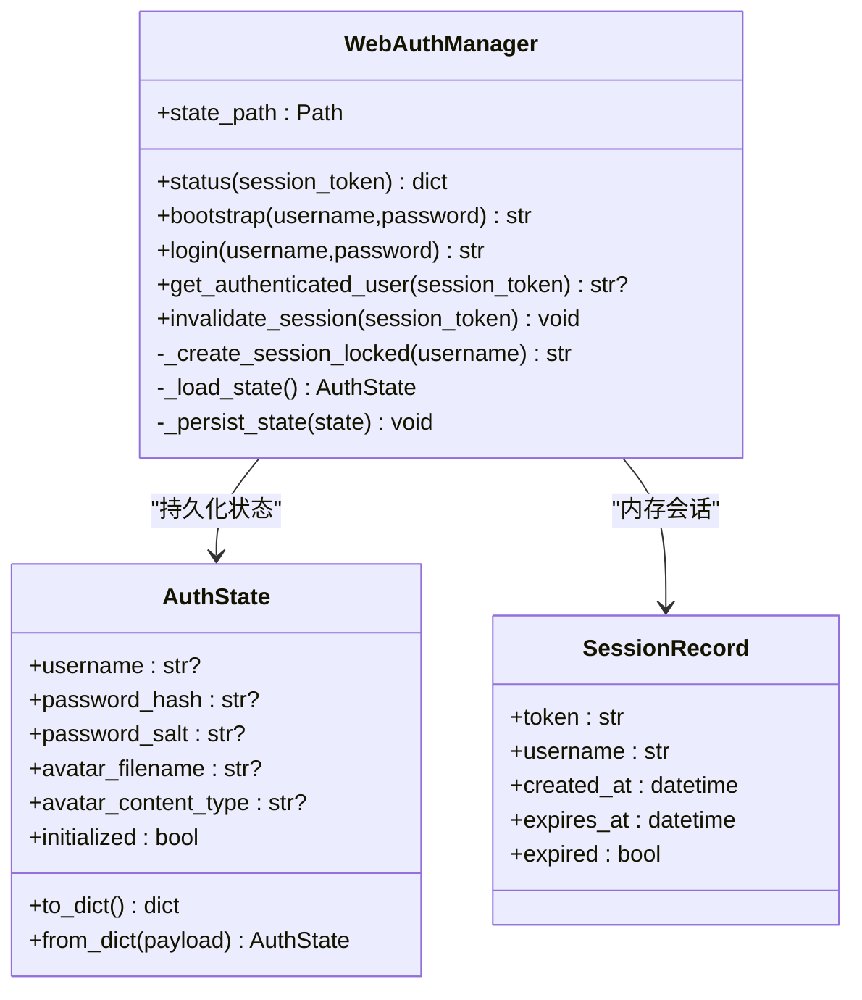
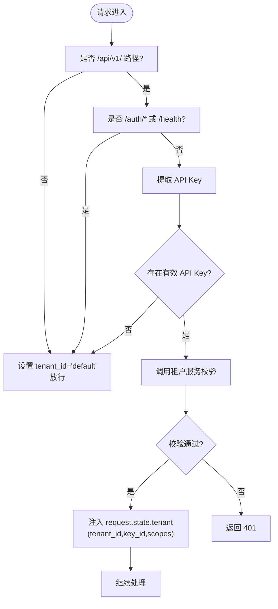
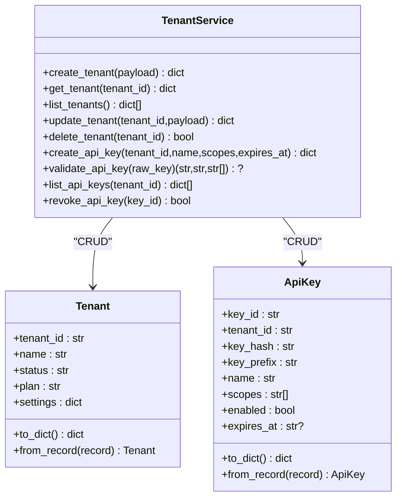
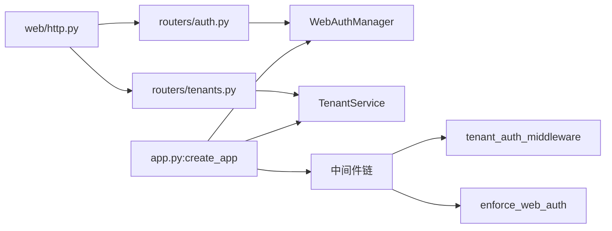

# 认证授权机制

<cite>
**本文档引用的文件**
- [nanobot/web/auth.py](file://nanobot/web/auth.py)
- [nanobot/web/tenant_context.py](file://nanobot/web/tenant_context.py)
- [nanobot/web/app.py](file://nanobot/web/app.py)
- [nanobot/platform/tenants/models.py](file://nanobot/platform/tenants/models.py)
- [nanobot/platform/tenants/service.py](file://nanobot/platform/tenants/service.py)
- [nanobot/web/routers/auth.py](file://nanobot/web/routers/auth.py)
- [nanobot/web/routers/tenants.py](file://nanobot/web/routers/tenants.py)
- [nanobot/web/http.py](file://nanobot/web/http.py)
- [SECURITY.md](file://SECURITY.md)
- [tests/test_multi_tenancy.py](file://tests/test_multi_tenancy.py)
- [tests/test_web_api.py](file://tests/test_web_api.py)
</cite>

## 目录
1. [简介](#简介)
2. [项目结构](#项目结构)
3. [核心组件](#核心组件)
4. [架构总览](#架构总览)
5. [详细组件分析](#详细组件分析)
6. [依赖关系分析](#依赖关系分析)
7. [性能考虑](#性能考虑)
8. [故障排除指南](#故障排除指南)
9. [结论](#结论)

## 简介
本文件系统性阐述 nanobot 的认证授权机制，覆盖多租户上下文管理、用户身份验证与权限控制、API 密钥管理、Cookie 会话与访问控制策略，并结合安全策略与最佳实践进行说明。文档基于仓库中的实际实现进行分析，确保内容与代码一致。

## 项目结构
围绕认证授权的关键模块分布如下：
- Web 层：应用工厂、中间件、路由与 HTTP 响应封装
- 平台层：租户与 API Key 数据模型与服务
- 安全策略：统一的安全政策与最佳实践

**图表来源**
- [nanobot/web/app.py:70-280](file://nanobot/web/app.py#L70-L280)
- [nanobot/web/tenant_context.py:26-92](file://nanobot/web/tenant_context.py#L26-L92)
- [nanobot/web/routers/auth.py:1-220](file://nanobot/web/routers/auth.py#L1-L220)
- [nanobot/web/routers/tenants.py:1-119](file://nanobot/web/routers/tenants.py#L1-L119)
- [nanobot/platform/tenants/models.py:15-100](file://nanobot/platform/tenants/models.py#L15-L100)
- [nanobot/platform/tenants/service.py:43-191](file://nanobot/platform/tenants/service.py#L43-L191)

**章节来源**
- [nanobot/web/app.py:70-280](file://nanobot/web/app.py#L70-L280)
- [nanobot/web/tenant_context.py:26-92](file://nanobot/web/tenant_context.py#L26-L92)
- [nanobot/web/routers/auth.py:1-220](file://nanobot/web/routers/auth.py#L1-L220)
- [nanobot/web/routers/tenants.py:1-119](file://nanobot/web/routers/tenants.py#L1-L119)
- [nanobot/platform/tenants/models.py:15-100](file://nanobot/platform/tenants/models.py#L15-L100)
- [nanobot/platform/tenants/service.py:43-191](file://nanobot/platform/tenants/service.py#L43-L191)

## 核心组件
- WebAuthManager：负责管理员账户初始化、登录校验、密码轮换、头像存储与 Cookie 会话生命周期管理
- 租户上下文中间件：在 API 请求中优先使用 API Key 进行认证，否则回退到 Cookie 认证
- Web 认证中间件：对 /api/v1/ 路径进行统一鉴权，若已由租户中间件注入租户上下文则跳过 Cookie 校验
- 租户服务：提供租户与 API Key 的创建、查询、校验与撤销等操作
- 路由层：暴露认证、个人资料、租户与 API Key 的 REST 接口

**章节来源**
- [nanobot/web/auth.py:129-414](file://nanobot/web/auth.py#L129-L414)
- [nanobot/web/tenant_context.py:26-92](file://nanobot/web/tenant_context.py#L26-L92)
- [nanobot/web/app.py:225-243](file://nanobot/web/app.py#L225-L243)
- [nanobot/platform/tenants/service.py:43-191](file://nanobot/platform/tenants/service.py#L43-L191)
- [nanobot/web/routers/auth.py:87-220](file://nanobot/web/routers/auth.py#L87-L220)
- [nanobot/web/routers/tenants.py:24-119](file://nanobot/web/routers/tenants.py#L24-L119)

## 架构总览
下图展示从请求进入至响应返回的认证授权流程，包括 Cookie 会话与 API Key 两种路径：

**图表来源**
- [nanobot/web/app.py:225-243](file://nanobot/web/app.py#L225-L243)
- [nanobot/web/tenant_context.py:26-92](file://nanobot/web/tenant_context.py#L26-L92)
- [nanobot/web/auth.py:317-346](file://nanobot/web/auth.py#L317-L346)
- [nanobot/platform/tenants/service.py:160-179](file://nanobot/platform/tenants/service.py#L160-L179)

## 详细组件分析

### WebAuthManager（管理员账户与 Cookie 会话）
- 账户初始化与登录：支持首次初始化管理员账户与后续登录；登录时使用 PBKDF2-HMAC-SHA256 进行密码哈希比对，防止侧信道攻击
- 会话管理：内存中维护短期会话，带过期时间；登录成功后写入安全 Cookie
- 个人资料：支持更新用户名/显示名/邮箱，支持头像上传与清理，头像大小与类型限制
- 线程安全：通过 RLock 保证并发安全

**图表来源**
- [nanobot/web/auth.py:129-414](file://nanobot/web/auth.py#L129-L414)

**章节来源**
- [nanobot/web/auth.py:129-414](file://nanobot/web/auth.py#L129-L414)

### 租户上下文中间件（API Key 优先）
- 仅对 /api/v1/ 路径生效，排除 /api/v1/auth/* 与 /api/v1/health
- 优先解析 Authorization: Bearer nk_xxx 或 X-API-Key: nk_xxx
- 通过租户服务校验 API Key，返回 tenant_id、key_id、scopes，并注入 request.state.tenant
- 支持可选的 X-Tenant-Id 头部校验，确保请求方与密钥所属租户一致
- 无 API Key 时注入默认 tenant_id='default'

**图表来源**
- [nanobot/web/tenant_context.py:26-92](file://nanobot/web/tenant_context.py#L26-L92)
- [nanobot/platform/tenants/service.py:160-179](file://nanobot/platform/tenants/service.py#L160-L179)

**章节来源**
- [nanobot/web/tenant_context.py:26-92](file://nanobot/web/tenant_context.py#L26-L92)
- [nanobot/platform/tenants/service.py:160-179](file://nanobot/platform/tenants/service.py#L160-L179)

### Web 认证中间件（Cookie 会话）
- 对 /api/v1/ 路径进行统一鉴权
- 排除 OPTIONS 预检、/api/v1/auth/* 与 /api/v1/health
- 若请求已由租户中间件注入 tenant.key_id，则跳过 Cookie 校验
- 否则读取 Cookie 中的会话令牌，调用 WebAuthManager 校验用户身份

**章节来源**
- [nanobot/web/app.py:225-243](file://nanobot/web/app.py#L225-L243)

### 租户与 API Key 服务
- 租户模型：包含 tenant_id、名称、状态、套餐、设置等字段
- API Key 模型：包含 key_id、tenant_id、key_hash、key_prefix、名称、作用域、启用状态、过期时间等
- 租户服务：
  - 创建租户：自动生成唯一 tenant_id，避免冲突
  - API Key 创建：生成原始密钥、哈希、前缀与 key_id，返回原始密钥供客户端保存
  - API Key 校验：验证启用状态、过期时间与最后使用时间更新
  - 列表与撤销：按租户列出 API Key，按 key_id 撤销

**图表来源**
- [nanobot/platform/tenants/models.py:15-100](file://nanobot/platform/tenants/models.py#L15-L100)
- [nanobot/platform/tenants/service.py:43-191](file://nanobot/platform/tenants/service.py#L43-L191)

**章节来源**
- [nanobot/platform/tenants/models.py:15-100](file://nanobot/platform/tenants/models.py#L15-L100)
- [nanobot/platform/tenants/service.py:43-191](file://nanobot/platform/tenants/service.py#L43-L191)

### 路由层（认证与租户）
- 认证路由：/api/v1/auth/status、/api/v1/auth/bootstrap、/api/v1/auth/login、/api/v1/auth/logout、/api/v1/profile、/api/v1/profile/password、/api/v1/profile/avatar
- 租户路由：/api/v1/tenants、/api/v1/tenants/{tenant_id}、/api/v1/tenants/{tenant_id}/api-keys、/api/v1/api-keys/{key_id}

**章节来源**
- [nanobot/web/routers/auth.py:87-220](file://nanobot/web/routers/auth.py#L87-L220)
- [nanobot/web/routers/tenants.py:24-119](file://nanobot/web/routers/tenants.py#L24-L119)

## 依赖关系分析
- 应用工厂在启动时装配 WebAuthManager、租户服务等组件，并注册中间件与路由
- 路由层通过 request.app.state 获取服务实例
- 中间件通过 request.state.tenant 传递租户上下文
- HTTP 工具提供统一的响应格式与错误封装

**图表来源**
- [nanobot/web/app.py:70-280](file://nanobot/web/app.py#L70-L280)
- [nanobot/web/routers/auth.py:1-220](file://nanobot/web/routers/auth.py#L1-L220)
- [nanobot/web/routers/tenants.py:1-119](file://nanobot/web/routers/tenants.py#L1-L119)
- [nanobot/web/http.py:11-40](file://nanobot/web/http.py#L11-L40)

**章节来源**
- [nanobot/web/app.py:70-280](file://nanobot/web/app.py#L70-L280)
- [nanobot/web/routers/auth.py:1-220](file://nanobot/web/routers/auth.py#L1-L220)
- [nanobot/web/routers/tenants.py:1-119](file://nanobot/web/routers/tenants.py#L1-L119)
- [nanobot/web/http.py:11-40](file://nanobot/web/http.py#L11-L40)

## 性能考虑
- 会话存储：内存会话适合单实例部署，若需横向扩展建议迁移到分布式缓存（如 Redis）以共享会话状态
- API Key 校验：哈希查找与过期时间判断为 O(1)，性能开销低；建议对频繁调用的接口增加缓存层
- 密码哈希：PBKDF2 迭代次数较高，登录校验有一定 CPU 开销，建议在高并发场景评估硬件资源或引入异步处理
- 文件上传：头像上传有大小与类型限制，避免大文件占用磁盘空间；建议配合 CDN 或对象存储优化静态资源访问

[本节为通用指导，不直接分析具体文件]

## 故障排除指南
- 401 未认证
  - 检查是否正确设置 Cookie 或携带 API Key
  - 确认租户中间件是否正确注入 tenant 上下文
  - 参考测试用例验证登录流程
- 403 权限不足
  - 检查 API Key 所属租户与请求头 X-Tenant-Id 是否一致
- 409 资源冲突/未初始化
  - 首次使用需先执行初始化；确认管理员账户状态
- 400 参数校验失败
  - 检查用户名、密码、邮箱、头像等输入参数长度与格式

**章节来源**
- [nanobot/web/app.py:225-243](file://nanobot/web/app.py#L225-L243)
- [nanobot/web/tenant_context.py:74-81](file://nanobot/web/tenant_context.py#L74-L81)
- [tests/test_web_api.py:152-187](file://tests/test_web_api.py#L152-L187)

## 结论
本认证授权体系采用“API Key 优先 + Cookie 回退”的双轨制，既满足 API 场景的强安全要求，又兼容 Web 管理界面的会话体验。租户与 API Key 的设计实现了多租户隔离与细粒度权限控制，结合安全策略与最佳实践，可在生产环境中提供可靠的访问控制保障。建议在高并发与多实例部署场景下进一步完善会话共享与缓存策略，并持续关注安全更新与审计日志建设。