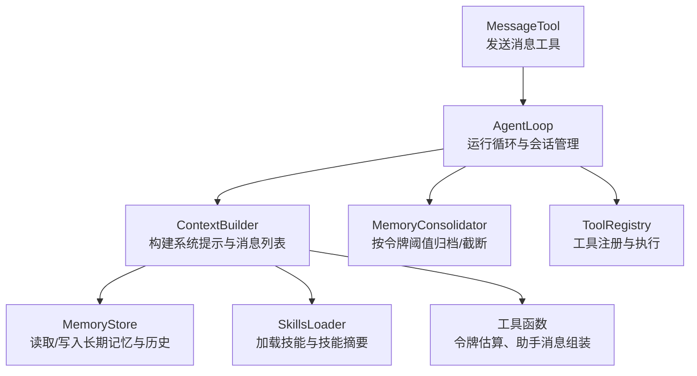
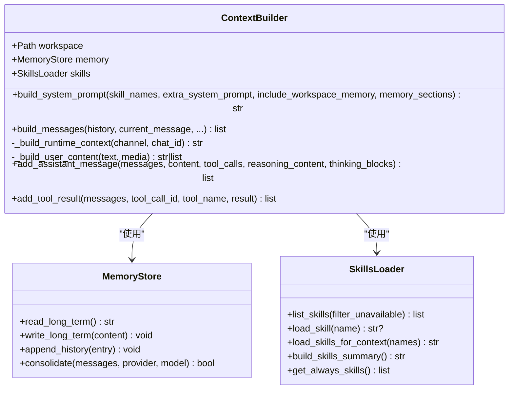
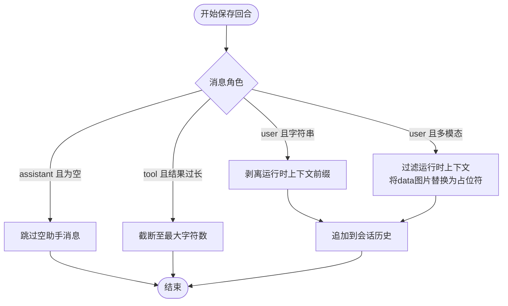
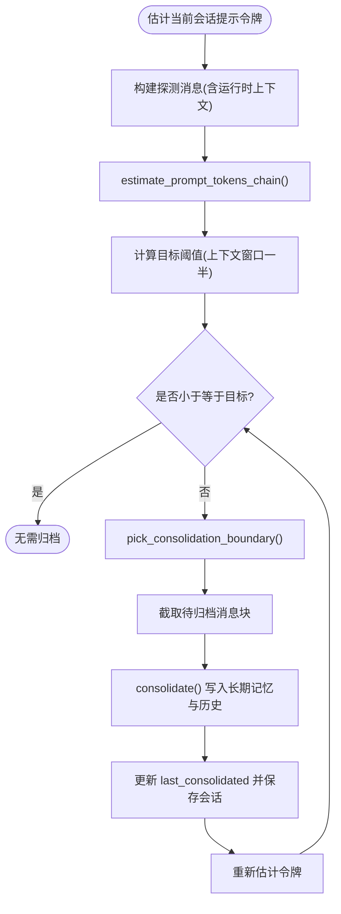
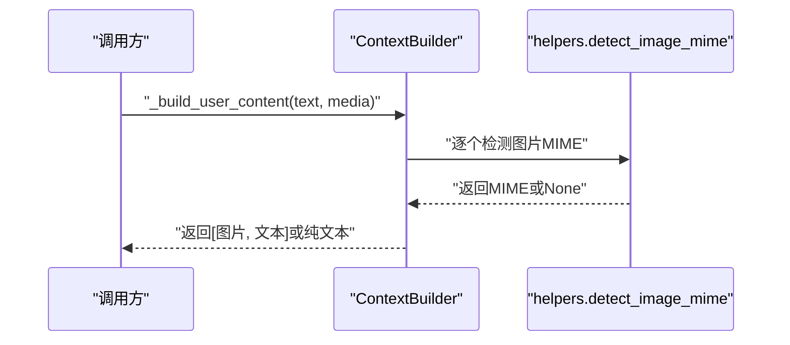
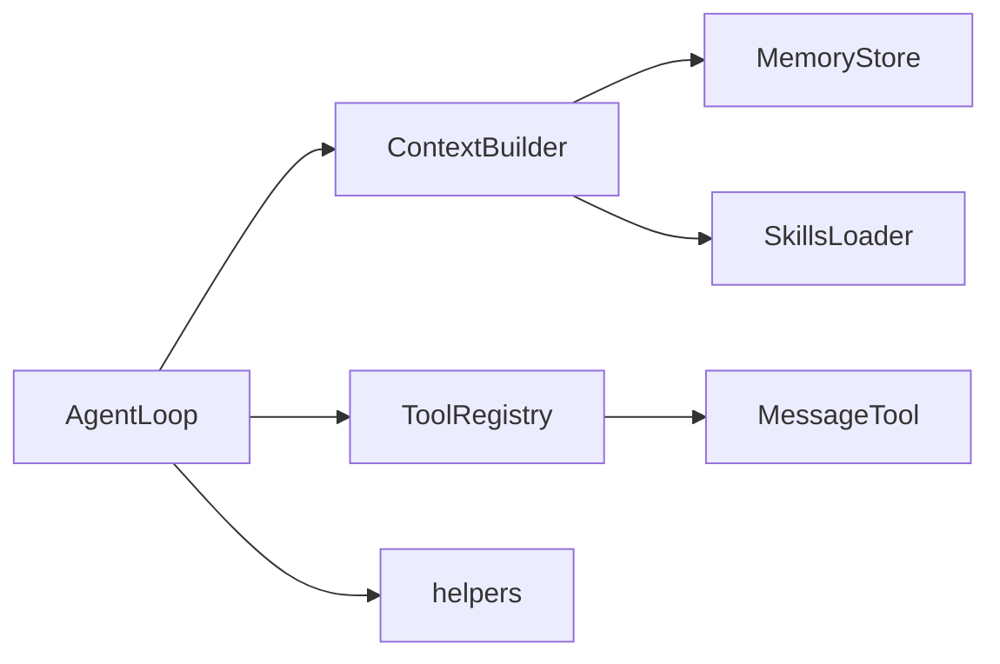

# 上下文构建器

<cite>
**本文引用的文件**
- [nanobot/agent/context.py](file://nanobot/agent/context.py)
- [nanobot/agent/memory.py](file://nanobot/agent/memory.py)
- [nanobot/agent/skills.py](file://nanobot/agent/skills.py)
- [nanobot/utils/helpers.py](file://nanobot/utils/helpers.py)
- [nanobot/agent/loop.py](file://nanobot/agent/loop.py)
- [nanobot/agent/tools/message.py](file://nanobot/agent/tools/message.py)
- [nanobot/agent/tools/base.py](file://nanobot/agent/tools/base.py)
- [nanobot/agent/tools/registry.py](file://nanobot/agent/tools/registry.py)
- [tests/test_context_prompt_cache.py](file://tests/test_context_prompt_cache.py)
- [tests/test_loop_save_turn.py](file://tests/test_loop_save_turn.py)
- [nanobot/templates/AGENTS.md](file://nanobot/templates/AGENTS.md)
- [nanobot/templates/SOUL.md](file://nanobot/templates/SOUL.md)
- [nanobot/templates/USER.md](file://nanobot/templates/USER.md)
- [nanobot/templates/TOOLS.md](file://nanobot/templates/TOOLS.md)
</cite>

## 目录
1. [引言](#引言)
2. [项目结构](#项目结构)
3. [核心组件](#核心组件)
4. [架构总览](#架构总览)
5. [详细组件分析](#详细组件分析)
6. [依赖关系分析](#依赖关系分析)
7. [性能考量](#性能考量)
8. [故障排查指南](#故障排查指南)
9. [结论](#结论)
10. [附录](#附录)

## 引言
本文件面向“上下文构建器”的技术文档，聚焦于 ContextBuilder 类如何将历史消息、技能信息、工作空间记忆与额外系统提示词整合为完整的 LLM 输入上下文；并深入解释消息格式化规则、令牌估算与窗口优化策略、多模态内容处理（文本、图像等）、RUNTIME_CONTEXT_TAG 的作用机制、内存片段处理与技能注入流程。文档同时提供可操作的扩展建议与常见问题排查方法。

## 项目结构
围绕上下文构建器的关键模块与文件如下：
- 上下文构建：nanobot/agent/context.py
- 记忆与令牌估算：nanobot/agent/memory.py、nanobot/utils/helpers.py
- 技能加载与摘要：nanobot/agent/skills.py
- 运行时集成：nanobot/agent/loop.py
- 工具体系：nanobot/agent/tools/*（message、base、registry）
- 测试用例：tests/test_context_prompt_cache.py、tests/test_loop_save_turn.py
- 模板文件：nanobot/templates/*.md（AGENTS.md、SOUL.md、USER.md、TOOLS.md）



图表来源
- [nanobot/agent/context.py:16-227](file://nanobot/agent/context.py#L16-L227)
- [nanobot/agent/memory.py:60-285](file://nanobot/agent/memory.py#L60-L285)
- [nanobot/agent/skills.py:13-229](file://nanobot/agent/skills.py#L13-L229)
- [nanobot/utils/helpers.py:75-171](file://nanobot/utils/helpers.py#L75-L171)
- [nanobot/agent/loop.py:35-129](file://nanobot/agent/loop.py#L35-L129)
- [nanobot/agent/tools/message.py:9-110](file://nanobot/agent/tools/message.py#L9-L110)
- [nanobot/agent/tools/registry.py:8-71](file://nanobot/agent/tools/registry.py#L8-L71)

章节来源
- [nanobot/agent/context.py:16-227](file://nanobot/agent/context.py#L16-L227)
- [nanobot/agent/memory.py:60-285](file://nanobot/agent/memory.py#L60-L285)
- [nanobot/agent/skills.py:13-229](file://nanobot/agent/skills.py#L13-L229)
- [nanobot/utils/helpers.py:75-171](file://nanobot/utils/helpers.py#L75-L171)
- [nanobot/agent/loop.py:35-129](file://nanobot/agent/loop.py#L35-L129)
- [nanobot/agent/tools/message.py:9-110](file://nanobot/agent/tools/message.py#L9-L110)
- [nanobot/agent/tools/registry.py:8-71](file://nanobot/agent/tools/registry.py#L8-L71)

## 核心组件
- ContextBuilder：负责拼装系统提示与消息列表，支持运行时上下文注入、多模态用户内容、技能注入与工作空间记忆。
- MemoryStore/MemoryConsolidator：负责长期记忆与历史日志的读写、会话消息的归档与令牌估算。
- SkillsLoader：负责技能发现、加载、摘要生成与“始终启用”技能筛选。
- 工具与令牌估算：helpers 提供令牌估算、助手消息组装；loop 负责在运行时调用构建器并进行会话持久化与截断。
- MessageTool：用于发送消息，支持媒体附件（图片等），并与上下文构建器的多模态处理配合。

章节来源
- [nanobot/agent/context.py:16-227](file://nanobot/agent/context.py#L16-L227)
- [nanobot/agent/memory.py:60-285](file://nanobot/agent/memory.py#L60-L285)
- [nanobot/agent/skills.py:13-229](file://nanobot/agent/skills.py#L13-L229)
- [nanobot/utils/helpers.py:75-171](file://nanobot/utils/helpers.py#L75-L171)
- [nanobot/agent/loop.py:35-129](file://nanobot/agent/loop.py#L35-L129)
- [nanobot/agent/tools/message.py:9-110](file://nanobot/agent/tools/message.py#L9-L110)

## 架构总览
以下序列图展示了从接收消息到构建完整上下文并调用模型的核心流程：

```mermaid
sequenceDiagram
participant Bus as "消息总线"
participant Loop as "AgentLoop"
participant Ctx as "ContextBuilder"
participant Mem as "MemoryConsolidator"
participant Prov as "LLMProvider"
participant Tools as "ToolRegistry"
Bus->>Loop : "收到入站消息"
Loop->>Mem : "maybe_consolidate_by_tokens()"
Mem-->>Loop : "会话消息已按令牌阈值优化"
Loop->>Ctx : "build_messages(history, current, ...)"
Ctx-->>Loop : "返回系统提示 + 历史 + 用户消息"
Loop->>Prov : "chat_with_retry(messages, tools)"
Prov-->>Loop : "响应(含内容/工具调用)"
alt "存在工具调用"
Loop->>Tools : "execute(tool_call)"
Tools-->>Loop : "工具结果"
Loop->>Ctx : "add_tool_result()/add_assistant_message()"
Loop->>Prov : "继续对话直至完成"
else "无工具调用"
Loop->>Ctx : "add_assistant_message()"
end
Loop->>Loop : "_save_turn()持久化并截断过长结果"
Loop-->>Bus : "发送出站消息"
```

图表来源
- [nanobot/agent/loop.py:371-485](file://nanobot/agent/loop.py#L371-L485)
- [nanobot/agent/context.py:145-180](file://nanobot/agent/context.py#L145-L180)
- [nanobot/agent/memory.py:19-285](file://nanobot/agent/memory.py#L19-L285)

## 详细组件分析

### ContextBuilder：系统提示与消息构建
- 系统提示组成
  - 核心身份段：包含运行环境、工作区路径、平台策略与行为准则。
  - 启动模板：从工作区模板加载 AGENTS.md、SOUL.md、USER.md、TOOLS.md 并拼接。
  - 额外系统提示：允许外部注入个性化或任务特定的系统指令。
  - 工作区共享记忆：可选择性地将 MEMORY.md 内容作为“记忆”章节加入。
  - 自定义记忆分节：支持传入标题-内容对，形成独立记忆块。
  - 活跃技能：根据传入技能名与“始终启用”技能，加载对应 SKILL.md 并汇总。
  - 技能摘要：输出技能清单（含可用性、描述、位置等），便于按需加载。
- 消息构建
  - 运行时上下文：通过 _build_runtime_context 生成不可信元数据块，包含当前时间、时区、渠道与聊天 ID。
  - 用户内容合并：将运行时上下文与用户文本/多模态内容合并为单条用户消息，避免连续相同角色消息导致某些提供商拒绝。
  - 多模态支持：当存在媒体时，将图片以 data URL 形式嵌入，文本后置；若仅包含运行时上下文，则不保存空用户消息。
- 助手消息与工具结果
  - 支持添加助手消息（可带 reasoning/thinking 字段）与工具结果消息，保证消息序列完整性。



图表来源
- [nanobot/agent/context.py:16-227](file://nanobot/agent/context.py#L16-L227)
- [nanobot/agent/memory.py:60-147](file://nanobot/agent/memory.py#L60-L147)
- [nanobot/agent/skills.py:13-229](file://nanobot/agent/skills.py#L13-L229)

章节来源
- [nanobot/agent/context.py:27-78](file://nanobot/agent/context.py#L27-L78)
- [nanobot/agent/context.py:145-180](file://nanobot/agent/context.py#L145-L180)
- [nanobot/agent/context.py:182-203](file://nanobot/agent/context.py#L182-L203)
- [nanobot/agent/context.py:204-227](file://nanobot/agent/context.py#L204-L227)

### RUNTIME_CONTEXT_TAG 机制与内存片段处理
- RUNTIME_CONTEXT_TAG 作用
  - 作为运行时元数据的标记前缀，用于区分“系统提示中的元数据块”与“用户输入内容”，并在保存回合时进行剥离或替换。
  - 在消息构建阶段，运行时上下文被合并进用户消息，确保提供商会接受该消息序列。
- 内存片段处理
  - 保存回合时，若用户消息仅包含运行时上下文，将被忽略，避免污染会话历史。
  - 若用户消息包含多模态内容且包含 data URL 图片，保存时会将图片占位为“[image]”，以减少令牌占用并保护隐私。
- 技能注入流程
  - 通过 SkillsLoader 加载指定技能与“始终启用”技能，去除重复后统一注入到系统提示中。



图表来源
- [nanobot/agent/loop.py:487-521](file://nanobot/agent/loop.py#L487-L521)
- [nanobot/agent/context.py:20-21](file://nanobot/agent/context.py#L20-L21)

章节来源
- [nanobot/agent/loop.py:487-521](file://nanobot/agent/loop.py#L487-L521)
- [tests/test_loop_save_turn.py:12-55](file://tests/test_loop_save_turn.py#L12-L55)

### 令牌计算机制与上下文窗口优化
- 令牌估算
  - helpers 提供 estimate_prompt_tokens 与 estimate_message_tokens，基于 tiktoken 编码估算消息或提示的令牌数。
  - estimate_prompt_tokens_chain 优先尝试提供方自带计数器，失败则回退到 tiktoken。
- 会话优化
  - MemoryConsolidator 依据上下文窗口令牌阈值，选择合适的用户回合边界进行归档，使当前提示大小不超过目标阈值的一半。
  - 通过 pick_consolidation_boundary 逐步累加旧消息令牌，找到安全的截断点；archive_unconsolidated 可一次性归档未合并尾部。



图表来源
- [nanobot/agent/memory.py:19-285](file://nanobot/agent/memory.py#L19-L285)
- [nanobot/utils/helpers.py:92-171](file://nanobot/utils/helpers.py#L92-L171)
- [nanobot/agent/loop.py:119-127](file://nanobot/agent/loop.py#L119-L127)

章节来源
- [nanobot/utils/helpers.py:92-171](file://nanobot/utils/helpers.py#L92-L171)
- [nanobot/agent/memory.py:19-285](file://nanobot/agent/memory.py#L19-L285)
- [nanobot/agent/loop.py:119-127](file://nanobot/agent/loop.py#L119-L127)

### 多模态内容处理（文本、图像、媒体）
- 用户内容构建
  - 当传入媒体列表时，遍历文件，检测真实 MIME 类型（优先魔数），将图片以 data URL 形式嵌入，文本置于末尾。
  - 若无有效媒体，直接返回纯文本。
- 运行时上下文合并
  - 将 RUNTIME_CONTEXT_TAG 与用户文本合并为单一用户消息，避免提供方拒绝连续相同角色消息。
- 保存回合时的多模态处理
  - 过滤掉运行时上下文片段；
  - 将 data URL 图片替换为占位符“[image]”。



图表来源
- [nanobot/agent/context.py:182-203](file://nanobot/agent/context.py#L182-L203)
- [nanobot/utils/helpers.py:12-23](file://nanobot/utils/helpers.py#L12-L23)

章节来源
- [nanobot/agent/context.py:182-203](file://nanobot/agent/context.py#L182-L203)
- [nanobot/utils/helpers.py:12-23](file://nanobot/utils/helpers.py#L12-L23)
- [tests/test_context_prompt_cache.py:50-74](file://tests/test_context_prompt_cache.py#L50-L74)

### 特殊消息类型与工具集成
- MessageTool
  - 支持发送消息到指定渠道与聊天 ID，并可附加媒体（如图片）。
  - 在 AgentLoop 中设置工具上下文（通道、聊天 ID、消息 ID），以便路由与跟踪。
- 工具注册与执行
  - ToolRegistry 统一注册与执行工具，支持参数类型转换与校验，返回结果或错误提示。
- 助手消息组装
  - build_assistant_message 支持 content、tool_calls、reasoning_content、thinking_blocks，确保不同模型兼容。

章节来源
- [nanobot/agent/tools/message.py:9-110](file://nanobot/agent/tools/message.py#L9-L110)
- [nanobot/agent/tools/registry.py:8-71](file://nanobot/agent/tools/registry.py#L8-L71)
- [nanobot/utils/helpers.py:75-89](file://nanobot/utils/helpers.py#L75-L89)
- [nanobot/agent/loop.py:183-200](file://nanobot/agent/loop.py#L183-L200)

## 依赖关系分析
- ContextBuilder 依赖 MemoryStore 与 SkillsLoader 获取工作区记忆与技能内容。
- AgentLoop 在运行时调用 ContextBuilder 构建消息，并通过 MemoryConsolidator 控制上下文长度。
- 工具链由 ToolRegistry 管理，MessageTool 与其它工具共同构成能力边界。
- helpers 提供令牌估算与消息组装工具，贯穿上下文构建与运行时处理。



图表来源
- [nanobot/agent/loop.py:35-129](file://nanobot/agent/loop.py#L35-L129)
- [nanobot/agent/context.py:16-26](file://nanobot/agent/context.py#L16-L26)
- [nanobot/agent/tools/registry.py:8-71](file://nanobot/agent/tools/registry.py#L8-L71)
- [nanobot/agent/tools/message.py:9-110](file://nanobot/agent/tools/message.py#L9-L110)
- [nanobot/utils/helpers.py:75-171](file://nanobot/utils/helpers.py#L75-L171)

章节来源
- [nanobot/agent/loop.py:35-129](file://nanobot/agent/loop.py#L35-L129)
- [nanobot/agent/context.py:16-26](file://nanobot/agent/context.py#L16-L26)
- [nanobot/agent/tools/registry.py:8-71](file://nanobot/agent/tools/registry.py#L8-L71)
- [nanobot/agent/tools/message.py:9-110](file://nanobot/agent/tools/message.py#L9-L110)
- [nanobot/utils/helpers.py:75-171](file://nanobot/utils/helpers.py#L75-L171)

## 性能考量
- 令牌估算优先使用提供方计数器，回退到 tiktoken，兼顾准确性与性能。
- 通过“半窗口阈值”策略控制会话长度，避免频繁触发大提示带来的延迟与成本上升。
- 多模态图片在保存回合时替换为占位符，显著降低令牌开销。
- 工具结果超过阈值自动截断，防止历史过长影响上下文质量。

## 故障排查指南
- 系统提示不稳定（时间变化）
  - 测试验证：系统提示应不受墙钟分钟变化影响，确保缓存友好。
  - 排查要点：确认运行时上下文是否被正确合并到用户消息而非系统提示。
- 运行时上下文未生效
  - 确认 build_messages 是否传入 channel 与 chat_id；检查 RUNTIME_CONTEXT_TAG 是否出现在最终用户消息中。
- 多模态图片未显示
  - 确认媒体路径存在且为图片；检查 MIME 类型检测是否成功；保存回合时会将 data URL 替换为占位符，属预期行为。
- 令牌估算异常
  - 检查 estimate_prompt_tokens_chain 的回退路径是否被触发；必要时在提供方层面对齐计数器。

章节来源
- [tests/test_context_prompt_cache.py:34-74](file://tests/test_context_prompt_cache.py#L34-L74)
- [tests/test_loop_save_turn.py:12-55](file://tests/test_loop_save_turn.py#L12-L55)
- [nanobot/utils/helpers.py:151-171](file://nanobot/utils/helpers.py#L151-L171)

## 结论
ContextBuilder 将系统提示、历史消息、工作区记忆、技能与运行时上下文有机整合，形成稳定、可缓存且对多模态友好的 LLM 输入。结合 MemoryConsolidator 的令牌阈值控制与工具链的规范化执行，整体具备良好的可扩展性与工程稳定性。通过 RUNTIME_CONTEXT_TAG 与保存回合策略，既保障了上下文质量，又避免了隐私与冗余问题。

## 附录
- 模板文件（启动模板）
  - AGENTS.md：代理指令与提醒机制说明
  - SOUL.md：个性与价值观
  - USER.md：用户画像与偏好
  - TOOLS.md：工具使用注意事项与限制
- 自定义上下文构建建议
  - 扩展 build_system_prompt 的 memory_sections 参数，注入领域知识或任务上下文。
  - 使用 extra_system_prompt 注入临时指令，注意与 RUNTIME_CONTEXT_TAG 的分离。
  - 对多模态场景，建议在调用前预处理媒体，确保 MIME 正确与大小可控。

章节来源
- [nanobot/templates/AGENTS.md:1-22](file://nanobot/templates/AGENTS.md#L1-L22)
- [nanobot/templates/SOUL.md:1-22](file://nanobot/templates/SOUL.md#L1-L22)
- [nanobot/templates/USER.md:1-50](file://nanobot/templates/USER.md#L1-L50)
- [nanobot/templates/TOOLS.md:1-16](file://nanobot/templates/TOOLS.md#L1-L16)