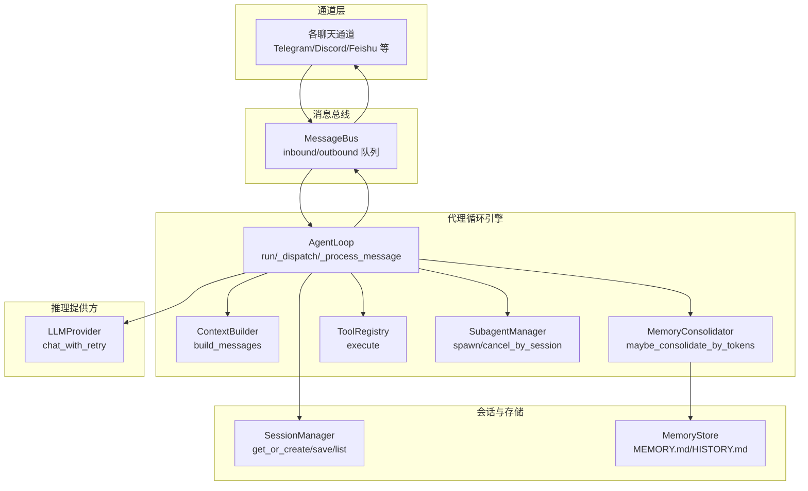
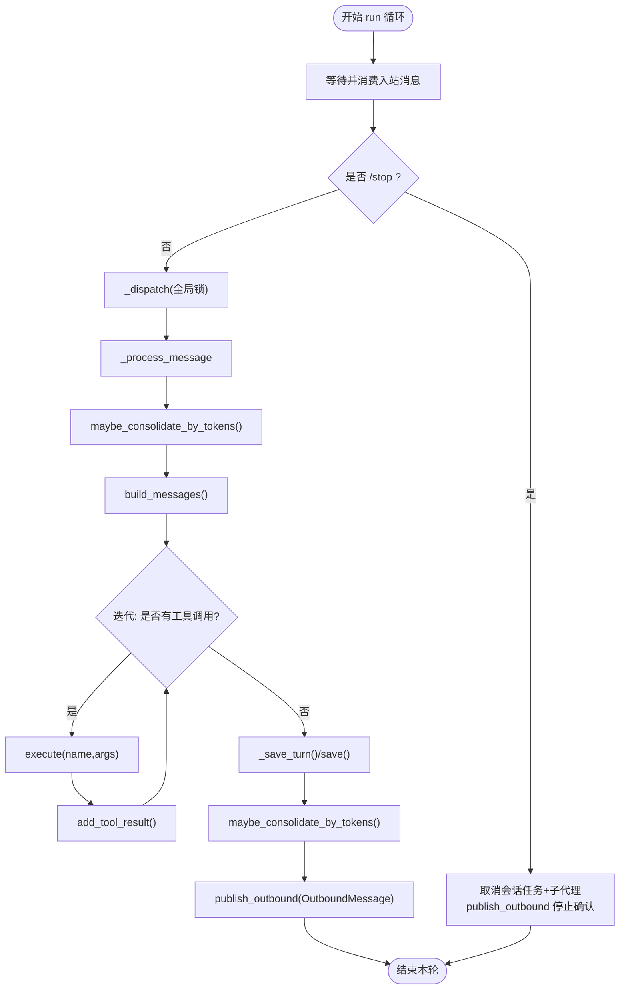
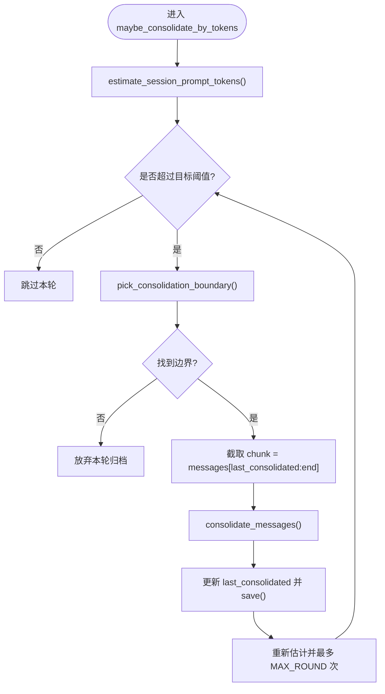
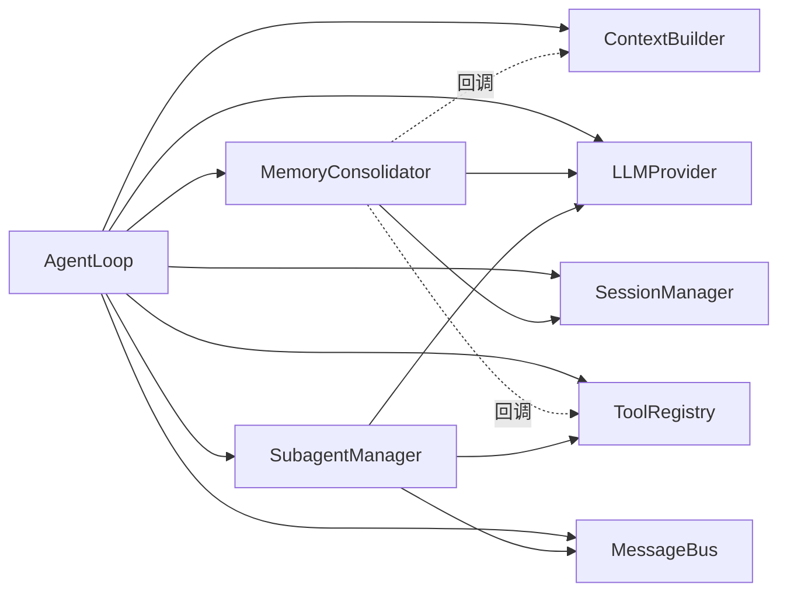

# 代理循环引擎

<cite>
**本文引用的文件**
- [nanobot/agent/loop.py](file://nanobot/agent/loop.py)
- [nanobot/agent/context.py](file://nanobot/agent/context.py)
- [nanobot/agent/memory.py](file://nanobot/agent/memory.py)
- [nanobot/agent/subagent.py](file://nanobot/agent/subagent.py)
- [nanobot/agent/tools/registry.py](file://nanobot/agent/tools/registry.py)
- [nanobot/agent/tools/base.py](file://nanobot/agent/tools/base.py)
- [nanobot/agent/tools/message.py](file://nanobot/agent/tools/message.py)
- [nanobot/agent/tools/spawn.py](file://nanobot/agent/tools/spawn.py)
- [nanobot/session/manager.py](file://nanobot/session/manager.py)
- [nanobot/bus/queue.py](file://nanobot/bus/queue.py)
- [nanobot/providers/base.py](file://nanobot/providers/base.py)
- [nanobot/web/runtime_services/channel_runtime.py](file://nanobot/web/runtime_services/channel_runtime.py)
- [nanobot/cli/commands.py](file://nanobot/cli/commands.py)
- [tests/test_task_cancel.py](file://tests/test_task_cancel.py)
- [tests/test_provider_retry.py](file://tests/test_provider_retry.py)
</cite>

## 目录
1. [简介](#简介)
2. [项目结构](#项目结构)
3. [核心组件](#核心组件)
4. [架构总览](#架构总览)
5. [详细组件分析](#详细组件分析)
6. [依赖分析](#依赖分析)
7. [性能考虑](#性能考虑)
8. [故障排查指南](#故障排查指南)
9. [结论](#结论)
10. [附录：扩展与自定义示例路径](#附录扩展与自定义示例路径)

## 简介
本文件系统性阐述代理循环引擎（AgentLoop）的技术实现与运行机制，覆盖消息接收、上下文构建、LLM 调用、工具执行、响应发送的完整闭环；解释生命周期管理、会话处理、任务调度与并发控制；阐明上下文构建器、内存整合器与子代理管理器的协作关系；并给出异步处理模式、错误处理策略与性能优化建议。同时提供可直接定位到源码的示例路径，便于扩展与自定义。

## 项目结构
代理循环引擎位于 nanobot/agent/loop.py，围绕消息总线、会话管理、工具注册表、上下文构建器、内存整合器与子代理管理器协同工作，形成“通道输入 → 消息分发 → 上下文构建 → LLM 推理 → 工具调用 → 结果回写 → 响应输出”的流水线。



图表来源
- [nanobot/agent/loop.py:289-370](file://nanobot/agent/loop.py#L289-L370)
- [nanobot/bus/queue.py:8-45](file://nanobot/bus/queue.py#L8-L45)
- [nanobot/agent/context.py:145-180](file://nanobot/agent/context.py#L145-L180)
- [nanobot/agent/memory.py:149-285](file://nanobot/agent/memory.py#L149-L285)
- [nanobot/agent/tools/registry.py:8-71](file://nanobot/agent/tools/registry.py#L8-L71)
- [nanobot/agent/subagent.py:28-120](file://nanobot/agent/subagent.py#L28-L120)
- [nanobot/session/manager.py:73-212](file://nanobot/session/manager.py#L73-L212)
- [nanobot/providers/base.py:69-271](file://nanobot/providers/base.py#L69-L271)

章节来源
- [nanobot/agent/loop.py:35-129](file://nanobot/agent/loop.py#L35-L129)
- [nanobot/bus/queue.py:8-45](file://nanobot/bus/queue.py#L8-L45)
- [nanobot/agent/context.py:16-26](file://nanobot/agent/context.py#L16-L26)
- [nanobot/agent/memory.py:60-83](file://nanobot/agent/memory.py#L60-L83)
- [nanobot/agent/subagent.py:28-54](file://nanobot/agent/subagent.py#L28-L54)
- [nanobot/session/manager.py:73-114](file://nanobot/session/manager.py#L73-L114)
- [nanobot/providers/base.py:69-99](file://nanobot/providers/base.py#L69-L99)

## 核心组件
- AgentLoop：代理循环主控，负责消息消费、并发调度、生命周期控制、命令处理、MCP 连接与资源清理。
- ContextBuilder：构建系统提示词与消息列表，注入运行时上下文、技能与长期记忆，避免连续相同角色消息。
- MemoryConsolidator：按令牌预算策略选择旧轮次进行归档，维护会话内历史上限，降低上下文开销。
- ToolRegistry：动态注册与执行工具，参数类型转换与校验，统一 OpenAI 函数格式。
- SubagentManager：后台子代理任务编排，支持取消、运行记录与结果回传。
- SessionManager：会话持久化与缓存，JSONL 存储，支持迁移与元数据合并。
- MessageBus：异步队列解耦通道与代理，提供入站/出站消息发布与消费。
- LLMProvider：抽象推理接口，统一重试策略与请求清洗，屏蔽不同提供商差异。

章节来源
- [nanobot/agent/loop.py:35-129](file://nanobot/agent/loop.py#L35-L129)
- [nanobot/agent/context.py:16-26](file://nanobot/agent/context.py#L16-L26)
- [nanobot/agent/memory.py:149-172](file://nanobot/agent/memory.py#L149-L172)
- [nanobot/agent/tools/registry.py:8-40](file://nanobot/agent/tools/registry.py#L8-L40)
- [nanobot/agent/subagent.py:28-54](file://nanobot/agent/subagent.py#L28-L54)
- [nanobot/session/manager.py:73-114](file://nanobot/session/manager.py#L73-L114)
- [nanobot/bus/queue.py:8-45](file://nanobot/bus/queue.py#L8-L45)
- [nanobot/providers/base.py:69-99](file://nanobot/providers/base.py#L69-L99)

## 架构总览
代理循环采用“事件驱动 + 并发控制 + 令牌预算”的设计，确保在多通道、多会话并发场景下的稳定性与性能。

```mermaid
sequenceDiagram
    participant CH as "通道"
    participant BUS as "MessageBus"
    participant LOOP as "AgentLoop"
    participant CTX as "ContextBuilder"
    participant CONS as "MemoryConsolidator"
    participant REG as "ToolRegistry"
    participant LLM as "LLMProvider"
    
    CH->>BUS: "入站消息(InboundMessage)"
    BUS->>LOOP: "consume_inbound()"
    LOOP->>LOOP: "_dispatch(全局锁+会话级路由)"
    LOOP->>CONS: "maybe_consolidate_by_tokens()"
    LOOP->>CTX: "build_messages(history,current,skills,memory)"
    LOOP->>LLM: "chat_with_retry(messages,tools,model)"
    alt "返回工具调用"
        LLM->>LOOP: "ToolCallRequest[]"
        LOOP->>REG: "execute(name,args)"
        REG->>LOOP: "执行结果"
        LOOP->>CTX: "add_tool_result()/add_assistant_message()"
        LOOP->>LLM: "继续迭代直到无工具调用"
    else "返回最终内容"
        LLM->>LOOP: "content"
    end
    LOOP->>LOOP: "_save_turn()/sessions.save()"
    LOOP->>BUS: "publish_outbound(OutboundMessage)"
    BUS->>CH: "出站消息"
```

图表来源
- [nanobot/agent/loop.py:289-370](file://nanobot/agent/loop.py#L289-L370)
- [nanobot/agent/context.py:145-180](file://nanobot/agent/context.py#L145-L180)
- [nanobot/agent/memory.py:229-285](file://nanobot/agent/memory.py#L229-L285)
- [nanobot/agent/tools/registry.py:38-59](file://nanobot/agent/tools/registry.py#L38-L59)
- [nanobot/providers/base.py:192-265](file://nanobot/providers/base.py#L192-L265)
- [nanobot/bus/queue.py:20-34](file://nanobot/bus/queue.py#L20-L34)

## 详细组件分析

### AgentLoop：消息循环与生命周期
- 生命周期
  - run：持续从消息总线消费消息，对 /stop 命令即时中断当前会话所有任务与子代理。
  - stop/close_mcp：优雅停止循环并关闭 MCP 连接。
- 并发与调度
  - 使用全局锁保证同一会话的消息串行处理，避免上下文污染。
  - 将每个入站消息封装为任务加入会话级任务列表，支持 /stop 取消。
- 命令与路由
  - 支持 /new 清空会话并归档未整合的历史。
  - 支持 /help 展示可用命令。
  - 支持通过 channel_dispatcher 进行通道级路由，优先走特定通道处理管线。
- MCP 连接
  - 懒加载连接 MCP 服务器，失败不阻塞主循环，下次消息再尝试。
- 上下文与工具
  - 注册默认工具集（文件系统、Web 搜索/抓取、消息发送、Spawn、Cron 等），并根据 allowlist 过滤。
  - 设置工具上下文（channel/chat_id/message_id/run_context），保障消息发送与子代理溯源。
- 进度回调
  - 在工具调用前向通道推送“思考/工具提示”进度，提升交互体验。



图表来源
- [nanobot/agent/loop.py:289-370](file://nanobot/agent/loop.py#L289-L370)
- [nanobot/agent/memory.py:229-285](file://nanobot/agent/memory.py#L229-L285)
- [nanobot/agent/context.py:145-180](file://nanobot/agent/context.py#L145-L180)
- [nanobot/agent/tools/registry.py:38-59](file://nanobot/agent/tools/registry.py#L38-L59)

章节来源
- [nanobot/agent/loop.py:289-370](file://nanobot/agent/loop.py#L289-L370)
- [nanobot/agent/loop.py:308-369](file://nanobot/agent/loop.py#L308-L369)
- [nanobot/agent/loop.py:371-541](file://nanobot/agent/loop.py#L371-L541)
- [tests/test_task_cancel.py:84-117](file://tests/test_task_cancel.py#L84-L117)

### 上下文构建器：系统提示与消息组装
- 系统提示组成
  - 身份信息（运行时环境、工作区路径、平台策略）
  - 引导文件（AGENTS/SOUL/USER/TOOLS）
  - 额外系统提示（system_prompt_override）
  - 工作区共享记忆与自定义记忆段
  - 激活技能与技能摘要
- 消息组装
  - 合并“运行时上下文标签 + 用户消息”，避免连续相同角色消息导致的 400 错误。
  - 多媒体消息自动转为 OpenAI 兼容格式（图像 base64）。
- 辅助方法
  - add_assistant_message/add_tool_result：追加助手消息与工具结果，保留推理/思考块。

章节来源
- [nanobot/agent/context.py:27-78](file://nanobot/agent/context.py#L27-L78)
- [nanobot/agent/context.py:145-180](file://nanobot/agent/context.py#L145-L180)
- [nanobot/agent/context.py:182-227](file://nanobot/agent/context.py#L182-L227)

### 内存整合器：令牌预算与历史归档
- 目标
  - 当会话历史接近上下文窗口一半时，自动选择用户回合边界进行归档，减少后续推理成本。
- 关键点
  - pick_consolidation_boundary：从最近未整合位置向前扫描，找到移除足够令牌的用户回合边界。
  - consolidate_messages：调用 LLM 将片段总结为 MEMORY.md 与 HISTORY.md。
  - 估计会话提示大小：基于 probe 消息链估算，避免越界。
  - 会话锁：弱引用锁按会话粒度隔离，避免并发归档冲突。



图表来源
- [nanobot/agent/memory.py:229-285](file://nanobot/agent/memory.py#L229-L285)
- [nanobot/agent/memory.py:181-202](file://nanobot/agent/memory.py#L181-L202)
- [nanobot/agent/memory.py:96-147](file://nanobot/agent/memory.py#L96-L147)

章节来源
- [nanobot/agent/memory.py:149-285](file://nanobot/agent/memory.py#L149-L285)

### 工具体系：注册表与基类
- ToolRegistry
  - 动态注册/注销工具，生成 OpenAI 函数定义，执行时进行参数类型转换与校验。
  - 统一异常包装与错误提示，增强鲁棒性。
- Tool 基类
  - 提供 JSON Schema 参数校验、类型安全转换、OpenAI Schema 导出。
- MessageTool
  - 发送消息到指定通道/会话，支持多媒体附件；支持“同轮已发送标记”抑制重复回复。
- SpawnTool
  - 触发子代理后台执行复杂任务，携带运行上下文用于溯源与配额控制。

章节来源
- [nanobot/agent/tools/registry.py:8-71](file://nanobot/agent/tools/registry.py#L8-L71)
- [nanobot/agent/tools/base.py:7-182](file://nanobot/agent/tools/base.py#L7-L182)
- [nanobot/agent/tools/message.py:9-110](file://nanobot/agent/tools/message.py#L9-L110)
- [nanobot/agent/tools/spawn.py:11-75](file://nanobot/agent/tools/spawn.py#L11-L75)

### 子代理管理器：后台任务编排
- 能力
  - spawn：创建后台子代理任务，注册运行记录，限制最大迭代次数，记录工具使用与事件。
  - cancel_by_session/cancel_run：按会话或按运行 ID 取消任务，触发取消信号并等待完成。
  - 结果回传：通过 system 通道注入消息，触发主代理继续处理。
- 运行记录
  - 记录任务元数据、工具使用、迭代次数、产物 Markdown，便于审计与复盘。

章节来源
- [nanobot/agent/subagent.py:28-120](file://nanobot/agent/subagent.py#L28-L120)
- [nanobot/agent/subagent.py:120-358](file://nanobot/agent/subagent.py#L120-L358)

### 会话管理器：持久化与缓存
- 数据模型
  - Session：消息列表 + 元数据 + 最近一次整合偏移量。
  - JSONL 文件存储，首行元数据，后续逐条消息。
- 能力
  - get_or_create/get/load/save/delete/invalidate/list_sessions。
  - 自动迁移旧版会话目录，兼容历史路径。

章节来源
- [nanobot/session/manager.py:16-212](file://nanobot/session/manager.py#L16-L212)

### 消息总线：解耦通道与代理
- MessageBus：两个异步队列分别承载入站/出站消息，提供同步阻塞式消费与非阻塞发布。
- 与 AgentLoop 的集成：AgentLoop.run 中定时超时消费，_dispatch 中串行处理，_process_message 中按需回推。

章节来源
- [nanobot/bus/queue.py:8-45](file://nanobot/bus/queue.py#L8-L45)
- [nanobot/agent/loop.py:289-370](file://nanobot/agent/loop.py#L289-L370)

### LLMProvider：统一推理与重试
- chat_with_retry：对“瞬时错误”进行有限次数指数退避重试，保留取消语义。
- 请求清洗：对空内容进行安全替换，避免部分提供商 400。
- 默认生成参数：Temperature/MaxTokens/ReasoningEffort 由 Provider.generation 统一提供，可被调用方覆盖。

章节来源
- [nanobot/providers/base.py:69-271](file://nanobot/providers/base.py#L69-L271)
- [tests/test_provider_retry.py:27-125](file://tests/test_provider_retry.py#L27-L125)

## 依赖分析
- 组件耦合
  - AgentLoop 依赖 ContextBuilder、MemoryConsolidator、ToolRegistry、SubagentManager、SessionManager、MessageBus、LLMProvider。
  - MemoryConsolidator 依赖 Provider、SessionManager，并通过回调访问 ContextBuilder 与 ToolRegistry。
  - SubagentManager 依赖 Provider、ToolRegistry、MessageBus、RunService（可选）。
- 外部集成
  - MCP 服务器通过懒加载连接，失败不影响主循环。
  - 通道路由可通过 channel_dispatcher 实现差异化处理。



图表来源
- [nanobot/agent/loop.py:96-127](file://nanobot/agent/loop.py#L96-L127)
- [nanobot/agent/memory.py:154-171](file://nanobot/agent/memory.py#L154-L171)

章节来源
- [nanobot/agent/loop.py:96-127](file://nanobot/agent/loop.py#L96-L127)
- [nanobot/agent/memory.py:154-171](file://nanobot/agent/memory.py#L154-L171)

## 性能考虑
- 令牌预算与归档
  - 通过“半窗口阈值 + 用户回合边界”策略，避免上下文溢出导致的昂贵重试与失败。
  - 估计算法基于探针消息链，减少不必要的全量估算。
- 并发与锁
  - 全局锁保证会话内串行处理，避免上下文竞争；会话级任务集合支持快速取消。
  - MemoryConsolidator 使用弱引用锁，降低内存压力。
- 工具执行
  - ToolRegistry 对参数进行类型转换与校验，减少无效调用与错误传播。
- LLM 调用
  - chat_with_retry 对瞬时错误进行有限重试，避免抖动放大。
- I/O 与序列化
  - 会话 JSONL 存储，按需读取；工具结果截断防止超长文本污染会话。

[本节为通用指导，无需列出具体文件来源]

## 故障排查指南
- 常见问题
  - /stop 无法立即生效：确认会话任务列表存在且未完成；检查全局锁是否被长时间占用。
  - 子代理无法取消：确认 run_registry 是否启用，cancel_by_session 会尝试请求取消并等待任务完成。
  - MCP 连接失败：懒加载会在下次消息时重试；查看日志中“Failed to connect MCP servers”。
  - LLM 返回错误：chat_with_retry 对瞬时错误重试，非瞬时错误直接返回；检查 Provider 错误标记。
- 定位手段
  - 使用测试用例中的断言与 Mock，验证并发串行、取消与进度回调行为。
  - 通过 CLI 或心跳服务触发 process_direct，观察 silent 回调与返回内容。

章节来源
- [nanobot/agent/loop.py:308-369](file://nanobot/agent/loop.py#L308-L369)
- [nanobot/agent/subagent.py:330-358](file://nanobot/agent/subagent.py#L330-L358)
- [tests/test_task_cancel.py:84-117](file://tests/test_task_cancel.py#L84-L117)
- [tests/test_provider_retry.py:27-125](file://tests/test_provider_retry.py#L27-L125)

## 结论
代理循环引擎通过“消息总线解耦 + 会话锁串行 + 令牌预算归档 + 工具注册表 + 子代理后台执行”的组合，实现了高并发、可扩展、可恢复的智能体处理流水线。其设计兼顾了易用性与性能，适合在多通道、多会话场景下稳定运行，并为后续扩展（如自定义工具、通道路由、运行记录等）提供了清晰的接口与路径。

[本节为总结，无需列出具体文件来源]

## 附录：扩展与自定义示例路径
- 自定义工具
  - 参考工具基类与注册表，实现 Tool 子类并通过 ToolRegistry.register 注册。
  - 示例路径：[nanobot/agent/tools/base.py:7-182](file://nanobot/agent/tools/base.py#L7-L182)，[nanobot/agent/tools/registry.py:18-40](file://nanobot/agent/tools/registry.py#L18-L40)
- 自定义消息发送
  - 使用 MessageTool.set_send_callback 注入自定义发送逻辑；或在工具执行中直接调用回调。
  - 示例路径：[nanobot/agent/tools/message.py:12-38](file://nanobot/agent/tools/message.py#L12-L38)
- 自定义子代理任务
  - 通过 SubagentManager.spawn 创建后台任务；在工具中使用 SpawnTool 触发。
  - 示例路径：[nanobot/agent/subagent.py:55-120](file://nanobot/agent/subagent.py#L55-L120)，[nanobot/agent/tools/spawn.py:60-75](file://nanobot/agent/tools/spawn.py#L60-L75)
- 自定义通道路由
  - 在 AgentLoop 初始化时传入 channel_dispatcher，实现按消息元数据分流。
  - 示例路径：[nanobot/agent/loop.py:112-113](file://nanobot/agent/loop.py#L112-L113)
- 直接调用代理循环
  - CLI 心跳服务通过 process_direct 触发，适合后台任务与定时执行。
  - 示例路径：[nanobot/cli/commands.py:617-623](file://nanobot/cli/commands.py#L617-L623)
- 启动与集成
  - Web 运行时服务中创建 AgentLoop 并与通道管理器并行启动。
  - 示例路径：[nanobot/web/runtime_services/channel_runtime.py:156-185](file://nanobot/web/runtime_services/channel_runtime.py#L156-L185)