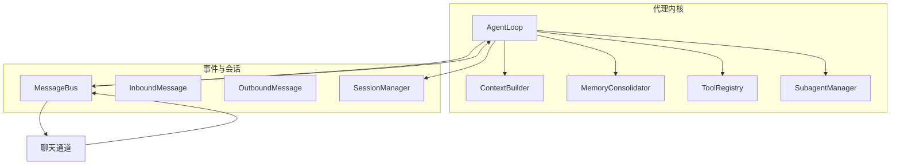
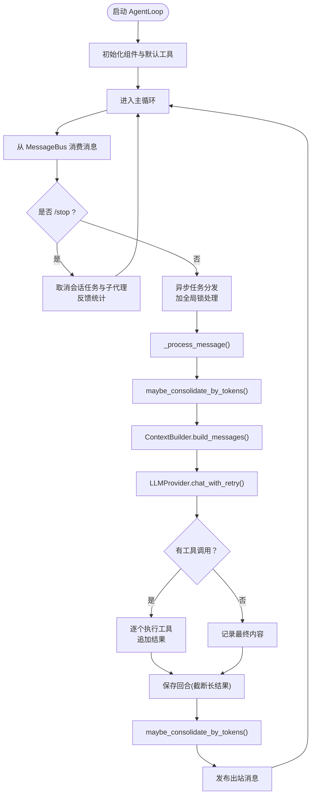
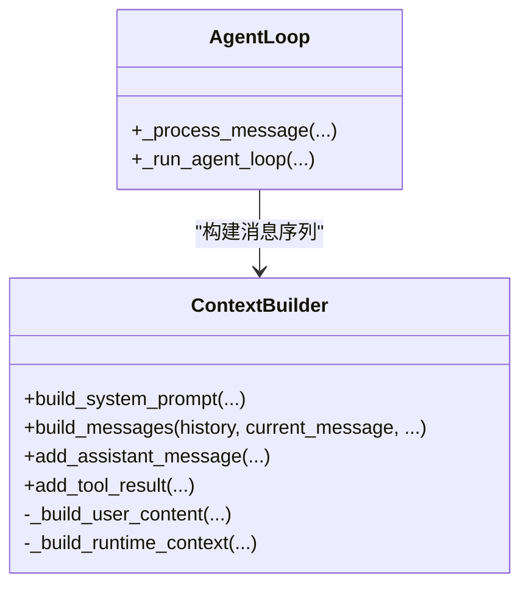
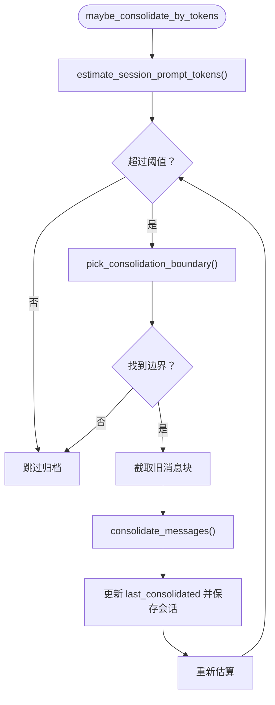
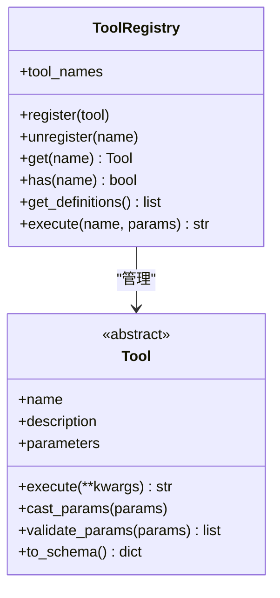
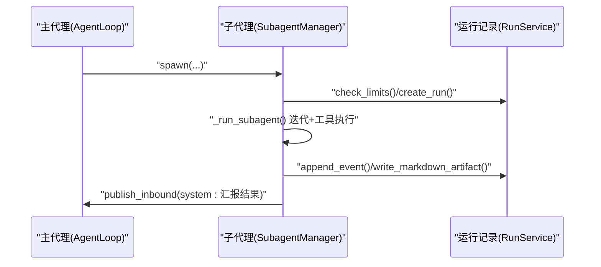
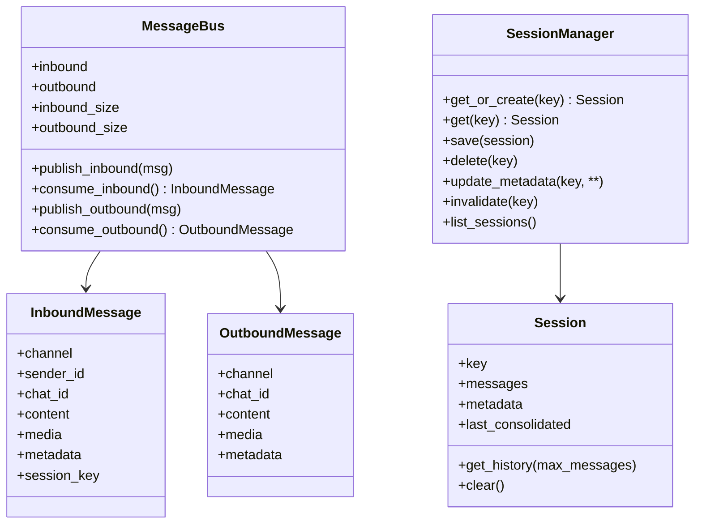
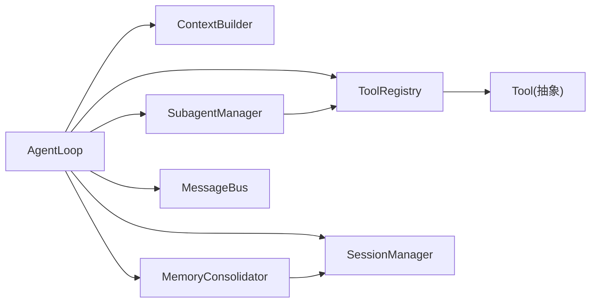

# 代理循环生命周期

<cite>
**本文引用的文件**
- [nanobot/agent/loop.py](file://nanobot/agent/loop.py)
- [nanobot/agent/context.py](file://nanobot/agent/context.py)
- [nanobot/agent/memory.py](file://nanobot/agent/memory.py)
- [nanobot/agent/subagent.py](file://nanobot/agent/subagent.py)
- [nanobot/agent/tools/base.py](file://nanobot/agent/tools/base.py)
- [nanobot/agent/tools/registry.py](file://nanobot/agent/tools/registry.py)
- [nanobot/agent/tools/message.py](file://nanobot/agent/tools/message.py)
- [nanobot/bus/events.py](file://nanobot/bus/events.py)
- [nanobot/bus/queue.py](file://nanobot/bus/queue.py)
- [nanobot/session/manager.py](file://nanobot/session/manager.py)
- [nanobot/config/schema.py](file://nanobot/config/schema.py)
- [nanobot/web/runtime_services/agents.py](file://nanobot/web/runtime_services/agents.py)
</cite>

## 目录
1. [简介](#简介)
2. [项目结构](#项目结构)
3. [核心组件](#核心组件)
4. [架构总览](#架构总览)
5. [详细组件分析](#详细组件分析)
6. [依赖分析](#依赖分析)
7. [性能考虑](#性能考虑)
8. [故障排查指南](#故障排查指南)
9. [结论](#结论)
10. [附录](#附录)

## 简介
本文件系统性阐述 AgentLoop 的完整生命周期管理，覆盖初始化配置、消息接收与处理、循环执行控制、优雅关闭流程；并深入解释异步任务调度、并发控制、错误处理与资源清理。同时，逐阶段拆解循环内部流程：消息预处理、上下文构建、LLM 调用、工具执行与响应生成，并提供可操作的监控、异常处理与自定义生命周期钩子的实践路径。

## 项目结构
围绕代理循环的关键模块如下：
- AgentLoop：核心循环引擎，负责消息消费、上下文构建、LLM 调用、工具执行、会话持久化与内存归档。
- 上下文与记忆：ContextBuilder 构建系统提示与消息列表；MemoryConsolidator 负责按令牌窗口策略归档历史。
- 工具体系：ToolRegistry 动态注册与执行工具；MessageTool 提供消息发送能力；各具体工具（文件系统、Web、Shell、Spawn、Cron）由 AgentLoop 注册。
- 会话与事件：SessionManager 持久化对话历史；MessageBus 解耦通道与代理；InboundMessage/OutboundMessage 描述消息契约。
- 子代理：SubagentManager 支持后台子任务执行与结果回传。



图表来源
- [nanobot/agent/loop.py:35-129](file://nanobot/agent/loop.py#L35-L129)
- [nanobot/agent/context.py:16-26](file://nanobot/agent/context.py#L16-L26)
- [nanobot/agent/memory.py:149-172](file://nanobot/agent/memory.py#L149-L172)
- [nanobot/agent/tools/registry.py:8-37](file://nanobot/agent/tools/registry.py#L8-L37)
- [nanobot/agent/subagent.py:28-54](file://nanobot/agent/subagent.py#L28-L54)
- [nanobot/bus/queue.py:8-45](file://nanobot/bus/queue.py#L8-L45)
- [nanobot/session/manager.py:73-90](file://nanobot/session/manager.py#L73-L90)

章节来源
- [nanobot/agent/loop.py:35-129](file://nanobot/agent/loop.py#L35-L129)
- [nanobot/agent/context.py:16-26](file://nanobot/agent/context.py#L16-L26)
- [nanobot/agent/memory.py:149-172](file://nanobot/agent/memory.py#L149-L172)
- [nanobot/agent/tools/registry.py:8-37](file://nanobot/agent/tools/registry.py#L8-L37)
- [nanobot/agent/subagent.py:28-54](file://nanobot/agent/subagent.py#L28-L54)
- [nanobot/bus/queue.py:8-45](file://nanobot/bus/queue.py#L8-L45)
- [nanobot/session/manager.py:73-90](file://nanobot/session/manager.py#L73-L90)

## 核心组件
- AgentLoop：消息循环入口，负责启动、分发、停止、MCP 连接与资源回收；封装单轮迭代逻辑与进度回调。
- ContextBuilder：拼装系统提示、技能、工作区记忆与运行时上下文，输出标准化消息序列。
- MemoryConsolidator：基于令牌估算与边界选择，周期性归档旧历史到长期记忆文件，维持上下文窗口健康。
- ToolRegistry：动态注册/注销工具，参数类型转换与校验，统一执行入口。
- SubagentManager：后台子任务执行器，支持运行记录、事件注入、取消与结果回传。
- MessageBus：异步队列驱动的入站/出站消息总线。
- SessionManager：会话持久化与缓存，支持迁移、清理与元数据更新。

章节来源
- [nanobot/agent/loop.py:35-129](file://nanobot/agent/loop.py#L35-L129)
- [nanobot/agent/context.py:16-26](file://nanobot/agent/context.py#L16-L26)
- [nanobot/agent/memory.py:149-172](file://nanobot/agent/memory.py#L149-L172)
- [nanobot/agent/tools/registry.py:8-37](file://nanobot/agent/tools/registry.py#L8-L37)
- [nanobot/agent/subagent.py:28-54](file://nanobot/agent/subagent.py#L28-L54)
- [nanobot/bus/queue.py:8-45](file://nanobot/bus/queue.py#L8-L45)
- [nanobot/session/manager.py:73-90](file://nanobot/session/manager.py#L73-L90)

## 架构总览
AgentLoop 通过 MessageBus 接收 InboundMessage，借助 ContextBuilder 与 MemoryConsolidator 准备上下文，调用 LLMProvider 执行推理，根据返回的工具调用在 ToolRegistry 中执行对应工具，再将结果写入会话并进行必要的内存归档，最后通过 MessageBus 发送 OutboundMessage 响应。

```mermaid
sequenceDiagram
participant CH as "聊天通道"
participant BUS as "MessageBus"
participant LOOP as "AgentLoop"
participant CTX as "ContextBuilder"
participant CONS as "MemoryConsolidator"
participant LLM as "LLMProvider"
participant REG as "ToolRegistry"
participant SUB as "SubagentManager"
participant SES as "SessionManager"
CH->>BUS : "发布入站消息"
BUS-->>LOOP : "消费入站消息"
LOOP->>CONS : "maybe_consolidate_by_tokens()"
LOOP->>CTX : "build_messages()"
LOOP->>LLM : "chat_with_retry(含工具定义)"
alt 返回工具调用
LOOP->>REG : "execute(逐个工具)"
REG-->>LOOP : "工具结果"
LOOP->>SES : "保存回合(截断长结果)"
else 返回最终内容
LOOP->>SES : "保存回合(去think)"
end
LOOP->>CONS : "maybe_consolidate_by_tokens()"
LOOP-->>BUS : "发布出站消息"
BUS-->>CH : "发送响应"
```

图表来源
- [nanobot/agent/loop.py:289-485](file://nanobot/agent/loop.py#L289-L485)
- [nanobot/agent/context.py:145-180](file://nanobot/agent/context.py#L145-L180)
- [nanobot/agent/memory.py:229-285](file://nanobot/agent/memory.py#L229-L285)
- [nanobot/bus/queue.py:20-34](file://nanobot/bus/queue.py#L20-L34)
- [nanobot/session/manager.py:172-189](file://nanobot/session/manager.py#L172-L189)

## 详细组件分析

### AgentLoop 生命周期与控制流
- 初始化配置
  - 依赖注入：MessageBus、LLMProvider、工作区路径、模型名、最大迭代次数、上下文窗口令牌数、工具白名单、技能列表、系统提示覆盖、工作区记忆开关、自定义记忆段、通道配置、会话管理器、MCP 服务器、运行记录服务等。
  - 组件装配：ContextBuilder、SessionManager、ToolRegistry、SubagentManager、MemoryConsolidator；默认工具注册（文件系统、Web、Shell、Message、Spawn、Cron）。
- 循环执行控制
  - run()：主循环持续从 MessageBus 消费消息；对 “/stop” 触发取消；其他消息以 Task 异步处理并按会话键维护活跃任务列表。
  - _dispatch()：全局处理锁保护，优先尝试通道路由分发；否则进入 _process_message()。
  - _process_message()：系统消息与普通消息分支；命令处理（/new、/help）；上下文构建；进度回调；单轮循环 _run_agent_loop()；保存回合与会话；可能触发内存归档。
  - _run_agent_loop()：最多 max_iterations 次迭代；若返回工具调用则逐一执行并追加结果；否则记录最终内容并结束；达到上限则给出兜底提示。
- 优雅关闭
  - stop()：设置运行标志为 False，退出主循环。
  - close_mcp()：关闭 MCP AsyncExitStack，避免噪声异常。
  - _handle_stop()：按会话键取消所有活跃任务与子代理，反馈统计信息。
- 并发与异步
  - 全局处理锁：确保同一时间仅一个消息被处理，避免竞态。
  - 活跃任务映射：按 session_key 维护任务集合，便于取消。
  - 子代理：SubagentManager 独立管理后台任务，支持按会话批量取消。
- 错误处理
  - 处理锁内捕获异常并发送通用错误消息；CancelledError 透传；MCP 连接失败记录日志并延迟重试。
- 资源清理
  - 会话保存：每轮结束后写盘；内存归档：按令牌策略归档未合并历史。
  - MCP 关闭：aclose() 安全释放连接。



图表来源
- [nanobot/agent/loop.py:289-485](file://nanobot/agent/loop.py#L289-L485)
- [nanobot/agent/memory.py:229-285](file://nanobot/agent/memory.py#L229-L285)
- [nanobot/agent/context.py:145-180](file://nanobot/agent/context.py#L145-L180)

章节来源
- [nanobot/agent/loop.py:289-485](file://nanobot/agent/loop.py#L289-L485)
- [nanobot/agent/memory.py:229-285](file://nanobot/agent/memory.py#L229-L285)
- [nanobot/agent/context.py:145-180](file://nanobot/agent/context.py#L145-L180)

### 上下文构建与消息序列
- 系统提示来源：身份描述、引导文件、额外系统提示、工作区记忆、自定义记忆段、激活技能摘要与技能清单。
- 用户消息：将运行时上下文与用户输入合并，避免连续相同角色消息；支持多模态图片（转 base64）。
- 助手消息：支持 content、tool_calls、reasoning_content、thinking_blocks 的组合封装。
- 工具结果：直接追加 role=tool 的消息条目。



图表来源
- [nanobot/agent/context.py:16-227](file://nanobot/agent/context.py#L16-L227)
- [nanobot/agent/loop.py:371-485](file://nanobot/agent/loop.py#L371-L485)

章节来源
- [nanobot/agent/context.py:16-227](file://nanobot/agent/context.py#L16-L227)
- [nanobot/agent/loop.py:371-485](file://nanobot/agent/loop.py#L371-L485)

### 内存归档与令牌窗口控制
- 归档策略：基于“移除旧用户回合”的边界选择，使当前提示大小降至目标阈值以下；最多进行若干轮归档。
- 令牌估算：通过探针消息与工具定义估算整体上下文开销。
- 并发安全：按会话键持有独立锁，避免跨会话干扰。



图表来源
- [nanobot/agent/memory.py:229-285](file://nanobot/agent/memory.py#L229-L285)

章节来源
- [nanobot/agent/memory.py:149-285](file://nanobot/agent/memory.py#L149-L285)

### 工具注册与执行
- 注册：默认工具按白名单过滤后注册；Message/Spawn/Cron 工具在运行前设置上下文。
- 执行：参数类型转换与校验，异常捕获并返回带提示的错误字符串；支持工具提示格式化。



图表来源
- [nanobot/agent/tools/base.py:7-182](file://nanobot/agent/tools/base.py#L7-L182)
- [nanobot/agent/tools/registry.py:8-71](file://nanobot/agent/tools/registry.py#L8-L71)

章节来源
- [nanobot/agent/tools/base.py:7-182](file://nanobot/agent/tools/base.py#L7-L182)
- [nanobot/agent/tools/registry.py:8-71](file://nanobot/agent/tools/registry.py#L8-L71)

### 子代理与后台任务
- 后台执行：spawn() 创建子代理任务，限制迭代次数，记录运行事件与产物。
- 取消策略：按会话批量取消或按 run_id 单个取消；异常与成功均上报运行记录。
- 结果回传：通过系统消息注入主代理，触发新一轮处理。



图表来源
- [nanobot/agent/subagent.py:55-307](file://nanobot/agent/subagent.py#L55-L307)
- [nanobot/agent/loop.py:371-404](file://nanobot/agent/loop.py#L371-L404)

章节来源
- [nanobot/agent/subagent.py:28-358](file://nanobot/agent/subagent.py#L28-L358)
- [nanobot/agent/loop.py:371-404](file://nanobot/agent/loop.py#L371-L404)

### 事件总线与会话管理
- 事件契约：InboundMessage/OutboundMessage 定义消息字段与会话键计算。
- 总线行为：异步队列阻塞式读写；暴露入站/出站尺寸属性。
- 会话持久化：JSONL 文件存储，支持元数据行、消息行；迁移旧路径；缓存加速访问。



图表来源
- [nanobot/bus/events.py:8-39](file://nanobot/bus/events.py#L8-L39)
- [nanobot/bus/queue.py:8-45](file://nanobot/bus/queue.py#L8-L45)
- [nanobot/session/manager.py:16-212](file://nanobot/session/manager.py#L16-L212)

章节来源
- [nanobot/bus/events.py:8-39](file://nanobot/bus/events.py#L8-L39)
- [nanobot/bus/queue.py:8-45](file://nanobot/bus/queue.py#L8-L45)
- [nanobot/session/manager.py:73-212](file://nanobot/session/manager.py#L73-L212)

### 配置与运行时钩子
- 配置项：工作区路径、模型、上下文窗口、最大迭代、工具白名单、技能列表、系统提示覆盖、MCP 服务器、通道配置、执行限制等。
- 进度钩子：on_progress 回调用于实时推送中间结果（如思考片段、工具提示），前端可订阅运行记录事件。

章节来源
- [nanobot/config/schema.py:1-200](file://nanobot/config/schema.py#L1-L200)
- [nanobot/web/runtime_services/agents.py:245-281](file://nanobot/web/runtime_services/agents.py#L245-L281)

## 依赖分析
- 组件耦合
  - AgentLoop 依赖 ContextBuilder、MemoryConsolidator、ToolRegistry、SubagentManager、SessionManager、MessageBus。
  - 工具链通过 ToolRegistry 解耦，支持动态扩展。
  - 子代理与运行记录服务集成，形成闭环的可观测性。
- 外部依赖
  - LLMProvider：抽象接口，支持重试与工具调用。
  - MCP：可选外部服务，懒加载连接，异常不影响主循环。
- 潜在循环依赖
  - 无直接循环导入；MessageTool 仅在运行期设置上下文，不反向依赖 AgentLoop。



图表来源
- [nanobot/agent/loop.py:35-129](file://nanobot/agent/loop.py#L35-L129)
- [nanobot/agent/tools/base.py:7-182](file://nanobot/agent/tools/base.py#L7-L182)
- [nanobot/agent/subagent.py:28-54](file://nanobot/agent/subagent.py#L28-L54)

章节来源
- [nanobot/agent/loop.py:35-129](file://nanobot/agent/loop.py#L35-L129)
- [nanobot/agent/tools/base.py:7-182](file://nanobot/agent/tools/base.py#L7-L182)
- [nanobot/agent/subagent.py:28-54](file://nanobot/agent/subagent.py#L28-L54)

## 性能考虑
- 令牌窗口控制：通过边界选择与归档降低上下文长度，避免超限与昂贵调用。
- 会话截断：工具结果超长自动截断，减少无效负载。
- 并发与锁：全局处理锁保证一致性；会话级归档锁避免竞争。
- MCP 连接：懒加载与异常隔离，避免阻塞主循环。
- 迭代上限：防止无限工具调用循环，提升稳定性。

## 故障排查指南
- 常见问题
  - LLM 返回错误：循环中对 finish_reason==error 的响应进行记录并给出兜底回复。
  - 工具执行异常：参数类型转换与校验失败会返回带提示的错误字符串；工具内部异常被捕获并返回错误消息。
  - MCP 连接失败：记录错误并延迟重试，不影响后续消息处理。
  - 会话卡死：/stop 命令可取消当前会话的所有任务与子代理。
- 诊断建议
  - 开启日志：关注 “Tool call”、“Memory consolidation”、“Subagent” 等关键节点。
  - 监控令牌估算：当提示过大时，检查归档策略是否生效。
  - 检查会话文件：确认 sessions 目录存在且可读写，必要时迁移旧路径。

章节来源
- [nanobot/agent/loop.py:266-287](file://nanobot/agent/loop.py#L266-L287)
- [nanobot/agent/tools/registry.py:38-59](file://nanobot/agent/tools/registry.py#L38-L59)
- [nanobot/agent/memory.py:144-146](file://nanobot/agent/memory.py#L144-L146)
- [nanobot/agent/subagent.py:248-265](file://nanobot/agent/subagent.py#L248-L265)

## 结论
AgentLoop 将消息处理、上下文构建、LLM 推理、工具执行与会话持久化整合为高内聚的循环引擎；通过令牌窗口控制与内存归档维持长期可用性；借助异步任务与锁保障并发安全；通过 MCP、子代理与运行记录实现可扩展与可观测。遵循本文提供的监控、异常处理与钩子实践，可在生产环境中稳定运行并快速定位问题。

## 附录

### 监控代理状态与进度
- 使用 on_progress 回调在循环中推送中间结果（如思考片段、工具提示），前端可订阅运行记录事件以展示实时进度。
- 示例路径参考：[运行时服务中对 AgentLoop 的集成与进度事件注入:245-281](file://nanobot/web/runtime_services/agents.py#L245-L281)

章节来源
- [nanobot/web/runtime_services/agents.py:245-281](file://nanobot/web/runtime_services/agents.py#L245-L281)

### 自定义生命周期钩子
- 在 AgentLoop 初始化时注入回调（如 on_progress），并在消息处理前后插入业务逻辑（例如审计、指标采集）。
- 对于 MCP 与子代理，可通过运行记录服务在关键节点写入事件，形成闭环追踪。

章节来源
- [nanobot/agent/loop.py:218-287](file://nanobot/agent/loop.py#L218-L287)
- [nanobot/agent/subagent.py:188-207](file://nanobot/agent/subagent.py#L188-L207)