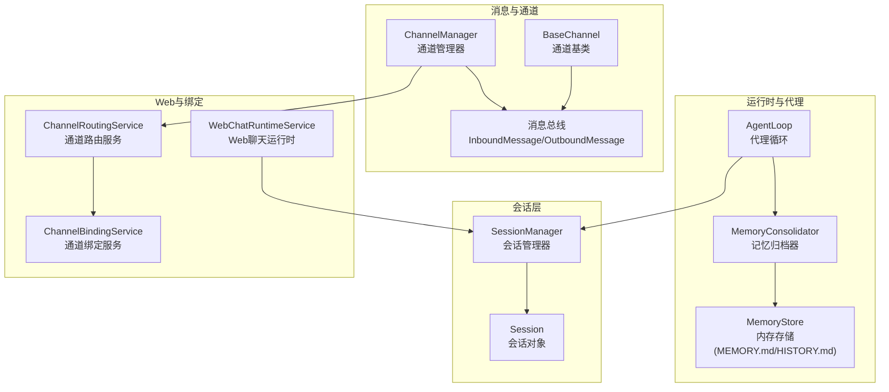
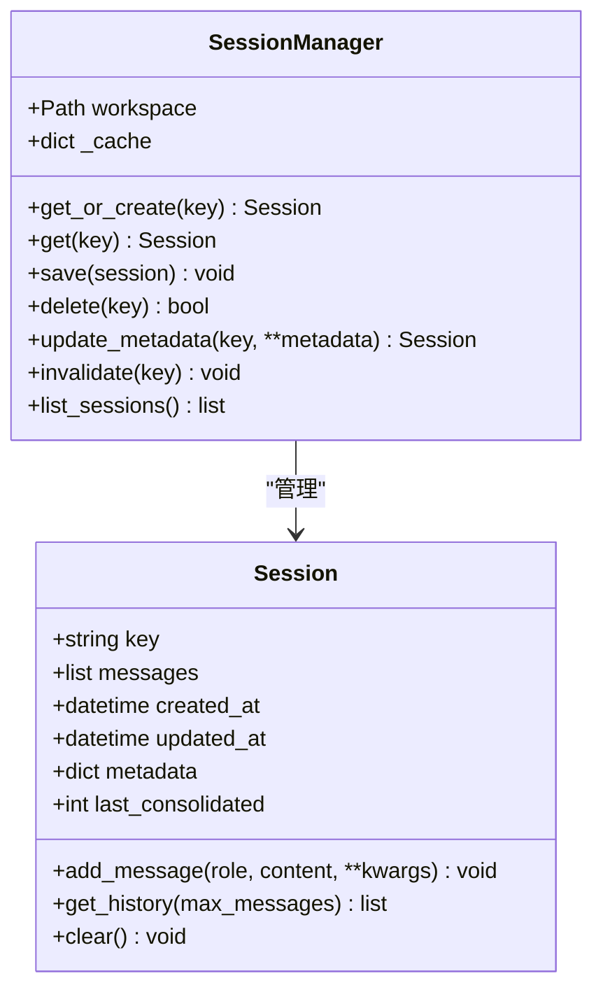
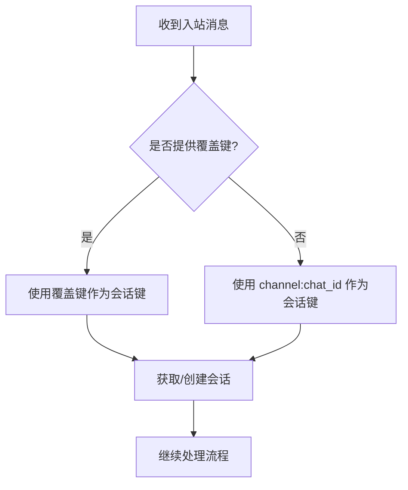
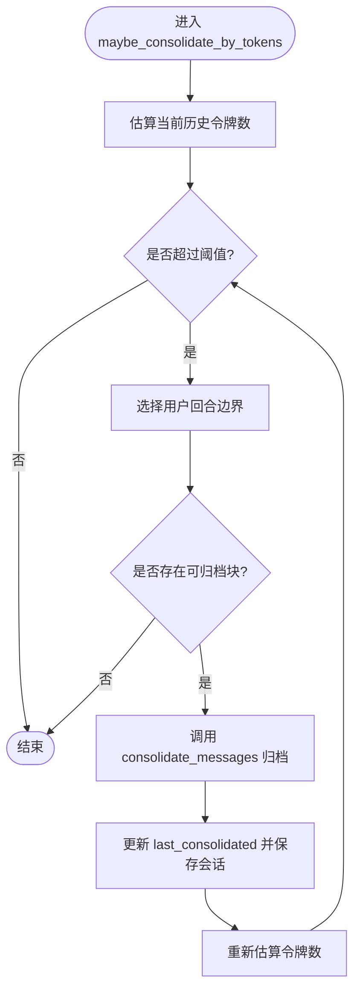
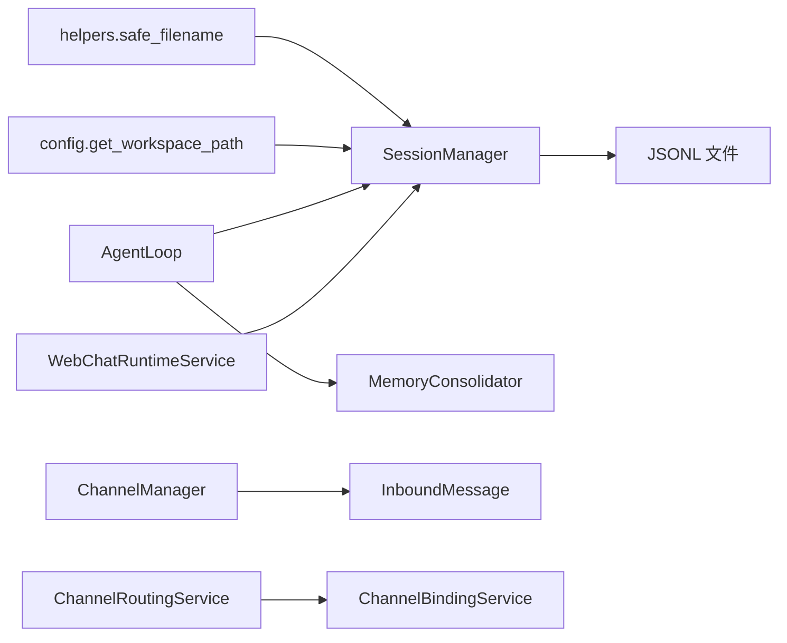

# 会话管理

<cite>
**本文引用的文件**
- [nanobot/session/manager.py](file://nanobot/session/manager.py)
- [nanobot/session/__init__.py](file://nanobot/session/__init__.py)
- [nanobot/config/paths.py](file://nanobot/config/paths.py)
- [nanobot/utils/helpers.py](file://nanobot/utils/helpers.py)
- [nanobot/bus/events.py](file://nanobot/bus/events.py)
- [nanobot/channels/base.py](file://nanobot/channels/base.py)
- [nanobot/channels/manager.py](file://nanobot/channels/manager.py)
- [nanobot/web/runtime_services/chat.py](file://nanobot/web/runtime_services/chat.py)
- [nanobot/agent/loop.py](file://nanobot/agent/loop.py)
- [nanobot/agent/memory.py](file://nanobot/agent/memory.py)
- [nanobot/platform/channel_bindings/service.py](file://nanobot/platform/channel_bindings/service.py)
- [nanobot/web/runtime_services/channel_routing.py](file://nanobot/web/runtime_services/channel_routing.py)
- [nanobot/web/runtime.py](file://nanobot/web/runtime.py)
</cite>

## 目录
1. [简介](#简介)
2. [项目结构](#项目结构)
3. [核心组件](#核心组件)
4. [架构总览](#架构总览)
5. [详细组件分析](#详细组件分析)
6. [依赖关系分析](#依赖关系分析)
7. [性能考量](#性能考量)
8. [故障排查指南](#故障排查指南)
9. [结论](#结论)
10. [附录](#附录)

## 简介
本文件系统性阐述会话管理系统的设计与实现，重点覆盖以下方面：
- Session 与 SessionManager 的职责边界、数据结构与持久化策略
- 会话键生成规则、消息存储格式与历史截断机制
- 会话清理（记忆归档）策略、并发访问控制与一致性保障
- 会话与渠道绑定的关系、跨消息传递的状态保持与会话恢复流程
- 自定义会话行为、实现会话迁移与处理会话冲突的方法

## 项目结构
会话管理位于 nanobot/session 子模块，围绕 Session 与 SessionManager 展开；同时与消息总线、通道层、Web 运行时、代理循环、记忆归档等模块协同工作。



图示来源
- [nanobot/session/manager.py:73-252](file://nanobot/session/manager.py#L73-L252)
- [nanobot/bus/events.py:8-39](file://nanobot/bus/events.py#L8-L39)
- [nanobot/channels/base.py:89-135](file://nanobot/channels/base.py#L89-L135)
- [nanobot/channels/manager.py:52-209](file://nanobot/channels/manager.py#L52-L209)
- [nanobot/web/runtime_services/chat.py:18-440](file://nanobot/web/runtime_services/chat.py#L18-L440)
- [nanobot/agent/loop.py:35-541](file://nanobot/agent/loop.py#L35-L541)
- [nanobot/agent/memory.py:149-285](file://nanobot/agent/memory.py#L149-L285)
- [nanobot/platform/channel_bindings/service.py:28-201](file://nanobot/platform/channel_bindings/service.py#L28-L201)
- [nanobot/web/runtime_services/channel_routing.py:23-73](file://nanobot/web/runtime_services/channel_routing.py#L23-L73)

章节来源
- [nanobot/session/manager.py:1-252](file://nanobot/session/manager.py#L1-L252)
- [nanobot/session/__init__.py:1-6](file://nanobot/session/__init__.py#L1-L6)

## 核心组件
- Session：承载单一会话的消息列表、元数据、时间戳与“已归档消息计数”等字段，提供添加消息、获取历史、清空等操作。
- SessionManager：负责会话的加载、保存、删除、缓存、迁移与枚举，采用 JSONL 文件存储，支持工作区隔离与旧路径迁移。

关键点
- 会话键：默认为 “channel:chat_id”，可通过通道层的 session_key_override 覆盖，用于线程或子会话场景。
- 消息存储：JSONL 文件首行为元数据行，后续每行一条消息；消息追加写入，避免随机写。
- 历史视图：get_history 支持按最大消息数切片，并确保从首个用户消息开始，避免孤立工具结果块。
- 清理策略：通过 MemoryConsolidator 将旧消息归档至 MEMORY.md/HISTORY.md，更新 last_consolidated 偏移，减少上下文长度。

章节来源
- [nanobot/session/manager.py:16-71](file://nanobot/session/manager.py#L16-L71)
- [nanobot/session/manager.py:73-252](file://nanobot/session/manager.py#L73-L252)
- [nanobot/bus/events.py:21-25](file://nanobot/bus/events.py#L21-L25)

## 架构总览
下图展示了从通道接收消息到代理处理再到会话持久化的端到端流程，以及记忆归档对会话历史的影响。

```mermaid
sequenceDiagram
participant CH as "通道(BaseChannel)"
participant BUS as "消息总线"
participant LOOP as "代理循环(AgentLoop)"
participant SM as "会话管理(SessionManager)"
participant MEM as "记忆归档(MemoryConsolidator)"
CH->>BUS : "发布入站消息(InboundMessage)"
BUS-->>LOOP : "消费入站消息"
LOOP->>SM : "get_or_create(session_key)"
SM-->>LOOP : "返回Session"
LOOP->>MEM : "maybe_consolidate_by_tokens(session)"
MEM-->>LOOP : "必要时归档旧消息并更新偏移"
LOOP->>LOOP : "构建上下文并调用LLM/工具"
LOOP->>SM : "保存新回合消息并持久化"
SM-->>LOOP : "完成"
LOOP-->>BUS : "发布出站消息(OutboundMessage)"
```

图示来源
- [nanobot/channels/base.py:89-135](file://nanobot/channels/base.py#L89-L135)
- [nanobot/bus/events.py:8-39](file://nanobot/bus/events.py#L8-L39)
- [nanobot/agent/loop.py:371-485](file://nanobot/agent/loop.py#L371-L485)
- [nanobot/agent/memory.py:229-285](file://nanobot/agent/memory.py#L229-L285)
- [nanobot/session/manager.py:172-190](file://nanobot/session/manager.py#L172-L190)

## 详细组件分析

### Session 与 SessionManager 设计
- 数据模型
  - Session.key：会话唯一标识，通常为 channel:chat_id
  - Session.messages：消息数组，按到达顺序追加
  - Session.metadata：会话元数据（如标题）
  - Session.last_consolidated：已归档消息的索引偏移
  - 时间戳：created_at/updated_at
- 关键方法
  - add_message：标准化消息结构并更新时间戳
  - get_history：返回未归档消息，按用户回合对齐，裁剪最大数量
  - clear：重置消息与偏移，保留元数据
  - save/load/delete/invalidate/list_sessions：磁盘持久化与缓存管理
- 存储格式
  - 首行元数据行包含 key、created_at、updated_at、metadata、last_consolidated
  - 后续每行一条消息 JSON 对象
- 路径与迁移
  - 工作区 sessions 目录优先；若不存在则尝试将旧全局 sessions 目录下的同名文件迁移至新位置



图示来源
- [nanobot/session/manager.py:16-71](file://nanobot/session/manager.py#L16-L71)
- [nanobot/session/manager.py:73-252](file://nanobot/session/manager.py#L73-L252)

章节来源
- [nanobot/session/manager.py:16-71](file://nanobot/session/manager.py#L16-L71)
- [nanobot/session/manager.py:73-252](file://nanobot/session/manager.py#L73-L252)

### 会话键生成规则与通道绑定
- 默认键：channel:chat_id
- 覆盖键：通道层允许通过 session_key_override 提供覆盖值，用于线程或子会话场景
- 绑定关系：ChannelManager 可通过 ChannelRoutingService 将入站消息路由到目标（agent/team），并在消息元数据中注入路由信息；会话键仍遵循上述规则



图示来源
- [nanobot/bus/events.py:21-25](file://nanobot/bus/events.py#L21-L25)
- [nanobot/channels/base.py:89-135](file://nanobot/channels/base.py#L89-L135)
- [nanobot/channels/manager.py:19-50](file://nanobot/channels/manager.py#L19-L50)

章节来源
- [nanobot/bus/events.py:21-25](file://nanobot/bus/events.py#L21-L25)
- [nanobot/channels/base.py:89-135](file://nanobot/channels/base.py#L89-L135)
- [nanobot/channels/manager.py:19-50](file://nanobot/channels/manager.py#L19-L50)

### 消息存储格式与历史截断
- 存储格式
  - 元数据行：包含 _type=metadata、key、created_at、updated_at、metadata、last_consolidated
  - 消息行：每条 JSON 对象，包含 role、content、timestamp 等
- 历史截断
  - get_history 仅返回 last_consolidated 之后的消息
  - 从切片中剔除开头非用户消息，保证用户回合对齐
  - 支持 max_messages 参数限制返回数量
- 追加写入
  - 会话消息以追加方式写入，有利于 LLM 缓存效率与日志可读性

章节来源
- [nanobot/session/manager.py:140-190](file://nanobot/session/manager.py#L140-L190)
- [nanobot/session/manager.py:46-64](file://nanobot/session/manager.py#L46-L64)

### 会话清理策略与并发控制
- 清理策略
  - MemoryConsolidator 基于令牌预算进行归档：当会话历史估算超过上下文窗口的一半时，选择用户回合边界进行分块归档
  - 归档目标：MEMORY.md（长期事实）与 HISTORY.md（可 grep 的日志）
  - 更新 last_consolidated 偏移，避免重复归档
- 并发控制
  - 会话粒度的 asyncio.Lock：每个 session_key 拥有独立锁，防止并发归档导致的竞态
  - 代理循环内部使用全局锁保护处理流程，避免同一会话多任务并发



图示来源
- [nanobot/agent/memory.py:229-285](file://nanobot/agent/memory.py#L229-L285)
- [nanobot/agent/memory.py:177-202](file://nanobot/agent/memory.py#L177-L202)
- [nanobot/agent/memory.py:60-83](file://nanobot/agent/memory.py#L60-L83)
- [nanobot/agent/loop.py:118-118](file://nanobot/agent/loop.py#L118-L118)

章节来源
- [nanobot/agent/memory.py:149-285](file://nanobot/agent/memory.py#L149-L285)
- [nanobot/agent/loop.py:118-118](file://nanobot/agent/loop.py#L118-L118)

### 会话与渠道绑定的关系、跨消息传递的状态保持与恢复
- 绑定解析
  - ChannelRoutingService 基于 ChannelBindingService 解析 channel_name 与 chat_id 的绑定，返回目标类型与 ID
  - ChannelManager 在发布入站消息前，通过 _RoutingBusProxy 注入路由元数据
- 状态保持
  - 会话键贯穿整个生命周期：通道层生成、代理循环使用、Web 运行时管理
  - 会话元数据（如标题）可动态更新并持久化
- 会话恢复
  - SessionManager 从磁盘加载时，若工作区无文件则尝试从旧全局 sessions 目录迁移
  - 代理循环在处理前调用 maybe_consolidate_by_tokens，确保上下文大小可控

```mermaid
sequenceDiagram
participant CBS as "ChannelBindingService"
participant CRS as "ChannelRoutingService"
participant CHM as "ChannelManager"
participant BUS as "消息总线"
participant LOOP as "AgentLoop"
CBS-->>CRS : "解析绑定"
CHM->>CRS : "resolve_target(channel, chat_id)"
CRS-->>CHM : "RoutingTarget"
CHM->>BUS : "publish_inbound(注入路由元数据)"
BUS-->>LOOP : "消费入站消息"
LOOP->>LOOP : "maybe_consolidate_by_tokens(session)"
LOOP-->>BUS : "发布出站消息"
```

图示来源
- [nanobot/platform/channel_bindings/service.py:73-86](file://nanobot/platform/channel_bindings/service.py#L73-L86)
- [nanobot/web/runtime_services/channel_routing.py:38-72](file://nanobot/web/runtime_services/channel_routing.py#L38-L72)
- [nanobot/channels/manager.py:38-46](file://nanobot/channels/manager.py#L38-L46)
- [nanobot/agent/loop.py:371-405](file://nanobot/agent/loop.py#L371-L405)

章节来源
- [nanobot/platform/channel_bindings/service.py:28-201](file://nanobot/platform/channel_bindings/service.py#L28-L201)
- [nanobot/web/runtime_services/channel_routing.py:23-73](file://nanobot/web/runtime_services/channel_routing.py#L23-L73)
- [nanobot/channels/manager.py:19-50](file://nanobot/channels/manager.py#L19-L50)
- [nanobot/agent/loop.py:371-405](file://nanobot/agent/loop.py#L371-L405)

### Web 运行时中的会话管理
- WebChatRuntimeService
  - 会话键命名空间：web:session_id
  - 列表过滤：仅列出以 web: 开头的会话
  - 创建/重命名/删除/列举：封装 SessionManager 的能力
- WebAppState
  - 通过 chat_runtime 暴露会话管理接口给前端

章节来源
- [nanobot/web/runtime_services/chat.py:18-440](file://nanobot/web/runtime_services/chat.py#L18-L440)
- [nanobot/web/runtime.py:98-170](file://nanobot/web/runtime.py#L98-L170)

### 代理循环中的会话使用
- 会话获取与保存
  - 使用 get_or_create 获取或创建会话
  - 处理完成后调用 save 持久化
- 历史构建
  - 通过 MemoryConsolidator 控制历史长度，避免超出上下文
- 命令支持
  - /new：归档未归档消息后清空会话
  - /help：显示可用命令
- 并发控制
  - 全局处理锁与会话粒度锁双重保护

章节来源
- [nanobot/agent/loop.py:371-485](file://nanobot/agent/loop.py#L371-L485)
- [nanobot/agent/memory.py:229-285](file://nanobot/agent/memory.py#L229-L285)

## 依赖关系分析
- SessionManager 依赖
  - 工作区路径：通过 get_workspace_path 与 ensure_dir 确保 sessions 目录存在
  - 文件名安全：safe_filename 规避非法字符
  - 旧路径迁移：get_legacy_sessions_dir 用于回退迁移
- 代理循环依赖
  - 会话管理：SessionManager
  - 记忆归档：MemoryConsolidator
  - 上下文构建：ContextBuilder
- 通道层依赖
  - 消息总线：InboundMessage/OutboundMessage
  - 路由服务：ChannelRoutingService
  - 绑定服务：ChannelBindingService



图示来源
- [nanobot/utils/helpers.py:36-41](file://nanobot/utils/helpers.py#L36-L41)
- [nanobot/config/paths.py:37-41](file://nanobot/config/paths.py#L37-L41)
- [nanobot/session/manager.py:80-84](file://nanobot/session/manager.py#L80-L84)
- [nanobot/agent/loop.py:97-97](file://nanobot/agent/loop.py#L97-L97)
- [nanobot/agent/memory.py:149-171](file://nanobot/agent/memory.py#L149-L171)
- [nanobot/channels/manager.py:52-81](file://nanobot/channels/manager.py#L52-L81)
- [nanobot/web/runtime_services/chat.py:18-440](file://nanobot/web/runtime_services/chat.py#L18-L440)

章节来源
- [nanobot/utils/helpers.py:36-41](file://nanobot/utils/helpers.py#L36-L41)
- [nanobot/config/paths.py:37-56](file://nanobot/config/paths.py#L37-L56)
- [nanobot/session/manager.py:80-84](file://nanobot/session/manager.py#L80-L84)
- [nanobot/agent/loop.py:97-97](file://nanobot/agent/loop.py#L97-L97)
- [nanobot/agent/memory.py:149-171](file://nanobot/agent/memory.py#L149-L171)
- [nanobot/channels/manager.py:52-81](file://nanobot/channels/manager.py#L52-L81)
- [nanobot/web/runtime_services/chat.py:18-440](file://nanobot/web/runtime_services/chat.py#L18-L440)

## 性能考量
- 追加式写入：减少随机 IO，提升 LLM 缓存命中率
- 历史截断：基于用户回合边界选择归档块，避免破坏对话连贯性
- 令牌预算：通过估计函数控制上下文大小，降低推理成本
- 并发锁：会话粒度锁降低争用，全局锁保证处理一致性

## 故障排查指南
- 会话无法加载
  - 检查工作区 sessions 目录是否存在对应 JSONL 文件
  - 若无，确认旧路径迁移是否成功（get_legacy_sessions_dir）
- 会话内容异常
  - 确认 last_consolidated 偏移是否正确，get_history 是否按预期裁剪
  - 检查消息是否包含 tool_calls/tool_call_id/name 等字段
- 并发问题
  - 确认会话粒度锁是否生效（MemoryConsolidator.get_lock）
  - 代理循环是否使用全局处理锁
- 路由与会话键不一致
  - 检查通道层是否正确注入 session_key_override
  - 确认 ChannelRoutingService 的绑定解析结果

章节来源
- [nanobot/session/manager.py:125-171](file://nanobot/session/manager.py#L125-L171)
- [nanobot/agent/memory.py:173-176](file://nanobot/agent/memory.py#L173-L176)
- [nanobot/agent/loop.py:337-356](file://nanobot/agent/loop.py#L337-L356)
- [nanobot/channels/base.py:89-135](file://nanobot/channels/base.py#L89-L135)
- [nanobot/web/runtime_services/channel_routing.py:38-72](file://nanobot/web/runtime_services/channel_routing.py#L38-L72)

## 结论
该会话管理系统以 Session/SessionManager 为核心，结合消息总线、通道层与代理循环，实现了稳定、可扩展的对话状态管理。通过 JSONL 追加写入、用户回合边界归档与会话粒度锁，系统在保证一致性的同时兼顾性能与可维护性。通道绑定与路由进一步增强了会话与业务目标的解耦，便于扩展多租户与多目标的复杂场景。

## 附录

### 自定义会话行为示例（路径指引）
- 自定义会话键命名空间
  - Web：参考 [nanobot/web/runtime_services/chat.py:32-33](file://nanobot/web/runtime_services/chat.py#L32-L33)
  - MCP 测试：参考 [nanobot/web/runtime_services/chat.py:183-188](file://nanobot/web/runtime_services/chat.py#L183-L188)
- 覆盖会话键
  - 通道层：参考 [nanobot/channels/base.py:96-127](file://nanobot/channels/base.py#L96-L127)
  - 消息键计算：参考 [nanobot/bus/events.py:22-24](file://nanobot/bus/events.py#L22-L24)

### 会话迁移与冲突处理（路径指引）
- 旧路径迁移
  - 参考 [nanobot/session/manager.py:125-139](file://nanobot/session/manager.py#L125-L139)
  - 旧路径来源：参考 [nanobot/config/paths.py:53-56](file://nanobot/config/paths.py#L53-L56)
- 冲突检测与处理
  - 绑定冲突：参考 [nanobot/platform/channel_bindings/service.py:17-19](file://nanobot/platform/channel_bindings/service.py#L17-L19)
  - 绑定校验：参考 [nanobot/platform/channel_bindings/service.py:54-72](file://nanobot/platform/channel_bindings/service.py#L54-L72)