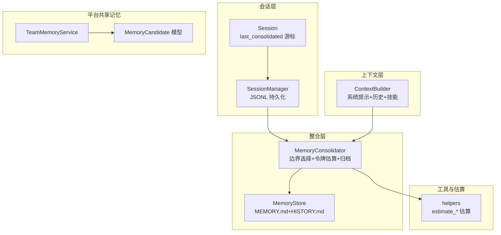
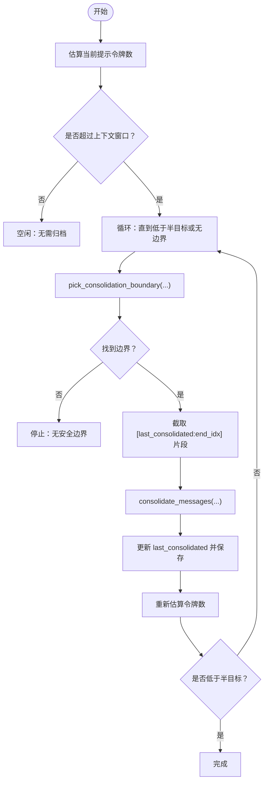
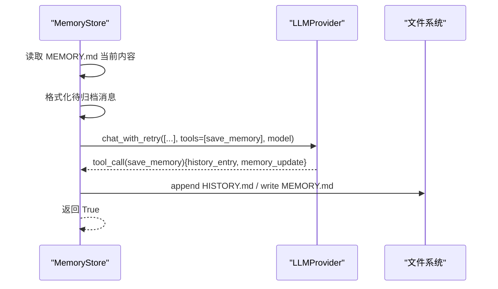
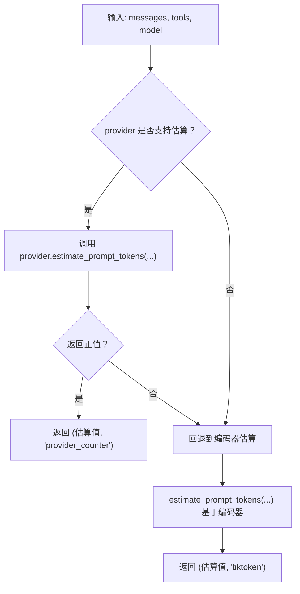
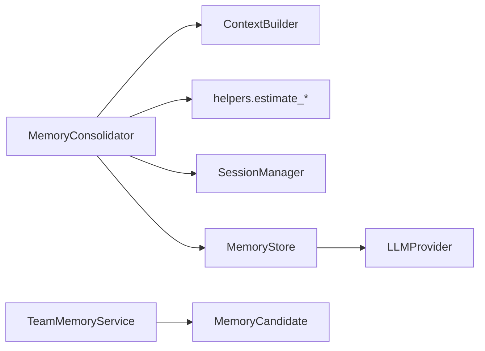

# 内存整合器

<cite>
**本文引用的文件**
- [nanobot/agent/memory.py](file://nanobot/agent/memory.py)
- [nanobot/utils/helpers.py](file://nanobot/utils/helpers.py)
- [nanobot/session/manager.py](file://nanobot/session/manager.py)
- [nanobot/agent/context.py](file://nanobot/agent/context.py)
- [nanobot/agent/loop.py](file://nanobot/agent/loop.py)
- [tests/test_loop_consolidation_tokens.py](file://tests/test_loop_consolidation_tokens.py)
- [tests/test_memory_consolidation_types.py](file://tests/test_memory_consolidation_types.py)
- [nanobot/config/schema.py](file://nanobot/config/schema.py)
- [nanobot/platform/memory/service.py](file://nanobot/platform/memory/service.py)
- [nanobot/platform/memory/models.py](file://nanobot/platform/memory/models.py)
- [memory/MEMORY.md](file://memory/MEMORY.md)
- [nanobot/templates/memory/MEMORY.md](file://nanobot/templates/memory/MEMORY.md)
</cite>

## 目录
1. [简介](#简介)
2. [项目结构](#项目结构)
3. [核心组件](#核心组件)
4. [架构总览](#架构总览)
5. [详细组件分析](#详细组件分析)
6. [依赖关系分析](#依赖关系分析)
7. [性能考量](#性能考量)
8. [故障排查指南](#故障排查指南)
9. [结论](#结论)
10. [附录](#附录)

## 简介
本文件系统性阐述内存整合器（MemoryConsolidator）的设计与实现，重点覆盖以下方面：
- 如何管理会话记忆、压缩历史消息、优化令牌使用与维护上下文窗口大小
- 记忆归档策略、令牌估算算法、内存清理机制与批量处理流程
- 与 ContextBuilder 的协作关系、会话状态管理与性能优化技巧
- 具体配置与大规模对话历史处理示例

## 项目结构
围绕“会话—上下文—整合”的主线，相关模块如下：
- 会话与历史：Session/SessionManager 负责消息持久化与增量游标管理
- 上下文构建：ContextBuilder 将系统提示、长程记忆、技能与历史拼装为 LLM 输入
- 内存整合：MemoryConsolidator 负责令牌估算、边界选择、归档触发与并发控制
- 工具与估算：helpers 提供基于编码器的令牌估算与链式估算回退
- 平台共享记忆：TeamMemoryService/模型负责团队级候选记忆与搜索



**图表来源**
- [nanobot/session/manager.py:16-71](file://nanobot/session/manager.py#L16-L71)
- [nanobot/agent/context.py:16-26](file://nanobot/agent/context.py#L16-L26)
- [nanobot/agent/memory.py:60-147](file://nanobot/agent/memory.py#L60-L147)
- [nanobot/utils/helpers.py:117-171](file://nanobot/utils/helpers.py#L117-L171)
- [nanobot/platform/memory/service.py:31-52](file://nanobot/platform/memory/service.py#L31-L52)
- [nanobot/platform/memory/models.py:14-32](file://nanobot/platform/memory/models.py#L14-L32)

**章节来源**
- [nanobot/agent/memory.py:149-285](file://nanobot/agent/memory.py#L149-L285)
- [nanobot/agent/context.py:16-227](file://nanobot/agent/context.py#L16-L227)
- [nanobot/session/manager.py:16-252](file://nanobot/session/manager.py#L16-L252)
- [nanobot/utils/helpers.py:117-171](file://nanobot/utils/helpers.py#L117-L171)
- [nanobot/platform/memory/service.py:31-447](file://nanobot/platform/memory/service.py#L31-L447)
- [nanobot/platform/memory/models.py:14-65](file://nanobot/platform/memory/models.py#L14-L65)

## 核心组件
- MemoryConsolidator：整合策略、并发锁、会话偏移更新
- MemoryStore：两层记忆（长期事实 + 可 grep 历史日志）
- Session/SessionManager：消息列表与 last_consolidated 游标
- ContextBuilder：系统提示与消息拼装
- helpers：令牌估算工具（链式估算优先）

关键职责与交互：
- 通过 ContextBuilder 构建探针消息，结合工具定义估算当前会话提示的令牌数
- 基于“用户轮次边界”选择可安全归档的历史片段，避免破坏工具调用块
- 使用弱引用字典为每个会话键提供独立异步锁，防止并发冲突
- 归档成功后更新 last_consolidated，并持久化到磁盘

**章节来源**
- [nanobot/agent/memory.py:149-285](file://nanobot/agent/memory.py#L149-L285)
- [nanobot/agent/memory.py:60-147](file://nanobot/agent/memory.py#L60-L147)
- [nanobot/session/manager.py:16-71](file://nanobot/session/manager.py#L16-L71)
- [nanobot/agent/context.py:145-180](file://nanobot/agent/context.py#L145-L180)
- [nanobot/utils/helpers.py:117-171](file://nanobot/utils/helpers.py#L117-L171)

## 架构总览
内存整合器在 AgentLoop 中被注入，贯穿“预估—选择—归档—更新”的闭环。

```mermaid
sequenceDiagram
participant Loop as "AgentLoop"
participant Cons as "MemoryConsolidator"
participant Ctx as "ContextBuilder"
participant Store as "MemoryStore"
participant Prov as "LLMProvider"
Loop->>Cons : maybe_consolidate_by_tokens(session)
Cons->>Cons : estimate_session_prompt_tokens(session)
Cons->>Ctx : build_messages(history, "[token-probe]", ...)
Ctx-->>Cons : 探针消息
Cons->>Prov : estimate_prompt_tokens_chain(...)
Prov-->>Cons : 令牌估算结果
Cons->>Cons : pick_consolidation_boundary(...)
Cons->>Store : consolidate(chunk, provider, model)
Store->>Prov : chat_with_retry(..., tools=[save_memory])
Prov-->>Store : tool_call(save_memory){history_entry, memory_update}
Store->>Store : append_history / write_long_term
Store-->>Cons : 归档完成
Cons->>Loop : 更新 session.last_consolidated 并保存
```

**图表来源**
- [nanobot/agent/loop.py:119-127](file://nanobot/agent/loop.py#L119-L127)
- [nanobot/agent/memory.py:229-285](file://nanobot/agent/memory.py#L229-L285)
- [nanobot/agent/context.py:145-180](file://nanobot/agent/context.py#L145-L180)
- [nanobot/agent/memory.py:96-147](file://nanobot/agent/memory.py#L96-L147)
- [nanobot/utils/helpers.py:151-171](file://nanobot/utils/helpers.py#L151-L171)

## 详细组件分析

### MemoryConsolidator：令牌估算与边界选择
- 令牌估算
  - 通过 ContextBuilder 构造“探针消息”，结合工具定义进行估算
  - 优先使用 provider 的估算能力，失败则回退到基于编码器的估算
- 边界选择
  - 从 last_consolidated 开始扫描，仅在用户轮次边界处记录候选
  - 累计移除令牌数达到阈值（超出半目标）时停止，返回边界
- 批量处理
  - 连续多轮直至降至半目标或无法找到安全边界
  - 每轮归档后更新 last_consolidated 并持久化



**图表来源**
- [nanobot/agent/memory.py:229-285](file://nanobot/agent/memory.py#L229-L285)
- [nanobot/agent/memory.py:181-201](file://nanobot/agent/memory.py#L181-L201)
- [nanobot/agent/context.py:203-218](file://nanobot/agent/context.py#L203-L218)
- [nanobot/utils/helpers.py:151-171](file://nanobot/utils/helpers.py#L151-L171)

**章节来源**
- [nanobot/agent/memory.py:181-201](file://nanobot/agent/memory.py#L181-L201)
- [nanobot/agent/memory.py:203-218](file://nanobot/agent/memory.py#L203-L218)
- [nanobot/agent/memory.py:229-285](file://nanobot/agent/memory.py#L229-L285)

### MemoryStore：两层记忆与归档流程
- 结构
  - MEMORY.md：工作区共享的长期记忆
  - HISTORY.md：可 grep 的历史日志条目
- 归档流程
  - 组装当前长期记忆与待归档消息
  - 调用 LLM，要求其调用 save_memory 工具
  - 解析工具参数，分别写入 HISTORY 与更新 MEMORY
  - 失败或未调用工具时安全回退



**图表来源**
- [nanobot/agent/memory.py:96-147](file://nanobot/agent/memory.py#L96-L147)
- [memory/MEMORY.md:1-24](file://memory/MEMORY.md#L1-L24)
- [nanobot/templates/memory/MEMORY.md:1-24](file://nanobot/templates/memory/MEMORY.md#L1-L24)

**章节来源**
- [nanobot/agent/memory.py:60-147](file://nanobot/agent/memory.py#L60-L147)
- [memory/MEMORY.md:1-24](file://memory/MEMORY.md#L1-L24)
- [nanobot/templates/memory/MEMORY.md:1-24](file://nanobot/templates/memory/MEMORY.md#L1-L24)

### 令牌估算算法与回退策略
- 估算路径
  - 优先调用 provider 的 estimate_prompt_tokens（若存在），传入消息与工具定义
  - 若失败或不可用，则回退到基于编码器的估算
- 单消息估算
  - 对文本与复杂内容（含工具调用）进行拼接与编码，得到近似令牌数
  - 异常时采用长度回退策略保证稳定性



**图表来源**
- [nanobot/utils/helpers.py:151-171](file://nanobot/utils/helpers.py#L151-L171)
- [nanobot/utils/helpers.py:92-115](file://nanobot/utils/helpers.py#L92-L115)
- [nanobot/utils/helpers.py:117-149](file://nanobot/utils/helpers.py#L117-L149)

**章节来源**
- [nanobot/utils/helpers.py:151-171](file://nanobot/utils/helpers.py#L151-L171)
- [nanobot/utils/helpers.py:117-149](file://nanobot/utils/helpers.py#L117-L149)

### 与 ContextBuilder 的协作
- 通过 build_messages 构造“探针消息”，避免真实内容影响估算
- 传入工具定义以纳入工具描述的令牌成本
- 估算结果用于决定是否触发归档以及边界位置

**章节来源**
- [nanobot/agent/context.py:145-180](file://nanobot/agent/context.py#L145-L180)
- [nanobot/agent/memory.py:203-218](file://nanobot/agent/memory.py#L203-L218)

### 会话状态管理与并发控制
- last_consolidated 游标
  - 标识已归档的消息尾部，未归档部分参与上下文
  - 归档后更新并持久化，确保重启后状态一致
- 并发锁
  - WeakValueDictionary 为每个 session.key 提供独立 asyncio.Lock
  - 避免跨会话干扰，同时释放不再使用的锁

**章节来源**
- [nanobot/session/manager.py:16-71](file://nanobot/session/manager.py#L16-L71)
- [nanobot/agent/memory.py:173-176](file://nanobot/agent/memory.py#L173-L176)

### 性能优化技巧
- 令牌估算缓存与复用
  - 在一次归档周期内尽量减少重复估算
- 用户轮次边界优先
  - 仅在用户轮次边界截断，降低工具调用块被切分的风险
- 最大归档轮次限制
  - 防止极端情况下无限循环，平衡吞吐与一致性
- 探针消息最小化
  - 仅注入必要内容进行估算，避免真实消息带来的额外开销

**章节来源**
- [nanobot/agent/memory.py:152](file://nanobot/agent/memory.py#L152)
- [nanobot/agent/memory.py:229-285](file://nanobot/agent/memory.py#L229-L285)

### 大规模对话历史处理示例
- 配置上下文窗口
  - 在 AgentLoop 初始化时设置 context_window_tokens，默认较大值以支撑长历史
- 触发归档
  - 在每次处理前调用 maybe_consolidate_by_tokens，确保提示长度维持在半目标以内
- 归档策略
  - 通过 pick_consolidation_boundary 自动选择安全边界，批量归档多个旧轮次

参考测试用例中的断言与行为验证：
- 归档持续至低于半目标
- 预飞行归档先于 LLM 调用执行

**章节来源**
- [nanobot/agent/loop.py:119-127](file://nanobot/agent/loop.py#L119-L127)
- [tests/test_loop_consolidation_tokens.py:82-151](file://tests/test_loop_consolidation_tokens.py#L82-L151)
- [tests/test_loop_consolidation_tokens.py:155-190](file://tests/test_loop_consolidation_tokens.py#L155-L190)

## 依赖关系分析
- 组件耦合
  - MemoryConsolidator 依赖 ContextBuilder（消息构造）、helpers（估算）、SessionManager（游标）
  - MemoryStore 依赖 LLMProvider 与文件系统
- 外部依赖
  - 编码器估算依赖 tiktoken
  - 平台共享记忆由 TeamMemoryService 管理候选与应用



**图表来源**
- [nanobot/agent/memory.py:149-171](file://nanobot/agent/memory.py#L149-L171)
- [nanobot/agent/context.py:16-26](file://nanobot/agent/context.py#L16-L26)
- [nanobot/utils/helpers.py:117-171](file://nanobot/utils/helpers.py#L117-L171)
- [nanobot/platform/memory/service.py:31-52](file://nanobot/platform/memory/service.py#L31-L52)
- [nanobot/platform/memory/models.py:14-32](file://nanobot/platform/memory/models.py#L14-L32)

**章节来源**
- [nanobot/agent/memory.py:149-171](file://nanobot/agent/memory.py#L149-L171)
- [nanobot/platform/memory/service.py:31-52](file://nanobot/platform/memory/service.py#L31-L52)
- [nanobot/platform/memory/models.py:14-32](file://nanobot/platform/memory/models.py#L14-L32)

## 性能考量
- 估算成本
  - 探针消息与工具定义的估算开销应尽可能小，避免对主流程造成延迟
- 归档粒度
  - 以用户轮次为单位归档，兼顾吞吐与一致性
- 锁竞争
  - 通过弱引用锁降低内存占用，避免热点会话导致的锁争用
- I/O 聚合
  - 归档后统一保存会话，减少频繁写入

[本节为通用指导，不直接分析具体文件]

## 故障排查指南
- 归档未发生
  - 检查是否超过上下文窗口；确认 estimate_session_prompt_tokens 返回正值
  - 确认 pick_consolidation_boundary 是否返回边界
- 归档失败
  - LLM 未调用 save_memory：检查工具定义与模型行为
  - 参数类型异常：确保 _normalize_save_memory_args 正常处理字符串/字典/列表
- 令牌估算异常
  - 回退到编码器估算；若仍失败，检查消息格式与工具定义
- 并发问题
  - 确认 get_lock 为每个 session.key 创建独立锁
  - 避免在外部直接修改 last_consolidated

**章节来源**
- [nanobot/agent/memory.py:126-147](file://nanobot/agent/memory.py#L126-L147)
- [tests/test_memory_consolidation_types.py:84-196](file://tests/test_memory_consolidation_types.py#L84-L196)
- [nanobot/utils/helpers.py:151-171](file://nanobot/utils/helpers.py#L151-L171)
- [nanobot/agent/memory.py:173-176](file://nanobot/agent/memory.py#L173-L176)

## 结论
MemoryConsolidator 通过“令牌估算—边界选择—批量归档—游标更新”的闭环，有效控制上下文窗口大小并维护长期记忆。配合 ContextBuilder 的探针消息与 helpers 的链式估算，系统在准确性与性能之间取得平衡。平台共享记忆（TeamMemoryService）进一步扩展了记忆的应用场景，支持团队级候选记忆的治理与检索。

[本节为总结性内容，不直接分析具体文件]

## 附录

### 配置要点与示例路径
- 设置上下文窗口
  - 在 AgentLoop 初始化时传入 context_window_tokens
  - 默认值可在配置模式中调整
- 注入整合器
  - 在 AgentLoop 构造函数中创建 MemoryConsolidator 实例
- 使用模板初始化工作区记忆
  - 通过同步工具生成 MEMORY.md 与 HISTORY.md 初始文件

**章节来源**
- [nanobot/config/schema.py:231-251](file://nanobot/config/schema.py#L231-L251)
- [nanobot/agent/loop.py:119-127](file://nanobot/agent/loop.py#L119-L127)
- [nanobot/utils/helpers.py:173-204](file://nanobot/utils/helpers.py#L173-L204)
- [memory/MEMORY.md:1-24](file://memory/MEMORY.md#L1-L24)
- [nanobot/templates/memory/MEMORY.md:1-24](file://nanobot/templates/memory/MEMORY.md#L1-L24)