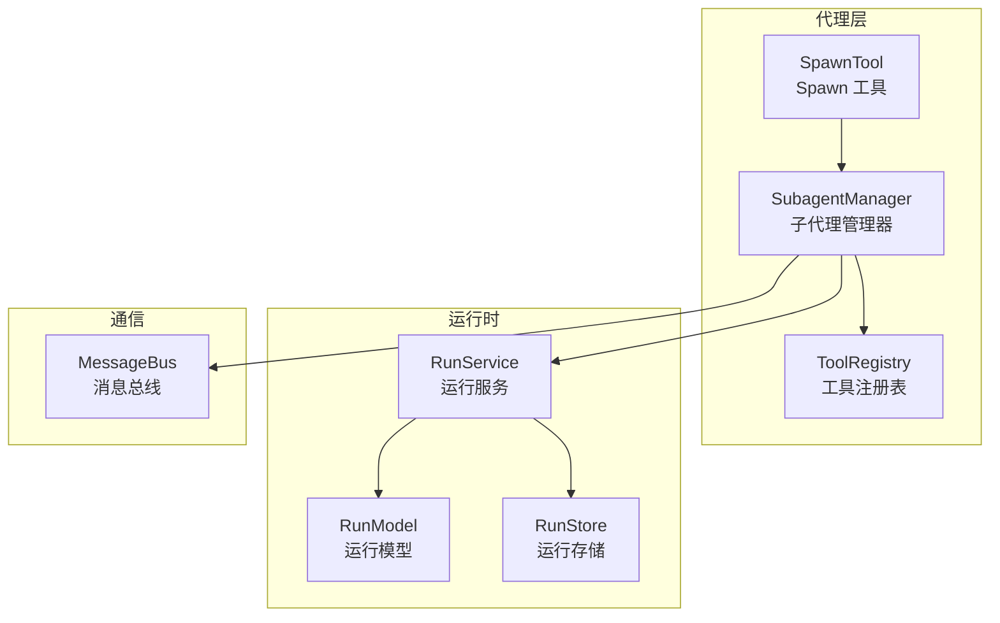
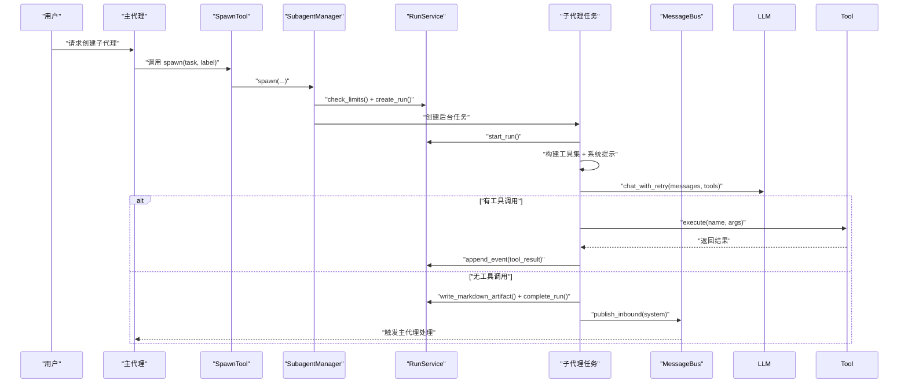
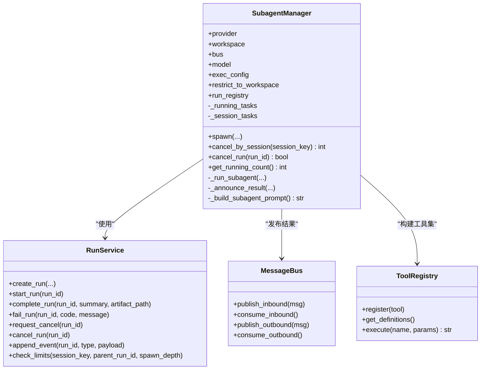
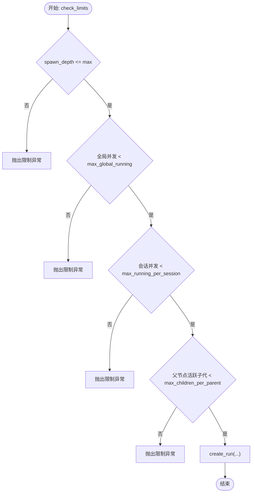
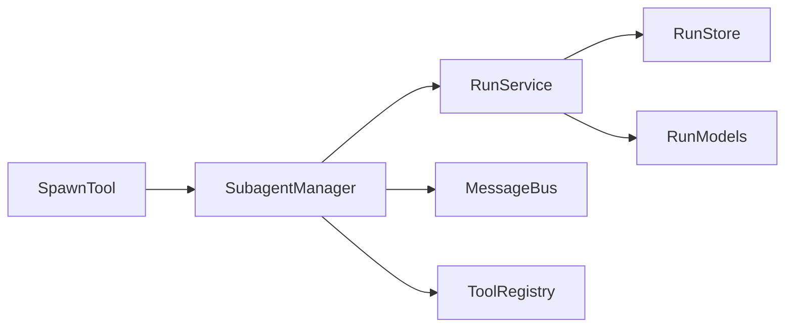

# 子代理管理器

<cite>
**本文引用的文件**
- [nanobot/agent/subagent.py](file://nanobot/agent/subagent.py)
- [nanobot/agent/tools/spawn.py](file://nanobot/agent/tools/spawn.py)
- [nanobot/platform/runs/service.py](file://nanobot/platform/runs/service.py)
- [nanobot/platform/runs/models.py](file://nanobot/platform/runs/models.py)
- [nanobot/platform/runs/store.py](file://nanobot/platform/runs/store.py)
- [nanobot/bus/queue.py](file://nanobot/bus/queue.py)
- [nanobot/agent/tools/registry.py](file://nanobot/agent/tools/registry.py)
- [nanobot/agent/context.py](file://nanobot/agent/context.py)
- [nanobot/agent/skills.py](file://nanobot/agent/skills.py)
- [nanobot/agent/loop.py](file://nanobot/agent/loop.py)
- [tests/test_run_registry.py](file://tests/test_run_registry.py)
- [tests/test_task_cancel.py](file://tests/test_task_cancel.py)
</cite>

## 目录
1. [简介](#简介)
2. [项目结构](#项目结构)
3. [核心组件](#核心组件)
4. [架构总览](#架构总览)
5. [详细组件分析](#详细组件分析)
6. [依赖关系分析](#依赖关系分析)
7. [性能考量](#性能考量)
8. [故障排查指南](#故障排查指南)
9. [结论](#结论)
10. [附录](#附录)

## 简介
本文件面向“子代理管理器”的技术文档，系统性阐述 SubagentManager 如何创建、管理与协调多个子代理实例，以实现复杂任务的并行处理与分工协作。文档覆盖子代理生命周期管理、任务分配策略、资源限制与并发控制机制；解释与主代理的通信协议、状态同步与结果聚合流程，并提供具体代码路径示例，展示如何创建自定义子代理、配置代理间通信以及处理代理失败恢复。

## 项目结构
子代理管理器位于 nanobot/agent/subagent.py，围绕以下关键模块协同工作：
- 运行时注册表：nanobot/platform/runs/*（服务、模型、存储）
- 消息总线：nanobot/bus/queue.py（解耦通道与代理核心）
- 工具体系：nanobot/agent/tools/*（工具注册表、Spawn 工具等）
- 上下文与技能：nanobot/agent/context.py、nanobot/agent/skills.py
- 主代理默认工具注册：nanobot/agent/loop.py

图表来源
- [nanobot/agent/subagent.py:28-358](file://nanobot/agent/subagent.py#L28-L358)
- [nanobot/agent/tools/spawn.py:11-75](file://nanobot/agent/tools/spawn.py#L11-L75)
- [nanobot/platform/runs/service.py:39-200](file://nanobot/platform/runs/service.py#L39-L200)
- [nanobot/platform/runs/models.py:16-161](file://nanobot/platform/runs/models.py#L16-L161)
- [nanobot/platform/runs/store.py:19-200](file://nanobot/platform/runs/store.py#L19-L200)
- [nanobot/bus/queue.py:8-44](file://nanobot/bus/queue.py#L8-L44)

章节来源
- [nanobot/agent/subagent.py:28-358](file://nanobot/agent/subagent.py#L28-L358)
- [nanobot/platform/runs/service.py:39-200](file://nanobot/platform/runs/service.py#L39-L200)
- [nanobot/bus/queue.py:8-44](file://nanobot/bus/queue.py#L8-L44)

## 核心组件
- SubagentManager：负责子代理的创建、执行、取消、会话级批量取消、运行计数统计与结果广播。
- SpawnTool：在主代理中暴露“spawn”工具，用于触发子代理创建。
- RunService/RunStore/RunModel：统一记录子代理生命周期、事件与结果，支持并发与深度限制检查。
- MessageBus：通过入站消息注入“system”通道，触发主代理对子代理完成/失败的响应。
- ToolRegistry：动态注册与执行工具，屏蔽工具差异，统一参数校验与错误提示。
- ContextBuilder/SkillsLoader：为子代理构建系统提示，注入运行时上下文与可用技能摘要。

章节来源
- [nanobot/agent/subagent.py:28-358](file://nanobot/agent/subagent.py#L28-L358)
- [nanobot/agent/tools/spawn.py:11-75](file://nanobot/agent/tools/spawn.py#L11-L75)
- [nanobot/platform/runs/service.py:39-200](file://nanobot/platform/runs/service.py#L39-L200)
- [nanobot/platform/runs/models.py:16-161](file://nanobot/platform/runs/models.py#L16-L161)
- [nanobot/platform/runs/store.py:19-200](file://nanobot/platform/runs/store.py#L19-L200)
- [nanobot/bus/queue.py:8-44](file://nanobot/bus/queue.py#L8-L44)
- [nanobot/agent/tools/registry.py:8-71](file://nanobot/agent/tools/registry.py#L8-L71)
- [nanobot/agent/context.py:16-132](file://nanobot/agent/context.py#L16-L132)
- [nanobot/agent/skills.py:13-141](file://nanobot/agent/skills.py#L13-L141)

## 架构总览
子代理管理器采用“异步任务 + 运行时注册表 + 消息总线”的解耦架构：
- 创建阶段：SpawnTool 调用 SubagentManager.spawn，进行运行记录创建与并发/深度限制检查，随后创建后台任务。
- 执行阶段：子代理循环调用 LLMProvider，按需调用 ToolRegistry 执行工具，记录事件与中间结果。
- 结果阶段：子代理完成或失败后，写入运行记录并广播“system”入站消息，由主代理消费并生成用户可读摘要。

图表来源
- [nanobot/agent/tools/spawn.py:60-74](file://nanobot/agent/tools/spawn.py#L60-L74)
- [nanobot/agent/subagent.py:55-118](file://nanobot/agent/subagent.py#L55-L118)
- [nanobot/platform/runs/service.py:75-121](file://nanobot/platform/runs/service.py#L75-L121)
- [nanobot/bus/queue.py:20-34](file://nanobot/bus/queue.py#L20-L34)

## 详细组件分析

### SubagentManager 组件
职责与行为：
- 生命周期管理：spawn 创建后台任务并登记；完成后清理；支持按会话批量取消与单任务取消。
- 并发与深度控制：在创建前调用 RunService.check_limits，基于全局、会话、父子分支维度限制。
- 任务执行：构建工具集（文件系统、命令执行、网络检索/抓取），循环与 LLM 交互，记录工具调用与结果，最终生成 Markdown 成果物并完成运行记录。
- 通信与同步：通过 MessageBus 发布“system”入站消息，携带简要摘要供主代理自然语言化回复。

图表来源
- [nanobot/agent/subagent.py:28-358](file://nanobot/agent/subagent.py#L28-L358)
- [nanobot/platform/runs/service.py:39-200](file://nanobot/platform/runs/service.py#L39-L200)
- [nanobot/bus/queue.py:8-44](file://nanobot/bus/queue.py#L8-L44)
- [nanobot/agent/tools/registry.py:8-71](file://nanobot/agent/tools/registry.py#L8-L71)

章节来源
- [nanobot/agent/subagent.py:28-358](file://nanobot/agent/subagent.py#L28-L358)

### SpawnTool 组件
- 作用：在主代理中暴露“spawn”工具，封装子代理创建所需的上下文（渠道、会话键、运行上下文）。
- 参数：task（必填）、label（可选）。
- 行为：调用 SubagentManager.spawn，传递 origin_channel/chat_id/session_key 与父运行上下文（agent_id/team_id/thread_id/run_id/root_run_id/spawn_depth）。

章节来源
- [nanobot/agent/tools/spawn.py:11-75](file://nanobot/agent/tools/spawn.py#L11-L75)
- [nanobot/agent/loop.py:155-156](file://nanobot/agent/loop.py#L155-L156)

### 运行时注册表（RunService/RunStore/RunModel）
- RunService：对外提供运行生命周期管理接口，包括创建、启动、完成、失败、取消、事件追加与限制检查。
- RunStore：基于 SQLite 的持久化存储，维护运行记录与事件索引。
- RunModel：定义运行类型、状态、控制范围、限制与记录结构。

图表来源
- [nanobot/platform/runs/service.py:320-337](file://nanobot/platform/runs/service.py#L320-L337)
- [nanobot/platform/runs/models.py:84-91](file://nanobot/platform/runs/models.py#L84-L91)
- [nanobot/platform/runs/store.py:19-82](file://nanobot/platform/runs/store.py#L19-L82)

章节来源
- [nanobot/platform/runs/service.py:39-200](file://nanobot/platform/runs/service.py#L39-L200)
- [nanobot/platform/runs/models.py:16-161](file://nanobot/platform/runs/models.py#L16-L161)
- [nanobot/platform/runs/store.py:19-200](file://nanobot/platform/runs/store.py#L19-L200)

### 工具注册与执行（ToolRegistry）
- 动态注册：按需注册文件读写、编辑、目录列举、命令执行、网页检索/抓取等工具。
- 执行流程：参数类型转换与校验，调用工具 execute，捕获异常并返回标准化错误信息。
- 与子代理集成：子代理在每次工具调用前后记录事件，便于审计与回放。

章节来源
- [nanobot/agent/subagent.py:134-213](file://nanobot/agent/subagent.py#L134-L213)
- [nanobot/agent/tools/registry.py:38-71](file://nanobot/agent/tools/registry.py#L38-L71)

### 上下文与技能（ContextBuilder/SkillsLoader）
- ContextBuilder：构建系统提示，注入运行时时间、平台策略、工作区路径与共享记忆等元数据。
- SkillsLoader：汇总可用技能清单，生成技能摘要，支持按需加载技能内容。

章节来源
- [nanobot/agent/context.py:16-132](file://nanobot/agent/context.py#L16-L132)
- [nanobot/agent/skills.py:101-141](file://nanobot/agent/skills.py#L101-L141)
- [nanobot/agent/subagent.py:308-328](file://nanobot/agent/subagent.py#L308-L328)

### 与主代理的通信协议与结果聚合
- 通信协议：子代理通过 MessageBus 发布 InboundMessage（channel="system"），携带任务摘要与结果正文，触发主代理处理。
- 状态同步：RunService 在关键生命周期事件（queued/started/completed/failed/cancelled/announced）追加事件，支持查询与审计。
- 结果聚合：子代理生成 Markdown 成果物并写入运行记录，主代理消费 system 消息后，将结果自然化为用户可读摘要。

章节来源
- [nanobot/agent/subagent.py:266-306](file://nanobot/agent/subagent.py#L266-L306)
- [nanobot/bus/queue.py:20-34](file://nanobot/bus/queue.py#L20-L34)
- [nanobot/platform/runs/service.py:199-200](file://nanobot/platform/runs/service.py#L199-L200)

## 依赖关系分析
- SubagentManager 对 RunService 的强依赖体现在创建、启动、完成、失败与事件记录上。
- SubagentManager 对 MessageBus 的依赖体现在结果广播与主代理触发上。
- SubagentManager 对 ToolRegistry 的依赖体现在工具集构建与执行上。
- SpawnTool 作为主代理工具，依赖 SubagentManager 完成实际创建工作。

图表来源
- [nanobot/agent/tools/spawn.py:60-74](file://nanobot/agent/tools/spawn.py#L60-L74)
- [nanobot/agent/subagent.py:28-358](file://nanobot/agent/subagent.py#L28-L358)
- [nanobot/platform/runs/service.py:39-200](file://nanobot/platform/runs/service.py#L39-L200)
- [nanobot/platform/runs/store.py:19-200](file://nanobot/platform/runs/store.py#L19-L200)
- [nanobot/bus/queue.py:8-44](file://nanobot/bus/queue.py#L8-L44)
- [nanobot/agent/tools/registry.py:8-71](file://nanobot/agent/tools/registry.py#L8-L71)

章节来源
- [nanobot/agent/tools/spawn.py:11-75](file://nanobot/agent/tools/spawn.py#L11-L75)
- [nanobot/agent/subagent.py:28-358](file://nanobot/agent/subagent.py#L28-L358)
- [nanobot/platform/runs/service.py:39-200](file://nanobot/platform/runs/service.py#L39-L200)

## 性能考量
- 并发控制：通过 RunService 的全局并发、会话并发与父子分支限制，避免资源争用与过载。
- 迭代上限：子代理循环最大迭代次数限制，防止长尾任务占用资源。
- 工具执行：工具执行前进行参数类型转换与校验，减少无效调用与重试成本。
- 存储与事件：RunStore 建立多索引，提升查询效率；事件按运行记录分组，便于审计与回放。

章节来源
- [nanobot/platform/runs/models.py:84-91](file://nanobot/platform/runs/models.py#L84-L91)
- [nanobot/platform/runs/store.py:22-82](file://nanobot/platform/runs/store.py#L22-L82)
- [nanobot/agent/subagent.py:156-160](file://nanobot/agent/subagent.py#L156-L160)
- [nanobot/agent/tools/registry.py:46-59](file://nanobot/agent/tools/registry.py#L46-L59)

## 故障排查指南
- 限制异常：当 spawn_depth、全局并发、会话并发或父子分支超出阈值时，会抛出 RunLimitExceededError。可通过调整 RunLimits 或等待现有任务释放资源解决。
- 取消与恢复：支持按会话批量取消与单任务取消。被取消的任务会进入“cancelled”状态并记录事件；可重新提交任务。
- 失败诊断：子代理失败时会记录“failed”事件与错误码/消息；可在运行记录中查看事件序列与结果摘要。
- 测试验证：仓库提供了运行记录生命周期与取消行为的测试用例，可参考其断言与期望行为。

章节来源
- [tests/test_run_registry.py:53-90](file://tests/test_run_registry.py#L53-L90)
- [tests/test_run_registry.py:126-183](file://tests/test_run_registry.py#L126-L183)
- [tests/test_task_cancel.py:119-156](file://tests/test_task_cancel.py#L119-L156)
- [nanobot/platform/runs/service.py:161-173](file://nanobot/platform/runs/service.py#L161-L173)
- [nanobot/platform/runs/service.py:184-197](file://nanobot/platform/runs/service.py#L184-L197)

## 结论
SubagentManager 通过“运行时注册表 + 异步任务 + 消息总线”的组合，实现了子代理的可靠创建、可控并发与可观测执行。结合 SpawnTool 的易用接口与 RunService 的严格限制策略，系统能够在复杂任务场景下实现并行处理与分工协作，同时保证状态一致性与可恢复性。建议在生产环境中合理配置 RunLimits，并利用运行记录与事件流进行监控与审计。

## 附录

### 具体代码示例（路径指引）
- 创建自定义子代理（通过主代理的 spawn 工具）
  - 示例路径：[nanobot/agent/tools/spawn.py:60-74](file://nanobot/agent/tools/spawn.py#L60-L74)
  - 主代理默认注册位置：[nanobot/agent/loop.py:155-156](file://nanobot/agent/loop.py#L155-L156)

- 配置代理间通信（system 入站消息）
  - 发布入口：[nanobot/agent/subagent.py:288-295](file://nanobot/agent/subagent.py#L288-L295)
  - 消费入口（主代理侧）：[nanobot/bus/queue.py:24-26](file://nanobot/bus/queue.py#L24-L26)

- 处理代理失败恢复（运行记录与事件）
  - 失败记录与事件：[nanobot/platform/runs/service.py:161-173](file://nanobot/platform/runs/service.py#L161-L173)
  - 运行记录事件追加：[nanobot/platform/runs/service.py:199-200](file://nanobot/platform/runs/service.py#L199-L200)

- 任务分配与并发控制（限制检查）
  - 限制检查逻辑：[nanobot/platform/runs/service.py:320-337](file://nanobot/platform/runs/service.py#L320-L337)
  - 默认限制参数：[nanobot/platform/runs/models.py:84-91](file://nanobot/platform/runs/models.py#L84-L91)

- 子代理生命周期测试参考
  - 生命周期与结果断言：[tests/test_run_registry.py:126-183](file://tests/test_run_registry.py#L126-L183)
  - 会话级取消测试：[tests/test_task_cancel.py:119-156](file://tests/test_task_cancel.py#L119-L156)