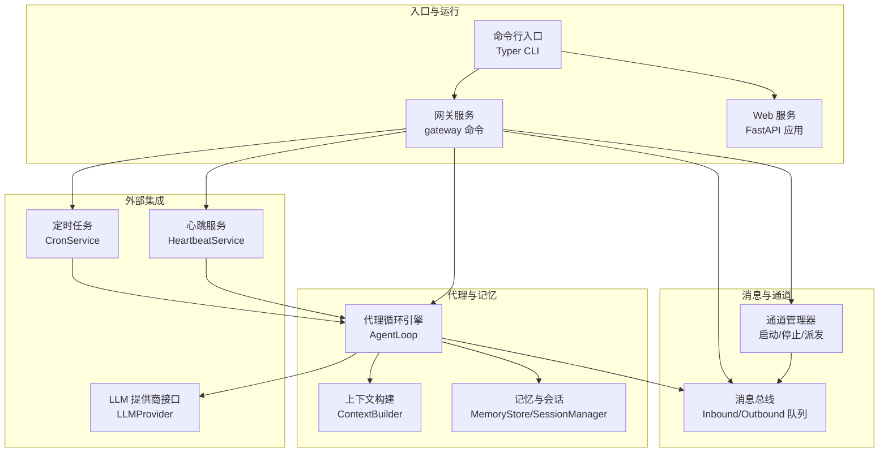
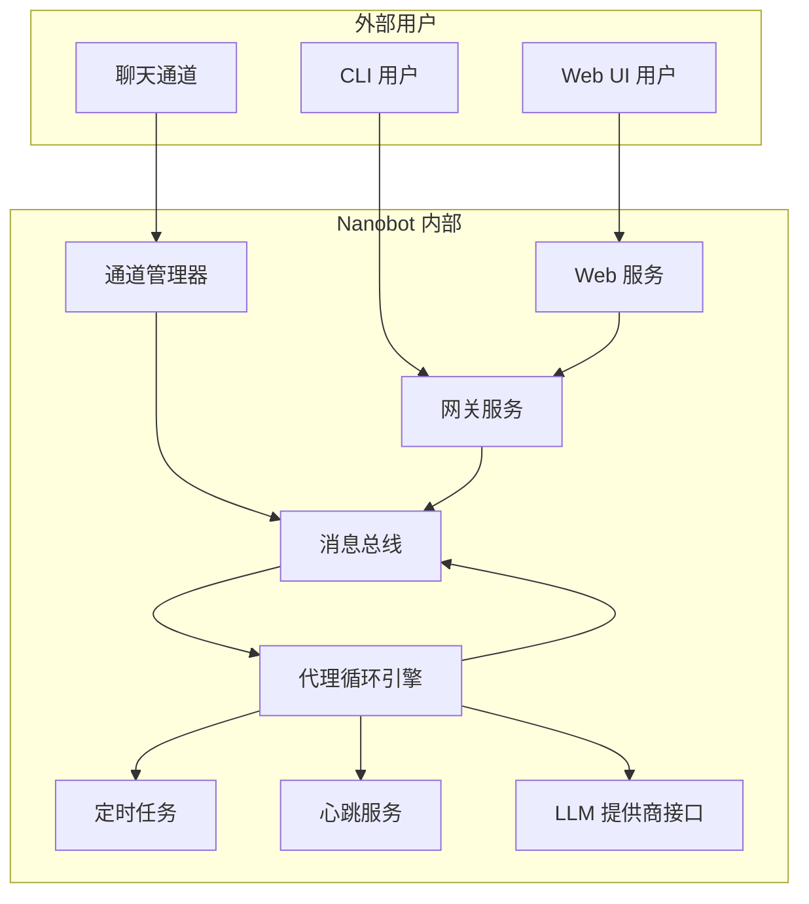
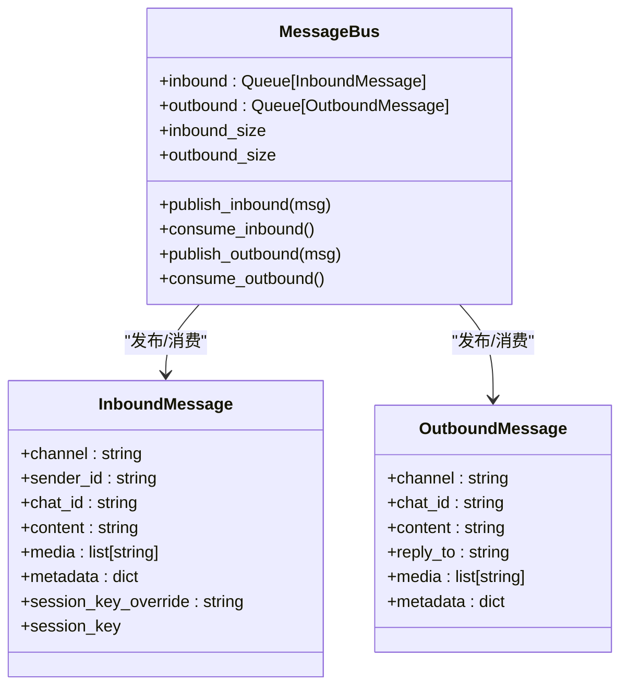
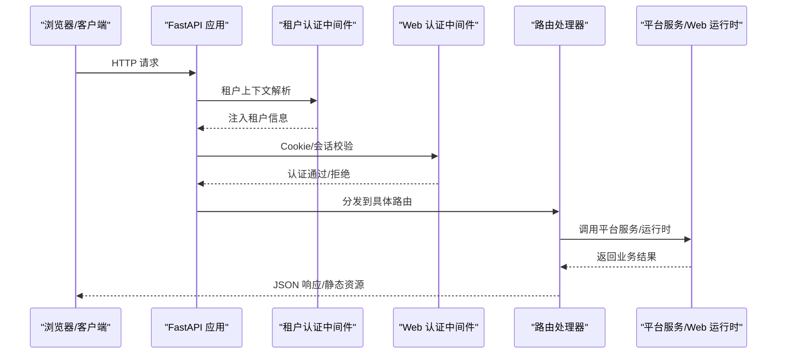
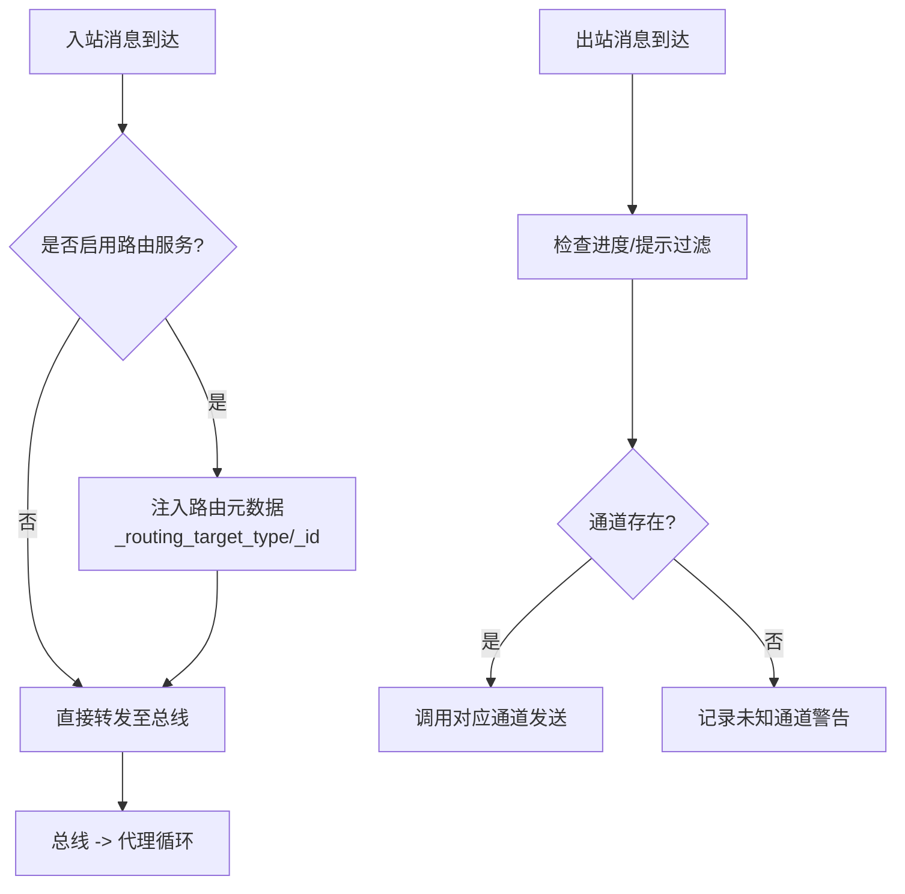
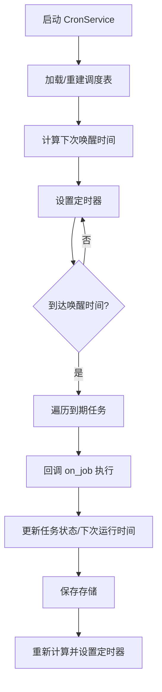
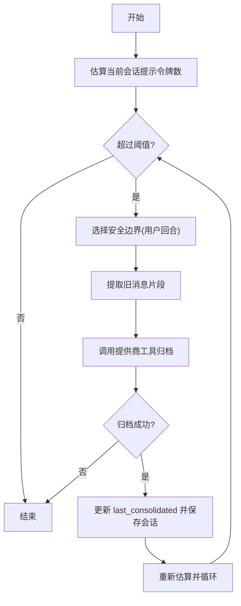
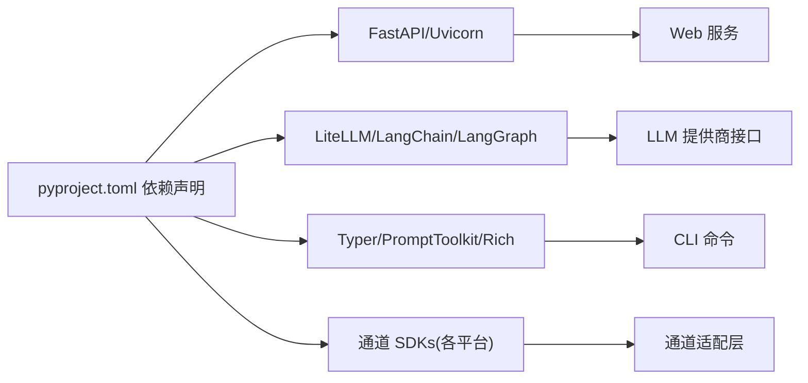

# 核心架构

<cite>
**本文引用的文件**
- [README.md](file://README.md)
- [nanobot/__main__.py](file://nanobot/__main__.py)
- [pyproject.toml](file://pyproject.toml)
- [Dockerfile](file://Dockerfile)
- [docker-compose.yml](file://docker-compose.yml)
- [nanobot/cli/commands.py](file://nanobot/cli/commands.py)
- [nanobot/agent/loop.py](file://nanobot/agent/loop.py)
- [nanobot/bus/events.py](file://nanobot/bus/events.py)
- [nanobot/bus/queue.py](file://nanobot/bus/queue.py)
- [nanobot/web/app.py](file://nanobot/web/app.py)
- [nanobot/web/api.py](file://nanobot/web/api.py)
- [nanobot/channels/manager.py](file://nanobot/channels/manager.py)
- [nanobot/providers/base.py](file://nanobot/providers/base.py)
- [nanobot/session/manager.py](file://nanobot/session/manager.py)
- [nanobot/agent/context.py](file://nanobot/agent/context.py)
- [nanobot/agent/memory.py](file://nanobot/agent/memory.py)
- [nanobot/cron/service.py](file://nanobot/cron/service.py)
</cite>

## 目录
1. [引言](#引言)
2. [项目结构](#项目结构)
3. [核心组件](#核心组件)
4. [架构总览](#架构总览)
5. [详细组件分析](#详细组件分析)
6. [依赖关系分析](#依赖关系分析)
7. [性能考量](#性能考量)
8. [故障排查指南](#故障排查指南)
9. [结论](#结论)
10. [附录](#附录)

## 引言
本文件面向 Nanobot 的核心架构，聚焦于高层设计、架构模式与系统边界，系统化阐述代理循环引擎、消息总线与 Web 服务架构的设计理念与实现细节，并覆盖组件交互、数据流、集成模式、技术决策与权衡、基础设施需求、可扩展性与部署拓扑、横切关注点（安全、监控、灾备）以及技术栈与第三方依赖的版本兼容性。

## 项目结构
Nanobot 采用“命令行入口 + 网关服务 + 多通道适配 + 消息总线 + 代理循环引擎 + 记忆与会话”的分层组织方式。核心模块包括：
- 命令行与入口：通过 Typer 提供 CLI 子命令，支持初始化、网关启动、Web UI 启动等。
- 网关服务：聚合消息总线、通道管理器、代理循环、定时任务、心跳服务等，统一对外提供服务。
- 代理循环引擎：负责构建上下文、调用大模型、执行工具、管理会话与记忆。
- 消息总线：异步队列解耦通道与代理，支持进度/提示消息的细粒度控制。
- Web 服务：基于 FastAPI 的 Web UI，提供认证、路由、前端资源托管与运行时状态管理。
- 平台服务：多租户、团队、知识库、运行产物等平台能力，支撑多智能体协作与编排。



图表来源
- [nanobot/cli/commands.py](file://nanobot/cli/commands.py)
- [nanobot/web/app.py](file://nanobot/web/app.py)
- [nanobot/bus/queue.py](file://nanobot/bus/queue.py)
- [nanobot/channels/manager.py](file://nanobot/channels/manager.py)
- [nanobot/agent/loop.py](file://nanobot/agent/loop.py)
- [nanobot/agent/context.py](file://nanobot/agent/context.py)
- [nanobot/agent/memory.py](file://nanobot/agent/memory.py)
- [nanobot/providers/base.py](file://nanobot/providers/base.py)
- [nanobot/cron/service.py](file://nanobot/cron/service.py)

章节来源
- [README.md](file://README.md)
- [nanobot/__main__.py](file://nanobot/__main__.py)
- [pyproject.toml](file://pyproject.toml)

## 核心组件
- 代理循环引擎（AgentLoop）
  - 负责接收消息、构建上下文、调用 LLM、执行工具、发送响应；支持最大迭代次数、令牌窗口限制、MCP 连接延迟建立、会话管理与记忆归档。
- 消息总线（MessageBus）
  - 异步入站/出站队列，解耦通道与代理；支持进度提示与工具提示的过滤策略。
- 上下文构建（ContextBuilder）
  - 组装系统提示、工作区引导文件、技能、长程记忆与运行时元信息，生成标准化消息序列。
- 记忆与会话（MemoryStore/SessionManager）
  - 两层记忆：MEMORY.md（长期事实）与 HISTORY.md（可 grep 日志），会话以 JSONL 存储，支持按令牌数阈值自动归档。
- 通道管理（ChannelManager）
  - 动态发现与启动各聊天通道，统一出站派发；支持路由增强的入站代理。
- Web 服务（FastAPI）
  - 提供认证中间件、路由注册、静态/热更新前端托管、运行时状态管理。
- 定时任务（CronService）
  - 支持一次性、周期、Cron 表达式三种调度，持久化存储，定时触发代理执行或直接投递消息。
- LLM 提供商接口（LLMProvider）
  - 统一聊天接口与重试策略，屏蔽不同提供商差异；支持工具定义注入与消息清洗。

章节来源
- [nanobot/agent/loop.py](file://nanobot/agent/loop.py)
- [nanobot/bus/queue.py](file://nanobot/bus/queue.py)
- [nanobot/agent/context.py](file://nanobot/agent/context.py)
- [nanobot/agent/memory.py](file://nanobot/agent/memory.py)
- [nanobot/session/manager.py](file://nanobot/session/manager.py)
- [nanobot/channels/manager.py](file://nanobot/channels/manager.py)
- [nanobot/web/app.py](file://nanobot/web/app.py)
- [nanobot/cron/service.py](file://nanobot/cron/service.py)
- [nanobot/providers/base.py](file://nanobot/providers/base.py)

## 架构总览
Nanobot 采用“事件驱动 + 异步解耦 + 可插拔通道 + 多租户平台服务”的架构模式。系统边界清晰：网关服务作为统一入口，内部通过消息总线连接代理循环引擎与各通道；Web 服务独立提供 UI 与平台能力；外部通过提供商接口对接多家大模型服务；定时任务与心跳服务提供后台自动化与健康保障。



图表来源
- [nanobot/cli/commands.py](file://nanobot/cli/commands.py)
- [nanobot/web/app.py](file://nanobot/web/app.py)
- [nanobot/bus/queue.py](file://nanobot/bus/queue.py)
- [nanobot/channels/manager.py](file://nanobot/channels/manager.py)
- [nanobot/agent/loop.py](file://nanobot/agent/loop.py)
- [nanobot/cron/service.py](file://nanobot/cron/service.py)

## 详细组件分析

### 代理循环引擎（AgentLoop）
- 设计要点
  - 事件驱动：从消息总线消费入站消息，使用全局锁保证同一会话并发安全。
  - 工具注册：默认注册文件系统、网络搜索/抓取、消息发送、子代理、定时任务等工具。
  - 上下文构建：结合历史、技能、长程记忆与运行时元信息，生成标准化消息序列。
  - LLM 调用：封装提供商接口，支持工具调用与思考/推理内容回传。
  - 记忆归档：根据令牌预算动态归档旧消息，避免超出上下文窗口。
  - MCP 连接：延迟建立，失败可重试，生命周期随代理关闭。
- 关键流程（处理一条消息）

```mermaid
sequenceDiagram
participant Bus as "消息总线"
participant Loop as "代理循环引擎"
participant Ctx as "上下文构建"
participant Prov as "LLM 提供商"
participant Tools as "工具集"
participant Mem as "记忆/会话"
Bus-->>Loop : 入站消息(InboundMessage)
Loop->>Mem : 加载/创建会话
Loop->>Ctx : 构建系统提示+历史+运行时上下文
Loop->>Prov : chat_with_retry(含工具定义)
Prov-->>Loop : LLMResponse(文本/工具调用)
alt 包含工具调用
Loop->>Tools : 执行工具
Tools-->>Loop : 工具结果
Loop->>Prov : 迭代调用直至无工具调用
end
Loop->>Mem : 归档旧消息(按令牌预算)
Loop-->>Bus : 出站消息(OutboundMessage)
```

图表来源
- [nanobot/agent/loop.py](file://nanobot/agent/loop.py)
- [nanobot/agent/context.py](file://nanobot/agent/context.py)
- [nanobot/agent/memory.py](file://nanobot/agent/memory.py)
- [nanobot/providers/base.py](file://nanobot/providers/base.py)
- [nanobot/bus/queue.py](file://nanobot/bus/queue.py)

章节来源
- [nanobot/agent/loop.py](file://nanobot/agent/loop.py)
- [nanobot/agent/context.py](file://nanobot/agent/context.py)
- [nanobot/agent/memory.py](file://nanobot/agent/memory.py)
- [nanobot/providers/base.py](file://nanobot/providers/base.py)

### 消息总线系统（MessageBus）
- 设计要点
  - 使用 asyncio.Queue 实现异步入站/出站队列，解耦通道与代理。
  - 出站派发支持进度与工具提示过滤，由通道配置决定是否展示。
- 数据结构



图表来源
- [nanobot/bus/queue.py](file://nanobot/bus/queue.py)
- [nanobot/bus/events.py](file://nanobot/bus/events.py)

章节来源
- [nanobot/bus/queue.py](file://nanobot/bus/queue.py)
- [nanobot/bus/events.py](file://nanobot/bus/events.py)

### Web 服务架构（FastAPI）
- 设计要点
  - 生命周期管理：在 lifespan 中初始化平台服务与运行时状态，确保资源有序释放。
  - 中间件链：租户认证中间件优先于 Web 认证中间件，统一鉴权策略。
  - 路由注册：按模块划分 API 路由，统一异常处理与 404 拦截。
  - 前端托管：支持静态打包与开发热更新两种模式，自动降级。
- 关键流程（请求处理）



图表来源
- [nanobot/web/app.py](file://nanobot/web/app.py)
- [nanobot/web/api.py](file://nanobot/web/api.py)

章节来源
- [nanobot/web/app.py](file://nanobot/web/app.py)
- [nanobot/web/api.py](file://nanobot/web/api.py)

### 通道管理与路由（ChannelManager）
- 设计要点
  - 动态发现：通过包扫描加载已启用的通道实现类，统一初始化与启动。
  - 出站派发：从总线消费出站消息，按通道类型发送；支持进度/提示过滤。
  - 路由增强：当提供路由服务时，入站消息写入代理前注入路由目标元数据。
- 流程图（入站/出站）



图表来源
- [nanobot/channels/manager.py](file://nanobot/channels/manager.py)
- [nanobot/bus/queue.py](file://nanobot/bus/queue.py)

章节来源
- [nanobot/channels/manager.py](file://nanobot/channels/manager.py)
- [nanobot/bus/queue.py](file://nanobot/bus/queue.py)

### 定时任务与心跳（CronService/HeartbeatService）
- 设计要点
  - CronService：支持一次性(at)、周期(every)、Cron 表达式三种调度，持久化存储，定时器按最近唤醒时间调度。
  - 心跳服务：周期性触发代理执行任务，支持选择可用通道进行通知。
- 流程图（定时器触发）



图表来源
- [nanobot/cron/service.py](file://nanobot/cron/service.py)

章节来源
- [nanobot/cron/service.py](file://nanobot/cron/service.py)

### 记忆与会话（MemoryStore/SessionManager）
- 设计要点
  - 两层记忆：MEMORY.md（长期事实）、HISTORY.md（日志归档），工具化保存与归档。
  - 会话持久化：JSONL 文件存储，支持迁移与缓存；提供历史视图与清理。
  - 令牌预算：按消息估算令牌数，自动选择用户回合边界进行归档，维持上下文窗口安全。
- 流程图（令牌预算归档）



图表来源
- [nanobot/agent/memory.py](file://nanobot/agent/memory.py)
- [nanobot/session/manager.py](file://nanobot/session/manager.py)

章节来源
- [nanobot/agent/memory.py](file://nanobot/agent/memory.py)
- [nanobot/session/manager.py](file://nanobot/session/manager.py)

## 依赖关系分析
- 技术栈与版本约束
  - Python 3.11+，核心依赖包括 FastAPI、Uvicorn、LiteLLM、LangChain/LangGraph、Typer、Pydantic 等。
  - 可选依赖覆盖 Matrix、WeCom 等通道生态。
- 关键依赖关系



图表来源
- [pyproject.toml](file://pyproject.toml)

章节来源
- [pyproject.toml](file://pyproject.toml)

## 性能考量
- 异步解耦与背压
  - 消息总线采用队列解耦，避免阻塞通道；出站派发支持进度/提示过滤，减少冗余输出。
- 令牌预算与归档
  - 通过估计提示令牌数与用户回合边界，自动归档旧消息，维持上下文窗口安全，降低 LLM 调用成本。
- 工具调用与迭代上限
  - 设置最大迭代次数，防止无限工具调用循环；对错误响应不持久化，避免上下文污染。
- MCP 连接延迟
  - 延迟建立 MCP 连接，失败可重试，避免启动阶段阻塞。
- 定时器与最小唤醒间隔
  - CronService 按最近唤醒时间调度，减少无效轮询。

## 故障排查指南
- 常见问题定位
  - 代理无响应：检查消息总线队列长度与代理运行状态；确认通道已正确启动并写入入站消息。
  - 工具调用失败：查看工具注册与权限白名单；确认工作区路径限制与代理上下文中的工具定义。
  - 记忆归档失败：检查提供商工具调用返回与参数格式；确认 MEMORY.md/HISTORY.md 写入权限。
  - Web UI 无法访问：确认认证中间件与 Cookie 状态；检查静态资源托管与前端模式。
  - 定时任务未触发：核对调度表达式与时区；检查 CronStore 文件权限与最近唤醒时间。
- 排查建议
  - 开启详细日志（CLI/网关命令支持 --verbose 或运行时日志开关）。
  - 使用 CLI agent 模式进行单次调用验证，隔离通道与总线问题。
  - 检查会话文件完整性与 last_consolidated 更新情况。

章节来源
- [nanobot/cli/commands.py](file://nanobot/cli/commands.py)
- [nanobot/agent/loop.py](file://nanobot/agent/loop.py)
- [nanobot/web/app.py](file://nanobot/web/app.py)
- [nanobot/cron/service.py](file://nanobot/cron/service.py)

## 结论
Nanobot 的核心架构以“事件驱动 + 异步解耦 + 可插拔通道 + 多租户平台服务”为核心，通过消息总线实现通道与代理的松耦合，借助代理循环引擎统一上下文构建、工具执行与记忆归档，配合 Web 服务与平台能力提供完整的用户体验与扩展空间。该架构在保持轻量与可读性的同时，兼顾了稳定性、可观测性与可维护性，适合研究与生产环境的双重需求。

## 附录
- 部署拓扑
  - 单机部署：容器内运行网关与 Web UI，默认暴露网关端口；通道桥接（如 WhatsApp）需本地 Node.js 环境。
  - 编排部署：使用 docker-compose 启动网关与 CLI 容器，挂载配置目录；CPU/内存资源限制按需调整。
- 基础设施需求
  - Python 3.11+，可选 Node.js（WhatsApp 桥接），各通道所需的第三方 SDK。
- 安全与监控
  - Web 认证中间件强制 Cookie 校验；API 异常统一处理；日志使用 loguru，支持运行时开关。
- 灾难恢复
  - 会话与记忆文件持久化；CronStore 文件可外置挂载；通道状态与 MCP 连接具备重试与清理逻辑。

章节来源
- [Dockerfile](file://Dockerfile)
- [docker-compose.yml](file://docker-compose.yml)
- [nanobot/web/app.py](file://nanobot/web/app.py)
- [nanobot/channels/manager.py](file://nanobot/channels/manager.py)
- [nanobot/agent/memory.py](file://nanobot/agent/memory.py)
- [nanobot/cron/service.py](file://nanobot/cron/service.py)