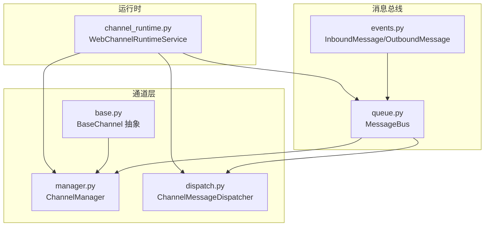
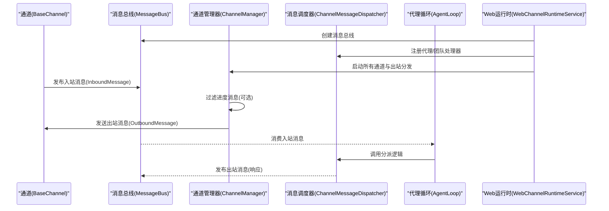
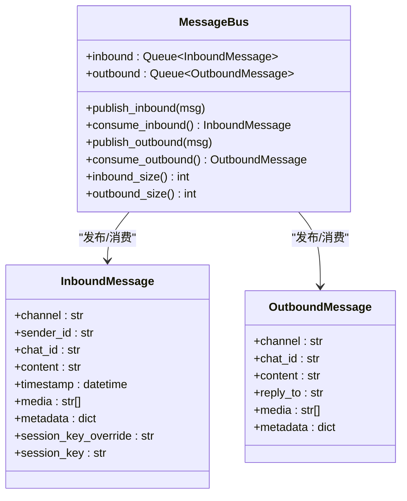
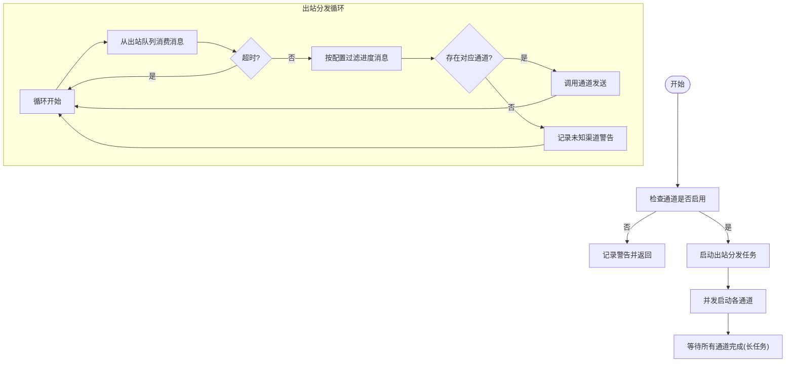
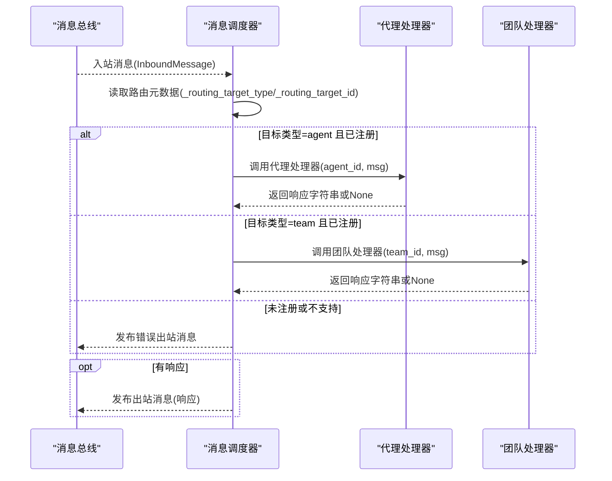
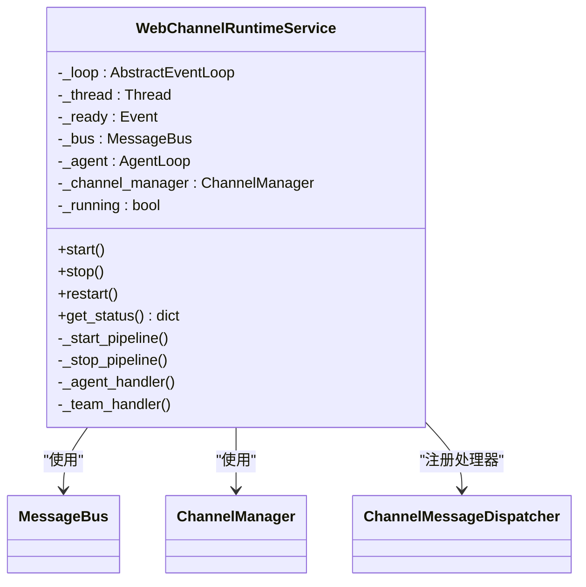
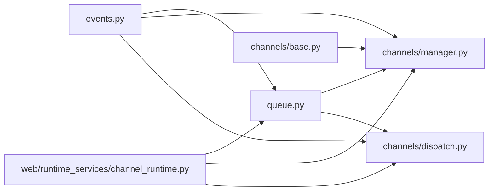

# 消息总线系统

<cite>
**本文引用的文件**
- [nanobot/bus/events.py](file://nanobot/bus/events.py)
- [nanobot/bus/queue.py](file://nanobot/bus/queue.py)
- [nanobot/bus/__init__.py](file://nanobot/bus/__init__.py)
- [nanobot/channels/base.py](file://nanobot/channels/base.py)
- [nanobot/channels/manager.py](file://nanobot/channels/manager.py)
- [nanobot/channels/dispatch.py](file://nanobot/channels/dispatch.py)
- [nanobot/web/runtime_services/channel_runtime.py](file://nanobot/web/runtime_services/channel_runtime.py)
- [tests/test_channel_dispatch.py](file://tests/test_channel_dispatch.py)
- [tests/test_channel_routing_e2e.py](file://tests/test_channel_routing_e2e.py)
</cite>

## 目录
1. [简介](#简介)
2. [项目结构](#项目结构)
3. [核心组件](#核心组件)
4. [架构总览](#架构总览)
5. [详细组件分析](#详细组件分析)
6. [依赖分析](#依赖分析)
7. [性能考虑](#性能考虑)
8. [故障排查指南](#故障排查指南)
9. [结论](#结论)
10. [附录](#附录)

## 简介
本技术文档围绕消息总线系统展开，系统通过异步消息队列解耦聊天通道与智能体核心，采用事件驱动与生产者-消费者模式实现跨渠道的消息分发与响应。文档涵盖以下主题：
- 架构设计：消息总线、通道管理器、消息调度器与运行时服务之间的协作关系
- 事件驱动与异步消息传递：基于 asyncio 的入站/出站队列与阻塞消费
- 消息路由策略：基于通道绑定的服务解析目标并注入元数据
- 事件处理器注册机制：通过回调函数注册代理与团队处理器
- 序列化与传输：消息载体 InboundMessage/OutboundMessage 的字段与语义
- 生产者-消费者模式在代理系统中的应用：通道作为生产者，代理与调度器作为消费者
- 错误处理与重试：异常捕获、错误回传与重试策略（参考提供者层）
- 性能监控与调试：队列长度、线程与事件循环管理、日志记录

## 项目结构
消息总线相关代码主要位于 nanobot/bus 与 nanobot/channels 子模块，并由 Web 运行时服务进行编排。关键目录与文件如下：
- nanobot/bus：定义消息事件类型与异步消息总线
- nanobot/channels：通道抽象、通道管理器、消息调度器
- nanobot/web/runtime_services：Web UI 的通道运行时服务，负责启动代理循环与通道
- tests：针对消息调度与路由的端到端测试

图表来源
- [nanobot/bus/events.py:1-39](file://nanobot/bus/events.py#L1-L39)
- [nanobot/bus/queue.py:1-45](file://nanobot/bus/queue.py#L1-L45)
- [nanobot/channels/base.py:1-135](file://nanobot/channels/base.py#L1-L135)
- [nanobot/channels/manager.py:1-209](file://nanobot/channels/manager.py#L1-L209)
- [nanobot/channels/dispatch.py:1-93](file://nanobot/channels/dispatch.py#L1-L93)
- [nanobot/web/runtime_services/channel_runtime.py:1-382](file://nanobot/web/runtime_services/channel_runtime.py#L1-L382)

章节来源
- [nanobot/bus/__init__.py:1-7](file://nanobot/bus/__init__.py#L1-L7)
- [nanobot/bus/events.py:1-39](file://nanobot/bus/events.py#L1-L39)
- [nanobot/bus/queue.py:1-45](file://nanobot/bus/queue.py#L1-L45)
- [nanobot/channels/base.py:1-135](file://nanobot/channels/base.py#L1-L135)
- [nanobot/channels/manager.py:1-209](file://nanobot/channels/manager.py#L1-L209)
- [nanobot/channels/dispatch.py:1-93](file://nanobot/channels/dispatch.py#L1-L93)
- [nanobot/web/runtime_services/channel_runtime.py:1-382](file://nanobot/web/runtime_services/channel_runtime.py#L1-L382)

## 核心组件
- 消息事件模型
  - 入站消息 InboundMessage：封装来自聊天通道的消息，包含渠道、发送者、会话键、内容、媒体列表与元数据等
  - 出站消息 OutboundMessage：封装待发送给通道的响应消息
- 异步消息总线 MessageBus：提供入站/出站队列的发布与消费接口，支持查询队列长度
- 通道抽象 BaseChannel：定义通道生命周期与发送接口，统一将入站消息封装为 InboundMessage 并通过总线发布
- 通道管理器 ChannelManager：初始化启用的通道、启动/停止通道、启动出站分发任务、根据配置过滤进度消息
- 消息调度器 ChannelMessageDispatcher：依据消息元数据中的路由目标类型与 ID，调用代理或团队处理器，并将结果作为出站消息回写
- Web 运行时服务 WebChannelRuntimeService：在独立线程与事件循环中启动代理循环与通道，构建路由服务、消息总线与调度器，协调全链路消息流转

章节来源
- [nanobot/bus/events.py:8-39](file://nanobot/bus/events.py#L8-L39)
- [nanobot/bus/queue.py:8-45](file://nanobot/bus/queue.py#L8-L45)
- [nanobot/channels/base.py:15-135](file://nanobot/channels/base.py#L15-L135)
- [nanobot/channels/manager.py:52-209](file://nanobot/channels/manager.py#L52-L209)
- [nanobot/channels/dispatch.py:13-93](file://nanobot/channels/dispatch.py#L13-L93)
- [nanobot/web/runtime_services/channel_runtime.py:31-382](file://nanobot/web/runtime_services/channel_runtime.py#L31-L382)

## 架构总览
消息从各聊天通道进入，经通道抽象封装为入站消息并通过消息总线发布；通道管理器启动后，从出站队列消费响应消息并转发至对应通道；同时，代理循环与消息调度器基于入站消息的路由元数据，将消息分派给代理或团队处理器。

图表来源
- [nanobot/web/runtime_services/channel_runtime.py:142-186](file://nanobot/web/runtime_services/channel_runtime.py#L142-L186)
- [nanobot/channels/manager.py:160-190](file://nanobot/channels/manager.py#L160-L190)
- [nanobot/channels/dispatch.py:36-93](file://nanobot/channels/dispatch.py#L36-L93)
- [nanobot/bus/queue.py:20-34](file://nanobot/bus/queue.py#L20-L34)

## 详细组件分析

### 组件一：消息总线与事件模型
- 设计要点
  - 使用 asyncio.Queue 实现入站/出站队列，提供发布与阻塞消费接口
  - 支持查询队列长度，便于性能监控
  - InboundMessage/OutboundMessage 以数据类形式承载消息字段，保证结构清晰与扩展性
- 复杂度与性能
  - 队列入队/出队为 O(1)，适合高并发场景
  - 阻塞消费避免忙轮询，降低 CPU 占用
- 错误处理
  - 消费侧通过超时与取消控制流程，防止无限阻塞

图表来源
- [nanobot/bus/queue.py:8-45](file://nanobot/bus/queue.py#L8-L45)
- [nanobot/bus/events.py:8-39](file://nanobot/bus/events.py#L8-L39)

章节来源
- [nanobot/bus/queue.py:8-45](file://nanobot/bus/queue.py#L8-L45)
- [nanobot/bus/events.py:8-39](file://nanobot/bus/events.py#L8-L39)

### 组件二：通道抽象与管理
- 设计要点
  - BaseChannel 定义通道生命周期与发送接口，统一权限校验与消息封装
  - ChannelManager 初始化启用的通道，启动出站分发任务，按配置过滤进度消息
  - 通过 _RoutingBusProxy 在入站消息中注入路由元数据，供调度器使用
- 处理逻辑
  - 入站：通道接收平台消息，校验权限后封装为 InboundMessage 并发布到总线
  - 出站：从出站队列消费消息，按渠道查找通道并发送
- 错误处理
  - 启动/停止通道时捕获异常并记录日志
  - 出站分发对未知渠道发出警告

图表来源
- [nanobot/channels/manager.py:122-190](file://nanobot/channels/manager.py#L122-L190)

章节来源
- [nanobot/channels/base.py:52-135](file://nanobot/channels/base.py#L52-L135)
- [nanobot/channels/manager.py:52-209](file://nanobot/channels/manager.py#L52-L209)

### 组件三：消息调度与路由
- 设计要点
  - ChannelMessageDispatcher 基于消息元数据中的路由目标类型与 ID，调用相应处理器
  - 支持代理处理器与团队处理器两种目标类型
  - 异常捕获并回写错误消息，确保消息总线持续可用
- 路由策略
  - 通过 _RoutingBusProxy 将解析后的路由目标注入消息元数据
  - 支持精确匹配优先于通配符匹配
- 测试验证
  - 单测覆盖无路由元数据、空目标、代理/团队处理器调用、None 返回值、无处理器与异常场景

图表来源
- [nanobot/channels/dispatch.py:36-93](file://nanobot/channels/dispatch.py#L36-L93)
- [tests/test_channel_dispatch.py:23-144](file://tests/test_channel_dispatch.py#L23-L144)

章节来源
- [nanobot/channels/dispatch.py:13-93](file://nanobot/channels/dispatch.py#L13-L93)
- [tests/test_channel_dispatch.py:20-144](file://tests/test_channel_dispatch.py#L20-L144)

### 组件四：Web 运行时服务与生产者-消费者
- 设计要点
  - 在独立线程中创建 asyncio 事件循环，避免阻塞 Web 服务器事件循环
  - 构建路由服务、消息总线、调度器与代理循环，协调全链路消息流转
  - 提供启动/停止/重启与状态查询接口
- 生产者-消费者模式
  - 通道作为生产者：监听平台消息并发布入站消息
  - 代理循环与调度器作为消费者：消费入站消息并生成出站消息
  - 通道管理器作为消费者：从出站队列消费并发送到对应通道

图表来源
- [nanobot/web/runtime_services/channel_runtime.py:31-382](file://nanobot/web/runtime_services/channel_runtime.py#L31-L382)

章节来源
- [nanobot/web/runtime_services/channel_runtime.py:31-382](file://nanobot/web/runtime_services/channel_runtime.py#L31-L382)

## 依赖分析
- 模块内聚与耦合
  - 消息总线与事件模型低耦合，仅通过数据类进行交互
  - 通道管理器依赖通道抽象与配置，耦合度适中
  - 调度器依赖消息总线与处理器回调，职责单一
  - Web 运行时服务聚合多个组件，承担编排职责
- 外部依赖
  - asyncio：异步队列与事件循环
  - loguru：日志记录
  - 测试框架 pytest：端到端与单元测试

图表来源
- [nanobot/bus/events.py:1-39](file://nanobot/bus/events.py#L1-L39)
- [nanobot/bus/queue.py:1-45](file://nanobot/bus/queue.py#L1-L45)
- [nanobot/channels/base.py:1-135](file://nanobot/channels/base.py#L1-L135)
- [nanobot/channels/manager.py:1-209](file://nanobot/channels/manager.py#L1-L209)
- [nanobot/channels/dispatch.py:1-93](file://nanobot/channels/dispatch.py#L1-L93)
- [nanobot/web/runtime_services/channel_runtime.py:1-382](file://nanobot/web/runtime_services/channel_runtime.py#L1-L382)

章节来源
- [nanobot/bus/queue.py:1-45](file://nanobot/bus/queue.py#L1-L45)
- [nanobot/channels/manager.py:1-209](file://nanobot/channels/manager.py#L1-L209)
- [nanobot/channels/dispatch.py:1-93](file://nanobot/channels/dispatch.py#L1-L93)
- [nanobot/web/runtime_services/channel_runtime.py:1-382](file://nanobot/web/runtime_services/channel_runtime.py#L1-L382)

## 性能考虑
- 队列长度监控
  - 通过入站/出站队列长度属性了解积压情况，及时发现瓶颈
- 事件循环与线程隔离
  - Web 运行时在独立线程中运行事件循环，避免阻塞主 Web 服务器
- 出站分发优化
  - 使用超时与取消控制分发循环，避免长时间阻塞
- 日志与可观测性
  - 关键路径记录日志，便于定位性能问题与异常

## 故障排查指南
- 常见问题与定位
  - 无通道启用：通道管理器会记录警告并返回，检查配置项
  - 未知渠道：出站分发对未知渠道发出警告，确认通道名称与配置一致
  - 权限拒绝：通道允许列表为空或未包含发送者，需在配置中添加 allowFrom
  - 调度器无处理器：当路由目标类型未注册处理器时，会回写错误消息
  - 异常处理：调度器捕获处理器异常并回写错误消息，确保总线继续运行
- 测试辅助
  - 单测覆盖了无路由元数据、空目标、代理/团队处理器调用、None 返回值、无处理器与异常场景，可参考断言与行为

章节来源
- [nanobot/channels/manager.py:107-121](file://nanobot/channels/manager.py#L107-L121)
- [nanobot/channels/base.py:79-87](file://nanobot/channels/base.py#L79-L87)
- [nanobot/channels/dispatch.py:63-91](file://nanobot/channels/dispatch.py#L63-L91)
- [tests/test_channel_dispatch.py:23-144](file://tests/test_channel_dispatch.py#L23-L144)

## 结论
该消息总线系统通过异步队列与事件驱动模式实现了通道与代理的解耦，结合路由元数据与调度器回调，提供了灵活的消息分发能力。Web 运行时服务在独立线程中编排整个消息流水线，具备良好的可维护性与可扩展性。建议在生产环境中配合队列长度监控与日志审计，持续优化路由策略与处理器性能。

## 附录

### 消息格式规范
- 入站消息 InboundMessage 字段
  - 渠道标识、发送者 ID、聊天 ID、文本内容、时间戳、媒体 URL 列表、通用元数据、会话键覆盖
  - 会话键计算：优先使用覆盖值，否则为“渠道:聊天ID”
- 出站消息 OutboundMessage 字段
  - 目标渠道、聊天 ID、文本内容、回复消息 ID、媒体 URL 列表、通用元数据

章节来源
- [nanobot/bus/events.py:8-39](file://nanobot/bus/events.py#L8-L39)

### 错误处理与重试机制
- 提供者层重试策略（参考提供者基类）：对瞬时错误（如 429/503）进行指数退避重试，非瞬时错误（如 401）不重试
- 消息总线侧异常处理：调度器捕获处理器异常并回写错误消息，通道管理器捕获通道启动/停止异常并记录日志

章节来源
- [tests/test_provider_retry.py:48-82](file://tests/test_provider_retry.py#L48-L82)
- [tests/test_heartbeat_service.py:126-160](file://tests/test_heartbeat_service.py#L126-L160)
- [nanobot/channels/dispatch.py:82-91](file://nanobot/channels/dispatch.py#L82-L91)
- [nanobot/channels/manager.py:117-121](file://nanobot/channels/manager.py#L117-L121)