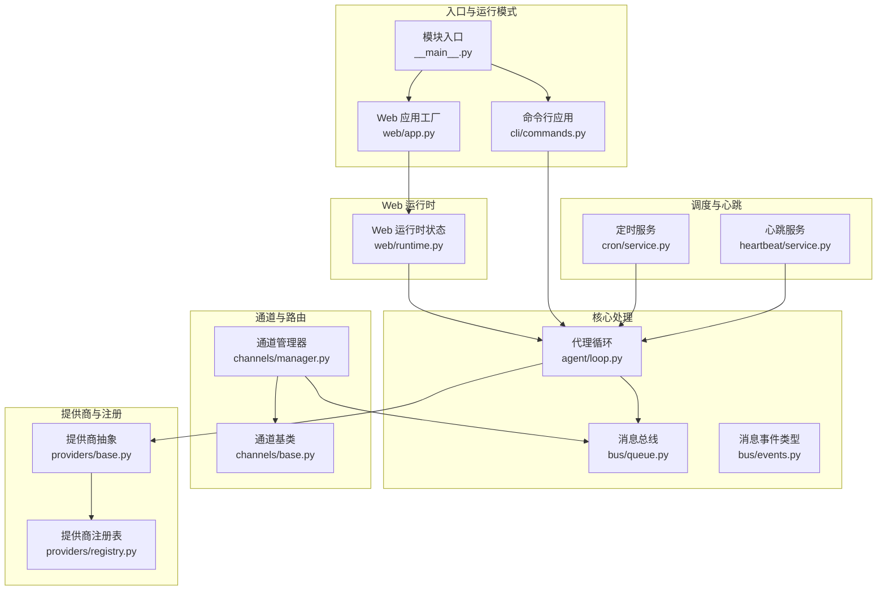
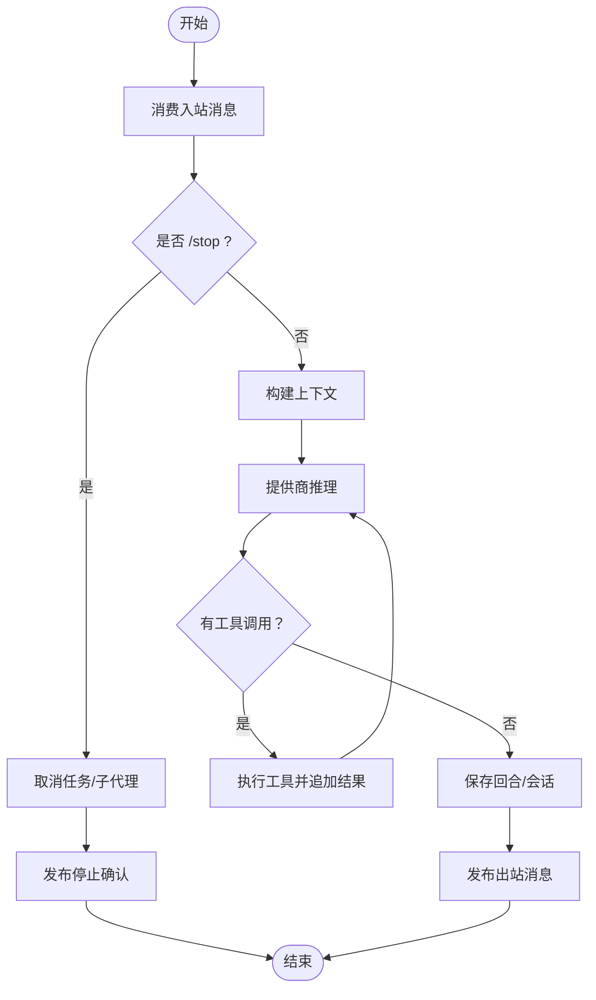
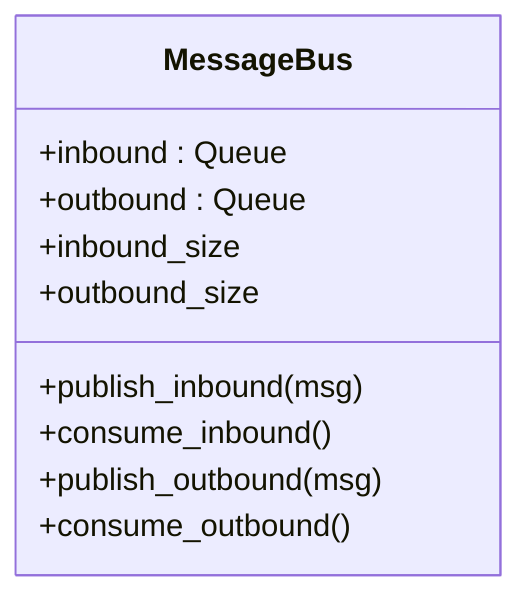
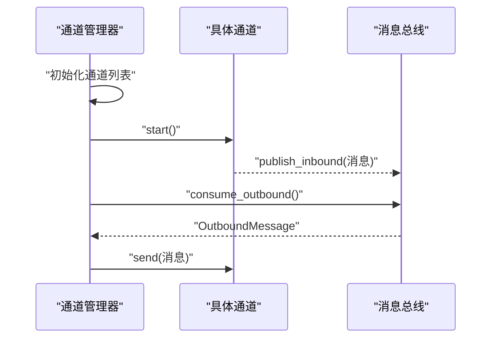
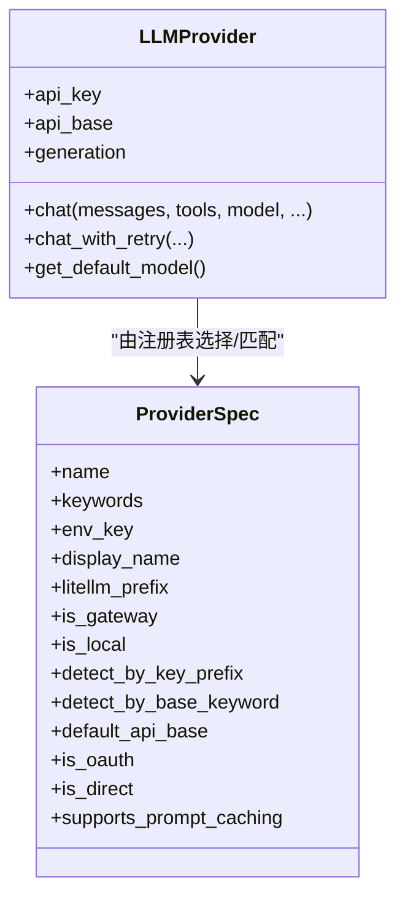
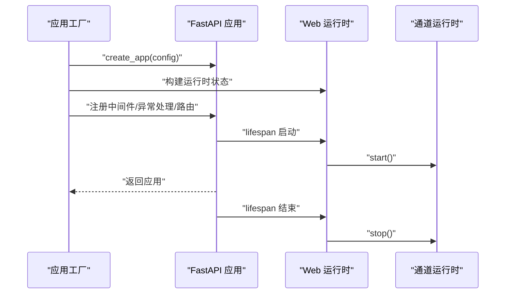
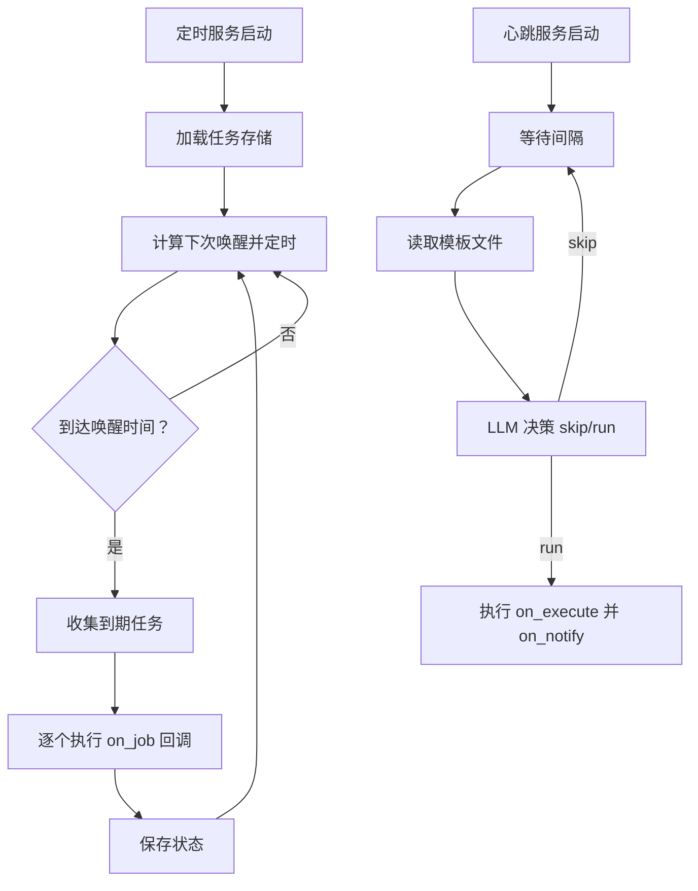
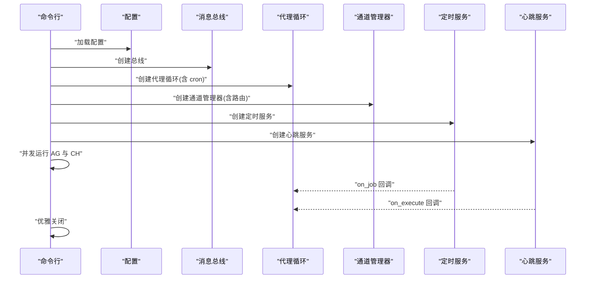
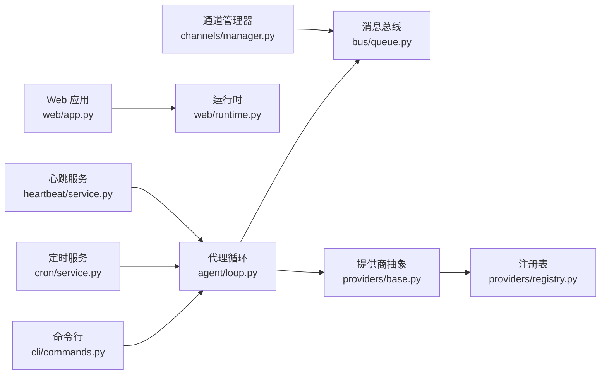

# 组件交互关系

<cite>
**本文引用的文件**
- [nanobot/__main__.py](file://nanobot/__main__.py)
- [nanobot/web/app.py](file://nanobot/web/app.py)
- [nanobot/web/runtime.py](file://nanobot/web/runtime.py)
- [nanobot/web/routers/agents.py](file://nanobot/web/routers/agents.py)
- [nanobot/agent/loop.py](file://nanobot/agent/loop.py)
- [nanobot/bus/events.py](file://nanobot/bus/events.py)
- [nanobot/bus/queue.py](file://nanobot/bus/queue.py)
- [nanobot/channels/base.py](file://nanobot/channels/base.py)
- [nanobot/channels/manager.py](file://nanobot/channels/manager.py)
- [nanobot/providers/base.py](file://nanobot/providers/base.py)
- [nanobot/providers/registry.py](file://nanobot/providers/registry.py)
- [nanobot/cli/commands.py](file://nanobot/cli/commands.py)
- [nanobot/cron/service.py](file://nanobot/cron/service.py)
- [nanobot/heartbeat/service.py](file://nanobot/heartbeat/service.py)
- [nanobot/platform/instances/service.py](file://nanobot/platform/instances/service.py)
</cite>

## 目录
1. [简介](#简介)
2. [项目结构](#项目结构)
3. [核心组件](#核心组件)
4. [架构总览](#架构总览)
5. [详细组件分析](#详细组件分析)
6. [依赖分析](#依赖分析)
7. [性能考虑](#性能考虑)
8. [故障排查指南](#故障排查指南)
9. [结论](#结论)
10. [附录](#附录)

## 简介
本文件聚焦于 nanobot 的组件交互关系，系统性阐述代理循环、消息总线、Web 服务与提供商之间的协作模式，覆盖组件初始化顺序、生命周期管理、资源清理机制、事件与错误传播路径、解耦设计与依赖注入实践，并给出系统级集成测试与端到端验证建议。

## 项目结构
- 命令行入口通过模块入口脚本启动 Typer 应用，支持网关模式（通道+代理循环）与 Web UI 模式。
- Web UI 使用 FastAPI 构建，应用工厂在生命周期中装配平台服务、运行时状态与中间件。
- 核心处理引擎是代理循环，它通过消息总线与多渠道适配器解耦。
- 提供商层抽象统一不同 LLM 接口，注册表负责模型/网关/本地检测与前缀路由。
- 定时与心跳服务作为外部触发源参与任务调度与周期性唤醒。



图表来源
- [nanobot/__main__.py:1-9](file://nanobot/__main__.py#L1-L9)
- [nanobot/cli/commands.py:308-679](file://nanobot/cli/commands.py#L308-L679)
- [nanobot/web/app.py:70-280](file://nanobot/web/app.py#L70-L280)
- [nanobot/web/runtime.py:72-301](file://nanobot/web/runtime.py#L72-L301)
- [nanobot/agent/loop.py:35-541](file://nanobot/agent/loop.py#L35-L541)
- [nanobot/bus/queue.py:8-45](file://nanobot/bus/queue.py#L8-L45)
- [nanobot/bus/events.py:8-39](file://nanobot/bus/events.py#L8-L39)
- [nanobot/channels/base.py:15-135](file://nanobot/channels/base.py#L15-L135)
- [nanobot/channels/manager.py:52-209](file://nanobot/channels/manager.py#L52-L209)
- [nanobot/providers/base.py:69-271](file://nanobot/providers/base.py#L69-L271)
- [nanobot/providers/registry.py:19-466](file://nanobot/providers/registry.py#L19-L466)
- [nanobot/cron/service.py:63-448](file://nanobot/cron/service.py#L63-L448)
- [nanobot/heartbeat/service.py:40-174](file://nanobot/heartbeat/service.py#L40-L174)

章节来源
- [nanobot/__main__.py:1-9](file://nanobot/__main__.py#L1-L9)
- [nanobot/cli/commands.py:308-679](file://nanobot/cli/commands.py#L308-L679)
- [nanobot/web/app.py:70-280](file://nanobot/web/app.py#L70-L280)
- [nanobot/web/runtime.py:72-301](file://nanobot/web/runtime.py#L72-L301)

## 核心组件
- 消息总线：异步队列承载入站/出站消息，解耦通道与代理循环。
- 代理循环：接收入站消息、构建上下文、调用提供商、执行工具、发送出站消息。
- 通道管理器：发现并启动可用通道，统一分发出站消息；可选注入路由元数据。
- 通道基类：定义通道接入协议（启动/停止/发送/权限校验/音频转写）。
- 提供商抽象：统一聊天接口、重试策略、请求清洗、默认参数。
- 提供商注册表：按模型关键字/网关/本地检测匹配提供商，决定前缀与行为。
- Web 应用工厂：装配平台服务、运行时状态、中间件与路由，管理生命周期。
- Web 运行时状态：聚合聊天/配置/日程/工作区等运行时服务，协调关闭流程。
- 定时服务：基于文件存储的任务计划，周期触发回调。
- 心跳服务：周期性读取模板文件，通过虚拟工具决策是否执行任务。

章节来源
- [nanobot/bus/queue.py:8-45](file://nanobot/bus/queue.py#L8-L45)
- [nanobot/agent/loop.py:35-541](file://nanobot/agent/loop.py#L35-L541)
- [nanobot/channels/manager.py:52-209](file://nanobot/channels/manager.py#L52-L209)
- [nanobot/channels/base.py:15-135](file://nanobot/channels/base.py#L15-L135)
- [nanobot/providers/base.py:69-271](file://nanobot/providers/base.py#L69-L271)
- [nanobot/providers/registry.py:19-466](file://nanobot/providers/registry.py#L19-L466)
- [nanobot/web/app.py:70-280](file://nanobot/web/app.py#L70-L280)
- [nanobot/web/runtime.py:72-301](file://nanobot/web/runtime.py#L72-L301)
- [nanobot/cron/service.py:63-448](file://nanobot/cron/service.py#L63-L448)
- [nanobot/heartbeat/service.py:40-174](file://nanobot/heartbeat/service.py#L40-L174)

## 架构总览
下图展示从 Web 请求到代理循环再到提供商与通道的完整调用链路与数据流。

```mermaid
sequenceDiagram
participant Client as "客户端/浏览器"
participant Web as "Web 应用<br/>web/app.py"
participant RT as "Web 运行时<br/>web/runtime.py"
participant Bus as "消息总线<br/>bus/queue.py"
participant Loop as "代理循环<br/>agent/loop.py"
participant Prov as "提供商<br/>providers/base.py"
participant ChMgr as "通道管理器<br/>channels/manager.py"
Client->>Web : "HTTP 请求"
Web->>RT : "访问运行时服务"
RT-->>Web : "返回运行时数据/操作结果"
Web-->>Client : "JSON 响应"
Note over Client,ChMgr : "用户通过通道发送消息"
ChMgr->>Bus : "publish_inbound(InboundMessage)"
Bus-->>Loop : "consume_inbound()"
Loop->>Prov : "chat_with_retry(messages, tools)"
Prov-->>Loop : "LLMResponse"
Loop->>Loop : "执行工具/保存会话"
Loop->>Bus : "publish_outbound(OutboundMessage)"
Bus-->>ChMgr : "consume_outbound()"
ChMgr->>ChMgr : "根据配置过滤进度/提示"
ChMgr->>Client : "发送响应"
```

图表来源
- [nanobot/web/app.py:70-280](file://nanobot/web/app.py#L70-L280)
- [nanobot/web/runtime.py:72-301](file://nanobot/web/runtime.py#L72-L301)
- [nanobot/bus/queue.py:8-45](file://nanobot/bus/queue.py#L8-L45)
- [nanobot/agent/loop.py:35-541](file://nanobot/agent/loop.py#L35-L541)
- [nanobot/providers/base.py:69-271](file://nanobot/providers/base.py#L69-L271)
- [nanobot/channels/manager.py:52-209](file://nanobot/channels/manager.py#L52-L209)

## 详细组件分析

### 代理循环（AgentLoop）
- 职责：接收入站消息、构建上下文、调用提供商、执行工具、发送出站消息、会话与内存整理。
- 关键点：
  - 工具注册与上下文设置，支持消息/Spawn/Cron 等工具的路由上下文。
  - 与提供商的重试策略配合，避免瞬时错误导致失败。
  - 支持 /stop 取消当前会话下的所有任务与子代理。
  - 与 MCP 服务器的延迟连接与异常恢复。
- 数据流：入站消息 → 上下文构建 → LLM 推理 → 工具调用 → 保存回合 → 出站消息。



图表来源
- [nanobot/agent/loop.py:289-541](file://nanobot/agent/loop.py#L289-L541)

章节来源
- [nanobot/agent/loop.py:35-541](file://nanobot/agent/loop.py#L35-L541)

### 消息总线（MessageBus）
- 职责：提供异步队列承载入站/出站消息，暴露阻塞式消费与非阻塞发布。
- 设计要点：解耦通道与代理循环，支持并发与背压控制。



图表来源
- [nanobot/bus/queue.py:8-45](file://nanobot/bus/queue.py#L8-L45)

章节来源
- [nanobot/bus/queue.py:8-45](file://nanobot/bus/queue.py#L8-L45)

### 通道管理器（ChannelManager）
- 职责：动态发现并启动通道，统一分发出站消息；可选通过路由代理增强入站消息元数据。
- 关键点：并发启动通道、优雅停止、按配置过滤进度/提示消息。



图表来源
- [nanobot/channels/manager.py:52-209](file://nanobot/channels/manager.py#L52-L209)
- [nanobot/channels/base.py:15-135](file://nanobot/channels/base.py#L15-L135)
- [nanobot/bus/queue.py:8-45](file://nanobot/bus/queue.py#L8-L45)

章节来源
- [nanobot/channels/manager.py:52-209](file://nanobot/channels/manager.py#L52-L209)
- [nanobot/channels/base.py:15-135](file://nanobot/channels/base.py#L15-L135)

### 提供商抽象与注册表（LLMProvider + Registry）
- 抽象层：统一 chat/chat_with_retry、默认参数 GenerationSettings、请求清洗与重试策略。
- 注册表：按模型关键字/网关/本地检测匹配提供商，决定前缀与行为，支持 OAuth 与直连模式。



图表来源
- [nanobot/providers/base.py:69-271](file://nanobot/providers/base.py#L69-L271)
- [nanobot/providers/registry.py:19-466](file://nanobot/providers/registry.py#L19-L466)

章节来源
- [nanobot/providers/base.py:69-271](file://nanobot/providers/base.py#L69-L271)
- [nanobot/providers/registry.py:19-466](file://nanobot/providers/registry.py#L19-L466)

### Web 应用工厂与运行时（FastAPI + WebAppState）
- 应用工厂：装配平台服务、运行时状态、认证与租户中间件、异常处理器、前端静态/开发服务。
- 生命周期：lifespan 中初始化并绑定运行时，启动通道运行时；关闭时依次清理。
- 路由：集中挂载各业务路由，Web 层通过 app.state 访问服务。



图表来源
- [nanobot/web/app.py:70-280](file://nanobot/web/app.py#L70-L280)
- [nanobot/web/runtime.py:72-301](file://nanobot/web/runtime.py#L72-L301)

章节来源
- [nanobot/web/app.py:70-280](file://nanobot/web/app.py#L70-L280)
- [nanobot/web/runtime.py:72-301](file://nanobot/web/runtime.py#L72-L301)

### 定时与心跳（CronService + HeartbeatService）
- 定时服务：基于文件存储的任务计划，支持 at/every/cron 三种调度，自动重算下次运行时间。
- 心跳服务：周期读取模板文件，通过虚拟工具决策是否执行任务，再通过回调执行并通知。



图表来源
- [nanobot/cron/service.py:63-448](file://nanobot/cron/service.py#L63-L448)
- [nanobot/heartbeat/service.py:40-174](file://nanobot/heartbeat/service.py#L40-L174)

章节来源
- [nanobot/cron/service.py:63-448](file://nanobot/cron/service.py#L63-L448)
- [nanobot/heartbeat/service.py:40-174](file://nanobot/heartbeat/service.py#L40-L174)

### 命令行网关模式（CLI gateway）
- 初始化：加载配置、创建消息总线、提供商、会话管理器、定时/心跳/通道路由服务。
- 启动：并发运行代理循环与通道管理器；定时回调通过代理循环执行消息。
- 关闭：依次关闭 MCP、心跳、定时、代理循环与通道。



图表来源
- [nanobot/cli/commands.py:308-679](file://nanobot/cli/commands.py#L308-L679)

章节来源
- [nanobot/cli/commands.py:308-679](file://nanobot/cli/commands.py#L308-L679)

## 依赖分析
- 组件内聚与耦合：
  - 代理循环与提供商强耦合（通过抽象接口），弱耦合于通道与总线。
  - 通道管理器仅依赖总线与通道基类，便于扩展新通道。
  - Web 应用工厂通过 app.state 注入平台服务与运行时，形成集中依赖。
- 外部依赖：
  - FastAPI/Starlette（Web）、loguru（日志）、asyncio（并发）、zoneinfo/croniter（定时）。
- 循环依赖：
  - 未见直接循环导入；运行时通过 app.state 引用服务，避免运行时循环。



图表来源
- [nanobot/cli/commands.py:308-679](file://nanobot/cli/commands.py#L308-L679)
- [nanobot/web/app.py:70-280](file://nanobot/web/app.py#L70-L280)
- [nanobot/web/runtime.py:72-301](file://nanobot/web/runtime.py#L72-L301)
- [nanobot/agent/loop.py:35-541](file://nanobot/agent/loop.py#L35-L541)
- [nanobot/bus/queue.py:8-45](file://nanobot/bus/queue.py#L8-L45)
- [nanobot/channels/manager.py:52-209](file://nanobot/channels/manager.py#L52-L209)
- [nanobot/providers/base.py:69-271](file://nanobot/providers/base.py#L69-L271)
- [nanobot/providers/registry.py:19-466](file://nanobot/providers/registry.py#L19-L466)
- [nanobot/cron/service.py:63-448](file://nanobot/cron/service.py#L63-L448)
- [nanobot/heartbeat/service.py:40-174](file://nanobot/heartbeat/service.py#L40-L174)

章节来源
- [nanobot/cli/commands.py:308-679](file://nanobot/cli/commands.py#L308-L679)
- [nanobot/web/app.py:70-280](file://nanobot/web/app.py#L70-L280)
- [nanobot/web/runtime.py:72-301](file://nanobot/web/runtime.py#L72-L301)
- [nanobot/agent/loop.py:35-541](file://nanobot/agent/loop.py#L35-L541)
- [nanobot/bus/queue.py:8-45](file://nanobot/bus/queue.py#L8-L45)
- [nanobot/channels/manager.py:52-209](file://nanobot/channels/manager.py#L52-L209)
- [nanobot/providers/base.py:69-271](file://nanobot/providers/base.py#L69-L271)
- [nanobot/providers/registry.py:19-466](file://nanobot/providers/registry.py#L19-L466)
- [nanobot/cron/service.py:63-448](file://nanobot/cron/service.py#L63-L448)
- [nanobot/heartbeat/service.py:40-174](file://nanobot/heartbeat/service.py#L40-L174)

## 性能考虑
- 并发与背压：消息总线采用异步队列，通道并发启动与代理循环按任务粒度调度，避免阻塞。
- 重试与降级：提供商层内置重试与瞬时错误识别，降低外部波动影响。
- 会话与内存：代理循环在回合后进行内存整理，限制工具结果长度，减少上下文膨胀。
- I/O 优化：音频转写使用独立提供商，失败不阻塞主流程。
- 前缀与路由：注册表按网关/本地优先级匹配，减少无效请求与错误重试。

## 故障排查指南
- Web 异常处理：
  - 自定义 API 错误、请求验证错误、HTTP 异常分别映射为标准 JSON 响应。
  - 认证中间件对非 API 路径放行，对受保护路径进行 Cookie 校验。
- 代理循环错误：
  - 任务取消与异常捕获，向出站总线发布“抱歉”消息，避免崩溃传播。
  - /stop 命令取消当前会话下所有活动任务与子代理。
- 通道问题：
  - 允许列表为空时拒绝访问；启动失败记录错误但不影响其他通道。
  - 出站分发阶段对未知通道发出警告。
- 提供商错误：
  - chat_with_retry 对瞬时错误自动重试，非瞬时错误直接返回。
  - 请求内容清洗避免空字符串导致的 400 错误。
- 定时与心跳：
  - 任务执行异常记录错误并更新状态；心跳失败不影响主循环。

章节来源
- [nanobot/web/app.py:205-246](file://nanobot/web/app.py#L205-L246)
- [nanobot/agent/loop.py:308-356](file://nanobot/agent/loop.py#L308-L356)
- [nanobot/channels/manager.py:115-159](file://nanobot/channels/manager.py#L115-L159)
- [nanobot/providers/base.py:187-266](file://nanobot/providers/base.py#L187-L266)
- [nanobot/cron/service.py:247-279](file://nanobot/cron/service.py#L247-L279)
- [nanobot/heartbeat/service.py:130-164](file://nanobot/heartbeat/service.py#L130-L164)

## 结论
该系统通过消息总线实现通道与代理循环的解耦，借助提供商抽象与注册表统一多源 LLM 接口，结合 Web 运行时集中管理平台服务与生命周期，形成高内聚、低耦合的协作架构。定时与心跳服务作为外部触发源，进一步增强了系统的自动化能力。整体设计具备良好的扩展性与可维护性，适合在多通道、多提供商、多租户场景下演进。

## 附录

### 组件初始化与生命周期清单
- Web 模式
  - 应用工厂创建 FastAPI 实例，注册中间件与路由。
  - lifespan 中初始化平台服务、运行时状态、通道运行时并启动。
  - 关闭时依次关闭通道运行时、日程运行时、团队运行时与 MCP。
- 网关模式
  - 加载配置，创建消息总线、提供商、会话管理器、定时/心跳/通道路由服务。
  - 并发运行代理循环与通道管理器，优雅关闭时依次释放资源。

章节来源
- [nanobot/web/app.py:148-185](file://nanobot/web/app.py#L148-L185)
- [nanobot/web/runtime.py:289-295](file://nanobot/web/runtime.py#L289-L295)
- [nanobot/cli/commands.py:661-678](file://nanobot/cli/commands.py#L661-L678)

### 事件与错误传播路径
- 入站事件：通道 → 总线 → 代理循环 → 工具执行 → 出站事件。
- 错误传播：提供商瞬时错误自动重试；代理循环捕获异常并回传“抱歉”消息；Web 层统一映射为 JSON 响应。

章节来源
- [nanobot/agent/loop.py:234-287](file://nanobot/agent/loop.py#L234-L287)
- [nanobot/providers/base.py:192-266](file://nanobot/providers/base.py#L192-L266)
- [nanobot/web/app.py:205-246](file://nanobot/web/app.py#L205-L246)

### 解耦设计与依赖注入
- 接口抽象：提供商统一接口、通道基类协议、运行时状态聚合。
- 依赖注入：Web 应用工厂通过 app.state 注入服务；CLI 在运行时构造对象。
- 配置驱动：提供商注册表与通道配置决定行为，无需硬编码。

章节来源
- [nanobot/providers/base.py:69-271](file://nanobot/providers/base.py#L69-L271)
- [nanobot/providers/registry.py:19-466](file://nanobot/providers/registry.py#L19-L466)
- [nanobot/channels/base.py:15-135](file://nanobot/channels/base.py#L15-L135)
- [nanobot/web/app.py:70-280](file://nanobot/web/app.py#L70-L280)

### 系统集成测试与端到端验证
- 单元测试：覆盖提供商重试、通道权限校验、定时任务增删改查、心跳决策流程。
- 集成测试：Web 路由与运行时状态一致性、代理循环与总线交互、通道管理器并发启动与停止。
- 端到端验证：Web UI 与 CLI 网关模式下，从消息入站到出站响应的完整链路，包括 /stop、/new、/help 等命令与工具调用。

章节来源
- [nanobot/web/routers/agents.py:43-162](file://nanobot/web/routers/agents.py#L43-L162)
- [nanobot/agent/loop.py:414-437](file://nanobot/agent/loop.py#L414-L437)
- [nanobot/cron/service.py:296-425](file://nanobot/cron/service.py#L296-L425)
- [nanobot/heartbeat/service.py:85-164](file://nanobot/heartbeat/service.py#L85-L164)